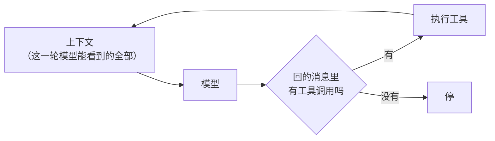
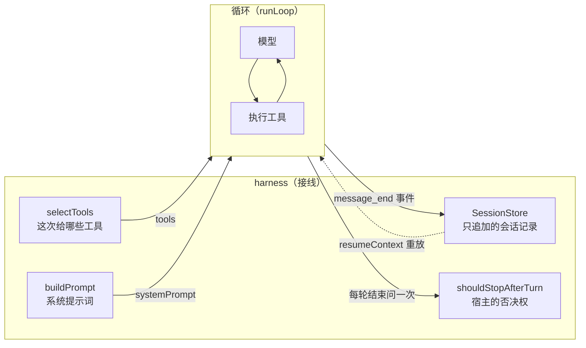
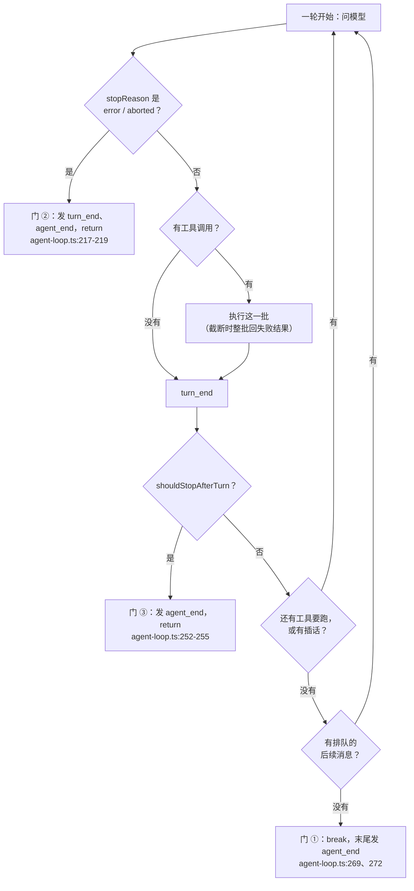

# 第 1 章 Code Agent 是什么

> 基准：pi `b79e4cc8` (v0.84.4)　·　[版本表](../../research/BASELINE.md)　·　[参与指南](../../CONTRIBUTING.md)

**状态**：✅ 已完成

## 本章回答

- 「Code Agent」这四个字拆开之后，剩下哪几样东西
- harness 和 agent 的分界画在哪一行，为什么这条线决定了你后续所有改动的落点
- 一次运行有哪几条出口，以及哪一条**看起来像出口其实不是**
- 一条可以拿去反驳的分层规则：按什么把源码树切成四层，换掉哪一层最贵
- 本书讨论的是哪一类 Code Agent，不讨论哪一类

## 素材来源

- 新写 + [`examples/ch01-anatomy/`](../../examples/ch01-anatomy/)
- `research/pi/03-agent-loop.md`（三层结构、双层循环）
- `research/pi/02-architecture-and-guardrails.md`（分层与守卫）
- 对照：`Step-Code` `7dd66cb9`（同一上游的 fork，主循环几乎没动，见 1.8）

（pi 的路径以 `packages/` 为根：`agent/src/` 指 `packages/agent/src/`，`coding-agent/src/` 指 `packages/coding-agent/src/`，`ai/src/` 指 `packages/ai/src/`。本章带 `【代码事实】` 的是在源码里逐行核对过的，带 `【实机】` 的是在 `examples/ch01-anatomy/` 里跑出来的。）

---

「Code Agent」是个被用滥了的词。产品页上它指一个能改代码的对话框，招聘启事上它指一个岗位，论文里它指一整套方法。这三种用法互相打架，所以第一个问题得先问清楚：**当我们说一个东西是 Code Agent，我们到底在断言它有什么？**

这一章不引用任何一篇论文，也不用任何一家的架构图。用的办法是把它拆开，看拆到最后还剩几样零件——**零件少于四样的东西，不管它界面多像，都不是这一类**；零件多于四样的，多半是把某一样零件拆细了，或者干脆是另一个东西。

拆完之后再看第二件事：这四样里，哪一样是「循环」，哪一样是「循环外面的那一圈」。这个区分看起来只是命名问题，实际上它决定了你后面每一个改动的落点——包括那些你以为在改工具、其实在改产品的改动。

不排名次，只回答「谁选了什么、代价是什么」。

先看几个数字：

| 数字 | 是什么 | 出处 |
| --- | --- | --- |
| **4** | 拆到最后剩下的零件：模型、工具、上下文、停止条件。缺一样就不成循环 | 1.1 |
| **794** | pi 里驱动这四样转起来的那个文件的行数 | `agent/src/agent-loop.ts` |
| **60,960** | 同一个仓库里产品包的行数，是内核的 76 倍 | `packages/coding-agent` |
| **43** | Step-Code 的 833 行主循环与 pi 794 行的差异行数（删 2、加 41）——**其中一处只是改包名** | `Step-Code:packages/agent-core/src/agent-loop.ts` |
| **5** | 一次运行停下来的方式：正常收尾、工具要求停、模型报错、宿主叫停，加上本例自加的轮数上限 | 1.5 |
| **4** | 拆源码树用的层：provider / runtime / harness / product | 1.7 |

---

## 1.1 拆到只剩四样

先做一个减法。

一个东西要在没人看着的时候自己改代码，最少需要什么？

**第一样：一个模型。** 它得能读一段文本，然后决定下一步做什么。这一步不能是人做的——人做的叫编辑器宏，不叫 Agent。

**第二样：一组能碰到真实世界的动作。** 模型只会输出文本。如果它输出的文本除了被人读之外没有别的效果，那它是个聊天机器人。要成为 Agent，输出的文本里得有一部分的**含义是「去做一件事」**，并且真的有人去做。这一组动作叫工具。

**第三样：一份它这一轮能看到的上下文。** 模型没有记忆。上一轮读了哪个文件、报了什么错，这一轮必须重新喂给它。喂什么、按什么顺序喂、喂多少，是单独的一件事。

**第四样：一个「到此为止」的判据。** 模型说「我做完了」是一种判据，模型又调了一次工具是另一种。少了这个，程序不会停——不是转得慢，是不会停。

这四样凑齐之后，它们的接法几乎是唯一的：

```
把上下文交给模型 → 模型回一条消息
                       ├── 消息里有动作 → 做它，把结果并进上下文，回到第一步
                       └── 消息里没有动作 → 停
```

就这么长。这个「回到第一步」就是**循环**（loop），也是这个词第一次在本书里出现的地方。



*图 1-1 四样零件与唯一合理的接法。循环本身只是中间那条回边*

减法做到这里会出现一种错觉：既然只有四样，那写一个 Code Agent 应该是半天的事。

**四样零件确实简单，难的是每一轮里那些「不在这四样里、但必须有答案」的问题。** 比如：

- 这一次给模型看哪些工具？全部给，还是只给只读的几个？
- 系统提示词从哪来？项目里的 `AGENTS.md` 算不算？
- 这次对话的历史存不存？存了之后怎么读回来？
- 上下文快满了怎么办？谁来决定丢哪一段？
- 用户中途改了主意，新说的话什么时候递给模型？

这五个问题，循环一个都回答不了——**它连「用户」是什么都不知道**。但它也不能不回答：这些问题的答案会以「上下文长什么样」「给模型看哪些工具」的形式，出现在循环每一次迭代的输入里。

所以真正要画的那条线，不在「有哪些零件」，而在「谁负责回答这五个问题」。

## 1.2 裸循环与 harness

先把没有答案的那一版跑出来看。

`examples/ch01-anatomy/src/loop.ts` 是一个 221 行的循环。它只做四样零件那件事：

```
// loop.ts：整个循环的全部（省略号处是工具执行，见下一段）
export function runLoop(options: RunLoopOptions): LoopResult {
	const emit: EventSink = options.emit ?? (() => {});
	const maxTurns = options.maxTurns ?? Number.POSITIVE_INFINITY;
	const prompts = options.prompts ?? [];

	// 上下文是不可变的：每一步都产出新的数组，而不是往老数组里 push。
	// pi 在这里用的是可变数组（`currentContext.messages.push(...)`，
	// `agent-loop.ts:205`）——那是为长会话的性能做的取舍，见 1.7 的规则表。
	let messages: readonly Message[] = [...options.context.messages, ...prompts];
	let turns = 0;
	const finish = (stopKind: StopKind): LoopResult => {
		emit({ type: "agent_end", messages });
		return { messages, stopKind, turns };
	};

	emit({ type: "agent_start" });
	emit({ type: "turn_start" });
	for (const prompt of prompts) announce(prompt, emit);

	// 外层循环：每转一圈是「一轮」。pi 的外层在 `agent-loop.ts:171`，内层在 175。
	while (true) {
		if (turns >= maxTurns) return finish("max_turns");
		if (turns > 0) emit({ type: "turn_start" });
		turns += 1;

		const reply = options.model({ ...options.context, messages });
```


这段代码里没有一处提到「代码」。它不知道 `read` 是什么，不知道目录结构，不知道什么叫编辑，也不知道系统提示词该写什么——`systemPrompt` 是传进来的一个字符串，循环只负责把它原样交给模型。

跑一遍看事件顺序：

```bash
cd examples/ch01-anatomy && npm start -- bare
```

```
// main.ts：把循环吐出来的事件逐条打出来
function printEvents(events: readonly AgentEvent[]): void {
	for (const event of events) {
		switch (event.type) {
			case "turn_end":
				console.log(`    turn_end（${event.toolResults.length} 条工具结果）`);
				break;
			case "message_start":
				console.log(`    message_start（${event.message.role}）`);
				break;
			case "message_end":
				console.log(`    message_end（${event.message.role}）`);
				break;
			case "tool_execution_start":
				console.log(`    tool_execution_start  ${event.toolName}`);
				break;
			case "tool_execution_end":
				console.log(`    tool_execution_end    ${event.toolName}${event.isError ? "（失败）" : ""}`);
				break;
			default:
				console.log(`    ${event.type}`);
		}
	}
}
```


```
    agent_start
    turn_start
    message_start（assistant）
    message_end（assistant）
    tool_execution_start  list_dir
    tool_execution_end    list_dir
    message_start（toolResult）
    message_end（toolResult）
    turn_end（1 条工具结果）
    turn_start
    message_start（assistant）
    message_end（assistant）
    turn_end（0 条工具结果）
    agent_end

停止原因：no_tool_calls，轮数：2，消息：3 条
```

【实机】十四行事件，两次 `turn_start`。「轮」（turn）的边界很清楚：**一次模型回答，加上这次回答引发的所有工具执行，算一轮**。pi 的类型定义里也是这么写的——`turn_end` 的注释就是 "a turn is one assistant response + any tool calls/results"【代码事实】`agent/src/types.ts:433`。

现在把同样三个工具套上一层接线，再跑一遍：

```bash
npm start -- harness --path .
```

多出来的东西是四块，一块对应 1.1 末尾的一个问题：

| 多出来的 | 它回答的问题 | 对应代码 |
| --- | --- | --- |
| `selectTools` | 这一次给哪些工具 | `harness.ts:40-58` |
| `buildPrompt` / `toolSnippets` | 系统提示词从哪来 | `harness.ts:83-99` |
| `SessionStore` / `resumeContext` | 历史存不存、怎么读回来 | `harness.ts:103-141` |
| `maxTurns` / `shouldStopAfterTurn` | 什么时候该拦一下 | `harness.ts:145-163` |

*表 1-1 harness 比裸循环多出来的四块*

这四块就是**harness**。画出来是这样——循环被包在中间，harness 在它进去之前准备输入，在它出来的每一步订阅事件：



*图 1-2 harness 包住循环：输入从左边进，事件从右边出。循环本身不知道外面有几块*

关于这个词，先纠正一个常见误解：**harness 不是「框架」，也不是「产品」。** 它原本是马具的意思——套在马身上、把马的力量接到车上的那套皮带。接到 Code Agent 上，它接的是循环和具体场景：循环提供「转」的能力，harness 决定这次转起来具体长什么样。

pi 的仓库里，这三层的名字是分开的：

| 层 | 位置 | 行数 | 它的职责 |
| --- | --- | ---: | --- |
| 循环 | `agent/src/agent-loop.ts` | 794 | 转 |
| harness | `agent/src/harness/` | 10,065 | 接线 |
| 产品 | `coding-agent/src/` | 60,960 | 人看的那个东西 |

*表 1-2 pi 里循环、harness、产品三处的位置与行数*

【代码事实】三处行数按 [BASELINE 的口径](../../research/BASELINE.md#行数怎么量) 数出来，可以用本章的 `layers` 子命令复算。

所以「harness」这个词在 pi 里有两层含义，读文档时会撞上：

- **一层是目录名**：`agent/src/harness/`，指那 10,065 行接线代码所在的文件夹。
- **一层是产品定位**：README 第一句 "Pi is a minimal terminal coding harness"。这里的 harness 指的是**整个产品相对于它上游的模型**——模型是马，pi 是那套皮带。

同一个词，一处指文件夹，一处指整个产品。本章说的是第一种。第 8 章会看到第二种用法的后果。

## 1.3 794 行里没有一处产品逻辑

上一节的表里，794 和 10,065 差了一个数量级。这个差距不是「循环写得短」，是**有意的切分**。

判断切分干不干净，有一个很快的办法：**看这个文件 import 了什么**。

```
// agent-loop.ts 的 import：全部来自协议层与类型，没有一处来自产品包
/**
 * Agent loop that works with AgentMessage throughout.
 * Transforms to Message[] only at the LLM call boundary.
 */

import {
	type AssistantMessage,
	type Context,
	EventStream,
	type ToolResultMessage,
	validateToolArguments,
} from "@earendil-works/pi-ai";
import { getDefaultStreamFn } from "./stream-fn.ts";
import type {
```


【代码事实】这个文件只从 `@earendil-works/pi-ai`（协议与消息类型）和同包的 `./types.ts` 取东西。它没有 import 编码器的实现、没有 import 会话存储、没有 import 扩展系统、没有 import 设置管理器。

那条线就画在这里：

```
        循环知道                                    循环不知道
  ─────────────────────────────              ─────────────────────────────
  消息有几种角色                              消息从哪来、存到哪去
  工具调用长什么样                            有哪些工具、谁给它的权限
  「这一轮结束了」是什么意思                   一轮结束该不该继续
  怎么把结果并回上下文                         结果要不要压缩、要不要脱敏
```

右边那一列，就是 harness 和产品层的全部工作。

**这条线的价值在于它是可验证的。** 你不用相信任何架构文档，只要 grep 一下循环文件的 import，看它有没有碰到产品包。碰了，这条线就是假的。

上游的 fork 反过来印证了这一点。Step-Code 是把 pi 整体重命名、改名发布的下游，它的主循环是 833 行，比 pi 多 39 行：

```bash
diff pi/packages/agent/src/agent-loop.ts Step-Code/packages/agent-core/src/agent-loop.ts
```

`diff` 输出里一共 43 个差异行（删 2 行、加 41 行），落在三个位置：

| 位置 | 差异 | 是什么 |
| --- | --- | --- |
| 第 12 行 | import 从上游包名改成自家包名 | 改名 |
| 第 212 行起 | 多了一段「工具调用标记泄漏」的重采样 | 新增功能，见下 |
| 第 292 行起 | 上面那段用到的常量与判定函数 | 同上 |

*表 1-3 Step-Code 主循环与 pi 的 43 行差异*

【代码事实】也就是说，**一个厂商把 pi 拿去做自己的产品，对主循环的功能性改动只有一处**，其余全是重命名。第 212 行那处新增解决的问题是：某些服务端的工具解析器会失败，把模型的 `<tool_call>` 标记原样留在文本里，于是这一轮没有任何可执行的调用，循环就以为模型说完了、准备退出。Step-Code 的做法是在这种情况下把这段回答从请求上下文里丢掉、用同样的上下文重采样，默认最多两次。

改的是循环，因为**这个故障只在循环这一层看得见**：harness 拿到的是「一条没有工具调用的助手消息」，它分辨不出这是「模型真的说完了」还是「标记泄漏了」。这个判断需要知道「这一轮本该有工具调用」，只有循环有这份上下文。

这也顺带回答了「什么该放进循环」：**不是「和代码有关的」就该出去，而是「只有循环能判断的」才该进来**。

## 1.4 一条不变式：这次进上下文的消息都发 message_end

循环往外吐事件。事件是它唯一的对外接口——会话记录、界面刷新、遥测、扩展，全都订阅这一条流。

事件种类不多，但有一条规则值得单独拎出来，因为它决定了外面能不能只订阅一个事件就把事情做对：

> **凡是这次运行里进入上下文的消息，不管是用户、助手还是工具结果，都发一对 `message_start` / `message_end`。**

【代码事实】pi 的类型定义里这句是原话注释："Message lifecycle - emitted for user, assistant, and toolResult messages"（`agent/src/types.ts:436`）。工具结果那一对不在主循环里，在它调用的工具函数里发（`agent-loop.ts:791-794`）；用户消息（术语叫 prompt）那一对则由入口函数在开跑之前发（`agent-loop.ts:112-115`）。

这条规则看起来只是「事件发全一点」，实际作用大得多。有了它：

```
          进入上下文的消息   ==   收到过 message_end 的消息
```

两边严格相等，于是**会话记录只需要订阅一个事件**：

```
// harness.ts：订阅 message_end 就够了
	const result = runLoop({
		model: options.model,
		tools: selection.active,
		context,
		prompts: [userMessage],
		maxTurns: options.maxTurns,
		shouldStopAfterTurn: options.shouldStopAfterTurn,
		// 会话记录跟着事件走，而不是跟着循环的内部状态走。
		// 能只订阅 message_end，靠的是循环那条不变式：这次进上下文的消息
		// ——用户、助手、工具结果——每条都发一次（`agent/src/types.ts:436`）。
		// 少了任何一种，重放出来的历史就缺一块，而且不会报错（1.4 节）。
		emit: (event) => {
			if (event.type === "message_end") {
				options.session.append({ kind: "message", message: event.message });
			}
		},
	});
```


跑出来的会话记录是 8 条，读回来 6 条消息，跟内存里完全一致：

```
会话记录 8 条：
  session
  message × 6
  stop（no_tool_calls）

从会话记录重建：6 条消息（内存里 6 条）
  对得上：true
```

【实机】8 = 1 条会话头 + 6 条消息 + 1 条停止记录，正好对上。

**违反这条不变式的代价，是错误不会当场暴露。** 本章的例子第一版就违反过：循环给助手消息发 `message_end`，工具结果却只在 `turn_end` 事件里成批带出来。于是只订阅 `message_end` 的会话记录写下来是这样：

```
user → assistant(toolCall) → assistant(toolCall) → assistant
```

工具结果一条都没有。这个文件仍然能解析、仍然能恢复会话、程序不报任何错——只是**恢复出来的历史里，模型说过「我要读这个文件」，却没有读到过文件**。上下文缺了一块，而缺的那一块恰好是唯一能和真实世界对上账的部分：工具结果里是文件内容和报错信息，模型下一步全靠它。

这种错最难查：症状是「Agent 有时候会重复做同一件事」，根因在一个你没在看的事件订阅上。修法不是加判断，是**守住不变式**——只要「进上下文」和「发 message_end」是同一件事的两面，这类错就不可能发生。

> **本章留给你的第一条判断规则：** 拿到一个循环，先问它的事件流是不是完备的——能不能只看事件就重建出完整的上下文。答不上来的，会话恢复、审计日志、回放调试都会在某个版本里悄悄出错。

## 1.5 一次运行有五种停法

「循环什么时候停」比「循环怎么转」更值得先看清楚，因为**停不下来是 Code Agent 事故里最常见的一种**，而停不下来的原因通常是：写代码的人以为只有一种停法。

pi 的循环在代码里只有**三扇门**，但有**四种**停法——其中两种走同一扇门。

**一、模型没有工具调用。** 最正常的一种。模型这次回答里只有文字，循环判断「没有活要干」，收尾退出。【代码事实】`agent-loop.ts:269` 的 `break`——外层循环跳出，函数末尾补一个 `agent_end`（`:272`）。注意走到这扇门之前还有一次检查：用户在这期间排队的后续消息（follow-up）会把循环拉回去再跑（`:259-264`）。所以「模型说完了」只是「这一段说完了」。

**二、模型报错或中止。** 【代码事实】`agent-loop.ts:215-219`：这一轮不发工具、**也不问宿主**，直接发 `turn_end` 和 `agent_end` 然后 `return`。注意它和上一处的区别：同样是结束，一个走完了「问宿主」这一步，一个跳过了。

**三、宿主叫停。** 【代码事实】`agent-loop.ts:252-255`：每一轮结束（工具跑完之后）问一次 `shouldStopAfterTurn`，返回真就发 `agent_end` 退出，**不再开下一轮模型调用**。它的意义在于：模型自己不会停的时候，外面还有一次否决权。

**四、这一批工具全部要求停。** 它不单独开门：`terminate` 为真时 `hasMoreToolCalls` 被置成假（`agent-loop.ts:235`），内层循环自然结束，最后也走 `:269` 那扇门。细节见下一节。



*图 1-3 pi 循环的三扇门。「没有工具调用」和「一批全部要求停」都从门 ① 出去*

外加本章例子自己加的一个保险：**轮数上限**。pi 的循环里没有这个开关——`maxTurns` 在本例的 `loop.ts:130`，不在 `agent-loop.ts` 里。

五种停法跑一遍：

```bash
npm start -- exits
```

```
// main.ts：五条停法的对照组
			isError: false,
			terminate: true,
		}),
	};

	const cases: readonly { readonly label: string; readonly note: string; readonly run: () => LoopResult }[] = [
		{
			label: "模型没有工具调用",
			note: "最正常的一种：模型直接回话，这一轮结束",
			run: () => runLoop({ model: scriptedModel([{ kind: "say", text: "我看完了，没什么特别的。" }]), tools: ALL_TOOLS, context }),
		},
		{
			label: "这一批工具全部要求停",
			note: "pi 用 every 判：一批里只要有一条不要求停，就继续跑",
			run: () =>
				runLoop({
					model: scriptedModel([
						{ kind: "call", name: "final_answer", args: { text: "答案是 42。" } },
					]),
					tools: [...ALL_TOOLS, finalTool],
					context,
				}),
		},
		{
			label: "模型报错",
			note: "不跑工具、不问宿主，直接退出（对照 agent-loop.ts:215-219）",
			run: () => runLoop({ model: failingModel(1), tools: ALL_TOOLS, context }),
		},
		{
			label: "宿主叫停",
			note: "每一轮结束后宿主都有一次否决权，包括没有工具调用的那一轮",
```


```
  模型没有工具调用
    停止原因 no_tool_calls，1 轮，最后一条是 assistant
  这一批工具全部要求停
    停止原因 tools_terminated，1 轮，最后一条是 toolResult
  模型报错
    停止原因 model_error，2 轮，最后一条是 assistant
  宿主叫停
    停止原因 host_stopped，1 轮，最后一条是 toolResult
  撞上轮数上限
    停止原因 max_turns，3 轮，最后一条是 toolResult
```

【实机】五种的最后一条消息分别落在不同的角色上——这本身就是一份诊断线索：**看到一个会话停得莫名其妙时，先看最后一条消息是什么角色**。是 `toolResult` 说明停在了工具之后（可能是工具要求停，也可能是宿主叫停）；是 `assistant` 说明停在模型这一侧。

有两条顺序上的细节值得记住，它们都是「看起来无所谓、出事时很关键」的类型：

- **宿主是在「一轮结束」之后被问的，包括没有工具调用的那一轮。**【代码事实】`agent-loop.ts:252` 的判断在内层每一轮的末尾，不在「有工具调用」的分支里。本章的 `loop.test.ts` 专门测了这一点：同一个宿主回调，正常那一轮被调用了一次，模型报错那一轮一次都没被调用。
- **退出前一定发 `agent_end`。**【代码事实】三扇门里有两扇（`:217-219`、`:252-255`）各自发一次再 `return`，第三扇（`:269` 的 `break`）由函数末尾统一发。对订阅方来说，`agent_end` 是「这一轮跑完了」的唯一可靠信号，不要用「多久没收到事件」来判断。

## 1.6 terminate 挂在结果上，不挂在工具上

上一节留下的第四个出口，值得单独讲，因为它是本章里最容易写错的一处设计。

有些工具天然意味着「到这里就够了」——比如一个给出最终答案的工具，或者一个交互式提问的工具。这类工具跑完之后，循环不该再开一轮问模型「还有事吗」。

朴素的做法是给工具加一个布尔字段：`stops: true`。pi 没有这么做。【代码事实】`terminate` 挂在**一次执行的结果**上，不是工具的属性（`agent/src/types.ts:372-376`），判定规则是：

```
// agent-loop.ts：一批工具的 terminate 判定
type FinalizedToolCallEntry = FinalizedToolCallOutcome | (() => Promise<FinalizedToolCallOutcome>);

function shouldTerminateToolBatch(finalizedCalls: FinalizedToolCallOutcome[]): boolean {
	return finalizedCalls.length > 0 && finalizedCalls.every((finalized) => finalized.result.terminate === true);
}
```


【代码事实】翻译过来是两句：**这一批非空**，并且**这一批里每一条都要求停**。

为什么是 `every` 而不是 `some`？因为一次模型回答可以带多个工具调用。如果按「有一个要求停就停」，那么模型同时说「给出答案」和「再读一个文件」时，那个文件就永远读不到——**模型的话被截断了一半，而且它自己不知道**。用 `every` 的语义是：只有当这一批里的每一条都同意「没事了」，才算真的没事了。

这条规则带来的直接后果是：**同一个工具，两次调用可以有不同结论。** 本章的测试用例就用了这一条：

```
// loop.test.ts：同一个工具、不同参数，结论不同

	// 都不要求停：更不会停。
	assert.equal(run([noteCall, continueCall]).stopKind, "no_tool_calls");

	// 单独一条要求停：这一批「全部」（就一条）要求停，停。
	assert.equal(run([stopCall]).stopKind, "tools_terminated");

	// 分批到达也一样：第一批要求停，但循环已经在第一批就结束了，
	// 第二批永远轮不到——**停是当轮结算的，不会攒着。**
	const batched = run([stopCall], [noteCall]);
	assert.equal(batched.stopKind, "tools_terminated");
	assert.equal(batched.turns, 1);
```


【实机】`npm test` 里这些断言都通过。注意 `run` 每次都给模型喂**一整批**调用——用按步走的脚本模型造不出「一批多条」，那样测的就不是 `every` 而是循环跑了两轮。

还有一处「停是当轮结算的」：如果第一批工具全部要求停，循环在第一批就结束了，**第二批永远不会被执行**。这不难理解，但值得写下来——因为它是「模型说要停，但还有一堆活没干」这种 bug 的来源。模型那边看起来是「我说了停它就不干了」。

pi 在这里还有一个本例没做的例外：内层循环的条件是 `hasMoreToolCalls || pendingMessages.length > 0`（`agent-loop.ts:175`）。也就是说，**这一批全部要求停，但用户恰好在这时插了一句话（steering），循环会接着跑**——人的话比工具的「停」优先。

## 1.7 输出被截断不是出口

现在讲一个**看起来像出口、其实不是**的路径。它值得单独一节，因为误解它的人不少。

模型每次回答有输出长度上限。上限撞上时，返回的 `stopReason` 是 `length` 而不是正常的 `stop`。这时助手消息里的工具调用**参数可能是半截的**——比如一个写文件的调用，路径出来了，内容只写了一半。

如果循环把这半截参数拿去执行，代价是什么？写文件的话，落盘的就是半截内容，而且**没有任何机制能发现**：工具本身没错，参数语法合法，只是模型本来想说更多。

pi 的处理是【代码事实】`agent-loop.ts:226-233`：整批**一条都不执行**，每条回一个失败结果，让模型带完整参数重发。那段失败文案在 `agent-loop.ts:394`：

```text
Tool call "…" was not executed: the response hit the output token limit, so its
arguments may be truncated. Re-issue the tool call with complete arguments.
```

关键在于函数的返回值——【代码事实】`failToolCallsFromTruncatedMessage` 最后返回 `terminate: false`（`agent-loop.ts:403`）。**也就是说截断这条路不产生退出，循环照常继续跑下一轮。**

跑出来是这样：

```
  （对照）模型输出被截断
    停止原因 no_tool_calls，2 轮——不是出口，是重来一次
    整批不执行，回给模型一条 isError 的结果，让它带完整参数重发
```

【实机】注意「2 轮」和 `no_tool_calls`：第一轮全批失败，第二轮模型重新说话、正常收尾。**这次事故在外部只表现为「多跑了一轮」**，没有任何异常。

把这条和上一节的 `terminate` 放在一起看，能看出 pi 在处理「这一批怎么办」时的同一个偏好：

| 情况 | 这一批怎么办 | 循环下一步 |
| --- | --- | --- |
| 输出截断 | 整批不执行，全部回失败结果 | 继续跑，模型自己重发 |
| 一批工具全部要求停 | 正常执行 | 停 |
| 某个工具不存在 | 这一条回失败结果，其余照常 | 继续跑，模型自己改 |
| 其中一个工具抛异常 | 这一条回失败结果 | 继续跑 |

*表 1-4 一批工具调用的四种情况*

【代码事实】四种情况里三种都是「把失败变成一条结果，交给模型处理」。这不是心软，是**把纠错责任交还给唯一有判断力的那一方**。工具宿主不该替模型决定「这个错误是不是致命的」——它没有那个信息。

## 1.8 按层称重的规则

到这里，「Code Agent 由什么组成」已经能回答了。但接下来会遇到一个实践问题：**拿到一个开源实现，或者要评估自己的仓库，怎么知道改动会落在哪一层、代价多大？**

按目录名数是不够的——`harness` 这个词在不同项目里指不同的东西（1.2 末尾说过）。本章的做法是把分层写成**规则**，每条规则带判据和理由，然后拿去跑。规则可以被反驳，这才是重点。

```
// layers.ts：四层规则表，每条带 why 与正则原文
export type Layer = "provider" | "runtime" | "harness" | "product";

export interface LayerRule {
	readonly layer: Layer;
	readonly why: string;
	/** 路径片段（任一命中即候选）。 */
	readonly pathHits: readonly RegExp[];
	/** 内容特征（任一命中即候选）。用来兜住路径没写全的情况。 */
	readonly contentHits: readonly RegExp[];
}

/**
 * 规则表。每条都写清楚「凭什么这么判」——这是这份表能被讨论的前提。
 * 表里的路径样例取自 pi，但规则本身与 pi 无关：换一个仓库，改样例不改逻辑。
 */
export const LAYER_RULES: readonly LayerRule[] = [
	{
		layer: "provider",
		why: "把某一家的 HTTP 协议翻译成统一的流式消息。换一家只影响这一层，不影响循环。",
		// pi 把这一层拆成两个目录：`ai/src/api/` 放线协议（anthropic-messages.ts 这类），
		// `ai/src/providers/` 放每家的配置和模型清单（anthropic.models.ts 这类）。
		// 厂商自己的登录流程（`auth/oauth/`）也算——换一家就得跟着换。
		pathHits: [
			/(^|\/)(api|providers?)\//i,
			/(^|\/)auth\/oauth\//i,
			/\.models\.ts$/i,
			/models\.generated\.ts$/i,
		],
		contentHits: [/https?:\/\/[a-z0-9.-]+\/v1\//i, /Authorization.*Bearer/i],
	},
	{
		layer: "runtime",
		why: "驱动「模型说话 → 跑工具 → 再说话」的循环本身。它不认识任何具体工具。",
		// 锚在路径段开头：`coding-agent.ts`、`agent-harness.ts` 都不该被当成循环。
		pathHits: [/(^|\/)agent-loop\.ts$/i, /(^|\/)agent\.ts$/i, /\bloop\b/i],
		contentHits: [/stopReason/i, /toolCall/i, /emit\(\{ *type:/],
	},
	{
		layer: "harness",
```


【代码事实】四条规则，按顺序匹配，**最后一条是兜底**：前面都没命中才算产品层。

拿到 pi 上跑：

```bash
npm start -- layers --repo ../../pi/packages/agent/src
```

```
// layers.ts：按层汇总，以及「换掉一层的代价」
/** 按层汇总。入参是 `[路径, 行数]` 的列表，读磁盘的部分留给调用方。 */
export function tallyLayers(entries: readonly (readonly [string, number])[]): readonly LayerTally[] {
	const order: readonly Layer[] = ["provider", "runtime", "harness", "product"];
	const buckets = new Map<Layer, { files: number; lines: number }>();
	for (const layer of order) buckets.set(layer, { files: 0, lines: 0 });
	for (const [path, lines] of entries) {
		const { layer } = classifyFile(path);
		const bucket = buckets.get(layer);
		if (bucket) {
			bucket.files += 1;
			bucket.lines += lines;
		}
	}
	return order.map((layer) => ({ layer, ...(buckets.get(layer) ?? { files: 0, lines: 0 }) }));
}

/**
 * 换掉一层的代价 = 你要重写多少行。
 *
 * 这不等于工作量：harness 的一行和 provider 的一行不是同一种一行。
 * 它衡量的是一件更窄的事——如果一个下游想「保留其它三层、重写这一层」，
 * 他至少要动多少代码。用行数当代理指标是因为它可复现，不是因为它是答案。
 */
export function replacementCost(tally: readonly LayerTally[]): string {
	const total = tally.reduce((sum, t) => sum + t.lines, 0);
	if (total === 0) return "没有可统计的源码行。";
	const shares = tally
		.filter((t) => t.lines > 0)
		.sort((a, b) => b.lines - a.lines)
		.map((t) => `${t.layer} ${((t.lines / total) * 100).toFixed(1)}%`);
	return `${total} 行；占比 ${shares.join(" / ")}。占比最大的那一层就是重写代价最大的那一层。`;
}
```


```
  provider        0 行    0 文件
  runtime      1386 行    2 文件
  harness     10065 行   41 文件
  product      1189 行    7 文件

12640 行；占比 harness 79.6% / runtime 11.0% / product 9.4%。
```

【实机】这就是 1.2 那张表的来源。三条值得看的结论：

**一、重写代价最大的那一层，是 harness，不是内核。** 循环只有 1,386 行，而且它旁边的接线是它的七倍。想做差异化，改动绝大多数落在 harness 和产品层——这也解释了为什么 fork 一个 Code Agent 用不着动循环（1.3 的 Step-Code 只改了主循环 43 行）。

**二、兜底那一层量的是「规则不懂的东西」。** `agent/src/types.ts` 444 行是循环与外面之间的契约，逻辑上属于 runtime。单独用 `classify` 判它，读了文件内容，会凭 `/stopReason/` 判成 runtime；但 `layers` 汇总时只看路径（`tallyLayers` 调 `classifyFile(path)`，不传内容），`types.ts` 这个路径哪条规则都不沾，于是落进兜底的 product。product 那 1,189 行、7 个文件，是 `types.ts`（444）、`proxy.ts`（370）、`search/` 下两个（208）、`index.ts`（145）、`stream-fn.ts`（20）和 `node.ts`（2）——没有一个是界面或命令行。**兜底层的行数不是「产品代码的行数」，是「规则没覆盖到的行数」。** 换一份规则，这个数字会变。所以这一层的数字要这么读：数值大不一定是产品厚，也可能是规则钝。

**三、同一份规则换一棵树跑，结论会反转。**

```
coding-agent：60,960 行；product 78.6% / harness 21.4% / provider 0
ai          ：23,668 行；provider 76.1% / product 23.7% / harness 0.2%
```

【实机】三个包，三个重心。产品包重在产品，协议包重在 provider，而**真正写着循环的那个包，只占总量的 12,640 行**。

这就是第 2 章要展开的那句话的全部依据：**pi 的复杂度不在内核里**。

> **本章留给你的第二条判断规则：** 评估一个实现，不要问「它有多少行」，要问「它的量分布在四层的哪一层」。分布告诉你改动会落在哪、代价是什么；总量不告诉你任何东西。

## 1.9 你的最小实现

这一节把前面八节收成一个能跑的东西：`examples/ch01-anatomy/`，2,250 行（含测试），零依赖，不联网，不需要 API key。

### 关键代码

只有两个文件是「实现」，其余是工具和测试：

| 文件 | 行数 | 它是什么 |
| --- | ---: | --- |
| `src/loop.ts` | 221 | 裸循环。四样零件，不碰产品 |
| `src/harness.ts` | 248 | 接线。工具集、提示词、会话、停止策略 |

### 跑起来

```bash
cd examples/ch01-anatomy
npm start                        # 用法
npm start -- bare                # 裸循环，看事件顺序（1.2）
npm start -- harness --path .    # 套上 harness（1.2、1.4）
npm start -- harness --path . --read-only
npm start -- exits               # 五种停法（1.5–1.7）
npm start -- layers --repo ../../pi/packages/agent/src
npm start -- classify --file ../../pi/packages/agent/src/types.ts
npm test                         # 64 个用例
```

### 逐段对照本章

| 本章 | 例子里的位置 |
| --- | --- |
| 1.1 四样零件 | `loop.ts:109-157`（一个函数） |
| 1.2 harness 的四块 | `harness.ts` 第 23、60、101、143 行四节 |
| 1.3 循环不认识代码 | `loop.ts` 全文没有一次提到 `read` / `file` / `edit` |
| 1.4 message_end 不变式 | `harness.ts:212-220`（订阅），`loop.ts:173-176`（发） |
| 1.5 五种停法 | `loop.ts:46-56` 的 `StopKind`，`main.ts` 的 `exits` |
| 1.6 terminate | `loop.ts:195`，用例 `loop.test.ts` 的 `every` 那一条 |
| 1.7 截断 | `loop.ts:199-217`，用例在 `loop.test.ts` |
| 1.8 分层规则 | `layers.ts`，用例 `layers.test.ts` 12 条 |

### 测试

64 个用例，四个文件：`loop.test.ts` 16、`harness.test.ts` 20、`layers.test.ts` 12、`tools.test.ts` 16。全部通过：

```
# tests 64
# pass 64
# fail 0
```

断言的都是**形状**，不是产物：事件顺序、停止原因、上下文怎么增长、分层规则在哪条边界上翻转。这些是这一章真正想让你带走的东西。

### 本例没做的

- **没有真模型。** `model.ts` 是一个按剧本回答的假模型。这不是省事：要观察循环的形状，需要一个「同样输入必然同样输出」的模型。
- **没有流式。** pi 的 `streamFunction` 返回异步迭代器，本例是同步的。同步版本少掉一层「流什么时候到」的干扰，事件顺序两边一样。
- **没有压缩。** 上下文快满时怎么办，本例不处理（第 12 章）。
- **没有权限。** 工具无条件执行（第 15、16 章）。
- **分层规则是本章自己定的，不是行业标准。** 它可反驳——`layers.test.ts` 的前两条用例就是在断言「规则表本身长什么样」，你可以改了规则再跑。

### 三个教训

**一、`terminate` 是结果，不是工具的属性。** 判定规则「一批非空且每一条都要求停」里的 `every` 不能改成 `some`：一次回答带多个工具调用时，`some` 会把模型的话截断一半，而模型不知道。

**二、截断不是出口，是重来。** 半截参数一旦执行，代价比重跑一次大得多；所以整批不执行，把失败当结果回给模型。这一步在外部只表现为「多跑了一轮」。

**三、会话记录能不能只订阅一个事件，取决于循环守不守那条不变式。** 违反它不会当场报错——会先写出一份看起来正常、恢复出来却缺了工具结果的历史。这类错的症状离根因很远，代价是几小时的排查。

## 本章小结

- **Code Agent 拆到只剩四样：模型、工具、上下文、停止条件。** 四样之外的每一个问题——给哪些工具、提示词从哪来、历史存不存——都不属于循环。
- **harness 是循环和具体场景之间的接线**，不是框架也不是产品。pi 里它有两层含义：一个目录名（`agent/src/harness/`，10,065 行），和一个产品定位（整个 pi 相对于模型）。本章用的是前一种。
- **那条线是可验证的：看循环文件的 import。** pi 的 794 行内核只依赖协议层和类型，没有一处产品逻辑。Step-Code 把 pi 拿去做自己的产品，对主循环的功能性改动只有一处。
- **不变式：这次进上下文的消息都发 `message_end`。** 守住它，会话记录只需要订阅一个事件；违反它，历史会缺一块而不报错。
- **五种停法：正常收尾、工具要求停、模型报错、宿主叫停，加上轮数上限（本例自加）。** 宿主在每一轮结束都被问一次，包括没有工具调用的那一轮；模型报错那一轮不问。
- **截断、工具不存在、工具抛异常，三种都走同一条路：变一条失败结果交给模型。** 只有 `every(terminate)` 才是真出口。
- **量分布比总量重要。** 同一个仓库里，内核 1,386 行、接线 10,065 行、产品 47,891 行；三个包三个重心。

下一章把这套称重的方法用到底：pi 的 12 万行到底分布在哪，它的自我定位 "minimal terminal coding harness" 准确吗，以及为什么这个形状适合被 fork。
