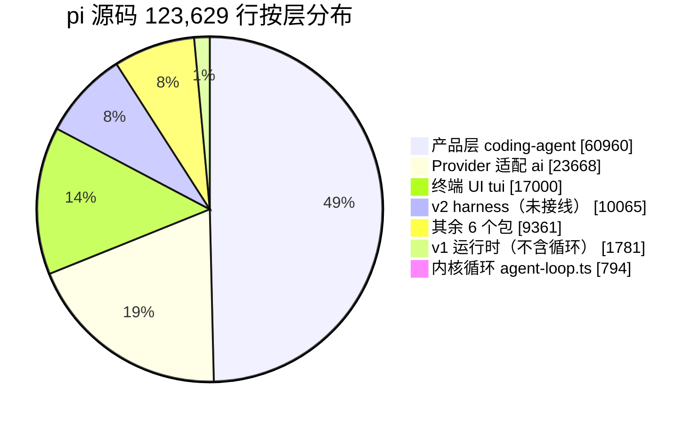
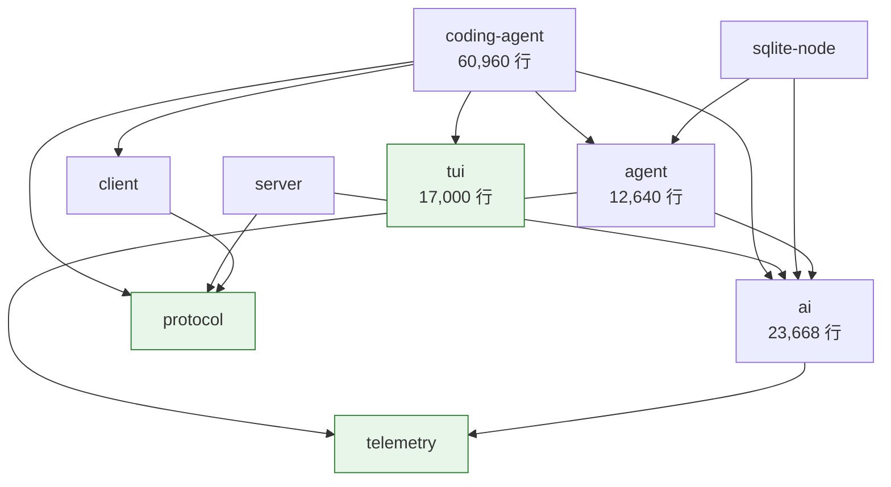
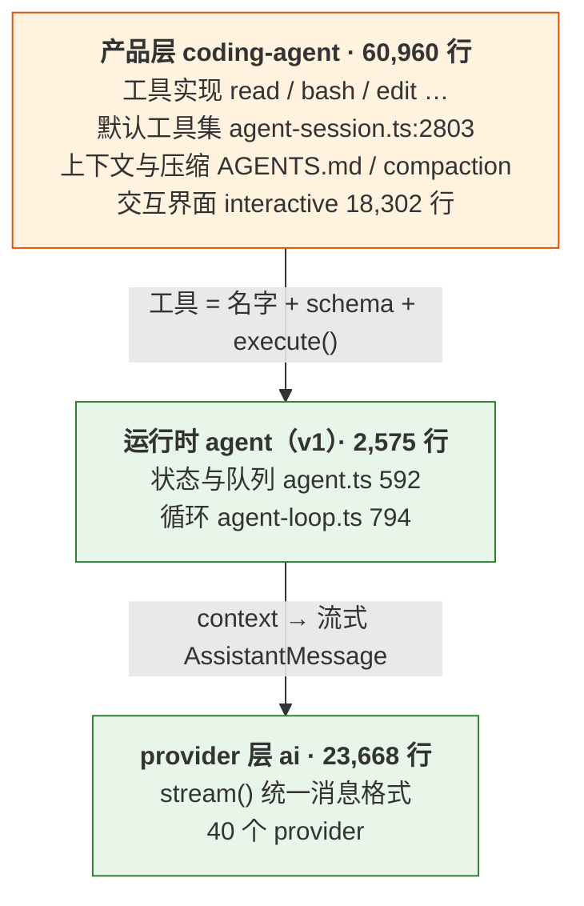
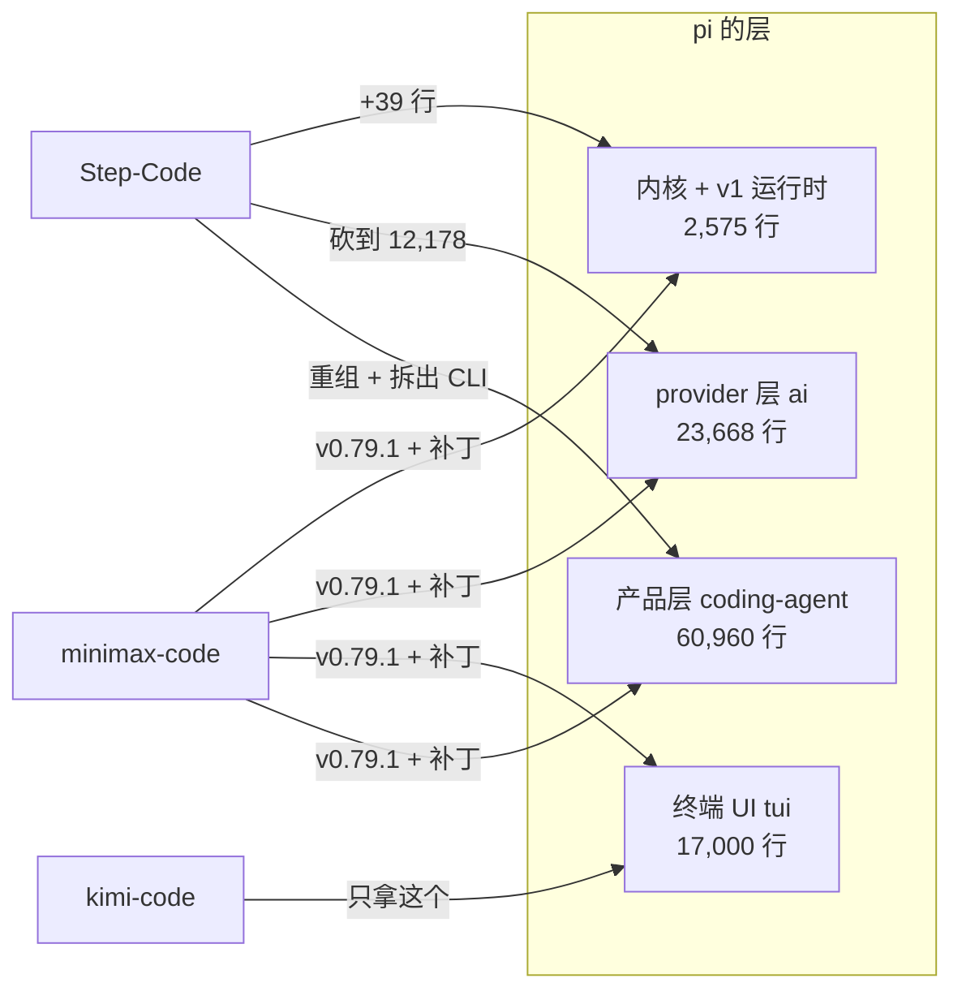

# 第 2 章 Pi 是什么：794 行内核 + 6 万行产品层

> 基准：pi `b79e4cc8` (v0.84.4)　·　[版本表](../../research/BASELINE.md)　·　[参与指南](../../CONTRIBUTING.md)

**状态**：✅ 已完成

## 本章回答

- pi 的复杂度重心在哪一层
- 它的自我定位 "minimal terminal coding harness" 准确吗
- 为什么这个分布决定了它适合被 fork

## 素材来源

- `research/pi/01-product-teardown.md` §1.1–1.3
- `research/BASELINE.md`（版本表、血缘、行数口径）
- 对照：`Step-Code` `7dd66cb9`、`minimax-code` `89c930a2`、`kimi-code` `65ae3e36`
- 配套代码：[`examples/ch02-weigh-layers/`](../../examples/ch02-weigh-layers/)

---

在决定用不用一个框架之前，先称一称它。下面三个数字是这一章的全部论点，后面几节逐个展开：

| 数字 | 是什么 | 说明了什么 |
| --- | --- | --- |
| **794** | 驱动「模型说话 → 跑工具 → 再说话」的循环，`packages/agent/src/agent-loop.ts` 的行数 | 内核小，而且不懂代码 |
| **60,960** | 产品包 `packages/coding-agent` 的源码行数，占全仓 49% | 「coding agent」是产品层长出来的 |
| **3** | 本书研究的、基于 pi 做产品的下游仓库数（Step-Code、minimax-code、kimi-code） | 这个形状适合被拆开拿走 |

本章所有行数都按 [`BASELINE.md` § 行数怎么量](../../research/BASELINE.md#行数怎么量) 的口径计算：只算 git 跟踪的 `.ts`/`.tsx`，路径须含 `/src/`，排除测试与 `examples/`。2.6 节给出一个把这条口径写成程序的小工具，你可以拿它去称自己的 fork。

---

## 2.1 它怎么介绍自己

pi 的产品手册开头是三句话：

```text
// packages/coding-agent/README.md:15,17,19（节选）
Pi is a minimal terminal coding harness. Adapt pi to your workflows, not the other way
around, without having to fork and modify pi internals. […]

Pi ships with powerful defaults but skips features like sub agents and plan mode. […]

Pi runs in four modes: interactive, print or JSON, RPC for process integration, and an
SDK for embedding in your own apps.
```

这三句话各自是一个可以被代码检验的主张：

| 主张 | 原文 | 本章怎么检验 |
| --- | --- | --- |
| 它是 **harness**，而且 **minimal** | "minimal terminal coding harness" | 2.2–2.4：称各层的重量 |
| 不需要 **fork** | "without having to fork and modify pi internals" | 2.5：看三个下游实际做了什么 |
| 有些东西**刻意不做** | "skips features like sub agents and plan mode" | 2.4：六条 "No X" |

npm 包描述比 README 朴素得多：

```json
// packages/coding-agent/package.json:4
"description": "Coding agent CLI with read, bash, edit, write tools and session management",
```

【代码事实】这四个工具名正好是默认激活集：

```ts
// packages/coding-agent/src/core/agent-session.ts:2801-2803
const defaultActiveToolNames = this._baseToolsOverride
	? Object.keys(this._baseToolsOverride)
	: ["read", "bash", "edit", "write"];
```

包描述与代码默认值一致，不是营销话术。同时这也是第一条线索：**决定「它是一个编码助手」的那一行，写在产品包里，不在运行时包里。**

---

## 2.2 十二万行分布在哪

pi 是一个有 10 个 workspace 包的 monorepo，源码合计 **123,629 行 / 540 个文件**：

| 包 | npm 名 | 行数 | 文件 | 职责 |
| --- | --- | ---: | ---: | --- |
| `coding-agent` | `pi-coding-agent` | **60,960** | 206 | 产品：CLI、交互界面、会话、扩展、包管理 |
| `ai` | `pi-ai` | **23,668** | 177 | 多 provider 统一 LLM API |
| `tui` | `pi-tui` | **17,000** | 40 | 终端 UI 库（差分渲染） |
| `agent` | `pi-agent-core` | 12,640 | 50 | 运行时：v1 循环 + v2 harness |
| `session-backends/sqlite-node` | `pi-session-backend-sqlite-node` | 2,389 | 18 | SQLite 会话后端 |
| `server` | `pi-server` | 2,299 | 17 | |
| `evals` | `pi-evals` | 1,277 | 8 | |
| `protocol` | `pi-protocol` | 1,236 | 8 | |
| `client` | `pi-client` | 1,225 | 10 | |
| `telemetry` | `pi-telemetry` | 935 | 6 | 遥测 SPI |

【代码事实】`agent` 包的 12,640 行里，`src/harness/` 占 10,065 行——那是第 30 章讲的 v2 运行时，在这个版本**没有被任何产品入口接线**。真正在服役的 v1 运行时只有 2,575 行，其中循环本身 794 行（`agent-loop.ts`），状态与队列 592 行（`agent.ts`），类型 444 行（`types.ts`）。

把这些拆开，按「层」重新排一次：



*图 2-1 pi 的源码重量。内核循环占 0.6%，产品层占 49%，provider 与 TUI 合计 33%。*

【推断】这张饼说明 pi 的复杂度**不在 agent 抽象里**，而在三件「脏活」里：把模型能力包装成产品（产品层）、对接 40 个 provider 的协议差异（ai）、在终端里画出可用的界面（tui）。这三件事加起来占 82%。

### 包之间谁依赖谁

光看行数还不够。fork 一个框架时，真正决定「能不能只拿一部分」的是**依赖方向**。【代码事实】从十个 `package.json` 的 `dependencies` 读出的内部依赖：



*图 2-2 pi 的包依赖图（`evals` 无内部依赖，未画出）。绿色是不依赖任何自家包的叶子：`tui`、`protocol`、`telemetry`。*

这张图有两个值得记住的性质：

1. **依赖是单向的、无环的**，产品层 `coding-agent` 在最顶端，没有任何包反过来依赖它。【推断】所以「换掉产品层、保留下面所有东西」在结构上是可行的。
2. **`tui` 是叶子**。17,000 行的终端 UI 库不依赖 pi 的任何其他包，可以被单独拿走。2.5 节会看到真的有人这么做了。

---

## 2.3 794 行的内核不认识代码

第 26 章会逐行拆 `agent-loop.ts`。这里只做一件事：确认它**对「编码」一无所知**。

【代码事实】在基准 commit 上，`agent-loop.ts` 中 `bash`、`file`、`edit`、`git`、`cwd` 这五个词（不区分大小写）的出现次数是 **0**：

```bash
grep -ciE 'bash|file|edit|git|cwd' packages/agent/src/agent-loop.ts
# 0
```

循环只认识三种东西：消息、工具调用、事件。它不知道工具是读文件还是查数据库，不知道当前目录，不知道仓库。所有与「编码」有关的知识都在产品层：

| 编码相关的知识 | 位置 | 行数 |
| --- | --- | ---: |
| 8 个内置工具的实现（`index.ts:95`：read / bash / powershell / edit / write / grep / find / ls） | `coding-agent/src/core/tools/` | 4,293 |
| 默认开哪 4 个工具 | `coding-agent/src/core/agent-session.ts:2801-2803` | 3 |
| AGENTS.md / CLAUDE.md 的发现与加载（候选文件名见 `:72`） | `coding-agent/src/core/resource-loader.ts` | 1,097 |
| 压缩策略 | `coding-agent/src/core/compaction/` | 1,557 |



*图 2-3 「编码」只存在于产品层。运行时看到的工具只是名字、描述、参数 schema 和一个 `execute` 函数（`packages/agent/src/types.ts:387` 的 `AgentTool`）。*

【推断】这就是 "harness" 一词在 pi 里的精确含义：**运行时是一副通用的 agent 骨架，「coding」是装在骨架上的一组工具和默认值。** 换一组工具，同一个 794 行的循环可以驱动一个运维助手或一个数据分析助手，循环本身一行不用改。

---

## 2.4 "minimal" 只说对了一半

### 说对的那一半

内核确实是 minimal 的。v1 运行时 2,575 行，占全仓 2.1%；循环 794 行，占 0.6%。【代码事实】它的第三方依赖也很克制——`coding-agent` 的 20 个运行时依赖里，5 个是自家包，第三方只有 15 个（`packages/coding-agent/package.json`），没有 zod、没有 commander/yargs、没有 ink/blessed、没有 OpenTelemetry。CLI 参数解析、终端 UI、HTTP 客户端都是自己写的。

### 没说对的那一半

产品层一点都不 minimal。【代码事实】`coding-agent` 内部的分布：

| 目录 | 行数 | 说明 |
| --- | ---: | --- |
| `src/core/` | 29,491 | 会话、扩展宿主、工具、压缩、设置、包管理 |
| `src/modes/` | 20,333 | 其中 `interactive/` 18,302、`rpc/` 1,785 |
| `src/extensions/` | 1,457 | 内置的 llama 扩展 |
| 其余（`cli/`、`utils/` 等） | 9,679 | |

最大的两个文件是 `modes/interactive/interactive-mode.ts`（**6,575 行**）和 `core/agent-session.ts`（**3,516 行**）。前者承担终端事件循环、斜杠命令、扩展 UI 宿主与信号处理；后者是第 26 章说的 L3 产品编排层。

【推断】如果只看 README 的第一句话，会以为 pi 是一个「小框架」；如果看仓库总量，又会以为它是一个「大产品」。两个印象都对，只是说的不是同一层。**minimal 是对内核的描述，不是对仓库的描述。**

### 真正贯穿始终的不是 minimal

比 minimal 更准确的概括写在 README 的另一处——六条明确的「不做」：

```text
// packages/coding-agent/README.md:499-509（节选，每条只保留第一句）
No MCP.
No sub-agents.
No permission popups.
No plan mode.
No built-in to-dos.
No background bash.
```

每一条后面都给了替代方案：用扩展自己实现、装第三方包、或者交给容器 / tmux。【推断】这六条的共同点是：**它们都是策略，不是机制。** 要不要弹确认框、要不要拆子任务、要不要后台跑命令——这些都依赖于使用场景，pi 选择只提供实现它们所需的钩子（`beforeToolCall`、36 个扩展事件、四种运行模式），把决定权交给用户。第 15 章会专门展开这个立场，以及它给下游留下了多少要补的东西。

### 判断依据

- **「minimal」成立的范围**：v1 运行时（2,575 行）与它的依赖面（15 个第三方包）。【代码事实】
- **「minimal」不成立的范围**：产品层（60,960 行）、两个超过 3,000 行的文件。【代码事实】
- **更准确的一句话**：pi 是「一个很小的、不懂代码的 agent 内核，加上一个很大的、刻意不带策略的编码产品」。【推断】

---

## 2.5 为什么这个形状适合 fork

README 说 "without having to fork"。但本书研究的三个下游，**全部** fork 或 vendor 了 pi 的代码（血缘见 [`BASELINE.md`](../../research/BASELINE.md#血缘谁和-pi-是什么关系)）。更有意思的是，它们拿走的层各不相同：

| 下游 | 拿走了什么 | 内核循环 | provider 层 | 产品层 |
| --- | --- | --- | --- | --- |
| **Step-Code** | 重组为 7 个 `@step-harness/*` 包 + `apps/cli` | 833 行（+39，见下） | 23,668 → **12,178**，内置模型目录清空 | 60,960 → 79,475，另拆出 23,045 行的 `apps/cli` |
| **minimax-code** | 4 个包（agent / ai / coding-agent / tui），v0.79.1，放在 `third_party/pi-mono/` | 在 v0.79.1 上加了几个钩子（742 → 877 行） | 在 vendor 的源码上打补丁 | 自写 26 个 workspace 包叠在上面 |
| **kimi-code** | 只拿 `tui` | 不用，自研内核 | 不用 | 不用 |

### 证据一：内核没人重写

【代码事实】Step-Code 的 `packages/agent-core/src/agent.ts` 与 pi 基准只差一行 import（`@earendil-works/pi-ai` 换成 `@step-harness/providers`，`:9`）；`agent-loop.ts` 多了 39 行，下面细看。minimax-code 停在 v0.79.1，它的 `agent-loop.ts` 比同版本上游多出 135 行（742 → 877），补丁台账 `third_party/pi-mono/MINIMAX_CHANGES.md` 里落在 `packages/agent` 的几条，做的都是**给宿主开口子**：工具钩子返回 `terminateAgent` 让整个 agent 停下（`:91-97`）、工具真正开始执行时回调 `onToolExecutionStart`（`:99-105`）、steering 之后再查一次 `shouldStopAfterSteering`（`:83-89`）。没有一条改的是循环本身的决策。

Step-Code 对循环的改动只有 +39 行，针对的是一个**服务端**的故障：

```ts
// Step-Code packages/agent-core/src/agent-loop.ts:220-225（节选）
const leakRetryLimit = config.toolCallLeakRetries ?? DEFAULT_TOOL_CALL_LEAK_RETRIES;
for (let attempt = 0; attempt < leakRetryLimit && isToolCallMarkupLeak(message); attempt++) {
	if (currentContext.messages[currentContext.messages.length - 1] !== message) break;
	currentContext.messages.pop();
	message = await streamAssistantResponse(currentContext, config, signal, emit, streamFunction);
}
```

```ts
// Step-Code packages/agent-core/src/agent-loop.ts:293-295
const DEFAULT_TOOL_CALL_LEAK_RETRIES = 2;

const TOOL_CALL_MARKUP_RE = /<tool_call>|<function=/u;
```

当推理服务的工具调用解析器失败，模型想调的工具会以 `<tool_call>` 原文的形式漏进普通文本里；这一轮没有可执行的调用，循环会以为模型说完了。Step-Code 的处理是丢掉这一轮、用同一份上下文重新采样，最多两次。【推断】这是一个只有「自己部署推理服务」的厂商才会遇到的问题，而且它必须改在循环里——这是循环唯一能看到「本轮有没有工具调用」的位置。这个文件与 pi 的 diff 一共三处：上面这段循环（连同把 `const message` 改成 `let`）、文件末尾的两个辅助定义，以及把 `@earendil-works/pi-ai` 换成 `@step-harness/providers` 的 import（`:12`）。

### 证据二：叶子包可以被单独拿走

【代码事实】kimi-code 的 `packages/pi-tui/`（npm 名 `@moonshot-ai/pi-tui`，18,667 行）是它与 pi 唯一的代码交集；它的内核、provider、产品层都是自研的。这之所以可行，是因为 `tui` 在图 2-2 里是叶子——不依赖 pi 的任何其他包。

minimax-code 走的是另一条路：在 `pnpm-workspace.yaml` 里把 `third_party/pi-mono/packages/{agent,ai,coding-agent,tui}` 列为 workspace 包，自己的包通过 `"@earendil-works/pi-agent-core": "workspace:*"` 引用它们。10 个包里只拿了 4 个，`server`、`client`、`protocol`、`evals`、`session-backends`、`telemetry` 都没要。

### 证据三：差异化全部长在产品层

Step-Code 在 `coding-agent` 里的增量几乎全在产品层的**边上**，而不是改写 pi 原有的核心代码：

| 目录 | pi → Step-Code | 内容 |
| --- | ---: | --- |
| `coding-agent/src/step/` | 0 → **21,794**（全新，61 个文件） | `auth.ts`、`login-flow.ts`、`onboarding.ts`、`mcp.ts`、`permissions.ts`、`telemetry.ts`、`secret-redaction.ts`、`build-identity.ts`、`feedback/`（3,101）… |
| `coding-agent/src/features/` | 0 → **12,504**（全新） | `workflow/`（3,505）、`subagent/`（1,820）、`step-schedule.ts`、`step-cron.ts`、`step-provider/`…；其中 `llama/`（1,453）是从 pi 的 `extensions/` 挪过来的 |
| `coding-agent/src/modes/` | 20,333 → 2,287 | 只留 print / json / rpc；交互界面整体搬进新包 `apps/cli/src/ui/`（21,817 行） |
| `coding-agent/src/core/` | 29,491 → 30,913 | 原有核心只增长 5% |

provider 层则做减法：【代码事实】`packages/providers/src/api/` 只剩 13 个文件（pi 是 32 个），`providers/` 目录从 87 个文件删到 4 个（`all.ts`、`faux.ts` 和两个数据声明文件），`models.generated.ts` 生成出的内置模型目录是一个空对象 `export const MODELS: {} = {};`，另加一个 `step-provider/`。

minimax-code 的自有包里，`packages/agent-modules/` 下的目录名几乎可以和 README 的 "No X" 逐条对上：

| pi README 说不做 | minimax-code 的目录 |
| --- | --- |
| No MCP | `agent-modules/mcp/` |
| No permission popups | `agent-modules/permission/` |
| No background bash | `agent-modules/background-task/` |
| （无对应声明；pi 也没有循环刹车，第 18 章） | `agent-modules/runaway-guard/` |

这里只列了目录存在这一事实；它们各自做到了什么程度，留给第 32 章。



*图 2-4 三个下游从 pi 拿走的层。没有人重写内核；分歧都发生在 provider 层和产品层。*

### 那 "without having to fork" 错了吗

没有错，只是它说的不是厂商。【推断】pi 的扩展系统服务的是**想让 pi 适应自己工作流的用户**：加一个工具、拦一次调用、换一个 provider、装一个第三方包。而三个下游要改的是**产品身份**：登录与账号体系、首启引导、默认模型、遥测上报到哪、品牌与版本号。Step-Code 的 `src/step/` 目录清单（上表）几乎就是这份需求的逐项列举。这些东西在 pi 里属于 `coding-agent` 的内部实现，不是扩展点。

还有一个非技术因素。【代码事实】pi 两份 README 的第一句话都是 "New issues and PRs from new contributors are auto-closed by default."（根 `README.md:11`、`packages/coding-agent/README.md:11`）。【推断】对下游来说，这意味着「把改动提回上游」不是默认路径，fork 之后基本只能长期自己维护 diff。minimax-code 的补丁台账是一个实例：37 条本地改动里，35 条写着 "Upstream PR: not opened" 或 "not created"，其中不少条目自己就标着 "generic upstream material" 或 "generic upstreamable"；唯一一条 "already merged"（`MINIMAX_CHANGES.md:188-190`）是从上游**往回**挪的补丁。【代码事实】第 24 章讨论这笔账怎么算。

### 判断依据

一个框架适不适合被 fork，可以用三个问题检验。pi 在这三个问题上的回答都是「是」：

1. **内核是不是小到不需要重写？** 794 行、不认识任何领域概念。两个拿了内核的下游都没有重写它：Step-Code 加了 39 行重采样，minimax-code 加的是给宿主用的钩子。【代码事实】
2. **依赖是不是单向的、有叶子？** 是。产品层在顶端，`tui`/`protocol`/`telemetry` 是叶子，kimi-code 只拿走了 `tui`。【代码事实】
3. **差异化需要的东西是不是集中在一层？** 是。登录、引导、权限、MCP、遥测、默认模型——全在产品层和 provider 层。【推断】

反过来，这个形状也决定了 fork 的**代价落在哪里**：产品层是 pi 改动最频繁的地方（每月 400–530 次提交，`research/pi/01-product-teardown.md` §1.6），而它恰好也是下游改得最多的地方。改得越多，同步上游越难。Step-Code 的压缩改动就是一个具体例子：同一组改动（`reserveTokens` 调到 24576、新增 `pickSummaryMaxTokens`、30 行的八段式摘要格式）在 v2 的 `agent-core/src/harness/compaction/compaction.ts` 和 v1 的 `coding-agent/src/core/compaction/compaction.ts` 里各有一份，逐字相同（第 30 章 30.6 节）。

---

## 2.6 你的最小实现：称一称你的 fork

本章的所有数字都来自同一条口径。配套代码 [`examples/ch02-weigh-layers/`](../../examples/ch02-weigh-layers/) 把它写成了一个零依赖的小工具：给一个仓库，按层输出行数；给两个仓库，逐层对照。你可以用它回答一个具体的问题：**我的 fork 在哪一层偏离了上游，偏了多少。**

口径本身是一个纯函数，与 `BASELINE.md` 里的 shell 管道逐条对应：

```ts
// examples/ch02-weigh-layers/src/filter.ts:6-21
const SOURCE_EXT = /\.(ts|tsx)$/i;
const TEST_FILE = /\.test\.|\.spec\./;
const TEST_DIR = /(^|\/)tests?\//;
const EXAMPLES_DIR = /\/examples\//;
const SRC_DIR = /\/src\//;

/** 一个 git 跟踪的路径算不算「源码」 */
export function isCountedSource(path: string): boolean {
  return (
    SOURCE_EXT.test(path) &&
    !TEST_FILE.test(path) &&
    !TEST_DIR.test(path) &&
    !EXAMPLES_DIR.test(path) &&
    SRC_DIR.test(path)
  );
}
```

分层是一张有序的前缀表。顺序就是优先级——794 行的内核文件和未接线的 v2 harness 必须排在 `packages/agent/` 前面，否则会被它吞掉：

```ts
// examples/ch02-weigh-layers/src/presets.ts:9-17
export const PI_LAYERS: readonly Layer[] = [
  { name: "内核 L1（agent-loop.ts）", prefixes: ["packages/agent/src/agent-loop.ts"] },
  { name: "v2 harness（未接线）", prefixes: ["packages/agent/src/harness/"] },
  { name: "运行时 v1（agent 其余）", prefixes: ["packages/agent/"] },
  { name: "Provider 适配（ai）", prefixes: ["packages/ai/"] },
  { name: "终端 UI（tui）", prefixes: ["packages/tui/"] },
  { name: "产品层（coding-agent）", prefixes: ["packages/coding-agent/"] },
  { name: "CLI 外壳（apps/cli）", prefixes: ["apps/cli/"] },
];
```

fork 常常会给包改名。Step-Code 把 `packages/agent` 改成了 `packages/agent-core`、`packages/ai` 改成了 `packages/providers`，所以它有自己的一张表 `STEP_CODE_LAYERS`：路径不同，**层名和顺序必须与 `PI_LAYERS` 完全一致**，对照时才能按层名逐行对齐（`presets.test.ts` 专门检查这一点）。`--preset pi,step-code` 给两个仓库各配一张表。对 pi 基准和 Step-Code 基准运行：

```text
$ npm start -- --preset pi,step-code ../pi ../Step-Code
                                 pi  Step-Code         Δ
  内核 L1（agent-loop.ts）      794        833       +39
  v2 harness（未接线）       10,065     11,289    +1,224
  运行时 v1（agent 其余）     1,781      1,813       +32
  Provider 适配（ai）        23,668     12,178   −11,490
  终端 UI（tui）             17,000     17,359      +359
  产品层（coding-agent）     60,960     79,475   +18,515
  CLI 外壳（apps/cli）            0     23,045   +23,045
  其余                        9,361      1,774    −7,587
  合计                      123,629    147,766   +24,137
```

一张表把 2.5 节的结论都摆出来了：内核只多 39 行；provider 层砍掉一半；产品层加上拆出去的 CLI 外壳一共 +41,560，是全部增长的来源。「其余」那行的 −7,587，是因为 pi 的 `server`、`client`、`protocol`、`evals`、`session-backends` 五个包 Step-Code 都没拿，只多了自己的 `config` 和 `contracts`（`telemetry` 两边都有）。

几点实现上的取舍：

1. **只称 git 跟踪的文件。** 构建产物、`node_modules`、本地草稿都不算——与 `git ls-files` 口径一致，别人 checkout 同一个 commit 能得到同样的数字。
2. **总是称整个仓库。** 传入子目录时先用 `git rev-parse --show-toplevel` 回到仓库根，否则路径前缀对不上预设。
3. **读不到的文件单独报告。** 跟踪了但工作区里没有的文件（删除未提交、断掉的符号链接）不计入行数，但会在 stderr 上报数量，不会悄悄少算。
4. **行数与 `wc -l` 相同**：数换行符，最后一行没有换行就不算。

`npm test` 跑 23 个用例，覆盖口径、分层优先级、两张预设的层名对齐、对照对齐和仓库边界（不存在的路径、非 git 目录、跟踪了但被删除的文件）。

---

## 本章小结

- **复杂度重心在产品层**：`coding-agent` 60,960 行占 49%，加上 provider 层（19%）和终端 UI（14%），三件「脏活」占 82%。内核循环 794 行，占 0.6%。
- **内核不认识代码**：`agent-loop.ts` 里没有 `bash`、`file`、`edit`、`git`、`cwd`；「它是编码助手」由产品层的工具实现和默认工具集（`agent-session.ts:2801-2803`）决定。
- **"minimal" 只对内核成立**。更准确的概括是 README 里的六条 "No X"：pi 提供机制、不提供策略。
- **这个形状适合 fork**：内核小到没人需要重写（Step-Code 只加 39 行，minimax-code 只加钩子），依赖单向且有叶子（kimi-code 只拿走 `tui`），差异化需求集中在产品层与 provider 层。
- **代价也集中在同一处**：下游改得最多的产品层，恰好也是上游改得最频繁的地方。
