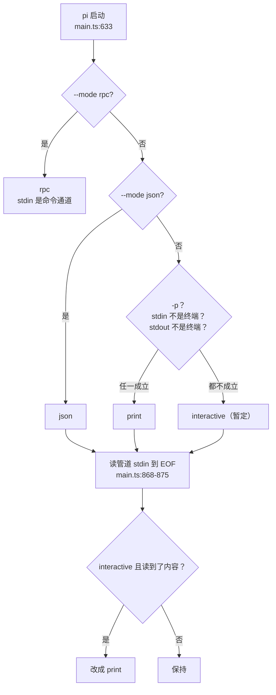
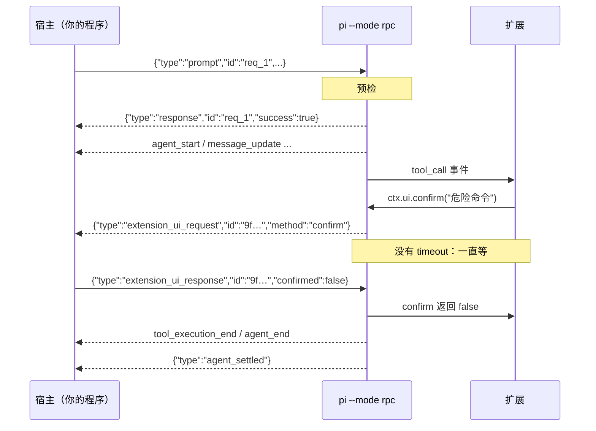
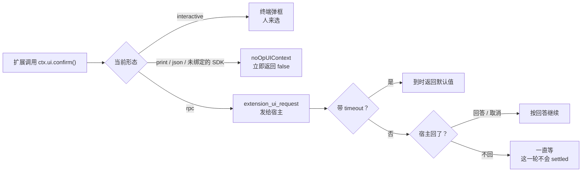
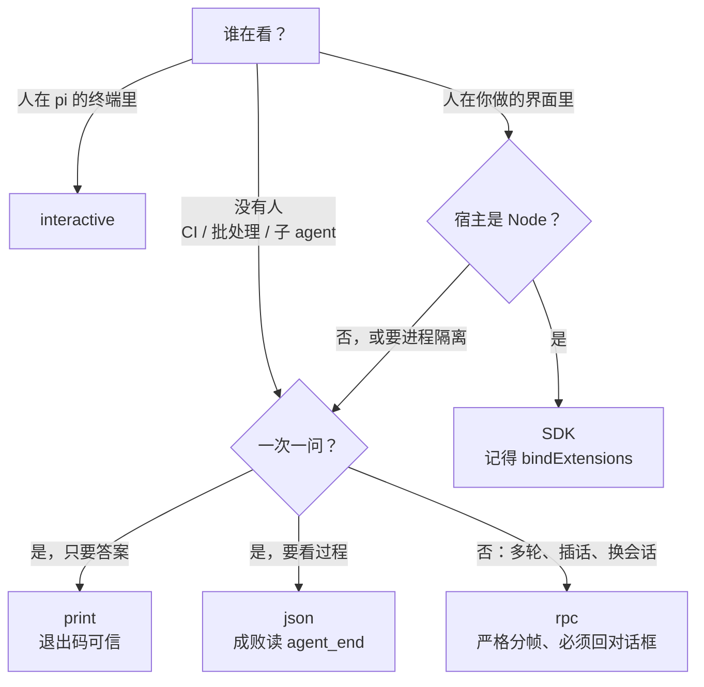

# 第 3 章 四种形态选哪种

> 基准：pi `b79e4cc8` (v0.84.4)　·　[版本表](../../research/BASELINE.md)　·　[参与指南](../../CONTRIBUTING.md)

**状态**：✅ 已完成

## 本章回答

- 一次 `pi` 启动怎样落到 interactive、print、json、rpc 中的一种；不加参数时，为什么重定向一下输出就换了形态
- print、json、rpc、SDK 各自对接入方许下了什么契约：生命周期、输入输出、失败怎么报
- RPC 的一条 stdout 上为什么同时有三种消息；分帧为什么只能按 `\n` 切，Node 升级后哪里会出问题
- 扩展在不同形态下看到的 `hasUI` 不同，同一个扩展因此会拦、会问，或者把子进程挂住
- SDK 嵌入和起子进程的差别；嵌入时扩展默认看到什么
- Step-Code、minimax-code 各选了哪条接入路线，代价是什么
- 选错形态的代价：要改哪几处接入代码

## 素材来源

- `research/pi/01-product-teardown.md` §1.4（含 1.4.1–1.4.6：形态判定、print / json 契约、RPC 协议全貌、SDK API 面、hasUI、远程会话包）
- `research/pi/07-extensibility.md`（扩展的 UI 上下文）、`research/pi/06-multi-agent.md` §6.3（subagent 扩展怎样起子进程）
- 对照：`Step-Code` `7dd66cb`、`minimax-code` `89c930a`
- 配套代码：[`examples/ch03-modes/`](../../examples/ch03-modes/)

（pi 的路径以 `packages/coding-agent/src/` 为根；`docs/` 指 `packages/coding-agent/docs/`；`README.md`、`CHANGELOG.md`、`package.json`、`examples/` 指 `packages/coding-agent/` 下的同名文件和目录；`packages/protocol` 这类写法按仓库根。Step-Code 的路径同样以 `packages/coding-agent/src/` 为根；minimax-code 的路径以 `packages/tui/src/` 为根。）

---

pi 的 README 第一段就说它有四种运行方式（`README.md:19`）：交互式、print 或 JSON、给进程集成用的 RPC、嵌进自己应用的 SDK。四种形态共用同一个会话运行时（`docs/sdk.md:119`），模型、工具、扩展、会话文件都一样。不一样的是**接入方和这个运行时之间的契约**：谁在等输出，输出长什么样，出错时怎么知道，扩展想问人的时候问谁。

这些契约差得很远。print 跑完就退，靠退出码报失败；json 也跑完就退，但最后一条消息出错时退出码仍是 0；rpc 常驻，每条命令单独回一个响应，扩展的对话框会变成一条发给你的请求，你不回它就一直等；SDK 和你在同一个进程里，出错就是抛异常。接入代码是照着契约写的，换一种形态，就要换一套接入代码。

本章把四种形态（加上 SDK 一共五种接法）的契约逐项摆出来，再看两家下游各选了什么。不排名次，只回答「谁选了什么、代价是什么」。

先看几个数字：

| 数字 | 是什么 | 出处 |
| --- | --- | --- |
| **18,302 / 1,785 / 230 / 410** | interactive / rpc / print 加 json / SDK 入口的代码行数 | `modes/interactive/`；`modes/rpc/` 四个文件；`modes/print-mode.ts` 169 行加 `modes/json-event.ts` 61 行；`core/sdk.ts` |
| **3** | 只要一个成立就从 interactive 退成 print 的条件：`-p`、stdin 不是终端、stdout 不是终端 | `main.ts:117-119` |
| **0** | `--mode json` 一轮以 `stopReason: "error"` 结束时的退出码 | `modes/print-mode.ts:139-156` 只在 text 形态里设退出码 |
| **33 / 9 / 4** | RPC 命令种类 / 扩展 UI 方法 / 其中要等回答的对话框 | `modes/rpc/rpc-types.ts:20-74`、`:246-281` |
| **∞** | 对话框没带 `timeout` 时，RPC 子进程等回答的时长 | `modes/rpc/rpc-mode.ts:115-120` |
| **22.19 / 24** | pi 要求的最低 Node 版本 / `readline` 开始在 U+2028 处断行的 Node 大版本（本书实测） | `package.json:103-105` |

---

## 3.1 一次启动落到哪种形态

### 判定顺序

形态在 `main.ts` 里由一个九行的函数决定：

```ts
// pi: main.ts:110-121
function resolveAppMode(parsed: Args, stdinIsTTY: boolean, stdoutIsTTY: boolean): AppMode {
	if (parsed.mode === "rpc") {
		return "rpc";
	}
	if (parsed.mode === "json") {
		return "json";
	}
	if (parsed.print || !stdinIsTTY || !stdoutIsTTY) {
		return "print";
	}
	return "interactive";
}
```

`--mode rpc` 和 `--mode json` 是显式选择，优先于一切。剩下三种情况任一成立就落到 print：给了 `-p`；stdin 不是终端（`echo … | pi`）；stdout 不是终端（`pi "…" > out.txt`、在 CI 里跑、被别的程序当子进程起）。只有两头都是终端、又没有参数时，才进 interactive。【代码事实】

紧接着还有一次修正。非 rpc 形态会把管道 stdin 读到 EOF（`main.ts:78-95` 的 `readPipedStdin`），如果此时还是 interactive 而 stdin 有内容，就改成 print（`:868-875`）。rpc 跳过这一步，因为它的 stdin 是命令通道。【代码事实】



*图 3-1 一次启动落到哪种形态。前两步看参数，第三步看终端；rpc 不读管道 stdin。*

### 判定之后的分叉

形态一定，后面有一串分叉（都在 `main.ts`）：

| 行 | 只在哪些形态 | 做什么 |
| --- | --- | --- |
| `:633-637` | 非 interactive | `takeOverStdout()`：把其他代码对 `process.stdout` 的写入改道到 stderr（`core/output-guard.ts:45-70`），stdout 只留给协议输出 |
| `:639-642` | rpc | 命令行里有 `@file` 参数就退 1 |
| `:656` | interactive | 首次设置（主题、分析选项） |
| `:893-903` | 非 interactive | 启动诊断一律打到 stderr；有运行时错误退 1 |
| `:906-909` | 非 interactive | 没有可用模型直接退 1 |
| `:917-925` | rpc | 后台刷新模型目录，15 秒超时 |

项目信任也分形态：interactive 第一次进项目时弹提示；print、json、rpc 不弹，按全局设置 `defaultProjectTrust` 处理，默认值 `ask` 在这里的意思是忽略项目里的设置和扩展（`README.md:302`）。【代码事实】

这条规则的后果是：**同一个项目，在终端里能用的项目扩展，放进 CI 就不加载了**，除非加 `--approve` 或者改全局设置。【推断，依据 `README.md:302`】

### 判断依据

- 不加参数的 `pi` 在被重定向或被管道喂入时会自己换成 print。写脚本时**显式写出** `-p` 或 `--mode`，别依赖终端检测，否则同一条命令在终端里和 CI 里行为不同。
- 非交互形态的 stdout 被接管了，扩展里的 `console.log` 会出现在 stderr，不会混进协议输出。这保护了 json 和 rpc 的输出流，但也意味着扩展的调试输出要到 stderr 里找。
- 进 CI 之前确认项目信任：非交互形态默认不加载项目资源，「本地能拦的危险命令，CI 里拦不住」往往是这个原因。

---

## 3.2 print 与 json：一次一问

print 和 json 走同一个函数 `runPrintMode`（`modes/print-mode.ts:33`），区别只在输出。

### 生命周期

一次调用、依次发完所有消息（`:131-137`）、退出。SIGTERM 退 143，SIGHUP 退 129，Windows 上只挂 SIGTERM（`:50-66`）。退出前会清理被跟踪的后台子进程。【代码事实】

因为非 rpc 形态要把管道 stdin 读到 EOF 才开始（3.1 节），**调用方起 pi 子进程时，stdin 要么关掉，要么设成 `ignore`**；给一个开着不写的管道，pi 会一直等。pi 自带的 subagent 扩展就是这么做的：`["--mode", "json", "-p", "--no-session"]`，`stdio: ["ignore", "pipe", "pipe"]`（`examples/extensions/subagent/index.ts:300`、`:346-349`）。【代码事实】

### 输出

text 形态只打印**最后一条助手消息里的文本**（`:149-153`），工具调用、思考、中间消息都看不到。

json 形态先写一行会话头（`type: "session"`，`:122-127`），之后每个会话事件一行（`:108-112`），写之前等 stdout 的背压（`:113-118`），所以读得慢的消费方会让 agent 也慢下来，而不是让内存涨上去。事件经过 `toJsonEvent` 处理：流式事件里那份不断变大的 `partial` 快照被去掉，`toolcall_start` 补上 id 和工具名（`modes/json-event.ts:20-38`）。【代码事实】

### 失败怎么报

这是两者最大的差别：

```ts
// pi: modes/print-mode.ts:139-161
		if (mode === "text") {
			const state = session.state;
			const lastMessage = state.messages[state.messages.length - 1];

			if (lastMessage?.role === "assistant") {
				const assistantMsg = lastMessage as AssistantMessage;
				if (assistantMsg.stopReason === "error" || assistantMsg.stopReason === "aborted") {
					console.error(assistantMsg.errorMessage || `Request ${assistantMsg.stopReason}`);
					exitCode = 1;
				} else {
					// …打印文本…
				}
			}
		}

		return exitCode;
	} catch (error: unknown) {
		console.error(error instanceof Error ? error.message : String(error));
		return 1;
```

「最后一条出错或被中止就退 1」这个检查只在 `mode === "text"` 的分支里。json 形态下，provider 返回 429、网络断了、被中止，事件流里的 `agent_end` 会带着 `stopReason: "error"`，**进程照样退 0**；只有抛到外层的异常才退 1。【代码事实】

| | text（`-p`） | json（`--mode json`） |
| --- | --- | --- |
| 正常结束 | 退 0，打印文本 | 退 0 |
| 最后一条 `stopReason` 是 error / aborted | 错误写 stderr，退 1 | **退 0**，错误只在事件流里 |
| 抛异常 | 退 1 | 退 1 |
| SIGTERM / SIGHUP | 143 / 129 | 143 / 129 |

*表 3-1 print 与 json 的失败契约*

用 json 的人多半要把输出交给程序处理，正是最需要靠退出码判断成败的场景。调用方只能自己读到 `agent_end`，取最后一条助手消息的 `stopReason`。subagent 扩展就是这么做的：它解析子进程的事件流来判断结果，而不是只看退出码。【推断：pi 把 json 当成「事件流」而不是「命令」来设计，成败由流来表达】

### 扩展看到什么

print 和 json 绑定扩展时只给了 mode，不给 UI 上下文：

```ts
// pi: modes/print-mode.ts:76-77
		await session.bindExtensions({
			mode: mode === "json" ? "json" : "print",
```

没有 UI 上下文，扩展拿到的是 `noOpUIContext`（`core/extensions/runner.ts:436-438`）：`select` 返回 `undefined`，`confirm` 返回 `false`，`input` 和 `editor` 返回 `undefined`（`:236-255`），`hasUI` 为 `false`（`:492-494`）。3.4 节会看到这对扩展行为意味着什么。【代码事实】

### 判断依据

- 只要一个答案、不关心过程：print 最省事，退出码可信。
- 要看工具调用、要做流式展示：json，但**成败要自己从 `agent_end` 里读**，不能只看退出码。本章配套代码的 `check` 命令就是做这件事的（3.8 节）。
- 起子进程时 stdin 设成 `ignore`。

---

## 3.3 rpc：一条 stdout 上的三种消息

### 协议的形状

rpc 形态是一个常驻进程：stdin 上一行一条 JSON 命令，stdout 上一行一条 JSON 输出（`docs/rpc.md:20-24`）。命令有 33 种（`modes/rpc/rpc-types.ts:20-74`），从 `prompt`、`steer`、`follow_up`、`abort`，到换模型、调思考级别、压缩、直接跑 bash，到十个会话操作（新建、切换、分叉、导出……），每种都可以带一个 `id`，响应会带回同一个 `id`（`docs/rpc.md:26`）。【代码事实】

stdout 上同时有三种东西，靠 `type` 区分：

| 类别 | `type` | 什么时候来 | 要不要回 |
| --- | --- | --- | --- |
| 响应 | `response` | 每条命令一个，带 `success` 和可选的 `error` | 不用 |
| 会话事件 | `agent_start`、`message_update`、`tool_execution_*`、`agent_end`、`agent_settled`…… | agent 跑起来之后持续不断 | 不用 |
| 扩展 UI 请求 | `extension_ui_request` | 扩展调用 `ctx.ui.*` 时 | 对话框类**必须回** |

*表 3-2 RPC stdout 上的三类消息（`docs/rpc.md:20-24`、`:1184-1191`）*

`prompt` 的响应是异步的：处理函数立刻返回，等预检（模型可用、扩展没拦）通过后才发 `success`，预检失败发 `error`（`modes/rpc/rpc-mode.ts:394-416`）。所以「收到 prompt 的 success」只说明这一轮开始了，结束要等 `agent_settled`——它表示这一轮连同排队的 steer、follow_up 全部跑完（`core/agent-session.ts:633-634`）。【代码事实】

其他边界：解析不了的行回 `command: "parse"` 的错误，这个响应没有 `id`（`rpc-mode.ts:752-766`）；不认识的命令回 `Unknown command`（`:715-718`）；命令处理时抛异常变成错误响应（`:784-801`）；stdin 结束就关闭（`:804-807`），否则函数永不返回（`:819-820`）。【代码事实】



*图 3-2 RPC 一轮的时序。响应、事件、UI 请求在同一条 stdout 上交错到达；对话框请求的 id 是 pi 生成的 UUID，不是你的命令 id。*

### 分帧：只按 `\n` 切

`JSON.stringify` 不转义 U+2028（LINE SEPARATOR）和 U+2029（PARAGRAPH SEPARATOR），它们会原样出现在 JSON 字符串里，也就是一行 JSONL 的中间。模型输出里出现这两个字符并不罕见——从网页、PDF 复制来的文本里就有。

把它们也当成换行的分行器，会把一行切成几段，每段都不是合法的 JSON。pi 在 2026-03-07 的 commit `e3adaf1bd`（"use strict JSONL framing fixes #1911"）里把 rpc 的读写换成自己的严格分帧，CHANGELOG 里留了两条（`CHANGELOG.md:2614`、`:2627`），README 和 RPC 文档各写了一遍警告（`README.md:489`；`docs/rpc.md:28-37`）。实现只有几十行：

```ts
// pi: modes/rpc/jsonl.ts:14-41
/**
 * Attach an LF-only JSONL reader to a stream.
 *
 * This intentionally does not use Node readline. Readline splits on additional
 * Unicode separators that are valid inside JSON strings and therefore does not
 * implement strict JSONL framing.
 */
export function attachJsonlLineReader(stream: Readable, onLine: (line: string) => void): () => void {
	const decoder = new StringDecoder("utf8");
	let buffer = "";

	const emitLine = (line: string) => {
		onLine(line.endsWith("\r") ? line.slice(0, -1) : line);
	};

	const onData = (chunk: string | Buffer) => {
		buffer += typeof chunk === "string" ? chunk : decoder.write(chunk);

		while (true) {
			const newlineIndex = buffer.indexOf("\n");
			if (newlineIndex === -1) {
				return;
			}

			emitLine(buffer.slice(0, newlineIndex));
			buffer = buffer.slice(newlineIndex + 1);
		}
	};
```

三件事：只认 `\n`；行尾一个 `\r` 去掉（兼容 `\r\n`）；用 `StringDecoder` 拼字节块，因为一个汉字的三个字节可能被切在两块里。【代码事实】

### 这个坑什么时候出现

本书用同一段脚本（一行含 U+2028 的 JSON 喂给 `readline`）在几个 Node 版本上实测：v16、v18、v22.22.3 得到 1 行，v24.14.1、v25.8.2 得到 3 行。pi 的 `engines` 是 `node >=22.19.0`（`package.json:103-105`）。【代码事实 + 实测】

也就是说，**一个用 `readline` 读 pi 输出的客户端，在 Node 22 上测试全部通过，用户升级到 Node 24 之后开始随机丢事件**——只在模型输出恰好含这两个字符时丢，很难复现。【推断】

仓库自带的 `examples/rpc-extension-ui.ts` 就是这样写的：`:19` 导入 `readline`，`:521` 用 `readline.createInterface` 读 agent 的 stdout。修复 commit 改了 rpc 模式本身和自带的客户端，这个示例没跟上。照着示例写客户端的人会把这个坑原样带走。【代码事实】

### 自带的客户端

`modes/rpc/rpc-client.ts`（609 行）是 pi 自己的 TypeScript 客户端，通过 `package.json` 的 `./client` 导出。它用严格分帧（`:128`），`send` 给每条命令编号 `req_N`、等 30 秒响应（`:548-597`），`waitForIdle` 等 `agent_settled`、默认 60 秒（`:464-479`），非 JSON 行静默忽略（`:532-534`）。【代码事实】

全文没有 `extension_ui` 字样：**它没有回答对话框的方法**。用它驱动一个会弹对话框的会话，对话框请求作为普通事件交给监听器，没人回，子进程就停在那里，直到 `waitForIdle` 的 60 秒超时。【代码事实：`grep -c extension_ui` 为 0；后果为推断】

### 判断依据

- 用别的语言接 rpc，分帧自己写：按字节找 `\n`，不要用语言自带的「按行读」，先确认它认哪些换行符。Python 的 `for line in proc.stdout` 只认 `\n`（二进制模式），但 `str.splitlines()` 会在 U+2028 处断开。
- 读写都给单行设上限。pi 本身没有设；Step-Code 设了 2 MB（3.6 节）。
- `prompt` 的 success 不是结束，`agent_settled` 才是。
- 用自带客户端时，自己补上对 `extension_ui_request` 的处理。

---

## 3.4 对话框：hasUI 决定扩展怎么做

### 各形态下扩展看到的

| 形态 | `ctx.mode` | `ctx.hasUI` | 对话框怎样落地 | 出处 |
| --- | --- | --- | --- | --- |
| interactive | `tui` | true | 终端里弹出，等人选 | `modes/interactive/interactive-mode.ts:1913`、`:2085`、`:2433` |
| print / json | `print` / `json` | false | 不弹，直接拿默认值 | `modes/print-mode.ts:76-77`；`core/extensions/runner.ts:236-255` |
| rpc | `rpc` | **true** | 变成 `extension_ui_request` 发给宿主 | `modes/rpc/rpc-mode.ts:317-321` |
| SDK（没调 `bindExtensions`） | `print` | false | 拿默认值 | `core/agent-session.ts:365` |

*表 3-3 扩展在各形态下看到的 mode 与 hasUI*

`ExtensionContext` 的注释说得很明白：`hasUI` 表示「能弹对话框」，在 TUI 和 RPC 下为 true（`core/extensions/types.ts:312-315`）。rpc 下 `custom()` 返回 `undefined`，`getEditorText()` 返回空串，`setTheme` 失败，一批 setter 是空操作（`docs/rpc.md:1195-1203`）；文档建议用 `ctx.mode === "tui"` 来保护只有终端才有的功能（`:1205`）。【代码事实】

### 同一个扩展，三种行为

pi 自带的 `permission-gate` 示例扩展是这样写的：

```ts
// pi: examples/extensions/permission-gate.ts:19-29
		if (isDangerous) {
			if (!ctx.hasUI) {
				// In non-interactive mode, block by default
				return { block: true, reason: "Dangerous command blocked (no UI for confirmation)" };
			}

			const choice = await ctx.ui.select(`⚠️ Dangerous command:\n\n  ${command}\n\nAllow?`, ["Yes", "No"]);

			if (choice !== "Yes") {
				return { block: true, reason: "Blocked by user" };
			}
		}
```

- interactive：弹框问人。
- print / json：`hasUI` 为 false，直接拦。
- rpc：`hasUI` 为 true，弹框——发一条 `extension_ui_request` 给宿主。宿主回了就按回答走；宿主回「取消」，`select` 拿到 `undefined`，拦下；**宿主不回，这次工具调用就停在这里**。

`examples/extensions/` 下有 15 个文件读 `hasUI`。扩展作者写 `if (!ctx.hasUI)` 时心里想的通常是「没有人」，但 rpc 的 `hasUI=true` 只表示「有一条能发请求的通道」，通道那头有没有人，扩展不知道。【代码事实 + 推断】

### 没有超时的对话框

rpc 把对话框变成请求的函数只在调用方给了 `timeout` 时才设定时器：

```ts
// pi: modes/rpc/rpc-mode.ts:109-129
			const onAbort = () => {
				cleanup();
				resolve(defaultValue);
			};
			opts?.signal?.addEventListener("abort", onAbort, { once: true });

			if (opts?.timeout) {
				timeoutId = setTimeout(() => {
					cleanup();
					resolve(defaultValue);
				}, opts.timeout);
			}

			pendingExtensionRequests.set(id, {
				resolve: (response: RpcExtensionUIResponse) => {
					cleanup();
					resolve(parseResponse(response));
				},
				reject,
			});
			output({ type: "extension_ui_request", id, ...request } as RpcExtensionUIRequest);
```

`select`、`confirm`、`input` 都走这里，扩展可以传 `timeout`，也可以不传；`editor` 单独实现，连 `timeout` 参数都不接（`:254-271`）。宿主回的 `id` 对不上时静默丢弃（`:768-782`）。文档的说法是「如果对话框带了 `timeout`，agent 一侧会到时自动给默认值，客户端不需要管超时」（`docs/rpc.md:1193`）——反过来，没带 `timeout` 的，就只能靠客户端回。【代码事实】



*图 3-3 一次 `confirm` 在各形态下的去向。只有 rpc 那条路上有「一直等」。*

### 判断依据

- 写扩展：要区分「能不能弹框」和「有没有人」时，`hasUI` 只回答前者。弹框时带上 `timeout`；对 `editor` 这种不接超时的方法，在 rpc 下要格外小心。
- 接 rpc：**收到对话框请求必须回**。后面有人就转给人；后面没人（批处理、子 agent）就立刻回 `{"type":"extension_ui_response","id":…,"cancelled":true}`。取消时 `select` / `input` / `editor` 拿到 `undefined`，`confirm` 拿到 `false`（`rpc-mode.ts:136-150`）。
- 用 print / json 时，扩展的确认一律是「否」。依赖确认才能继续的流程在这两种形态下跑不通，这是设计，不是故障。

---

## 3.5 SDK：同一个进程

### API 面

SDK 的入口是 `createAgentSession(options)`（`core/sdk.ts:173`），文档列的用途是自己做界面、嵌进现有应用、自动化流水线、起子 agent、测试（`docs/sdk.md:5-12`）。最小用法：

```ts
// pi: examples/sdk/01-minimal.ts:8-25
import { createAgentSession } from "@earendil-works/pi-coding-agent";

const { session } = await createAgentSession();

try {
	session.subscribe((event) => {
		if (event.type === "message_update" && event.assistantMessageEvent.type === "text_delta") {
			process.stdout.write(event.assistantMessageEvent.delta);
		}
	});

	await session.prompt("What files are in the current directory?");
	// …
} finally {
	session.dispose();
}
```

事件是对象而不是字符串，没有分帧问题；`prompt` 是一个 `await`，失败就是抛异常。默认工具是 `read, bash, edit, write`（`:256-263`）。`createAgentSession` 的 JSDoc 示例里写了 `continueSession: true`（`:153-156`），这个选项不在选项类型里——照着注释写的人会得到一个类型错误。【代码事实】

### 扩展默认看到 print

`AgentSession` 的扩展 mode 初始值是 `"print"`（`core/agent-session.ts:365`），UI 上下文初始为空。只有调用 `bindExtensions`（`:2438-2461`）才会改：它记下给的 uiContext 和 mode，交给 runner（`:2516-2518`），然后发出 `session_start`。【代码事实】

所以 SDK 嵌入者如果只是 `createAgentSession()` 然后 `prompt`，扩展看到的是 `mode=print`、`hasUI=false`：权限类扩展会直接拦，确认框一律是「否」。要让扩展能问人，嵌入者要自己实现一份 `ExtensionUIContext` 交给 `bindExtensions`——这正是 interactive 和 rpc 各自做的事。【代码事实 + 推断】

### 换会话

新建、恢复、分叉、导入在 `AgentSessionRuntime` 上，不在 `AgentSession` 上（`docs/sdk.md:114`）。换完之后 `runtime.session` 是另一个对象，订阅挂在旧会话上，所以要重新订阅；用了扩展的话，要对新会话再调一次 `bindExtensions`（`:161-167`）。示例 `examples/sdk/13-session-runtime.ts:40-50` 把这两步封在一个 `bindSession` 函数里，每次替换后调用。漏掉重新订阅，界面会停在旧会话上；漏掉重新绑定，新会话的扩展回到 print、无 UI。【代码事实 + 推断】

### 同一个进程的代价

| 好处 | 代价 |
| --- | --- |
| 没有序列化、没有分帧、没有进程启动开销 | 宿主必须是 Node / TypeScript |
| 事件是带类型的对象 | 和宿主共享 `process.env`、`process.cwd()`；bash 工具的子进程继承整个环境（第 25 章 25.5 节） |
| 能直接传 `resourceLoader`、`sessionManager`、自定义工具 | 会话里的未捕获异常、扩展的同步死循环，宿主一起受影响 |
| 不经过 stdout 接管 | 多个会话在同一进程里共享全局状态（主题、模型目录） |

*表 3-4 SDK 嵌入的取舍*

### 判断依据

- 宿主是 Node，又要自己画界面：SDK 最直接。记得 `bindExtensions`，并在每次换会话后重新订阅、重新绑定。
- 需要进程隔离（崩溃隔离、环境变量隔离、限制资源），或者宿主不是 Node：起子进程走 rpc。
- `docs/sdk.md:119` 说内置的 interactive、print、RPC 用的就是这一层运行时。rpc 能做的，SDK 都能做；反过来，SDK 能传进去的对象（自定义 ResourceLoader、内存里的 SessionManager），rpc 只能用命令行参数近似。

---

## 3.6 下游怎么选

### Step-Code：子 agent 是 rpc 子进程

Step-Code 的子 agent 不走 pi subagent 示例的 `--mode json -p`，而是每个子 agent 会话起一个常驻的 `--mode rpc --session-id` 子进程（`features/step-subagent.ts:393-412`）：一轮发一条 `prompt`，等到 `agent_settled`；`keepAlive` 时子进程留着，后续回复复用它的 provider 缓存和对话记录；子进程死了就用同一个 session id 重起，从磁盘恢复。【代码事实】

起进程的参数和环境（`features/subagent/rpc-adapter.ts:183-207`）：`--mode rpc --session-id`，按需加 `--model`、`--thinking`、`--tools`；子 agent 的系统提示词写进临时文件（权限 `0o600`），用 `--append-system-prompt` 传；`shell: false`。【代码事实】

选 rpc 换来了多轮和续跑，代价是 3.3、3.4 节那些坑都要自己处理。Step-Code 处理了三处：

**对话框一律自动取消**：

```ts
// Step-Code: features/subagent/rpc-adapter.ts:335-341
			onUiRequest: (request) => {
				// Auto-cancel blocking dialogs: a headless lane has nobody to answer
				// and the child would hang forever (there is no default timeout).
				if (RPC_UI_DIALOG_METHODS.has(request.method)) {
					send({ type: "extension_ui_response", id: request.id, cancelled: true });
				}
			},
```

注释里「there is no default timeout」说的正是 3.4 节的 `rpc-mode.ts:115-120`。四种对话框方法列在 `:116-117`。【代码事实】

**自己写的分帧，带上限**：

```ts
// Step-Code: features/subagent/rpc-adapter.ts:362-373
	child.stdout?.on("data", (chunk: Buffer | string) => {
		noteChildActivity();
		stdoutBuffer += chunk.toString();
		if (Buffer.byteLength(stdoutBuffer, "utf8") > MAX_JSON_LINE_BYTES * 2) {
			processError = "Subagent emitted an oversized JSON event";
			child.kill("SIGTERM");
			return;
		}
		const lines = stdoutBuffer.split("\n");
		stdoutBuffer = lines.pop() ?? "";
		for (const line of lines) handleLine(line.trimEnd());
	});
```

只按 `\n` 切，符合协议；`MAX_JSON_LINE_BYTES` 是 2 MB（`features/step-subagent.ts:74`），缓冲超过两倍就杀掉子进程。有一处和 pi 的实现不同：每个字节块单独 `chunk.toString()`，没有用 `StringDecoder`，文件里也没有 `setEncoding`。一个多字节字符恰好被切在两块之间时，两半各自被解码成替换字符。【代码事实；后果为推断——子 agent 输出大段中文时，偶发出现「�」】

**rpc 子进程里的计划审批自动通过**：

```ts
// Step-Code: features/plan-mode-tools.ts:162-172
			if (ctx.mode === "rpc") {
				// An rpc child has a dialog bridge (hasUI is true) but no real user
				// behind it, so its extension_ui_request select can be auto-cancelled
				// to "Stay", leaving the child idle in plan mode forever. Auto-approve
				// the exit instead and hand the approval to the caller.
				planMode.exitPlanMode("auto_rpc", ctx);
				ctx.ui.notify("rpc child auto-approved plan mode exit — user oversight was not gated", "warning");
				return controlResult(
```

这是两处决定碰在一起的结果：宿主自动取消对话框，计划模式的退出审批用的是 `select`，取消就等于「留在计划模式」，子 agent 永远出不来。Step-Code 的解法是在 rpc 形态下跳过审批、发一条警告、把计划内容交给调用方。注释把代价写得很清楚：「user oversight was not gated」。`:173` 另有一条 `!ctx.hasUI` 的分支处理 print / json。【代码事实】

这正是 3.4 节说的：`hasUI=true` 不代表有人。Step-Code 用 `ctx.mode === "rpc"` 把「有通道没人」单独认出来。

### minimax-code：不用 pi 的形态，自己定契约

minimax-code 依赖 vendored 的 pi（`@earendil-works/pi-coding-agent: workspace:*`，`packages/tui/package.json:24`），但它的三个包里没有调用 `runRpcMode` 或 `runPrintMode` 的地方。它对外的非交互入口是自己的两条子命令：

```ts
// minimax-code: cli/program.ts:91, :107-109
  const exec = program.command('exec').description('Run one prompt without starting the TUI');
  // …
  const acp = program
    .command('acp')
    .description('Run MiniMax Code as an Agent Client Protocol server over stdio')
```

`exec` 对应 pi 的 print / json，但契约是自己定的：结果是一个带 `schemaVersion: 1`、`type: 'exec.result'`、`runId` 的文档（`headless/contract.ts:36-40`），状态有成功、失败、超时、取消、超限五种（`:5`），错误分 config / runtime / internal 三类（`:7-12`）。每种结果有自己的退出码：

```ts
// minimax-code: headless/exit-policy.ts:4-14
export const MINIMAX_CODE_EXEC_EXIT_CODES = Object.freeze({
  success: 0,
  invocation: 2,
  config: 3,
  runtime: 4,
  timeout: 6,
  limit: 7,
  internal: 70,
  cancelled: 130,
  brokenPipe: 141,
});
```

`exitCodeForExecResult`（`:36-52`）把结果映射到退出码。和表 3-1 对照：pi 的 json 在运行时出错时退 0，minimax-code 的 `exec` 退 4，超时退 6，超限退 7。调用方不读输出也能分清「配置错了」和「模型这次失败了，可以重试」。【代码事实】

`acp` 对应 pi 的 rpc，但用的是 Agent Client Protocol——一个编辑器和 agent 之间的公开协议，而不是 pi 自己的 RPC。`acp/` 目录 11 个文件、4,606 行；`headless/` 13 个文件、2,960 行。【代码事实】

代价是规模：这两块加起来七千多行，比 pi 整个 rpc 目录加 print 大三倍多。换来的是对外契约不随 pi 升级变化——pi 改 RPC 命令，minimax-code 的调用方不受影响；接入 ACP 的编辑器不需要知道 pi 的存在。【推断】

### pi 自己的下一条路

pi 仓库里有三个实验性的包：`packages/protocol`（"Transport-neutral CBOR protocol for remote pi sessions"）、`packages/client`、`packages/server`（"experimental server package for pi"），版本都是 0.84.4。它们不是第五种形态，而是 rpc 之外另一条正在长出来的接入路线：CBOR 编码、与传输无关、面向远程会话。【代码事实：各包 `package.json` 的 description；用途为推断】

### 判断依据

| | 选了什么 | 换来 | 代价 |
| --- | --- | --- | --- |
| pi subagent 示例 | `--mode json -p --no-session`，stdin 关掉 | 最简单；每次一个干净进程 | 不能多轮；退出码不说成败 |
| Step-Code | 常驻 `--mode rpc` 子进程 | 多轮、续跑、复用缓存 | 自己写分帧；对话框自动取消；计划审批在 rpc 下不再拦人 |
| minimax-code | 自己的 `exec` 契约 + ACP | 对外契约稳定、退出码分类、编辑器生态 | 七千多行自己维护 |

*表 3-5 下游的三种选择*

---

## 3.7 选错的代价

### 换形态要改哪几处

把五种接法的契约拆成九个维度——进程生命周期、输入、输出、失败怎么报、扩展看到的 mode、扩展看到的 hasUI、扩展弹对话框时、项目信任、隔离与语言——换形态时每一个不同的维度，都是一处要重写的接入代码。配套代码的 `switch` 命令按这张表比对：

| 从 → 到 | 不同的维度 | 典型的改动 |
| --- | ---: | --- |
| print → json | 3 | 输出从文本改成事件流；**成败判断从退出码改成读 `agent_end`**；扩展看到的 mode 从 print 变成 json |
| print → rpc | 7 | 进程从一次性改成常驻；写分帧；按 id 配对响应；回对话框；扩展从「拦」变成「问」 |
| json → rpc | 7 | 同上；输出从一份事件流变成三类消息混在一起 |
| sdk → rpc | 9 | 全部：从函数调用改成进程通信，事件从对象改成字符串，异常改成错误响应 |
| interactive → 任何别的 | 8–9 | 界面整个不要了；扩展的对话框换一种落地方式 |

*表 3-6 换形态的改动面（`examples/ch03-modes/src/modes.ts` 的 `PROFILES` 与 `switchCost`）*

最隐蔽的是 print → json：只差三个维度，看起来只是换个输出格式，但它把「失败」从退出码挪进了事件流。CI 脚本里一句 `pi -p … || exit 1` 改成 `pi --mode json … || exit 1` 之后，模型调用失败不再让流水线变红。【推断，依据表 3-1】

### 按需求选



*图 3-4 按需求选形态（与 `examples/ch03-modes/src/choose.ts` 的判断顺序一致）*

四个问题的顺序有讲究：先问「谁在看」，因为有人在 pi 的终端里就没有别的选择；再问宿主语言，因为 SDK 是唯一不跨进程的选项；最后问轮数和过程，在三种子进程形态之间选。每个出口都带着它的代价，图里写的就是那一条最容易忘的。

### 判断依据

- 先按「以后会不会要多轮」来选，而不是按「现在最省事」。print → rpc 的改动面是 7 个维度，基本等于重写接入层。
- 一定要做 print → json 时，同时改成败判断。
- 宿主是 Node 但需要隔离时，rpc 和 SDK 的差别不在功能，在于崩溃和环境变量会不会传到宿主。

---

## 3.8 你的最小实现

配套代码 [`examples/ch03-modes/`](../../examples/ch03-modes/) 把本章的契约落成能跑的代码：照抄 pi 的形态判定；把五种接法的契约列成表，换形态时逐项比对；写一个严格分帧的读取器和一个 rpc 宿主状态机，真起一个假的 `pi --mode rpc` 子进程，看通用分行器怎样切坏含 U+2028 的一行、没有超时的对话框怎样挂住子进程；检查 `--mode json` / `--mode rpc` 录下来的输出。零依赖；宿主状态机是纯函数，进程读写只在 `src/client.ts`。

| 规则 | 出处 | 本例 |
| --- | --- | --- |
| rpc、json 看参数；`-p` 或任一头不是终端就是 print | `main.ts:110-121` | `src/modes.ts` 的 `resolveAppMode` |
| json 形态最后一条出错也退 0 | `modes/print-mode.ts:139-156` | `src/check.ts` 报 `run-failed` |
| json 形态先写会话头 | `modes/print-mode.ts:122-127` | `src/check.ts` 的 `detectMode` |
| 只按 `\n` 分帧，去掉行尾 `\r`，用 StringDecoder 拼字节 | `modes/rpc/jsonl.ts:14-58` | `src/jsonl.ts` 的 `takeLines`、`createLineReader` |
| 新版 `readline` 在 U+2028 / U+2029 处断行 | `docs/rpc.md:37`；本书实测 | `src/jsonl.ts` 的 `splitGeneric`（只用来演示） |
| 单行上限 2 MB | Step-Code `features/step-subagent.ts:74` | `src/jsonl.ts` 的 `MAX_LINE_BYTES` |
| 响应带回命令的 id；解析失败的响应没有 id | `docs/rpc.md:26`；`modes/rpc/rpc-mode.ts:752-766` | `src/host.ts` 的 `send`、`receive` |
| 对话框四种要回，通知五种不用回 | `docs/rpc.md:1190-1191` | `src/types.ts`、`src/protocol.ts` |
| 对话框没有 timeout 就一直等 | `modes/rpc/rpc-mode.ts:115-120` | `src/host.ts` 的 `stuckDialogs`；`src/check.ts` 报 `dialog-without-timeout` |
| 后面没人就自动取消 | Step-Code `features/subagent/rpc-adapter.ts:335-341` | `src/host.ts` 的 `policy: "cancel"` |
| 一轮的结束是 `agent_settled` | `modes/rpc/rpc-client.ts:464-479` | `src/client.ts` |

### 关键代码

**严格分帧的流式读取器**：分帧函数可以替换，演示时换成通用分行器；半行超过上限就报一次，之后不再吐行：

```ts
// examples/ch03-modes/src/jsonl.ts:65-88
export function createLineReader(hooks: ReaderHooks, maxBytes = MAX_LINE_BYTES, split: Splitter = takeLines): LineReader {
  const decoder = new StringDecoder("utf8");
  let buffer = "";
  let dead = false;
  const feed = (text: string) => {
    if (dead) return;
    const { lines, rest } = split(buffer + text);
    for (const line of lines) hooks.onLine(line);
    buffer = rest;
    const bytes = Buffer.byteLength(buffer, "utf8");
    if (bytes > maxBytes) {
      dead = true;
      hooks.onOversize(bytes);
    }
  };
  return {
    push: (chunk) => feed(typeof chunk === "string" ? chunk : decoder.write(chunk)),
    end() {
      feed(decoder.end());
      if (!dead && buffer.length > 0) hooks.onLine(stripCr(buffer));
      buffer = "";
    },
  };
}
```

上限只管「还没等到换行的半行」：一行完整到达时不论多长都交出去，交给调用方决定要不要；迟迟等不到换行的，才当协议错误处理。

**宿主状态机**：进来一行，出去零到多行，换一个新状态，不改旧状态：

```ts
// examples/ch03-modes/src/host.ts:54-77
export function receive(state: HostState, line: string, policy: DialogPolicy): Step {
  const msg = classify(line);
  switch (msg.kind) {
    case "bad":
      return withProblem(state, msg.reason);
    case "response": {
      if (msg.id === undefined || !state.pending.has(msg.id)) {
        return withProblem(state, `对不上请求的响应（${msg.command}）：${msg.error ?? "成功"}`);
      }
      const pending = new Map([...state.pending].filter(([id]) => id !== msg.id));
      const next = { ...state, pending };
      return msg.success ? { state: next, out: [] } : withProblem(next, `${msg.command} 失败：${msg.error ?? "未说明原因"}`);
    }
    case "dialog": {
      if (policy === "cancel") return { state, out: [serializeLine(cancelReply(msg.id))] };
      const open: OpenDialog = { id: msg.id, method: msg.method, ...(msg.timeout ? { timeout: msg.timeout } : {}) };
      return { state: { ...state, dialogs: [...state.dialogs, open] }, out: [] };
    }
    case "notice":
      return { state, out: [] };
    case "event":
      return msg.type === "agent_settled" ? { state: { ...state, settled: state.settled + 1 }, out: [] } : { state, out: [] };
  }
}
```

`policy` 两个取值对应两种宿主：`cancel` 是 Step-Code 的做法；`ignore` 相当于 pi 自带的 `RpcClient`——没有回答对话框的方法。

**进程这一层**：把 stdout 喂给读取器，把状态机要回的话写回 stdin；收到 `agent_settled`、超时、子进程退出、单行超限，四种结局取最先到的一个：

```ts
// examples/ch03-modes/src/client.ts:29-62
  return new Promise((resolve) => {
    let done = false;
    const finish = (outcome: TurnResult["outcome"]) => {
      if (done) return;
      done = true;
      clearTimeout(timer);
      child.stdin.end();
      if (outcome !== "exited") child.kill("SIGTERM");
      resolve({ outcome, state, lines, exitCode: child.exitCode });
    };
    const timer = setTimeout(() => finish("timeout"), options.timeoutMs);
    const reader = createLineReader(
      {
        onLine(line) {
          lines.push(line);
          const step = receive(state, line, options.policy);
          state = step.state;
          for (const out of step.out) child.stdin.write(out);
          if (state.settled > 0) finish("settled");
        },
        onOversize: () => finish("oversize"),
      },
      MAX_LINE_BYTES,
      options.split ?? takeLines,
    );
    child.stdout.on("data", (chunk: Buffer) => reader.push(chunk));
    child.on("exit", () => {
      reader.end();
      finish("exited");
    });
    const first = send(state, prompt);
    state = first.state;
    child.stdin.write(first.line);
  });
```

子进程的环境只给 `PATH`（`:26`），不继承宿主的整个 `process.env`。

**检查 json 输出的成败**：

```ts
// examples/ch03-modes/src/check.ts:60-67
function jsonRun(lines: readonly string[]): Finding[] {
  const end = lastStop(lines);
  if (!end) return [{ severity: "error", rule: "no-agent-end", message: "没有 agent_end：这一轮没跑完（被杀、超时，或者输出被截断）" }];
  if (end.stopReason === "error" || end.stopReason === "aborted") {
    return [{ severity: "error", rule: "run-failed", line: end.line, message: `最后一条助手消息 stopReason=${String(end.stopReason)}；--mode json 的退出码仍是 0` }];
  }
  return [];
}
```

这就是 `print-mode.ts:139-156` 在 text 形态里做的检查，挪到了调用方。

### 跑起来

```bash
cd examples/ch03-modes
npm start                                                    # 六段演示
pi --mode json -p "列出当前目录" > out.jsonl
npm start -- check out.jsonl                                 # 这一轮成没成、分帧上有没有坑
npm start -- switch print rpc                                # 换形态要改哪几处
npm start -- choose --viewer nobody --host other --turns many --events
npm test                                                     # 61 个用例
```

退出码：0 正常，1 检查出错误（比如 `run-failed`），2 用法或输入有问题（文件不存在、是符号链接、超过 64 MB、参数不认识）。需要 Node ≥ 22.6，因为要用 `--experimental-strip-types` 直接运行 TypeScript；没有依赖，不用 `npm i`。第三、四段用的是 `src/fake-agent.ts` 模拟的子进程，只实现了本章关心的行为，不是真的 pi。

演示第二、三段的输出：

```text
二、同一行 JSONL，两种切法

  只按 \n 切：1 行；JSON.parse 全部成功
  通用分行器：2 段；JSON.parse 成功 0 段

三、真起一个子进程跑一轮（src/fake-agent.ts 模拟 --mode rpc）

  严格分帧：这一轮跑完了（收到 agent_settled）；问题 0 个
  通用分行器：这一轮跑完了（收到 agent_settled）；问题 4 个
    - 不是 JSON：Unterminated string in JSON at position 82 (line 1 column 83)
    - 不是 JSON：Unexpected token '第', "第二段：你好"}}" is not valid JSON
    …
```

注意第三段的第二行：用通用分行器，这一轮**照样「跑完了」**——`agent_settled` 那一行里没有 U+2028，没被切坏。丢掉的是中间的文本事件。这就是 3.3 节说的「很难复现」：流程不报错，只是少了内容。

### 逐段对照本章

- 第 1 段 ↔ 3.1：`modes.ts` 的 `resolveAppMode`
- 第 2 段 ↔ 3.3 分帧：`jsonl.ts`
- 第 3 段 ↔ 3.3：`client.ts`、`host.ts`、`fake-agent.ts`
- 第 4 段 ↔ 3.4、3.6 Step-Code：`host.ts` 的两种 `policy`、`stuckDialogs`
- 第 5 段 ↔ 3.2 失败契约：`check.ts`
- 第 6 段 ↔ 3.7：`modes.ts` 的 `switchCost`、`choose.ts`

`npm test` 跑 8 个测试文件、61 个用例，覆盖：形态判定的每个分支；各形态扩展看到的 mode 与 hasUI；换形态差异的对称性；严格分帧对 `\r\n`、半行、末行无换行的处理；U+2028 / U+2029 在两种切法下的结果；多字节字符被切在两块之间；单行上限只管半行；协议分类（响应有无 id、对话框带不带正数超时、通知、未知 UI 方法、坏行）；宿主状态机的命令编号、响应配对、失败响应、对不上的响应、两种对话框策略、`agent_settled` 计数，以及旧状态不被修改；输出检查的每条规则；按需求选形态的每个出口；真起子进程的六种结局（正常、通用分行器切坏、自动取消、不回而超时、未知命令、子进程先退、单行超限）；命令行的退出码与符号链接拒绝。

本例没做的：只实现了 33 种 RPC 命令里的 `prompt`；没有实现「把对话框转给真人」的第三种策略；`client.ts` 一次只跑一轮，没有 steer、follow_up 和多轮会话；没有对真实的 pi 进程跑过，假子进程只模拟了本章关心的行为；SDK 那一列只在契约表里，没有代码。

### 接入一种形态的三个教训

1. **先看失败怎么报。** 同一个运行时，print 用退出码、json 用事件流、rpc 用每条命令的响应、SDK 用异常。从一种换到另一种时，最先坏掉的是成败判断，而且坏得无声无息（演示第 5 段；3.2、3.7）。
2. **分帧按协议写，不按语言的习惯写。** 「按行读」在每种语言里认的换行符不一样，还会随版本变化。只认 `\n`、拼字节块、设上限，三十行代码，换来的是不随运行时升级出问题（演示第 2、3 段；3.3）。
3. **`hasUI=true` 不等于有人。** rpc 给了扩展一条能发对话框的通道，通道那头要么有人回，要么宿主替人回「取消」，要么对话框带超时；三样都没有，子进程就停在那里。宿主选了自动取消之后，还要检查哪些扩展会因为「取消」而卡在原地（演示第 4 段；3.4、3.6）。

---

## 本章小结

**形态是契约，不是开关。** 四种形态加 SDK 共用一个会话运行时，差别全在接入方和运行时之间：生命周期、输入输出、失败怎么报、扩展的对话框落到哪里。接入代码照着契约写，换形态就是换接入代码。

**不加参数时，终端决定形态。** `--mode rpc`、`--mode json` 显式选择；`-p`、stdin 不是终端、stdout 不是终端三者任一成立就是 print。非交互形态接管 stdout，不弹信任提示，默认不加载项目资源。

**print 的退出码可信，json 的不可信。** text 形态最后一条出错就退 1；json 形态同样的情况退 0，成败要从 `agent_end` 的 `stopReason` 里读。起子进程时把 stdin 关掉，否则 pi 会等它到 EOF。

**rpc 的一条 stdout 上有三种消息。** 响应按 id 配对；`prompt` 的 success 只说明开始了，`agent_settled` 才是结束；对话框请求必须回。分帧只认 `\n`：Node 24 起的 `readline` 会在 U+2028 处断行，而 pi 允许的最低版本是 22.19，仓库自带的 `rpc-extension-ui.ts` 示例仍在用 `readline`，自带的 `RpcClient` 不会回对话框。

**hasUI 决定扩展的行为。** print / json / 未绑定的 SDK 下为 false，确认一律是「否」；rpc 下为 true，对话框发给宿主，没有超时就一直等。同一个权限扩展，在 print 下拦、在 rpc 下问、在没人回的 rpc 下挂住。

**SDK 是同一个进程。** 没有分帧问题，失败就是异常；但扩展默认看到 print、无 UI，要自己 `bindExtensions`；换会话后要重新订阅、重新绑定；和宿主共享环境变量和崩溃。

**两家下游各选了一条路。** Step-Code 用常驻 rpc 子进程做子 agent，自己写带上限的分帧，对话框一律自动取消，并且因为自动取消会把计划审批卡住，在 rpc 下改成自动通过、发警告。minimax-code 不用 pi 的形态，自己定了带版本号和分类退出码的 `exec` 契约，并用 ACP 对接编辑器，代价是七千多行自己维护。

扩展的 UI 上下文和事件模型见第 8 章；子 agent 怎样编排见第 19 章；权限扩展在各形态下的行为和策略层的关系见第 15、16 章；把 json 输出接进 CI 做发布前检查见第 22 章。
