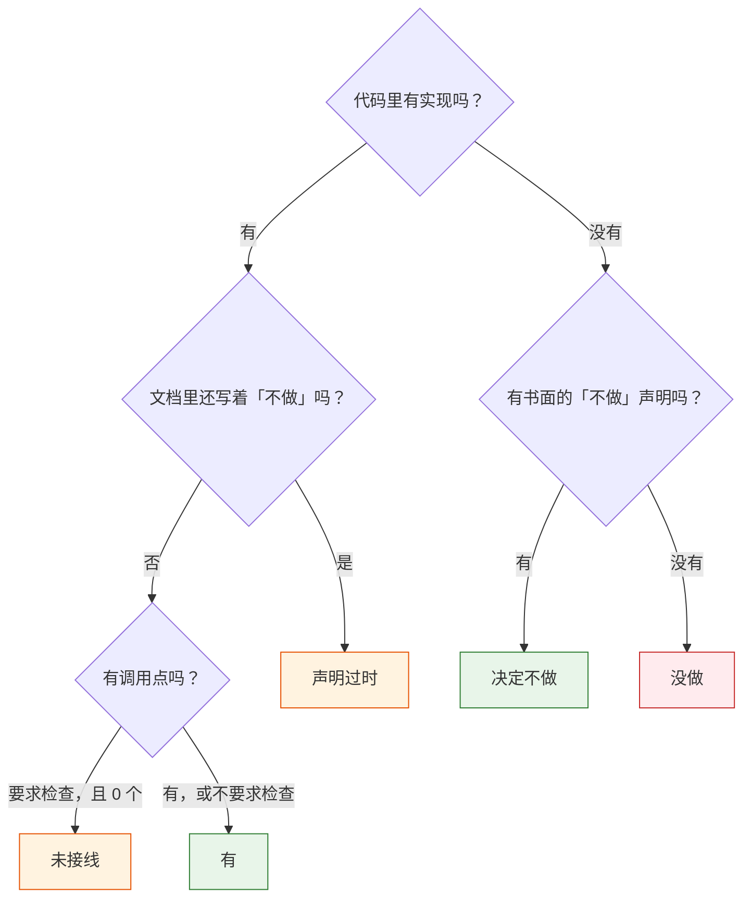
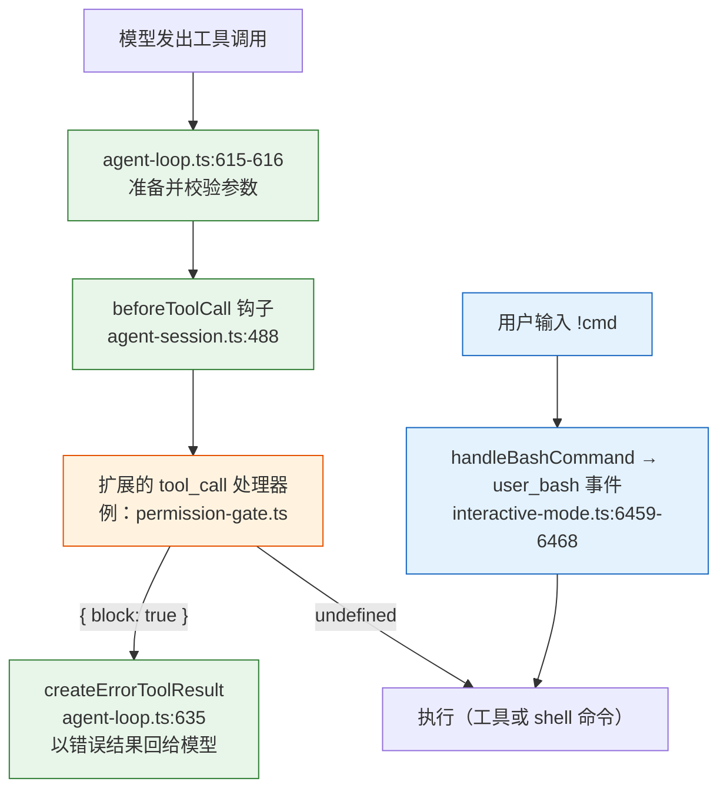
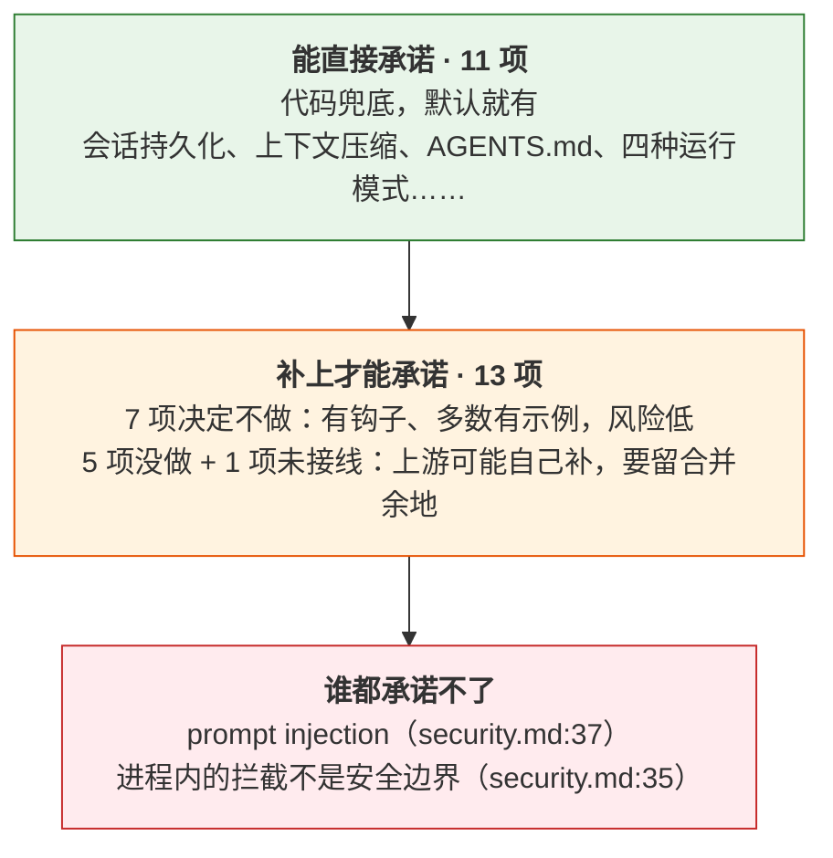

# 第 4 章 能力边界：可以承诺什么

> 基准：pi `b79e4cc8` (v0.84.4)　·　[版本表](../../research/BASELINE.md)　·　[参与指南](../../CONTRIBUTING.md)

**状态**：✅ 已完成

## 本章回答

- 24 项能力里哪些是「没做」，哪些是「论证过之后决定不做」
- 作为产品，你能对用户承诺什么

## 素材来源

- `research/pi/01-product-teardown.md` §1.7 能力盘点表
- `research/pi/05-tools-permissions.md` §5.4、`08-observability.md` §8.1–8.5
- 对照：`Step-Code` `7dd66cb9`
- 配套代码：[`examples/ch04-capability-audit/`](../../examples/ch04-capability-audit/)

---

选型时最常见的问题是「它支持 X 吗」。对 pi 来说，这个问题的答案有四种，而不是两种：

| 数字 | 状态 | 意思 |
| --- | --- | --- |
| **11** | 有 | 代码里有实现，默认就能用 |
| **7** | 决定不做 | 代码里没有，文档里写明了不做、为什么不做、你该怎么办 |
| **5** | 没做 | 代码里没有，文档里也没有表态 |
| **1** | 未接线 | 接口和类型都写好了，但没有任何代码调用它 |

这 24 项来自 [research/pi/01-product-teardown.md](../../research/pi/01-product-teardown.md) §1.7 的能力盘点。本章把四种状态的界线讲清楚，再回答一个产品问题：**基于 pi 做产品，哪些事你可以直接对用户承诺，哪些要自己补上才能承诺，哪些谁都承诺不了。**

「决定不做」和「没做」都是「没有」，为什么要分开？因为它们对你的意义完全不同：

- **决定不做**的能力，上游不会在某个版本里突然加上，你补的实现不会和上游冲突。上游还会给你留好钩子。
- **没做**的能力，上游随时可能用自己的方式补上。你先补了，就要准备好将来和上游的实现合并或二选一（第 24 章）。

4.6 节给出一个小工具，把这四种状态（再加一种下游才会出现的「声明过时」）的判定写成程序，你可以拿它审计自己的 fork。

---

## 4.1 一张 24 行的能力表

【代码事实】下表每一行的证据都可以在基准 commit 上复现。「有」引用实现所在的位置，「决定不做」引用书面声明，「没做」无从引用。

| 能力 | 状态 | 证据 | 详见 |
| --- | --- | --- | --- |
| 交互式 TUI | 有 | `packages/tui/src/tui-main-screen.ts:123` | 第 2 章 |
| print / JSON / RPC / SDK 四种模式 | 有 | `coding-agent/src/cli/args.ts:11` | 第 3 章 |
| 会话持久化（JSONL，树形可分支） | 有 | `coding-agent/src/core/session-manager.ts:641` | 第 28 章 |
| 上下文压缩（绝对预留 16,384 token） | 有 | `core/compaction/compaction.ts:134,235` | 第 28 章 |
| AGENTS.md / CLAUDE.md | 有 | `core/resource-loader.ts:72` | 第 12 章 |
| Skills | 有 | `core/package-manager.ts:382` | 第 12 章 |
| 内置工具（8 个，默认开 4 个） | 有 | `core/agent-session.ts:2801-2803` | 第 10 章 |
| 扩展系统 | 有 | `core/extensions/types.ts:1252` | 第 8 章 |
| Provider 运行时注册 | 有 | `core/agent-session-services.ts:160` | 第 11 章 |
| 包分发 | 有 | `core/package-manager.ts:806` | 第 13 章 |
| 主题 | 有 | `coding-agent/src/config.ts:405` | — |
| 工具执行前的权限确认 | **决定不做** | `coding-agent/README.md:503` | 第 16 章 |
| 沙箱 | **决定不做** | `coding-agent/docs/security.md:33` | 第 17 章 |
| MCP | **决定不做** | `coding-agent/README.md:499` | 第 15 章 |
| 子 agent | **决定不做** | `coding-agent/README.md:501` | 第 19 章 |
| Plan mode | **决定不做** | `coding-agent/README.md:505` | 第 19 章 |
| 内置 to-do | **决定不做** | `coding-agent/README.md:507` | — |
| 后台 bash | **决定不做** | `coding-agent/README.md:509` | — |
| Code Mode | 没做 | — | 第 29 章 |
| 跨会话记忆 | 没做 | — | 第 12 章 |
| 结构化日志 | 没做 | — | 第 20 章 |
| provider 录制回放 | 没做 | — | 第 14 章 |
| 自检命令（doctor） | 没做 | — | 第 14 章 |
| span 遥测 | **未接线** | `packages/agent/src/harness/telemetry.ts:138,602`，0 个调用点 | 第 20 章 |

11 项「有」在本书其他章节各有展开，本章不再重复。下面三节讨论剩下的 13 项。

---

## 4.2 「没做」和「决定不做」怎么区分

「决定不做」不是一个态度，是一组可以检查的事实。本章用三条判据，前一条是必要条件，后两条决定这个「不做」的质量：

1. **有书面声明。** 文档里能指到具体的一行，而不是从代码里推断出来的「好像没有」。这一条把「决定不做」和「没做」分开。
2. **给了理由或替代方案。** 只说「不做」不够，要告诉用户需要这个能力时该怎么办。
3. **留了机制。** 用户自己补的时候，有现成的钩子可以挂，最好还有一个能跑的示例。

第一条是可以机械判定的，后两条要人读。4.6 节的工具只检查第一条，然后在此基础上多分出两种状态：

- **未接线**：代码里有实现，但没有调用点。它既不是「有」（用户用不到），也不是「没做」（契约已经定了，补的时候要按这个契约来）。
- **声明过时**：代码里有实现，文档却还写着「不做」。这只在下游出现——fork 补上了能力，但没改 README。4.5 节会看到 Step-Code 有 6 项处在这个状态。



*图 4-1 五种状态的判定顺序。绿色两种是「说清楚了」的状态；橙色两种是代码与文档、定义与调用之间的不一致；红色是没有任何表态的空白。*

注意判定顺序里「声明过时」排在「未接线」前面：只要实现和「不做」声明同时存在，最该告诉读者的就是文档已经不可信，接没接线是次要的问题。

---

## 4.3 七个「决定不做」

### 声明写在哪

【代码事实】六条写在产品手册的 Philosophy 一节，紧跟在一句总纲后面：

```text
// packages/coding-agent/README.md:497-509（节选）
Pi is aggressively extensible so it doesn't have to dictate your workflow. Features that
other tools bake in can be built with extensions, skills, or installed from third-party
pi packages. This keeps the core minimal while letting you shape pi to fit how you work.

No MCP. Build CLI tools with READMEs (see Skills), or build an extension that adds MCP support.
No sub-agents. There's many ways to do this. Spawn pi instances via tmux, or build your own
  with extensions, or install a package that does it your way.
No permission popups. Run in a container, or build your own confirmation flow with extensions
  inline with your environment and security requirements.
No plan mode. Write plans to files, or build it with extensions, or install a package.
No built-in to-dos. They confuse models. Use a TODO.md file, or build your own with extensions.
No background bash. Use tmux. Full observability, direct interaction.
```

`docs/usage.md:309` 用一句话重复了同样的六项。第七条「沙箱」单独写在安全文档里，篇幅最长，4.3 节后半部分专门讲。

### 七条各自给了什么

把三条判据逐项对一遍：

| 能力 | 声明 | 理由 / 替代方案 | 机制 | 示例扩展（`examples/extensions/`） |
| --- | --- | --- | --- | --- |
| 权限确认 | `README.md:503` | 用容器，或自己写确认流程 | `tool_call` 事件可返回 `{ block: true }` | `permission-gate.ts` 34 行、`confirm-destructive.ts` 59 行、`protected-paths.ts` 30 行 |
| 沙箱 | `docs/security.md:33` | 进程内沙箱会被误当成安全边界；交给 OS / 容器 | 替换内置工具的执行后端 | `sandbox/` 321 行、`gondolin/` 531 行 |
| MCP | `README.md:499` | 用「CLI + README」代替；附一篇博客 | 扩展可注册任意工具 | **无** |
| 子 agent | `README.md:501` | 用 tmux 起多个 pi，或写扩展 | 扩展可注册工具、可起子进程 | `subagent/` 1,195 行（10 个文件） |
| Plan mode | `README.md:505` | 计划写进文件 | `tool_call` 拦截 + 工具集切换 | `plan-mode/` 558 行 |
| 内置 to-do | `README.md:507` | **"They confuse models."** 用 TODO.md | 扩展工具 + 会话状态 | `todo.ts` 297 行 |
| 后台 bash | `README.md:509` | 用 tmux："Full observability, direct interaction." | — | `interactive-shell.ts` 196 行（只接管用户的 `!` 命令） |

（示例扩展的行数只计 `.ts`。）

几个值得注意的细节：

- 【代码事实】**理由只有两条是关于模型行为的。** to-do 的理由是 "They confuse models"，后台 bash 的理由是可观测性。其余五条的理由都是「每个人的需求不一样，你自己决定」。
- 【代码事实】**MCP 是七条里唯一没有示例扩展的。** `examples/` 下搜不到 `@modelcontextprotocol`。README 的 "What's possible" 列表（`README.md:385-397`）把 "MCP server integration" 列为扩展能做的事，但上游自己没有写。
- 【代码事实】**示例扩展不会自动加载。** 扩展的加载位置是 `~/.pi/agent/extensions/`、`.pi/extensions/` 或 pi 包（`README.md:399`），`examples/extensions/` 不在其中。「有示例」的意思是「有一份可以抄的代码」，不是「装好就有」。

### 以权限为例：拦截点是机制，「拦什么」是策略

「不做权限确认」不等于「拦不住工具调用」。pi 在循环里留了一个拦截点，任何工具执行前都会经过它：

```ts
// packages/agent/src/agent-loop.ts:615-644（节选）
const preparedToolCall = prepareToolCallArguments(tool, toolCall);
const validatedArgs = validateToolArguments(tool, preparedToolCall);
if (config.beforeToolCall) {
  const beforeResult = await config.beforeToolCall(
    { assistantMessage, toolCall, args: validatedArgs, context: currentContext },
    signal,
  );
  // …
  if (beforeResult?.block) {
    const result = createErrorToolResult(beforeResult.reason || "Tool execution was blocked");
    if (beforeResult.terminate === true) {
      result.terminate = true;
    }
    return { kind: "immediate", result, isError: true };
  }
}
```

返回值的契约很小：

```ts
// packages/agent/src/types.ts:56-70（节选）
/**
 * Returning `{ block: true }` prevents the tool from executing. The loop emits an error tool result instead.
 * `reason` becomes the text shown in that error result. If omitted, a default blocked message is used.
 */
export interface BeforeToolCallResult {
  block?: boolean;
  reason?: string;
  terminate?: boolean;
}
```

产品层只做一件事：把这个钩子转发给扩展的 `tool_call` 事件。没有扩展订阅时直接放行；扩展抛出非 `Error` 的异常时，**按拦截处理**而不是放行：

```ts
// packages/coding-agent/src/core/agent-session.ts:487-507（节选）
private _installAgentToolHooks(): void {
  this.agent.beforeToolCall = async ({ toolCall, args }) => {
    const runner = this._extensionRunner;
    if (!runner.hasHandlers("tool_call")) {
      return undefined;
    }
    try {
      return await runner.emitToolCall({
        type: "tool_call",
        toolName: toolCall.name,
        toolCallId: toolCall.id,
        input: args as Record<string, unknown>,
      });
    } catch (err) {
      if (err instanceof Error) {
        throw err;
      }
      throw new Error(`Extension failed, blocking execution: ${String(err)}`);
    }
  };
```

策略留给扩展。官方示例 `permission-gate.ts` 只有 34 行，完整地展示了一条策略要做的三个决定——拦什么、问谁、没人可问时怎么办：

```ts
// packages/coding-agent/examples/extensions/permission-gate.ts:10-34
export default function (pi: ExtensionAPI) {
  const dangerousPatterns = [/\brm\s+(-rf?|--recursive)/i, /\bsudo\b/i, /\b(chmod|chown)\b.*777/i];

  pi.on("tool_call", async (event, ctx) => {
    if (event.toolName !== "bash") return undefined;

    const command = event.input.command as string;
    const isDangerous = dangerousPatterns.some((p) => p.test(command));

    if (isDangerous) {
      if (!ctx.hasUI) {
        // In non-interactive mode, block by default
        return { block: true, reason: "Dangerous command blocked (no UI for confirmation)" };
      }

      const choice = await ctx.ui.select(`⚠️ Dangerous command:\n\n  ${command}\n\nAllow?`, ["Yes", "No"]);

      if (choice !== "Yes") {
        return { block: true, reason: "Blocked by user" };
      }
    }

    return undefined;
  });
}
```

`!ctx.hasUI` 那个分支是这份示例最值得抄的地方：print / JSON / RPC 模式下没有人能回答确认框，**默认拒绝**。第 16 章会把它扩展成完整的权限策略。



*图 4-2 权限拦截的机制与策略。绿色是 pi 提供的机制，橙色是你写的策略。蓝色路径是用户自己在交互界面里敲的 `!` 命令，走的是 `user_bash` 事件，不经过 `beforeToolCall`。*

【代码事实】图里蓝色那条路径说明了一个容易忽略的边界：**`tool_call` 拦截只管模型发起的调用。** 用户在交互模式里输入 `!rm -rf build` 时，`handleBashCommand`（`interactive-mode.ts:6459`）发出的是 `user_bash` 事件（`:6463`），`permission-gate.ts` 看不到它。这多半就是想要的行为——用户自己敲的命令不需要再问用户。但如果你的策略是「某个目录谁都不能写」，就必须同时订阅两个事件。

### 以沙箱为例：为什么不做一个「部分的」

七条声明里，沙箱是论证写得最完整的一条：

```text
// packages/coding-agent/docs/security.md:33-37（节选）
Pi does not include a built-in sandbox. Built-in tools can read files, write files, edit files,
and run shell commands with the permissions of the pi process. Extensions are TypeScript modules
that run with the same permissions. …

This is intentional. … A partial in-process sandbox would be easy to misunderstand as a security
boundary while still depending on the host shell, filesystem, package managers, credentials, and
extension code. Real isolation needs to come from the operating system or a virtualization/container
boundary.

Project trust is only an input-loading guard. … Prompt injection from repository files, comments,
documentation, context files, or build output is expected local-agent risk and cannot be reliably
prevented by pi.
```

这段话的逻辑是：**一个不完整的安全措施比没有更危险，因为它会让人以为自己安全了。** 所以 pi 选择什么都不做，并把替代方案写清楚——仓库根 README 的 "Permissions & Containerization" 一节（`README.md:38-46`）给出三种模式：

| 模式 | 隔离了什么 | 代价 |
| --- | --- | --- |
| Gondolin 扩展 | 内置工具与 `!` 命令，跑在本地 Linux 微虚拟机里 | 需要 Linux 微虚拟机；pi 进程本身和凭据留在宿主机 |
| Docker | 整个 pi 进程 | provider 的 API key 进入容器（`docs/containerization.md:14`） |
| OpenShell | 整个 pi 进程，跑在策略控制的沙箱里 | 需要 OpenShell 网关 |

【推断】这里有一个可以直接继承的判断：**确认框和沙箱解决的是两个问题。** 确认框防的是「模型做了用户不想要的事」，沙箱防的是「做了之后伤到不该伤的东西」。前者在进程内就能做（图 4-2），后者必须在进程外。4.5 节会看到，一个下游补了前者、没补后者。

### 判断依据

- **七条「不做」都满足第一条判据**：有书面声明，可以引用到行。【代码事实】
- **六条满足全部三条判据**：有理由或替代方案、有机制、有示例扩展。MCP 缺示例扩展。【代码事实】
- **这些「不做」大概率是长期的**：理由不是「还没来得及」，而是「这是策略，策略因人而异」；沙箱一条甚至论证了「做了反而有害」。所以你补的实现与上游冲突的风险低。【推断】

---

## 4.4 五个「没做」和一个半成品

### 五个空白

【代码事实】以下五项在基准 commit 的源码（`packages/*/src/**`，排除测试）里搜不到实现，文档里也没有表态：

| 能力 | 搜了什么（`git grep -E`） | 最接近的现有物 |
| --- | --- | --- |
| Code Mode（让模型写代码调工具，而不是逐个调用） | `codeMode\|code_mode\|runCode\|executeCode` | 无 |
| 跨会话记忆 | `MEMORY\.md\|memories\|memoryStore\|saveMemory` | AGENTS.md + 压缩摘要 |
| 结构化日志 | `createLogger\|LogLevel\|pino\|winston` | 裸 `console.*`：`coding-agent` 130 处、`ai` 12 处、`agent` 1 处 |
| provider 录制回放 | `PI_TRACE\|PI_RECORD\|PI_REPLAY\|recordRequest` | 无 |
| 自检命令（doctor） | `doctor` | `pi auth check`（`cli/auth-check.ts:27`），只查凭据 |

【推断】这五项里对产品化影响最大的是**录制回放**：用户报告「模型在第 7 轮做了一件奇怪的事」时，没有 provider 级别的请求/响应记录，你只能看会话 JSONL 里模型说了什么，看不到模型实际收到了什么。第 14 章会补上它。

### 一个半成品：span 遥测

【代码事实】`packages/agent/src/harness/telemetry.ts` 定义了完整的 span 契约，两个入口函数 `startAiSpan`（`:138`）和 `startHarnessSpan`（`:602`）都从包入口导出（`packages/agent/src/index.ts:105-106`）。但在全仓源码里，**它们没有一个调用点**；产品包 `coding-agent` 的 `package.json` 也不依赖 `pi-telemetry`。

这就是 4.2 节说的「未接线」：比「没做」多走了一步——契约定了。你要补遥测，最好按这个契约补，否则上游哪天把它接上，你就有两套。第 20 章会做这件事。

### 表外的一项：异步异常

【代码事实】24 项之外还有一个值得记下的空白：**全仓源码里没有 `unhandledRejection` 处理器。** `uncaughtException` 只在交互模式里处理（`interactive-mode.ts:4062-4064`，`prependListener` 挂上 `uncaughtCrash`）；print、JSON、RPC 模式下，一个没人 `await` 的 Promise 被拒绝，进程的行为由 Node 的默认策略决定。第 22 章的上线清单会把它列进去。

### 判断依据

- **「没做」的五项都没有书面表态**：既没有说不做，也没有说要做。【代码事实】
- **这五项上游随时可能补**：它们都不是「策略」，而是基础设施，没有「因人而异」的理由不做。你先补，就要为将来的合并留余地——用扩展而不是改源码，用上游已有的契约（如 span 遥测）而不是自己另起一套。【推断】

---

## 4.5 你能对用户承诺什么

把 24 项按「谁来兜底」重新分组，就得到产品承诺的三个层次：



*图 4-3 产品承诺的三个层次。越往下，越依赖你自己的工作，也越需要在给用户的文档里写清楚。*

第三层最容易被忽略。【代码事实】pi 的安全文档把两件事明确划在安全边界之外（`docs/security.md:59`）：没有内置沙箱，以及来自不可信内容的 prompt injection。**你在 pi 之上加的任何东西都改变不了第二件事**——确认框能让用户在危险操作前看一眼，但看不出一条看似正常的命令是不是被仓库里某个注释诱导出来的。

所以给用户的承诺应该这样写：

| 不要这样写 | 应该这样写 |
| --- | --- |
| 「安全模式下 agent 不会做危险操作」 | 「Ask 模式下，写文件和执行命令前会征求你的确认」 |
| 「支持沙箱」（实际只是确认框） | 「需要隔离时，请在容器中运行」 |
| 「能防止 prompt injection」 | 「仓库里的内容可能影响 agent 的行为；请只在你信任的仓库里使用自动模式」 |

### 下游怎么做的：Step-Code

【代码事实】用 4.6 节的工具对照 pi 与 Step-Code，24 项里有 6 项状态不同，全部从「决定不做」变成了「声明过时」（下表路径都在 `packages/coding-agent/` 下）：

| 能力 | Step-Code 的实现 | README 里还写着 |
| --- | --- | --- |
| 权限确认 | `src/step/permissions.ts:22-23`：四个预设 `ask / read-only / bypass / autopilot`，三种模式 `confirm / strict / auto` | `README.md:443` "No permission popups." |
| MCP | `src/step/mcp-client.ts:1` 引入 `@modelcontextprotocol/sdk`，`src/step/mcp.ts:97` `createStepMcpExtension` | `README.md:439` "No MCP." |
| 子 agent | `src/features/step-subagent.ts:542` 注册 `subagent` 工具 | `README.md:441` "No sub-agents." |
| Plan mode | `src/features/plan-mode-tools.ts:25` `StepPlanModeController` | `README.md:445` "No plan mode." |
| 任务清单 | `src/features/step-tasks.ts:297-413`：`task_create / task_update / task_get / task_list` 四个工具 | `README.md:447` "No built-in to-dos." |
| 后台 bash | `src/step/tool-profile.ts:137-142`：模型可见的 `run_command` 带 `run_in_background`，`:1405-1409` 转给 `startBackgroundCommand`（`:1160`） | `README.md:449` "No background bash." |

三点观察：

1. 【代码事实】**补法几乎完全走 pi 留的机制。** Step-Code 的权限系统挂在同一个 `tool_call` 事件上（`src/features/step.ts:242-244`：`pi.on("tool_call", …)` → `permissions.handleToolCall(event, ctx)`），没有改循环。它的 `ask` 预设在无界面时的取值是 `nonInteractiveApproval: "deny"`（`permissions.ts:38-45`），`handleToolCall` 里 `!context.hasUI` 的分支（`:535-545`）在默认取值下直接拦下，与 `permission-gate.ts` 的 `!ctx.hasUI` 分支是同一个决定。
2. 【代码事实】**后台有两条通道，只有一条对模型开放。** 子 agent 的 `run_in_background` 被定义成内部控制，注释写明它「intentionally absent from the model-facing Pi schema」（`step-subagent.ts:236-237`），后台通道只留给嵌入式调用方（`:552-554`）。shell 不一样：Step-Code 把 pi 的内置工具整套换成自己的工具面（`tool-profile.ts`），其中 `run_command` 的 `run_in_background` 是模型可以直接传的参数，命令脱离会话启动、日志落盘、会话退出时一并终止。这一项不是挂在扩展事件上的，而是 `main.ts` 新增的 `toolProfile` 选项（`src/main.ts:793-801`）：工具定义作为 `customTools` 注册，并在用户没指定 `--tools` 时关掉 pi 的内置工具（`:1228-1235`）。权限层也为它单开了一条规则：后台命令不套用户配置的命令前缀（`src/step/permissions.ts:345-348`）。
3. 【代码事实】**沙箱仍然没有。** 它不只是没做，而是被显式拒绝：

```ts
// Step-Code: packages/coding-agent/src/step/stdio-host.ts:439-445
if (options.sandbox?.enabled === true) {
  this.#respondError(
    frame,
    "SANDBOX_UNAVAILABLE",
    new Error("sandbox.enabled was requested but the Step runtime has no sandbox adapter"),
  );
  return;
```

【推断】按本书的立场只看「谁选了什么、代价是什么」：Step-Code 选择把 pi 留给用户的六项策略产品化。代价有两个。一是**文档失真**：README 的 Philosophy 一节（`README.md:435-449`）原样继承自上游，现在描述的是另一个产品。读者照着 README 判断能力边界，会得出错误结论。二是**它恰好落在 `security.md:35` 警告的那个位置**——有了进程内的权限预设，却没有进程外的隔离。这不是错误，`SANDBOX_UNAVAILABLE` 说明它很清楚这一点；但它意味着「Ask 模式」在产品文档里必须被描述成确认流程，而不是安全边界。

### 判断依据

- **能直接承诺的只有 11 项**，且都有实现位置可查。【代码事实】
- **「决定不做」的 7 项是最安全的补齐对象**：有钩子、有示例、上游不会来抢。Step-Code 补了其中 6 项：5 项通过扩展事件，后台 bash 通过替换整套工具面。【代码事实】
- **补齐之后，记得改掉继承来的「不做」声明**——否则你的文档与代码相互矛盾，4.6 节的工具会把它标成「声明过时」。【推断】
- **prompt injection 不在任何人的承诺范围内**，你的产品文档应当明说。【代码事实 + 推断】

---

## 4.6 你的最小实现：审计你的 fork

4.1 节那张表是人读代码得来的。配套代码 [`examples/ch04-capability-audit/`](../../examples/ch04-capability-audit/) 把它写成了一个零依赖的小工具：给一份能力清单和一个仓库，逐项取证、归进五种状态；给两个仓库，逐项对照。它回答的问题是：**我的 fork 补了上游哪些能力，文档有没有跟上。**

图 4-1 的判定顺序是一个纯函数：

```ts
// examples/ch04-capability-audit/src/classify.ts:31-38
export function classify(e: Evidence): Status {
  if (e.present.length > 0) {
    if (e.declared.length > 0) return "声明过时";
    if (e.wired !== undefined && e.wired.length === 0) return "未接线";
    return "有";
  }
  return e.declared.length > 0 ? "决定不做" : "没做";
}
```

三组证据来自清单里的「探针」。一个探针就是一次 `git grep`：在哪些路径里找什么正则。每项能力最多三组探针——`present` 找实现，`wired` 找调用点，`declared` 找「不做」声明：

```ts
// examples/ch04-capability-audit/src/pi-manifest.ts:37-42, 84-90（节选）
{
  id: "sandbox",
  name: "沙箱",
  present: [inSrc("sandbox-exec|bubblewrap|bwrap|seccomp|landlock")],
  declared: [inDocs("does not include a built-in sandbox")],
},
// …
{
  id: "span-telemetry",
  name: "span 遥测",
  present: [inSrc("export function (startAiSpan|startHarnessSpan)")],
  // 调用可能带泛型参数：startAiSpan<"x">(…)
  wired: [inSrc("(startAiSpan|startHarnessSpan)[<(]")],
},
```

对 pi 基准运行：

```text
$ npm start -- ../pi
pi：24 项能力

状态      能力                      证据
有        交互式 TUI                packages/tui/src/tui-main-screen.ts:123
有        print / JSON / RPC / SDK  packages/coding-agent/src/cli/args.ts:11
…（其余 9 项「有」）
决定不做  工具执行前的权限确认      packages/coding-agent/README.md:503
决定不做  沙箱                      packages/coding-agent/docs/security.md:33
决定不做  MCP                       packages/coding-agent/README.md:499
…（其余 4 项「决定不做」）
没做      Code Mode                 —
…（其余 4 项「没做」）
未接线    span 遥测                 packages/agent/src/harness/telemetry.ts:138（0 个调用点）

有 11 · 未接线 1 · 声明过时 0 · 决定不做 7 · 没做 5
```

对照 Step-Code，只有状态变了的行才列证据：

```text
$ npm start -- ../pi ../Step-Code
能力                      pi        Step-Code   变化的证据
…
工具执行前的权限确认      决定不做  → 声明过时  packages/coding-agent/src/step/permissions.ts:24 ↔ packages/coding-agent/README.md:443
沙箱                      决定不做  决定不做
MCP                       决定不做  → 声明过时  packages/coding-agent/src/step/mcp-client.ts:1 ↔ packages/coding-agent/README.md:439
子 agent                  决定不做  → 声明过时  packages/coding-agent/src/features/step-subagent.ts:542 ↔ packages/coding-agent/README.md:441
Plan mode                 决定不做  → 声明过时  packages/coding-agent/src/features/plan-mode-tools.ts:26 ↔ packages/coding-agent/README.md:445
内置 to-do                决定不做  → 声明过时  packages/coding-agent/src/features/step-tasks.ts:297 ↔ packages/coding-agent/README.md:447
后台 bash                 决定不做  → 声明过时  packages/coding-agent/src/step/tool-profile.ts:1160 ↔ packages/coding-agent/README.md:449
…

pi：有 11 · 未接线 1 · 声明过时 0 · 决定不做 7 · 没做 5
Step-Code：有 11 · 未接线 1 · 声明过时 6 · 决定不做 1 · 没做 5
6 项状态不同
```

4.5 节那张 Step-Code 表就是从这份输出整理出来的。工具给的是探针第一次命中的那一行，比如权限确认落在 `permissions.ts:24`（类型定义的下一行），Plan mode 落在接口的第一个方法上；整理成表时，人再把它校到定义处。

### 写探针的五个教训

写这份清单时踩过的坑，都已经体现在代码里：

1. **探针是线索，不是结论，而且两个方向都会错。** 「后台 bash」最初的探针是在全部源码里找 `background`，命中了子 agent 的 `run_in_background`——误报。于是把搜索范围收窄到 pi 放工具的目录 `core/tools/`，结果又漏了 Step-Code：它的 `run_command` 定义在 `step/tool-profile.ts`，工具报「决定不做」，本书初稿也照抄了这个结论。现在的探针先看工具目录，再按「启动后台命令」这个动作在整个产品源码里兜底（`pi-manifest.ts:68-79`）。**这正是输出里必须带 `file:line` 的原因**：误报时，引用会立刻暴露它；漏报没有引用可看，只能靠换一个角度再搜一次——这里是从 README 的「No background bash」反查模型实际看到的工具 schema。
2. **最具体的探针写在前面。** `present` 按顺序试，第一个有命中的提供证据（`classify.ts:43-49`）。「子 agent」先找工具注册 `name: "subagent"`，找不到再退到宽泛的 `sub-?agent`；否则引用的可能是一行 re-export，而不是实现。
3. **定义处不是调用点。** `startAiSpan[<(]` 也会命中 `export function startAiSpan<…>(` 这一行本身。工具在算调用点时，把与 `present` 命中同一行的结果剔除（`classify.ts:57-58`）。
4. **找命令，不要找单词。** 「doctor」最初的探针就是 `doctor` 这个词，对照 Step-Code 时命中了 `src/step/mcp-environment.ts:2` 的一行注释 "shared by the MCP runtime and the plugin doctor"，把「没做」报成了「有」。现在的探针要求它是一个带引号或斜杠的命令名，或者一次 `registerCommand("doctor"` 调用（`pi-manifest.ts:90`）。
5. **工具会搜到自己。** 清单里写满了探针字符串。把本书仓库提交之后直接审计它，`pi-manifest.ts` 会让沙箱、MCP 等 9 项显示为「有」。被审计的仓库包含本工具时，工具会排除自己所在的目录（`main.ts` 的 `selfIn`）。

`npm test` 跑 23 个用例，覆盖五种状态的判定、探针短路、定义处剔除、清单校验（用户给的 JSON 是外部输入，每个错误都带出错位置）、`git grep` 的退出码约定（1 = 没有命中，不是错误）和终端对齐。

给自己的 fork 写清单：复制 `src/pi-manifest.ts` 的结构写成 JSON，用 `--manifest` 传入。路径用 `**/coding-agent/src/**` 这样的 glob，而不是 `packages/coding-agent/src/**`——同一份清单就能跑在把 pi 放进子目录的 fork 上。

---

## 本章小结

- **pi 的 24 项能力分四种状态**：有 11、决定不做 7、没做 5、未接线 1。「没有」要分成「决定不做」和「没做」，因为它们对你的 fork 意味着不同的冲突风险。
- **「决定不做」是可检查的**：有书面声明（必要条件），有理由或替代方案，有机制和示例扩展。七项里六项三条全满足，MCP 缺示例扩展。
- **机制与策略的分界线是 `beforeToolCall`**：循环提供拦截点（`agent-loop.ts:615-644`），产品层转发给扩展（`agent-session.ts:487-507`），拦什么由你写（`permission-gate.ts` 34 行）。用户的 `!` 命令走另一条路径。
- **沙箱的「不做」论证最充分**：进程内的部分沙箱会被误当成安全边界（`security.md:35`）；隔离要来自 OS 或容器。
- **你能承诺的有三层**：11 项直接承诺；13 项补上才能承诺；prompt injection 谁都承诺不了。
- **Step-Code 补了六项「决定不做」**：五项通过扩展事件，后台 bash 通过替换整套工具面；继承来的 README 没改，六项都成了「声明过时」。沙箱仍被显式拒绝（`stdio-host.ts:439-445`）。
