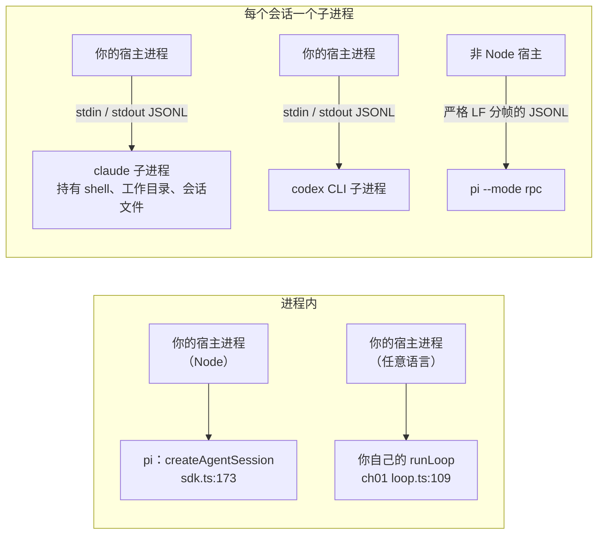
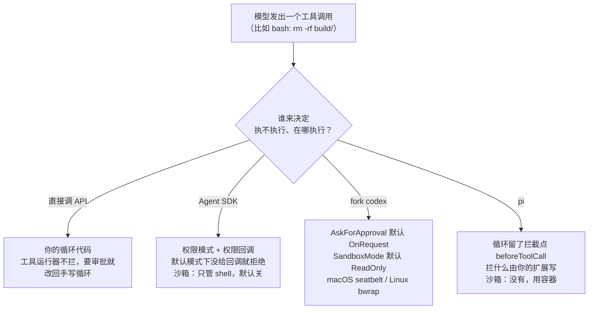
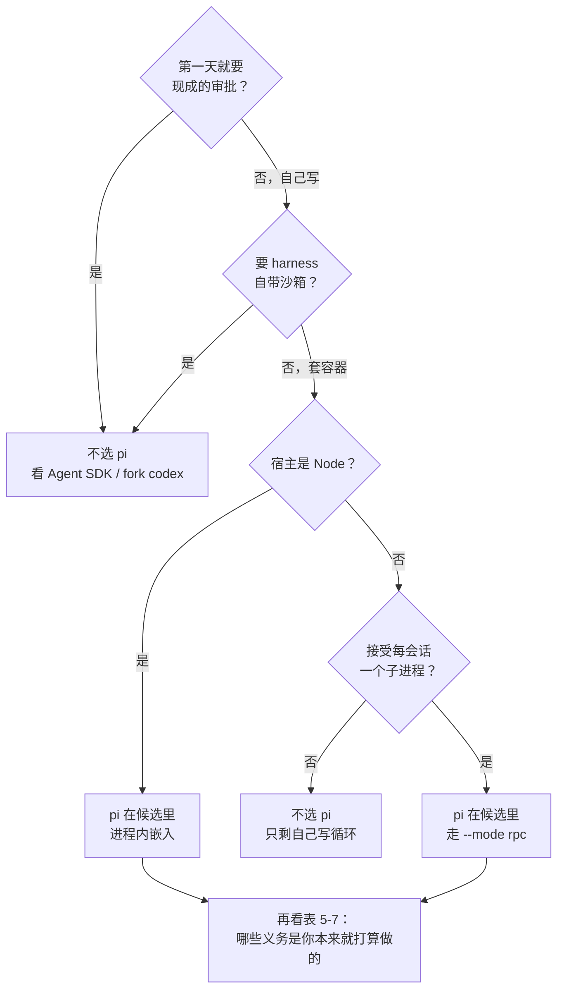
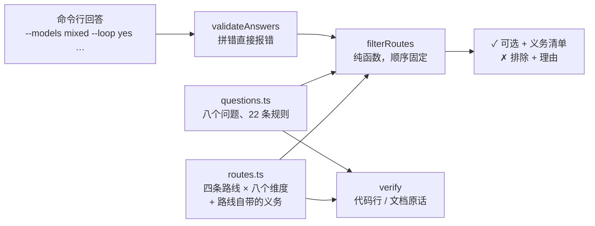

# 第 5 章 该不该用 Pi：横向对照

> 基准：pi `b79e4cc8` (v0.84.4)　·　[版本表](../../research/BASELINE.md)　·　[参与指南](../../CONTRIBUTING.md)

**状态**：✅ 已完成

## 本章回答

- 做一个 code agent，除了基于 pi，常见的还有哪几条路：直接调模型 API、Claude Agent SDK、fork codex
- 四条路在语言、许可、模型、进程模型、内置策略、循环、上游、节奏八件事上各选了什么
- 与另外三条相比，pi 的取舍是什么：给你什么、留给你什么
- 什么条件下不该选 pi——哪些是一票否决，哪些只是要多扛一件事
- 怎么把自己项目的硬约束写成规则，让「选哪条」变成一次可复查的过滤，而不是一次打分

## 素材来源

- 全新调研：本书唯一需要走出 pi 生态的一章
- pi：基准 commit `b79e4cc8`；codex：`1cc7e236`（2026-09-28，Apache-2.0，已加进 [BASELINE.md](../../research/BASELINE.md) 的版本表）
- Claude Agent SDK：**只用公开文档**，2026-10-04 抓取：[overview](https://code.claude.com/docs/en/agent-sdk/overview)、[agent-loop](https://code.claude.com/docs/en/agent-sdk/agent-loop)、[hosting](https://code.claude.com/docs/en/agent-sdk/hosting)、[sandboxing](https://code.claude.com/docs/en/sandboxing)、[llm-gateway](https://code.claude.com/docs/en/llm-gateway)、[tool-runner](https://platform.claude.com/docs/en/agents-and-tools/tool-use/tool-runner)
- 下游的选择：复用 [第 2 章](./ch02-what-is-pi.md) 2.5 与 [BASELINE.md 的血缘一节](../../research/BASELINE.md#血缘谁和-pi-是什么关系)
- 新写 [`examples/ch05-route-filter/`](../../examples/ch05-route-filter/)

（pi 的路径以仓库根为准，`packages/coding-agent/README.md` 简写为 `PI_README`；codex 的路径以仓库根为准，`codex-rs/` 下是 Rust 实现。本章带 `【代码事实】` 的是在源码里逐行核对过的，带 `【推断】` 的是从代码或文档推出来、没有实跑验证的，带 `【实机】` 的是在 `examples/ch05-route-filter/` 里跑出来或用命令量出来的：macOS arm64，Node v22.22.3。带 `【文档】` 的是公开文档的原话，英文照抄不翻译，抓取日期 2026-10-04——文档没有 commit，只能写「哪天看到的」，例子里的 `verify --online` 会把这些原话和页面逐字比对一遍。）

---

前四章只看 pi：它是什么（第 2 章）、有哪几种用法（第 3 章）、做了什么不做什么（第 4 章）。这些都是在回答「pi 长什么样」。这一章换一个问题：**拿到一个「我们要做一个 code agent」的需求，为什么是 pi，而不是别的？**

别的选择不止一个。最朴素的是直接调模型 API，自己写那个循环——第 1 章那 221 行就是。往上一层，Anthropic 把 Claude Code 做成了库，叫 Claude Agent SDK。再往上，OpenAI 的 codex 是 Apache-2.0 的完整产品，整仓 fork 下来改也是一条路。pi 夹在中间：比第一条多给了很多，比后两条留给你的多得多。

这四条路很难放在一把尺子上比。它们不是同一种东西的四个版本，而是**四种分工**：模型适配、循环、工具、审批、沙箱、界面这几层，各自由谁来写、谁来维护、出了问题找谁。所以本章不排名次，只回答「谁选了什么、代价是什么」。

先看几个数字：

| 数字 | 是什么 | 出处 |
| --- | --- | --- |
| **794** | pi 的内核 `agent-loop.ts` 的行数；里面不认识文件、bash、git | `BASELINE.md:89`；【实机】`grep -ciE` 得 0 |
| **3,167** | codex 里 `run_turn` 所在的 `turn.rs` 的行数；同一个文件里在找 `.git`、算权限档位 | 【实机】`wc -l`；`turn.rs:826-839`、`:1252` |
| **1,023,821** | codex 的 Rust 源码行数（2,998 个文件，排除测试文件） | 【实机】见 5.7 |
| **0** | codex 接受的外部代码贡献 | `codex/docs/contributing.md:5` |
| **1** | Claude Agent SDK 一个会话对应的子进程数 | 【文档】hosting |
| **40** | pi 内置的 provider 数；codex 内置的只有 OpenAI、Bedrock 和两个本地模型服务 | `BASELINE.md:92`；`model-provider-info/src/lib.rs:659-662` |
| **35 / 38** | minimax-code 的补丁台账里写明没开上游 PR 的条数 / 总条数 | [第 24 章](../04-shipping/ch24-upstream-strategy.md) |
| **99 / 0** | 例子里登记的出处条数 / 在基准 commit 和公开文档上核对失败的条数 | 【实机】5.10 |

## 5.1 四条路，各是什么

*表 5-1 四条路线：一句话，以及谁写哪一层*

| 路线 | 一句话 | 模型适配 | 循环 | 工具 | 审批 / 沙箱 | 界面 |
| --- | --- | --- | --- | --- | --- | --- |
| **直接调模型 API** | 第 1 章那 221 行的循环，或者客户端 SDK 里的 beta 工具运行器 | 你 | 你（或工具运行器） | 你 | 你 | 你 |
| **Claude Agent SDK** | 把 Claude Code 当库用：SDK 起一个 `claude` 子进程，你拿到它的工具、权限、会话和钩子 | Anthropic | Anthropic | Anthropic + 你加的 | Anthropic（可配） | 你 |
| **fork codex** | OpenAI 的 codex（Rust）整仓 fork 下来改 | fork 来的，你维护 | fork 来的，你维护 | fork 来的，你维护 | fork 来的，你维护 | fork 来的，你维护 |
| **基于 pi** | 把 pi 当 SDK 嵌进来，或者 fork 它的包；内核小、策略全留给你 | pi（40 家） | pi | pi 内置 + 扩展 | **你**（pi 明确不做） | pi 的 TUI 或你的 |

表里最后一行和其他三行的区别，在「审批 / 沙箱」那一格。直接调 API 什么都不给，所以审批沙箱是你的，这不意外；Agent SDK 和 codex 都把它们当作产品的一部分做好了；**pi 是唯一一个把其余几层做全、却单单把这一层留空的。** 这不是没来得及做，是写进了 README 的立场（第 4 章逐条核对过）。本章后面的大部分取舍，都是从这一格派生出来的。

还有两条路不在表里：托管型的 agent 服务（模型和执行环境都在别人的云上），以及别的开源 harness（比如本书对照组里的 deepseek-harness 和 ZCode，它们的代码没有拿来当库用的打算）。前者的取舍主要是数据出不出境、能不能私有部署，和 harness 的结构关系不大；后者在 5.8 作为「下游实际怎么选」出现。

## 5.2 八个维度的对照

先把整张表摆出来。这张表就是例子里 `npm start -- facts` 的输出，每一格在 `src/routes.ts` 里都带着出处，`verify` 会逐条核对：

*表 5-2 四条路线 × 八个维度*

| 维度 | 直接调模型 API | Claude Agent SDK | fork codex | 基于 pi |
| --- | --- | --- | --- | --- |
| 语言与运行时 | 任何能发 HTTP 的语言；官方工具运行器（beta）有 7 种语言的 SDK | Python 3.10+ 或 Node.js 18+；别的语言只能把 CLI 当子进程跑 | Rust 2024 edition，153 个 crate 的 workspace；TS / Python SDK 都是包一层 CLI | TypeScript，Node ≥ 22.19；进程内嵌入只能是 Node 宿主，其他语言走 RPC |
| 许可与条款 | 代码是你自己的；只受模型服务条款约束 | Anthropic 商业服务条款，不是开源许可；登录方式与品牌用法另有规定 | Apache-2.0：可以 fork、可以闭源分发，要保留 NOTICE、标明改动 | MIT：保留版权声明即可 |
| 能接的模型 | 写几个适配器就接几个 | Claude；文档明确不支持经网关路由到非 Claude 模型 | 只说 Responses API；内置 OpenAI、Bedrock 和两个本地模型服务 | 40 个 provider；不想要的可以整层换掉 |
| 进程模型 | 进程内：循环就是你的一个函数 | 一个会话一个 `claude` 子进程 | SDK 起 CLI 子进程、走 JSONL；Rust 宿主可以直接链接 crate | 进程内 `createAgentSession`；也可以 `--mode rpc` 当子进程 |
| 内置策略 | 没有 | 权限模式现成，没给回调就拒绝；沙箱只管 shell、默认关闭 | 沙箱默认只读，审批默认由模型按需发起 | 没有：不弹审批、不带沙箱，都是明说的设计选择 |
| 循环能不能改 | 全能改 | 改不了：在二进制里；能动的是选项和钩子 | 能改，但循环和产品长在一起 | 能改，而且小：794 行 |
| 改动能不能回上游 | 没有上游 | 不适用：升级 SDK 就是升级 CLI | 回不去：不接受外部代码贡献 | 开放，但新贡献者的 issue / PR 默认自动关闭 |
| 上游节奏 | 跟着模型 API 走 | semver：补丁版持续跟，小版本先读 changelog | 2026 年 4–9 月每月 879–1,448 个 commit | 2026 年 3–8 月每月 419–527 个 commit |

运行时和许可两行比较直白，这里先说完，后面几节各讲一行。

**运行时。** pi 要求 Node ≥ 22.19（`pi/package.json:63`），进程内嵌入意味着宿主就是 Node 进程。【代码事实】Agent SDK 的要求是「Python 3.10+ for the Python SDK, or Node.js 18+ for the TypeScript SDK」，其他语言「run the CLI as a subprocess with the `-p` flag and `--output-format json`」。【文档】codex 是 Rust 2024 edition（`codex-rs/Cargo.toml:165`），TypeScript SDK「wraps the `codex` CLI」（`sdk/typescript/README.md:5`）。【代码事实】直接调 API 不挑语言，Anthropic 的 tool runner「is in beta and available in the Python SDK, TypeScript SDK, C# SDK, Go SDK, Java SDK, PHP SDK, and Ruby SDK」。【文档】

**许可。** pi 是 MIT（`pi/LICENSE:1`），codex 是 Apache-2.0（`codex/LICENSE:1-2`），分发改过的版本时要「cause any modified files to carry prominent notices stating that You changed the files」（`:97-98`），仓库根还有一份 `NOTICE` 要随附。【代码事实】Agent SDK 不是开源许可：「Use of the Claude Agent SDK is governed by Anthropic's Commercial Terms of Service」；同一页还写了两条对产品形态有直接影响的限制——不允许第三方给自己的用户提供 claude.ai 登录（「Anthropic does not allow third party developers to offer claude.ai login or rate limits for their products」），产品也不能叫「"Claude Code" or "Claude Code Agent"」。【文档】这两条不管你回答什么都在，例子里把它们记成 Agent SDK 的「路线自带」义务。

## 5.3 能接的模型：谁把门开在哪

模型这一行看起来是「谁支持得多」，其实是「接新模型的那道门开在哪一层」。

**codex 把门开在线协议上，而且只开了一扇。** `WireApi` 只剩一个成员：

```
// model-provider-info/src/lib.rs：chat 线协议已删，只剩 Responses
const CHAT_WIRE_API_REMOVED_ERROR: &str = "`wire_api = \"chat\"` is no longer supported.\nHow to fix: set `wire_api = \"responses\"` in your provider config.\nMore info: https://github.com/openai/codex/discussions/7782";
// …
/// Wire protocol that the provider speaks.
#[derive(Debug, Clone, Copy, Default, PartialEq, Eq, Serialize, JsonSchema)]
#[serde(rename_all = "lowercase")]
pub enum WireApi {
    /// The Responses API exposed by OpenAI at `/v1/responses`.
    #[default]
    Responses,
}
```


内置的 provider 也是刻意少放：

```
// model-provider-info/src/lib.rs：不替用户裁定该内置哪些第三方 provider
    // We do not want to be in the business of adjucating which third-party
    // providers are bundled with Codex CLI, so we only include the OpenAI and
    // open source ("oss") providers by default. Users are encouraged to add to
    // `model_providers` in config.toml to add their own providers.
```


【代码事实】所以 fork codex 去接一个只说 Chat Completions 或 Anthropic Messages 的模型，要么在外面架一层协议转换，要么在 fork 里把 chat 线协议加回来——后者正是上游删掉的东西，每次 rebase 都要重新面对。【推断】

**Agent SDK 不开这扇门。** llm-gateway 页写得很直接：Claude Code「doesn't support routing Claude Code to non-Claude models through any gateway」。【文档】它支持经网关接入，但接的仍然是 Claude。要混用别家的模型，这条路线在第一个问题上就被排除了。

**pi 把门开在 provider 层，40 家都在里面**（`BASELINE.md:92`），每一家的流式、工具调用、用量格式都已经对齐。这一层有 23,668 行（`ch02:239`）——这也是直接调 API 时，「每家一个适配器」那项义务的参照规模。下游嫌它大，可以整层换：Step-Code 把它削到 12,178 行，内置模型目录清空（`ch02:239`）。【代码事实】

**直接调 API** 接几家就写几个适配器。只接一家时这是最轻的路线；接三家以上时，你在重写 pi 的 provider 层。【推断】

## 5.4 进程模型：在你的进程里，还是在旁边

这一行决定了部署形态，而且往往比「功能多少」更早拍板。



*图 5-1 进程模型：pi 和自己写的循环可以活在宿主进程里；Agent SDK 和 codex 的 SDK 都是起一个子进程*

**Agent SDK** 的 hosting 页把这件事写成了第一原则：「The Agent SDK spawns and supervises a `claude` CLI subprocess that owns a shell, a working directory, and session files on disk.」以及「One agent session maps to one subprocess.」【文档】资源上，它建议起步按「1 GiB RAM, 5 GiB disk, and 1 CPU per agent」算；会话不会自己结束——「A session does not time out on its own.」——而长会话的内存增长（「Memory growth over long sessions」）要你来回收。【文档】一个进程服务成百上千个会话的架构（典型的是 Serverless 函数，或者一个 Web 服务里每个用户一个会话）在这里不成立。

**codex** 的官方 SDK 也是这个形状：

```
// sdk/typescript/README.md：起 CLI 子进程，走 stdin/stdout 的 JSONL
The TypeScript SDK wraps the `codex` CLI from `@openai/codex`. It spawns the CLI and exchanges JSONL events over stdin/stdout.
```


如果宿主本身是 Rust，codex-rs 是一个 Cargo workspace，理论上可以把 core crate 当依赖直接链接进来。【推断】但那等于宿主本身就活在 fork 里了，不再是「用 SDK」；本书没有这样集成过。

**pi** 两种都给。进程内嵌入的入口是一个工厂函数：

```
// sdk.ts：createAgentSession，返回一个会话对象
export async function createAgentSession(options: CreateAgentSessionOptions = {}): Promise<CreateAgentSessionResult> {
	const cwd = resolvePath(options.cwd ?? options.sessionManager?.getCwd() ?? process.cwd());
	const agentDir = options.agentDir ? resolvePath(options.agentDir) : getDefaultAgentDir();
	let resourceLoader = options.resourceLoader;
```


非 Node 宿主走 RPC：

````
// PI_README：非 Node 集成用 RPC 模式

### RPC Mode

For non-Node.js integrations, use RPC mode over stdin/stdout:

```bash
pi --mode rpc
```

````


【代码事实】进程内嵌入的代价第 3 章 3.5 讲过：失败就是异常，和宿主共享环境变量，也共享崩溃。RPC 模式把这些隔到子进程里，代价是你要管它的生命周期，并且严格按 LF 分帧——第 3 章的 U+2028 一节就是在这里踩的坑。

> **判断依据：** 进程模型为什么算硬约束，而不是偏好？因为它是部署层面的事实，不是代码层面的。「每个会话一个子进程、起步 1 GiB」放在一台开发机上无所谓，放在一个按请求计费、冷启动敏感、一个实例服务几百个会话的平台上，就直接不成立——不是多花点钱的问题。反过来，「Python 宿主」本身不是硬约束：pi 和 codex 都能当子进程用。只有「非 Node 宿主」**而且**「不接受子进程」同时成立时，pi 才真的出局。例子里这是唯一一条「且」规则（`questions.ts:126-132`）。

## 5.5 策略放在哪：审批与沙箱

这是四条路分歧最大的一行，也是 pi 被排除最多的一行。



*图 5-2 同一个工具调用，在四条路线里由谁拦*

**codex 把策略做成了协议里的枚举，默认值是保守的。** 沙箱模式默认只读：

```
// protocol/src/config_types.rs：SandboxMode，默认 ReadOnly
pub enum SandboxMode {
    #[serde(rename = "read-only")]
    #[default]
    ReadOnly,

    #[serde(rename = "workspace-write")]
    WorkspaceWrite,

    #[serde(rename = "danger-full-access")]
    DangerFullAccess,
}
```


审批策略默认由模型按需发起：

```
// protocol/src/protocol.rs：AskForApproval，默认 OnRequest
pub enum AskForApproval {
    /// Internal policy for projects marked untrusted. Commands require
    /// approval unless an explicit exec policy rule allows them.
    #[serde(rename = "untrusted")]
    #[strum(serialize = "untrusted")]
    UnlessTrusted,

    /// The model decides when to ask the user for approval.
    #[serde(alias = "on-failure")]
    #[default]
    OnRequest,

    /// Fine-grained controls for individual approval flows.
    ///
    /// When a field is `true`, commands in that category are allowed. When it
    /// is `false`, those requests are automatically rejected instead of shown
    /// to the user.
    #[strum(serialize = "granular")]
    Granular(GranularApprovalConfig),

    /// Never ask the user to approve commands. Failures are immediately returned
    /// to the model, and never escalated to the user for approval.
```


执行层在 macOS 上用 seatbelt（`codex-rs/core/src/sandboxing/mod.rs:178`），Linux 上有单独的 `codex-rs/bwrap/` crate。【代码事实】fork codex 拿到的是一套已经接好线的审批和沙箱，你要做的是决定改不改默认值。

**Agent SDK 的审批是现成的，沙箱是可选的。** agent-loop 页说默认模式下「no callback means deny」——没有注册权限回调，需要审批的工具调用就被拒。【文档】沙箱那一页则有两句要一起读：「The sandbox covers shell commands only. Claude's file tools, MCP servers, and hooks run outside it.」以及「The sandbox is off by default.」【文档】所以「要 harness 自带沙箱」这个约束不会排除 Agent SDK，但会给它加一项义务：打开它，并且按 hosting 页的建议，仍然「Run the SDK inside a sandboxed container for process isolation, resource limits, network control, and an ephemeral filesystem.」【文档】

**直接调 API 什么都没有。** 连 Anthropic 自己的工具运行器都把审批推回给你：「When you need human-in-the-loop approval, custom logging, or conditional execution, use the manual loop instead.」【文档】

**pi 明确不做**，两处都写了：

```
// PI_README：Philosophy 一节，「不做」的清单
**No MCP.** Build CLI tools with READMEs (see [Skills](#skills)), or build an extension that adds MCP support. [Why?](https://mariozechner.at/posts/2025-11-02-what-if-you-dont-need-mcp/)

**No sub-agents.** There's many ways to do this. Spawn pi instances via tmux, or build your own with [extensions](#extensions), or install a package that does it your way.

**No permission popups.** Run in a container, or build your own confirmation flow with [extensions](#extensions) inline with your environment and security requirements.

**No plan mode.** Write plans to files, or build it with [extensions](#extensions), or install a package.

**No built-in to-dos.** They confuse models. Use a TODO.md file, or build your own with [extensions](#extensions).

**No background bash.** Use tmux. Full observability, direct interaction.
```


```
// security.md：没有内置沙箱，这是有意的
Pi does not include a built-in sandbox. Built-in tools can read files, write files, edit files, and run shell commands with the permissions of the pi process. Extensions are TypeScript modules that run with the same permissions. Package installs, shell commands, language servers, test commands, and other developer tools behave as ordinary local processes.

This is intentional. Pi is designed to operate on local source trees, invoke project toolchains, and integrate with the user's existing development environment. A partial in-process sandbox would be easy to misunderstand as a security boundary while still depending on the host shell, filesystem, package managers, credentials, and extension code. Real isolation needs to come from the operating system or a virtualization/container boundary.
```


【代码事实】第 4 章已经把这个「不做」的论证拆过：循环在 `beforeToolCall` 留了拦截点，产品层把它转发给扩展，`permission-gate.ts` 34 行就是一个示例；沙箱则认为进程内的半个沙箱会被误当成安全边界。这是一个立得住的设计，但它意味着：

*表 5-3 「第一天就要现成的审批 / 沙箱」时，各路线的处境*

| 约束 | 直接调 API | Agent SDK | fork codex | pi |
| --- | --- | --- | --- | --- |
| 要现成的工具审批 | **排除**：要自己写 | 可选 | 可选 | **排除**：要用扩展自己写 |
| 要 harness 自带 OS 级沙箱 | **排除**：要自己写 | 可选，**义务**：打开、只管 shell、仍套容器 | 可选 | **排除**：用容器或虚拟机 |

「排除」在这里的意思很具体：不是「pi 做不到」，而是「你说了第一天就要现成的，而 pi 明说了不给」。如果你愿意写，这一行就从排除变成了一项义务——那时就该回答 `--approval no`，让过滤器把 pi 留下。

## 5.6 循环能不能改

「改循环」指的不是加工具、加钩子，而是改「什么时候再调一次模型、什么时候停、工具结果怎么回填」这些决策。大多数产品用不着改；但需要的时候（比如第 2 章 Step-Code 那个服务端吐出半截工具调用标记的故障），四条路的处境完全不同。

**Agent SDK：改不了。** overview 页的定位就是「A library that runs the Claude Code binary」。能动的是选项和钩子，而钩子「run in your application process, not inside the agent's context window」。【文档】

**直接调 API：全能改**，循环本来就是你写的（`examples/ch01-anatomy/src/loop.ts:109`、`:129` 的 `while (true)`）。

**fork codex：能改，但循环和产品长在一起。** `run_turn` 定义在 `codex-rs/core/src/session/turn.rs:163`，这个文件 3,167 行。【实机】同一个文件里，在算 diff 的显示根目录时去找 `.git`：

```
// turn.rs：同一个文件里，往上找 .git 定显示根
        let cwd = turn_environment.cwd();
        // A turn cwd is expected to be a directory. If it is a file, the failed `<cwd>/.git` probe
        // is ignored and ancestor search continues from its parent.
        let root = find_nearest_ancestor_with_markers(
            turn_environment.environment.get_filesystem().as_ref(),
            cwd,
            vec![".git".to_string()],
            FindUpErrorPolicy::Ignore,
            /*sandbox*/ None,
        )
        .await
        .ok()
        .flatten()
        .unwrap_or_else(|| cwd.clone());
```


记遥测时带上权限档位（`:1252` 的 `permission_profile`）。【代码事实】这不是坏设计——对一个产品来说，一轮对话本来就要知道工作目录和权限。但对「我只想改循环的一个决策」的人来说，意味着改动要落在一个和工作目录、版本控制、权限纠缠在一起的大文件里，而上游每月上千个 commit 正在改同一批文件。【推断】

**pi：能改，而且小。** 内核 `agent-loop.ts` 794 行（`BASELINE.md:89`），用 `grep -ciE 'bash|file|edit|git|cwd'` 搜不到一处。【实机】第 2 章看过下游怎么改它：Step-Code +39 行，给一个服务端故障加重试；minimax-code 在 v0.79.1 上加了几个钩子（742 → 877 行），都是「给宿主开口子」，没有一条改循环的决策（`ch02:239-240`）。【代码事实】

但「小」不等于「改了不用维护」。改了 794 行里的任何一行，你就有了一个分叉——这在 pi 一侧是一项义务，不是一票否决。例子里的写法：

```
// questions.ts：「要改循环」对三条路线的效果——一条排除，两条加义务
	{
		route: "agent-sdk",
		when: { loop: ["yes"] },
		effect: "exclude",
		reason: "循环在 Claude Code 二进制里，SDK 只给选项和钩子",
		evidence: [doc(DOCS.overview, "A library that runs the Claude Code binary")],
	},
	{
		route: "fork-codex",
		when: { loop: ["yes"] },
		effect: "obligation",
		reason: "run_turn 所在的文件 3,167 行，和工作目录、.git、权限档位长在一起；上游每月上千个 commit，冲突是常态",
		evidence: [
			code("codex", "codex-rs/core/src/session/turn.rs", 163, 163, "async fn run_turn("),
			code("codex", "codex-rs/core/src/session/turn.rs", 826, 839, '".git"'),
		],
	},
	{
		route: "pi",
		when: { loop: ["yes"] },
		effect: "obligation",
		reason: "内核只有 794 行，但改了就是自己的分叉；Step-Code 的 +39 行就是这样留下来的",
		evidence: [
			code("book", "research/BASELINE.md", 89, 89, "794 行"),
			code("book", "book/01-choosing/ch02-what-is-pi.md", 239, 239, "+39"),
		],
	},
```


## 5.7 改动回不回得去，上游跑多快

改了东西之后，两个问题接踵而来：修复能不能合回上游，免得永远背着补丁；上游跑多快，决定了背着补丁的代价有多大。

**codex 回不去。** 贡献指南第五行：

```
// docs/contributing.md：不接受外部代码贡献
## Contributing

We welcome community contributions through the [openai/codex issue tracker](https://github.com/openai/codex/issues). Bug reports, root-cause analyses, and feature requests help us understand what matters most and improve Codex.

**We do not accept external code contributions or pull requests.**
```


【代码事实】欢迎 issue 和根因分析，不接受代码。所以 fork codex 之后的每一处改动都是永久的本地补丁。补丁打在多大的东西上？按 `BASELINE.md` 统计 pi 的口径（只算 `src/`、排除测试目录和测试文件）换成 `.rs`：

```bash
git ls-files codex-rs | grep '\.rs$' | grep -vE '(^|/)tests?/' | grep -v /examples/ \
  | grep /src/ | grep -vE '(_tests?|/tests?)\.rs$' | xargs wc -l
```

结果是 2,998 个文件、1,023,821 行。【实机】Rust 惯用的文件内 `#[cfg(test)]` 模块没法按文件排除，算在里面，所以真实的非测试代码会少一些；数量级不变。

**Agent SDK 不适用。** 你改不到二进制；hosting 页说「The bundled binary is pinned to the SDK package version, so updating the SDK is how you update the CLI.」【文档】修复只能等官方发版。换个角度看，这也是它的好处：没有补丁要背，跟版本的方式就是普通的依赖升级——「The SDK follows semver: take patch releases continuously」。【文档】

**pi 开放，但门槛是真的。** 仓库首页第一屏：

```
// README.md：新贡献者的 issue / PR 默认自动关闭
> New issues and PRs from new contributors are auto-closed by default. Maintainers review auto-closed issues daily. See [CONTRIBUTING.md](CONTRIBUTING.md).
```


【代码事实】这不是拒绝贡献，是先过滤再看。但下游的实际行为说明了这道门槛的分量：minimax-code 的补丁台账 38 条，35 条写明没开上游 PR（[第 24 章](../04-shipping/ch24-upstream-strategy.md)）。【代码事实】所以「修复必须能回上游」这个约束会排除 codex 和 Agent SDK，给 pi 加一项义务：先建立联系，再提 PR。

**节奏。** 用 `git log --format=%cd --date=format:%Y-%m | sort | uniq -c` 在两个仓库上数：【实机】

*表 5-4 每月 commit 数（2026 年）*

| 月份 | 3 | 4 | 5 | 6 | 7 | 8 | 9 |
| --- | ---: | ---: | ---: | ---: | ---: | ---: | ---: |
| pi | 419 | 460 | 482 | 421 | 497 | 527 | — |
| codex | — | 1,083 | 927 | 930 | 879 | 1,262 | 1,448（到 28 日） |

pi 基准 commit 在 8 月 28 日，codex 在 9 月 28 日，所以两行的窗口错开了一个月。同月相比，codex 的 commit 数是 pi 的 1.8–2.4 倍，而它的代码量（上面的 102 万行）是 pi 源码（`BASELINE.md` 的 123,629 行）的八倍多。对 fork 来说，要紧的不是对方跑多快，而是**你改的那几个文件被对方改了多少次**——这一点第 24 章的三方分诊会细算。【推断】

## 5.8 下游实际选了什么

前面是四条路线自己的事实。本书研究的五个下游，又是怎么选的？

*表 5-5 本书研究的五个下游与 pi 的关系*

| 下游 | 与 pi 的关系 | 拿走了什么 | 对应本章哪条路 | 出处 |
| --- | --- | --- | --- | --- |
| **Step-Code** | 重构式衍生 | 重组为 7 个自家 scope 的包；内核 +39 行；provider 层削到 12,178 行 | 基于 pi（fork 包） | `ch02:239` |
| **minimax-code** | 整栈 vendor | 4 个包停在 v0.79.1，放在 `third_party/pi-mono/`，内核加钩子；补丁台账 38 条 | 基于 pi（vendor） | `ch02:240` |
| **kimi-code** | 只 vendor TUI | 只拿 `tui`；内核自研 | 自己写循环，界面用 pi 的 | `ch02:241` |
| **deepseek-harness** | **无功能依赖** | 不使用 pi；唯一接触点是一个默认休眠的可选 provider 适配器，不在自家模型路径上 | 自己写循环 | `BASELINE.md:61`、`:66` |
| **ZCode** | 零接触 | 无 | 自己写循环 | `BASELINE.md:63` |

两个观察，都标【推断】：

**一、选了 pi 的三家，拿的层各不相同。** Step-Code 拿全栈然后改名、削 provider；minimax-code 拿全栈然后停在一个版本上打补丁；kimi-code 只拿界面。这说明 pi 的分层是真的能拆开用的——这一点直接调 API 和 Agent SDK 都给不了，fork codex 理论上可以但要在一百万行里拆。

**二、两个对照组都选了自己写。** deepseek-harness 走到插件化的另一个极端（Cordis DI 容器 + 315 个包，`BASELINE.md:78`），ZCode 和 pi 完全无交集。五家里没有一家走 Agent SDK 或 fork codex。这不能说明那两条路不好——这几家都要接自家模型，按 5.3 的事实，Agent SDK 在第一个问题上就出局，codex 要在 Responses 之外补协议。**样本是被「要接自家模型」这个约束筛过的。**

## 5.9 什么条件下不该选 pi

把前面几节的事实收成两张清单。第一张是一票否决：只要其中一条是你不能让步的，pi 就不在候选里。

*表 5-6 排除 pi 的三条硬约束*

| 约束 | 为什么 | 出处 |
| --- | --- | --- |
| 第一天就要现成的工具审批，不想自己写 | pi 不做审批弹窗，让你用扩展自己写 | `PI_README:503` |
| 要 harness 自带 OS 级沙箱 | pi 不带沙箱，让你跑在容器或虚拟机里 | `security.md:33-35` |
| 宿主不是 Node，**而且**不接受每会话一个子进程 | 进程内嵌入只有 Node；非 Node 只能走 `--mode rpc` 子进程 | `sdk.ts:173`、`PI_README:547` |

第二张是「能选，但要多扛一件事」：

*表 5-7 选 pi 时可能要多扛的事*

| 条件 | 要扛的事 | 出处 |
| --- | --- | --- |
| 任何情况 | 七样「决定不做」的东西要你自己补或明确不要：MCP、子 agent、审批弹窗、计划模式、待办、后台 bash、沙箱 | `PI_README:499-509`；第 4 章 |
| 任何情况 | 改了的东西多半要自己留着 | 第 24 章：38 条里 35 条没开 PR |
| 宿主是 Python 或其他语言 | 用 `--mode rpc` 起子进程，自己管生命周期和分帧 | `PI_README:547` |
| 要改循环 | 内核小，但改了就是分叉 | `BASELINE.md:89`；`ch02:239` |
| 修复必须回上游 | 新贡献者的 PR 默认自动关闭，要先建立联系 | `pi/README.md:11` |
| 要随产品分发 | MIT：保留版权与许可声明 | `pi/LICENSE:1` |



*图 5-3 只看 pi 的话，三条硬约束问完就知道它在不在候选里*

反过来，有几种情况 pi 的取舍几乎是白给的：要混用多家模型（尤其是国内厂商，pi 内置的 40 家里有 16 个中国厂商的条目，`BASELINE.md:92`）；宿主是 Node；本来就打算自己写审批、本来就跑在容器里；可能要改循环。这些条件同时成立时，pi 留给你的「空」，恰好是你本来就要填的。【推断】

> **判断依据：** 为什么「不该选」只列三条，而不是把表 5-7 也算进去？因为表 5-7 里的每一项都有人做到了：Step-Code 补了六项「决定不做」（第 4 章），minimax-code 背着 38 条补丁照样发版。它们是成本，成本可以比较、可以接受；而表 5-6 里的三条是**你自己说了不能让步的**——过滤器的职责是尊重这个「不能」，而不是替你权衡。把偏好写成硬约束，过滤器会替你让步；把硬约束写成偏好，你会在上线前一周发现它让不了。

## 5.10 你的最小实现

这一节把前面的对照收成一个能跑的东西：`examples/ch05-route-filter/`，1,660 行（含 506 行测试），零依赖。除了 `verify --online` 去抓公开文档，都不联网。

它做两件事：**事实表**（四条路线 × 八个维度，每一格带出处）和**硬约束过滤**（八个问题，每条规则对一条路线要么排除、要么加一项义务）。然后用 `verify` 把表里的出处真的核对一遍。



*图 5-4 例子的结构：事实和规则是数据，过滤和核对是两个独立的消费者*

### 关键代码

| 文件 | 行数 | 它是什么 |
| --- | ---: | --- |
| `src/types.ts` | 106 | 路线、事实、出处、问题、规则、判定的类型 |
| `src/evidence.ts` | 73 | 出处的构造函数（带校验）、公开文档地址 |
| `src/routes.ts` | 292 | 四条路线的事实表 |
| `src/questions.ts` | 249 | 八个问题和 22 条规则 |
| `src/filter.ts` | 60 | 校验回答、对规则 |
| `src/verify.ts` | 181 | 核对出处：代码行、文档原话 |
| `src/main.ts` | 193 | 命令行：`facts` / `questions` / `filter` / `verify` |

出处有四种写法，对应正文的四个证据标签：

```
// types.ts：出处的四种写法
/**
 * 出处的四种写法，对应正文的证据标签：
 *
 *   code      【代码事实】某个仓库里的某几行。needle 是这几行里必须出现的一段原文，verify 会去核对；
 *             repo 是 pi / codex（按 BASELINE.md 锁定的 commit）或 book（本书仓库自己）
 *   doc       【文档】公开文档的一句原话。Claude Agent SDK 只用这一种：本书不读它的源码
 *   measured  【实机】一条命令量出来的数
 *   inference 【推断】从上面几种推出来的，没有直接证据，basis 写推的依据
 */
export type Evidence =
	| { readonly kind: "code"; readonly repo: Repo; readonly path: string; readonly lines: readonly [number, number]; readonly needle: string }
	| { readonly kind: "doc"; readonly url: string; readonly quote: string }
	| { readonly kind: "measured"; readonly command: string; readonly value: string }
	| { readonly kind: "inference"; readonly basis: string };
```


`code` 带一个 `needle`：这几行里必须出现的一段原文。行号对上了但内容变了，`verify` 也会抓到。`doc` 只用于 Agent SDK 一列——测试里有一条专门断言那一列不出现任何 `code` 出处（`test/routes.test.ts:45-54`）。

事实表里每一格都长这样。同一个维度，两条路线的写法放在一起看：

```
// routes.ts：「内置策略」一格，Agent SDK 引文档，pi 引代码
		policy: {
			text: "权限模式现成；默认模式下没给回调就拒绝。沙箱只管 shell、默认关闭",
			evidence: [
				doc(DOCS.agentLoop, "no callback means deny"),
				doc(DOCS.sandboxing, "The sandbox covers shell commands only."),
				doc(DOCS.sandboxing, "The sandbox is off by default."),
			],
		},
		// …
		policy: {
			text: "没有：不弹审批、不带沙箱，都是明说的设计选择",
			evidence: [
				code("pi", PI_README, 503, 503, "No permission popups."),
				code("pi", "packages/coding-agent/docs/security.md", 33, 35, "Pi does not include a built-in sandbox."),
			],
		},
```


规则是数据。「且」的语义写在类型的注释里：

```
// types.ts：一条规则——when 里每一项都命中才生效
/**
 * 一条规则：当回答满足 when 里的每一项时，对 route 产生 effect。
 *
 * when 是「且」：`{ host: ["python"], "session-process": ["no"] }` 表示宿主是 Python **而且**
 * 不能每会话起一个进程。没回答的问题不匹配任何规则——没问到的条件不该悄悄排除一条路线。
 */
export interface Rule {
	readonly route: RouteId;
	readonly when: Readonly<Partial<Record<QuestionId, readonly string[]>>>;
	readonly effect: "exclude" | "obligation";
	readonly reason: string;
	readonly evidence: readonly Evidence[];
}
```


过滤是一个纯函数，两个设计决定都在这里：

```
// filter.ts：没回答的问题不匹配；输出顺序永远是 ROUTE_IDS
/** when 里的每一项都要回答了、并且命中；没回答的问题不匹配 */
export function ruleMatches(rule: Rule, answers: Answers): boolean {
	const conditions = Object.entries(rule.when) as [QuestionId, readonly string[]][];
	if (conditions.length === 0) throw new Error(`规则没有条件：${rule.route} / ${rule.reason}`);
	return conditions.every(([question, values]) => {
		const answer = answers[question];
		return answer !== undefined && values.includes(answer);
	});
}

function findingOf(rule: Rule): Finding {
	return { questions: Object.keys(rule.when) as QuestionId[], reason: rule.reason, evidence: rule.evidence };
}

export function filterRoutes(answers: Answers, rules: readonly Rule[] = RULES): readonly Verdict[] {
	return ROUTE_IDS.map((id) => {
		const route = routeOf(id);
		const hits = rules.filter((rule) => rule.route === id && ruleMatches(rule, answers));
		const exclusions = hits.filter((rule) => rule.effect === "exclude").map(findingOf);
		const fromAnswers = hits.filter((rule) => rule.effect === "obligation").map(findingOf);
		const fromRoute: readonly Finding[] = route.ownership.map((fact) => ({ questions: [], reason: fact.text, evidence: fact.evidence }));
		return {
			route,
			status: exclusions.length > 0 ? "excluded" : "viable",
			exclusions,
			obligations: [...fromAnswers, ...fromRoute],
		};
	});
```


**没回答的问题不匹配任何规则**（`:38`）——没问到的条件不该悄悄排除一条路线。**输出按 `ROUTE_IDS` 的固定顺序**（`:47`）——一旦按「排除得少」「义务少」排序，就等于偷偷打了分。被排除的路线义务照样算出来（`:57`），文字输出只列排除理由，`--json` 里能看到义务，方便看「如果让步，要扛什么」。

回答在进来之前先校验，拼错的值直接报错：

```
// filter.ts：问题必须存在，值必须在封闭选项里
/**
 * 校验回答：问题必须存在，值必须在封闭选项里。
 * 拼错的值不能被当成「没回答」悄悄放过——那会让本该排除的路线留下来。
 */
export function validateAnswers(raw: Readonly<Record<string, string>>): Answers {
	const answers: Partial<Record<QuestionId, string>> = {};
	for (const [key, value] of Object.entries(raw)) {
		const question = QUESTIONS.find((q) => q.id === key);
		if (question === undefined) {
			throw new Error(`没有这个问题：--${key}。可用的问题：${QUESTIONS.map((q) => q.id).join("、")}`);
		}
		if (!Object.hasOwn(question.options, value)) {
			throw new Error(`--${key} 的值只能是 ${Object.keys(question.options).join(" / ")}，收到「${value}」`);
		}
		answers[question.id] = value;
	}
	return answers;
}
```


把 `--models gpt` 当成「没回答」放过去，Agent SDK 就会留在候选里——一个拼写错误改变了结论，而且没有任何提示。

核对代码出处：文件在不在、行号越没越界、那几行里有没有原文；路径不许跑出仓库根：

```
// verify.ts：没有源码目录时记为跳过，不记为通过
export function checkCode(evidence: CodeEvidence, roots: Roots): Omit<CheckResult, "where"> {
	const root = roots[evidence.repo];
	if (root === undefined) {
		return { evidence, status: "skipped", detail: `没有 ${evidence.repo} 的源码目录（--sources 或 CODE_AGENTS_DIR）` };
	}
	const file = insideRoot(root, evidence.path);
	if (file === undefined) return { evidence, status: "fail", detail: `路径跑出了仓库根：${evidence.path}` };
	if (!existsSync(file)) return { evidence, status: "fail", detail: `文件不存在：${evidence.repo}:${evidence.path}` };
	const lines = readFileSync(file, "utf8").split("\n");
	const [from, to] = evidence.lines;
	if (to > lines.length) {
		return { evidence, status: "fail", detail: `行号越界：文件只有 ${lines.length} 行，要的是 ${from}-${to}` };
	}
	const slice = lines.slice(from - 1, to).join("\n");
	if (!slice.includes(evidence.needle)) {
		return { evidence, status: "fail", detail: `第 ${from}-${to} 行里找不到「${evidence.needle}」` };
	}
	return { evidence, status: "ok", detail: "" };
}
```


核对文档出处：把页面的 Markdown 抹平（链接只留文字、去转义、折叠空白），再逐字找引文：

```
// verify.ts：抓不到页面、找不到原话，都算失败
	return docs.map((item) => {
		if (item.evidence.kind !== "doc") throw new Error("unreachable");
		const page = pages.get(item.evidence.url);
		if (page?.text === undefined) return { ...item, status: "fail" as const, detail: `抓不到页面：${page?.error ?? "未知错误"}` };
		const quote = normalizeMarkdown(item.evidence.quote);
		return page.text.includes(quote)
			? { ...item, status: "ok" as const, detail: "" }
			: { ...item, status: "fail" as const, detail: "页面里找不到这句原话（文档可能改过）" };
	});
```


### 跑起来

```bash
cd examples/ch05-route-filter
npm start -- facts                                  # 表 5-2（Markdown）+ 每一格的出处
npm start -- questions                              # 八个问题和选项
npm start -- filter --models mixed --loop yes       # 按回答过滤；--brief 不打印出处，--json 机器可读
npm run verify                                      # 只核对本书仓库里的出处
npm run verify -- --sources ../../../code-agents    # 放着 pi/ 和 codex/ 的目录（或设 CODE_AGENTS_DIR）
npm run verify -- --sources … --online              # 再加上公开文档的逐字比对（要联网）
npm test                                            # 51 个用例
```

**场景 A：混用模型、Node 宿主、要改循环、harness 必须是开源许可，审批和沙箱自己来。** 【实机】

```
$ npm start -- filter --models mixed --host node --approval no --sandbox no \
    --loop yes --upstream no --license yes --brief
回答：models=mixed host=node approval=no sandbox=no loop=yes upstream=no license=yes
没回答：session-process（没回答的问题不会排除任何路线）

✓ 直接调模型 API，自己写循环：可选，要自己扛 2 件事
    · [models] 每家一个适配器，流式、工具调用、用量统计的格式都要你自己对齐；pi 这一层有 23,668 行
    · [路线自带] 循环以外的一切：会话持久化、上下文压缩、工具、审批、沙箱、界面。pi 的产品层有 60,960 行，可以当作这张清单有多长的参照
✗ Claude Agent SDK：排除
    · [models] Claude Code 不支持经网关路由到非 Claude 模型
    · [loop] 循环在 Claude Code 二进制里，SDK 只给选项和钩子
    · [license] 受 Anthropic 商业服务条款约束，不是 OSI 开源许可
✓ fork codex：可选，要自己扛 4 件事
    · [models] codex 只说 Responses API（chat 线协议已删），非 OpenAI 模型要你自己写一层转换或改 provider 代码
    · [loop] run_turn 所在的文件 3,167 行，和工作目录、.git、权限档位长在一起；上游每月上千个 commit，冲突是常态
    · [license] Apache-2.0：分发时附许可证与 NOTICE，改过的文件要标明
    · [路线自带] 一个 1,023,821 行的 Rust workspace，所有改动都是本地补丁，每次跟上游都要自己 rebase
✓ 基于 pi：可选，要自己扛 4 件事
    · [loop] 内核只有 794 行，但改了就是自己的分叉；Step-Code 的 +39 行就是这样留下来的
    · [license] MIT：分发时保留版权与许可声明
    · [路线自带] 七样「决定不做」的东西要你自己补或者明确不要：MCP、子 agent、审批弹窗、计划模式、待办、后台 bash，以及沙箱
    · [路线自带] 改了的东西多半要自己留着：minimax-code 的补丁台账 38 条，35 条写明没开上游 PR

留下 3 条。顺序是固定的，不是名次——谁更合适，看义务清单里哪些是你本来就打算做的。
```

三条留下，义务数 2、4、4。但义务数不是分数：直接调 API 的第二项「循环以外的一切」一项顶别人好几项。读这份输出的方式是**逐条问「这是不是我本来就打算做的」**——如果你本来就要自己写审批、本来就跑在容器里，pi 那条「七样决定不做」的分量就小很多。

**场景 B：只用 Claude、Python 宿主、能接受子进程、第一天就要审批。** 【实机】

```
$ npm start -- filter --models claude --host python --session-process yes --approval yes --brief
回答：models=claude host=python session-process=yes approval=yes
没回答：sandbox loop upstream license（没回答的问题不会排除任何路线）

✗ 直接调模型 API，自己写循环：排除
    · [approval] 要人工审批时，官方文档让你放下工具运行器、改用手写循环——也就是自己写
✓ Claude Agent SDK：可选，要自己扛 2 件事
    · [路线自带] 不能给自己的用户提供 claude.ai 登录；产品不能叫「Claude Code」
    · [路线自带] 每个会话一个子进程，起步按 1 GiB 内存算；会话自己不超时，长会话内存会涨，要你来回收
✓ fork codex：可选，要自己扛 2 件事
    · [models] codex 只说 Responses API（chat 线协议已删），非 OpenAI 模型要你自己写一层转换或改 provider 代码
    · [路线自带] 一个 1,023,821 行的 Rust workspace，所有改动都是本地补丁，每次跟上游都要自己 rebase
✗ 基于 pi：排除
    · [approval] pi 明确不做审批弹窗，让你用扩展自己写

留下 2 条。顺序是固定的，不是名次——谁更合适，看义务清单里哪些是你本来就打算做的。
```

这是 pi 不该选的典型场景：要的恰好是 pi 明说不给的东西，而 Agent SDK 正好给。注意 `--host python` 没有排除 pi，只给它加了一项 RPC 义务——被排除的路线在文字输出里只列排除理由，要看义务就加 `--json`，或者去掉 `--approval yes` 再跑一次。

**场景 C：混用模型、要现成审批、修复必须回上游。** 【实机】

```
$ npm start -- filter --models mixed --approval yes --upstream yes --brief
…
✗ 直接调模型 API，自己写循环：排除
    · [approval] 要人工审批时，官方文档让你放下工具运行器、改用手写循环——也就是自己写
✗ Claude Agent SDK：排除
    · [models] Claude Code 不支持经网关路由到非 Claude 模型
    · [upstream] 你改不到二进制，修复只能等官方发版
✗ fork codex：排除
    · [upstream] codex 不接受外部代码贡献
✗ 基于 pi：排除
    · [approval] pi 明确不做审批弹窗，让你用扩展自己写

四条都被排除了：至少有一个约束要让步，或者你要找的路线不在这四条里。
```

四条全灭也是一个有用的答案：三个约束放在一起没有现成的解。要么让一步（最常见的是 `--approval`：自己写一个审批，pi 和直接调 API 就回来了），要么去看这四条之外的路。

不加 `--brief` 时，每一条理由下面都打印出处。比如 `--models mixed --loop yes` 的 pi 一段：【实机】

```
✓ 基于 pi：可选，要自己扛 3 件事
    · [loop] 内核只有 794 行，但改了就是自己的分叉；Step-Code 的 +39 行就是这样留下来的
        【代码事实】book:research/BASELINE.md:89
        【代码事实】book:book/01-choosing/ch02-what-is-pi.md:239
    · [路线自带] 七样「决定不做」的东西要你自己补或者明确不要：MCP、子 agent、审批弹窗、计划模式、待办、后台 bash，以及沙箱
        【代码事实】pi:packages/coding-agent/README.md:499-509
        【代码事实】book:book/01-choosing/ch04-capability-boundary.md:26
    · [路线自带] 改了的东西多半要自己留着：minimax-code 的补丁台账 38 条，35 条写明没开上游 PR
        【代码事实】book:book/04-shipping/ch24-upstream-strategy.md:364
```

**核对出处**，三种条件下的结果：【实机】

```
$ npm run verify
出处 99 条：通过 17，失败 0，跳过 70，需人工复核 12（实机 / 推断）
  - 跳过：没有 codex 的源码目录（--sources 或 CODE_AGENTS_DIR）
  - 跳过：没有 pi 的源码目录（--sources 或 CODE_AGENTS_DIR）
  - 跳过：没有加 --online，只查了形式

$ npm run verify -- --sources ../../../code-agents
出处 99 条：通过 57，失败 0，跳过 30，需人工复核 12（实机 / 推断）
  - 跳过：没有加 --online，只查了形式

$ npm run verify -- --sources ../../../code-agents --online
出处 99 条：通过 87，失败 0，跳过 0，需人工复核 12（实机 / 推断）
```

99 条里：57 条代码出处（pi、codex 停在基准 commit 上，加上本书仓库自己的 17 条）、30 条文档原话、12 条实机和推断。最后一类机器核对不了，只列成「需人工复核」，不算进通过。

### 逐段对照本章

| 本章 | 例子里的位置 |
| --- | --- |
| 表 5-2 八个维度 | `routes.ts` 全文；`npm start -- facts` |
| 5.3 模型 | `questions.ts:65-89` |
| 5.4 宿主语言与进程模型，唯一的「且」规则 | `questions.ts:90-132` |
| 5.5 审批与沙箱 | `questions.ts:133-173`；`routes.ts:91-98`、`:241-247` |
| 5.6 改循环：一条排除、两条义务 | `questions.ts:174-201` |
| 5.7 回上游、许可 | `questions.ts:202-248` |
| 5.9 「排除」和「义务」两种效果 | `types.ts:79-91`，`filter.ts:46-59` |
| 素材来源里的四个证据标签 | `types.ts:18-31`，`verify.ts` |

### 测试

51 个用例，五个文件：`evidence` 5、`routes` 7、`filter` 16、`verify` 11、`main` 12。全部通过：【实机】

```
# tests 51
# pass 51
# fail 0
```

几个值得一提的：`routes.test.ts` 断言每一格都有陈述和出处、Agent SDK 一列只有文档出处、文档出处只用登记过的地址；`filter.test.ts` 断言输出顺序和回答无关、拼错的值报错而不是当没回答、「且」规则只在两个条件同时成立时排除 pi、约束冲突时四条都会被排除；`verify.test.ts` 断言没有源码目录时记为跳过而不是通过、`../` 和绝对路径被拒绝、同一个页面只抓一次，并且在本机放着 `code-agents/` 时把 pi 和 codex 的出处在基准 commit 上全部核对一遍。

### 本例没做的

- **没有「程度」。** 规则只有排除和义务两种效果，表达不了「能做但很贵」。那部分写在义务的理由里，留给人读。这是故意的：一旦加上权重，就回到了打分。
- **实机和推断核对不了。** 12 条只能人工复核。月度 commit 数、行数这些，重跑命令就能复现，但 `verify` 不替你跑。
- **四条路线之外的不在表里。** 托管型 agent 服务、别的开源 harness，要加就加一条 `Route` 和对应的规则；测试会逼你把八个维度和出处补齐。
- **文档会变。** `verify --online` 抓到的是今天的页面；某天它报「页面里找不到这句原话」，意味着这一格的事实可能已经变了，要回去重读，而不只是改引文。

### 三个教训

**一、只问不能让步的条件。** 「团队更熟哪门语言」是偏好，「宿主是 Python 而且不能每会话起一个进程」是约束。把偏好写成规则，过滤器就会替你让步；而 pi 最容易被误杀的地方恰恰在这里——「Python 宿主」单独不排除它，「不接受子进程」单独也不排除它，两个同时成立才排除。

**二、排除要带出处，义务也要带。** 「pi 没有审批」是一句判断；「`PI_README:503` 写着 No permission popups.」是一个事实。前者会随说话的人变，后者可以复查——也会随上游变，所以要锁 commit。Agent SDK 那一列没有 commit 可锁，就锁原话和抓取日期。

**三、没核对过的不能算通过。** `verify` 缺了源码目录时，把 pi 和 codex 的 40 条代码出处记为「跳过」，而不是悄悄当作通过；没联网时文档也一样。一张「全部通过」的报告，如果其中一半是因为没去查，它比一张有失败的报告更危险。

## 本章小结

- **四条路线是四种分工**：模型适配、循环、工具、审批与沙箱、界面，各由谁来写。pi 是唯一一个把其余几层做全、却单单把审批和沙箱留空的，而且写明了这是立场。
- **模型**：codex 只说 Responses API，chat 线协议已删；Agent SDK 不支持路由到非 Claude 模型；pi 内置 40 家，可以整层换；直接调 API 接几家写几个适配器。
- **进程模型**：Agent SDK 一个会话一个子进程，起步 1 GiB；codex 的 SDK 也是起 CLI；pi 在 Node 宿主里可以进程内嵌入，非 Node 走 RPC。
- **策略**：codex 默认只读沙箱、按需审批；Agent SDK 没给回调就拒绝，沙箱只管 shell、默认关；pi 和直接调 API 都没有。
- **循环**：Agent SDK 改不了；codex 能改但 `run_turn` 在一个 3,167 行、和 `.git`、权限纠缠的文件里；pi 的内核 794 行、不认识文件和 git，下游改它的只有 +39 行和几个钩子。
- **上游**：codex 不接受外部代码；Agent SDK 只能等发版；pi 开放但新贡献者默认自动关闭，minimax-code 38 条补丁 35 条没开 PR。同月相比 codex 的 commit 数是 pi 的 1.8–2.4 倍，代码量是八倍多。
- **下游**：选了 pi 的三家各拿一层；两个对照组都自己写；五家没有一家走 Agent SDK 或 fork codex——样本被「要接自家模型」筛过。
- **不该选 pi 的三条硬约束**：第一天就要现成审批、要 harness 自带沙箱、非 Node 宿主且不接受子进程。其余都是义务，可以比较、可以接受。
- **`examples/ch05-route-filter/` 把选型写成数据**：事实带出处、约束写成规则、过滤不打分、顺序固定；`verify` 把 99 条出处在基准 commit 和公开文档上核对一遍，没核对的记为跳过。

下一章讲成本与投入：选定一条路之后，钱花在哪里——token 上缓存、压缩、截断各省多少，以及从三家衍生方的 diff 规模和 git 历史反推，在 pi 上做出一个产品到底要投入多少人月。
