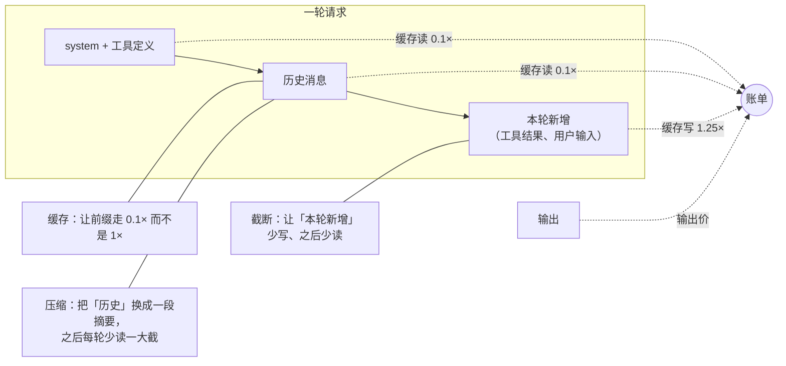
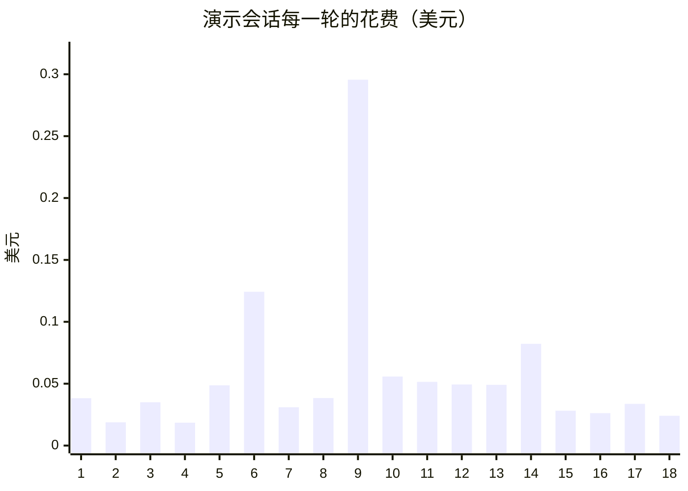
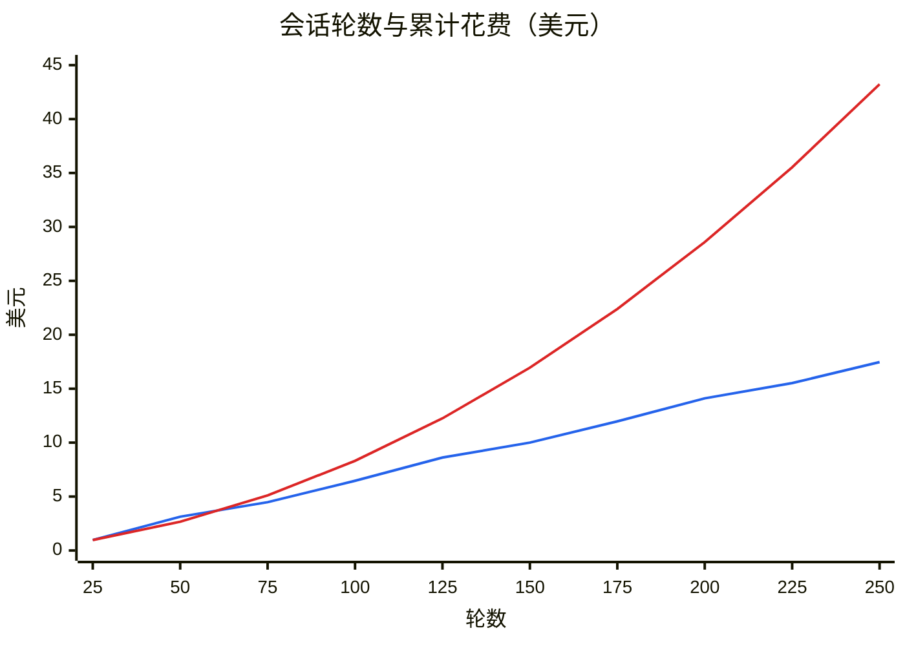
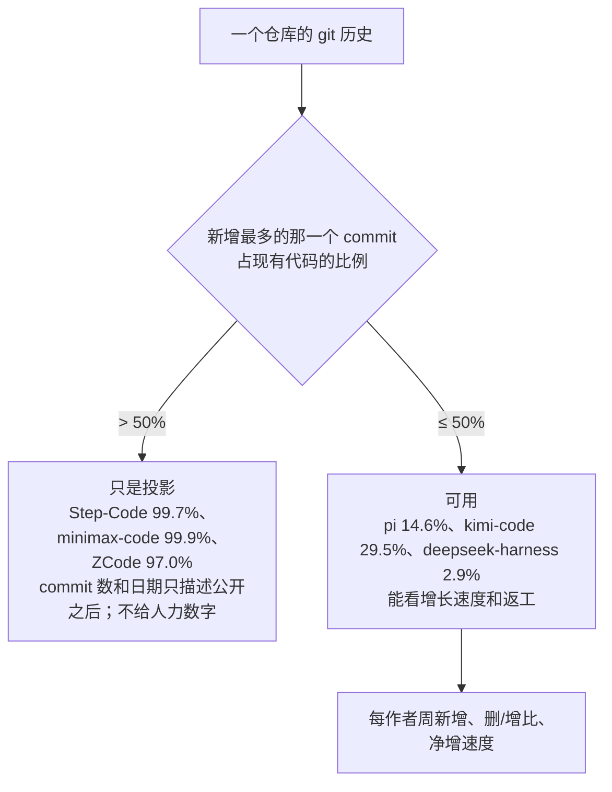
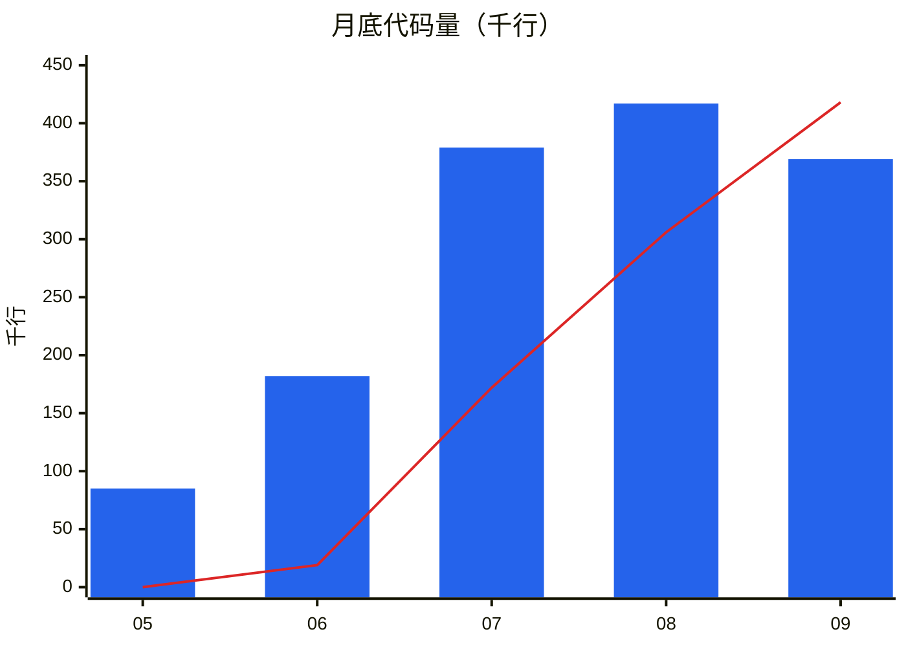
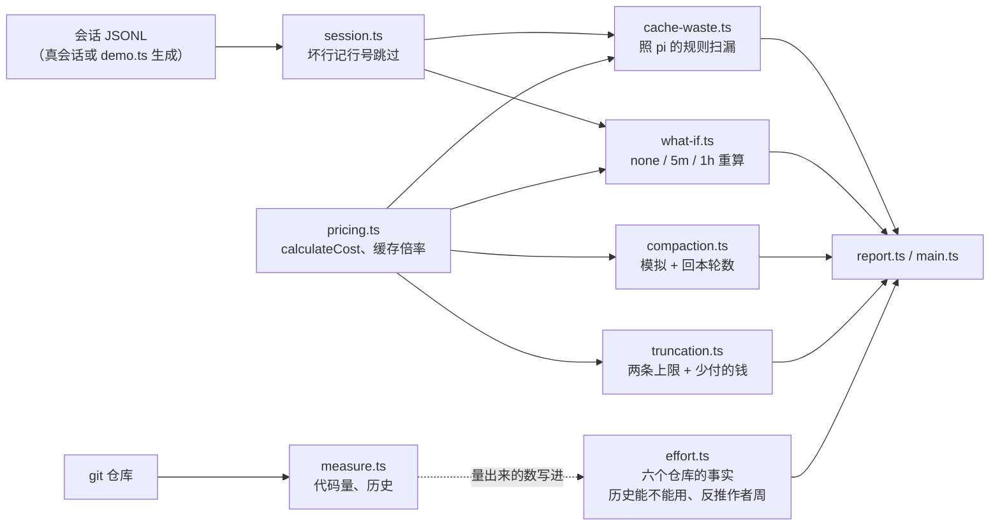

# 第 6 章 成本与投入

> 基准：pi `b79e4cc8` (v0.84.4)　·　[版本表](../../research/BASELINE.md)　·　[参与指南](../../CONTRIBUTING.md)

**状态**：✅ 已完成

## 本章回答

- 一次调用的账单由哪几项组成，pi 怎么算、算在哪里
- 缓存省下多少；什么情况下缓存会「漏」，漏掉的钱谁看得见
- 压缩是在省钱还是在花钱，多长的会话才回本
- 工具输出截断一次，之后每一轮少付多少
- 六个仓库统一口径下各有多少代码、多少是和 pi 逐字节相同的
- 哪段 git 历史能拿来估人力，哪段只是「公开之后」的投影
- 在 pi 上做出一个产品要多少投入：能反推出什么，反推不出什么

## 素材来源

- pi：`research/pi/08-observability.md` §8.4（cost 计算与缓存浪费统计）；源码在基准 commit `b79e4cc8` 上逐行核对
- 缓存的计价规则：Anthropic 公开文档 [prompt-caching](https://platform.claude.com/docs/en/build-with-claude/prompt-caching)，2026-10-05 抓取
- 六个仓库（pi、Step-Code、minimax-code、kimi-code、deepseek-harness、ZCode）在 [BASELINE.md](../../research/BASELINE.md) 各自的基准 commit 上，用同一套口径量代码量和 git 历史
- 新写 [`examples/ch06-cost-ledger/`](../../examples/ch06-cost-ledger/)

（pi 的路径以 `pi/packages/` 为根简写：`ai/…` 是模型层，`coding-agent/src/…` 是产品层。本章带 `【代码事实】` 的是在源码里逐行核对过的，带 `【推断】` 的是从代码、数字推出来、没有实跑验证的，带 `【实机】` 的是在 `examples/ch06-cost-ledger/` 里跑出来或用 `git` 量出来的：macOS arm64，Node v22.22.3。带 `【文档】` 的是公开文档的原话，英文照抄不翻译，抓取日期 2026-10-05。例子里的价格是示例价——Sonnet 4.5 按输入 3、输出 15 美元每百万 token，Opus 4.5 按 5 和 25——只为了让数字有量级，**不是报价**。）

---

上一章选路，这一章算账。账有两本。

第一本是 **token 的账**：一个 code agent 每一轮都把整段上下文重新发给模型，会话越长，每一轮越贵。pi 在这件事上做了三件事——让前缀命中缓存、上下文快满时压缩、工具输出过大时截断。三件事都在省钱，但省法不同，有的还要先花钱。本章用 pi 自己的计价公式和判定规则，在一份可复现的演示会话和一组参数化的长会话上，把每一件省了多少、什么时候不省反亏算出来。

第二本是 **投入的账**：在 pi 上做一个产品，要写多少代码、要多少人干多久。这个问题没有人公开回答过，但五个下游仓库的代码和 git 历史都摆在那里。问题是 git 历史不一定说真话——一个「Initial commit」导入了九成九代码的仓库，commit 数和日期只描述公开之后的那几天。所以这本账的第一步不是算，而是先判断哪段历史能用。

两本账都不排名次。缓存、压缩、截断各自的代价，是 pi 替你选的；投入多少，是每一家自己选的。本章只回答「谁选了什么、代价是什么」。

先看几个数字：

| 数字 | 是什么 | 出处 |
| --- | --- | --- |
| **0.1 / 1.25 / 2** | 缓存读、5 分钟写、1 小时写，相对基础输入价的倍数 | 【文档】prompt-caching |
| **52.7%** | 演示会话打开 5 分钟缓存后的花费，相对完全不缓存 | 【实机】6.2 |
| **28.6%** | 同一份会话里，因为空闲和换模型「漏」掉缓存而多付的钱占总花费的比例 | 【实机】6.2 |
| **≈16.5 轮** | 默认设置下，一次压缩之后要再过多少轮才回本 | 【实机】6.3 |
| **$3.13 vs $2.67** | 50 轮的会话：压缩一次比假设窗口无限、从不压缩更贵 | 【实机】6.3 |
| **$1.94** | 一次 12,000 行的日志截断后，30 轮里少付的钱——比整段 18 轮的演示会话还多 | 【实机】6.4 |
| **99.9%** | minimax-code 新增最多的那一个 commit 带进来的代码，占它现有代码的比例 | 【实机】6.6 |
| **30–40 作者周** | 按两段可用历史的净增速度，写出 Step-Code 那 57,343 行产品层的推算 | 【推断】6.7 |

## 6.1 账单由什么组成

一次模型调用的 usage 有四个桶：**普通输入、输出、缓存读、缓存写**。每个桶一个单价，乘起来加起来就是这一次的钱。pi 的公式只有二十行：【代码事实】

```
// pi/packages/ai/src/models.ts:878-898
export function calculateCost<TApi extends Api>(model: Model<TApi>, usage: Usage): Usage["cost"] {
	const inputTokens = usage.input + usage.cacheRead + usage.cacheWrite;
	let rates: ModelCostRates = model.cost;
	let matchedThreshold = -1;
	for (const tier of model.cost.tiers ?? []) {
		if (inputTokens > tier.inputTokensAbove && tier.inputTokensAbove > matchedThreshold) {
			rates = tier;
			matchedThreshold = tier.inputTokensAbove;
		}
	}

	// Anthropic charges 2x base input for 1h cache writes.
	const longWrite = usage.cacheWrite1h ?? 0;
	const shortWrite = usage.cacheWrite - longWrite;
	usage.cost.input = (rates.input / 1000000) * usage.input;
	usage.cost.output = (rates.output / 1000000) * usage.output;
	usage.cost.cacheRead = (rates.cacheRead / 1000000) * usage.cacheRead;
	usage.cost.cacheWrite = (rates.cacheWrite * shortWrite + rates.input * 2 * longWrite) / 1000000;
	usage.cost.total = usage.cost.input + usage.cost.output + usage.cost.cacheRead + usage.cost.cacheWrite;
	return usage.cost;
}
```


三件事值得注意：

- **prompt 的大小是三个桶之和**（`:879`）。`input` 只是「没进缓存」的那部分。看 usage 时只看 `input` 会严重低估一次请求有多大——一次命中良好的请求，`input` 可能是 0。
- **分档是整次请求一起换价**（`:882-887`）。有的模型 prompt 超过某个长度后单价更高，pi 取命中的最高一档，四个桶全部按那一档算，不是只有超出的部分涨价。
- **1 小时缓存写单独计价**（`:890-892`、`:896`）。注释写明了理由：Anthropic 对 1 小时写收 2 倍基础输入价；这部分不用 `rates.cacheWrite`（那是 5 分钟写的价），而是 `rates.input * 2`。

价格表本身不在仓库里。【代码事实】pi 在构建时从 models.dev 拉一份（`ai/scripts/generate-models.ts:1430-1432`），生成到 `ai/src/providers/data/`，而这个目录在 `.gitignore:11` 里。用户可以在 `models.json` 里覆盖（`coding-agent/src/core/model-config.ts:144-186`）。算出来的钱只出现在一处：状态栏把整段会话的累计花费打成 `$0.123`（`coding-agent/src/modes/interactive/components/footer.ts:142-144`）。pi 没有 `/cost` 命令；`/session` 能看到 token 分项（详见 `research/pi/08-observability.md` §8.4）。

这四个桶的单价差得很远。下面是 Anthropic 文档给的倍率，都相对基础输入价：【文档】

> "5-minute cache write tokens are 1.25 times the base input tokens price"
>
> "1-hour cache write tokens are 2 times the base input tokens price"
>
> "Cache read tokens are 0.1 times the base input tokens price (see the table footnote for per-model exceptions)"

同一个 token，第一次进上下文时按 1.25 倍付（写），之后每一轮按 0.1 倍付（读）。一个 token 在会话里待 N 轮，总价大约是 `1.25 + 0.1 × N` 倍输入价；不缓存则是 `N` 倍。这就是缓存、压缩、截断三件事共同的账本：



*图 6-1 一轮请求的账：缓存改单价，压缩和截断改数量*

## 6.2 缓存：省一半，漏三成

### 缓存省下多少

pi 默认就开着缓存：Anthropic 适配器给 system、最后一条用户消息、最后一个工具定义打上断点（第 12 章 12.7 讲过这三个位置），默认档是 5 分钟。【代码事实】档位由 `cacheRetention` 决定，`"none"` 不打断点，`"long"` 且模型支持时加上 `ttl: "1h"`：

```
// pi/packages/ai/src/api/anthropic-messages.ts:60-74
function getCacheControl(
	model: Model<"anthropic-messages">,
	cacheRetention?: CacheRetention,
	env?: ProviderEnv,
): { retention: CacheRetention; cacheControl?: CacheControlEphemeral } {
	const retention = resolveCacheRetention(cacheRetention, env);
	if (retention === "none") {
		return { retention };
	}
	const ttl = retention === "long" && getAnthropicCompat(model).supportsLongCacheRetention ? "1h" : undefined;
	return {
		retention,
		cacheControl: { type: "ephemeral", ...(ttl && { ttl }) },
	};
}
```


OpenAI Responses 那一侧也有同一个开关：默认 `"short"`，环境变量 `PI_CACHE_RETENTION=long` 切到长档（`ai/src/api/openai-responses.ts:54-66`），长档对应 `prompt_cache_retention: "24h"`（`:81-86`）。【代码事实】

为了把「省了多少」算出来，例子造了一份 18 轮的 Sonnet 会话（`src/demo.ts:25-44`）。每一轮的 usage 都按真实 provider 会怎么报来造：命中多少由上一轮决定，cost 用和 pi 相同的公式现算。中间故意放进四件事：第 5 轮漏了 700 token（断点粒度造成的小漏），第 6 轮前停了 12 分钟，第 9、10 轮换到 Opus 再换回来，第 13 轮之后压缩一次。

然后把同一份会话按「不缓存 / 5 分钟 / 1 小时」三种策略重算一遍：【实机】

```
$ npm start
同一份会话换缓存策略重算（按 prompt 大小与时间戳推，不看实际命中）：
  none  输入    $2.13  输出  $0.1163  摘要  $0.2221  合计    $2.47  相对不缓存 100.0%  整段重写 0 次
  5m    输入  $0.9610  输出  $0.1163  摘要  $0.2221  合计    $1.30  相对不缓存  52.7%  整段重写 2 次
  1h    输入    $1.28  输出  $0.1163  摘要  $0.2221  合计    $1.62  相对不缓存  65.6%  整段重写 1 次
```

5 分钟缓存让这份会话的输入从 $2.13 降到 $0.96，整体花费是不缓存的 52.7%。输出和摘要三种策略一样：缓存只作用于 prompt；压缩的摘要请求本身就不缓存（6.3）。

1 小时档反而更贵。它救回了第 6 轮那次 12 分钟停顿（整段重写从 2 次降到 1 次），但之后每一个新写进缓存的 token 都按 2 倍而不是 1.25 倍付。【实机】`what-if.ts` 里有个打平公式：一次停顿省下的是「停顿时的前缀 × (1.25 − 0.1)」，代价是此后每个新写入 token 多付 0.75 倍。第 6 轮停顿时的前缀是 29,850 token，打平需要的新写入 token 是：

```
29,850 × 1.15 ÷ 0.75 ≈ 45,770
```

这份会话停顿之后新写入的远超这个数，所以 1 小时档不划算。【推断】反过来，**如果一个会话的特点是「前缀很大、常有 5 到 60 分钟的停顿、每次停顿之后只加一点点」**——比如开着 agent 去开会、回来问一句——1 小时档就值。

还有一个门槛：【文档】

> "Shorter prompts cannot be cached, even if marked with `cache_control`."
>
> "Any requests to cache fewer than this number of tokens will be processed without caching, and no error is returned."

门槛按模型不同：Sonnet 4.5 是 1,024 token，Opus 4.5 是 4,096。短 prompt 打了断点也不缓存，而且不报错。演示会话的 prompt 都在 9,000 以上，碰不到这条；但一个 system prompt 很短、工具很少的极简 agent，前几轮可能根本没有缓存。

### 缓存怎么漏

缓存不是开了就一直命中。前缀里任何一个字节变了，从那里往后全部失效；超过 TTL 没用，整段失效；换一个模型，缓存按模型分开存，新模型那边是冷的。

pi 专门写了一段代码来数漏掉的钱。【代码事实】判定规则是：上一轮的整段 prompt 都应该在缓存里，这一轮少读到的部分就是漏；漏掉的 token 本来只该付读价，实际付了写价（或输入价），差价就是浪费：

```
// pi/packages/coding-agent/src/core/cache-stats.ts:56-90
function detectMiss(
	prev: PreviousRequest | undefined,
	message: AssistantMessage,
	models: ModelPriceSource,
): CacheMiss | undefined {
	const usage = message.usage;
	const promptTokens = usage.input + usage.cacheRead + usage.cacheWrite;
	// A zero-cache turn only counts when cache activity was reported before:
	// on cache-read-only providers that is a total miss, while on providers
	// that never report caching it means nothing.
	if (!prev || promptTokens <= 0 || (usage.cacheRead + usage.cacheWrite === 0 && !prev.reportedCache)) {
		return undefined;
	}

	const missedTokens = Math.min(prev.promptTokens, promptTokens) - usage.cacheRead;
	if (missedTokens <= NOISE_FLOOR_TOKENS) return undefined;

	// Extra cost = missed tokens billed at the actual paid rate (input/cacheWrite,
	// incl. write premium) instead of the cache-read rate. Missed tokens can only
	// land in the input or cacheWrite buckets, so the paid rate comes straight
	// from this message's own cost breakdown.
	const paidTokens = usage.input + usage.cacheWrite;
	const paidPerToken = paidTokens > 0 ? (usage.cost.input + usage.cost.cacheWrite) / paidTokens : 0;
	const readPerToken =
		usage.cacheRead > 0
			? usage.cost.cacheRead / usage.cacheRead
			: (models.getModel(message.provider, message.model)?.cost.cacheRead ?? 0) / 1_000_000;

	return {
		missedTokens,
		missedCost: missedTokens * Math.max(0, paidPerToken - readPerToken),
		idleMs: Math.max(0, message.timestamp - prev.timestamp),
		modelChanged: `${message.provider}/${message.model}` !== prev.modelKey,
	};
}
```


`NOISE_FLOOR_TOKENS` 是 1,024（`:11`）：每轮少命中一千来个 token 是断点粒度造成的，不算。`min(prev.promptTokens, promptTokens)` 取两轮较小的那个，因为上下文变短（比如用户删了消息）时，变短之后的部分本来就不该命中。

扫描整段会话时，有两种情况要区别对待：【代码事实】

```
// pi/packages/coding-agent/src/core/cache-stats.ts:113-119
		if (entry.type === "compaction" || entry.type === "branch_summary") {
			// The context legitimately changed; the next turn's prompt is new content,
			// not re-billed content. Model switches are NOT exempt: they re-bill the
			// full prompt and should be counted.
			prev = undefined;
			continue;
		}
```


压缩和分支摘要之后，上下文是合法地变了，下一轮的 prompt 是新内容，不算漏；**换模型不豁免**——它确实让整段 prompt 重新计费了一次。

在演示会话上跑这套规则：【实机】

```
$ npm start
会话实际花费 $1.27；其中缓存浪费 77,750 token、$0.3639（28.6%）
  a06   29,850 token   $0.1030  空闲超过 5 分钟  ← pi 会在对话里提示
  a09   41,600 token   $0.2392  换了模型  ← pi 会在对话里提示
  a11    6,300 token   $0.0217  换了模型
  另有 1 轮漏得不到 1,024 token，算断点粒度噪声，不计
```



*图 6-2 演示会话每一轮的花费：第 6 轮（空闲 12 分钟）、第 9 轮（第一次切到 Opus）、第 14 轮（压缩后第一轮）三个尖峰；第 1 轮是冷启动*

三次漏各有各的原因：

- **a06：空闲。** 停了 12 分钟，5 分钟的缓存过期，29,850 token 的前缀整段重写。
- **a09：换模型。** 切到 Opus，Opus 那边从没缓存过这段前缀，41,600 token 全部按 Opus 的写价付。这一轮一次就花了 $0.30，是整段会话最贵的一轮。
- **a11：换回来。** Sonnet 的缓存还在（距上一次 Sonnet 调用只有 70 秒），但 Opus 那两轮新增的部分 Sonnet 没见过，6,300 token 要重写。这一次没过提示门槛。

第 14 轮（压缩后第一轮）同样很贵，但不算漏：压缩把上下文换了，那是压缩的成本，6.3 单独算。

**28.6% 是一个很大的比例，但 pi 默认不告诉你。** 【代码事实】交互模式里有一个提示，门槛是两万 token 或一角钱，满足一条才打扰：

```
// pi/packages/coding-agent/src/modes/interactive/interactive-mode.ts:3841-3855
	private addCacheMissNotice(miss: CacheMiss): void {
		if (miss.missedTokens < 20_000 && miss.missedCost < 0.1) return;

		const cost = miss.missedCost >= 0.01 ? ` (~$${miss.missedCost.toFixed(2)})` : "";
		const reBilled = `${formatTokens(miss.missedTokens)} tokens re-billed${cost}`;
		let label = "Cache miss";
		if (miss.modelChanged) {
			label = "Cache miss after model switch";
		} else if (miss.idleMs >= CACHE_TTL_MS) {
			label = `Cache miss after ${Math.round(miss.idleMs / 60_000)}m idle`;
		}
		const text = theme.fg("warning", `${label}: ${reBilled}`);
		this.chatContainer.addChild(new Spacer(1));
		this.chatContainer.addChild(new Text(text, 1, 0));
	}
```


而这个提示的开关 `showCacheMissNotices` 默认是关的（`coding-agent/src/core/settings-manager.ts:108`、`:919-920`）。打开之后，演示会话里 a06 和 a09 会在对话里各出现一行黄字；a11 不会。

> **判断依据：** 换模型的漏，哪种 TTL 都救不回来，因为缓存按模型分开存。【实机】重算时 1 小时档仍然记了 1 次整段重写，就是 a09。如果你的产品有「便宜模型干杂活、贵模型做决策」这种来回切换的设计，每切一次就是一整段 prompt 按新模型的写价付一次。pi 把这笔钱算出来、而且坚持不豁免，是在提醒你：切模型的成本不是零。

## 6.3 压缩：一笔要回本的投资

### 压缩花了什么

压缩的目的首先是**装得下**。【代码事实】触发条件是上下文超过「窗口 − 预留」：

```
// pi/packages/coding-agent/src/core/compaction/compaction.ts:132-136
export const DEFAULT_COMPACTION_SETTINGS: CompactionSettings = {
	enabled: true,
	reserveTokens: 16384,
	keepRecentTokens: 20000,
};
```


```
// pi/packages/coding-agent/src/core/compaction/compaction.ts:235-238
export function shouldCompact(contextTokens: number, contextWindow: number, settings: CompactionSettings): boolean {
	if (!settings.enabled) return false;
	return contextTokens > contextWindow - settings.reserveTokens;
}
```


触发之后，要做的事情有三件，每一件都要钱。

**第一，发一次摘要请求。** 把要丢掉的那段历史序列化成 `<conversation>` 文本发出去，让模型写摘要。这次请求故意不缓存：【代码事实】

```
// pi/packages/coding-agent/src/core/compaction/compaction.ts:587-593
	// Avoid cache writes for one-off summaries. Reuse caller-supplied routing when available;
	// callers without a session ID, including branch summaries, receive a fresh routing ID.
	const requestOptions: SimpleStreamOptions = {
		...options,
		cacheRetention: "none",
		sessionId: options.sessionId ?? uuidv7(),
	};
```


一次性的摘要请求没有下一次可以命中，打断点只会白付 1.25 倍的写价。所以要被摘要的那十几万 token 全按输入价付，再加上摘要本身的输出价。

**第二，压缩后第一轮整段重写。** 上下文变成「system + 摘要 + 最近 keepRecentTokens」，除了 system 头部，其余都是新内容，按写价付。

**第三，摘要有上限。** 输出上限是 `0.8 × reserveTokens`：【代码事实】

```
// pi/packages/coding-agent/src/core/compaction/compaction.ts:672-675
	const maxTokens = Math.min(
		Math.floor(0.8 * reserveTokens),
		model.maxTokens > 0 ? model.maxTokens : Number.POSITIVE_INFINITY,
	);
```


撞上上限的摘要不会被截断了照用，而是判为失败：【代码事实】

```
// pi/packages/coding-agent/src/core/compaction/compaction.ts:541-553
/**
 * Returns an error message when a summarization response cannot safely be persisted.
 * A length stop contains partial text and must not become a session checkpoint.
 */
export function getSummarizationFailure(response: AssistantMessage, label: string): string | undefined {
	if (response.stopReason === "error") {
		return `${label} failed: ${response.errorMessage || "Unknown error"}`;
	}
	if (response.stopReason === "length") {
		return `${label} failed: generation hit the token cap and the summary is incomplete`;
	}
	return undefined;
}
```


失败的那次请求钱照付，上下文却没变小。

压缩省的是**之后**的钱：被摘要替掉的那十几万 token，以后每一轮都不用再按读价付了。所以压缩是一笔投资：先花一笔，之后每轮赚回一点。

### 多长的会话才回本

例子把这笔账参数化（`src/compaction.ts`）：200K 窗口、pi 默认的预留 16,384 和保留 20,000，system 8,000，每轮新增 4,000，输出 400，摘要 10,000，每轮都在 5 分钟以内发出。对照组是一个不存在的模型：窗口无限，从不压缩。【实机】

```
$ node --experimental-strip-types --no-warnings src/main.ts compaction
场景：窗口 200,000、预留 16,384、保留最近 20,000，200 轮，每轮 +4,000
  压缩 5 次，摘要撞上 0.8 × 预留 的上限 0 次；prompt 峰值 186,000
  每轮调用 $10.99 + 摘要请求 $3.11 = $14.11（其中压缩后整段重写的溢价 $0.5175）
  反事实：窗口无限、从不压缩 $28.59，prompt 峰值 808,000
  一次压缩要再过约 16.5 轮才回本：之前的每一轮都比不压缩更贵
```

200 轮下来，压缩花了一半的钱。但这是长会话的结论。把轮数从 25 扫到 250：【实机】

| 轮数 | 压缩次数 | 压缩 | 从不压缩 | 谁便宜 |
| ---: | ---: | ---: | ---: | --- |
| 25 | 0 | $0.97 | $0.97 | 一样（没触发） |
| 50 | 1 | **$3.13** | $2.67 | 不压缩 |
| 75 | 1 | $4.48 | $5.11 | 压缩 |
| 100 | 2 | $6.46 | $8.31 | 压缩 |
| 150 | 3 | $10.00 | $16.95 | 压缩 |
| 200 | 5 | $14.11 | $28.59 | 压缩 |
| 250 | 6 | $17.47 | $43.23 | 压缩 |



*图 6-3 压缩（蓝线，近似直线）与从不压缩（红线，抛物线）：从不压缩时每轮的 prompt 线性增长，累计花费是二次的；压缩把 prompt 峰值钉在窗口以下，累计花费变成线性。两条线在 60 轮左右交叉*

第 44 轮触发第一次压缩，之后十几轮里压缩一侧一直更贵，到第 61 轮左右才追平。【实机】`compactionBreakEvenTurns` 直接算这个数：一次压缩的一次性成本（摘要请求 + 重写溢价），除以之后每轮少读的钱（被替掉的那段 × 读价），默认场景是 **16.5 轮**。

【推断】这意味着两件事。第一，**一个刚触发压缩就结束的会话，压缩是净亏的**；对一个按次计费的产品，如果大多数会话都在第一次压缩后不久结束，压缩策略主要贡献的是能力（装得下），而不是成本。第二，**从不压缩的那条线在现实里不存在**：第 44 轮的 prompt 已经到 184,000，再过五轮就超出 200K 窗口了。所以「压缩省一半」的准确说法是：在一个装得下的前提下，压缩把二次增长的成本变成了线性。

### 预留调大一点

Step-Code 把预留从 16,384 改成了 24,576，注释里写的理由是摘要撞上 `0.8 × 16384 = 13107` 的上限、被 length-stop 拒掉（第 28 章 28.1 引了原文）。在例子里复现这个问题：让模型想写 15,000 token 的摘要。【实机】

| 想写的摘要 | 预留 | 撞上限 | 合计 | prompt 峰值 |
| ---: | ---: | --- | ---: | ---: |
| 10,000 | 16,384 | 0 / 5 | $14.11 | 186,000 |
| 15,000 | 16,384 | **5 / 5** | $14.40 | 185,107 |
| 10,000 | 24,576 | 0 / 5 | $13.71 | 178,000 |
| 19,000 | 24,576 | 0 / 5 | $14.87 | 179,000 |

第二行五次全撞上限。例子把撞上限的摘要按「截到上限照用」算，所以 $14.40 是偏乐观的——在 pi 里这五次压缩全部失败，上下文没变小，下一轮还会再试。预留调大以后，同样的摘要长度不再撞上限；而且触发线提前了 8K，每轮的 prompt 峰值低一些，默认摘要长度下还略便宜（$13.71 对 $14.11）。

代价是窗口里永远空着的那一截更大了，在 32K 这样的小窗口上会更早压缩、更频繁地压缩。第 28 章 28.1 讲过各家怎么在绝对预留和比例之间选。

> **判断依据：** 摘要请求的输入在例子里是「整段要丢掉的历史」，是上限。【代码事实】pi 序列化时把每个工具结果截到 2,000 字符（`compaction/utils.ts:89`、`:95-99`），工具输出多的会话，摘要请求实际比这里算的便宜。回本轮数因此偏保守。

## 6.4 截断：最便宜的那一刀

缓存改单价，压缩改历史，截断改的是「本轮新增」。【代码事实】pi 所有内置工具的输出走同一套截断：

```
// pi/packages/coding-agent/src/core/tools/truncate.ts:1-13
/**
 * Shared truncation utilities for tool outputs.
 *
 * Truncation is based on two independent limits - whichever is hit first wins:
 * - Line limit (default: 2000 lines)
 * - Byte limit (default: 50KB)
 *
 * Never returns partial lines (except bash tail truncation edge case).
 */

export const DEFAULT_MAX_LINES = 2000;
export const DEFAULT_MAX_BYTES = 50 * 1024; // 50KB
export const GREP_MAX_LINE_LENGTH = 500; // Max chars per grep match line
```


两条上限，先到先停：2,000 行或 50KB；不留半行。截掉的部分不是丢了，第 28 章 28.4 讲过 pi 会在截断处给出续读路径，模型需要时可以按行号再读。

一次大输出被截掉，省的钱分两段：进上下文那一轮少写一次，之后每一轮少读一次。拿一份 12,000 行的请求日志算：【实机】

```
$ node --experimental-strip-types --no-warnings src/main.ts truncation
一次 12,000 行、659,649 字节的工具输出：按字节上限截到 952 行、51,197 字节
  少进上下文约 152,113 token：当轮少写 $0.5704，之后每轮少读 $0.0456，30 轮合计 $1.94
```

每行 55 字节左右，先撞上的是 50KB 那条，只留下 952 行。少进上下文的 15 万 token，按 Sonnet 的价当轮少写 $0.57，之后每轮少读 $0.046，30 轮合计 $1.94——**比整段 18 轮演示会话的实际花费（$1.27）还多**。

【推断】更大的收益不在账单上：15 万 token 已经吃掉了 200K 窗口的四分之三。不截断，这一轮之后几乎马上就要压缩，于是又回到 6.3 那笔投资。截断是三件事里唯一没有前期成本的：它不发额外请求，不打断前缀。它的代价在别处——模型可能看不到它需要的那一行，要多花一轮去续读。

三件事放在一起看：

| | 改什么 | 前期成本 | 什么时候亏 | pi 的默认 |
| --- | --- | --- | --- | --- |
| 缓存 | 前缀的单价：1× → 0.1× | 首次写入多付 0.25× | 前缀经常变、经常换模型、prompt 短于门槛 | 开，5 分钟 |
| 压缩 | 历史的数量：十几万 → 摘要 | 一次不缓存的摘要请求 + 整段重写 | 刚压完会话就结束；摘要撞上限而失败 | 开，预留 16,384 |
| 截断 | 本轮新增的数量 | 无（可能多一轮续读） | 截掉的正是要用的 | 开，2,000 行 / 50KB |

## 6.5 投入的账：先量代码

第二本账从代码量开始。六个仓库在各自的基准 commit 上，用同一套口径量：`.ts` / `.tsx`，路径里有 `/src/`，去掉 `*.test.*` / `*.spec.*`、`test/` / `tests/` 目录和 `examples/` 目录；行数按换行符个数数，和 `wc -l` 对齐到同一个 git 版本。【实机】例子里的 `measure` 命令就是这个口径（`src/measure.ts:12-15`、`:29-47`），可以在任何一个仓库上重跑。

| 仓库 | 文件 | 行数 | 其中和 pi 逐字节相同 | 与 pi 的关系 |
| --- | ---: | ---: | ---: | --- |
| pi | 540 | 123,629 | — | 本体 |
| Step-Code | 523 | 147,766 | 161 个文件 / 24,922 行 | 重构的 fork |
| minimax-code | 2,650 | 677,790 | 216 个文件 / 61,348 行 | 整栈 vendor 在 `third_party/pi-mono` |
| kimi-code | 2,155 | 369,202 | 12 个文件 / 793 行 | 只 vendor 了 `pi-tui` |
| deepseek-harness | 2,457 | 417,501 | 0 | 对照组：不依赖 pi |
| ZCode | 3,845 | 855,581 | 0 | 对照组：不依赖 pi |

几件事：

- **下游都比 pi 大。** 最小的 Step-Code 也比 pi 多两万多行；最大的 ZCode 是 pi 的七倍。pi 那 12 万行是一个「核心 + 一个能用的产品」，下游在它上面或旁边加的，比它本身还多。
- **「和 pi 逐字节相同」的行数远少于「依赖 pi」。** minimax-code vendor 了一整套 pi（`third_party/pi-mono` 263 个文件、102,623 行），其中和它锁定的上游版本 v0.79.1（`28df940f`）逐字节相同的只有 61,348 行；另外 4 万行是改过的或新加的。【实机】把 vendor 进来的四个包和 v0.79.1 逐个比：

  | 包 | 改动的源码文件 | 加 | 删 |
  | --- | ---: | ---: | ---: |
  | agent | 3 | 194 | 24 |
  | ai | 24 | 1,193 | 794 |
  | coding-agent | 18 | 2,318 | 1,146 |
  | tui | 2 | 16 | 2 |

  改在 pi 内部的只有三千多行，大头在 minimax-code 自己的 `packages/`（2,350 个文件、556,959 行）。第 24 章 24.5 讲过这三千多行是怎么用一份台账管起来的。
- **kimi-code 只用了 pi 的界面层。** `packages/pi-tui` 43 个文件、18,667 行，和 pi 逐字节相同的只剩 793 行——它锁定的上游是 v0.85.1 之后的一个 commit（`UPSTREAM.md:11`），比本书的基准还新，而且本地改得很多，`UPSTREAM.md` 里记了 18 条改动的「意图」。

所以「在 pi 上做一个产品」至少有三种形状：fork 后重构（Step-Code）、整栈 vendor 加一层自己的包（minimax-code）、只借一层（kimi-code）。三种形状下，「自己写的代码」各是多少，口径完全不同。本章后面用「非 pi 行」= 总行数 − 与 pi 逐字节相同的行，作为最粗的一把尺子。

## 6.6 历史：哪段能用

有了代码量，下一步想知道：写这些代码花了多少人、多长时间。git 历史看起来能回答，但要先问一个问题：**这段历史是从哪里开始的？**

【实机】统一口径（不计 merge commit；只数口径内文件的增删）下，六个仓库的历史：

| 仓库 | commit | 作者邮箱 | 时间跨度 | 新增最多的那一个 commit | 占现有代码 | 判断 |
| --- | ---: | ---: | --- | ---: | ---: | --- |
| pi | 5,508 | 310 | 2025-08-09 → 2026-08-28 | 18,097（`fec0c3d12`，provider 工厂重构，2026-06-10） | 14.6% | **可用** |
| Step-Code | 14 | 8 | 2026-09-22 → 09-24 | 147,386（root commit，09-22） | 99.7% | 只是投影 |
| minimax-code | 69 | 7 | 2026-06-01 → 09-21 | 676,878（`c59cf53`，"Import MiniMax Code CLI source snapshot"，09-18） | 99.9% | 只是投影 |
| kimi-code | 1,590 | 59 | 2026-05-22 → 09-20 | 108,953（`ceb158dc`，v2 引擎落地，#1441，07-12）；root commit 78,192 | 29.5% | **可用** |
| deepseek-harness | 12,061 | 65 | 2026-06-10 → 09-27 | 12,259（`a6a3807a07`，GUI 骨架，07-19）；root commit 0 | 2.9% | **可用** |
| ZCode | 3 | 2 | 2026-09-20 → 09-23 | 829,887（`872ad96`，"feat: open source"，09-21） | 97.0% | 只是投影 |

「新增最多的那一个 commit」是一个很粗但很管用的信号。三个仓库的历史是「公开之后」的投影：某一天一次性导入了几乎全部代码，之后的十几个或几个 commit 是小修（三家的第二大 commit 分别只有 461、174、27,096 行）。另外三个仓库里，最大的一个 commit 也只占现有代码的三成以下，而且是开发中途的一次大功能落地，不是导入。minimax-code 的历史从 6 月 1 日开始，看起来有近四个月，但 99.9% 的代码是 9 月 18 日一次导入的；之前的 6 月到 9 月只有些零星的 commit。这些仓库的 commit 数、作者数、天数，描述的是**开源发布**，不是**开发**。



*图 6-4 一段历史能不能拿来估人力：先看它从哪里开始。阈值 50% 是本书的选择（`effort.ts:41`）*

三段可用的历史，看起来是这样：【实机】

| | pi | kimi-code | deepseek-harness |
| --- | ---: | ---: | ---: |
| 活跃周数 | 54 | 18 | 16 |
| 作者周（作者 × ISO 周去重，不算 bot） | 654 | 197 | 295 |
| commit ≥ 20 的作者 | 17 | 12 | 29 |
| 头号作者 / 前五名的 commit 占比 | 59.5% / 78.0% | 19.7% / 70.3% | 25.4% / 60.3% |
| 累计加 / 删 | 386,013 / 260,739 | 678,379 / 306,464 | 825,559 / 401,284 |
| 删 / 加（返工） | 67.5% | 45.2% | 48.6% |
| 每作者周新增 | 590 | 3,444 | 2,799 |
| 每作者周净增 | 192 | 1,888 | 1,438 |

kimi-code 和 deepseek-harness 每个月月底的代码量：【实机】

| 月底 | kimi-code | deepseek-harness |
| --- | ---: | ---: |
| 2026-05 | 84,954 | — |
| 2026-06 | 181,865 | 18,697 |
| 2026-07 | 378,966 | 171,842 |
| 2026-08 | 416,559 | 306,182 |
| 2026-09 | 369,202 | 417,501 |



*图 6-5 kimi-code（蓝色柱）和 deepseek-harness（红线）的增长：两家都在三四个月里长到三四十万行。kimi-code 九月变少，是因为删掉了整个旧的 agent-core v1 包（`bb16383a`，#3542）*

几个读法：

- **pi 的每作者周净增只有 192 行，比两家年轻项目低一个数量级。** 不是因为 pi 的人写得慢。pi 已经有一年多的历史，删 / 加是 67.5%：每加三行就删两行。成熟项目的大部分工作是改，而不是加。年轻项目还在从零长到几十万行，加的远多于删。
- **作者周会高估兼职、低估不提交的人。** 一个人一周只提交了一次也算一个作者周；做设计、评测、运营但不提交代码的人，一个也不算。
- **有一部分代码不是人敲的。** kimi-code 有 115 个 commit 带着 agent 的 co-author 签名，还有 79 个 `github-actions[bot]` 的 commit（后者已经从作者周里排除）；pi 有 16 个，deepseek-harness 有 1 个。作者周量的是「有多少人在推进」，不是「多少人在打字」。
- **流程不同。** kimi-code 的 1,590 个 commit 里有 1,587 个引用了 PR 号（最大到 #3936），几乎每个 commit 都是一个 PR；deepseek-harness 12,061 个 commit 只有 70 个引用 PR，大量小 commit 直接进主干。commit 数在两家之间不能直接比。

## 6.7 反推：在 pi 上做一个产品要多少投入

现在可以试着回答本章的第二个问题了。但要先承认：**直接的答案拿不到。** 三家基于 pi 的产品里，Step-Code 和 minimax-code 的历史是投影，kimi-code 的历史可用，但它只借了 pi 的界面层，不算「在 pi 上做」。能用的历史和想问的问题，恰好错开了。

所以只能间接推：拿一个**在 pi 上做出来的产品层有多大**，乘上**可用历史里写一行代码的速度**。

产品层取 Step-Code。它是三家里形状最清楚的：fork 了 pi，把产品逻辑集中写在三个地方。【实机】

| 目录 | 文件 | 行数 |
| --- | ---: | ---: |
| `packages/coding-agent/src/step/` | 61 | 21,794 |
| `packages/coding-agent/src/features/` | 43 | 12,504 |
| `apps/cli/` | 88 | 23,045 |
| 合计 | 192 | **57,343** |

（第 2 章 2.5 列过这三块的内容：登录、引导、权限、遥测、MCP、反馈……；`features/` 里有 1,453 行是从 pi 挪过来的 `llama/`，这里不扣，算作产品层的一部分。）

速度取三段可用历史的「每作者周净增」——加的减去删的，把返工扣掉。三段各给一个数，不取平均：【实机】

```
$ node --experimental-strip-types --no-warnings src/main.ts effort --new-lines 57343
写出 57,343 行新代码，按各段可用历史的净增速度要多少作者周（推断，不是报价）：
  按 pi                 299.4 作者周
  按 kimi-code           30.4 作者周
  按 deepseek-harness    39.9 作者周
```

【推断】**按两家年轻项目的速度，Step-Code 那 57,343 行产品层大约是 30–40 个作者周，也就是 7–9 个人月**（按每月 4.33 周）。如果按 pi 那种成熟期、每加三行删两行的速度，要 300 个作者周——这个数不适用于「从零写一个产品层」，但它说明了另一件事：产品上线以后，每多一行净增，要付出的工作量会涨一个数量级。

作为对照，两家可用历史的整体投入：kimi-code 四个月 197 个作者周，约 45 个人月；deepseek-harness 三个半月 295 个作者周，约 68 个人月。【推断】它们做的是完整的、不依赖 pi 内核的产品（kimi-code 只借了界面层，deepseek-harness 什么都没借），代码量是 Step-Code 产品层的六到七倍。

这个数字要配上它没算的东西：

- **它只算写出来的代码。** 设计、评测、和模型团队的联调、上线后的运营，都不在 git 里。
- **它没算跟上游。** 产品层写完以后，pi 还在每周发版。minimax-code 锁定的 v0.79.1 和本书的基准之间，pi 走了 1,337 个 commit；它的补丁台账 38 条里 35 条没开 PR（第 24 章 24.5），每一条都是每次升级要重新验证的东西。kimi-code 只借了界面层，也要维护 18 条意图。这部分是持续成本，不是一次性的。
- **它假设速度可以迁移。** kimi-code 和 deepseek-harness 都不是在 pi 上做的；在 pi 上做，有一部分本来要自己写的东西（模型适配、循环、工具、界面）已经有了，速度可能更快——但 Step-Code 的 57,343 行恰恰是**不包括**这些的产品层，所以迁移过来的速度不算离谱。
- **样本只有两个。** 30 和 40 之间差了三成；这本身就是结论的一部分：一个团队的写法、流程、agent 用得多不多，比「基于什么」影响更大。

> **判断依据：** 本章不给「在 pi 上做一个产品要 N 人月」这样一个数。能给的是一个推算过程，每一步都能复查：产品层多大（`measure`），历史能不能用（最大单次占比），用哪段历史的速度（净增，扣掉返工）。换一个产品层、换一段历史，重跑 `effort --new-lines` 就行。

## 6.8 你的最小实现

这一节把前面两本账收成一个能跑的东西：[`examples/ch06-cost-ledger/`](../../examples/ch06-cost-ledger/)，1,601 行（含 548 行测试），零依赖，不联网；`measure` 只读，只调 `git`。

它能读一份真的 pi 会话（`~/.pi/agent/sessions/…` 下的 `.jsonl`），算实际花费、扫缓存浪费、换策略重算；参数化地模拟压缩和截断；在任何一个仓库上量代码量和历史，判断历史能不能用。



*图 6-6 例子的结构：token 的账（上）和投入的账（下）共用一个排版层，各自独立*

### 关键代码

| 文件 | 行数 | 它是什么 |
| --- | ---: | --- |
| `src/types.ts` | 54 | usage、价格、会话条目的类型，字段名照抄 pi |
| `src/pricing.ts` | 61 | 缓存倍率、示例价、分档、`calculateCost`（不改入参） |
| `src/session.ts` | 84 | 读会话 JSONL，坏行记原因跳过 |
| `src/cache-waste.ts` | 88 | 缓存浪费扫描与提示门槛 |
| `src/what-if.ts` | 96 | 换缓存策略重算；1 小时档的打平点 |
| `src/compaction.ts` | 122 | 压缩模拟、对照「从不压缩」、回本轮数 |
| `src/truncation.ts` | 66 | 行数 / 字节两条上限的截断，以及少付的钱 |
| `src/effort.ts` | 102 | 六个仓库的事实、「历史能不能用」、反推作者周 |
| `src/measure.ts` | 99 | 在真仓库上量代码量和历史 |
| `src/demo.ts` | 86 | 生成 18 轮的演示会话 |
| `src/report.ts` / `src/main.ts` | 66 / 129 | 排版与命令行 |

**扫浪费**照抄 pi 的规则，只是写成不改状态的函数，并且把「漏了但在噪声以内」单独返回，好让报告说出来：

```
// examples/ch06-cost-ledger/src/cache-waste.ts:48-62
export function detectMiss(prev: Previous | undefined, turn: AssistantTurn, prices: PriceBook): CacheMiss | "noise" | undefined {
	const u = turn.usage;
	const prompt = promptOf(turn);
	if (!prev || prompt <= 0 || (u.cacheRead + u.cacheWrite === 0 && !prev.reportedCache)) return undefined;
	const missedTokens = Math.min(prev.promptTokens, prompt) - u.cacheRead;
	if (missedTokens <= 0) return undefined;
	if (missedTokens <= NOISE_FLOOR_TOKENS) return "noise";
	// 漏掉的 token 只会落在 input 或 cacheWrite 里，所以「实付单价」直接用这一条消息自己的分项
	const paid = u.input + u.cacheWrite;
	const paidPerToken = paid > 0 ? (u.cost.input + u.cost.cacheWrite) / paid : 0;
	const readPerToken = u.cacheRead > 0 ? u.cost.cacheRead / u.cacheRead : (prices(turn.provider, turn.model)?.cacheRead ?? 0) / 1e6;
	const idleMs = Math.max(0, turn.timestamp - prev.timestamp);
	const reason: MissReason = keyOf(turn) !== prev.modelKey ? "model-switch" : idleMs >= CACHE_TTL_MS ? "idle" : "unknown";
	return { turnId: turn.id, missedTokens, missedCost: missedTokens * Math.max(0, paidPerToken - readPerToken), idleMs, reason };
}
```


**换策略重算**是 pi 没有的。它不看会话实际命中了多少，只用每一轮的 prompt 大小、时间戳和模型，按策略重新推。缓存按模型分开记，这是 a09 和 a11 两次漏能被正确还原的关键：

```
// examples/ch06-cost-ledger/src/what-if.ts:47-82
type Warm = Readonly<Record<string, { readonly prompt: number; readonly timestamp: number }>>;

export function replay(entries: readonly LedgerEntry[], policy: RetentionPolicy, prices: PriceBook): PolicyCost {
	const zero: PolicyCost = { policy: policy.name, prompt: 0, output: 0, summaries: 0, total: 0, rewrites: 0 };
	const start = { warm: {} as Warm, cost: zero };
	return entries.reduce((state, entry) => {
		const c = state.cost;
		if (entry.kind !== "assistant") {
			const s = entry.usage?.cost.total ?? 0;
			return { warm: {}, cost: { ...c, summaries: c.summaries + s, total: c.total + s } };
		}
		const t = entry.turn;
		const rates = prices(t.provider, t.model);
		if (!rates) throw new Error(`没有 ${t.provider}/${t.model} 的价格，算不了`);
		const prompt = t.usage.input + t.usage.cacheRead + t.usage.cacheWrite;
		const r = pickRates(rates, prompt);
		const key = `${t.provider}/${t.model}`;
		const p = state.warm[key];
		const live = policy.ttlMs !== undefined && p !== undefined && t.timestamp - p.timestamp <= policy.ttlMs;
		const cached = live ? Math.min(p.prompt, prompt) : 0;
		const cacheable = policy.ttlMs !== undefined && prompt >= MIN_CACHEABLE_TOKENS;
		const promptCost = cacheable ? (cached * r.cacheRead + (prompt - cached) * r.input * policy.writeMultiplier) / 1e6 : (prompt * r.input) / 1e6;
		const outputCost = (t.usage.output * r.output) / 1e6;
		const rewrote = cacheable && Object.keys(state.warm).length > 0 && !live;
		return {
			warm: { ...state.warm, [key]: { prompt, timestamp: t.timestamp } },
			cost: {
				...c,
				prompt: c.prompt + promptCost,
				output: c.output + outputCost,
				total: c.total + promptCost + outputCost,
				rewrites: c.rewrites + (rewrote ? 1 : 0),
			},
		};
	}, start).cost;
}
```


**压缩模拟**的循环体：先算这一轮的钱，再看要不要压缩；压缩时加上摘要请求的钱，把上下文换成「system + 摘要 + 最近」，缓存只剩 system：

```
// examples/ch06-cost-ledger/src/compaction.ts:83-103
	const end = Array.from({ length: s.turns }).reduce<State>((st) => {
		const context = st.context + s.growthPerTurn;
		const fresh = context - st.cached;
		const cost = prompt(rates, st.cached, fresh, s.outputPerTurn);
		// 压缩打断前缀后，这一轮比「上一轮的前缀全部命中」多付的部分
		const premium = st.compactions > 0 && st.cached < st.context ? prompt(rates, st.cached, fresh, 0) - prompt(rates, st.context, context - st.context, 0) : 0;
		const next = { ...st, turnCost: st.turnCost + cost, rewritePremium: st.rewritePremium + premium, total: st.total + cost, peakPrompt: Math.max(st.peakPrompt, context), context, cached: context };
		if (!s.compact || context <= threshold) return next;
		const summary = Math.min(s.desiredSummaryTokens, cap);
		const summarized = context - s.systemTokens - s.keepRecentTokens;
		const summaryCost = calculateCost(rates, { input: summarized, output: summary, cacheRead: 0, cacheWrite: 0 }).total;
		return {
			...next,
			compactions: next.compactions + 1,
			summaryCost: next.summaryCost + summaryCost,
			total: next.total + summaryCost,
			summariesCapped: next.summariesCapped + (s.desiredSummaryTokens > cap ? 1 : 0),
			context: s.systemTokens + summary + s.keepRecentTokens,
			cached: s.systemTokens,
		};
	}, start);
```


**历史能不能用**只有一个判断：新增最多的那一个 commit 占比过没过阈值。过了就不给速度，只说为什么：

```
// examples/ch06-cost-ledger/src/effort.ts:60-102
export function readEffort(r: RepoFacts): EffortReading {
	if (r.lines <= 0) throw new RangeError(`${r.name}：行数必须是正数`);
	const ownLines = r.lines - r.piIdenticalLines;
	const importShare = r.largestImportLines / r.lines;
	const days = daysBetween(r.firstDay, r.lastDay);
	if (importShare > PROJECTION_THRESHOLD) {
		return {
			name: r.name,
			ownLines,
			importShare,
			history: "projection",
			days,
			why: `最大的一个 commit 带进 ${(importShare * 100).toFixed(1)}% 的现有代码：commit 数和日期只描述公开之后`,
		};
	}
	return {
		name: r.name,
		ownLines,
		importShare,
		history: "usable",
		days,
		addedPerAuthorWeek: r.added / r.authorWeeks,
		churn: r.deleted / r.added,
		netPerAuthorWeek: (r.added - r.deleted) / r.authorWeeks,
		why: `历史从小起步（最大的一个 commit 只占 ${(importShare * 100).toFixed(1)}%），可以看增长和返工`,
	};
}
// …
/**
 * 【推断】用可用历史的净增速度，反推写出 newLines 行要多少作者周。
 * 每段可用历史给一个数，不取平均：几个数差多远，本身就是结论的一部分。
 */
export function estimateAuthorWeeks(newLines: number, readings: readonly EffortReading[]): EffortEstimate[] {
	if (!(Number.isFinite(newLines) && newLines > 0)) throw new RangeError("newLines 必须是正数");
	return readings
		.filter((r) => r.history === "usable" && r.netPerAuthorWeek! > 0)
		.map((r) => ({ basis: r.name, authorWeeks: newLines / r.netPerAuthorWeek! }));
}
```


**量仓库**时，每个文件起一次 `git show` 在几千个文件的仓库上太慢；一次 `cat-file --batch` 把所有口径内的文件读出来，按头部给的字节数切开：

```
// examples/ch06-cost-ledger/src/measure.ts:29-47
/** 一次 cat-file --batch 读出所有口径内文件，按字节数切开；每个文件起一次 git 太慢 */
export function countSourceLines(repo: string, rev = "HEAD"): { files: number; lines: number } {
	const paths = git(repo, ["ls-tree", "-r", "--name-only", rev]).split("\n").filter(inScope);
	const out = runGit(repo, ["cat-file", "--batch"], paths.map((p) => `${rev}:${p}\n`).join(""));
	let offset = 0;
	let files = 0;
	let lines = 0;
	while (offset < out.length) {
		const eol = out.indexOf(0x0a, offset);
		const header = out.subarray(offset, eol).toString("utf8").split(" ");
		offset = eol + 1;
		if (header.at(-1) === "missing") continue;
		const size = Number(header[2]);
		lines += countLines(out.subarray(offset, offset + size).toString("utf8"));
		files += 1;
		offset += size + 1;
	}
	return { files, lines };
}
```


### 跑起来

```bash
cd examples/ch06-cost-ledger
npm start                                          # 演示会话的账（等同 ledger）
npm start -- ~/.pi/agent/sessions/…/xxx.jsonl      # 一份真会话
S() { node --experimental-strip-types --no-warnings src/main.ts "$@"; }
S compaction --reserve 24576 --turns 200 --summary 15000
S truncation --lines 12000 --later 30
S effort --new-lines 57343
S measure ../../../code-agents/pi pi               # 在一个真仓库上量（只读）
npm test                                           # 57 个用例
```

退出码：0 成功；1 会话里有坏行（账照样算，但少算了，并列出行号和原因）；2 用法或输入有问题。

在本机 pi 仓库上跑 `measure`，量出来的数和 `effort.ts` 里写死的那一行一致：【实机】

```
$ S measure ../../../code-agents/pi pi
{
  "name": "pi",
  "commit": "b79e4cc8",
  "lines": 123629,
  "commits": 5508,
  "authors": 310,
  "authorWeeks": 654,
  "firstDay": "2025-08-09",
  "lastDay": "2026-08-28",
  "largestImportLines": 18097,
  "added": 386013,
  "deleted": 260739
}
```

### 逐段对照本章

| 本章 | 例子里的位置 |
| --- | --- |
| 6.1 四个桶、分档、1 小时写 | `pricing.ts`：`calculateCost`、`pickRates`、`CACHE_MULTIPLIERS` |
| 6.2 三种策略重算、1 小时档打平点 | `what-if.ts:49-82`、`:93-96`；`npm start` 第二段 |
| 6.2 漏的判定、噪声门槛、换模型不豁免 | `cache-waste.ts:48-85`；`npm start` 第一段 |
| 6.2 提示门槛 | `cache-waste.ts:15-17`、`isNoticeWorthy` |
| 6.2 最小可缓存长度 | `what-if.ts:30-34` |
| 6.3 触发线、摘要上限、摘要不缓存 | `compaction.ts:58-59`、`:76-106` |
| 6.3 回本轮数 | `compaction.ts:108-122` |
| 6.4 两条上限、少付的钱 | `truncation.ts:28-48`、`:59-66` |
| 6.5 统一口径 | `measure.ts:12-15`、`:29-47` |
| 6.6 历史能不能用 | `effort.ts:41`、`:60-86` |
| 6.7 反推作者周 | `effort.ts:93-102`；`effort --new-lines` |

### 测试

57 个用例，九个文件：`pricing` 5、`session` 5、`cache-waste` 8、`what-if` 9、`compaction` 7、`truncation` 6、`effort` 5、`measure` 6、`main` 6。全部通过：【实机】

```
# tests 57
# pass 57
# fail 0
```

几个值得一提的：`cache-waste.test.ts` 断言换模型优先于空闲、压缩之后第一轮不算漏、从没报过缓存的 provider 零缓存也不算漏；`what-if.test.ts` 断言缓存按模型分开（换走再换回，原模型的前缀还在）、短于最小可缓存长度的 prompt 按输入价、查不到价格时报错而不是按 0 算；`compaction.test.ts` 断言会话不够长时压缩更贵、没触发压缩时两种模拟逐分相同；`measure.test.ts` 在临时目录里建一个 git 仓库，把行数、commit、作者、最大导入都量一遍；`main.test.ts` 起一个子进程，断言坏行时退出码是 1、读不到文件时是 2 且错误写到 stderr。

### 本例没做的

- **价格是示例价。** pi 的价格表在构建时从 models.dev 生成；本例只放了两个模型的示例价。要算真钱，换成你的价格表。
- **重算时压缩后整段重写。** 现实里 system 头部还能命中，所以 `what-if` 的 5 分钟档比实际花费略高（$1.30 对 $1.27），偏保守。
- **压缩模拟的会话是匀速的。** 每轮增长相同、都在 5 分钟内发出。真实会话有大有小、有停顿，回本轮数会变；但「先花后赚」的形状不会变。
- **撞上限的摘要按截断照用。** pi 会判它失败并重试，例子只计次数，所以那几行的花费偏乐观。
- **投入只看代码和 git。** 没进仓库的设计、评测、运营看不到；作者周也分不清全职和兼职、人写和 agent 写。

### 三个教训

**一、先扫浪费，再谈策略。** 演示会话里，两次换模型、一次空闲漏掉了总花费的 28.6%。把 TTL 换成 1 小时只救得回空闲那一次，而且救回来的钱还不够付之后所有新写入的溢价；换模型那两次，哪种策略都救不回来。先知道钱漏在哪里，才知道该改策略还是改产品设计。

**二、压缩是一笔要回本的投资。** 一次压缩的摘要请求加上之后整段重写，要再过十几轮才赚回来；50 轮的会话压缩一次，比假设窗口无限还贵。它首先是为了装得下，其次才是省钱。截断则相反：没有前期成本，一刀下去，之后每轮都省。

**三、历史从哪里开始，决定它能说明什么。** 一个 commit 导入了九成以上代码的仓库，commit 数和日期只描述公开之后。能拿来估投入的，只有从小长起来的那几段历史，而且要扣掉返工；就算这样，得到的也只是一个能复查的推算过程，不是一个报价。

## 本章小结

- **账单是四个桶**：普通输入、输出、缓存读、缓存写。pi 的 `calculateCost` 二十行，分档整次换价，1 小时写按 2 倍输入价；价格表构建时生成，不进仓库；花费只显示在状态栏。
- **缓存省一半**：演示会话开 5 分钟缓存是不缓存的 52.7%。1 小时档只在「大前缀、常停顿、停顿后只加一点」时划算；短于 1,024（Opus 4.5 是 4,096）token 的 prompt 不缓存也不报错。
- **缓存会漏**：空闲和换模型漏掉了 28.6%。pi 照算、换模型不豁免，但提示默认关着、门槛是两万 token 或一角钱。换模型的漏哪种 TTL 都救不回来。
- **压缩先花后赚**：一次不缓存的摘要请求加整段重写，默认设置下约 16.5 轮回本；50 轮的会话压缩更贵，200 轮便宜一半。它把二次增长的成本变成线性，前提是装得下。预留调大可以避免摘要撞上限而失败。
- **截断最便宜**：一次 12,000 行的日志截到 50KB，30 轮少付 $1.94，比整段演示会话还多，而且没有前期成本。
- **代码量**：下游都比 pi 大；minimax-code vendor 整栈但只在 pi 内部改了三千多行，kimi-code 只借界面层，两个对照组不碰 pi。
- **历史**：Step-Code、minimax-code、ZCode 的历史是公开之后的投影；能用的只有 pi、kimi-code、deepseek-harness。年轻项目每作者周净增 1,400–1,900 行，成熟的 pi 只有 192 行。
- **反推**：Step-Code 的 57,343 行产品层，按年轻项目的速度约 30–40 作者周（7–9 人月），不含设计、评测、运营，也不含之后跟上游的持续成本。
- **`examples/ch06-cost-ledger/`** 能读真会话算账、扫浪费、换策略重算，参数化模拟压缩和截断，在任何仓库上量代码和历史；57 个用例。

到这里，第一部分「选型」结束：pi 是什么、怎么用、边界在哪、和别的路比、要花多少。下一章开始动手——第 7 章用 30 分钟把 pi 跑起来，从安装到第一次对话，再到把一个会话文件翻出来看一眼本章算的那些 usage 长什么样。
