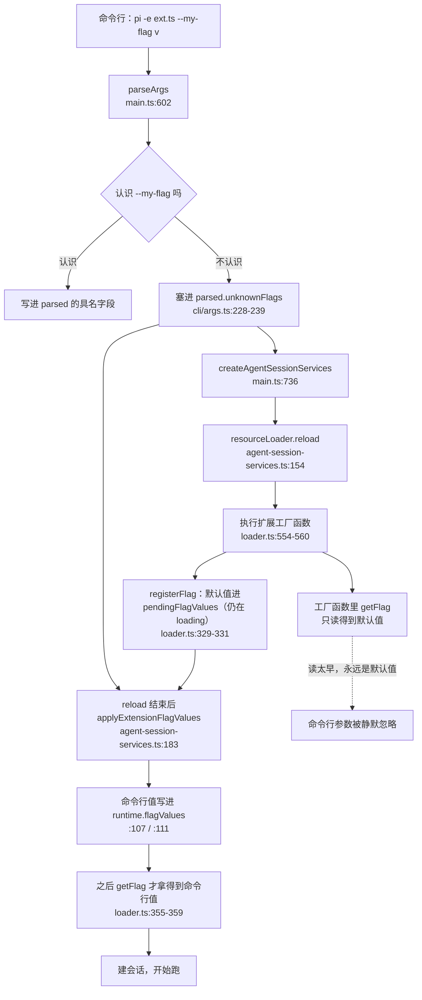

# 第 7 章 30 分钟跑通

> 基准：pi `b79e4cc8` (v0.84.4)　·　[版本表](../../research/BASELINE.md)　·　[参与指南](../../CONTRIBUTING.md)

**状态**：✅ 已完成

## 本章回答

- 装完之后第一次跑，中间发生了哪些事；出错时该先怀疑环境还是怀疑模型
- 为什么「加一个自己的命令行参数」会**无声地**失效——pi 的启动顺序在这里有一个真实的坑
- 一次运行吐出来的二十几行事件，哪些属于同一轮；`--mode json` 的输出该怎么读
- 跑完之后磁盘上留下了什么，为什么换了目录跑就「找不到会话」
- 怎么在没有 API key 的情况下把整条链路跑通
- 同一个启动顺序，Step-Code 和 minimax-code 各改了什么、代价是什么

## 素材来源

- 新写 + 实机验证（pi `0.85.1`，见 7.1 的版本说明）+ [`examples/ch07-hello-pi/`](../../examples/ch07-hello-pi/)
- `research/pi/02-architecture-and-guardrails.md`（分层与启动）、`research/pi/08-observability.md`（遥测与开关）
- 对照：`Step-Code` `7dd66cb`、`minimax-code` `89c930a`

（pi 的路径以 `packages/coding-agent/src/` 为根，`ai/src/` 指 `packages/ai/src/`，`agent/src/` 指 `packages/agent/src/`。Step-Code 同构——它就是上游 pi 的 fork，路径同样以 `packages/coding-agent/src/` 为根；但它的配置目录常量落在 `config.ts:186-195`，与 pi 不同，引用时按仓库根写。minimax-code 的路径按仓库根。本章带 `【代码事实】` 的是在源码里逐行核对过的；带 `【实机】` 的是在本机实跑出来的输出。）

---

装 pi 只花两分钟。剩下二十八分钟通常花在同一件事上：**它跑起来了，但我不确定它到底做了什么**。

于是人开始猜。跑不通的时候猜模型不行，跑通了但结果不对的时候猜提示词不行。这两种猜都跳过了中间那一大段：命令行怎么解析、什么时候加载扩展、系统提示词有多长、工具在哪一步执行、结果写到哪里去了。这一章把这段拆开看一遍，用的工具是 pi 自己的输出和一份三十行的体检脚本。

不排名次，只回答「谁选了什么、代价是什么」。

先看几个数字：

| 数字 | 是什么 | 出处 |
| --- | --- | --- |
| **5** | 从敲下 `pi` 到能对话，中间有名字的阶段：解析参数 → 建运行时服务 → 加载资源与扩展 → 应用扩展旗标 → 建会话 | `main.ts:602`、`:731-736`；`core/agent-session-services.ts:148-183` |
| **4** | 扩展旗标真正生效的位置，在**加载之后**——这是本章最值得记住的一处顺序 | `core/agent-session-services.ts:183`，函数体 `:82-125` |
| **23** | 一次两轮对话在 `--mode json` 下吐出的事件行数 | 【实机】`examples/ch07-hello-pi/fixtures/run-json.txt` |
| **7** | 同一次运行在会话文件里留下的记录条数（4 message + 3 元数据） | 【实机】`agent/sessions/--private-tmp-…--/<ISO>_<uuid>.jsonl` |
| **≥22.19.0** | Node 版本下限，两处 `engines` 都这么写 | `package.json:62-63`、`packages/coding-agent/package.json:103-104` |
| **4** | agent 目录里的私有文件：`auth.json`、`models-store.json`、`trust.json`、`settings.json` | `config.ts:524-544` |

## 7.1 装它，以及版本这件事

本书基线是 pi `b79e4cc8`（v0.84.4）。**但这一章的实机输出跑在 0.85.1 上**——写作时本机装的是这个版本，而 0.84.4 已经是上个月的事。

这件事必须写在前面，因为它决定了你怎么读这一章：

| 类型 | 0.84.4 与 0.85.1 是否一致 |
| --- | --- |
| 启动顺序（本章 7.3） | 一致：【代码事实】两处调用点与顺序没变 |
| 事件名与事件表（7.4） | 一致：本章用到的 11 个事件名在两边都在 |
| 会话目录命名规则（7.5） | 一致：`core/session-manager.ts:476-481` 的替换规则未变 |
| 版本号本身 | **不一致**——`doctor` 会把它打出来，这是有意的 |

pi 的发版节奏是每月 400–530 次提交（`research/BASELINE.md`）。所以本章的做法是：**规则级的结论**（顺序、命名、事件）按基线 commit 核对并标注行号；**输出级的样例**（23 行事件、7 条记录）按实机跑出来的原样贴，并且明说它来自哪个版本。你按基线 checkout 一遍，前者完全可复现，后者可能有出入。

装法有两种，pi 的根 `README.md` 只讲了开发那一种（`npm install --ignore-scripts`），面向用户的是 npm 包 `@earendil-works/pi-coding-agent`：

```bash
npm i -g @earendil-works/pi-coding-agent
pi --version
```

`--ignore-scripts` 是 pi 自己的一条硬纪律——它的仓库 README 里有一整节「Supply-chain hardening」，CI 一律用 `npm ci --ignore-scripts`。**但这条纪律只覆盖 pi 自己的安装**。用户装扩展包走的是另一条路，`core/package-manager.ts:1785-1806` 的 `getNpmInstallArgs` 里没有这个开关。这是第 13 章要展开的一处不一致，这里先记下位置。

## 7.2 第一次跑：把环境问题和模型问题分开

装完之后最常见的失败不是「模型答得不对」，而是：

```
Error: Unknown option --demo-file
```

或者干脆卡住不动。这类问题的根因全在环境里，但症状离根因很远。所以先体检，再对话。

`examples/ch07-hello-pi/src/doctor.ts` 是一个三十行的体检脚本。它的规则只有一条：**只打名字和结论，不打值**。`auth.json` 里是凭据，环境变量里可能有 API key——一个「体检」命令把凭据打到终端（然后被贴进 issue）是常见事故。

```
// doctor.ts（节选）：文件头讲清楚检查项从哪来
 * 规则：**只打名字和结论，不打值。** auth.json 里是凭据，环境变量里可能有
 * API key —— 一个"体检"命令把凭据打到终端（还可能被贴进 issue）是常见事故。
 * 所以这里只回答"在不在""权限对不对"，永远不回答"是什么"。
 *
 * 检查项都来自 pi 的代码，不是这里的发明：
 *   - Node 版本下限：package.json:103-104 的 engines.node
 *   - agent 目录：config.ts:529 默认 `<home>/.pi/agent`，config.ts:503-504 可被覆盖
 *   - 目录里的文件：auth.json / models-store.json / trust.json / settings.json
 *   - provider 的 API key 变量名：ai/src/env-api-keys.ts:79-116 的 envMap
 */
```


体检项都不是发明出来的，每一条都能在 pi 的源码里找到出处：

```
// pi: config.ts（节选）
const piConfigName: string | undefined = pkg.piConfig?.name;
export const PACKAGE_NAME: string = pkg.name || "@earendil-works/pi-coding-agent";
export const APP_NAME: string = piConfigName || "pi";
export const APP_TITLE: string = piConfigName ? APP_NAME : "π";
export const CONFIG_DIR_NAME: string = pkg.piConfig?.configDir || ".pi";
export const VERSION: string = pkg.version || "0.0.0";

// e.g., PI_CODING_AGENT_DIR or TAU_CODING_AGENT_DIR
export const ENV_AGENT_DIR = `${APP_NAME.toUpperCase()}_CODING_AGENT_DIR`;
export const ENV_SESSION_DIR = `${APP_NAME.toUpperCase()}_CODING_AGENT_SESSION_DIR`;

```


```
// pi: config.ts（节选）：agent 目录的默认位置
export function getAgentDir(): string {
	const envDir = process.env[ENV_AGENT_DIR];
	if (envDir) {
		return expandTildePath(envDir);
	}
	return join(homedir(), CONFIG_DIR_NAME, "agent");
}
```


凭据变量名同理，来自 `ai/src/env-api-keys.ts:79-116` 的一张 envMap——三十多个 provider 的变量名一张表列出，pi 自己和下游 fork 都用它。`doctor` 只回答「这十个里有没有设置过任何一个」：

```
// doctor.ts（节选）：凭据检查，只看名字
/**
 * 凭据有没有配。只看名字在不在、值非不非空，**不看值**。
 * 变量名来自 ai/src/env-api-keys.ts:79-116 的 envMap。
 */
export function checkCredentials(env: Record<string, string | undefined>): readonly Check[] {
	const present = PROVIDER_ENV_KEYS.filter((name) => (env[name] ?? "") !== "");
	if (present.length === 0) {
		return [
			{
				level: "warn",
				name: "provider 凭据",
				detail: `没看到 ${PROVIDER_ENV_KEYS.length} 个已知变量中的任何一个（名字：${PROVIDER_ENV_KEYS.join(", ")}）。可以改用 auth.json 登录`,
			},
		];
	}
	return [{ level: "ok", name: "provider 凭据", detail: `已设置：${present.join(", ")}（只看名字，不看值）` }];
}
```


【实机】在本机跑 `npm start -- doctor`：

```
pi 环境体检：

  ✓ Node 版本：22.22.3 ≥ 22.19.0
  ✓ agent 目录：/Users/…/.pi/agent（默认位置（config.ts:529））
  ✓ auth.json：还没有（pi 需要时会自己建）
  ✓ models-store.json：还没有（pi 需要时会自己建）
  ✓ trust.json：还没有（pi 需要时会自己建）
  ✓ settings.json：还没有（pi 需要时会自己建）
  ! provider 凭据：没看到 10 个已知变量中的任何一个（名字：ANTHROPIC_API_KEY, …）。可以改用 auth.json 登录
  ✓ 环境开关：已设置：AI_AGENT

有可以改进的地方，但不影响跑起来。
```

注意 `auth.json：还没有` 是 **ok 不是 fail**。pi 会按需创建这些文件，一个干净的机器就是这样；把它判成错误会让人去"修"一个本来正常的状态。这条 `warn` 与 `fail` 的分界是有意的：`warn` 不影响退出码（`src/main.ts:137-138`），`fail` 才返回 1。

### 判断依据

`checkAgentFiles`（`src/doctor.ts:69-95`）对每个文件只做两件事：在不在、权限对不对。私有文件权限不是 `0600` 时给 `warn`——pi 还能跑，但值得现在修。`checkCredentials`（`:109-121`）把「名字在不在」和「值是什么」分得很干净：`present` 只收集变量名，`env[name]` 的取值只用来判断非空，从不进入输出字符串。这一条是可以用测试盯住的，`src/constants.test.ts` 和 `src/doctor.test.ts` 里各有一条断言专门盯着它。

## 7.3 启动顺序：为什么你的命令行参数会无声失效

这是本章最有价值的一段。先看图：



*图 7-1　从命令行到扩展能读到旗标：中间隔着「加载扩展」这一整段*

把这张图读成一句话：**未识别的命令行选项要绕一大圈才回到扩展手里，而这一圈的中间正好是扩展工厂函数的执行时刻。**

具体到代码。`cli/args.ts` 处理任何以 `--` 开头、pi 自己不认识的选项，收进 `unknownFlags`：

```
// pi: cli/args.ts（节选）：未知选项的收容
		} else if (arg.startsWith("--")) {
			const eqIndex = arg.indexOf("=");
			if (eqIndex !== -1) {
				result.unknownFlags.set(arg.slice(2, eqIndex), arg.slice(eqIndex + 1));
			} else {
				const flagName = arg.slice(2);
				const next = args[i + 1];
				if (next !== undefined && !next.startsWith("-") && !next.startsWith("@")) {
					result.unknownFlags.set(flagName, next);
					i++;
				} else {
					result.unknownFlags.set(flagName, true);
				}
```


注意 `:235`：`--demo-file other.txt` 这种"有值"的形式会被识别成字符串，`--demo-quiet` 落在末尾、后面没有合法值时就存成 `true`。这个区别后面会变成一个真实的 bug。

接着 `main.ts` 把它交给运行时服务：

```
// pi: main.ts（节选）：unknownFlags 的去处
		const services = await createAgentSessionServices({
			cwd,
			agentDir,
			settingsManager: runtimeSettingsManager,
			modelRuntimeSignal: AbortSignal.timeout(15_000),
			extensionFlagValues: parsed.unknownFlags,
			resourceLoaderReloadOptions: shouldResolveProjectTrust
```


在 `createAgentSessionServices` 里，顺序是**先 reload、后应用旗标**：

```
// pi: core/agent-session-services.ts（节选）
	const resourceLoader = new DefaultResourceLoader({
		...(options.resourceLoaderOptions ?? {}),
		cwd,
		agentDir,
		settingsManager,
	});
	await resourceLoader.reload(options.resourceLoaderReloadOptions);

```


```
// pi: core/agent-session-services.ts（节选）：旗标在 reload 之后才生效
	extensionsResult.runtime.pendingNativeProviderRegistrations = [];
	await modelRuntime.refresh({ allowNetwork: false });
	diagnostics.push(...applyExtensionFlagValues(resourceLoader, options.extensionFlagValues));

```


而 `resourceLoader.reload()` 里做的事，包括执行扩展工厂函数：

```
// pi: core/extensions/loader.ts（节选）：工厂函数在 loading 状态里执行
	extensionPath: string,
	resolvedPath: string,
	cwd: string,
	eventBus: EventBus,
	runtime: ExtensionRuntime,
): Promise<Extension> {
	const extension = createExtension(extensionPath, resolvedPath);
	const load = createExtensionAPI(extension, runtime, cwd, eventBus);
	try {
		await factory(load.api);
		load.commit();
	} catch (error) {
		load.discard();
		throw error;
	}
```


问题就出在这三段之间。工厂函数执行时 `state === "loading"`，此时 `registerFlag` 登记的默认值只能进 `pendingFlagValues`：

```
// pi: core/extensions/loader.ts（节选）：registerFlag
		registerFlag(
			name: string,
			options: { description?: string; type: "boolean" | "string"; default?: boolean | string },
		): void {
			assertActive();
			if (options.default !== undefined && typeof options.default !== options.type) {
				throw new Error(
					`Invalid default for flag "${name}": expected ${options.type}, got ${typeof options.default}`,
				);
			}
			extension.flags.set(name, { name, extensionPath: extension.path, ...options });
			if (options.default !== undefined && !runtime.flagValues.has(name)) {
				if (state === "loading") {
					if (!pendingFlagValues.has(name)) pendingFlagValues.set(name, options.default);
				} else {
					runtime.flagValues.set(name, options.default);
				}
			}
		},
```


```
// pi: core/extensions/loader.ts（节选）：getFlag 的读顺序
		// Flag access - checks extension registered it, reads from runtime
		getFlag(name: string): boolean | string | undefined {
			assertActive();
			if (!extension.flags.has(name)) return undefined;
			return runtime.flagValues.has(name) ? runtime.flagValues.get(name) : pendingFlagValues.get(name);
		},

```


`getFlag` 先查 `runtime.flagValues`、再退回 `pendingFlagValues`。加载期间前者还没有这个键——**命令行值要等到 `:183` 的 `applyExtensionFlagValues` 才写进去**：

```
// pi: core/agent-session-services.ts（节选）：applyExtensionFlagValues 的写入
	const unknownFlags: string[] = [];
	for (const [name, value] of extensionFlagValues) {
		const flag = registeredFlags.get(name);
		if (!flag) {
			unknownFlags.push(name);
			continue;
		}
		if (flag.type === "boolean") {
			extensionsResult.runtime.flagValues.set(name, true);
			continue;
		}
		if (typeof value === "string") {
			extensionsResult.runtime.flagValues.set(name, value);
			continue;
		}
		diagnostics.push({
			type: "error",
			message: `Extension flag "--${name}" requires a value`,
		});
	}
```


所以在工厂函数里读一次旗标、把值抄下来存进闭包的写法，**命令行参数会被静默忽略**：不报错、不警告，默认值就是赢了。这是本章踩得最深的一个坑。

正确做法是把读取推迟到第一次真正要用它的时候：

```
// settings.ts（节选）：延迟读取
/**
 * 把"读旗标"这件事延迟到第一次取设置的时候。
 *
 * 工厂函数执行时（加载期间）不能把值抄下来，原因见文件头。这里返回一个函数，
 * 第一次调用才真正解一次，之后把结果留在闭包里 —— 一个进程内旗标不会变，
 * 重复解没有意义。
 */
export function lazySettings(
	flag: (name: string) => boolean | string | undefined,
	env: Record<string, string | undefined> = process.env,
): () => ScriptSettings {
	let cached: ScriptSettings | undefined;
	return () => {
		cached ??= resolveSettings(flag, env);
		return cached;
	};
}
```


`lazySettings` 返回一个函数，第一次调用才真正解析。那时 `:183` 已经跑完，`runtime.flagValues` 里是命令行给的值；`cached ??=` 保证只解析一次——一个进程内的旗标不会变，重复解析没有意义。

### 判断依据

【代码事实】这条链路上的四个点都核对过：`main.ts:736` 传的是 `parsed.unknownFlags`；`agent-session-services.ts:183` 是 `applyExtensionFlagValues` 的唯一调用点，位置在 `:154` 的 `await resourceLoader.reload(...)` **之后**；`loader.ts:329-331` 在 `state === "loading"` 时只写 `pendingFlagValues`；`loader.ts:355-359` 的读顺序是先 `runtime` 后 `pending`。四处连起来，就得到「工厂函数里读到的是默认值」这个结论——不是猜测，是四段代码的顺序推论。

【实机】验证方式是三组对照：只给 `--demo-file other.txt`、只给环境变量 `PI_DEMO_FILE=other.txt`、两者都给。第三种情况下命令行值赢。修改前第一种表现为「跑了，但读的还是 `hello.txt`」——这正是"静默"的含义。

### 这里谁选了什么

pi 的实现里有一条值得注意的取舍：`args.ts:228-239` 对未识别选项**不报错**。这是给扩展旗标留的口子——扩展要能注册自己的参数，宿主就不可能在解析阶段判断某个 `--xxx` 是错的。代价正好落在本章这个坑上：**一个拼错的旗标不会报错，它会一路走到 `applyExtensionFlagValues` 才被认出来**（`:103` 收到 `unknownFlags`，`:120-125` 发出 `Unknown option --xxx`）。

也就是说，拼错的名字会报错，**读得太早不会**。前者有反馈，后者没有——两件事看起来都是"参数没生效"，实际一个是 fail-fast、一个是静默。这个差别决定了你该先查哪一个。

## 7.4 一次运行里发生了什么

跑起来之后，`--mode json` 把每一步都吐成一行 JSON（NDJSON）。【实机】一次两轮对话是 23 行：

| 行 | 事件 | 属于哪一轮 |
| --- | --- | --- |
| 1 | `session` | 会话头（`modes/print-mode.ts:122-125` 先发这一行） |
| 2 | `agent_start` | 整体开始 |
| 3 | `turn_start` | 第 1 轮 |
| 4–5 | `message_start` / `message_end` | 用户消息 |
| 6–9 | `message_start` + 2 条 `message_update`（`toolcall_start`、`toolcall_end`）+ `message_end` | 助手的工具调用 |
| 10–11 | `tool_execution_start` / `tool_execution_end` | 工具真的执行了 |
| 12–13 | `message_start` / `message_end` | 工具结果作为一条消息进上下文 |
| 14 | `turn_end` | 第 1 轮结束 |
| 15 | `turn_start` | 第 2 轮 |
| 16–20 | `message_start` + `text_start`/`text_delta`/`text_end` + `message_end` | 助手用文字收尾 |
| 21 | `turn_end` | 第 2 轮结束 |
| 22–23 | `agent_end` / `agent_settled` | 整体结束 |

（事件名与分组由 `examples/ch07-hello-pi/src/explain.ts` 实际解析这段输出得到；`agent_settled` 在 `core/agent-session.ts:633` 发出，它比 `agent_end` 更晚——留给扩展的收尾动作。）

这张表能直接回答几个日常问题：

- **「模型到底调没调工具」**：看有没有 `tool_execution_start`。只有 `toolcall_*` 而没有它，说明工具调用被拦下了。
- **「卡在哪一步」**：最后一行是 `turn_start` 但没有对应的 `turn_end`，就是这一轮没跑完。
- **「为什么读的不是我说的那个文件」**：`tool_execution_start` 里的参数才是真的，模型嘴里的不算。

原始输出是给人看的，一行一百多个字符的 JSON 不适合扫。`explain` 子命令把它压成时间线，并且**按轮分组**——这是 `--mode json` 最缺的那一层：事件是平铺的，哪几行属于同一轮得自己数：

```
// main.ts（节选）：explain 子命令
function explain(flags: Flags, io: Io): number {
	const path = flags.values.get("json");
	let text: string;
	if (path === undefined) {
		text = readFileSync(new URL("../fixtures/run-json.txt", import.meta.url), "utf8");
		io.out.write("（没有给 --json，用仓库里的 fixture：examples/ch07-hello-pi/fixtures/run-json.txt）\n\n");
	} else {
		text = readFileSync(path, "utf8");
	}

	const events = parseNdjson(text);
	const timeline = groupByTurn(events);
	io.out.write(`${renderTimeline(timeline)}\n`);

	if (flags.booleans.has("counts")) {
		io.out.write("\n按类型计数：\n");
		for (const [type, count] of [...countByType(events)].sort((a, b) => b[1] - a[1])) {
			io.out.write(`  ${String(count).padStart(3)}  ${type}\n`);
		}
	}
	return EXIT_OK;
}
```


【实机】默认读仓库里的 fixture，所以不装 pi 也能看：

```
$ npm start -- explain
（没有给 --json，用仓库里的 fixture：examples/ch07-hello-pi/fixtures/run-json.txt）

会话 <id>（模型 scripted/hello）

第 1 轮
  message_start（user）
  message_end（user）
  message_start（assistant）
    message_update toolcall_start    read
    message_update toolcall_end      read
  message_end（assistant）
  tool_execution_start  read({"path":"hello.txt"})
  tool_execution_end    read
  message_start（toolResult）
  message_end（toolResult）
  turn_end
…
```

### 判断依据

【代码事实】NDJSON 的分帧规则在 `modes/print-mode.ts:109-110`：一个事件一行 `JSON.stringify(...) + "\n"`；会话头在 `:122-125` 先于所有事件写出。这意味着**第一行永远是会话头，不是事件**——解析时按 `type` 过滤比按行号取更稳。

`:23-30` 还有一处硬约束值得单独说：`toolcall_start` 转 JSON 时会读 `partial.content[contentIndex]`，读不到 toolCall 就**直接抛错**：

```
// pi: modes/json-event.ts（节选）：toolcall_start 的硬约束
	event: MessageUpdateEvent["assistantMessageEvent"],
): JsonMessageUpdateEvent["assistantMessageEvent"] {
	if (event.type === "toolcall_start") {
		const toolCall = event.partial.content[event.contentIndex];
		if (toolCall?.type !== "toolCall") {
			throw new Error(`toolcall_start content at index ${event.contentIndex} is not a tool call`);
		}
		const { partial: _partial, ...deltaEvent } = event;
		return { ...deltaEvent, id: toolCall.id, toolName: toolCall.name };
	}
```


这条约束是写给 provider 实现的：你不能只把事件排好序，必须先让内容块真的在消息里。7.7 的小实现里 `eventsForTurn` 先 `draft.content.push(toolCall)` 再推事件，就是为了这个（`src/stream.ts:95-99`）。

## 7.5 跑完之后：磁盘上留下了什么

会话落在哪里，规则只有一行：

```
// pi: core/session-manager.ts（节选）：会话目录命名
function getDefaultSessionDirPath(cwd: string, agentDir: string = getDefaultAgentDir()): string {
	const resolvedCwd = resolvePath(cwd);
	const resolvedAgentDir = resolvePath(agentDir);
	const safePath = `--${resolvedCwd.replace(/^[/\\]/, "").replace(/[/\\:]/g, "-")}--`;
	return join(resolvedAgentDir, "sessions", safePath);
}
```


每个工作目录一个子目录，目录名把 cwd 开头的斜杠去掉、再把斜杠和冒号换成横杠。**换一个目录跑，就是另一份历史**——这是设计意图，不是副作用。

【实机】上面那次运行留下的是：

```
agent/sessions/--private-tmp-ch07ex3-proj--/
  2026-…T…Z_<uuid>.jsonl    … 字节，7 条记录
```

7 条记录 = 4 条 `message` + 1 条 `session` + 1 条 `model_change` + 1 条 `thinking_level_change`。会话文件里是完整的历史，不只是最后一句答案。

注意目录名里的 `private-tmp`：`/tmp` 在 macOS 上是 `/private/tmp` 的符号链接，pi 用的是**解析过符号链接之后**的路径（`resolvePath`）。照着 `process.cwd()` 直接拼目录名，得到的是 `--tmp-…--`，两边对不上——症状就是「明明跑过，却说没有会话」。

这一点在 `examples/ch07-hello-pi/src/session-file.ts` 里单独写了一个函数：

```
// session-file.ts（节选）：解析符号链接
/**
 * pi 用的是解析过符号链接之后的路径（core/session-manager.ts:474 收的是
 * `resolvedCwd`）。macOS 上 `/tmp` 是 `/private/tmp` 的符号链接，
 * 不解析的话目录名会差一段，看着像"会话丢了"。
 */
export function resolveCwd(cwd: string): string {
	try {
		return realpathSync(resolve(cwd));
	} catch {
		// 目录不存在也可能要列（先建过再删）：退回未解析的绝对路径。
		return resolve(cwd);
	}
}
```


### 判断依据

【实机】第一次实现时 `npm start -- session` 打印的是 `--tmp-…--`，而 pi 写的是 `--private-tmp-…--`，一个会话都看不到。加上 `resolveCwd` 之后找到 3 个真实会话文件。测试里没有断言 `resolveCwd(dir) === dir`——`mkdtemp` 给的临时目录自己也带一层符号链接，所以断言的是幂等性（再解析一次不变）。

### 这里谁选了什么

把会话按 cwd 分目录，代价是**跨目录的会话不会出现在同一个列表里**。在 monorepo 里换子目录跑，历史会分成好几份。pi 给了 `--session-dir` 和 `PI_CODING_AGENT_SESSION_DIR`（`config.ts:505`）两个覆盖口子，但默认行为就是「一个目录一份历史」。认可这个取舍的理由是：会话里的路径、工具结果、AGENTS.md 都是相对于某个工作目录的，混在一起会让恢复上下文变得含糊。

## 7.6 下游改了什么

Step-Code 是上游 pi 的 fork，它保留了这个目录布局，只换了名字：

```
// Step-Code: config.ts（节选）：配置目录与产品名
// StepCode uses `.stepcode`; the launcher also imports files left by older
// releases before Pi's managers read the directory.
const configuredStepConfigDir = STEP_ENTRYPOINT ? process.env.STEPCODE_CONFIG_DIR?.trim() : undefined;
export const CONFIG_DIR_NAME: string =
	configuredStepConfigDir || (STEP_ENTRYPOINT ? STEPCODE_CONFIG_DIR : pkg.piConfig?.configDir || ".pi");
// `step` is a product facade over the upstream Pi package. Keep the native Pi
// version for ordinary `pi` invocations, but expose the Step release identity
// everywhere the Step entrypoint consumes this constant (CLI flags, TUI and
// SDK metadata).
export const VERSION: string = STEP_ENTRYPOINT ? STEPCODE_VERSION.value : pkg.version || "0.0.0";

export const ENV_AGENT_DIR = "STEP_CODING_AGENT_DIR";
export const ENV_SESSION_DIR = "STEP_CODING_AGENT_SESSION_DIR";

export function expandTildePath(path: string): string {
	return normalizePath(path);
}

// =============================================================================
```


```
// Step-Code: config.ts（节选）：agent 目录
// =============================================================================

/** Get the agent config directory (for example, ~/.pi/agent/ or ~/.stepcode/agent/) */
export function getAgentDir(): string {
	const envDir = process.env[ENV_AGENT_DIR]?.trim();
	if (envDir) {
		return expandTildePath(envDir);
	}
	return join(homedir(), CONFIG_DIR_NAME, "agent");
}

```


几处值得记的差别：

- **一个变量控制两个东西**。`STEP_ENTRYPOINT` 既决定配置目录是不是 `.stepcode`，也决定 `VERSION` 是 fork 的版本还是上游 pi 的版本（`:195-198`）。代码注释里的理由写得很清楚：`step` 是上游 pi 包之上的产品门面，走 `pi` 入口时保留原版本号。代价是同一个常量在不同入口下是两个值——调试时看到版本号对不上，先确认是哪个入口进来的。
- **配置目录可被环境变量覆盖**，但只在 `STEP_ENTRYPOINT` 为真时才看 `STEPCODE_CONFIG_DIR`（`:191-193`）。这是一个有意的选择：直接跑 `pi` 时不碰 fork 的目录。
- **环境变量名换了**：`STEP_CODING_AGENT_DIR`（`:201`），对应 pi 的 `PI_CODING_AGENT_DIR`。**第 7.3 节那个旗标时序的坑，在 Step-Code 里一模一样**——`getAgentDir`、`ENV_AGENT_DIR`、`getCustomThemesDir` 三处结构与 pi 逐字对应。README 里那些 `PI_*` 变量名换成 `STEP_*` 就好，顺序不变。

minimax-code 走了另一条路：它不是 pi 的 fork，配置落在数据目录下的 `minimax-code`（`packages/tui/src/update/service.ts:269` 用 `path.join(dataHome, 'minimax-code')`），而不是 `~/.pi/agent` 那种「配置文件 + agent 子目录」的两层结构。**代价是不能直接套用 pi 这一章的排障步骤**，收益是它自己的数据目录语义（XDG 风格）更符合平台惯例。

| | pi / Step-Code | minimax-code |
| --- | --- | --- |
| 配置根 | `~/.pi/agent`、`~/.stepcode/agent` | 系统数据目录下的 `minimax-code` |
| 覆盖变量 | `PI_` / `STEP_` + `CODING_AGENT_DIR` | 无同名对应 |
| 会话分目录 | 按 cwd 编码目录名 | 按数据目录组织 |
| 本章的排障步骤能用吗 | 能（换变量名） | 不能直接套 |

### 判断依据

【代码事实】三条结论各自有出处：Step-Code 的目录常量在 `config.ts:186-204`，与 pi 的 `config.ts:500-506` 结构相同但取值不同；Step-Code 的 `getAgentDir` 在 `:208-215`，与 pi 的 `config.ts:524-530` 逐句对应；minimax-code 的数据目录拼接在 `packages/tui/src/update/service.ts:269`。三处都是读代码得到的，不是从文档推的。

## 7.7 你的最小实现

`examples/ch07-hello-pi/` 是一份把这一章变成可运行代码的实现：四个子命令，覆盖体检、脚本模型、事件时间线、会话查看，以及真的跑一次 pi。零依赖，不需要 API key。

规则表：

| 规则 | 做法 | 出处 / 理由 |
| --- | --- | --- |
| 体检只打名字 | 列出变量名与「是否设置」，值不进字符串 | 凭据泄漏的常见路径就是"友好的"诊断输出 |
| 旗标延迟读 | `lazySettings` 返回函数，首次调用才解析并缓存 | 7.3 的时序：工厂函数执行时命令行值还没写入 |
| 空串不算设置 | `asString` 过滤 `""` | `?? env[F]` 不跳过空串，`FOO= pi …` 会传一个空文件名下去 |
| 每轮一份新草稿 | `createAssistantDraft()` 每次调用返回新对象 | 内容块不能跨轮累积，`contentIndex` 靠它对齐 |
| 事件里带同一个对象 | `partial` 指向正在填的那份草稿 | `json-event.ts:23-30` 直接读 `partial.content[i]` |
| 异常变 error 事件 | 读取与推送都包在 `try`，`finally` 里 `end()` | 不 `end()` 宿主会一直等；抛出会带走宿主 |
| 布尔旗标回 `true` | 不返回 `"1"` | `agent-session-services.ts:107` 存的就是布尔 `true` |
| 会话路径解析符号链接 | `realpathSync` | 7.5：`/tmp` → `/private/tmp` |
| 用法错用退出码 2 | `parseFlags` 放在 `try` 内，`UsageError` 单独捕 | 用法错和内部错要能分开（70） |

### 关键代码

**扩展注册**（唯一 import pi 的地方）：

```
// extension/scripted-provider.ts
/**
 * pi 扩展的入口：注入真的流，注册脚本 provider。
 *
 * 这个文件是唯一 import pi 的地方；其余逻辑在 extension/wiring.ts 和 src/ 下，
 * 都不带依赖，所以 `npm test` 不需要装任何东西。
 */
import { createAssistantMessageEventStream } from "@earendil-works/pi-ai";
import { lazySettings } from "../src/settings.ts";
import { createScriptedProvider, type StreamFactory } from "./wiring.ts";

export { createScriptedProvider } from "./wiring.ts";
export type { StreamFactory } from "./wiring.ts";

/**
 * pi 加载扩展时调一次这个默认导出。
 *
 * 这里只登记旗标名，不读值 —— 这个函数执行的时候，命令行给的值还没写进
 * runtime.flagValues（顺序见 src/settings.ts 的文件头）。真正读值推迟到第一次
 * 真的要用的时候，由 lazySettings 完成。
 */
export default function scriptedProviderExtension(pi: {
	registerProvider: (name: string, config: unknown) => void;
	registerFlag?: (
		name: string,
		options: { description?: string; type: "boolean" | "string"; default?: boolean | string },
	) => void;
	getFlag?: (name: string) => boolean | string | undefined;
}) {
	pi.registerFlag?.("demo-file", { description: "脚本模型第一轮读的文件", type: "string" });
	pi.registerFlag?.("demo-tool", { description: "脚本模型第一轮调用的工具", type: "string" });
	pi.registerFlag?.("demo-quiet", { description: "只回一行，不摊开上下文", type: "boolean" });
	const settings = lazySettings((name) => pi.getFlag?.(name));
	pi.registerProvider("scripted", createScriptedProvider(settings, createAssistantMessageEventStream as unknown as StreamFactory));
}


```


**每轮推什么**：注意 `settings()` 在 `try` 里面调用，且是在 `queueMicrotask` 里——前者让读旗标出错时变成一条 error 事件，后者让 `streamSimple` 能立刻返回流（宿主是先拿到流再消费的）：

```
// extension/wiring.ts（节选）
			// content 数组必须每轮重置，否则第二轮的内容块会接在第一轮后面，
			// 而且 modes/json-event.ts:23 读 contentIndex 时会读到别的块。
			const draft = createAssistantDraft(model);

			// 不在 streamSimple 里同步推事件：pi 拿到流之后才订阅，同步推会丢事件。
			// queueMicrotask 把推流排到当前调用栈之后。
			queueMicrotask(() => {
				try {
					// 第一次跑到这里才读旗标：注册 provider 的时候读太早，命令行值还没写进
					// runtime.flagValues（原因见 src/settings.ts 的文件头）。settings() 自带缓存。
					// 放在 try 里面：读旗标本身也可能抛错，那时要变成一条 error 事件，
					// 而不是把异常抛回宿主。
					const { file, tool, report } = settings();
					for (const event of eventsForTurn(draft, context, { file, tool, report })) {
						stream.push(event as never);
					}
				} catch (error) {
					// 出错也要 end()，否则宿主会一直等这个流。
					stream.push({
						type: "error",
						error: error instanceof Error ? error : new Error(String(error)),
					} as never);
				} finally {
					stream.end();
				}
			});

			return stream;
		},
	};
}

```


**脚本模型本身**只有一条规则，其余都是包装：

```
// src/script.ts（节选）：决定这一轮做什么
/**
 * 决定这一轮做什么。
 *
 * 规则只有一条：上下文里还没有 read 的结果，就调 read；有了，就用文字收尾。
 * 真实的模型在这里做的是同一件事的复杂版本 —— 差别只在"怎么决定"。
 */
export function planNextTurn(context: Context, options: ScriptOptions = {}): Plan {
	const file = options.file ?? "hello.txt";
	const tool = options.tool ?? "read";
	const report = options.report ?? true;

	const alreadyRead = context.messages.some((message) => isToolResult(message));
	if (!alreadyRead) {
		return { kind: "toolCall", id: "call_1", name: tool, args: { path: file } };
	}

	return {
		kind: "text",
		text: report ? describeContext(context, file) : `已读完 ${file}。`,
	};
}

/** 上一轮的停止原因。宿主用它决定继续循环还是收尾。 */
export function stopReasonFor(plan: Plan): string {
	return plan.kind === "toolCall" ? "toolUse" : "stop";
}
```


**事件序列**里最关键的两行是「先把块放进消息，再推事件」：

```
// src/stream.ts（节选）：一轮的事件
	const events: ScriptedEvent[] = [{ type: "start", partial: draft }];

	if (plan.kind === "toolCall") {
		const toolCall = { type: "toolCall", id: plan.id, name: plan.name, arguments: plan.args };
		draft.content.push(toolCall);
		events.push({ type: "toolcall_start", contentIndex: 0, partial: draft });
		events.push({ type: "toolcall_end", contentIndex: 0, toolCall, partial: draft });
	} else {
		const text = { type: "text", text: "" };
		draft.content.push(text);
		events.push({ type: "text_start", contentIndex: 0, partial: draft });
		// delta 是增量，partial 里是累计后的全文：两句都写对，pi 才能原样转发。
		text.text = plan.text;
		events.push({ type: "text_delta", contentIndex: 0, delta: plan.text, partial: draft });
		events.push({ type: "text_end", contentIndex: 0, partial: draft });
	}

	draft.stopReason = stopReasonFor(plan);
	events.push({ type: "done", reason: draft.stopReason, message: draft });
	return events;
```


### 跑起来

不需要 API key：`registerProvider` 让 pi 用上这里的 `streamSimple`，就不会去碰内置的 HTTP 客户端。

```bash
cd examples/ch07-hello-pi
npm start -- doctor                 # 环境体检，退出码 0/1
npm start -- script                 # 两轮的计划，不联网、不装 pi
npm start -- explain --counts       # 读 fixture，把 23 行事件排成时间线
npm start -- run --file other.txt   # 在临时目录里真的跑一次 pi
npm start -- session --agent-dir /tmp/x --cwd .
npm test                            # 84 个用例
```

`run` 用 `PI_CODING_AGENT_DIR` 把 agent 目录指到一个临时目录、跑完删掉，**不会碰你自己的 `~/.pi`**；`PI_OFFLINE=1` 关掉启动期的网络操作（`main.ts:564-567`，等价的命令行开关是 `--offline`，见 `cli/args.ts:318`）。

【实机】`npm start -- run --file other.txt` 的输出是：退出码 0，23 行事件，2 轮，工具读的是 `other.txt`——和直接用 `pi -e … --mode json` 跑出来的一致。

### 逐段对照本章

| 本章 | 例子里的位置 |
| --- | --- |
| 7.1 Node 下限 | `src/constants.ts` 的 `MIN_NODE`，注释指向 `package.json:62-63` |
| 7.2 体检只打名字 | `src/doctor.ts:109-121`，`src/doctor.test.ts` |
| 7.3 旗标延迟读 | `src/settings.ts:56-72`，`extension/wiring.ts` 里的 `settings()` |
| 7.4 事件按轮分组 | `src/explain.ts`，`fixtures/run-json.txt` |
| 7.5 会话目录命名 | `src/session-file.ts:31-43`、`:17-29` |
| 7.6 下游对照 | 本章 7.6，例子不涉及 |
| 7.7 真的跑一次 | `src/run.ts`，`src/main.ts` 的 `run` 子命令 |

`npm test` 是 `node:test`，84 个用例，不需要网络也不需要装 pi。覆盖的是规则——事件顺序、旗标优先级、空串边界、会话目录名、退出码、以及"体检输出里不含值"这条断言。

### 本例没做的

- **不是一个真能用的 provider**。它不调用 `options.onPayload` 和 `options.onResponse`（`core/extensions/types.ts:1517-1521` 要求实现必须调），因为这里根本没有"请求"这一步。`registerProvider` 强制要求的 `apiKey` 填的是占位符，永远不会发出去。拿它当模板接真实 provider 会缺这两步——那是第 11 章的内容。
- **没有交互模式**。全部走 `--mode json` 和 `--print`，因为本章要看的是事件流；TUI 的渲染是另一件事。
- **没有覆盖遥测**。pi 的安装计数与 OpenRouter 归因共用一个开关（`research/pi/08-observability.md` §8.3），本章用 `PI_OFFLINE=1` 把所有启动期网络操作一起关掉了，没有单独验证每一项。

### 三个教训

**一、顺序是隐式契约。** 「注册旗标」和「写入旗标值」之间隔着一次扩展加载，而加载要执行你自己写的工厂函数——读得太早拿到的是默认值。这类 bug 不会报错，只会让你怀疑模型。判断方法很简单：**如果一个值来自命令行却在加载期被读到，先假定它是默认值**。

**二、错误要变成事件，不要变成异常。** 推流跑在 `queueMicrotask` 里，异常逃出去会带走宿主；忘了 `end()` 宿主会一直等。这两件事都发生在"看起来只是读了个配置"的代码里（`extension/wiring.ts` 的 `try` 覆盖了 `settings()` 调用）。异步流式接口的容错边界比同步函数宽得多——每一处 `await` 或微任务都是一个可能吞掉错误的缝。

**三、诊断输出是凭据泄漏的高风险面。** `doctor` 这类命令天生要打印环境信息，而环境里正好有 API key。规则要写成机制而不是习惯：变量名可以进输出，值不能——而且这条要有测试盯着。例子里的两条断言（`src/doctor.test.ts`、`src/constants.test.ts`）就是干这个的。

## 本章小结

**装和跑之间的那段距离，比看起来长。** 从命令行到第一句回答，pi 走了五个有名字的阶段（`main.ts:602` → `:736` → `agent-session-services.ts:154` → `:183` → 建会话），其中第三和第四之间的顺序——加载扩展在前、应用旗标在后——是本章最有实用价值的一条。它解释了一整类"参数没生效但不报错"的现象。

**看懂输出比看懂代码快。** `--mode json` 的 23 行事件里，按轮分组之后能直接回答"调没调工具""卡在哪一步""用的是什么参数"三个问题。这比读 `agent-loop.ts` 快得多，而且不需要理解内部结构。它也是第 9 章「按任务查事件」的起点：**先知道自己要看什么，再去查它叫什么。**

**默认行为是一种选择，代价要看得见。** 会话按 cwd 分目录、未知选项不报错、`auth.json` 缺失只算 warn——三处都不是随手写的，各有各的取舍。Step-Code 换了目录名和产品名、保留全部时序；minimax-code 换了数据目录语义、放弃直接复用。谁选了什么、代价是什么，比"谁做得对"有用。

**下一步。** 本章的脚本 provider 是一个"假"的——它不推理、不发请求。要接真实模型，看[第 11 章](./ch11-custom-provider.md)的 provider 注册表与流式适配器。想知道刚才那 23 行事件各自还能订阅做什么，看[第 9 章](./ch09-api-lookup.md)。`AGENTS.md` 是怎么进到系统提示词里的、那 41713 个字符由什么组成，是[第 12 章](./ch12-context.md)。跑出问题要排障，用[第 14 章](./ch14-debugging.md)的会话读取与诊断。形态怎么选（交互 / json / rpc）在[第 3 章](../01-choosing/ch03-four-modes.md)，写成可控的扩展在[第 8 章](./ch08-extension-model.md)。
