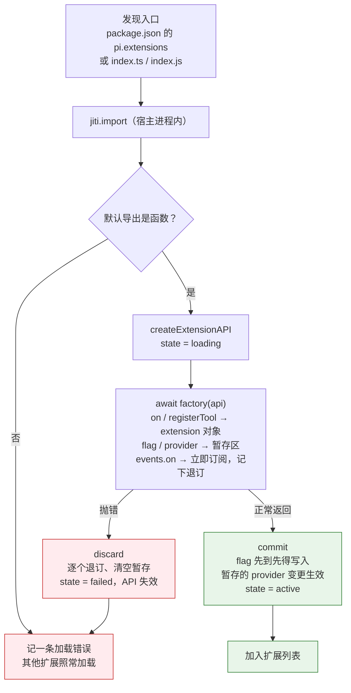
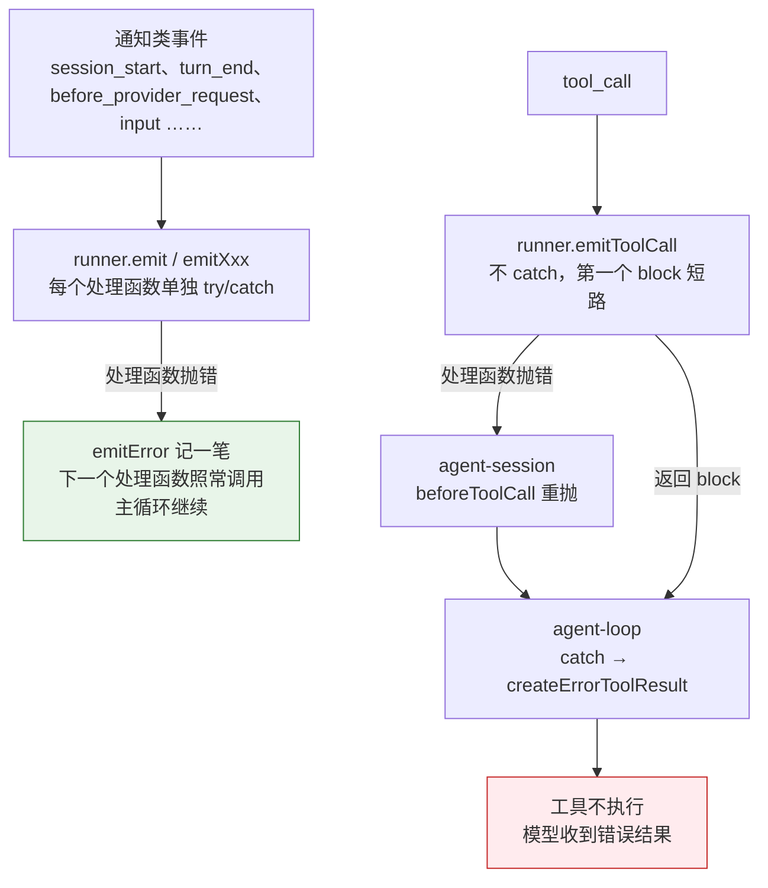
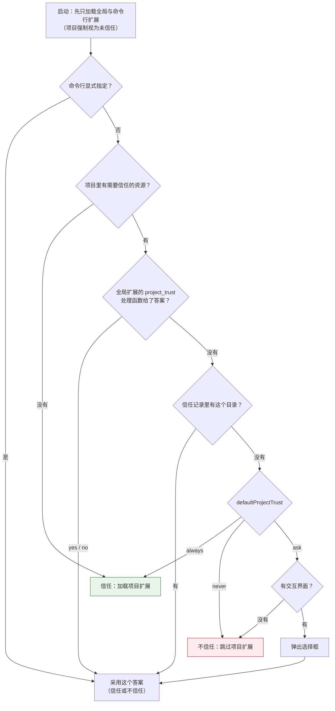

# 第 8 章 扩展系统的心智模型

> 基准：pi `b79e4cc8` (v0.84.4)　·　[版本表](../../research/BASELINE.md)　·　[参与指南](../../CONTRIBUTING.md)

**状态**：✅ 已完成

## 本章回答

- 为什么 pi 的扩展是 TS 模块而不是声明式清单
- 这个选择给了你什么，代价是什么（同进程、零隔离）

## 素材来源

- `research/pi/07-extensibility.md` §7.1、§7.3
- 对照：`step-harness` `fe153835`
- 配套代码：[`examples/ch08-extension-host/`](../../examples/ch08-extension-host/)

---

第 4 章说过，pi 的七个「决定不做」后面都留着钩子，用户要的时候自己补。这些钩子就是扩展系统。基于 pi 做产品，你写的大部分代码最终都会以扩展的形式挂上去：权限确认、子 agent、遥测、自定义 provider、快捷键。所以动手之前，先要有一个准确的心智模型：**扩展是什么、宿主怎么加载它、它出错时会发生什么、它能碰到什么。**

先看几个数字：

| 数字 | 是什么 | 出处 |
| --- | --- | --- |
| **1** | 扩展的类型签名：一个接收 API 对象的函数 | `core/extensions/types.ts:1582` |
| **36** | 扩展能订阅的事件 | `types.ts:1257-1301` |
| **78** | 官方示例扩展 | `coding-agent/examples/extensions/` |
| **18** | 扩展不能覆盖的保留快捷键 | `extensions/runner.ts:71-91` |
| **0** | 宿主和扩展之间的隔离层 | `docs/extensions.md:111` |

最后一个数字是本章的主题。「零隔离」不是疏忽，是一个有书面说明的选择。本章先讲清楚这个选择给了你什么（8.1–8.3），再讲它的代价落在哪里（8.4），最后看一个下游在哪里、为什么把隔离加了回来（8.5）。

本章引用的源码路径，除非特别说明，都相对于 `packages/coding-agent/src/`。

---

## 8.1 扩展是一个函数

### 类型签名

【代码事实】pi 的扩展只有一个类型：

```ts
// core/extensions/types.ts:1581-1582
/** Extension factory function type. Supports both sync and async initialization. */
export type ExtensionFactory = (pi: ExtensionAPI) => void | Promise<void>;
```

一个扩展就是一个模块，默认导出一个函数。宿主加载模块，调用这个函数，把一个 `ExtensionAPI` 对象递进去；扩展在函数里调用 `pi.on(...)`、`pi.registerTool(...)`、`pi.registerShortcut(...)` 把自己挂到宿主上。官方最小的示例只有 26 行：

```ts
// packages/coding-agent/examples/extensions/hello.ts:8-26（节选）
const helloTool = defineTool({
	name: "hello",
	label: "Hello",
	description: "A simple greeting tool",
	parameters: Type.Object({
		name: Type.String({ description: "Name to greet" }),
	}),

	async execute(_toolCallId, params, _signal, _onUpdate, _ctx) {
		return {
			content: [{ type: "text", text: `Hello, ${params.name}!` }],
			details: { greeted: params.name },
		};
	},
});

export default function (pi: ExtensionAPI) {
	pi.registerTool(helloTool);
}
```

`ExtensionAPI`（`types.ts:1252`）上的方法分三类：

| 类别 | 方法 | 位置 |
| --- | --- | --- |
| 订阅事件 | `on(event, handler)`，36 个重载 | `types.ts:1257-1301` |
| 注册能力 | `registerTool` / `registerCommand` / `registerShortcut` / `registerFlag` / `registerMessageRenderer` / `registerProvider` | `:1308`、`:1317`、`:1320`、`:1329`、`:1352`、`:1480-1481` |
| 调用宿主 | `exec`、扩展间事件总线 `events` | `:1397`、`:1499` |

注意这里没有的东西：没有权限声明，没有「这个扩展需要访问网络」之类的字段，也没有一个让宿主在运行扩展之前就知道它会做什么的结构。

### 清单只说「在哪」，不说「做什么」

pi 有清单，但清单的内容很少：

```ts
// core/pi-manifest.ts:4-9
export interface PiManifest {
	extensions?: string[];
	skills?: string[];
	prompts?: string[];
	themes?: string[];
}
```

它写在包的 `package.json` 的 `pi` 字段里，只列出入口文件的路径。加载器先看这个字段，没有就找目录下的 `index.ts` / `index.js`（`core/extensions/loader.ts:678-708`）。清单回答的是「扩展的代码在哪个文件」，至于这个扩展订阅哪些事件、注册哪些工具、绑哪些键，只有运行它的工厂函数之后才知道。

对比一下声明式的做法。假设扩展用一份 JSON 描述自己：

```json
{
  "tools": [{ "name": "hello", "command": "./hello.sh" }],
  "hooks": { "tool_call": "./guard.sh" },
  "permissions": ["fs:read"]
}
```

宿主不运行任何代码就能知道这个扩展要什么，可以在安装前把权限列给用户看，可以把 `guard.sh` 放进子进程、加超时、限制它能读的目录。代价是**扩展能做的事被清单的词汇表封顶**：清单里没有的字段，扩展就做不了。

【推断】pi 选了另一头。它的 README 把扩展性放在 Philosophy 的第一句（`README.md:497`，第 4 章引用过）：pi 要「足够可扩展，以至于不必规定你的工作流」。一个函数能做的事没有上限：

- **按条件注册**：读环境变量、读配置文件，决定注册哪些工具。
- **处理函数之间共享状态**：`tool_call` 里记下的东西，`tool_result` 里能直接用，因为它们是同一个闭包。
- **调用宿主的任意 API**：包括切换模型、注册 provider、渲染自定义消息。

这三条声明式清单都做不到，或者要为每一条单独发明语法。代价也正好落在声明式清单的长处上：**宿主不运行扩展，就不知道它要做什么；运行了，就已经把全部权限交给了它。**

### 加载路径

【代码事实】扩展的发现位置有四个（`docs/extensions.md:115-120`）：

| 位置 | 范围 |
| --- | --- |
| `~/.pi/agent/extensions/*.ts` | 全局（所有项目） |
| `~/.pi/agent/extensions/*/index.ts` | 全局（子目录） |
| `.pi/extensions/*.ts` | 项目本地 |
| `.pi/extensions/*/index.ts` | 项目本地（子目录） |

此外还有通过 `pi install` 安装的包、命令行 `--extension` 指定的路径和 SDK 传入的内联工厂函数。

找到入口文件之后，加载器用 jiti 在**宿主进程里**直接 import：

```ts
// core/extensions/loader.ts:498-514（节选）
const jiti = createJiti(import.meta.url, {
	moduleCache: false,
	...(isBunBinary || isNodeSeaBinary || isBundledNode
		? { virtualModules: VIRTUAL_MODULES, tryNative: false }
		: isTypeScriptSourceRuntime
			? { virtualModules: VIRTUAL_MODULES, tsconfigPaths: true }
			: { alias: getAliases() }),
});

const module = await jiti.import(extensionPath, { default: true });
const factory = module as ExtensionFactory;
if (typeof factory !== "function") {
	return undefined;
}
```

jiti 让 `.ts` 文件不经编译就能加载。按 pi 的运行形态，`virtualModules`（`loader.ts:10-27`）或 `alias` 把 `@earendil-works/pi-coding-agent`、`@earendil-works/pi-ai` 等包名指向宿主自己的那份代码，所以扩展 import pi 的类型和工具函数时不需要自己安装 pi。

这就是全部的加载过程。**没有 Worker，没有 `node:vm`，没有子进程**：`coding-agent/src` 里唯一的 `Worker` 用在图片缩放（`utils/image-resize.ts:22`），和扩展无关。

---

## 8.2 加载即事务

一个扩展的工厂函数可能执行到一半抛错：注册了两个处理函数、订阅了一个频道、声明了一个 flag，然后发现配置文件缺字段。宿主要回答的问题是：**已经注册的那一半算不算数？**

pi 的答案是不算。`createExtensionAPI` 给每个扩展造一份 API，同时返回 `commit` 和 `discard` 两个出口：

```ts
// core/extensions/loader.ts:545-564（节选）
const extension = createExtension(extensionPath, resolvedPath);
const load = createExtensionAPI(extension, runtime, cwd, eventBus);
try {
	await factory(load.api);
	load.commit();
} catch (error) {
	load.discard();
	throw error;
}
return extension;
```

工厂函数执行期间的注册分三种去向：

| 注册 | 去向 | 失败时怎么撤销 | 位置 |
| --- | --- | --- | --- |
| `on` / `registerTool` / `registerCommand` 等 | 直接写进这个扩展自己的 `extension` 对象 | 抛错时 `extension` 不会被返回，整个对象被丢掉 | `loader.ts:282-296` |
| flag 默认值、`registerProvider` / `unregisterProvider` | 进暂存区（`pendingFlagValues`、`pendingRuntimeChanges`） | `discard` 清空暂存区 | `:432-445` |
| 事件总线订阅 `events.on` | **立即生效**，同时记下退订函数 | `discard` 逐个退订 | `:452-456` |

前两种的共同点是：它们改的东西，在 `commit` 之前别人看不到。第三种是例外——别的扩展可能在加载期间就往总线上发事件，订阅必须马上生效。所以它没法暂存，只能「先做，失败了再撤」：

```ts
// core/extensions/loader.ts:452-478（节选）
on(channel, handler) {
	assertActive();
	const unsubscribe = runtime.trackEventBusSubscription(eventBus.on(channel, handler));
	if (state === "loading") loadingUnsubscribers.push(unsubscribe);
	return unsubscribe;
},
// …
commit: () => {
	if (state !== "loading") return;
	runtime.assertActive();
	for (const [name, value] of pendingFlagValues) {
		if (!runtime.flagValues.has(name)) runtime.flagValues.set(name, value);
	}
	for (const apply of pendingRuntimeChanges) apply();
	state = "active";
	clearPending();
},
discard: () => {
	if (state !== "loading") return;
	state = "failed";
	for (const unsubscribe of loadingUnsubscribers) unsubscribe();
	clearPending();
},
```

`commit` 里的 `if (!runtime.flagValues.has(name))` 说明 flag 默认值是先到先得：两个扩展声明同名 flag，先加载的那个说了算。

`discard` 之后还有一个细节：扩展可能把 `pi` 对象存在某个闭包里，过一会儿再调用。`state` 变成 `"failed"` 以后，API 上的每个方法都会先过 `assertActive`，直接抛错：

```ts
// core/extensions/loader.ts:263-269
let state: "loading" | "active" | "failed" = "loading";
const assertActive = () => {
	if (state === "failed") {
		throw new Error(`Extension "${extension.path}" failed to load and its API is no longer active.`);
	}
	runtime.assertActive();
};
```



*图 8-1 一个扩展的加载过程。工厂函数是一个事务的边界：正常返回才提交，抛错就回滚，失败的扩展不影响其他扩展。*

### 判断依据

- **工厂函数是事务边界**：成功才 `commit`，抛错就 `discard`（`loader.ts:545-564`）。【代码事实】
- **事件总线订阅是唯一「先做后撤」的注册**，其余要么暂存、要么写进不会被返回的对象。【代码事实】
- **一个扩展加载失败只产生一条错误**（`loader.ts:566-589`），不影响其他扩展。【代码事实】
- **事务只管注册，不管副作用。** 工厂函数里写了文件、开了子进程、发了网络请求，`discard` 一概不知道。宿主能撤销的只有经过 API 的那部分。【推断】

---

## 8.3 两种失败语义

加载成功之后，扩展的代码在事件发生时运行。处理函数一样会抛错。pi 对这件事给了两种相反的处置，用户文档写得很清楚：

```text
// packages/coding-agent/docs/extensions.md:2919-2923
## Error Handling

- Extension errors are logged, agent continues
- `tool_call` errors block the tool (fail-safe)
```

### 通知类：记一笔，继续

【代码事实】通用的 `emit` 给每个处理函数单独包一层 try/catch，出错就报告，然后调下一个：

```ts
// core/extensions/runner.ts:854-878（节选）
for (const ext of this.extensions) {
	const handlers = ext.handlers.get(event.type);
	if (!handlers || handlers.length === 0) continue;

	for (const handler of handlers) {
		try {
			const handlerResult = await handler(event, ctx);
			// session_before_* 事件：handler 返回 cancel 就短路
		} catch (err) {
			// …
			this.emitError({ extensionPath: ext.path, event: event.type, error: message, stack });
		}
	}
}
```

一个遥测扩展连不上服务、一个状态栏扩展算错了宽度，主循环都不该停下来。这是对的。

### 拦截类：出错就拦下

`tool_call` 走另一条路。专用的 `emitToolCall` **刻意没有 try/catch**，第一个返回 `block` 的处理函数直接短路：

```ts
// core/extensions/runner.ts:982-1002（节选）
async emitToolCall(event: ToolCallEvent): Promise<ToolCallEventResult | undefined> {
	const ctx = this.createContext();
	let result: ToolCallEventResult | undefined;

	for (const ext of this.extensions) {
		const handlers = ext.handlers.get("tool_call");
		if (!handlers || handlers.length === 0) continue;

		for (const handler of handlers) {
			const handlerResult = await handler(event, ctx);

			if (handlerResult) {
				result = handlerResult as ToolCallEventResult;
				if (result.block) {
					return result;
				}
			}
		}
	}

	return result;
}
```

异常一路往上冒。产品层把它挂在 agent 的 `beforeToolCall` 上，原样重抛（非 Error 值包成 Error）：

```ts
// core/agent-session.ts:494-506（节选）
try {
	return await runner.emitToolCall({ type: "tool_call", toolName: toolCall.name, toolCallId: toolCall.id, input: args });
} catch (err) {
	if (err instanceof Error) {
		throw err;
	}
	throw new Error(`Extension failed, blocking execution: ${String(err)}`);
}
```

最后在 agent 循环里被接住。被 `block` 的调用和拦截器抛错的调用，结局一样：**工具不执行，模型收到一条错误结果**：

```ts
// packages/agent/src/agent-loop.ts:634-664（节选）
if (beforeResult?.block) {
	const result = createErrorToolResult(beforeResult.reason || "Tool execution was blocked");
	// …
	return { kind: "immediate", result, isError: true };
}
// …
} catch (error) {
	return {
		kind: "immediate",
		result: createErrorToolResult(error instanceof Error ? error.message : String(error)),
		isError: true,
	};
}
```



*图 8-2 两种失败语义。左边一列是 fail-open：扩展出错，就当这个处理函数不存在。右边一列是 fail-closed：拦截器出错，就当它说了「拦下」。*

### 为什么只有 `tool_call` 是 fail-closed

【代码事实】`runner.ts` 里除了通用的 `emit`，还有 10 个专用的 `emitXxx` 方法（`:885-1290`）。逐个检查，**只有 `emitToolCall` 没有 try/catch**，其余 9 个都和通用 `emit` 一样，出错记一笔继续。

【推断】理由在于「跳过一个出错的处理函数」意味着什么。`session_start` 的处理函数崩了，跳过它，最坏是少一条日志。`tool_call` 的处理函数多半是一道闸——第 4 章的 `permission-gate.ts`、示例里的 `protected-paths.ts`——跳过它等于把闸拆了，`rm -rf` 照样执行。对一道闸来说，「崩了」和「放行」不能是同一个结果。

代价是可用性：一个有 bug 的拦截器会让它覆盖到的每一次工具调用都失败。用户会看到模型反复收到同一条错误，这比静默放行好排查，但也确实让 agent 干不了活。

这条规则也有边界。fail-closed 只覆盖 `tool_call` 一个事件。另外几个能改写数据的事件仍是 fail-open，`emitBeforeProviderRequest` 就是一例（`runner.ts:1066-1098`）：处理函数抛错，它这一份改写丢失，请求照发。如果你在这里做发往模型之前的脱敏，扩展一崩，原文就出去了。**要 fail-closed 的不只是工具调用时**，你得自己在处理函数里兜住：catch 住异常，返回一个保守的结果。

### 判断依据

- **通知类事件是 fail-open**：每个处理函数单独 try/catch（`runner.ts:850-880`），出错只影响它自己。【代码事实】
- **`tool_call` 是唯一 fail-closed 的事件**：异常经 `agent-session.ts:494-506` 冒到 `agent-loop.ts:659-664`，变成错误结果。【代码事实】
- **能改写请求的事件仍是 fail-open**，例如 `before_provider_request`（`runner.ts:1084`）；用它做安全相关的事，要自己在处理函数里兜底。【代码事实 + 推断】
- **try/catch 是容错，不是隔离**：它防得住异常，防不住一个扩展死循环、改全局对象、读你的文件。下一节讲这一点。【推断】

---

## 8.4 同进程、零隔离的代价

### 文档怎么说

【代码事实】pi 没有把这件事藏起来。扩展文档在「Extension Locations」一节开头就写着：

```text
// packages/coding-agent/docs/extensions.md:111
> **Security:** Extensions run with your full system permissions and can execute arbitrary code. Only install from sources you trust.
```

README（`coding-agent/README.md:412`）和包文档（`docs/packages.md:20`）里各有一句意思相同的警告。扩展能做的事，就是运行 pi 的那个用户能做的事。

### 扩展能碰到什么

8.1 节说过，扩展的工厂函数在宿主进程里执行，用的是和宿主同一个 Node 运行时。所以：

| 宿主有的 | 扩展能不能碰 | 为什么 |
| --- | --- | --- |
| `process.env` 里的 API key | 能 | 同一个进程对象；官方示例本身就在读 `process.env`（如 `examples/extensions/interactive-shell.ts:102`） |
| `~/.pi/agent/auth.json` 里的凭据 | 能 | 文件以 `0o600` 写入（`core/auth-storage.ts:25`），只防**别的 OS 用户**；扩展和 pi 是同一个用户 |
| 全局对象、已加载模块 | 能改 | 同一个堆，同一份模块缓存（虚拟模块让扩展拿到宿主的实例，见 8.1 节） |
| 子进程、网络、文件系统 | 能 | Node 的全部内置模块都可 import |

一个常见的误解是 `before_provider_headers` 事件会把 API key 交给扩展。【代码事实】并不会：pi-ai 把 key 作为单独的 `apiKey` 字段传给 provider，事件看到的只是 `mergeHeaders(auth.headers, options.headers)` 合并出的那份 header（`packages/ai/src/models.ts:655-657`）。但这个区别没有安全意义，扩展根本不需要这个事件——它直接读环境变量就行。

### 安装扩展包时，脚本也在跑

扩展的代码在工厂函数里才运行，但扩展包的代码可以更早运行：npm 的 lifecycle script（`postinstall` 等）在安装时执行。

【代码事实】pi 给自己做升级时，每一种包管理器都带着 `--ignore-scripts`（`config.ts:137,149,159,175`）；仓库给开发者的规则也要求 `npm install --ignore-scripts`（`AGENTS.md:46`）。但安装扩展包时不带：

```ts
// core/package-manager.ts:1785-1806（节选）
private getNpmInstallArgs(specs: string[], installRoot: string): string[] {
	const packageManagerName = this.getPackageManagerName();
	if (packageManagerName === "bun") {
		return ["install", ...specs, "--cwd", installRoot, "--omit=peer"];
	}
	if (packageManagerName === "pnpm") {
		return ["install", ...specs, "--prefix", installRoot, /* … */ "--config.strict-dep-builds=false"];
	}
	return ["install", ...specs, "--prefix", installRoot, "--legacy-peer-deps"];
}
```

【推断】这和零隔离是一回事的两面：既然扩展装上之后就有全部权限，禁掉安装脚本也挡不住什么。但它把「运行第三方代码」的时间点从「pi 启动并加载扩展」提前到了「执行 `pi install` 的那一刻」，而且 pnpm 那一支还显式关掉了 `strict-dep-builds`。如果你的产品要对扩展包做审核，审核必须发生在安装之前。

### 项目信任：唯一的闸

零隔离之下，宿主能做的只剩一件事：**决定加载谁**。全局扩展是用户自己装的，默认可信；项目目录下的 `.pi/extensions` 是跟着仓库来的——你 clone 一个陌生仓库，里面的扩展就是陌生人的代码。

【代码事实】项目本地扩展要等项目被信任之后才加载（`docs/extensions.md:113`）。包管理器在解析资源时检查信任状态，未信任的项目不加入项目扩展（`core/package-manager.ts:2398`、`:2417`）。询问用户时的提示写得很直白：

```ts
// core/project-trust.ts:24-26
function formatProjectTrustPrompt(cwd: string): string {
	return `Trust project folder?\n${cwd}\n\nThis allows ${APP_NAME} to load ${CONFIG_DIR_NAME} settings and resources, install missing project packages, and execute project extensions.`;
}
```

谁来决定信不信任？`resolveProjectTrusted` 按固定顺序问一圈，第一个给出答案的说了算：



*图 8-3 项目信任的判定顺序（`core/project-trust.ts:46-96`）。从上往下问，第一个给出答案的说了算；全局扩展排在用户自己的信任记录之前。没有交互界面又没有任何答案时，默认不信任。*

两个细节值得注意。

第一，**信任判定之前，扩展已经在跑了。** 启动时先做一轮「引导加载」：把项目强制设成未信任，只加载全局扩展和命令行指定的扩展（`core/resource-loader.ts:380-386`）。这些扩展的 `project_trust` 处理函数参与信任判定（`project-trust.ts:56-70`），判定之后再加载剩下的扩展（`resource-loader.ts:574-625`）。

第二，**全局扩展比项目更可信。** 一个全局扩展可以替用户回答「信任这个项目吗」，并且可以要求记住答案（`result.remember`）。【推断】这是合理的分层——全局扩展是用户亲手装的——但它意味着一个全局扩展的 bug 或恶意，会直接变成所有项目的信任决策。

### 宿主说了算的那一条线

整个扩展系统里，宿主强制执行、扩展绕不过去的边界只有一处：快捷键。

【代码事实】`RESERVED_KEYBINDINGS_FOR_EXTENSION_CONFLICTS`（`runner.ts:71-91`）列了 18 个动作，包括 `app.interrupt`、`app.clear`、`app.exit`、`tui.input.submit`。`getShortcuts`（`:544-590`）按三条规则裁决冲突：

| 冲突 | 结果 |
| --- | --- |
| 扩展的键撞上保留动作 | 跳过扩展的绑定，警告 "conflicts with built-in shortcut. Skipping." |
| 扩展的键撞上非保留的内置键 | 扩展赢，给警告 |
| 两个扩展撞同一个键 | 后加载的赢，给警告 |

【推断】保护的东西很具体：用户中断 agent、退出程序的那几个键，任何扩展都抢不走。这不是安全边界——扩展照样可以 `process.exit()`——而是**可用性边界**：保证一个写得糟糕的扩展不会让用户连 Ctrl+C 都按不动。

### 判断依据

- **零隔离是有书面说明的选择**，不是疏忽（`docs/extensions.md:111`）。【代码事实】
- **扩展能读环境变量和凭据文件**；`0o600` 对它不构成任何限制。【代码事实】
- **扩展包安装不带 `--ignore-scripts`**，与 pi 自身升级和开发规则不一致；第三方代码在安装时就开始运行。【代码事实】
- **项目信任是唯一的闸**，而且全局扩展在信任判定之前就已加载，并能参与判定。【代码事实】
- **你的产品如果要承诺「装扩展是安全的」，pi 给不了这个承诺**；要么做安装前审核，要么换架构（下一节）。【推断】

---

## 8.5 下游对照：step-harness 把隔离加在了哪里

step-harness 是 pi 的一个下游 fork。看它怎么处理扩展，能看出「零隔离」在真实产品里的去留。

【代码事实】扩展加载器几乎原样保留：`core/extensions/loader.ts` 与 pi 一致，只在 `discoverAndLoadExtensions` 多了一个 `configDirName` 参数，用来换配置目录名。扩展包安装参数也一样不带 `--ignore-scripts`（step-harness `core/package-manager.ts:1796`、`:1809`）。

但 step-harness 加了一种 pi 没有的代码：**workflow 脚本**——由模型在运行时编写、用来编排多步任务的 JavaScript。这种代码它放进了 isolated-vm：

```ts
// step-harness: packages/coding-agent/src/extensions/workflow/vm.ts:5-7, 88-99（节选）
const MAX_SCRIPT_BYTES = 128 * 1024;
const DEFAULT_MEMORY_LIMIT_MB = 64;
const DEFAULT_TIMEOUT_MS = 120_000;
// …
export async function runInIsolatedVm(
	script: string,
	args: unknown,
	host: WorkflowVmHost,
	options: WorkflowVmOptions = {},
): Promise<WorkflowVmResult> {
	const sourceBytes = Buffer.byteLength(script, "utf8");
	if (sourceBytes > MAX_SCRIPT_BYTES) throw new Error(`Workflow script exceeds ${MAX_SCRIPT_BYTES} bytes`);
	const ivm = loadIsolatedVm();
	if (!ivm) throw new Error("Workflow runtime unavailable: isolated-vm is not installed or failed to load");
	const isolate = new ivm.Isolate({ memoryLimit: clampMemory(options.memoryLimitMb) });
	// …
```

`isolated-vm` 是可选依赖（step-harness `package.json:78-80`），装不上怎么办？注册闸决定：没有 isolate 就不注册 workflow 工具，模型根本看不到它：

```ts
// step-harness: packages/coding-agent/src/extensions/workflow/registration-gate.ts:15-21
export function isWorkflowRegistrationEnabled(options: { enabled?: boolean; vmExecutor?: unknown } = {}): boolean {
	const enabled = options.enabled === true || envFlag(process.env.STEP_ENABLE_WORKFLOW);
	if (!enabled) return false;
	if (envFlag(process.env.STEP_DISABLE_WORKFLOW)) return false;
	if (!isIsolatedVmAvailable() && !options.vmExecutor) return false;
	return true;
}
```

要用 workflow，必须显式打开开关，并且要么 isolated-vm 可用，要么注入了自定义执行器。隔离不可用时，它选择不提供这个功能，而不是退回到同进程执行——又一个 fail-closed。

| 代码 | 谁写的 | 什么时候写的 | step-harness 的处置 |
| --- | --- | --- | --- |
| 扩展 | 用户安装（或项目带来，经信任） | 运行之前 | 同进程，零隔离（与 pi 相同） |
| workflow 脚本 | 模型 | 运行时，每次都可能不同 | isolated-vm：内存 64 MB、超时 120 秒、脚本 128 KiB；隔离不可用就不注册 |

【推断】按本书的立场只看「谁选了什么、代价是什么」：step-harness 把隔离放在了**代码作者不是用户**的地方。扩展再危险，也是用户自己选择装的，责任边界清楚；模型写的脚本没有人在运行前看过，而且可能受 prompt injection 影响。这个划分很务实。代价有两个：一是同一个产品里有两套信任模型，读者要分别理解；二是 workflow 脚本的能力边界从此由宿主注入的 `host` 桥接对象决定——桥上暴露了什么，隔离就只隔到哪里。隔离把问题从「代码能做什么」变成了「桥能做什么」，后者要单独审计。

---

## 8.6 你的最小实现：一个扩展宿主

配套代码 [`examples/ch08-extension-host/`](../../examples/ch08-extension-host/) 按本章的心智模型写了一个零依赖的扩展宿主，不算测试约 450 行。它保留 pi 的五条规则，去掉了 TUI、provider、命令等与心智模型无关的部分：

| 规则 | pi | 本例 |
| --- | --- | --- |
| 扩展 = 工厂函数 | `types.ts:1582` | `src/types.ts` |
| 加载即事务 | `loader.ts:254-480`、`:545-564` | `src/api.ts`、`src/loader.ts` |
| 通知类 fail-open | `runner.ts:850-880` | `src/runner.ts` 的 `emit` |
| 拦截类 fail-closed | `runner.ts:982-1002` → `agent-loop.ts:659-664` | `src/runner.ts` 的 `beforeToolCall` |
| 保留键 | `runner.ts:71-91`、`:544-590` | `src/shortcuts.ts` |

### 加载即事务

`createExtensionAPI` 让注册只进暂存区，`commit` 时一次性冻结交出去；事件总线订阅照常生效，记下退订函数：

```ts
// examples/ch08-extension-host/src/api.ts:56-88（节选）
events: {
  emit(channel, data) {
    assertUsable();
    bus.emit(channel, data);
  },
  on(channel, handler) {
    assertUsable();
    const off = bus.on(channel, handler);
    if (state === "loading") unsubscribers.push(off);
    return off;
  },
},
// …
commit() {
  if (state !== "loading") throw new Error(`扩展「${path}」不在加载中，不能提交`);
  state = "active";
  const extension: Extension = Object.freeze({
    path,
    handlers: Object.freeze([...handlers]),
    tools: new Map(tools),
    shortcuts: Object.freeze([...shortcuts]),
  });
  return { extension, flags: new Map(flags) };
},
discard() {
  if (state !== "loading") return;
  state = "failed";
  for (const off of unsubscribers) off();
},
```

和 pi 有一处刻意的不同：pi 的 `on` 和 `registerTool` 只检查扩展没有加载失败（`loader.ts:282-296` 里的 `assertActive`），加载成功之后仍可以调用；本例规定注册只能发生在工厂函数执行期间（`api.ts:34-37` 的 `assertLoading`），之后调用直接抛错。好处是加载结束时扩展注册过什么就是确定的、可以冻结的；代价是扩展不能按运行时情况追加工具。你的产品需要哪一种，取决于你要不要「加载完成之后扩展的能力就不再变」这条保证。

### 两种失败语义

拦截器出错按拦下处理，只需要在 `emitToolCall` 外面包一层：

```ts
// examples/ch08-extension-host/src/runner.ts:62-71
export async function beforeToolCall(
  extensions: readonly Extension[],
  event: EventOf<"tool_call">,
): Promise<BlockResult | undefined> {
  try {
    return await emitToolCall(extensions, event);
  } catch (error) {
    return { block: true, reason: `扩展出错，按拦截处理：${messageOf(error)}` };
  }
}
```

处理函数的返回值来自扩展，是外部数据。本例只认 `block === true`，`{ block: "yes" }` 这样的值不算拦截，缺 `reason` 就补一个默认值（`runner.ts:16-20` 的 `asBlock`）。pi 用的是真值判断 `if (result.block)`（`runner.ts:995`），在 TypeScript 类型约束下两者等价，但扩展可能是没有类型检查的 `.js`。

### 跑起来

`demo-extensions/` 下有 8 个演示扩展，覆盖本章讲到的每种情况：

```text
$ npm start
== 1. 加载 8 个扩展（工厂成功才提交，抛错就回滚）
  ✓ demo-extensions/crashy-guard.ts  处理函数 1 · 工具 0 · 快捷键 0
  ✓ demo-extensions/guard.ts  处理函数 1 · 工具 0 · 快捷键 0
  ✓ demo-extensions/hello.ts  处理函数 1 · 工具 1 · 快捷键 1
  ✓ demo-extensions/keys.ts  处理函数 0 · 工具 0 · 快捷键 3
  ✓ demo-extensions/noisy.ts  处理函数 1 · 工具 0 · 快捷键 0
  ✓ demo-extensions/snoop.ts  处理函数 1 · 工具 0 · 快捷键 0
  ✗ demo-extensions/broken.ts：工厂函数抛错：配置文件缺字段 apiBase
  ✗ demo-extensions/not-a-factory.ts：默认导出不是工厂函数
  回滚检查：demo:ping 订阅者 1 个；flag：（无）
  hello: 收到 demo:ping

== 2. session_start（通知类：处理函数出错只记一笔，后面的照常调用）
  hello: 收到 session_start
  snoop: 读到 DEMO_API_KEY=demo-not-a-real-key
  ! demo-extensions/noisy.ts：连不上遥测服务

== 3. tool_call（拦截类：第一个 block 说了算；拦截器自己出错，按拦下处理）
  write {"path":".env"} → 拦下：「.env」受保护
  write {"path":"src/app.ts"} → 放行
  bash {} → 拦下：扩展出错，按拦截处理：Cannot read properties of undefined (reading 'includes')
  bash {"command":"rm -rf build"} → 拦下：危险命令

== 4. 快捷键（保留键宿主说了算，其余后来者赢）
  ! demo-extensions/keys.ts 的「ctrl+c」与保留键 interrupt 冲突，已跳过
  ! demo-extensions/keys.ts 覆盖了内置键「ctrl+r」（history.search）
  ! 「ctrl+g」同时被 demo-extensions/hello.ts 和 demo-extensions/keys.ts 注册，用后者
  ctrl+g → demo-extensions/keys.ts（不，ctrl+g 归我）
  ctrl+r → demo-extensions/keys.ts（换成我的历史搜索）

== 5. 调用扩展注册的工具
  hello({ name: "pi" }) → Hello, pi!
```

逐段对照本章：

- **第 1 段**：`broken.ts` 注册了 flag、订阅了 `demo:ping`，然后抛错。回滚检查显示订阅者只剩 1 个（`hello.ts` 的），flag 为空——图 8-1 的 `discard` 生效了。
- **第 2 段**：`noisy.ts` 的处理函数抛错，只记一笔，排在它前后的处理函数都照常调用。`snoop.ts` 读到了宿主的环境变量——API 里没有任何一项授予它这个能力，它也不需要。
- **第 3 段**：`crashy-guard.ts` 假设 bash 调用一定有 `command` 参数，遇到 `{}` 就崩了；结果是这次调用被拦下，而不是放行。
- **第 4 段**：`ctrl+c` 是保留键，扩展抢不走；`ctrl+r` 不是，扩展覆盖了它并留下警告。
- **第 5 段**：扩展注册的工具和内置工具一样调用。

`npm test` 跑 20 个用例，覆盖提交与冻结、抛错回滚（包括事件总线退订和失效 API）、加载后不能再注册、六种入口错误、批量加载中 flag 先到先得、两种失败语义、返回值校验、快捷键三条规则，以及「扩展能读宿主的环境变量」这条不该被忘记的事实。

### 写扩展宿主的三个教训

1. **回滚要覆盖已经发生的副作用。** 能暂存的都暂存，不能暂存的（事件总线订阅）就先做、记下撤销办法。演示第 1 段的回滚检查就是为这件事写的；没有它，`broken.ts` 的订阅会在它「加载失败」之后继续收到事件。
2. **同一个异常，事件不同，处置相反。** 设计每个事件时先问：跳过一个出错的处理函数，会不会让某件事变得危险？会，就 fail-closed。pi 只对 `tool_call` 回答了「会」；如果你在别的事件上做安全相关的事，要么改宿主，要么在扩展里自己兜底。
3. **try/catch 是容错，不是隔离。** 它能防一个扩展的异常拖垮宿主，防不了一个扩展读你的环境变量、改全局对象、开子进程。要隔离，就要换进程或换 isolate，那是另一种架构；8.5 节的 step-harness 只对模型写的代码付了这个代价。

---

## 本章小结

- **pi 的扩展是一个函数**：`(pi: ExtensionAPI) => void | Promise<void>`（`types.ts:1582`）。清单只说入口文件在哪（`pi-manifest.ts:4-9`），扩展做什么只有运行之后才知道。换来的是没有上限的表达力，代价是宿主无法在运行前知道扩展要什么。
- **加载即事务**：工厂函数成功才 `commit`，抛错就 `discard`（`loader.ts:545-564`）。事件总线订阅是唯一先生效、失败再撤销的注册。事务只管经过 API 的注册，不管工厂函数里的副作用。
- **两种失败语义**：通知类事件 fail-open，每个处理函数单独 try/catch（`runner.ts:850-880`）；`tool_call` 是唯一 fail-closed 的事件，拦截器出错等于拦下（`runner.ts:982-1002` → `agent-loop.ts:659-664`）。`before_provider_request` 等能改写请求的事件仍是 fail-open。
- **同进程、零隔离是书面的选择**（`docs/extensions.md:111`）：扩展能读环境变量和 `auth.json`，扩展包安装时 lifecycle script 照常执行（`package-manager.ts:1785-1806`）。宿主唯一的闸是项目信任（`project-trust.ts:46-96`），唯一强制执行的边界是 18 个保留快捷键（`runner.ts:71-91`）——后者是可用性边界，不是安全边界。
- **step-harness 只对模型写的代码加了隔离**：扩展照旧同进程，workflow 脚本进 isolated-vm，隔离不可用时不注册该工具。隔离从「代码能做什么」变成了「宿主的桥能做什么」。
- **配套代码**用约 450 行复现了这五条规则，演示输出逐段对应本章各节。
