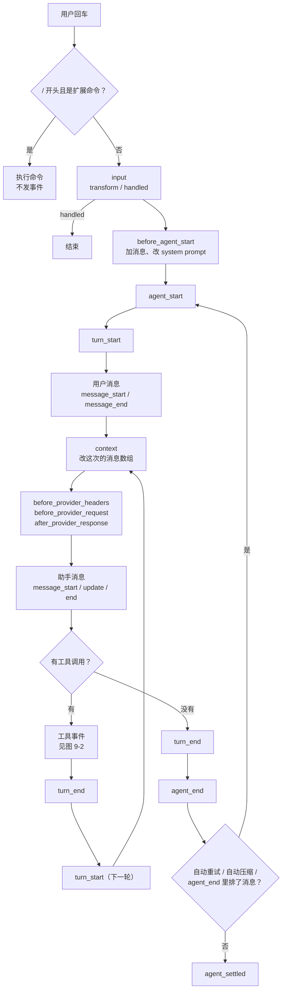
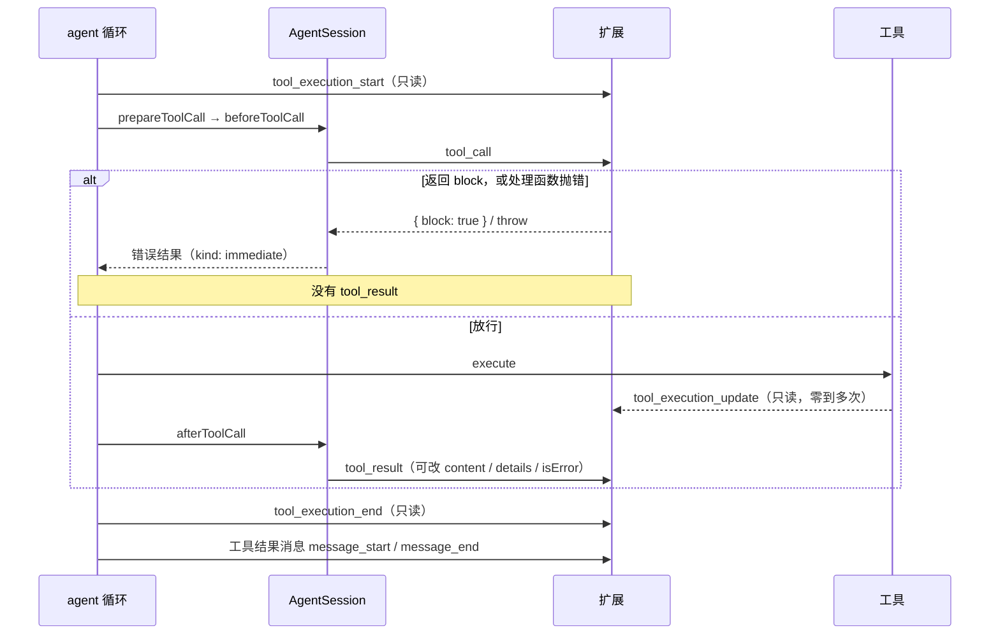
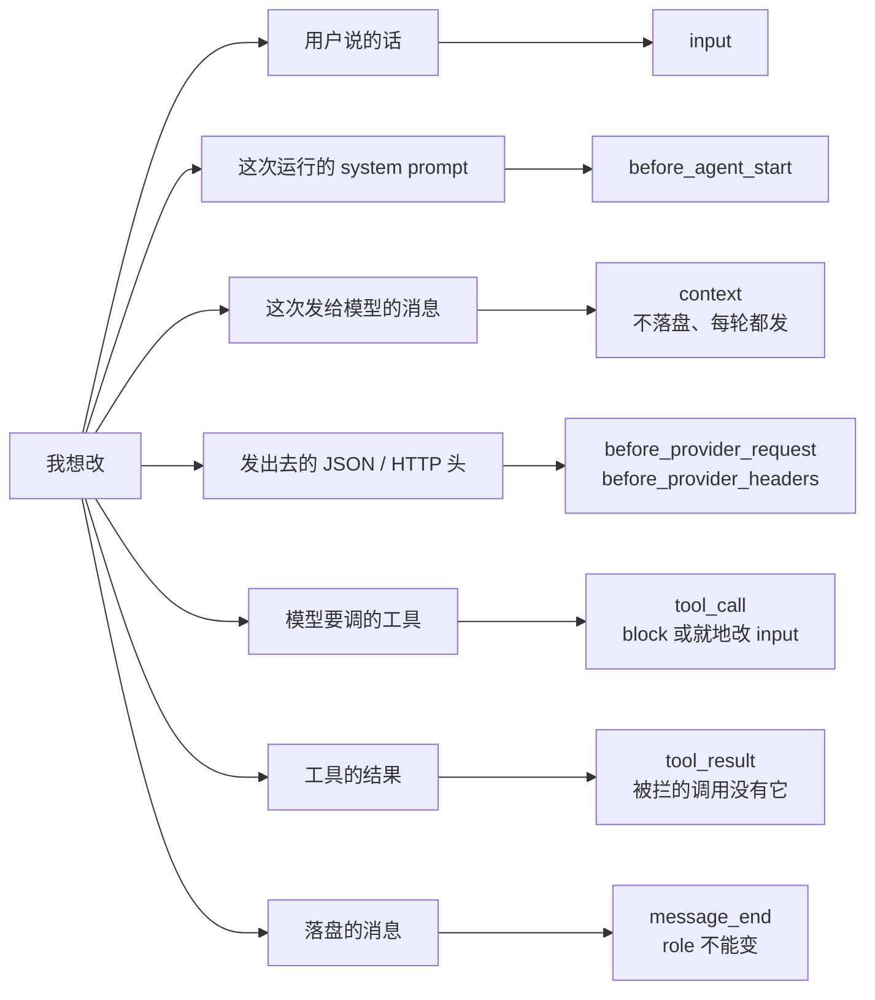
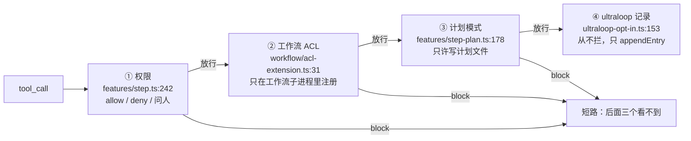

# 第 9 章 任务 → API 反查表

> 基准：pi `b79e4cc8` (v0.84.4)　·　[版本表](../../research/BASELINE.md)　·　[参与指南](../../CONTRIBUTING.md)

**状态**：✅ 已完成

## 本章回答

- 我想做 X，该订阅 36 个事件里的哪一个、调 11 组注册类 API 里的哪一个；看起来也行、其实不对的是哪个
- 一次运行里事件按什么顺序发；官方文档的生命周期图哪里和代码对不上
- 几个扩展订阅同一个事件时，宿主最后拿到什么：12 种合并方式
- 处理函数抛错的下场为什么因事件而异：哪一个是 fail-closed，哪些是 fail-open
- `sendMessage`、`sendUserMessage`、`appendEntry` 三者的区别；旗标为什么要在事件里读；状态为什么要从分支重建
- Step-Code 怎样在同一个 `tool_call` 上叠四个订阅者；minimax-code 为什么另起一套 9 个钩子

## 素材来源

- `research/pi/07-extensibility.md` §7.2、§7.2.1（反查视角：合并方式、生命周期顺序、下游对照）
- 第 8 章（扩展模型、两种失败语义）的结论
- 对照：`Step-Code` `7dd66cb`、`minimax-code` `89c930a`
- 配套代码：[`examples/ch09-api-lookup/`](../../examples/ch09-api-lookup/)

（pi 的路径以 `packages/coding-agent/src/` 为根；`agent/src/` 指 `packages/agent/src/`，`ai/src/` 指 `packages/ai/src/`；`docs/`、`examples/` 指 `packages/coding-agent/` 下的同名目录。Step-Code 的路径同样以 `packages/coding-agent/src/` 为根，`apps/cli/` 开头的按仓库根。minimax-code 的路径按仓库根。）

---

pi 的扩展文档按 API 排：先列 36 个事件，再列注册方法，每一节讲清楚这个东西是什么（`docs/extensions.md`）。写扩展时的问题却是反过来的：「我想在模型调用工具之前拦一下」「我想给每次请求加一个头」「我想让状态跟着分支走」——先有任务，再找 API。按 API 排的文档要从头翻到尾，翻到了还不一定知道两个看起来都行的事件该选哪个。

本章把方向倒过来。先给一张按任务查的表，每一条写明用什么、别用什么、坑在哪里。然后补上查表时最容易漏掉的两件事：**时机**（这个事件在一次运行的哪一刻发）和**合并方式**（几个扩展都订阅了它，宿主最后用谁的结果；处理函数抛错了怎么办）。事件名选对了、合并方式没看，扩展照样会出问题。

这一章是查着用的（第 0 章「阅读路径」），不必通读。不排名次，只回答「谁选了什么、代价是什么」。

先看几个数字：

| 数字 | 是什么 | 出处 |
| --- | --- | --- |
| **36 / 15 / 21** | 扩展能订阅的事件 / 其中返回值或就地修改会被宿主用上的 / 只读的 | `core/extensions/types.ts:1257-1301`；`examples/ch09-api-lookup/src/catalog.ts` 逐个核对 |
| **12** | 多个处理函数的合并方式，每种对应 `runner.ts` 的一个方法 | `core/extensions/runner.ts:851-1285`、`:204-234` |
| **1** | 处理函数抛错等于「拦下」的事件：`tool_call` | `runner.ts:982-1003` 没有 try/catch；`agent/src/agent-loop.ts:659-664` |
| **11** | 注册类 API 的分组 | `types.ts:1308-1499` |
| **78** | pi 自带的扩展示例（69 个 `.ts` 文件加 9 个目录） | `examples/extensions/` |
| **1** | 官方生命周期图和代码顺序不一致的地方：用户消息画在 `turn_start` 之前 | `docs/extensions.md:292`、`:296`；`agent/src/agent-loop.ts:110-115` |
| **4** | Step-Code 在 `tool_call` 上叠的订阅者：权限、计划模式、工作流 ACL、ultraloop 记录 | `features/step.ts:242`、`features/step-plan.ts:178`、`features/workflow/acl-extension.ts:31`、`features/workflow/ultraloop-opt-in.ts:153` |
| **30 / 9** | minimax-code vendored 的 pi v0.79.1 的事件数 / 它产品代码自己定义的钩子数 | `third_party/pi-mono/packages/coding-agent/src/core/extensions/types.ts:1126-1164`；`packages/agent-runtime/src/types.ts:162-172` |

---

## 9.1 先查时机：一次运行里事件的顺序

反查表里很多「别用 X」的理由都是时机：`before_agent_start` 不能改用户的原话，因为那时模板已经展开了；`tool_execution_start` 拦不住工具，因为它比 `tool_call` 早而且只读；`agent_end` 不适合做收尾，因为之后可能还有自动重试。所以先把顺序摆出来。

### 一次 prompt 的完整顺序

用户回车之后，`AgentSession.prompt` 先查扩展命令（`core/agent-session.ts:1168`），是命令就直接执行，不发任何事件；不是命令才发 `input`（`:1186-1192`），`handled` 就到此为止，`transform` 就换掉文本（`:1193-1200`）。模板展开之后发 `before_agent_start`（`:1278`），然后进入 agent 循环。【代码事实】

agent 循环的开头是这样的（`agent/src/agent-loop.ts:110-115`）：

```ts
await emit({ type: "agent_start" });
await emit({ type: "turn_start" });
for (const prompt of prompts) {
	await emit({ type: "message_start", message: prompt });
	await emit({ type: "message_end", message: prompt });
}
```

之后每一轮：`context` → 请求 → 助手消息的 `message_start / update / end` → 工具 → `turn_end`；没有工具调用、也没有排队的消息就 `agent_end`（`:216-217`、`:243`、`:272`）。`agent_end` 之后 `AgentSession` 还要看要不要自动重试、要不要自动压缩、`agent_end` 的处理函数有没有排进新消息（`core/agent-session.ts:1121-1149`）；有就 `agent.continue()`，再来一对 `agent_start / agent_end`。全部结束才发 `agent_settled`（`:1117`、`:630-638`）。【代码事实】



*图 9-1 一次 prompt 里扩展看到的事件，按代码顺序。用户消息的 message 事件在 `turn_start` 之后；`agent_end` 之后还可能再跑一遍，`agent_settled` 才是真的停了。*

### 文档的图和代码不一致的一处

`docs/extensions.md:275-349` 有一张生命周期图，把用户消息的 `message_start / message_update / message_end` 画在 `agent_start` 和 `turn_start` 之间（`:291-296`）。代码里 `turn_start` 先发（`agent/src/agent-loop.ts:111`），用户消息在这一轮里面。从 `continue` 进来的那条路（`:139-140`）也是先 `agent_start` 再 `turn_start`。【代码事实】

照着图写的扩展，如果在 `message_start` 里假设「还没进入第一轮」——比如在那里初始化本轮计数器，然后在 `turn_start` 里清零——计数就会错位。这类问题读文档看不出来，录一份 trace 一眼就看出来；本章配套代码的检查器专门对这一处报 `message-outside-turn`（9.7 节）。【推断】

图的其余部分和代码一致：`input` 在模板展开之前，`before_agent_start` 在 `agent_start` 之前，会话类事件（`session_before_*`、`session_compact`、`session_tree`）不在运行流程里。

### 请求阶段：`context` 一定在前，其余三个看有没有订阅

每一轮发请求之前，agent 循环先调 `transformContext`（`agent/src/agent-loop.ts:286-290`），它在 `core/sdk.ts:362-366` 接到 `runner.emitContext`。只要有 runner，这一步每轮都走。之后才轮到 provider 层的三个钩子：【代码事实】

- `before_provider_headers`：`core/sdk.ts:330-340` 的 `transformHeaders`，在 `ai/src/models.ts:657` 合并完认证头之后调用；没有订阅者就直接返回原头。
- `before_provider_request`：`core/sdk.ts:343-349` 的 `onPayload`，由每个 provider 在构造完请求体之后调用，例如 `ai/src/api/anthropic-messages.ts:565-569`。
- `after_provider_response`：`core/sdk.ts:350-360` 的 `onResponse`，拿到状态码和响应头，流还没开始消费。

两个推论。第一，`context` 改的是 pi 内部的消息数组（`AgentMessage[]`），之后还要经过 `convertToLlm` 和 provider 自己的转换；想改「真正发出去的那个 JSON」（温度、缓存标记、脱敏）只能在 `before_provider_request` 里改。第二，`before_provider_headers` 和 `before_provider_request` 谁先谁后取决于 provider 实现：头在取模型认证时就组好了，请求体在 provider 内部才构造。扩展不该依赖这两者之间的先后。【推断】

### 工具调用的顺序

一次工具调用的事件顺序是：`tool_execution_start` → `tool_call` → `tool_execution_update`（零到多次）→ `tool_result` → `tool_execution_end` → 工具结果消息的 `message_start / message_end`。



*图 9-2 一次工具调用的事件顺序（`agent/src/agent-loop.ts:443-472`、`:614-665`；`core/agent-session.ts:487-522`）。被拦下的调用有 start 和 end，没有 `tool_result`。*

顺序执行时每个调用走完整个流程才轮到下一个（`agent/src/agent-loop.ts:442-475`）。并行执行时，所有调用先依次发 `tool_execution_start`、走完 `tool_call`；被拦下的立刻发 end，放行的在 `Promise.all` 里并发执行，各自发 end；最后按原顺序发工具结果消息（`:497-546`）。所以并行时 `tool_call` 们是串行的、按模型给出的顺序，而 `tool_result` 和 `tool_execution_end` 是交错的。【代码事实】

三件由这个顺序推出来的事：

- **想拦工具，订阅 `tool_execution_start` 没用。** 它比 `tool_call` 早，返回值被忽略（它走 `runner.emit`，`runner.ts:851-883`）。
- **审计「模型想做什么」要在 `tool_call` 里记，不能只在 `tool_result` 里记。** 被拦下的调用不会有 `tool_result`。
- **`terminate` 要整批都要求才生效。** `tool_call` 可以返回 `{ block, reason, terminate }`（`types.ts:1125-1134`），但只有这一批里每个结果都带 `terminate: true` 时循环才停（`agent/src/agent-loop.ts:580-582`）。【代码事实】

### 判断依据

- 用户消息的 message 事件在 `turn_start` 之后：`agent/src/agent-loop.ts:110-115`；文档图把它画在之前：`docs/extensions.md:291-296`。
- `context` 每轮都走、在请求之前：`agent/src/agent-loop.ts:286-290`、`core/sdk.ts:362-366`。
- 被拦下的调用没有 `tool_result`：`agent/src/agent-loop.ts:634-644` 直接返回 `immediate`，不经过 `finalizeExecutedToolCall`（`:711-756`）里的 `afterToolCall`。
- `agent_settled` 在重试、压缩、续跑都结束之后：`core/agent-session.ts:1106-1119`。

---

## 9.2 反查表：我想做 X

下面这张表是配套代码 `src/tasks.ts` 的 25 条，按「输入 → 一次运行 → 请求 → 工具 → 消息与状态 → 注册 → 会话」排。「示例」一列是 pi 自带示例里能直接抄的那几行，路径相对 `examples/extensions/`。

| 我想 | 用 | 别用 | 示例 |
| --- | --- | --- | --- |
| 改写或吞掉用户敲进来的话 | `input` | `before_agent_start`（模板已展开，且不能阻止这次运行） | `input-transform.ts:15-42` |
| 接管用户的 `!` 命令（换到远端或沙箱跑） | `user_bash` | `tool_call`（那只管模型调用的 bash） | `ssh.ts:203` |
| 替用户发一句话，让 agent 跑起来 | `sendUserMessage` | `sendMessage`（custom 消息，默认不触发运行） | `send-user-message.ts` |
| 按状态改 system prompt | `before_agent_start` | `context`（它改消息数组，不是 system prompt） | `pirate.ts:28-46` |
| 每次运行前塞一段额外上下文 | `before_agent_start`；`sendMessage({ deliverAs: "nextTurn" })` | `appendEntry`（落盘但不进 LLM 上下文） | `plan-mode/index.ts:201-215` |
| 一次运行彻底结束后做点事（提交、通知） | `agent_settled` | `agent_end`（之后可能还有重试和压缩） | `git-checkpoint.ts:49` |
| 只改这一次发给模型的消息，不改会话记录 | `context` | `message_end`（那会改会话记录本身） | `plan-mode/index.ts:177-198` |
| 改发给 provider 的请求体（温度、缓存标记、脱敏） | `before_provider_request` | `context`（在转换成 provider 格式之前） | `provider-payload.ts:6-12` |
| 加或删 HTTP 头 | `before_provider_headers` | — | （无自带示例；`docs/extensions.md:687-700`） |
| 拦下某些工具调用 | `tool_call` | `tool_execution_start`（只读，而且更早） | `protected-paths.ts:13-29` |
| 改模型给的工具参数 | `tool_call`，就地改 `event.input` | — | （无自带示例） |
| 改工具结果（截断、脱敏、追加提示） | `tool_result` | — | 第 25 章 `examples/ch25-audit-log/` |
| 改一条已结束的消息再落盘 | `message_end` | — | （无自带示例） |
| 扩展自己的状态跟着会话走 | 工具 `details`；`appendEntry`；`session_start` + `session_tree` 里从 `getBranch()` 重建 | 写到外部文件（换分支后对不上） | `todo.ts:114-133` |
| 给模型一个新工具 | `registerTool` | — | `todo.ts:136`、`dynamic-tools.ts` |
| 按模式开关一批工具 | `setActiveTools` / `getActiveTools` | — | `plan-mode/index.ts:108-117` |
| 加一个斜杠命令 | `registerCommand` | 在 `input` 里自己匹配 `/xxx`（命令在 `input` 之前就分发了） | `pirate.ts:19-25` |
| 让启动参数控制扩展行为 | `registerFlag` / `getFlag` | — | `plan-mode/index.ts:53`、`:340-341` |
| 绑一个快捷键 | `registerShortcut` | — | `preset.ts` |
| 在界面上显示进度或状态 | `turn_start` / `turn_end` + `ctx.ui.setStatus` | — | `status-line.ts:13-30` |
| 自己做压缩摘要 | `session_before_compact` | — | `custom-compaction.ts:21` |
| 切会话或 fork 之前拦一下 | `session_before_switch` / `session_before_fork` | — | `dirty-repo-guard.ts:48-55` |
| 从扩展里带出 skill / prompt / theme | `resources_discover` | — | `dynamic-resources/index.ts:8-14` |
| 替用户决定项目目录是否可信 | `project_trust` | — | `project-trust.ts:26` |
| 接一个新的模型服务 | `registerProvider` | — | `custom-provider-anthropic/index.ts` |

*表 9-1 按任务反查。每条的「坑」见 `npm start -- find <关键词>`。*

表里有一半的「别用」是 9.1 节的时机问题，另一半是作用范围问题：`context` 只影响这一次 LLM 调用、不落盘，`message_end` 改的是会话记录本身；`sendMessage` 进 LLM 上下文，`appendEntry` 不进。这两类问题都可以用一张图来回答：



*图 9-3 「我想改什么」到事件。从左往右，越往右离模型越近、影响越窄。*

### 表里几条值得展开的坑

**`input` 会收到扩展自己发的话。** `sendUserMessage` 最终调 `prompt(text, { source: "extension" })`（`core/agent-session.ts:1575-1580`），一样经过 `input`。一个往用户输入前面加前缀的扩展，如果不判 `event.source`，就会给自己发的话也加前缀；再配一个在 `input` 里调 `sendUserMessage` 的扩展，就能绕成环。【代码事实 + 推断】

**改参数只能就地改。** `ToolCallEventResult` 只有 `block`、`reason`、`terminate` 三个字段（`types.ts:1125-1134`），没有「返回新参数」这条路。`agent/src/agent-loop.ts:615-616` 在调用 `beforeToolCall` 之前已经做完参数校验，就地改过的 `input` 不会再校验一次。【代码事实】

**`before_agent_start` 的 system prompt 只管这一次运行。** `_runAgentPrompt` 的 `finally` 里把 `_systemPromptOverride` 清掉（`core/agent-session.ts:1114`），下一次运行又从基础 prompt 开始。多个扩展时 systemPrompt 串联（9.3 节），所以要在 `event.systemPrompt` 上拼接，别从头写一份。【代码事实】

### 判断依据

- 25 条都在 `src/catalog.test.ts` 里检查过「首选是一个真实的事件或 API 名」。
- 示例行号都对过 pi `b79e4cc8` 的 `examples/extensions/`。
- 命令在 `input` 之前分发：`core/agent-session.ts:1168-1175`。

---

## 9.3 合并方式：几个扩展订阅同一个事件

查到了事件名，下一步要查它的合并方式。一个 pi 进程里经常同时有好几个扩展：用户自己装的、项目里带的、产品内置的。它们订阅了同一个事件时，`ExtensionRunner` 按扩展加载顺序、同一扩展内按注册顺序依次调用处理函数，再按这个事件的规则把结果合起来。规则一共 12 种：

| 合并 | 事件 | `runner.ts` | 多个处理函数时 | 抛错时 |
| --- | --- | --- | --- | --- |
| notify | 21 个只读事件 | `:851-883` | 都调用，返回值忽略 | 记成扩展错误，继续 |
| cancel | `session_before_switch` / `_fork` / `_compact` / `_tree` | `:863-867` | 第一个 `cancel: true` 短路；否则最后一个非空结果胜出 | 记下，继续 |
| first-decided | `project_trust` | `:204-234` | 第一个不是 `undecided` 的胜出 | 记下，继续；返回 `undefined` 也算抛错 |
| collect | `resources_discover` | `:1197-1243` | 三类路径全部收集 | 记下，继续 |
| chain | `context`、`before_provider_request` | `:1034-1064`、`:1066-1098` | 前一个的输出是后一个的输入 | 这一份改写丢失，继续 |
| in-place | `before_provider_headers` | `:1100-1129` | 返回值忽略，只认就地修改 | 记下；已经做的修改保留 |
| prompt | `before_agent_start` | `:1131-1195` | message 累加，systemPrompt 串联 | 记下，继续 |
| same-role | `message_end` | `:885-925` | 串联；换了 role 的结果被拒 | 记下，继续 |
| per-field | `tool_result` | `:927-980` | content / details / isError / usage 逐字段串联 | 记下，继续 |
| block | `tool_call` | `:982-1003` | 第一个 `block` 短路 | **不接**，抛给宿主 |
| first-result | `user_bash` | `:1005-1032` | 第一个非空结果胜出 | 记下，继续 |
| transform | `input` | `:1246-1285` | transform 串联，`handled` 短路 | 记下，继续 |

*表 9-2 12 种合并方式。行号是 `core/extensions/runner.ts` 里对应的 `emitXxx` 方法；cancel 是 `emit` 里的一个分支。*

同样是「返回一个对象」，三个请求阶段的事件就有三种结果：`context` 和 `before_provider_request` 串联，返回值成为下一个处理函数看到的值；`before_provider_headers` 的返回值被忽略，只有就地改 `event.headers` 算数（`docs/extensions.md:691`）；`after_provider_response` 什么都改不了。把 `before_provider_request` 的写法照搬到 `before_provider_headers`，返回一个新的头对象——不报错，也不生效。【代码事实】

### 短路的含义：顺序就是优先级

有短路的合并方式（cancel、first-decided、block、first-result、transform 的 `handled`）里，排在前面的扩展说了算，后面的扩展**根本不会被调用**。`emitToolCall` 只有二十行：

```ts
// core/extensions/runner.ts:982-1003
async emitToolCall(event: ToolCallEvent): Promise<ToolCallEventResult | undefined> {
	const ctx = this.createContext();
	let result: ToolCallEventResult | undefined;

	for (const ext of this.extensions) {
		const handlers = ext.handlers.get("tool_call");
		if (!handlers || handlers.length === 0) continue;

		for (const handler of handlers) {
			const handlerResult = await handler(event, ctx);

			if (handlerResult) {
				result = handlerResult as ToolCallEventResult;
				if (result.block) {
					return result;
				}
			}
		}
	}

	return result;
}
```

一个只在 `tool_call` 里写审计日志的扩展，如果排在权限扩展后面，被权限扩展拦下的调用它一条也看不到。反过来，排在前面的审计扩展就地改了 `event.input`，后面的权限扩展看到的是改过的参数。顺序由加载顺序决定：命令行 `-e`、配置里的路径、内置扩展各有位置（第 8 章 8.1 节）。依赖顺序的扩展要么在文档里写明，要么合成一个扩展、在里面自己排顺序——9.6 节的 Step-Code 选的是后者。【代码事实 + 推断】

### 判断依据

- 每种合并方式在 `src/merge.test.ts` 里有对应用例（17 个），模拟器逐行照 `runner.ts` 写。
- 「只有 notify 是只读的，能改的 15 个」：`src/catalog.test.ts`。
- `before_provider_headers` 的返回值被忽略：`runner.ts:1100-1129` 不读 `handlerResult`。

---

## 9.4 抛错的下场：一个 fail-closed，其余 fail-open

表 9-2 的最后一列是第 8 章 8.3 节的结论在 36 个事件上的展开。`tool_call` 之外的所有事件，runner 都在每个处理函数外面包了 try/catch，错误记成扩展错误、交给 `emitError`，然后继续调用下一个处理函数（例如 `runner.ts:1084-1093`）。`tool_call` 没有 try/catch：错误从 `emitToolCall` 抛出，`AgentSession` 的 `beforeToolCall` 原样重抛（`core/agent-session.ts:494-506`），落到 agent 循环的 `prepareToolCall` 里被 catch，变成一条错误结果（`agent/src/agent-loop.ts:659-664`）——效果和返回 `{ block: true }` 一样。【代码事实】

同一个「处理函数抛错」，在四个事件上是四种下场。配套代码的演示第三段把它跑了一遍：

```text
三、处理函数抛错，四个事件四种下场

  tool_call（runner 不接，抛到 agent-loop 变成错误结果）：
  调用了：audit
  宿主拿到：{"blocked":true,"reason":"日志写不进去","input":{"command":"rm -rf build"}}
  抛给宿主：audit: 日志写不进去
  before_provider_request（runner 接住，这一份改写丢失，请求照发）：
  调用了：redact
  宿主拿到：{"messages":["含密钥的原文"]}
  记成扩展错误：redact: 正则写错了
  user_bash（runner 接住，没有扩展给结果，命令在本机照常执行）：
  调用了：ssh
  宿主拿到：undefined
  记成扩展错误：ssh: 连不上远端
  project_trust（返回 undefined 也算抛错：宿主读 .trusted 时 TypeError）：
  调用了：lazy → policy
  宿主拿到：{"trusted":"no"}
  记成扩展错误：lazy: TypeError: Cannot read properties of undefined (reading 'trusted')
```

| 事件 | 抛错之后 | 对写扩展的人意味着 |
| --- | --- | --- |
| `tool_call` | 这次调用被拦下，模型收到一条错误结果 | 只想记日志的扩展，日志写不进去也**不能抛**；否则审计故障变成功能故障 |
| `before_provider_request` | 这一份改写丢失，请求照发 | 做脱敏的扩展，正则一出错，原文就发出去了；要自己兜底（比如抛错前把整段替换掉） |
| `user_bash` | 没有扩展给结果，命令在本机执行 | 想把 `!` 命令导到远端的扩展，连不上远端时命令会在本机跑 |
| `project_trust` | 被当成没决定，问下一个扩展 | 处理函数必须返回 `{ trusted }`；返回 `undefined` 在 `runner.ts:218-219` 读 `.trusted` 时抛 TypeError |

*表 9-3 抛错的下场。只有第一行是 fail-closed。*

这张表的每一行都对应一个「看起来安全、其实不安全」的写法。脱敏扩展最危险：它出错时不会有任何东西被拦下，界面上只多一条扩展错误，请求已经带着原文发出去了。第 8 章 8.3 节的结论在这里落到具体事件上：**想 fail-closed 的逻辑只有 `tool_call` 一个入口，其余地方要自己写兜底。**【推断】

### 判断依据

- 每个事件的 try/catch 位置：`runner.ts:851-1285`，只有 `emitToolCall`（`:982-1003`）没有。
- 演示输出来自 `src/merge.ts` 的 `block`、`chain`、`firstResult`、`firstDecided` 四个模拟器，对应用例在 `src/merge.test.ts`。

---

## 9.5 注册类 API：不是「发生了什么」，是「我要加点什么」

事件回答「发生了什么」，注册类 API 回答「我要加点什么」。`ExtensionAPI` 上除了 `on`，还有十组：

| 分组 | 方法 | 什么时候用 | 声明位置 |
| --- | --- | --- | --- |
| 订阅事件 | `on` | 对已经在发生的事做反应 | `types.ts:1257-1301` |
| LLM 工具 | `registerTool` | 要模型能调用的新能力 | `:1308` |
| 斜杠命令 | `registerCommand` | 要人主动触发；处理函数拿到 `ExtensionCommandContext` | `:1317` |
| 快捷键 | `registerShortcut` | 交互模式里一键触发；绑在 18 个保留动作上的键不能占（`runner.ts:72-91`） | `:1320` |
| 命令行 flag | `registerFlag` / `getFlag` | 启动时由人或脚本配置 | `:1329`、`:1345` |
| 渲染 | `registerMessageRenderer` / `registerMarkdownTransformer` / `registerEntryRenderer` | 改变某类消息或条目在终端里的样子 | `:1352-1358` |
| 发消息与落盘 | `sendMessage` / `sendUserMessage` / `appendEntry` | 主动往会话里放东西 | `:1365-1381` |
| 会话与工具集 | `setSessionName` / `getSessionName` / `setLabel` / `exec` / `getActiveTools` / `getAllTools` / `setActiveTools` / `getCommands` | 读或改会话元数据、开关工具 | `:1388-1409` |
| 模型与思考级别 | `setModel` / `getThinkingLevel` / `setThinkingLevel` | 按任务切模型；没有 key 时 `setModel` 返回 false | `:1416-1422` |
| provider | `registerProvider` / `unregisterProvider` | 接一个新的模型服务（第 11 章） | `:1480`、`:1496` |
| 扩展间总线 | `events` | 和另一个扩展通信 | `:1499` |

*表 9-4 注册类 API 的 11 组（`core/extensions/types.ts`）。*

命令处理函数和事件处理函数拿到的上下文不一样：`ExtensionCommandContext` 能 `newSession`、`fork`、`reload`，事件处理函数的 `ExtensionContext` 不能（`docs/extensions.md` 的 ExtensionCommandContext 一节）。要做「切会话」这类动作，入口只能是命令或快捷键。【代码事实】

下面三件事在反查表里各占一行，但最常写错，单独展开。

### 往会话里放东西的三条路

`sendMessage`、`sendUserMessage`、`appendEntry` 名字相近，去向完全不同：

| | 进会话记录 | 进 LLM 上下文 | 触发运行 | 正在运行时 |
| --- | --- | --- | --- | --- |
| `sendMessage` | 是，`role: "custom"` | 是，转换成 user 消息（`core/messages.ts:162-168`） | 默认否；`triggerTurn: true` 才触发 | 默认 steer；`deliverAs: "followUp"` 排到后面；`"nextTurn"` 等下一次用户输入 |
| `sendUserMessage` | 是，user 消息 | 是 | 是 | 必须给 `deliverAs`，否则失败 |
| `appendEntry` | 是，custom entry | **否** | 否 | 直接落盘 |

*表 9-5 三条路的去向（`core/agent-session.ts:1483-1527`、`:1551-1581`、`:2586-2592`；`docs/extensions.md:1416-1480`）。*

`sendMessage` 的分支比文档写得细（`core/agent-session.ts:1496-1514`）：`nextTurn` 进待发队列；正在运行且没有显式 `triggerTurn: false` 就 steer 或 followUp；`triggerTurn: true` 就起一次运行；正在运行但 `triggerTurn: false` 就推迟到这一轮结束再落盘——注释说，立刻落盘会把消息插在工具调用和工具结果之间，有的 provider 回放时会拒绝（`:1507-1511`）；都不是才立刻落盘并发 `message_start / message_end`（`:1517-1527`）。【代码事实】

两者的错误都不会抛到调用处。`bindCore` 把 `sendMessage` 和 `sendUserMessage` 包成「调用、`.catch` 记成扩展错误」（`core/agent-session.ts:2566-2585`），事件名分别是 `send_message`、`send_user_message`。所以 `sendUserMessage` 在运行中不给 `deliverAs` 时，`prompt` 里那句「Agent is already processing」（`:1211-1215`）只会出现在扩展错误里，调用处的 `try/catch` 抓不到。【代码事实】

### 旗标：在事件里读，不在工厂函数里读

`registerFlag` 在加载期间把默认值放进 `pendingFlagValues`（`core/extensions/loader.ts:329-335`）；命令行给的值要等所有扩展加载完、在 `applyExtensionFlagValues` 里才写进 `runtime.flagValues`（`core/agent-session-services.ts:93-113`，调用在 `:183`）。`getFlag` 先查 `runtime.flagValues`、再查默认值（`loader.ts:355-359`）。所以在工厂函数里调 `getFlag`，拿到的永远是默认值。【代码事实】

正确的位置是 `session_start` 或之后的任何事件。Step-Code 的计划模式就是这么做的：`pi.on("session_start", ...)` 里读 `pi.getFlag("plan")`（`features/step-plan.ts:250-251`）。

### 状态：从分支重建，订阅两个事件

pi 的会话是一棵树，`/tree` 可以跳到任何一个分支，`/fork` 会复制一段历史。扩展如果把状态放在内存里或外部文件里，换了分支就对不上。pi 自带的 `todo.ts` 给的做法是：状态写进工具结果的 `details`，换分支后从 `ctx.sessionManager.getBranch()` 里按顺序重放（`examples/extensions/todo.ts:114-129`），并且订阅两个事件：

```ts
// examples/extensions/todo.ts:132-133
pi.on("session_start", async (_event, ctx) => reconstructState(ctx));
pi.on("session_tree", async (_event, ctx) => reconstructState(ctx));
```

只订阅 `session_start` 不够：`/tree` 跳分支发的是 `session_before_tree` 和 `session_tree`，不再发 `session_start`（`docs/extensions.md:336-338`）。不需要模型看到的状态用 `appendEntry` 写，同样在这两个事件里从分支读回来。Step-Code 的计划模式和任务列表都是这个写法（`features/step-plan.ts:250-253`、`features/step-tasks.ts:506-507`）。【代码事实】

### 判断依据

- 11 组 API：`types.ts:1308-1499`；`src/catalog.test.ts` 检查方法名不重复。
- 三条路的分支：`core/agent-session.ts:1496-1514`。
- 旗标时机：`loader.ts:329-335`、`agent-session-services.ts:93-113`、`:183`。

---

## 9.6 下游对照：同一套事件，两种用法

### Step-Code：产品功能都是隐藏的内置扩展

Step-Code 基于同一个 pi 版本，36 个事件一个不差（`core/extensions/types.ts:1303-1347`）。它的产品功能——权限、计划模式、任务、子 agent、工作流、定时任务、目标模式——不改宿主，全部写成扩展，再用一个静态数组挂上去：

```ts
// apps/cli/src/bootstrap/extensions.ts:41-55
export function createStepExtensionFactories(deps: StepExtensionFactoryDeps): InlineExtension[] {
	return [
		createStepExtensionInline({
			telemetry: deps.telemetry,
			stepSettings: deps.stepSettings,
			feedbackIdentity: deps.feedbackIdentity,
			permission: deps.permission,
			traceHeaderPolicy: deps.traceHeaderPolicy,
		}),
		createStepCapabilitiesExtensionInline({ telemetry: deps.telemetry }),
		createStepCronExtension({ telemetry: deps.telemetry }),
		createStepGoalExtension({ telemetry: deps.telemetry }),
		...(deps.stepCodeProviderExtension ? [deps.stepCodeProviderExtension] : []),
	];
}
```

文件头的注释写明这是「a static array, never a directory scan」（`:4-5`），这些内置扩展带 `hidden: true`，不出现在用户的扩展列表里（`features/step.ts:441-456`）。在生产代码里数 `pi.on(`，一共 36 处、分布在 10 个文件、用到 14 个事件：`session_start` 8 处，`session_shutdown` 5 处，`tool_call` 和 `agent_settled` 各 4 处，`session_tree`、`input`、`context`、`before_agent_start`、`agent_end` 各 2 处，`turn_end`、`model_select`、`message_end`、`before_provider_headers`、`agent_start` 各 1 处。【代码事实】

用法和反查表一一对得上：请求归因加头用就地改的 `before_provider_headers`（`features/step.ts:261-264`）；流中断后的恢复提示用 `context` 从 `getBranch()` 里读、注入一条 custom 消息（`features/step-stream-recovery.ts:7-30`）；计划模式的旗标在 `session_start` 里读，状态在 `session_start + session_tree` 里恢复（`features/step-plan.ts:250-253`）；工作流的「本轮选择加入」在 `agent_settled` 里清，注释写的理由正是「agent_end 在重试和压缩恢复之前也会发」（`features/workflow/ultraloop-opt-in.ts:159-164`）。

最值得看的是 `tool_call` 上叠的四个订阅者，按加载顺序：



*图 9-4 Step-Code 在 `tool_call` 上的四个订阅者。①在 `createStepExtensionInline` 里，②③④在 `createStepCapabilitiesExtension` 里按 `registerWorkflowChildAcl → … → plan → … → ultraloopOptIn` 的顺序注册（`features/step-capabilities.ts:40-48`）。*

① 权限扩展的处理函数是 `StepPermissionController.handleToolCall`（`step/permissions.ts:524-555`）：策略说 allow 就返回 `undefined`；说 deny 就返回 `{ block: true, terminate: true }`；没有界面时，除了显式配置的非交互放行，一律带 `terminate` 拦下；有界面就 `ui.confirm`，用户拒绝返回 `{ block: true }`。② 只在环境变量里带了工作流 ACL 时才注册（`features/workflow/acl-extension.ts:14-16`）。③ 计划模式打开时拦下所有不是写计划文件的修改（`features/step-plan.ts:178-193`）。④ 从不拦，只给「没有选择加入就调用了 workflow」记一笔（`ultraloop-opt-in.ts:150-157`）。【代码事实】

这个顺序有一个看得见的后果。计划模式打开时，`write_file` 和 `edit_file` 仍然在可用工具里（为了写计划文件，`features/step-plan.ts:23-32`、`:108-112`）；模型如果用它们写别的文件，确认模式下会先经过①——`write_file` 属于要确认的工具（`step/permissions.ts:90`、`:390-416`），于是先弹框问用户；用户同意之后，③再把它拦下。用户被问了一个答什么都不会执行的问题。把③排到①前面就不会这样，但那要把计划模式从 capabilities 扩展里挪出来，或者让权限扩展知道计划模式的状态。【推断】

④排在最后也是有意义的：它要看到的是「真的会执行的 workflow 调用」，排在前面就会把被拦下的也记进去。代价是它依赖前三个扩展的顺序——这个依赖只写在 `step-capabilities.ts` 的组合顺序里，没有写在任何一个扩展自己的代码里。【推断】

### minimax-code：不用 pi 的扩展 API，自己定一套

minimax-code vendored 了 pi v0.79.1，那一版只有 30 个事件，没有 `agent_settled`、`before_provider_headers`、`session_compact_failed`、`session_info_changed`、`ui_prompt_start`、`ui_prompt_end`（`third_party/pi-mono/packages/coding-agent/src/core/extensions/types.ts:1126-1164`）。但它的产品代码不用这套 API：`packages/agent-runtime/src/types.ts` 自己定义了 9 个钩子（`:162-172`）和一个只有六个成员的 `ExtensionAPI`（`:263-304`）：

```ts
// packages/agent-runtime/src/types.ts:162-172
export const HOOK_NAMES = [
  'turn_start',
  'turn_end',
  'on_history_changed',
  'before_llm_call',
  'on_llm_call_prepared',
  'after_llm_call',
  'before_tool_call',
  'after_tool_call',
  'on_step_end',
] as const;
```

扩展是 `{ id, description?, init(pi) }`（`:308-314`）。`Registry.initExtensions` 按顺序初始化，`id` 重复就抛错，任何一个失败就清空全部——整批是一个事务（`packages/agent-runtime/src/registry.ts:158-187`）；`setEnabled` 支持按会话开关单个扩展（`:189`）。钩子由 `HOOK_MAPPINGS` 映射到 agent-core 的 turn hooks（`:126-138`）。【代码事实】

合并方式和 pi 的 `tool_call` 很像：`before_tool_call` 逐个调用、第一个 block 短路，并记下是谁拦的（`blockedBy`）；`after_tool_call` 的补丁逐个合并（`packages/agent-core/src/pi-turn-runner/tools.ts:78-116`）。这里也没有 catch，`registry.ts:513-521` 的包装也不接错误，抛错由 vendored 的 agent 循环接住变成错误结果（`third_party/pi-mono/packages/agent/src/agent-loop.ts:700-747`），同样是 fail-closed。目标模式的预算守卫就挂在 `before_tool_call` 上（`packages/local-runtime-v2/src/compat/v1/agent-host.ts:294-299`）。【代码事实】

| | pi | Step-Code | minimax-code |
| --- | --- | --- | --- |
| 扩展 API | 36 个事件 + 11 组注册 API | 同 pi | 自己的 9 个钩子 + 6 个成员 |
| 产品功能怎么挂 | — | 隐藏的内置扩展，静态数组 | `AgentExtension`，`Registry` 事务式初始化 |
| 拦工具 | `tool_call`，第一个 block 短路，抛错即拦 | 同 pi；四个订阅者叠在一起 | `before_tool_call`，第一个 block 短路并记 `blockedBy` |
| 顺序由谁定 | 加载顺序 | `bootstrap/extensions.ts` 和 `step-capabilities.ts` 的组合顺序 | `initExtensions` 的传入顺序 |
| 得到的 | 一套 API 覆盖所有接缝 | 不改宿主就能加产品功能，跟上游近 | 钩子少、语义窄，按会话开关 |
| 付出的 | 合并方式要逐个查 | 扩展间的顺序依赖散在组合代码里 | 用不了 pi 生态的扩展；钩子要自己维护 |

*表 9-6 三种用法。*

### 判断依据

- Step-Code 的 14 个事件、36 处订阅：在 `packages/coding-agent/src/` 下对非测试文件 `grep -rnoE 'pi\.on\("[a-z_]+"'`。
- 内置扩展排在文件扩展之后：`core/resource-loader.ts:568-569`、`:620`，与 pi 相同。
- minimax-code 30 个事件：vendored `types.ts:1126-1164` 的 `on` 重载（其中三个跨行）。

---

## 9.7 你的最小实现

配套代码 [`examples/ch09-api-lookup/`](../../examples/ch09-api-lookup/) 把反查落成能跑的代码，分四块：按任务查的反查表（表 9-1 的来源）；36 个事件的卡片，每张写明能改什么、怎么合并、在哪一行发；照 `runner.ts` 写的 12 种合并方式模拟器；一个记录事件顺序的 pi 扩展，加上检查录下来的顺序的检查器。零依赖；模拟器和检查器都是纯函数，文件读写只在 `src/main.ts` 和 `extension/trace.ts` 的默认导出里。

| 规则 | 出处 | 本例 |
| --- | --- | --- |
| 36 个事件，15 个能改、21 个只读 | `types.ts:1257-1301` | `src/types.ts` 的 `EVENT_NAMES`；`src/catalog.ts` 的 `EVENTS` |
| 12 种合并方式 | `runner.ts:851-1285`、`:204-234` | `src/merge.ts` 的 `SIMS` |
| `tool_call` 抛错不被接住 | `runner.ts:982-1003` | `src/merge.ts` 的 `block` 返回 `threw` |
| 改参数只能就地改 | `types.ts:1125-1134` | `Behavior` 的 `mutates` |
| 用户消息在 `turn_start` 之后 | `agent/src/agent-loop.ts:110-115` | `src/order.ts` 报 `message-outside-turn` |
| 工具：start → call → result → end | `agent/src/agent-loop.ts:443-472`、`:497-546` | `src/order.ts` 的 `toolOrder` |
| 请求在 `context` 之后 | `agent/src/agent-loop.ts:286-290` | `src/order.ts` 报 `request-before-context` |
| `agent_settled` 在续跑之后 | `core/agent-session.ts:1106-1149` | `src/order.ts` 报 `settled-after-continue` |
| 旗标在加载后才写入 | `core/agent-session-services.ts:93-113` | `extension/trace.ts` 在事件里读 `--trace` |
| `project_trust` 必须返回 `{ trusted }` | `runner.ts:218-219` | `extension/trace.ts` 返回 `undecided` |

### 关键代码

**合并方式：`block` 和 `chain`。** 模拟器把处理函数的行为当成数据（返回一个值、抛错、就地改），按 `runner.ts` 的规则合起来，输出宿主最后拿到的东西、实际被调用的处理函数、被记成扩展错误的、以及抛给宿主的：

```ts
// examples/ch09-api-lookup/src/merge.ts:215-230
const block: Sim = (handlers, initial) => {
  let input = initial;
  let result: unknown;
  const called: string[] = [];
  for (const h of handlers) {
    called.push(h.ext);
    const s = call(h, input);
    if (s.mutated !== undefined) input = s.mutated;
    if (s.error !== undefined) return { outcome: { blocked: true, reason: s.error, input }, called, errors: [], threw: tag(h, s.error) };
    if (s.value) {
      result = s.value;
      if (field(result, "block") === true) return { outcome: { blocked: true, reason: field(result, "reason"), input }, called, errors: [] };
    }
  }
  return { outcome: { blocked: false, input }, called, errors: [] };
};
```

抛错那一行是 9.4 节的核心：`errors` 为空、`threw` 有值，结果是 `blocked: true`。就地改的 `input` 在抛错之前已经生效，所以也带在结果里。对比 `chain`，抛错只进 `errors`，`current` 保持上一个处理函数的输出：

```ts
// examples/ch09-api-lookup/src/merge.ts:124-134
const chain: Sim = (handlers, initial) => {
  let current = initial;
  const errors: string[] = [];
  for (const h of handlers) {
    const s = call(h, current);
    if (s.mutated !== undefined) current = s.mutated;
    if (s.error !== undefined) errors.push(tag(h, s.error));
    else if (s.value !== undefined) current = s.value;
  }
  return { outcome: current, called: handlers.map((h) => h.ext), errors };
};
```

**顺序检查：工具调用的四个阶段。** 每个 `toolCallId` 依次经过 started → called → resulted → ended，跳了哪一步就报哪一条：

```ts
// examples/ch09-api-lookup/src/order.ts:62-83
  for (const e of events) {
    const id = e.toolCallId;
    if (id === undefined || !e.type.startsWith("tool_")) continue;
    const now = stage.get(id);
    if (e.type === "tool_execution_start") {
      // tool_call 抢在前面的情况上面已经报过，这里不再算一次重复的 start
      if (now === "called") continue;
      if (now !== undefined) err(e, "tool-restarted", `${id} 第二次 tool_execution_start`);
      stage.set(id, "started");
    } else if (e.type === "tool_call") {
      if (now !== "started") err(e, "call-before-start", `${id} 的 tool_call 前面没有 tool_execution_start（宿主先发 start 再调 tool_call）`);
      stage.set(id, "called");
    } else if (e.type === "tool_execution_update") {
      if (now === undefined || now === "ended") err(e, "update-outside", `${id} 的 tool_execution_update 不在 start 和 end 之间`);
    } else if (e.type === "tool_result") {
      if (hasToolCall && now !== "called") err(e, "result-without-call", `${id} 的 tool_result 前面没有 tool_call`);
      stage.set(id, "resulted");
    } else if (e.type === "tool_execution_end") {
      out.push(...endFinding(e, id, now, hasToolCall));
      stage.set(id, "ended");
    }
  }
```

走到 end 时停在 called 的，就是被拦下的调用（图 9-2 的那条分支），记一条 info `blocked`；停在 started 的，是参数校验失败或工具不存在，连 `tool_call` 都没走到，记 `not-prepared`（`order.ts:88-94`）。两者都不是错误，只是告诉你 trace 里发生了什么。

**记录扩展：三个照源码做的决定。** `extension/trace.ts` 订阅全部 36 个事件，每个事件写一行 JSONL：

```ts
// examples/ch09-api-lookup/extension/trace.ts:72-86
    for (const type of EVENT_NAMES) {
      if (type === "project_trust") {
        pi.on(type, () => ({ trusted: "undecided" }));
        continue;
      }
      pi.on(type, (event, ctx) => {
        try {
          record(type, event, ctx ?? {});
        } catch (e) {
          // 不能抛：tool_call 里抛错就是拦下工具调用
          if (!failed) fail(message(e), ctx ?? {});
        }
        return undefined;
      });
    }
```

一是**不抛**：一个只想看看的扩展，如果在 `tool_call` 里因为磁盘满了抛错，就把模型的每一次工具调用都拦下了。写不进去就停止记录、提醒一次（有界面用 `ui.notify`，没有就写 stderr）。二是 **`project_trust` 返回 `{ trusted: "undecided" }`**：它记不到：信任判定发生在预加载阶段（`core/resource-loader.ts:380-400`、`core/project-trust.ts:55`），那时命令行旗标还没写入，`--trace` 读出来是空的；但返回 `undefined` 会让宿主抛 TypeError。三是**旗标在事件里读**：`record` 每次调 `target()`，`target()` 里才 `pi.getFlag("trace")`（`trace.ts:46-49`）。

**不录内容。** trace 的用途是看顺序，用不着内容；而事件里有用户输入、请求体、HTTP 头，都可能带密钥。`toRecord` 只留白名单里的标量字段，消息事件额外留 `role` 和 `stopReason`（`src/record.ts:13-52`）。`message_update` 每个 token 发一次，照录会大到没法读，`shouldRecord` 对同一条消息、同一次工具调用只录第一条，返回新的集合而不改传进来的：

```ts
// examples/ch09-api-lookup/src/record.ts:58-64
export function shouldRecord(type: EventName, event: unknown, seen: ReadonlySet<string>): { record: boolean; seen: ReadonlySet<string> } {
  const key = type === "message_update" ? "message" : type === "tool_execution_update" && isRec(event) ? `tool:${String(event.toolCallId)}` : undefined;
  if (type === "message_start") return { record: true, seen: new Set([...seen].filter((k) => k !== "message")) };
  if (key === undefined) return { record: true, seen };
  if (seen.has(key)) return { record: false, seen };
  return { record: true, seen: new Set([...seen, key]) };
}
```

### 跑起来

```bash
cd examples/ch09-api-lookup
npm start                         # 五段演示
npm start -- find 脱敏             # 我想做 X：按关键词找
npm start -- event tool_call      # 一个事件的卡片
npm start -- events               # 36 个事件一览
npm start -- apis                 # 注册类 API 的 11 组
npm test                          # 63 个用例

pi -e ./extension/trace.ts --trace /tmp/pi-trace.jsonl   # 录一份真实的 trace
npm start -- order /tmp/pi-trace.jsonl                   # 检查顺序
```

退出码：0 正常，1 顺序检查出错误，2 用法或输入有问题（文件不存在、是目录或符号链接、超过 64 MB、事件名或命令不认识）。需要 Node ≥ 22.6，因为要用 `--experimental-strip-types` 直接运行 TypeScript；没有依赖，不用 `npm i`。`extension/trace.ts` 只对假的 pi 测过，没有对真实的 pi 进程跑过。

演示第一段和第五段的输出：

```text
一、我想做 X，用哪个

  搜「脱敏」：
    改发给 provider 的请求体（温度、缓存标记、脱敏）
      用：before_provider_request
      别用：context（它在转换成 provider 格式之前）
      坑：fail-open：处理函数抛错，这一份改写丢失、请求照发；做脱敏要自己兜底（第 8 章 §8.3）
      示例：provider-payload.ts:6-12
  …

五、检查事件 trace 的顺序

  照代码顺序写的（一次正常调用 + 一次被拦下）：36 个事件
  · 第 24 行 blocked：c2 有 tool_call 没有 tool_result：被拦下了（block、处理函数抛错，或中途 abort）
  照 docs/extensions.md 生命周期图写的：12 个事件
  ! 第 3 行 message-outside-turn：message_start 不在一轮之内
  自己拼事件、顺序写错的：13 个事件
  ✗ 第 3 行 request-before-context：before_provider_request 出现在这一轮的 context 之前
  ✗ 第 7 行 call-before-start：c1 的 tool_call 前面没有 tool_execution_start（宿主先发 start 再调 tool_call）
  ✗ 第 11 行 not-json：这一行不是 JSON
  ! 第 12 行 unknown-event：auto_retry_start 不是扩展能订阅的事件，忽略
  ✗ 第 14 行 settled-while-running：agent_settled 时 agent 还没 agent_end
  ! agent-unfinished：trace 结束时 agent 还没 agent_end
  一次自动重试：17 个事件
  · 第 17 行 settled-after-continue：这次 settled 之前有 2 对 agent_start / agent_end：自动重试、自动压缩或 agent_end 里排的消息让它又跑了（agent-session.ts:1106-1149）
```

第五段第二组就是 9.1 节说的那处不一致：照官方图拼出来的 12 个事件，第 3 行的用户消息落在了 `turn_start` 之前。第四组里的 `auto_retry_start` 是 `AgentSession` 发给 rpc 和 SDK 订阅者的事件，扩展订阅不到，检查器提醒之后忽略它。

### 逐段对照本章

- 第 1 段 ↔ 9.2：`tasks.ts` 的 `findTasks`
- 第 2 段 ↔ 9.1、9.3：`catalog.ts` 按阶段分组，`*` 标出能改的 15 个
- 第 3 段 ↔ 9.4：`merge.ts` 的 `block`、`chain`、`firstResult`、`firstDecided`
- 第 4 段 ↔ 9.3：`merge.ts` 的 `transform`、`prompt`、`sameRole`、`inPlace`、`cancel`
- 第 5 段 ↔ 9.1：`order.ts`、`fixtures.ts`

`npm test` 跑 6 个测试文件、63 个用例，覆盖：卡片正好覆盖 36 个事件、每个阶段有标题、12 种合并方式都有事件在用、只有 notify 只读、每个事件都带触发行号；25 条任务的首选都是真实的事件或 API 名、按关键词和事件名查找；12 种合并方式各自的短路、串联、抛错、就地修改、role 校验和逐字段合并，以及不改传入的初始值；顺序检查的四份 fixture、并行工具调用交错、宿主补发的 `turn_end`、`ui_prompt_*` 不参与检查；记录只留标量白名单、不录请求体和头和用户输入、流式增量去重；扩展订阅全部 36 个事件、工厂函数里不读旗标、写失败时不抛且只提醒一次；命令行的退出码与符号链接拒绝。

本例没做的：模拟器只模拟合并规则，不模拟 `ctx`、不模拟异步时序；`order.ts` 只查本章讲到的几条顺序，没有查会话类事件（`session_before_*` 与 `session_*` 的配对）；反查表只有 25 条，不覆盖 UI 组件（`ctx.ui.custom`、overlay、widget）；`trace.ts` 没有对真实的 pi 跑过，只用一个记下处理函数、按需触发的假 pi 测过。

### 写扩展的三个教训

1. **先查合并方式，再写处理函数。** 同样是返回一个对象，`before_provider_request` 串联，`before_provider_headers` 忽略返回值只认就地修改，`session_before_compact` 第一个 cancel 就短路。同样是抛错，`tool_call` 等于拦下工具调用，`before_provider_request` 只是丢掉这一份改写、请求照发（演示第 3、4 段；9.3、9.4）。
2. **旗标在事件里读，状态从分支重建。** 工厂函数执行时命令行的值还没写进去；`/tree` 跳分支不发 `session_start`。两件事都是「在加载时做」看起来对、实际不对，都要挪到事件里（9.5）。
3. **文档的生命周期图和代码不完全一致，拿不准就录一份 trace。** 用户消息的 message 事件在 `turn_start` 之后；`agent_end` 之后还可能再跑。录一份 trace 比读图可靠，录的时候别录内容（演示第 5 段；9.1）。

---

## 本章小结

**反查先查时机。** 一次 prompt 里，扩展命令在 `input` 之前分发，`input` 在模板展开之前，`before_agent_start` 在 `agent_start` 之前；用户消息的 message 事件在 `turn_start` 之后，官方生命周期图画反了；`context` 每轮都在请求之前；工具调用是 start → call → result → end，被拦下的没有 result；`agent_end` 之后可能续跑，`agent_settled` 才是真的停了。

**再查作用范围。** `context` 只改这一次发给模型的消息，`message_end` 改的是会话记录；`sendMessage` 进 LLM 上下文，`appendEntry` 不进；`before_agent_start` 的 system prompt 只管这一次运行。

**然后查合并方式。** 12 种合并方式里，有短路的那几种让排在前面的扩展说了算，后面的不会被调用；`before_provider_headers` 的返回值被忽略；`message_end` 不能换 role。顺序由加载顺序决定。

**抛错只有一处是 fail-closed。** `tool_call` 抛错等于拦下；其余事件抛错都被接住、记一笔、继续，脱敏扩展出错时原文照发，`user_bash` 扩展出错时命令在本机执行。想 fail-closed 只有 `tool_call` 一个入口，其余地方要自己兜底。

**两家下游，两种用法。** Step-Code 在同一套 36 个事件上把产品功能写成隐藏的内置扩展，`tool_call` 上叠了四个订阅者，扩展间的顺序依赖落在组合代码里，计划模式排在权限之后，会先问用户、再拦下。minimax-code 不用 pi 的扩展 API，自己定了 9 个钩子和事务式的注册表，拦工具的语义和 pi 一致，代价是用不了 pi 生态的扩展。

扩展的加载和两种失败语义见第 8 章；写第一个工具见第 10 章；接自己的 provider 见第 11 章；用 `context` 和 `before_agent_start` 管上下文见第 12 章；权限策略和 `tool_call` 的关系见第 15、16 章；在 `tool_result` 里做审计和脱敏见第 25 章；扩展在各形态下看到的 `hasUI` 见第 3 章；36 个事件的完整字段见附录 B。
