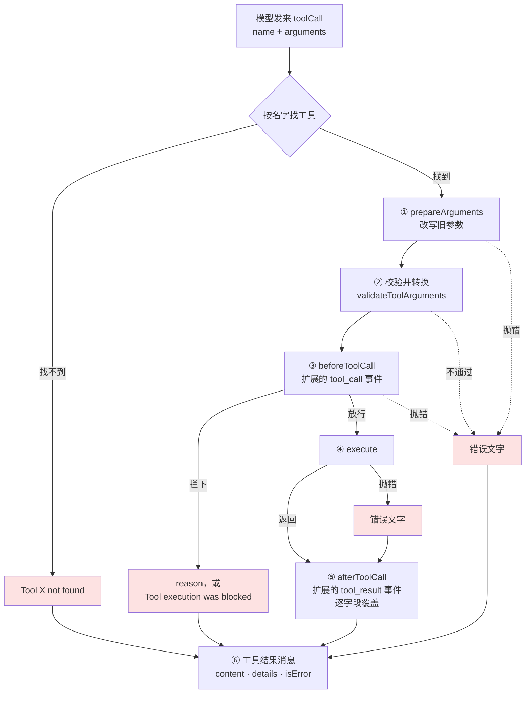
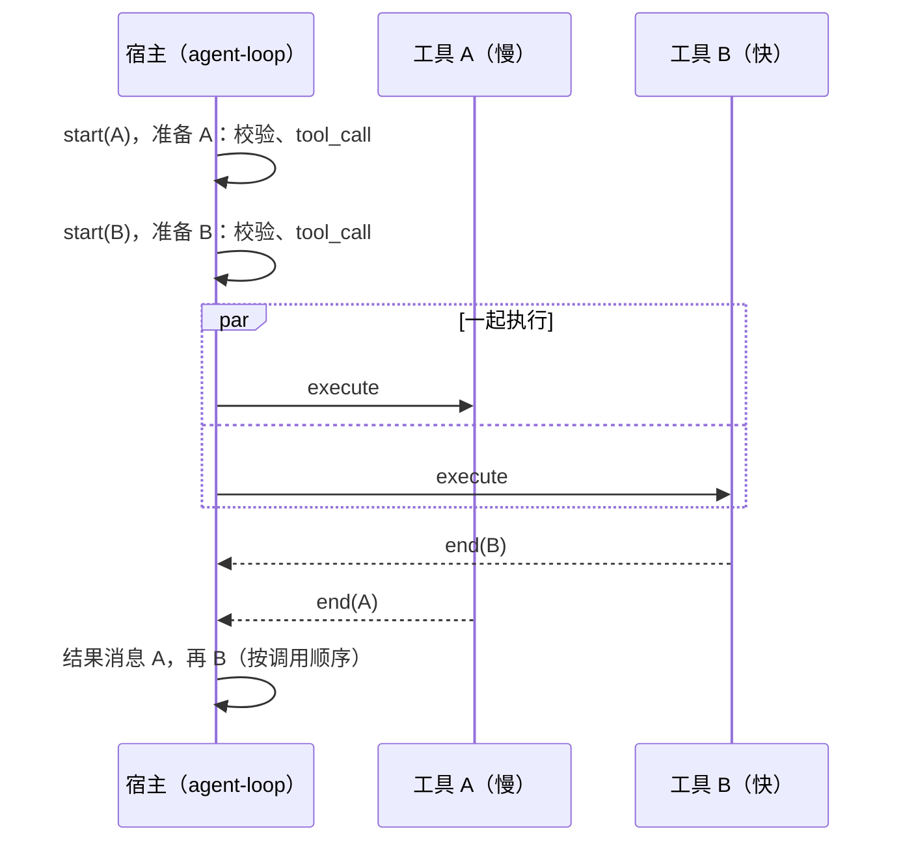
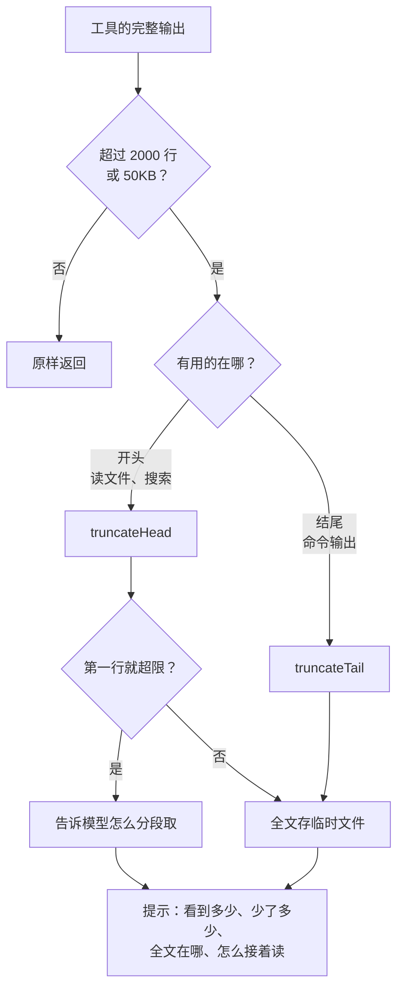
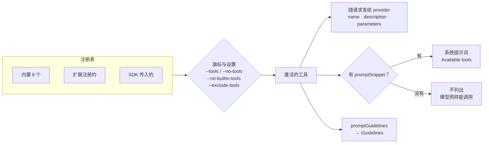

# 第 10 章 写第一个工具

> 基准：pi `b79e4cc8` (v0.84.4)　·　[版本表](../../research/BASELINE.md)　·　[参与指南](../../CONTRIBUTING.md)

**状态**：✅ 已完成

## 本章回答

- 一个 pi 工具由哪些字段组成；哪些给模型看、哪些给宿主用、哪些给界面用
- 一次工具调用从模型发出到变成一条工具结果，要经过哪 6 步；哪几处失败会被标成错误
- 为什么「返回一段 `Error:` 文字」不算失败；工具出错时该抛错还是该返回
- 几个工具调用什么时候并行、什么时候整批串行；改文件的工具要排什么队
- 输出该怎么截断：两条上限、留开头还是留结尾、第一行就超限怎么办、全文放到哪里
- 工具注册了为什么不一定激活，激活了为什么不一定写进系统提示词；`--tools`、`--no-builtin-tools` 这些旗标各管什么
- Step-Code 和 minimax-code 在这几件事上各改了什么

## 素材来源

- `research/pi/05-tools-permissions.md` §5.1（工具清单、默认只开四个）、§5.3（read / grep / find）
- pi 自带的示例扩展：`examples/extensions/` 下注册工具的 20 个文件，重点是 `hello.ts`、`truncated-tool.ts`、`tool-override.ts`
- `docs/extensions.md` 的 Custom Tools 与 Output Truncation 两节
- 第 9 章（`tool_call` / `tool_result` 的合并方式）、第 29 章（工具执行的四个坑）的结论
- 对照：`Step-Code` `7dd66cb`、`minimax-code` `89c930a`
- 配套代码：[`examples/ch10-first-tool/`](../../examples/ch10-first-tool/)

（pi 的路径以 `packages/coding-agent/src/` 为根；`agent/src/` 指 `packages/agent/src/`，`ai/src/` 指 `packages/ai/src/`；`docs/`、`examples/` 指 `packages/coding-agent/` 下的同名目录。Step-Code 的路径同样以 `packages/coding-agent/src/` 为根，`apps/cli/` 开头的按仓库根。minimax-code 的路径按仓库根。）

---

第 8 章讲了扩展怎么加载，第 9 章讲了想做一件事该找哪个 API。本章做扩展里最常见的一件事：给模型加一个工具。

pi 最小的工具示例只有 26 行（`examples/extensions/hello.ts`）：一个名字、一段描述、一个参数 schema、一个 `execute`。照着写，工具能注册，模型也能调用。但这 26 行回答不了下面几个问题，而它们决定了工具在真实会话里好不好用：

- 工具失败了，模型知道吗？
- 输出有 10 MB，会怎样？
- 模型一次调了三个工具，它们是一起跑还是排队？
- 工具注册了，系统提示词里有它吗？

答案都不在 `execute` 里，而在宿主怎样调用 `execute` 的代码里。本章先看一个工具由什么组成（10.1），再沿着一次调用把宿主的代码走一遍（10.2、10.3），然后讲工具自己要负责的截断（10.4）和宿主负责的激活（10.5），最后看两家下游各改了什么（10.6）。10.7 节把这些规则照 pi 的代码写一遍，再用它们跑一个不起 shell 的搜索工具 `find_text`。

宿主执行工具的内部细节（结果为什么按调用顺序落盘、`terminate` 为什么要全票）在第 29 章；本章站在写工具的人这一边，只讲写工具时要知道的部分。不排名次，只回答「谁选了什么、代价是什么」。

先看几个数字：

| 数字 | 是什么 | 出处 |
| --- | --- | --- |
| **8 / 4** | pi 的内置工具 / 默认激活的（read、bash、edit、write） | `core/tools/index.ts:182-193`；`core/sdk.ts:256` |
| **2000 行 / 50KB** | 截断的两条上限，先碰到哪条算哪条 | `core/tools/truncate.ts:11-12` |
| **6** | 一次调用经过的步骤：改写旧参数、校验、拦截、执行、改写结果、生成消息 | `agent/src/agent-loop.ts:598-789` |
| **1** | 让结果标成错误的写法：抛错 | `agent-loop.ts:696-705`；`docs/extensions.md:2015` |
| **20 / 4** | 自带示例里注册了工具的文件 / 其中写了 `promptSnippet` 的 | `examples/extensions/*.ts` |
| **24,000** | Step-Code 自家工具的截断上限，单位是字符，留开头 70%、结尾 30% | Step-Code `step/tool-profile.ts:178`、`:253-256` |
| **64 KiB** | minimax-code 在宿主一侧给工具结果定的预算，超出就转存 | minimax-code `packages/local-runtime-v2/src/service/turn-system/production-composition.ts:523` |

---

## 10.1 一个工具长什么样

### 最小的工具

```ts
// examples/extensions/hello.ts:8-26
const helloTool = defineTool({
	name: "hello",
	label: "Hello",
	description: "A simple greeting tool",
	parameters: Type.Object({
		name: Type.String({ description: "Name to greet" }),
	}),

	async execute(_toolCallId, params, _signal, _onUpdate, _ctx) {
		return {
			content: [{ type: "text", text: `Hello, ${params.name}!` }],
			details: { greeted: params.name },
		};
	},
});

export default function (pi: ExtensionAPI) {
	pi.registerTool(helloTool);
}
```

【代码事实】五样东西必填：`name` 是模型调用时用的名字，`label` 给界面显示，`description` 交给模型，`parameters` 是 TypeBox 写的参数 schema，`execute` 拿到校验过的参数、返回 `content` 和 `details`（`core/extensions/types.ts:451-488`）。

`content` 和 `details` 的分工是写工具时第一件要想清楚的事。【代码事实】文档在示例里写明：`content` 是「Sent to LLM」，`details` 是「For rendering & state」（`docs/extensions.md:1998-1999`）。模型只看得见 `content`；`details` 跟着工具结果存进会话记录，给界面渲染、给扩展从分支重建状态（第 9 章 9.5 节）。所以「找到 3 处，结果被截断了，全文在某个文件里」这类模型需要知道的事，必须写进 `content`；计数、截断信息、全文路径可以在 `details` 里再放一份结构化的。

### 全部字段

| 字段 | 影响谁 | 作用 | 出处 |
| --- | --- | --- | --- |
| `name` | 模型 | 调用名；和内置工具同名会顶掉它（10.5） | `types.ts:452-453` |
| `label` | 界面 | 显示名 | `:454-455` |
| `description` | 模型 | 随工具定义发给 provider | `:456-457` |
| `promptSnippet` | 模型（系统提示词） | `Available tools` 里的一行；不写就不列 | `:458` |
| `promptGuidelines` | 模型（系统提示词） | 工具激活时追加到 `Guidelines` | `:460` |
| `parameters` | 模型、宿主 | 参数 schema；宿主拿它校验 | `:463` |
| `constrainedSampling` | provider | 请 provider 按 schema 约束采样 | `:465` |
| `renderShell` | 界面 | 用标准外框，还是工具自己画 | `:467` |
| `prepareArguments` | 宿主 | 校验之前改写旧参数 | `:469-470` |
| `executionMode` | 宿主 | 写 `"sequential"` 会让整批调用串行 | `:472-479` |
| `execute` | 宿主 | 执行 | `:482-488` |
| `renderCall` / `renderResult` | 界面 | 自定义渲染 | `:491-499` |

*表 10-1 `ToolDefinition` 的字段（`core/extensions/types.ts:451-500`）。「影响谁」一栏说明这个字段最终改变的是模型看到的内容、宿主的行为，还是界面。*

模型看到一个工具的途径有两条：`name`、`description`、`parameters` 作为工具定义随请求发给 provider；`promptSnippet`、`promptGuidelines` 写进系统提示词。第一条只要工具激活就有，第二条要你自己写（10.5）。

### 注册：什么时候都可以

【代码事实】`pi.registerTool` 把定义存进这个扩展的工具表，然后调 `runtime.refreshTools()`（`core/extensions/loader.ts:289-296`）。加载期间的 `refreshTools` 是空函数，注释写着「registerTool() is valid during extension load; refresh is only needed post-bind」（`:201-202`）；绑定之后换成真正的刷新（`core/extensions/runner.ts:336`）。所以工具可以在工厂函数里注册，也可以等到 `session_start` 或某条命令里再注册。两种时机的激活规则不同，10.5 节会讲。

### 判断依据

- 必填字段与可选字段：`core/extensions/types.ts:451-500`；最小示例 `examples/extensions/hello.ts:8-26`
- `content` 给模型、`details` 给渲染与状态：`docs/extensions.md:1998-1999`
- 注册即刷新，加载期间刷新为空操作：`core/extensions/loader.ts:289-296`、`:201-202`

---

## 10.2 一次调用的一生

模型发来一个工具调用，到它变成一条工具结果消息，pi 的宿主要走 6 步：



*图 10-1 一次工具调用经过的 6 步（`agent/src/agent-loop.ts:598-789`）。红色框都是 `isError: true` 的结果。①②③ 任何一步失败，工具都不执行，直接变成一条错误结果；④ 抛错得到的错误结果仍要经过 ⑤。无论走哪条路，模型最后看到的都是一条工具结果。*

### ①② 准备：先改写，再校验

```ts
// agent/src/agent-loop.ts:604-665（节选）
): Promise<PreparedToolCall | ImmediateToolCallOutcome> {
	const tool = currentContext.tools?.find((t) => t.name === toolCall.name);
	if (!tool) {
		return {
			kind: "immediate",
			result: createErrorToolResult(`Tool ${toolCall.name} not found`),
			isError: true,
		};
	}

	try {
		const preparedToolCall = prepareToolCallArguments(tool, toolCall);
		const validatedArgs = validateToolArguments(tool, preparedToolCall);
		if (config.beforeToolCall) {
			const beforeResult = await config.beforeToolCall(
				{
					assistantMessage,
					toolCall,
					args: validatedArgs,
					context: currentContext,
				},
				signal,
			);
			// …
			if (beforeResult?.block) {
				const result = createErrorToolResult(beforeResult.reason || "Tool execution was blocked");
				if (beforeResult.terminate === true) {
					result.terminate = true;
				}
				return {
					kind: "immediate",
					result,
					isError: true,
				};
			}
	// …
	} catch (error) {
		return {
			kind: "immediate",
			result: createErrorToolResult(error instanceof Error ? error.message : String(error)),
			isError: true,
		};
	}
```

【代码事实】`prepareArguments` 在校验之前（`:615`）。它是给旧会话用的：pi 恢复一个旧会话时，存下来的工具调用可能还是旧的参数形状，文档建议用它把旧形状改成新的，公开的 schema 则保持严格（`docs/extensions.md:2031`）。

校验函数 `validateToolArguments` 做的不只是检查（`ai/src/utils/validation.ts:317-350`）：

1. 先 `structuredClone` 一份，不动模型发来的原参数（`:318`）。
2. 可选字段上的 `null` 当作没给，删掉（`:319`）。只删非必填、schema 本身不接受 `null` 的字段（`:258-264`）。
3. 按 schema 转换类型：字符串 `"true"` 转成 `true`，`"7"` 转成 `7`（`:320`）。参数 schema 不是 TypeBox 时另走 `coerceWithJsonSchema`（`:323-335`）。
4. 检查。不通过就抛错，错误消息里带上原始参数：

```ts
// ai/src/utils/validation.ts:337-349
	if (validator.Check(args)) {
		return args;
	}

	const errors =
		validator
			.Errors(args)
			.map((error) => `  - ${formatValidationPath(error)}: ${error.message}`)
			.join("\n") || "Unknown validation error";

	const errorMessage = `Validation failed for tool "${toolCall.name}":\n${errors}\n\nReceived arguments:\n${JSON.stringify(toolCall.arguments, null, 2)}`;

	throw new Error(errorMessage);
```

【代码事实】这两种宽容都有测试：`ai/test/validation.test.ts:64` 测类型转换，`:101` 测「null as omission」。

【推断】这是给模型留的余地。模型常把布尔值写成字符串、把可选参数填成 `null`，宿主替你转掉，`execute` 拿到的是干净的参数。代价是 `execute` 看到的参数和模型发的不完全一样；要排查模型到底发了什么，得看会话记录里的原始 `arguments`。

校验失败的错误消息会原样交给模型，包括 `Received arguments` 那一整段 JSON（`:347`）。模型据此改参数重试——在 pi 里，错误是会话记录里的一条工具结果，而不是一个异常（第 29 章 29.3 节）。

### ③ 拦截：你的 `execute` 可能不会被调用

【代码事实】`beforeToolCall` 由 `AgentSession` 接到扩展的 `tool_call` 事件上（`core/agent-session.ts:487-507`），拿到的是校验、转换之后的参数（`agent-loop.ts:617-626`）。扩展返回 `{ block: true }` 就拦下，没给理由时默认是「Tool execution was blocked」（`:634-644`）；处理函数抛错同样拦下（`agent-session.ts:501-505`，第 9 章 9.4 节说过，这是唯一一个 fail-closed 的事件）。

写工具的人要记住两点：权限扩展可能在前面就把调用拦下了，`execute` 根本不会跑；被拦下的调用不会触发 `tool_result` 事件（第 9 章 9.1 节）。

### ④ 执行：只认抛错

```ts
// agent/src/agent-loop.ts:696-705
		acceptingUpdates = false;
		await Promise.all(updateEvents);
		return { result, isError: false };
	} catch (error) {
		acceptingUpdates = false;
		await Promise.all(updateEvents);
		return {
			result: createErrorToolResult(error instanceof Error ? error.message : String(error)),
			isError: true,
		};
```

【代码事实】`execute` 正常返回，`isError` 就是 `false`（`:698`）；只有抛错才是 `true`（`:699-705`），错误消息变成结果的唯一一段文字，`details` 是空对象（`:758-763`）。文档写得更直接：「Returning a value never sets the error flag regardless of what properties you include in the return object」（`docs/extensions.md:2015`）。

pi 自带的示例里就有一个踩在这条线上的。`tool-override.ts` 用一个同名 `read` 顶掉内置的 `read`，遇到敏感路径时：

```ts
// examples/extensions/tool-override.ts:81-92
			if (isBlockedPath(absolutePath)) {
				await logAccess(absolutePath, false, "matches blocked pattern");
				return {
					content: [
						{
							type: "text",
							text: `Access denied: "${path}" matches a blocked pattern (sensitive file). This tool blocks access to .env files, secrets, credentials, and SSH/AWS/GPG directories.`,
						},
					],
					details: { blocked: true },
				};
			}
```

【代码事实】这里是返回，不是抛错，所以这次调用的 `isError` 是 `false`。【推断】对模型来说，这是一次成功的 `read`，读到的文件内容恰好是一句「Access denied」。多数模型能从文字里看懂；但下游如果按 `isError` 统计失败率、或者在 `tool_result` 里按 `isError` 决定要不要重试，这次拒绝就漏掉了。想让宿主和模型都知道「这是失败」，就抛错：

| 你想表达 | 写法 | `isError` |
| --- | --- | --- |
| 正常结果，包括「没找到」 | 返回 | `false` |
| 参数不对、路径越界、文件不存在、外部命令失败 | 抛 `Error`，消息写给模型看 | `true` |
| 返回值里写 `Error: …` 或 `details.ok = false` | 返回 | `false`（pi 不看这些） |

*表 10-2 三种写法与 `isError`。「没找到」不是失败：`truncated-tool.ts:72-79` 把 ripgrep 的退出码 1 当作正常结果「No matches found」返回，其余失败才抛错（`:80`）。*

### ⑤ 改写结果：逐字段覆盖

```ts
// agent/src/agent-loop.ts:735-748
			if (afterResult) {
				result = {
					...result,
					content: afterResult.content ?? result.content,
					details: afterResult.details ?? result.details,
					usage: afterResult.usage ?? result.usage,
					terminate: afterResult.terminate ?? result.terminate,
				};
				isError = afterResult.isError ?? isError;
			}
		} catch (error) {
			result = createErrorToolResult(error instanceof Error ? error.message : String(error));
			isError = true;
		}
```

【代码事实】`afterToolCall`（扩展的 `tool_result` 事件，`core/agent-session.ts:509-522`）返回的对象逐字段覆盖原结果：给了 `content` 就换 `content`，没给就保留；`isError` 也可以改，成功能改成失败，失败也能改成成功。处理函数抛错，整条结果换成错误（`:745-748`）。

【推断】这一步意味着：工具返回什么，不一定就是模型看到什么。审计、脱敏、输出预算这些扩展都在这里改结果（第 25 章；10.6 节的 minimax-code 也在这里做输出预算）。工具自己要做的，是让 `content` 在没有任何扩展时也是对的。

### ⑥ 生成消息

【代码事实】最后，`createToolResultMessage` 把结果包成一条 `role: "toolResult"` 的消息，`content` 缺省时补成空数组，注释说这是为了照顾不写类型的 JS 扩展（`agent-loop.ts:775-789`）。这条消息进会话记录，下一轮随上下文发给模型。

### 判断依据

- 6 步的顺序：`agent/src/agent-loop.ts:598-666`（准备）、`:668-709`（执行）、`:711-756`（改写）、`:775-789`（消息）
- 校验的转换与 `null` 处理：`ai/src/utils/validation.ts:240-269`、`:317-350`；测试 `ai/test/validation.test.ts:64`、`:101`
- 只认抛错：`agent-loop.ts:696-705`；`docs/extensions.md:2015`；反例 `examples/extensions/tool-override.ts:81-92`
- 拦截钩子与扩展事件的对接：`core/agent-session.ts:487-522`

---

## 10.3 一批调用：并行还是串行

模型一次回复里可以有好几个工具调用。pi 怎样执行这一批，由一个函数决定：

```ts
// agent/src/agent-loop.ts:416-423
	const toolCalls = assistantMessage.content.filter((c) => c.type === "toolCall");
	const hasSequentialToolCall = toolCalls.some(
		(tc) => currentContext.tools?.find((t) => t.name === tc.name)?.executionMode === "sequential",
	);
	if (config.toolExecution === "sequential" || hasSequentialToolCall) {
		return executeToolCallsSequential(currentContext, assistantMessage, toolCalls, config, signal, emit);
	}
	return executeToolCallsParallel(currentContext, assistantMessage, toolCalls, config, signal, emit);
```

【代码事实】默认是并行：`Agent` 构造时 `toolExecution` 缺省为 `"parallel"`（`agent/src/agent.ts:237`）。批次里只要有一个工具声明了 `executionMode: "sequential"`，整批就串行（`:417-421`）。

并行并不是全部并行：



*图 10-2 并行批次的时序（`agent/src/agent-loop.ts:497-546`）。准备一个接一个做，`tool_call` 处理函数不会同时跑两个；执行同时开始；`tool_execution_end` 按完成先后发；工具结果消息按调用顺序发。*

【代码事实】准备阶段在循环里逐个 `await`（`:505`），执行阶段才交给 `Promise.all`（`:538-540`），结果消息按原顺序生成（`:541-546`）。第 29 章 29.1 节讲了这样排的原因。

对写工具的人，这张图意味着三件事。

**一、改文件的工具要排队，但不必让整批串行。** 【代码事实】pi 的 8 个内置工具都没有声明 `executionMode`（`core/tools/` 里出现这个字段的只有 `tool-definition-wrapper.ts:16`、`:44` 两处透传），所以 `edit`、`write` 默认也和别的调用并行。它们靠的是按文件排队的 `withFileMutationQueue`（`core/tools/file-mutation-queue.ts:32`；`edit.ts:336`、`write.ts:210`）。文档要求改文件的自定义工具也用它，否则两个工具会读到同一份旧内容、各算各的更新，后写的覆盖先写的（`docs/extensions.md:1923`）。

**二、`sequential` 是给要独占什么的工具用的。** 【代码事实】自带示例里声明 `sequential` 的只有两个：问用户问题的 `question.ts:50` 和下棋的 `tic-tac-toe.ts:875`。【推断】它们要独占的是用户界面：同一时刻只能有一个对话框。声明了 `sequential`，代价由整批承担——同一批里的 `read` 也得排队。

**三、`terminate` 要全票。** 工具可以在结果里带 `terminate: true`，提示宿主这批结果出来后不必再问模型；只有一批里每个结果都带了，才真的跳过（`agent-loop.ts:580-582`；`docs/extensions.md:2017`）。

### 判断依据

- 分发规则：`agent/src/agent-loop.ts:416-423`；默认并行 `agent/src/agent.ts:237`
- 准备串行、执行并发、消息按序：`agent-loop.ts:497-546`
- 内置工具不声明 `executionMode`，改文件靠队列：`core/tools/tool-definition-wrapper.ts:16`、`:44`；`file-mutation-queue.ts:32`；`docs/extensions.md:1923`
- 示例里的 `sequential`：`examples/extensions/question.ts:50`、`tic-tac-toe.ts:875`

---

## 10.4 截断：宿主不替你做

【代码事实】从 `execute` 返回到生成消息，宿主没有任何一步截断输出（10.2 节的 ④⑤⑥）。文档把这件事交给工具：「**Tools MUST truncate their output**」，内置的上限是 50KB 和 2000 行，「whichever is hit first」（`docs/extensions.md:2170`、`:2175`）。工具忘了截断，10 MB 的输出就原样进上下文。

### 两条上限，只交整行

pi 把截断写成一组可以导出的函数，文件头上写清了规则：

```ts
// core/tools/truncate.ts:1-9
/**
 * Shared truncation utilities for tool outputs.
 *
 * Truncation is based on two independent limits - whichever is hit first wins:
 * - Line limit (default: 2000 lines)
 * - Byte limit (default: 50KB)
 *
 * Never returns partial lines (except bash tail truncation edge case).
 */
```

【代码事实】行数上限 2000、字节上限 50KB（`:11-12`）；数字节时每个换行算 1 个字节（`:126-130`）；只交整行，例外是 `bash` 留结尾时最后一行可能被切开。

留开头还是留结尾，看有用的部分在哪里：

| 函数 | 留哪一段 | pi 里谁用 |
| --- | --- | --- |
| `truncateHead` | 开头 | `read`（`core/tools/read.ts:295`）、`grep`（`grep.ts:340`） |
| `truncateTail` | 结尾 | `bash`（`core/tools/bash-executor.ts:114`、`:134`） |
| `truncateLine` | 单行截到 500 字符 | `grep` 的每条匹配（`truncate.ts:13`、`:268-276`） |

*表 10-3 三个截断函数。读文件、搜索看开头；命令输出的报错和结论通常在最后，看结尾。*

### 第一行就超限

【代码事实】如果第一行本身就超过 50KB，`truncateHead` 什么都不交，返回空内容并把 `firstLineExceedsLimit` 置真（`truncate.ts:103-119`）。空内容对模型没有用，`read` 在这种情况下换成一句告诉模型怎么取的话：

```ts
// core/tools/read.ts:297-300
								if (truncation.firstLineExceedsLimit) {
									// First line alone exceeds the byte limit. Point the model at a bash fallback.
									const firstLineSize = formatSize(Buffer.byteLength(allLines[startLine], "utf-8"));
									outputText = `[Line ${startLineDisplay} is ${firstLineSize}, exceeds ${formatSize(DEFAULT_MAX_BYTES)} limit. Use bash: sed -n '${startLineDisplay}p' ${path} | head -c ${DEFAULT_MAX_BYTES}]`;
```

正常截断时，`read` 也会说下一步怎么读：「Use offset=N to continue」（`:302-311`）。【推断】截断提示要回答三个问题：看到了多少、少了多少、剩下的怎么拿。只写「[truncated]」，模型只知道少了东西，不知道怎么补。

### 全文放哪里

`truncated-tool.ts` 是官方的截断示例。截断时它把全文存进临时文件，在结果末尾告诉模型路径：

```ts
// examples/extensions/truncated-tool.ts:110-128
			if (truncation.truncated) {
				// Save full output to a temp file so LLM can access it if needed
				const tempDir = await mkdtemp(join(tmpdir(), "pi-rg-"));
				const tempFile = join(tempDir, "output.txt");
				await withFileMutationQueue(tempFile, async () => {
					await writeFile(tempFile, output, "utf8");
				});

				details.truncation = truncation;
				details.fullOutputPath = tempFile;

				// Add truncation notice - this helps the LLM understand the output is incomplete
				const truncatedLines = truncation.totalLines - truncation.outputLines;
				const truncatedBytes = truncation.totalBytes - truncation.outputBytes;

				resultText += `\n\n[Output truncated: showing ${truncation.outputLines} of ${truncation.totalLines} lines`;
				resultText += ` (${formatSize(truncation.outputBytes)} of ${formatSize(truncation.totalBytes)}).`;
				resultText += ` ${truncatedLines} lines (${formatSize(truncatedBytes)}) omitted.`;
				resultText += ` Full output saved to: ${tempFile}]`;
```

它还在 description 里写明了上限，注释说这是为了「so the LLM knows」（`:52-53`）。



*图 10-3 写截断时要做的几个决定。上限写进 description，让模型在调用之前就知道。*

### 官方示例里的两个坑

示例是拿来照着写的，所以示例里的问题值得单独说。

**第一个：拼命令行。** `truncated-tool.ts` 把参数拼成一个字符串交给 `execSync`：

```ts
// examples/extensions/truncated-tool.ts:59-71
			// Build the ripgrep command
			const args = ["rg", "--line-number", "--color=never"];
			if (glob) args.push("--glob", glob);
			args.push(pattern);
			args.push(searchPath || ".");

			let output: string;
			try {
				output = execSync(args.join(" "), {
					cwd: ctx.cwd,
					encoding: "utf-8",
					maxBuffer: 100 * 1024 * 1024, // 100MB buffer to capture full output
				});
```

【代码事实】`execSync` 收到一个字符串时，交给 shell 去解析（`:67`）。【推断】模型给的 `pattern` 里只要有空格，命令就断成几截；有 `$(…)` 或反引号，shell 会先执行它。这个工具绕过了 `bash` 工具本该经过的一切（权限扩展拦的是 `bash` 这个名字，不是 `rg`）。照着写时，要么用参数数组（`execFileSync("rg", args)`），要么像 10.7 节那样不起子进程。

**第二个：拿字符数比字节上限。** `tool-override.ts` 自己截断：

```ts
// examples/extensions/tool-override.ts:108-113
				// Basic truncation (50KB limit)
				let text = selectedLines.join("\n");
				const maxBytes = 50 * 1024;
				if (Buffer.byteLength(text, "utf-8") > maxBytes) {
					text = `${text.slice(0, maxBytes)}\n\n[Output truncated at 50KB]`;
				}
```

【代码事实】判断用的是字节数（`:111`），切的却是字符数（`:112`）。【推断】对纯 ASCII 两者一样；对中文，一个字符在 UTF-8 里是 3 个字节，`slice(0, 51200)` 留下的是约 150KB，是上限的三倍。也不是按整行切的。用导出的 `truncateHead` 就不会有这两个问题。

### 判断依据

- 宿主不截断，文档要求工具截断：`agent/src/agent-loop.ts:668-789` 中没有截断；`docs/extensions.md:2170`、`:2175`
- 两条上限、只交整行、第一行超限：`core/tools/truncate.ts:1-13`、`:103-130`
- 谁用 head、谁用 tail：`read.ts:295`、`grep.ts:340`、`bash-executor.ts:114`、`:134`
- 提示怎么接着读：`read.ts:297-311`；全文存临时文件：`examples/extensions/truncated-tool.ts:110-128`
- 两个坑：`truncated-tool.ts:67`；`tool-override.ts:108-113`

---

## 10.5 注册了不等于激活，激活了不等于写进提示词

工具注册之后，还要过两道关：



*图 10-4 从注册到模型看见。同名的工具后进表的覆盖先进的：扩展顶掉内置，SDK 顶掉扩展（`core/agent-session.ts:2726-2730`）。*

### 第一道：激活

```ts
// core/sdk.ts:256-263
	const defaultActiveToolNames: ToolName[] = ["read", "bash", "edit", "write"];
	const configuredDefaultToolNames = settingsManager.getDefaultTools();
	const allowedToolNames = options.tools ?? (options.noTools === "all" ? [] : undefined);
	const excludedToolNames = options.excludeTools;
	const excludedToolNameSet = excludedToolNames ? new Set(excludedToolNames) : undefined;
	const initialActiveToolNames = (
		options.tools ?? (options.noTools ? [] : (configuredDefaultToolNames ?? defaultActiveToolNames))
	).filter((name) => !excludedToolNameSet?.has(name));
```

【代码事实】8 个内置工具默认只激活 4 个；`grep`、`find`、`ls` 注册了但不激活（`core/tools/index.ts:182-193`；`research/pi/05-tools-permissions.md` §5.1）。扩展工具启动时全部激活（`core/agent-session.ts:405-411` 传入 `includeAllExtensionTools: true`；`:2742-2745`）。命令行旗标在 `cli/args.ts:133-146` 解析，`main.ts:528-537` 把 `--no-tools` 映射成 `"all"`、`--no-builtin-tools` 映射成 `"builtin"`：

| 旗标 | 内置工具 | 扩展工具 |
| --- | --- | --- |
| （无） | read、bash、edit、write（设置 `defaultTools` 可以换掉这四个） | 全部激活 |
| `--tools a,b` | 只有列出的 | 只有列出的 |
| `--no-builtin-tools` | 全关 | 全部激活 |
| `--no-tools` | 全关 | 全关 |
| `--exclude-tools x` | 排除 x | 排除 x |

*表 10-4 激活旗标。`--tools` 是允许表，内置、扩展、SDK 工具一视同仁，并且优先于 `--no-tools`（`sdk.ts:258`、`:261`）；`--exclude-tools` 最后生效。*

所以文档推荐的调试方式是 `pi --no-builtin-tools -e ./my-extension.ts`（`docs/extensions.md:2088-2091`）：只留你的工具，看模型怎么用它。

启动之后才注册的工具走另一条规则：

```ts
// core/agent-session.ts:2732-2754
		const nextActiveToolNames = (
			options?.activeToolNames ? [...options.activeToolNames] : [...previousActiveToolNames]
		).filter((name) => isAllowedTool(name));

		if (allowedToolNames) {
			for (const toolName of this._toolRegistry.keys()) {
				if (allowedToolNames.has(toolName)) {
					nextActiveToolNames.push(toolName);
				}
			}
		} else if (options?.includeAllExtensionTools) {
			for (const tool of wrappedExtensionTools) {
				nextActiveToolNames.push(tool.name);
			}
		} else if (!options?.activeToolNames) {
			for (const toolName of this._toolRegistry.keys()) {
				if (!previousRegistryNames.has(toolName)) {
					nextActiveToolNames.push(toolName);
				}
			}
		}

		this.setActiveToolsByName([...new Set(nextActiveToolNames)]);
```

【代码事实】`refreshTools` 不带参数（`agent-session.ts:2605`），走最后一个分支：之前激活的保留，**注册表里新出现的名字**自动激活（`:2746-2751`）。有 `--tools` 时只有允许表里的才激活（`:2736-2741`）。【推断】两个推论：用户用 `--tools read` 限定过工具集，你在 `session_start` 里注册的工具不会出现；你重新注册一个同名工具（比如换了实现），它不算新名字，之前被关掉的就还是关着。

### 第二道：系统提示词

```ts
// core/system-prompt.ts:79-84
	// Build tools list based on selected tools.
	// A tool appears in Available tools only when the caller provides a one-line snippet.
	const tools = selectedTools || ["read", "bash", "edit", "write"];
	const visibleTools = tools.filter((name) => !!toolSnippets?.[name]);
	const toolsList =
		visibleTools.length > 0 ? visibleTools.map((name) => `- ${name}: ${toolSnippets![name]}`).join("\n") : "(none)";
```

【代码事实】`Available tools` 一节只列有 `promptSnippet` 的工具（`:80-82`），一个都没有时写「(none)」。没列出的工具照样激活、照样随请求发给 provider，系统提示词里有一句兜底：「In addition to the tools above, you may have access to other custom tools depending on the project.」（`:133`）。

【代码事实】自带示例里注册工具的 20 个文件，只有 4 个写了 `promptSnippet`（`dynamic-tools.ts:37`、`kimi-deferred-tools.ts:35`、`structured-output.ts:23`、`tic-tac-toe.ts:864`）。【推断】不写也能用，模型靠工具定义里的 `description` 认识它；写了，模型在读系统提示词时就知道有这个选项，和内置工具摆在一起。

`promptGuidelines` 有三条规矩：

1. **只在工具激活时出现**（`docs/extensions.md:1917`）。
2. **平铺，不带工具名。** 所有工具的 guideline 摊在同一个 `Guidelines` 列表里，去重、去空白（`system-prompt.ts:86-95`、`:115-120`）。文档要求每一条都写出工具名，别写「Use this tool when…」，因为模型看不出「this」是谁（`docs/extensions.md:1919`）。
3. **会和宿主自己的 guideline 并列。** 宿主在激活了 `bash`、但 `grep`/`find`/`ls` 都没激活时，会加一条：

```ts
// core/system-prompt.ts:104-113
	// File exploration guidelines
	if ((hasBash || hasPowerShell) && !hasGrep && !hasFind && !hasLs) {
		if (hasBash && hasPowerShell) {
			addGuideline("Use bash or PowerShell for file operations like listing, searching, and finding files");
		} else if (hasPowerShell) {
			addGuideline("Use PowerShell for file operations like listing, searching, and finding files");
		} else {
			addGuideline("Use bash for file operations like ls, rg, find");
		}
	}
```

【推断】默认激活的正是 read、bash、edit、write，所以默认情况下这条一定在。你加了一个搜索工具，系统提示词里仍然写着「用 bash 跑 rg、find」；想让模型改用你的工具，得在 `promptGuidelines` 里明说，比如「Use find_text instead of bash grep when…」。

### 覆盖内置工具：提示词不继承

【代码事实】扩展注册一个和内置工具同名的工具，就顶掉内置的那个（`agent-session.ts:2726-2730`；示例 `tool-override.ts`）。但 `promptSnippet` 和 `promptGuidelines` 不继承，要在覆盖版上重新写（`docs/extensions.md:2097`）；结果形状也必须和内置的一致，包括 `details` 的类型，因为界面和会话逻辑依赖它（`:2099`）。【推断】`tool-override.ts` 就没有写 `promptSnippet`，加载它之后，`read` 从 `Available tools` 里消失了。

### 判断依据

- 默认激活与旗标：`core/sdk.ts:256-263`；`cli/args.ts:133-146`；`main.ts:528-537`
- 启动时扩展工具全部激活：`core/agent-session.ts:405-411`、`:2742-2745`
- 启动后注册：`agent-session.ts:2605`、`:2732-2754`
- 系统提示词规则：`core/system-prompt.ts:79-133`；`docs/extensions.md:1915-1919`
- 覆盖不继承提示词：`docs/extensions.md:2097-2099`

---

## 10.6 下游对照：同一套工具接口，两种改法

### Step-Code：给模型一套自己的工具名

【代码事实】Step-Code 有一份工具配置（tool profile），把 pi 的内置工具换成 9 个自己命名的别名：`list_directory`、`find_files`、`search_files`、`search_web`、`read_file`、`write_file`、`edit_file`、`run_command`、`find_tools`（`step/tool-profile.ts:61-71`）。启用这份配置时，pi 的内置工具整体关掉：

```ts
// Step-Code: main.ts:1228-1236
		const profileTools = options?.toolProfile?.({ cwd, agentDir, settingsManager });
		if (profileTools && profileTools.length > 0) {
			sessionOptions.customTools = [...(sessionOptions.customTools ?? []), ...profileTools];
			// The profile replaces Pi's default built-ins with its model-facing
			// aliases. Explicit --tools/--no-tools flags retain their normal meaning.
			if (!sessionOptions.tools && !sessionOptions.noTools) {
				sessionOptions.noTools = "builtin";
			}
		}
```

【代码事实】这正是 10.5 节的 `--no-builtin-tools`，只是由程序设置，并且用户显式给了 `--tools` / `--no-tools` 时不覆盖（`:1233-1234`）。9 个别名里有 5 个（`list_directory`、`find_files`、`search_files`、`read_file`、`write_file`）用同一个包装函数生成（`step/tool-profile.ts:1250-1345`）：

```ts
// Step-Code: step/tool-profile.ts:415-426（节选）
	return {
		name: step.name,
		label: step.label,
		description: step.description,
		promptSnippet: step.promptSnippet,
		promptGuidelines: step.promptGuidelines,
		parameters: step.parameters,
		constrainedSampling: native.constrainedSampling,
		executionMode: native.executionMode,
		renderShell: native.renderShell,
		execute: (toolCallId, args, signal, onUpdate, ctx) =>
			native.execute(toolCallId, mapArgs(args), signal, onUpdate, ctx),
```

【代码事实】模型看见的名字、描述、提示词、参数 schema 都换成 Step-Code 自己的；`executionMode`、约束采样、外框沿用 pi 的原生工具（`:422-424`）；执行时把参数映射回原生工具的形状（`:425-426`）。这个包装函数的签名里 `promptSnippet` 是必填的（`:407`）。个别别名的 `execute` 再单独换掉，比如 `search_files` 换成 `executeSearchFiles`（`:1307-1316`）。另外 4 个单独写：`edit_file`（`:1363-1373`，同样沿用原生 `edit` 的 `executionMode`）、`run_command`（`:1394`）、`find_tools`（`:1119`），以及显式声明 `executionMode: "parallel"` 的 `search_web`（`step/search-web-tool.ts:153-160`）。9 个都写了 `promptSnippet`（`tool-profile.ts:1122`、`:1255`、`:1278`、`:1301`、`:1323`、`:1345`、`:1367`、`:1398`；`search-web-tool.ts:157`），所以都会进 `Available tools`。

【代码事实】Step-Code 还在 pi 的系统提示词后面追加一段自己的规则，按工具名写好一张表，只取当前激活的工具（`step/system-prompt.ts:21-46`、`:182-189`），例如「Use search_files for regular-expression content searches and prefer it over shell grep.」（`:25`）。【推断】这正是 10.5 节说的那件事——宿主默认那条「用 bash 跑 rg、find」要有人回应——Step-Code 在宿主一侧统一回应了，而不是靠每个工具的 `promptGuidelines`。

截断也换了一套：

```ts
// Step-Code: step/tool-profile.ts:245-257（节选）
	if (text.length <= maxChars) return { text, truncated: false };
	const hint = STEP_TRUNCATION_HINTS[toolName];
	const compatibilitySuffix = toolName === "read_file" ? `\n\n[Output truncated to ${maxChars} characters.]` : "";
	const prefix = `${hint.banner}\n${hint.continuation}\n\n`;
	if (prefix.length + compatibilitySuffix.length >= maxChars) {
		return { text: `${prefix}${compatibilitySuffix}`, truncated: true };
	}
	const remaining = maxChars - prefix.length - compatibilitySuffix.length;
	// Keep both ends: diagnostics and command output often put the useful part at EOF.
	const head = Math.ceil(remaining * 0.7);
	const tail = Math.max(0, remaining - head);
	const body = tail > 0 ? `${text.slice(0, head)}\n...\n${text.slice(-tail)}` : text.slice(0, head);
	return { text: `${prefix}${body}${compatibilitySuffix}`, truncated: true };
```

【代码事实】上限按字符算，默认 24,000，可调范围 200 到 120,000，注释说是「intentionally」比 pi 的字节上限小（`:177-180`）；超出时开头留 70%、结尾留 30%，理由写在注释里：诊断信息和命令输出的有用部分常在末尾（`:253-256`）；开头加一行醒目的警告和接着怎么做（`:191-209`）。【推断】代价是一次调用最多给模型 24,000 个字符，比 pi 的 50KB 小；好处是 70/30 一刀同时照顾了开头和结尾，不用像 pi 那样按工具选 head 还是 tail。

声明 `sequential` 的是要独占什么的工具：任务清单的 `task_create`、`task_update`（`features/step-tasks.ts:303`、`:335`），给子代理发消息的 `agent_send`（`features/step-subagent.ts:623`），问用户的 `clarify_user`（`features/step-questionnaire.ts:570`）。和 pi 示例的取舍一致。

### minimax-code：默认串行，宿主兜底截断

【代码事实】minimax-code 不用 pi 的 `ToolDefinition`，自己定义了一个：`name`、`label?`、`description`、`schema`、`promptGuidelines?`、`prepareArguments?`、`executionMode?`、`operationClassifier?`，**没有 `promptSnippet`**（`packages/agent-core/src/tools/types.ts:66-75`）。它把自己的工具转换成 pi 的 `AgentTool` 交给 pi 的 `Agent` 跑（`packages/agent-core/src/pi-turn-runner/agent.ts:1`）。转换时改了两条规则。

第一条，没声明执行模式的工具一律串行：

```ts
// minimax-code: packages/agent-core/src/pi-turn-runner/tools.ts:140
    executionMode: b.def.executionMode ?? 'sequential',
```

【代码事实】`Agent` 本身仍配成并行（`pi-turn-runner/agent.ts:80`），内置工具逐个标了模式：`read`、`grep`、`glob` 并行，`write`、`edit`、`bash`、`todowrite`、`task` 串行（`packages/agent-core/src/tools/builtin-defs.ts:24`、`:129`、`:156`；`:52`、`:86`、`:110`、`:186`、`:231`）。【推断】这和 pi 正好相反：pi 默认并行，要独占的才声明；minimax-code 默认串行，确认能并行的才声明。新写的工具忘了声明，在 pi 里可能和别的调用撞车，在 minimax-code 里只是慢一点——代价是一个忘了声明的只读工具会把整批拖成串行。

第二条，不只认抛错：

```ts
// minimax-code: packages/agent-core/src/pi-turn-runner/tools.ts:222-229
function toolResultErrorPatch(context: AfterToolCallContext): AfterToolCallResult | undefined {
  if (context.isError || !isRecord(context.result?.details)) {
    return undefined;
  }
  return context.result.details.is_error === true || context.result.details.ok === false
    ? { isError: true }
    : undefined;
}
```

【代码事实】这个补丁排在 `afterToolCall` 的第一位（`tools.ts:104-117`），`details.is_error === true` 或 `details.ok === false` 都会把结果改成 `isError: true`；转换后的结果再把 `is_error` 写回 `details`（`:231-242`）。用的正是 10.2 节 ⑤ 的逐字段覆盖。表 10-2 里第三行那种写法，在 minimax-code 里算失败。

截断则在工具之外又加了一层：

```ts
// minimax-code: packages/agent-extension/src/tool-output-budget.ts:59-77
  const afterToolCall: AfterToolCallHandler = async (toolContext, _signal, turnCtx) => {
    // A receipt is only a safe replacement when this exact turn can recover
    // the archived result. Keep the original ToolResult otherwise.
    if (!toolContext.context.tools?.some((tool) => tool.name === 'read')) return undefined;

    const textBlocks = toolContext.result.content.filter(
      (block): block is Extract<(typeof toolContext.result.content)[number], { type: 'text' }> =>
        block.type === 'text',
    );
    if (textBlocks.length === 0) return undefined;

    // Count every text byte, including host-generated markers.
    const text = textBlocks.map((block) => block.text).join('\n');
    const originalBytes = Buffer.byteLength(text);
    const toolName = toolContext.toolCall.name;
    const limit =
      perTool.get(toolName) ??
      readLiveMaxInlineBytes(options.getMaxInlineBytes, defaultMaxInlineBytes);
    if (originalBytes <= limit) return undefined;
```

【代码事实】这是挂在 `after_tool_call` 上的宿主扩展（`:140-142`）。工具结果的文字超过预算——默认 64 KiB（`packages/config/src/tool-result-compaction-config.ts:20`；`production-composition.ts:523`）——就把全文存成一个产物，结果换成一张「回执」（`:99-117`）；存失败时退回一段 2 KiB 的头尾预览，并注明「artifact persistence failed」（`:118-132`；`production-composition.ts:525`）。注意第一行：当前这一轮没有 `read` 工具时整件事跳过（`:62`），注释的理由是只有这一轮能取回产物时，回执才是安全的替代。【推断】这把 10.4 节「宿主不替你截断」改成了「宿主兜底」。代价是工具作者更容易以为不必自己截断；而没有 `read` 的轮次，兜底也不在。

| 维度 | pi | Step-Code | minimax-code |
| --- | --- | --- | --- |
| 没声明执行模式的工具 | 并行 | 并行（别名沿用原生工具的模式） | 串行（`tools.ts:140`） |
| 怎样标成错误 | 只认抛错 | 同 pi | 抛错，或 `details.is_error` / `details.ok === false` |
| 截断 | 工具自己做：2000 行 / 50KB，整行 | 自家工具：24,000 字符，头 70% 尾 30% | 工具自己做，宿主再兜底：64 KiB，超出转存成回执 |
| 系统提示词 | 有 `promptSnippet` 才列入 | 每个别名都带，另追加按工具名的规则表 | 定义里没有 `promptSnippet` |
| 默认工具 | read、bash、edit、write | 换成 9 个别名，pi 内置全关 | 自己的内置集，缺了 read/write/edit/bash 时补 pi 的（`tools.ts:44-67`） |

*表 10-5 三家在写工具相关的五件事上的选择。*

### 判断依据

- Step-Code 换工具名、关内置：`step/tool-profile.ts:61-71`、`:397-427`；`main.ts:1228-1236`
- Step-Code 的提示词规则表：`step/system-prompt.ts:21-46`、`:182-189`
- Step-Code 截断：`step/tool-profile.ts:177-209`、`:240-258`
- Step-Code 的 `sequential`：`features/step-tasks.ts:303`、`:335`；`step-subagent.ts:623`；`step-questionnaire.ts:570`
- minimax-code 工具定义与默认串行：`packages/agent-core/src/tools/types.ts:66-75`；`pi-turn-runner/tools.ts:140`；`tools/builtin-defs.ts`
- minimax-code 从 `details` 判错：`pi-turn-runner/tools.ts:104-117`、`:222-242`
- minimax-code 输出预算：`packages/agent-extension/src/tool-output-budget.ts:59-142`；`packages/config/src/tool-result-compaction-config.ts:20`

---

## 10.7 你的最小实现

配套代码 [`examples/ch10-first-tool/`](../../examples/ch10-first-tool/) 做两件事：先把本章讲的宿主规则照 pi 的代码写一遍（准备、校验、拦截、执行、改写、并行/串行批次、截断、激活与系统提示词），再用这些规则跑一个完整的工具 `find_text`，并给它包一个 pi 扩展。

`find_text` 按 `truncated-tool.ts` 的结构写，改了四处：不起 shell；路径去掉开头的 `@` 并限制在工作目录里；出错一律抛；截断提示说清看到多少、全文在哪，description 里写明上限。零依赖。

| 规则 | 出处 | 本例 |
| --- | --- | --- |
| 找不到工具：错误结果，不抛 | `agent-loop.ts:605-612` | `src/host.ts:75` |
| `prepareArguments` 先于校验 | `agent-loop.ts:615-616` | `src/host.ts:77-78` |
| 校验：复制、去掉可选字段的 `null`、转换类型、检查；错误格式 | `validation.ts:317-350` | `src/validate.ts:93-100` |
| 拦截拿到校验后的参数；默认理由；`terminate` 带过去 | `agent-loop.ts:617-644` | `src/host.ts:79-81` |
| 只认抛错 | `agent-loop.ts:696-705` | `src/host.ts:93-97` |
| 结果逐字段覆盖；改写钩子抛错换成错误 | `agent-loop.ts:735-748` | `src/host.ts:103-118` |
| 一个 `sequential`，整批串行 | `agent-loop.ts:416-423` | `src/host.ts:166-169` |
| 准备串行、执行并发、消息按调用顺序 | `agent-loop.ts:497-546` | `src/host.ts:152-163` |
| `terminate` 要全票 | `agent-loop.ts:580-582` | `src/host.ts:177` |
| 两条上限、只交整行、第一行超限交空 | `truncate.ts:1-13`、`:103-130` | `src/truncate.ts:49-71` |
| 默认四个内置加全部扩展；`--tools` 是允许表；排除最后生效 | `sdk.ts:256-263`；`agent-session.ts:2736-2745` | `src/activation.ts:105-114` |
| 启动后注册：新名字自动激活 | `agent-session.ts:2746-2751` | `src/activation.ts:116-131` |
| 有 `promptSnippet` 才列入；guideline 去空去重；bash 提示 | `system-prompt.ts:79-120` | `src/activation.ts:89-103` |

*表 10-6 本例照抄的规则。*

### 关键代码

工具定义。description 写明上限，`promptSnippet` 一行，`promptGuidelines` 写出工具名并直接回应 10.5 节那条「Use bash for file operations」：

```ts
// examples/ch10-first-tool/src/find-text.ts:166-181
export function createFindTextTool(fs: Fs): ToolDef {
  return {
    name: TOOL_NAME,
    label: "Find text",
    description:
      `Search files under the working directory line by line and print path:line:text for each match. ` +
      `Skips .git, node_modules and files over ${formatSize(MAX_FILE_BYTES)}. Lines longer than 500 characters are cut. ` +
      `Output is truncated to ${DEFAULT_MAX_LINES} lines or ${formatSize(DEFAULT_MAX_BYTES)}, whichever is hit first; ` +
      `when truncated, the full output is saved to a file whose path is given at the end. Use read on that file to see the rest.`,
    promptSnippet: "Search file contents line by line without a shell (plain text or regex)",
    promptGuidelines: ["Use find_text instead of bash grep when you only need to locate text in files"],
    parameters: PARAMETERS,
    prepareArguments,
    execute: (_id, params, signal, onUpdate, ctx) => findText(fs, ctx, params as Params, signal, onUpdate),
  };
}
```

路径先去掉 `@`，再确认没跑出工作目录。越界是失败，所以抛错：

```ts
// examples/ch10-first-tool/src/find-text.ts:70-77
/** 去掉开头的 @，解析成绝对路径；跑出工作目录就抛错 */
export function resolveInside(cwd: string, input: string | undefined): string {
  const cleaned = (input ?? ".").replace(/^@/, "");
  const target = resolve(cwd, cleaned);
  const rel = relative(cwd, target);
  if (rel === ".." || rel.startsWith(`..${sep}`) || isAbsolute(rel)) throw new Error(`Path is outside the working directory: ${cleaned}`);
  return target;
}
```

执行与截断。「没找到」是正常结果；超限时截断、存全文；全文存不下来不算失败，提示里换成原因：

```ts
// examples/ch10-first-tool/src/find-text.ts:139-155
export async function findText(fs: Fs, ctx: ToolContext, p: Params, signal?: AbortSignal, onUpdate?: OnUpdate): Promise<ToolResult> {
  const test = matcher(p);
  const root = resolveInside(ctx.cwd, p.path);
  const { lines, filesScanned, skippedLarge } = scan(fs, ctx.cwd, root, test, signal, onUpdate);
  const base: Details = { pattern: p.pattern, path: relative(ctx.cwd, root) || ".", matches: lines.length, filesScanned, skippedLarge };
  const skippedNote = skippedLarge > 0 ? `\n\n[${skippedLarge} files larger than ${formatSize(MAX_FILE_BYTES)} were skipped]` : "";
  if (lines.length === 0) return { content: text(`No matches found${skippedNote}`), details: base };
  const full = lines.join("\n");
  const t = truncateHead(full);
  if (!t.truncated) return { content: text(`${full}${skippedNote}`), details: base };
  const saved = trySave(fs, full);
  const notice = saved.path ? truncationNotice(t, saved.path) : `${truncationNotice(t)} [Full output could not be saved: ${saved.error}]`;
  return {
    content: text(`${t.content}\n\n${notice}${skippedNote}`),
    details: { ...base, truncation: t, ...(saved.path ? { fullOutputPath: saved.path } : {}) },
  };
}
```

宿主的执行一步，对应 10.2 节的 ④：

```ts
// examples/ch10-first-tool/src/host.ts:88-101
async function execute(o: BatchOptions, p: Prepared): Promise<Outcome> {
  let accepting = true;
  const onUpdate = (partial: ToolResult): void => {
    if (accepting) o.emit?.({ type: "tool_execution_update", id: p.call.id, name: p.call.name, partial });
  };
  try {
    const result = await p.tool.execute(p.call.id, p.args as never, o.signal, onUpdate, o.ctx ?? { cwd: process.cwd() });
    return { call: p.call, result, isError: false };
  } catch (e) {
    return { call: p.call, result: errorResult(messageOf(e)), isError: true };
  } finally {
    accepting = false;
  }
}
```

并行批次，对应图 10-2：

```ts
// examples/ch10-first-tool/src/host.ts:152-163
async function parallel(o: BatchOptions): Promise<Outcome[]> {
  const pending: (Outcome | (() => Promise<Outcome>))[] = [];
  for (const call of o.calls) {
    o.emit?.({ type: "tool_execution_start", id: call.id, name: call.name });
    const p = await prepare(o, call);
    pending.push(p.kind === "immediate" ? ended(o, p.outcome) : async () => ended(o, await run(o, p)));
    if (o.signal?.aborted) break;
  }
  const done = await Promise.all(pending.map((x) => (typeof x === "function" ? x() : x)));
  for (const x of done) sent(o, x);
  return done;
}
```

扩展只做一件事：把真实磁盘接上去。`stat` 用 `lstat`，不跟随符号链接；全文存进只有自己能读的临时文件：

```ts
// examples/ch10-first-tool/extension/find-text.ts:20-42
export const nodeFs: Fs = {
  stat: (path) => {
    try {
      const st = lstatSync(path);
      return { kind: kindOf(st), size: st.size };
    } catch {
      return undefined;
    }
  },
  list: (dir) => readdirSync(dir, { withFileTypes: true }).map((d) => ({ name: d.name, kind: kindOf(d) })),
  read: (file) => readFileSync(file, "utf8"),
  saveFull: (content) => {
    const file = join(mkdtempSync(join(tmpdir(), "pi-find-text-")), "output.txt");
    writeFileSync(file, content, { encoding: "utf8", mode: 0o600 });
    return file;
  },
};

export function createExtension(fs: Fs): (pi: Pi) => void {
  return (pi) => pi.registerTool(createFindTextTool(fs));
}

export default (pi: Pi): void => createExtension(nodeFs)(pi);
```

### 跑起来

需要 Node ≥ 22.6（用 `--experimental-strip-types` 直接跑 TypeScript），零依赖，不用 `npm i`：

```bash
cd examples/ch10-first-tool
npm start                                           # 五段演示
npm start -- search TODO src -i                     # 用 find_text 搜，走完整的宿主流程
npm start -- search 'createFind\w+\(' src --regex   # 正则
npm start -- tools --ext deploy --ext lint='Lint the project'   # 这组旗标下谁激活、谁进提示词
npm start -- truncate tail src/main.ts --lines 20   # 按 pi 的规则截断一个文件
npm test                                            # 73 个用例
pi -e ./extension/find-text.ts                      # 在 pi 里加载
```

退出码：0 正常（`search` 没找到也是 0）；1 是 `search` 的工具结果为错误；2 是用法或输入有问题；70 是内部错误。扩展只对一个假的 pi 测过（`extension/find-text.test.ts`），没有对真实的 pi 跑过。

`npm start` 的输出（第三段的毫秒数每次略有不同）：

```text
一、一次工具调用的一生（find_text，参数用了旧名 query、ignoreCase 写成字符串）
  事件：tool_execution_start(c1) → tool_execution_end(c1) → tool_result_message(c1)
  isError=false，结果：
    src/a.ts:2:// TODO: rename
    src/b.ts:2:// todo later

二、六次调用：五次失败，模型看到的都是一条工具结果；只有抛错和宿主拦下的才标 isError
  e1 isError=true  Tool grep_text not found
  e2 isError=true  Validation failed for tool "find_text": - pattern: is required
  e3 isError=true  Path is outside the working directory: ../etc
  e4 isError=false Error: file not found
  e5 isError=true  file not found
  e6 isError=true  blocked by policy
  e4 返回了一段错误文字和 details.ok=false，isError 仍是 false：pi 只认抛错

三、批次：默认并行；有一个 sequential，整批串行
  parallel   42ms  tool_execution_start(slow) tool_execution_start(fast) tool_execution_end(fast) tool_execution_end(slow) tool_result_message(slow) tool_result_message(fast)
  sequential 54ms  tool_execution_start(slow) tool_execution_end(slow) tool_result_message(slow) tool_execution_start(fast) tool_execution_end(fast) tool_result_message(fast)

四、截断：两条上限，先碰到哪条算哪条；只交整行
  head 3 行：line 1 | line 2 | line 3  [Output truncated: showing 3 of 10 lines (83B of 280B). 7 lines (197B) omitted.]
  tail 70B ：line 9 | line 10  truncatedBy=bytes
  第一行就超 50B：content="" firstLineExceedsLimit=true

五、激活：哪些工具给模型、哪些写进系统提示词
  （默认）                     激活 read,bash,edit,write,find_text,deploy；未列入提示词 deploy
  --no-builtin-tools       激活 find_text,deploy；未列入提示词 deploy
  --tools read,find_text   激活 read,find_text；未列入提示词 (无)
  --no-tools               激活 (无)；未列入提示词 (无)
  --exclude-tools bash     激活 read,edit,write,find_text,deploy；未列入提示词 deploy
  --tools read 之后再注册 echo：激活 read（允许表里没有它）
  扩展注册同名 read：顶掉 read，未列入提示词 read（promptSnippet 不继承）
```

`tools` 子命令把一组旗标的结果摊开，可以拿来检查自己扩展的工具在用户的配置下会不会出现：

```text
$ npm start -- tools --ext deploy --ext lint='Lint the project'
激活：read(builtin) bash(builtin) edit(builtin) write(builtin) deploy(extension) lint(extension)
Available tools 里列出：read, bash, edit, write, lint
激活但没列出（没有 promptSnippet）：deploy
Guideline：Use bash for file operations like ls, rg, find
```

### 逐段对照本章

- **第一段**对应 10.2 节的 ①②：模型用了旧参数名 `query`，`prepareArguments` 改成 `pattern`；`ignoreCase` 写成了字符串 `"true"`，校验时转成布尔值。四个事件按图 10-1 的顺序发出。
- **第二段**对应 10.2 节的 ③④ 和表 10-2：找不到工具、校验失败、路径越界、拦截，都是 `isError: true`；e4 返回了一段「Error:」文字并在 `details` 里写了 `ok: false`，仍是 `false`。在 minimax-code 里，e4 会被改成 `true`（10.6 节）。
- **第三段**对应图 10-2：并行时两个 start 先后发出，fast 先结束，结果消息仍是 slow 在前；加一个 `sequential` 工具，整批变成一个接一个。
- **第四段**对应 10.4 节：留开头时数行，留结尾时数字节，第一行就超限时交空。
- **第五段**对应 10.5 节的表 10-4、启动后注册、覆盖不继承提示词。

`npm test` 跑 7 个测试文件、73 个用例，覆盖：校验的复制、`null` 处理、类型转换和错误格式；`truncateHead` / `truncateTail` 的两条上限、换行计数、多字节字符边界、第一行超限；宿主的 6 步（找不到工具、改写旧参数先于校验、拦截的默认理由与 `terminate`、拦截钩子拿到转换后的参数、抛错与返回、非 `Error` 的抛出、改写钩子的逐字段覆盖与抛错、执行结束后的进度回调被忽略）；并行时事件和消息的顺序、准备阶段一次只跑一个拦截钩子、`sequential` 让整批串行、`terminate` 全票、中止；激活的每个旗标、`--tools` 优先于 `--no-tools`、同名覆盖、SDK 工具、guideline 去重与 bash 提示、启动后注册的三种情况；`find_text` 的字面匹配（模式里的 `$(whoami)` 按原样找）、正则、`@` 前缀、越界、符号链接、大文件跳过、长行截断、超过 2000 行时存全文、磁盘写满时照样返回、进度、中止；扩展在真实磁盘上不跟随符号链接、临时文件权限是 `0600`；命令行的退出码。

本例没做的：TypeBox（参数 schema 用普通 JSON Schema，走 pi 校验里非 TypeBox 的那条转换路径，`validation.ts:323-335`；Google 系模型的兼容性没有验证，`docs/extensions.md:2029`）；`renderCall` / `renderResult`；改文件的工具和 `withFileMutationQueue`；对真实 pi 的端到端运行。

### 写工具的三个教训

1. **失败要抛出来。** pi 只认抛错：`execute` 抛错，结果才标 `isError: true`。返回一段 `Error: …` 文字、或者在 `details` 里写 `ok: false`，在 pi 里都是一次成功的调用；同一个工具搬到 minimax-code，后者又算失败。抛错在两边的含义一致（10.2、10.6 节；演示第二段）。
2. **截断是工具自己的事。** pi 的宿主不替工具截断。在 description 里写明上限；截断时说清看到多少、少了多少、全文在哪、怎么接着读；全文存不下来，照样返回截断后的结果。别拿字符数去比字节上限，别把参数拼成命令行（10.4 节；演示第四段）。
3. **激活和提示词要分开检查。** 不写 `promptSnippet`，工具不进 `Available tools`，但照样激活、照样能调用；用户给了 `--tools`，你后来注册的工具不会出现；覆盖内置工具时提示词不继承。`promptGuidelines` 里要写出工具名，默认那条「用 bash 跑 rg、find」要你自己回应（10.5 节；演示第五段）。

---

## 本章小结

**一个工具的五个必填字段里，`execute` 只是一个。** `name`、`description`、`parameters` 随请求发给模型；`promptSnippet`、`promptGuidelines` 决定系统提示词里怎么介绍它；`content` 给模型看，`details` 给界面和状态用。模型要知道的事只能写进 `content`。

**一次调用走 6 步，`execute` 在第 4 步。** 改写旧参数、校验并转换、拦截都在它前面，任何一步失败，工具都不执行，模型拿到一条错误结果；改写结果在它后面，扩展可以逐字段换掉你返回的东西。只有抛错才会把结果标成错误，返回值里写什么都不算。

**批次默认并行，但准备是串行的。** 结果消息按调用顺序进会话。改文件的工具排文件队列，不必让整批串行；要独占用户界面的工具才声明 `sequential`，代价由同一批里的其它调用承担。

**截断归工具。** 两条上限先碰到哪条算哪条，只交整行；读文件和搜索留开头，命令输出留结尾；第一行就超限时告诉模型怎么分段取。官方示例里有两个照着写就会带走的坑：拼命令行、拿字符数比字节上限。

**注册、激活、写进提示词是三件事。** 扩展工具启动时全部激活，`--tools` 是允许表，启动后注册的只有新名字会自动激活；没有 `promptSnippet` 的工具不进 `Available tools`，覆盖内置工具时提示词不继承。

**两家下游，两种改法。** Step-Code 给模型换了一套自己的工具名，每个都带提示词，截断改成按字符、留头也留尾，并发规则沿用 pi。minimax-code 改了两条默认值：没声明的工具串行、`details` 里的错误标记也算失败，再在宿主一侧加一层 64 KiB 的输出预算兜底。

扩展的加载与失败语义见第 8 章；`tool_call` / `tool_result` 的合并方式见第 9 章；接自己的 provider 见第 11 章；权限扩展怎样在第 ③ 步拦下工具见第 15、16 章；在 `tool_result` 里做审计和脱敏见第 25 章；宿主执行工具的内部细节见第 29 章。
