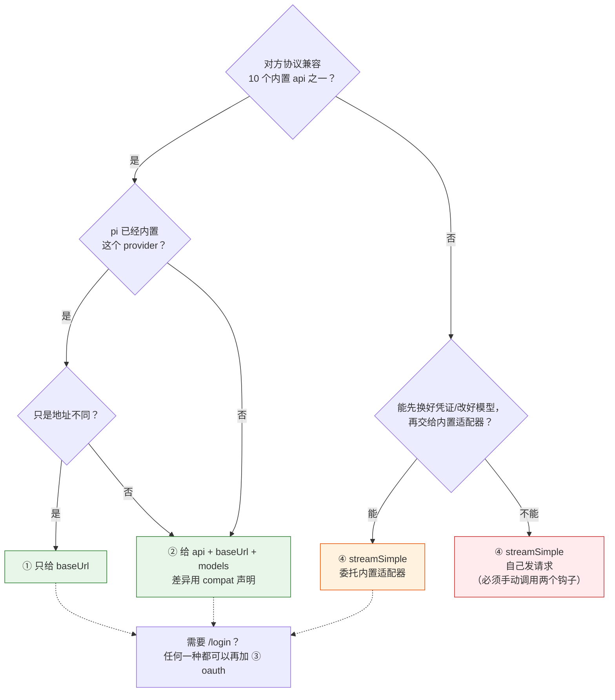
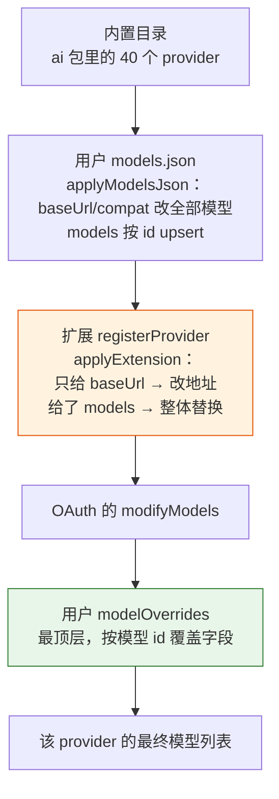
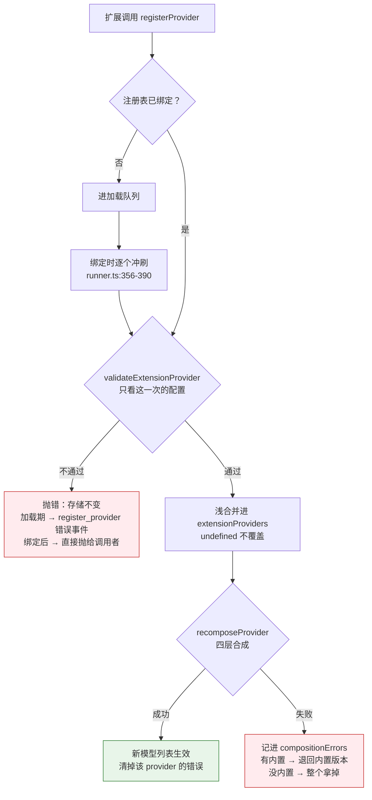
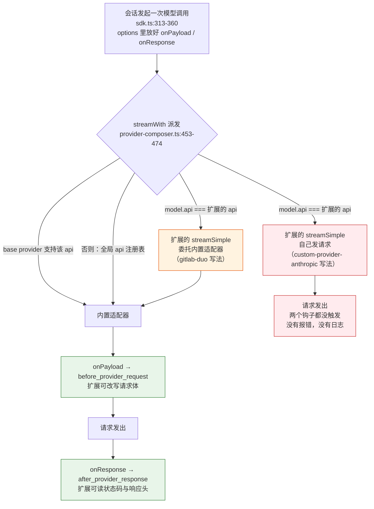

# 第 11 章 接入自家模型

> 基准：pi `b79e4cc8` (v0.84.4)　·　[版本表](../../research/BASELINE.md)　·　[参与指南](../../CONTRIBUTING.md)

**状态**：✅ 已完成

## 本章回答

- `registerProvider` 的四种粒度分别在什么场景用
- 怎么处理流式协议差异（pi 适配了 40 家，踩过的坑在哪）

## 素材来源

- `research/pi/07-extensibility.md` §7.5
- `research/pi/01-product-teardown.md` §1.5
- 对照：`Step-Code` `7dd66cb`
- 配套代码：[`examples/ch11-custom-provider/`](../../examples/ch11-custom-provider/)

---

基于 pi 做产品，第一个要写的扩展往往就是 provider：公司有自己的推理服务，或者走统一网关，或者要接一家 pi 还没收录的模型厂商。pi 为此只开了一个入口 `registerProvider`，一个配置对象能做的事却从「换个地址」一直到「自己实现整套流式协议」。难点不在 API 本身，在它和 pi 已有的三层配置怎么叠，以及自己写流式代码时宿主默认你会遵守、却从不检查的那些约定。

先看几个数字：

| 数字 | 是什么 | 出处 |
| --- | --- | --- |
| **40** | pi 内置的 provider，其中 16 个出自 7 家国内厂商 | `research/pi/01-product-teardown.md` §1.5 |
| **10** | 内置的线协议（`KnownApi`）；`Api` 类型对任意字符串开放 | `ai/src/types.ts:17-29` |
| **26** | 走同一个 `openai-completions` 适配器的内置 provider | §1.5 |
| **25** | 那个适配器为各家差异预留的 compat 字段 | `ai/src/api/openai-completions.ts:1572-1707` |
| **25** | 用来识别「上下文溢出」的错误信息正则 | `ai/src/utils/overflow.ts:37-63` |
| **4** | `registerProvider` 的粒度 | `core/extensions/types.ts:1431-1434` |
| **0** | 宿主对 `streamSimple` 钩子契约的检查 | `core/extensions/types.ts:1516-1521` |

前六个数字讲的是 pi 怎么把几十家的差异收进一个注册表、一个适配器（11.1–11.7）；最后一个数字是本章最需要你记住的坑（11.8）。然后看 Step-Code 怎么改了合成顺序（11.9），最后动手写一个最小实现（11.10）。

本章引用的源码路径，除非特别说明，`core/…` 相对于 `packages/coding-agent/src/`，`ai/src/…` 和 `docs/…` 分别相对于 `packages/` 和 `packages/coding-agent/`。

---

## 11.1 四种粒度

`registerProvider` 的 JSDoc 把它能做的事说成了四句话：

```ts
// core/extensions/types.ts:1431-1434（节选）
 * If `models` is provided: replaces all existing models for this provider.
 * If only `baseUrl` is provided: overrides the URL for existing models.
 * If `oauth` is provided: registers OAuth provider for /login support.
 * If `streamSimple` is provided: registers a custom API stream handler.
```

四种粒度不是四个函数，而是同一个 `ProviderConfig`（`types.ts:1507`）里四组字段，可以组合着给。按「碰了多少东西」从少到多排：

| 粒度 | 你给什么 | 改变了什么 | 典型场景 |
| --- | --- | --- | --- |
| ① 改地址 | 只给 `baseUrl` | 该 provider 现有模型的请求地址 | 公司代理、统一网关、区域节点 |
| ② 换模型 | `models`（外加 `api`、`baseUrl`） | **整份**模型列表 | 自建推理服务，或接一家新厂商 |
| ③ 加登录 | `oauth` | `/login` 里多一种登录方式，不碰模型 | 订阅账号、企业 SSO |
| ④ 换协议 | `api` + `streamSimple` | `api` 对得上的模型改走你的流式实现 | 私有协议，既不兼容 OpenAI 也不兼容 Anthropic |

还有一个重载 `registerProvider(provider: Provider)`（`types.ts:1480`），直接交一个原生 provider 对象，适合已经按 `ai` 包接口写好整套实现的情况。本章讲的是更常用的配置对象写法。

选哪种，可以按下面这张图从上往下问：



*图 11-1 选粒度：越往下碰的东西越多，责任也越多*

图里的颜色就是本章的结论：①② 只改数据，流式代码全是 pi 的；④ 一旦自己发请求，宿主替你做的几件事就得你自己做（11.8）。`api` 是开放字符串（`ai/src/types.ts:29` 的 `KnownApi | (string & {})`），所以 ④ 可以起一个全新的 api 名字，不必冒充内置的。

`models` 里每个模型要写的字段不少：`id`、`name`、`reasoning`、`input`、`cost`、`contextWindow`、`maxTokens` 都是必填（`types.ts:1554` 的 `ProviderModelConfig`），只有 `api` 和 `baseUrl` 可以省略、从 provider 级继承。

### 判断依据

- **四种粒度是同一个配置对象的四组字段**，可以组合；JSDoc 逐条写明了各自的效果（`types.ts:1431-1434`）。【代码事实】
- **`api` 是开放的字符串类型**，自定义协议不需要改 `ai` 包（`ai/src/types.ts:29`）。【代码事实】
- **能用 ①② 解决就不要用 ④**：①② 不碰流式代码，宿主的钩子、重试、溢出识别全部自动生效。【推断】

---

## 11.2 四层合成：扩展给的 `models` 是替换

一个 provider 最后有哪些模型，不是扩展一句话说了算。pi 把四个来源叠起来：



*图 11-2 一个 provider 的模型列表由五步依次叠出来（`core/provider-composer.ts:420-448`）*

用户配置这一层是 **upsert**：同 id 的覆盖，新 id 追加：

```ts
// core/provider-composer.ts:193-204（节选）
const models: Model<Api>[] = baseModels.map((model) => ({
	...model,
	baseUrl: config.oauth === "radius" ? model.baseUrl : (config.baseUrl ?? model.baseUrl),
	compat: mergeCompat(model.compat, config.compat),
}));
for (const definition of config.models ?? []) {
	const existingIndex = models.findIndex((model) => model.id === definition.id);
	const defaults = existingIndex >= 0 ? models[existingIndex] : models[0];
	const model = modelFromJson(providerId, definition, config, defaults);
	if (existingIndex >= 0) models[existingIndex] = model;
	else models.push(model);
}
```

扩展这一层却是 **替换**：

```ts
// core/provider-composer.ts:208-235（节选）
if (!config) return [...models];
if (!config.models) {
	return config.baseUrl ? models.map((model) => ({ ...model, baseUrl: config.baseUrl! })) : [...models];
}
return config.models.map((definition) => {
	const defaults = models.find((model) => model.id === definition.id) ?? models[0];
	const api = definition.api ?? config.api ?? defaults?.api;
	if (!api) {
		throw new Error(
			`Provider ${providerId}, model ${definition.id}: no "api" specified. Set at provider or model level.`,
		);
	}
	const baseUrl = definition.baseUrl ?? config.baseUrl ?? defaults?.baseUrl;
	if (!baseUrl) throw new Error(`Provider ${providerId}: "baseUrl" is required when defining custom models.`);
	return { ...definition, api, provider: providerId, baseUrl, headers: undefined };
});
```

返回的是 `config.models.map(...)`，下层模型只当默认值的来源。这带来两个用户能直接感觉到的后果：

1. **用户在 models.json 里自己加的模型会消失。** 比如用户给 `deepseek` 加了一个指向 `localhost:8000` 的蒸馏模型，某个扩展为 `deepseek` 注册了 `models`，这个本地模型就从列表里没了，没有警告。
2. **只给 `baseUrl` 会连用户的本地模型一起改地址。** 第 ① 种粒度对所有模型 `map`，不区分模型是内置的还是用户加的。

`modelOverrides` 不受影响，它在最顶层（`provider-composer.ts:431` 的注释：「models.json modelOverrides are the topmost user-config layer」）。于是出现一个看起来不太对称的局面：扩展能删掉用户的模型，却改不了用户给某个模型定的上下文窗口。

还有一处校验上的不对称：用户配置走 `modelFromJson`（`:130-166`），会检查 `contextWindow` 之类的数值；扩展这一层只检查 `api` 和 `baseUrl` 有没有，数值靠 `ProviderModelConfig` 的类型约束。扩展是 `.js` 写的话，类型约束也没有。

### 判断依据

- **用户配置按 id upsert，扩展的 `models` 整体替换**（`provider-composer.ts:193-204`、`:217-234`）。【代码事实】
- **`modelOverrides` 在扩展之上**，扩展改不了它（`:431-446`）。【代码事实】
- **扩展层不做数值校验**，只在缺 `api`/`baseUrl` 时抛错。【代码事实】
- **这个顺序表达的是「扩展是产品默认值，用户配置是例外」，但用户追加的模型被当成了默认值的一部分**，后果是扩展作者要替用户考虑模型列表。想追加而不是替换，扩展只能先读当前列表再整体交回去。【推断】

---

## 11.3 注册的生命周期：排队、校验、合并、回退

扩展调用 `registerProvider` 的时候，注册表可能还没就绪。pi 分两个阶段处理：

- **加载期**：调用只进队列（`core/extensions/loader.ts:208` 初始化、`:233` 入队；`:239` 的 `unregisterProvider` 从队列里过滤掉同名项）。
- **绑定时**：`runner.ts:356-390` 把队列逐个冲刷到注册表，每一项单独 try/catch，失败的变成一条 `register_provider` 错误事件，别的照常注册；之后的调用立即生效，不需要 `/reload`（JSDoc 原话：「After that it takes effect immediately」）。

真正落到注册表时，`ModelRuntime.registerProvider` 做四件事：

```ts
// core/model-runtime.ts:742-756（节选）
registerProvider(providerId: string, config: ProviderConfigInput): void {
	// Validate the incoming registration on its own, like the legacy registry:
	// a broken re-registration must throw without touching the stored config.
	validateExtensionProvider(providerId, this.builtins.get(providerId), this.config.getProvider(providerId), config);
	this.nativeExtensionProviders.delete(providerId);
	// Re-registration merges defined values over the previous registration and
	// preserves undefined ones, matching the legacy ModelRegistry contract.
	const previous = this.extensionProviders.get(providerId);
	const effective: ProviderConfigInput = { ...previous };
	for (const [key, value] of Object.entries(config)) {
		if (value !== undefined) (effective as Record<string, unknown>)[key] = value;
	}
	this.extensionProviders.set(providerId, effective);
	this.recomposeProvider(providerId);
```

注意两条注释说的是两件不同的事：**校验只看这一次传进来的配置**，**存储却是和上一次浅合并的**。`validateExtensionProvider`（`provider-composer.ts:407-417`）拿来做默认值的是内置目录和用户配置，不是上一次注册。于是：

- 第一次注册新 provider `p`，写了 `api` 和 `baseUrl`，成功；
- 第二次只想换模型列表，写了 `{ models: [...] }`，校验时找不到 `api`，抛错；
- 存储没动，旧模型还在。在用户看来就是「改了没生效」。

浅合并本身也有一层意思：这次没写的 `oauth`、`apiKey` 沿用上一次，`models` 则整个换掉（数组不合并）。

合成出错又是另一条路。`recomposeProvider` 在每次注册、注销、重载用户配置时都会跑：

```ts
// core/model-runtime.ts:245-267（节选）
if (base && !this.config.getProvider(providerId) && !extension) {
	// No overlays: use the builtin untouched so its auth/login/stream behavior is exact.
	this.models.setProvider(base);
	this.compositionErrors.delete(providerId);
	return;
}
try {
	this.models.setProvider(composeModelProvider(providerId, base, this.config, extension));
	this.compositionErrors.delete(providerId);
} catch (error) {
	this.compositionErrors.set(providerId, error instanceof Error ? error.message : String(error));
	if (base) this.models.setProvider(base);
	else this.models.deleteProvider(providerId);
}
```

把这些串起来：



*图 11-3 一次注册可能走的三条路*

三条出错路径的处置并不一样，值得列清楚：

| 出错在哪 | 谁先发现 | 结果 | 用户看到什么 |
| --- | --- | --- | --- |
| 加载期队列里的一项校验不过 | 冲刷循环 | 这一项不注册，其余照常 | 一条扩展错误 |
| 绑定后重新注册校验不过 | 调用者 | 抛错，旧配置保留 | 取决于扩展有没有 catch |
| 用户改坏了 models.json | `recomposeProvider` | 退回内置版本，或该 provider 消失 | `getError()` 里的一行 `Provider "x": …` |

【推断】第三条最容易被忽略：一个只存在于 models.json 的 provider（没有内置版本），配置写错之后是**整个消失**，而不是带着错误留在列表里。你的产品如果有模型选择界面，应该把 `compositionErrors` 显示出来，否则用户只会发现「我的模型不见了」。

### 判断依据

- **加载期注册排队，冲刷时 fail-open**，一个 provider 配错不影响别的（`loader.ts:208-239`、`runner.ts:356-390`）。【代码事实】
- **校验只看这一次的配置，存储是浅合并**，两者在 `model-runtime.ts:743-753` 的注释里各写了一句。【代码事实】
- **合成失败退回内置或删除**，错误记在 `compositionErrors`（`model-runtime.ts:259-266`）。【代码事实】
- **重新注册时把 `api` 和 `baseUrl` 都再写一遍**，可以绕开「校验不看上一次」这个坑。【推断】

---

## 11.4 认证：每次请求都重新解析

provider 的 `apiKey` 不是一个值，而是一个配置值模板，和 models.json 用的是同一套语法（`docs/models.md:151-162`）：

| 写法 | 含义 |
| --- | --- |
| `$VAR` / `${VAR}` | 读环境变量 |
| `!command` | 执行 shell 命令，取标准输出 |
| `$$`、`$!` | 转义成字面的 `$`、`!` |
| 其他 | 字面值 |

解析发生在 `composeApiKeyAuth` 的 `resolve` 里：

```ts
// core/provider-composer.ts:340-356（节选）
resolve: async (input) => {
	let result: AuthResult | undefined;
	if (input.credential) {
		result = inherited
			? await inherited.resolve(input)
			: input.credential.key
				? { auth: { apiKey: input.credential.key }, env: input.credential.env, source: "stored credential" }
				: undefined;
	} else if (rawKey !== undefined) {
		const env = await configContextEnv([rawKey], input.ctx);
		const key = resolveConfigValueOrThrow(rawKey, `API key for provider "${providerId}"`, env);
		// …
```

两个细节：

1. **已存的凭证优先。** 用户 `/login` 过、`auth.json` 里有这个 provider 的凭证，扩展写的 `apiKey` 就不会被用到。
2. **每次请求都重新解析，而且不缓存。** `prepareRequest`（`model-runtime.ts:573-600`）每次发请求都调 `getAuth`；`resolveConfigValueOrThrow` 走的是不带缓存的那条路（`resolve-config-value.ts:221-250`），`!op read …` 这种命令每个请求都会重跑一遍，最多等 10 秒（`:185-196`）。

第二点是有意的，文档写得很直白：

> For `models.json`, shell commands are resolved at request time. pi intentionally does not apply built-in TTL, stale reuse, or recovery logic for arbitrary commands. Different commands need different caching and failure strategies, and pi cannot infer the right one.
>
> —— `docs/models.md:172`

代价落在两处：每个请求多一次进程启动的延迟；命令失败时整次请求失败，没有「用上一次的值顶一下」。如果你的命令是从密码管理器取一个几小时才变的 token，缓存要你自己做——比如让命令本身读一个带过期时间的本地缓存文件。

错误信息也值得看一眼：`resolveConfigValueOrThrow` 报错时只点名「哪个环境变量没设置」「哪条命令没有输出」，不带解析出来的值（`:229-250`）。这条规矩你自己的 provider 代码也该守。

最后是 OAuth。只给 `oauth`、不给 `apiKey` 的 provider，登录方式里只有 OAuth，pi 不会替它凭空造一个 API key 入口（`provider-composer.ts:310` 的注释：「OAuth-only providers get no fabricated API-key login method.」）。内置 provider 再加 `oauth`，就两种都有。

### 判断依据

- **`apiKey` 在每次请求时解析**（`docs/custom-provider.md:284`：「The key is resolved for each request.」），命令不缓存是书面选择（`docs/models.md:172`）。【代码事实】
- **已存凭证优先于配置的 key**（`provider-composer.ts:343-347`）。【代码事实】
- **只有 OAuth 的 provider 没有 API key 入口**（`:310`）。【代码事实】
- **命令型 key 的缓存与降级要你自己设计**；pi 不做，是因为它不知道你的命令多久变一次、失败了能不能用旧值。【推断】

---

## 11.5 一个适配器服务 26 家：compat 靠猜

40 个内置 provider 里有 26 个走 `openai-completions`。它们都说自己「兼容 OpenAI」，细节却各不相同：最大 token 数叫 `max_tokens` 还是 `max_completion_tokens`，系统消息用 `developer` 还是 `system` 角色，接不接受 `store` 字段，思考内容怎么开、放在哪个字段。pi 用一个 `compat` 对象（25 个字段）描述这些差异，先猜，再让显式配置逐字段覆盖。

猜的依据是 provider id 和 URL：

```ts
// ai/src/api/openai-completions.ts:1572-1589（节选）
function detectCompat(model: Model<"openai-completions">): ResolvedOpenAICompletionsCompat {
	const provider = model.provider;
	const baseUrl = model.baseUrl;

	const isZai =
		provider === "zai" ||
		provider === "zai-coding-cn" ||
		baseUrl.includes("api.z.ai") ||
		baseUrl.includes("open.bigmodel.cn");
	// …
	const isMoonshot = provider === "moonshotai" || provider === "moonshotai-cn" || baseUrl.includes("api.moonshot.");
	const isOpenRouter = provider === "openrouter" || baseUrl.includes("openrouter.ai");
	// …
	const isDeepSeek = provider === "deepseek" || baseUrl.toLowerCase().includes("deepseek.com");
```

之后 `getCompat`（`:1673-1707`）把 `model.compat` 里给了的字段一个个压上去（`??` 合并，`undefined` 不冲掉猜测）。

这套办法覆盖了常见用法：直接用官方地址，或者保留 provider id、只改 `baseUrl`，都能猜中。猜不中的情况只有一种，**而这恰恰是接入自家模型时最常见的一种**：你起了一个新的 provider id，比如 `corp-llm`，地址是公司网关 `https://llm.corp.example/deepseek`，背后其实是 DeepSeek。id 和 URL 都不含任何线索，`detectCompat` 只能按标准 OpenAI 处理，于是请求带着 `max_completion_tokens` 和 `store: false` 发出去，思考格式也按 OpenAI 的来。对方可能直接 400，也可能悄悄忽略你的 token 上限。

解决办法是显式写 `compat`：

```json
{
  "providers": {
    "corp-llm": {
      "api": "openai-completions",
      "baseUrl": "https://llm.corp.example/deepseek",
      "compat": { "maxTokensField": "max_tokens", "supportsStore": false, "supportsDeveloperRole": false, "thinkingFormat": "deepseek" },
      "models": [ … ]
    }
  }
}
```

### 判断依据

- **compat 先按 provider id 和 URL 猜，再由显式配置逐字段覆盖**（`openai-completions.ts:1572-1707`）。【代码事实】
- **新 id + 自定义网关域名 = 猜不中**；保留原 id 只改地址仍能按 id 猜中。【代码事实】
- **接自家网关时把 compat 写全**，不要依赖猜测。猜测是给「直接用官方服务」的用户准备的便利，不是给集成方的契约。【推断】

---

## 11.6 流式差异：同一个协议，四种方言

compat 管的是**发出去**的请求。**收回来**的流也有方言，这部分 pi 没有做成配置，而是直接写进了适配器的解析逻辑。读这几段代码，等于读一份「OpenAI 兼容接口的已知差异清单」。

**推理内容放在哪个字段。** 有的叫 `reasoning_content`（llama.cpp、DeepSeek），有的叫 `reasoning`，有的叫 `reasoning_text`；还有的两个字段都发、内容一样：

```ts
// ai/src/api/openai-completions.ts:592-605（节选）
// Some endpoints return reasoning in reasoning_content (llama.cpp),
// or reasoning (other openai compatible endpoints)
// Use the first non-empty reasoning field to avoid duplication
// (e.g., chutes.ai returns both reasoning_content and reasoning with same content)
const reasoningFields = ["reasoning_content", "reasoning", "reasoning_text"];
const deltaFields = choice.delta as Record<string, unknown>;
let foundReasoningField: string | null = null;
for (const field of reasoningFields) {
	const value = deltaFields[field];
	if (typeof value === "string" && value.length > 0) {
		foundReasoningField = field;
		break;
	}
}
```

只取第一个非空的，避免同一段思考被显示两遍。

**用量放在哪里。** 标准位置是 `chunk.usage`，Moonshot 放在 `choice.usage`：

```ts
// ai/src/api/openai-completions.ts:560-564
// Fallback: some providers (e.g., Moonshot) return usage
// in choice.usage instead of the standard chunk.usage
if (!chunk.usage && (choice as any).usage) {
	output.usage = parseChunkUsage((choice as any).usage, model);
}
```

用量拿不到，第 28 章讲的上下文预算和自动压缩触发都会失准。

**工具调用怎么拼。** 一次工具调用的参数被拆在许多个 chunk 里，后续 chunk 有的只带 `index`，有的只带 `id`，并行调用时两个调用的增量会交错到达。`ensureToolCallBlock`（`:485-542`）按 index 或 id 找回同一个块，把参数字符串拼起来；还没拼完的 JSON 用补全解析，界面上可以边收边显示参数。

**流怎么结束。** 正常情况下最后一个 chunk 带 `finish_reason`。有的服务不发：

```ts
// ai/src/api/openai-completions.ts:680-688（节选）
if (!hasFinishReason && !compat.supportsFinishReason) {
	output.stopReason = output.content.some((block) => block.type === "toolCall") ? "toolUse" : "stop";
}
// …
if ((compat.supportsFinishReason && !hasFinishReason) || output.stopReason === "pending") {
	throw new Error("Stream ended without finish_reason");
}
```

默认把「没有 `finish_reason`」当成流被截断，报错；声明了 `supportsFinishReason: false` 的才按有没有工具调用推断。这是一个 fail-closed 的默认值：宁可报错，也不把半截回答当成完整的。

| 方言 | pi 怎么处理 | 落在哪 |
| --- | --- | --- |
| 推理字段三种名字 | 取第一个非空的 | `:592-607` |
| `choice.usage` | `chunk.usage` 缺失时兜底 | `:560-564` |
| 工具调用增量只带 index 或 id | 两种都能找回同一个块 | `:485-542` |
| 不发 `finish_reason` | 默认报错；compat 声明后推断 | `:680-688` |

### 判断依据

- **这四类差异都写在适配器里**，不需要配置；只有 `finish_reason` 一项受 compat 控制。【代码事实】
- **缺 `finish_reason` 默认报错**，是 fail-closed（`:687`）。【代码事实】
- **你走 ①② 粒度，这些处理全部白送**；走 ④ 自己写流，这张表就是你要重做的清单。【推断】

---

## 11.7 溢出识别：认不出来就不会自动压缩

第 28 章会讲 pi 的自动压缩：上下文超了，就把旧消息压成摘要，再重试一次。前提是 pi 得**知道**这次失败是因为上下文超了。各家的报错信息五花八门，pi 用 25 条正则去认（`ai/src/utils/overflow.ts:37-63`），涵盖 Anthropic、Bedrock、OpenAI、Gemini、OpenRouter、Groq、llama.cpp、Ollama，以及 MiniMax（「context window exceeds limit」）、Kimi（「exceeded model token limit」）、DashScope、z.ai 等国内服务，外加几条通用兜底。

还有些服务根本不报错：

```ts
// ai/src/utils/overflow.ts:134-163（节选）
// Case 1: Check error message patterns
if (message.stopReason === "error" && message.errorMessage) {
	const isNonOverflow = NON_OVERFLOW_PATTERNS.some((p) => p.test(message.errorMessage!));
	if (!isNonOverflow && OVERFLOW_PATTERNS.some((p) => p.test(message.errorMessage!))) {
		return true;
	}
}
// Case 2: Silent overflow (z.ai style) - successful but usage exceeds context
if (contextWindow && message.stopReason === "stop") {
	const inputTokens = message.usage.input + message.usage.cacheRead;
	if (inputTokens > contextWindow) return true;
}
// Case 3: Length-stop overflow (Xiaomi MiMo style) - server truncates oversized input
if (contextWindow && message.stopReason === "length" && message.usage.output === 0) {
	const inputTokens = message.usage.input + message.usage.cacheRead;
	if (inputTokens >= contextWindow * 0.99) return true;
}
```

第一种情况先排除限流（`NON_OVERFLOW_PATTERNS`，`:74-78`），免得把 429 当成溢出去压缩。后两种靠 usage 推断，所以上一节的 `choice.usage` 兜底不是小事。

你的自家模型的报错信息多半不在这 25 条里。认不出来的后果是：用户看到一条红色错误，会话停住，自动压缩没有触发。官方给的办法是在注册 provider 的同一个扩展里，用 `message_end` 把错误信息改写成 pi 认得的样子：

```ts
// docs/custom-provider.md:579-606（节选）
pi.on("message_end", (event, ctx) => {
  const message = event.message;
  if (message.role !== "assistant") return;
  if (message.stopReason !== "error") return;
  if (message.provider !== "my-provider" && ctx.model?.provider !== "my-provider") return;

  const errorMessage = message.errorMessage ?? "";
  if (errorMessage.includes("context_length_exceeded")) return;
  if (!MY_PROVIDER_OVERFLOW_PATTERN.test(errorMessage)) return;

  return { message: { ...message, errorMessage: `context_length_exceeded: ${errorMessage}` } };
});
```

`message_end` 在自动压缩检查之前运行（`:608`），改写后的信息就是 pi 检查的那一条。这段代码里的三个 `return` 各有用处：只管自己的 provider，不碰别家；已经改写过就不再改，保证幂等；不匹配自家的溢出特征就不动，避免把限流也改成溢出。

### 判断依据

- **自动压缩依赖错误信息匹配**，25 条正则加两条静默溢出的 usage 判断（`overflow.ts:37-63`、`:134-166`）。【代码事实】
- **限流类错误先被排除**（`:74-78`）。【代码事实】
- **接新 provider 要顺手处理溢出识别**，官方方案是 `message_end` 改写（`docs/custom-provider.md:567-620`）。【代码事实】
- **这一步最容易漏**：功能测试通常用短对话，碰不到上下文上限，问题要到用户长会话时才暴露。【推断】

---

## 11.8 `streamSimple` 的钩子契约：只写在注释里

前面几节的处理（compat、四种方言、重试、溢出识别依赖的 usage）都在内置适配器里。第 ④ 种粒度把适配器换成你的代码，这些就得自己做。其中有一件事，不做也**不会有任何报错**。

### 宿主在请求路径上挂了什么

`sdk.ts` 创建会话时，给每次模型调用都塞了两个回调：

- `onPayload`（`core/sdk.ts:343-349`）：请求发出之前调用，触发扩展的 `before_provider_request` 事件。扩展可以在这里看、改、替换整个请求体，比如脱敏、加审计字段、按策略改参数。
- `onResponse`（`:350-360`）：拿到响应、读响应体之前调用，触发 `after_provider_response`，扩展能看到状态码和响应头，比如记录限流余量、请求 id。

这两个回调由谁调用？看内置适配器：

```ts
// ai/src/api/openai-completions.ts:351-369（节选）
let params = buildParams(model, context, options, compat, cacheRetention, grammarToolInputProperties);
const nextParams = await options?.onPayload?.(params, model);
if (nextParams !== undefined) {
	params = nextParams as OpenAI.Chat.Completions.ChatCompletionCreateParamsStreaming;
}
// …
const { data: openaiStream, response } = await retryProviderRequest(
	() => client.chat.completions.create(params, requestOptions).withResponse(),
	{ /* … */ },
);
await options?.onResponse?.({ status: response.status, headers: headersToRecord(response.headers) }, model);
stream.push({ type: "start", partial: output });
```

由**适配器自己**调用。宿主只是把回调放进 `options`，调不调、什么时候调，全看适配器。内置的 10 个适配器都调了 `onPayload`；`onResponse` 却只有 8 个调了——`google-generative-ai.ts` 和 `google-vertex.ts` 里找不到它，挂在 `after_provider_response` 上的扩展对这两条线路什么也看不到。连内置实现都没有完全做到，你的 `streamSimple` 呢？

### 契约在哪里

```ts
// core/extensions/types.ts:1516-1522
/**
 * Optional streamSimple handler for custom APIs.
 * Implementations must invoke `options.onPayload` before sending the provider request and use any
 * returned replacement payload. They must invoke `options.onResponse` after receiving the response
 * and before consuming its body, matching built-in providers.
 */
streamSimple?: (model: Model<Api>, context: Context, options?: SimpleStreamOptions) => AssistantMessageEventStream;
```

就这一段注释。类型签名里 `options` 是可选参数，两个回调也是可选字段；运行时没有任何地方检查它们有没有被调用。再看两份最可能被拿来照抄的材料：

- **官方文档的模板**：`docs/custom-provider.md:395-409` 一节讲 Custom Streaming API，给的「Stream Pattern」模板在发请求的位置只写了一行 `// Make API request and process response...`（`:453`），通篇没有提 `onPayload` 和 `onResponse`。
- **官方示例扩展**：`examples/extensions/custom-provider-anthropic/index.ts` 的 `streamCustomAnthropic`（`:335-569`）直接用 SDK 发请求（`:446` 的 `client.messages.stream({ ...params }, { signal })`），整个文件里找不到这两个回调。

另一个示例 `custom-provider-gitlab-duo` 则是另一种写法：`streamGitLabDuo`（`:307-376`）只负责换凭证——拿 GitLab token 换一个直连 token，拼好请求头——然后把 `{ ...options, apiKey, headers }`（`:325`）原样交给内置的 `anthropicMessagesApi().streamSimple`（`:329`）或 `openAIResponsesApi().streamSimple`（`:340`）。钩子由内置适配器负责调用，自定义部分想漏也漏不掉。



*图 11-4 三级派发与两个钩子点：钩子长在适配器里，绕开适配器就绕开了钩子*

派发本身分三级（`provider-composer.ts:453-474`）：扩展注册了 `streamSimple` 且 `model.api` 对得上，就用扩展的；否则 base provider 支持这个 api 就用 base 的；再否则去全局 api 注册表找，找不到抛 `No API provider registered for api`。整段包在 `lazyStream` 里，派发阶段的异常也变成流里的 error 事件，调用方只需要处理一种失败。

### 后果有多严重

取决于用户装了什么扩展。如果没有任何扩展订阅 `before_provider_request`，漏掉钩子没有可见的影响——这正是它难以被发现的原因。可一旦用户装了一个「发送前脱敏」的扩展，比如把代码里的 `password=…` 替换掉再发出去，那么：

- 走内置 provider 的请求被脱敏了；
- 走你的自定义 `streamSimple` 的请求原样发出；
- 用户以为自己受保护，扩展以为自己生效了，你的 provider 一无所知。

第 8 章讲过 `before_provider_request` 是 fail-open 的通知类事件；这里是更进一步的情况：事件**根本没有被触发**，连 fail-open 的机会都没有。

### 宿主能不能补上

能补的只有「发现」。包一层 `streamSimple`，把 `options` 里的两个回调换成会做记号的版本，等第一个非错误事件出来时检查记号——本章配套代码的 `contract.ts` 就是这么做的。但它**拦不住**：等包装器看到第一个事件，请求早已发出去了。真要保证钩子生效，得让宿主掌握「发请求」这一步：要么规定自定义流只能委托内置适配器，要么由宿主提供 transport，扩展只负责编码和解码。pi 两样都没做。

### 判断依据

- **钩子契约只存在于注释**（`types.ts:1516-1521`），类型和运行时都不检查。【代码事实】
- **内置适配器也不完全守约**：10 个都调用 `onPayload`，两个 Google 适配器不调用 `onResponse`。【代码事实】
- **官方文档的模板和 `custom-provider-anthropic` 示例都没有调用这两个钩子**（`docs/custom-provider.md:453`；该示例全文件无 `onPayload`/`onResponse`）。【代码事实】
- **`custom-provider-gitlab-duo` 委托内置适配器**，钩子随 `options` 传下去，不会漏（`:325-340`）。【代码事实】
- **漏掉钩子的影响只在用户装了相关扩展时出现**，所以功能测试很难发现。【推断】
- **自己写 `streamSimple` 时，优先写成「换凭证 + 委托」**；非自己发请求不可，就把两处钩子调用当成必写的代码，并加一条测试。【推断】

---

## 11.9 下游对照：Step-Code 把合成顺序倒了过来

阶跃的开源版 Step-Code 把阶跃星辰的模型做成一个内置扩展 `step-provider`。它碰到的正是 11.2 节的问题：产品默认的模型列表由扩展给出，按 pi 的规则会整体替换；可旧版 StepCode 的用户在 models.json 里留着自定义模型，升级后不能丢。

它的办法是给 `ProviderConfig` 加了两个字段：

```ts
// Step-Code: packages/coding-agent/src/core/extensions/types.ts:1582-1585
	/** Re-apply models.json after product default models. */
	mergeModelsJson?: boolean;
	/** Normalize the fully composed model list before it is exposed to callers. */
	normalizeModels?: (models: Model<Api>[]) => Model<Api>[];
```

合成时，打开 `mergeModelsJson` 的扩展先落地，models.json **再压上去**，最后跑一遍 `normalizeModels`：

```ts
// Step-Code: packages/coding-agent/src/core/provider-composer.ts:241-252
/** Compose extension models and an optional user models.json overlay. */
function applyComposedModels(
	providerId: string,
	baseModels: readonly Model<Api>[],
	config: ModelsJsonProvider | undefined,
	extension: ProviderConfigInput | undefined,
): Model<Api>[] {
	const extensionModels = applyExtension(providerId, baseModels, extension);
	const composed =
		extension?.mergeModelsJson && config ? applyModelsJson(providerId, extensionModels, config) : extensionModels;
	return extension?.normalizeModels ? extension.normalizeModels(composed) : composed;
}
```

`step-provider` 两个都打开了（`packages/coding-agent/src/features/step-provider/index.ts:37-43`）。注释写得清楚：内置目录只是离线、登录前的基线，要保住从旧版迁移来的、以及用户后来加的模型；models.json 归用户所有，可能比 provider 默认值活得久，所以最后要规范化一遍，「as a last line of defense」。

规范化做的事只有一行：

```ts
// Step-Code: packages/providers/src/step-provider/index.ts:290-297
/**
 * Every Step model uses the active profile's OpenAI endpoint and dialect.
 * Restore both so a stale models.json overlay (e.g. an old proxy host or the
 * legacy Anthropic dialect) cannot misroute a Step model.
 */
export function normalizeStepModel(model: Model<Api>, openaiBaseUrl: string): Model<Api> {
	return { ...model, api: STEP_MODEL_API, baseUrl: openaiBaseUrl };
}
```

`STEP_MODEL_API` 是 `"openai-completions"`（`:92`），`openaiBaseUrl` 由当前 profile 推出来（`stepOpenAiBaseUrl`，`:618-620`）。注意它**不分模型 id**：只要挂在 `step` 这个 provider 下，不管是内置模型还是用户在 models.json 里加的，`api` 和 `baseUrl` 都会被改成官方值。CLI 的启动配置里也明说不再改写用户文件，靠这个钩子在每次启动时兜底（`apps/cli/src/bootstrap/config.ts:30-35`）。

【推断】按「谁选了什么、代价是什么」来看：

| | pi | Step-Code（`step-provider`） |
| --- | --- | --- |
| 扩展与 models.json 的先后 | models.json 在下，扩展在上 | 扩展在下，models.json 在上 |
| 用户追加的模型 | 被扩展的 `models` 替换掉 | 保留，但地址和方言被统一 |
| 用户改 `step` 下模型的 `baseUrl` / `api` | 不涉及（被替换） | **改不了**，规范化强制改回当前 profile 的官方地址 |
| 解决的问题 | 扩展作者完全掌控列表 | 升级不丢用户模型，旧代理地址、旧 Anthropic 方言不再导致请求失败 |

代价落在第三行：一个想让 Step 模型走公司网关的用户，在 models.json 里给 `step` 写的 `baseUrl` 会被静默改回去；`contextWindow`、`maxTokens` 这类字段则照常生效。这是用「`step` 这个 provider 下的一切都是 Step 的」换来的。想走网关，得另起一个 provider id，Step-Code 为此留了 `stepcode` 配置里的自定义 provider（`apps/cli/src/main.ts:197-199`）。它是一个 opt-in 字段，只影响打开它的扩展；pi 自己的默认行为没变。

还有一处值得注意：`auth` 子命令不加载扩展，CLI 就在 `authRuntimeSetup` 里直接对 runtime 调 `registerProvider`（`apps/cli/src/main.ts:195-200`）；主路径则由产品扩展调用 `registerStepProvider(pi)`（`packages/coding-agent/src/features/step.ts:96`）。两条路用的是同一个 `createStepProviderConfig…` 工厂（`features/step-provider/index.ts:23-56`），配置只有一份来源。前者绕过了加载队列，校验失败会直接抛出，而不是 fail-open。

### 判断依据

- **Step-Code 新增 `mergeModelsJson`、`normalizeModels`**，把 models.json 放到扩展之上，再统一规范化（`types.ts:1582-1585`、`provider-composer.ts:241-252`）。【代码事实】
- **`step` 下所有模型的 api 和 baseUrl 都被强制改回当前 profile 的官方值**，不分内置与自定义，用户覆盖不了（`providers/src/step-provider/index.ts:295-297`）。【代码事实】
- **这是 opt-in 的扩展点**，不改变 pi 的默认合成顺序。【代码事实】
- **两种顺序各有道理**：产品方要保证自家模型能用，用户要保证自己的配置算数；Step-Code 把冲突字段限定在 `api`、`baseUrl` 两个上，其余字段仍由用户说了算，想改地址就换一个 provider id。【推断】

---

## 11.10 你的最小实现：provider 注册表与兼容适配器

配套代码 [`examples/ch11-custom-provider/`](../../examples/ch11-custom-provider/) 用零依赖的 TypeScript 写了一个按 pi 规则工作的注册表，外加一个 OpenAI 兼容的流式适配器和一个钩子契约检查器。不连网络，所有「服务端」都是内存里的假 transport。

| 规则 | pi | 本例 |
| --- | --- | --- |
| 配置值模板，命令不缓存 | `resolve-config-value.ts:221-250`、`docs/models.md:172` | `src/config-value.ts` |
| 四层合成：用户配置 upsert，扩展 `models` 替换 | `provider-composer.ts:168-235`、`:420-448` | `src/compose.ts` |
| 校验只看这一次，存储浅合并 | `model-runtime.ts:742-756` | `src/registry.ts` 的 `registerProvider` |
| 合成失败退回内置或删除 | `model-runtime.ts:245-267` | `src/registry.ts` 的 `recompose` |
| 加载期排队，冲刷 fail-open | `loader.ts:208-239`、`runner.ts:356-390` | `src/registry.ts` 的 `createProviderApi` |
| compat 猜测 + 显式覆盖 | `openai-completions.ts:1572-1707` | `src/compat.ts` |
| 四种流式方言 | `openai-completions.ts:485-688` | `src/openai-like.ts` |
| 钩子契约（只能发现，不能阻止） | `types.ts:1516-1521` | `src/contract.ts` |

### 校验与存储分开

```ts
// examples/ch11-custom-provider/src/registry.ts:80-85
registerProvider(providerId, config) {
  if (!providerId) throw new Error("provider id 不能为空");
  validateRegistration(providerId, builtins.get(providerId), userConfig[providerId], config);
  extensions.set(providerId, mergeRegistration(extensions.get(providerId), config));
  recompose(providerId);
},
```

`validateRegistration`（`compose.ts:90-98`）拿内置和用户配置当默认值，**不看** `extensions.get(providerId)`——这一行就是 11.3 节那个坑的来源。想改成「校验也看上一次」，只需把合并后的配置传进去；本例保持和 pi 一致，好让演示复现同样的现象。

### 合成失败的回退

```ts
// examples/ch11-custom-provider/src/registry.ts:51-58
try {
  composed.set(providerId, composeModels(providerId, builtin, user, extension));
} catch (error) {
  // 组合失败：记下错误，退回内置版本；连内置都没有就整个拿掉（pi：model-runtime.ts:259-266）。
  compositionErrors.set(providerId, messageOf(error));
  if (builtin) composed.set(providerId, builtin.models);
  else composed.delete(providerId);
}
```

### 流式解析是一个纯 reducer

适配器分成两半：发请求的壳，和一个「旧状态 + chunk → 新状态 + 事件」的纯函数。chunk 来自网络，是不可信的外部数据，每个字段都先验类型，形状不对就忽略：

```ts
// examples/ch11-custom-provider/src/openai-like.ts:71-92
export function step(state: StreamState, chunk: unknown): { state: StreamState; events: readonly StreamEvent[] } {
  if (!isRecord(chunk)) return { state, events: [] };
  const choice = Array.isArray(chunk.choices) && isRecord(chunk.choices[0]) ? chunk.choices[0] : undefined;
  const usage = parseUsage(chunk.usage) ?? parseUsage(choice?.usage) ?? state.usage;
  if (!choice) return { state: { ...state, usage }, events: [] };

  const delta = isRecord(choice.delta) ? choice.delta : {};
  const events: StreamEvent[] = [];
  if (str(delta.content)) events.push({ type: "text_delta", delta: str(delta.content) });
  const field = REASONING_FIELDS.find((name) => str(delta[name]) !== "");
  if (field) events.push({ type: "thinking_delta", delta: str(delta[field]), field });

  let toolCalls = state.toolCalls;
  for (const raw of Array.isArray(delta.tool_calls) ? delta.tool_calls : []) {
    if (!isRecord(raw)) continue;
    const applied = applyToolDelta(toolCalls, raw);
    toolCalls = applied.blocks;
    events.push({ type: "toolcall_delta", id: applied.block.id, name: applied.block.name, arguments: applied.block.args });
  }
  const finishReason = str(choice.finish_reason) || state.finishReason;
  return { state: { toolCalls, finishReason, usage }, events };
}
```

纯函数的好处在测试里最明显：工具调用增量的各种拼法、`choice.usage`、垃圾 chunk 都可以直接喂数据断言，不需要假服务端。pi 的实现是在一个大循环里就地修改 `output`，功能等价，但单测要走完整的流。

### 契约检查器

```ts
// examples/ch11-custom-provider/src/contract.ts:25-56（节选）
export function checkHookContract(fn: StreamFn, mode: ContractMode, report: (violation: ContractViolation) => void): StreamFn {
  return async function* checked(model, context, options): AsyncIterable<StreamEvent> {
    const called = new Set<Hook>();
    const tracked: StreamOptions = {
      ...options,
      onPayload: (payload, m) => {
        called.add("onPayload");
        return options.onPayload?.(payload, m);
      },
      onResponse: (response, m) => {
        called.add("onResponse");
        return options.onResponse?.(response, m);
      },
    };
    let verified = false;
    for await (const event of fn(model, context, tracked)) {
      // 发请求之前就失败（比如没有 API key）时两个钩子本来就不会被调用，不算违约
      if (!verified && event.type !== "error") {
        verified = true;
        const missing = (["onPayload", "onResponse"] as const).filter((hook) => !called.has(hook));
        // … observe 模式只报告；enforce 模式用一个 error 事件收尾
      }
      yield event;
    }
  };
}
```

检查点放在「第一个非错误事件」：此时一个守约的适配器两个钩子都已经调过。提前失败的流（没有 key、派发失败）不算违约，否则会把正常的错误路径误报成违约。

### 跑起来

```text
$ npm start
== 1. 配置值：模板、转义、命令
  $DEMO_KEY          → en…（12 字符）
  ${REGION}-gateway  → cn-gateway
  $$literal          → $literal
  $!not-a-command    → !not-a-command
  !print-demo-key    → cm…（12 字符）
  $MISSING_KEY       ✗ 解析 演示 key 失败：环境变量未设置（MISSING_KEY）
  !false             ✗ 解析 演示 key 失败：命令没有输出（false）
  同一条命令解析 3 次：不缓存跑了 3 次，缓存后跑了 1 次

== 2. registerProvider 的四种粒度（内置 → 用户配置 → 扩展 → 用户覆盖）
  起点：内置 2 个模型 + 用户配置追加 1 个；deepseek-chat 的窗口被用户覆盖成 64000
    deepseek-chat            api=openai-completions https://api.deepseek.com  窗口 64000
    deepseek-reasoner        api=openai-completions https://api.deepseek.com  窗口 128000
    deepseek-distill-local   api=openai-completions http://localhost:8000/v1  窗口 128000
  (a) 只给 baseUrl：所有模型改地址——连用户自己指向 localhost 的那个也改了
    deepseek-chat            api=openai-completions https://gateway.example.com/deepseek  窗口 64000
    deepseek-reasoner        api=openai-completions https://gateway.example.com/deepseek  窗口 128000
    deepseek-distill-local   api=openai-completions https://gateway.example.com/deepseek  窗口 128000
  (b) 给 models：整体替换。用户追加的模型消失；baseUrl 沿用上一次注册；用户覆盖仍在最顶层生效
    deepseek-chat            api=openai-completions https://gateway.example.com/deepseek  窗口 64000
  unregister 之后回到起点：deepseek-chat, deepseek-reasoner, deepseek-distill-local
  (c) 给 oauth：不碰模型，只多一个登录方式；只有 OAuth 的 provider 不会凭空长出 API key 入口
    corp 的登录方式：oauth；deepseek：apiKey + oauth
  (d) 给 api + streamSimple：只接管 api 对得上的模型，其余仍走内置适配器
    acme-1                   api=acme-v1            https://api.acme.example  窗口 128000
    acme-compatible          api=openai-completions https://api.acme.example  窗口 128000
    派发 acme-1           → 扩展的 streamSimple，done      stop（推断） usage=null 工具调用 0 个
    派发 acme-compatible  → 内置适配器，done      stop usage=null 工具调用 0 个

== 3. 出错的三条路
  (a) 加载期排队、绑定时逐个注册：2 个失败只报错，good 照常可用（1 个模型）
      ✗ half-done：Provider half-done：注册 streamSimple 时必须给 "api"
      ✗ no-api：Provider no-api, model x-1：没有指定 "api"，在 provider 或模型上写一个
  (b) 绑定后重新注册，只给 models、没再写 api：校验只看这一次的配置，上一次写过的 api 不算数
      ✗ Provider good, model good-2：没有指定 "api"，在 provider 或模型上写一个；存储没动：good-1
  (c) 用户把 models.json 改坏了：不抛错，坏掉的 provider 退回内置版本（或整个拿掉），错误攒到 getError()
    deepseek-chat            api=openai-completions https://api.deepseek.com  窗口 128000
    deepseek-reasoner        api=openai-completions https://api.deepseek.com  窗口 128000
    lab 的模型数：0
    ! Provider "deepseek": Provider deepseek, model deepseek-chat：contextWindow 必须是正数
    ! Provider "lab": Provider lab, model lab-1：没有指定 "api"，在 provider 或模型上写一个

== 4. 一个适配器服务许多家：detectCompat 猜，显式 compat 补
  官方地址           猜测 thinkingFormat=deepseek 请求字段 max_tokens                 系统消息角色 system
  挂到自家网关后        猜测 thinkingFormat=openai   请求字段 max_completion_tokens+store 系统消息角色 developer
  网关 + 显式 compat 猜测 thinkingFormat=openai   请求字段 max_tokens                 系统消息角色 system

== 5. 流式差异：推理字段、choice.usage、按 index 拼工具参数、缺 finish_reason
  （服务端回的 6 个 chunk 被切成 25 个网络块，行边界全被切断）
  thinking  "先读配置文件"（字段 reasoning_content）
  text      "我来看看。"
  toolcall  call_1 read {"path":"src/db"}
  toolcall  call_1 read {"path":"src/db.ts"}
  toolcall  call_1 read {"path":"src/db.ts","limit":40}
  done      toolUse usage={"input":812,"output":37} 工具调用 1 个
  没有 finish_reason，默认：error     流结束了但没有 finish_reason
  没有 finish_reason，compat.supportsFinishReason=false：done      stop（推断） usage=null 工具调用 0 个

== 6. 钩子契约：before_provider_request 上挂了一个脱敏扩展
  内置适配器              服务端收到：✓ password=[已脱敏]
  自己发请求的 streamSimple 服务端收到：✗ 明文 password=hunter2
  委托内置适配器的 streamSimple 服务端收到：✓ password=[已脱敏]
  ! 契约检查：自己发请求的 streamSimple 没有调用 onPayload、onResponse
  enforce 模式：error     acme 的 streamSimple 没有调用 onPayload、onResponse，扩展钩子被绕过——但请求已经发出去了，服务端一共收到 4 个请求
```

（演示里的 key 和 `hunter2` 都是写死在演示代码里的假值；真实 key 只打印前两位和长度。）

逐段对照本章：

- **第 1 段**（11.4）：`!command` 在不缓存时每次解析都重跑；解析失败的错误只点名变量和命令，不带值。
- **第 2 段**（11.1、11.2）：(a) 只给 `baseUrl`，用户指向 localhost 的模型也被改了地址；(b) 给 `models`，用户追加的模型消失，而 `deepseek-chat` 的窗口仍是用户覆盖的 64000；(c) 只有 OAuth 的 `corp` 没有 API key 入口；(d) 同一个 provider 的两个模型，按 `api` 分别派发到扩展和内置适配器。
- **第 3 段**（11.3）：三条出错路径各走一遍。(b) 是最容易误判为「没生效」的那条；(c) 里没有内置版本的 `lab` 整个消失，只在 `getError()` 里留下一行。
- **第 4 段**（11.5）：同一个 DeepSeek 模型，换一个 provider id 挂到自家网关，猜测就退回标准 OpenAI；显式 compat 补回来。
- **第 5 段**（11.6）：6 个 chunk 被切成 25 个网络块，SSE 行边界全部被切断，仍拼出完整的思考、正文和工具调用；参数 JSON 边收边补全。
- **第 6 段**（11.8）：三种写法发同一个带 `password=` 的请求，只有自己发请求的那种把明文送到了服务端。enforce 模式能把这次调用标成错误，但服务端已经收到了。

`npm test` 跑 42 个用例，覆盖配置值的模板、转义与失败信息，四种粒度和浅合并，三条出错路径，SSE 在任意位置被切断，半截 JSON，四种流式方言，compat 猜测与覆盖，钩子的调用顺序（`onPayload` → 发送 → `onResponse` → 第一个事件），以及契约检查的 observe、enforce 和「提前失败不算违约」。

### 接入自家模型的三个教训

1. **能走内置适配器就别写 `streamSimple`。** 只改 `baseUrl`、加 `models`、写 `compat`，三种粒度都不碰流式代码，钩子、重试、四种方言、溢出识别全部自动生效。非写不可，就学 gitlab-duo：换好凭证、改好模型之后委托给内置适配器。自己发请求的 `streamSimple` 会悄悄绕过所有 `before_provider_request` 扩展（演示第 6 段）。
2. **扩展给的 `models` 是替换，不是追加。** 用户在 models.json 里加的模型会跟着消失，`modelOverrides` 却还压在上面。要追加，就先读当前列表，拼好再整体交回去；或者像 Step-Code 那样，在你自己的宿主里把合成顺序改成可选的（演示第 2 段）。
3. **重新注册时，把 `api` 和 `baseUrl` 都再写一遍。** 校验只看这一次传进来的配置，存储却是浅合并的。少写一个字段，结果是校验失败、旧配置原样保留，看起来像「没生效」（演示第 3 段）。

---

## 本章小结

- **四种粒度是一个配置对象里的四组字段**（`types.ts:1431-1434`）：只给 `baseUrl` 改地址，给 `models` 换列表，给 `oauth` 加登录，给 `api` + `streamSimple` 换协议。越往后碰的东西越多，宿主替你做的越少。
- **模型列表由四层叠出来**：内置目录 → models.json（按 id upsert）→ 扩展（`models` 整体替换）→ `modelOverrides`（`provider-composer.ts:420-448`）。扩展能删掉用户的模型，却改不了用户的覆盖。
- **注册的校验只看这一次，存储是浅合并**（`model-runtime.ts:742-756`）；加载期排队、冲刷时 fail-open；合成失败退回内置版本或整个删除，错误只出现在 `getError()`。
- **API key 每次请求都重新解析，命令不缓存**，这是书面选择（`docs/models.md:172`）；已存凭证优先于配置的 key。
- **26 家共用一个 OpenAI 兼容适配器**：发出去的差异靠 compat 猜测加显式覆盖，收回来的四种方言写死在解析逻辑里；新 provider id 挂在自定义网关上时猜测失效，要把 compat 写全。
- **自动压缩依赖错误信息匹配**：25 条正则加两条静默溢出判断；自家模型的报错不在其中，就用 `message_end` 改写成 `context_length_exceeded:`。
- **`streamSimple` 的钩子契约只写在注释里**（`types.ts:1516-1521`）：官方文档模板和 `custom-provider-anthropic` 示例都没有遵守，宿主也不检查；违约时脱敏一类的扩展被静默绕过。委托内置适配器的写法天然守约。
- **Step-Code 用 opt-in 的 `mergeModelsJson` / `normalizeModels`** 把 models.json 放到扩展之上，保住了升级用户的模型，代价是 `step` 下模型的地址和方言用户改不了。
- **配套代码**复现了注册表的全部规则、一个纯 reducer 的兼容适配器和一个只能发现、不能阻止的契约检查器，演示输出逐段对应本章各节。
