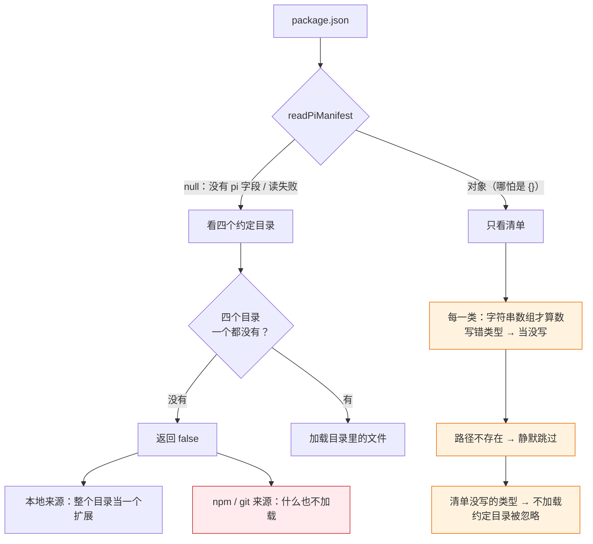
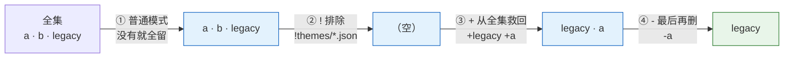
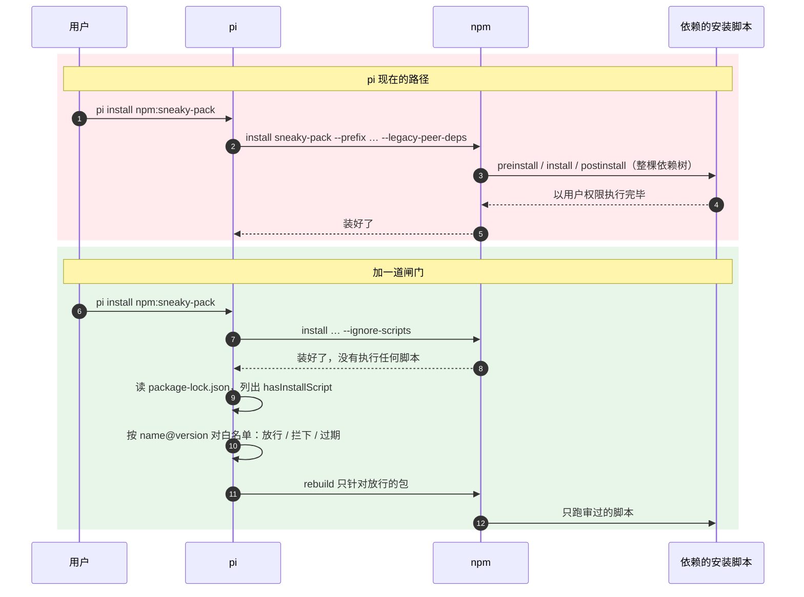

# 第 13 章 打包与分发

> 基准：pi `b79e4cc8` (v0.84.4)　·　[版本表](../../research/BASELINE.md)　·　[参与指南](../../CONTRIBUTING.md)

**状态**：✅ 已完成

## 本章回答

- 扩展怎么打包、怎么分发、四类资源分别是什么
- ⚠️ `pi install` 不禁 lifecycle script——你要补什么

## 素材来源

- `research/pi/07-extensibility.md` §7.4
- `research/pi/09-assessment-risks-recommendations.md` S1
- 对照：`Step-Code` `7dd66cb`、`minimax-code` `89c930a`
- 配套代码：[`examples/ch13-package-gate/`](../../examples/ch13-package-gate/)

---

前面几章写的扩展、技能、提示词模板，都放在自己机器的 `~/.pi/agent/` 或项目的 `.pi/` 里。要给团队用，就得打成包：一个带 `package.json` 的目录，可以发到 npm，可以放进 git 仓库，也可以就是一个本地路径。`pi install` 把它装下来，pi 启动时按一套规则算出这个包里哪些文件要加载。

这套规则写在 `core/package-manager.ts` 里，2,699 行，是 coding-agent 里最大的单个文件。它管四件事：从哪里拿到包（npm、git、本地），包里哪些文件算资源（清单还是约定目录），用户怎么在 settings 里挑选（过滤器），同名资源谁赢（优先级）。前三件事规则多，但多半只影响「装上之后有没有反应」；第四件之外还有第五件，也是本章标题里那个 ⚠️：装包这一步本身会执行代码，而 pi 给自己装依赖时用的那套防护，没有用在第三方包上。

先看几个数字：

| 数字 | 是什么 | 出处 |
| --- | --- | --- |
| **2,699** | `package-manager.ts` 的行数；清单解析只有 35 行 | `core/package-manager.ts`、`core/pi-manifest.ts` |
| **4** | 资源类型：扩展、技能、提示词模板、主题 | `core/pi-manifest.ts:11` |
| **3 × 3** | 来源（npm、git、本地）× 作用域（用户、项目、临时） | `core/package-manager.ts:101`、`:136`、`:148` |
| **5** | 资源优先级档位；来自包的资源永远是最低的第 4 档 | `core/package-manager.ts:176-192` |
| **0** | 第三方包的安装参数里 `--ignore-scripts` 出现的次数 | `core/package-manager.ts:1785-1806` |
| **2** | pi 自己的依赖里，被允许带安装脚本的包 | `scripts/generate-coding-agent-shrinkwrap.mjs:13-16` |

本章先讲一个包里什么算资源（13.1），再讲包从哪里来、同一个包出现两次怎么办（13.2），然后是 settings 里的过滤器和五级优先级（13.3）、依赖该怎么写（13.4）。13.5 是本章的重点：安装时到底会执行什么，pi 对自己和对第三方包用了两套标准。13.6 看 Step-Code 和 minimax-code 在下游各自怎么处理。13.7 写一个装前检查器和一道安装闸门。

本章引用的源码路径，除非特别说明，`core/…` 相对于 `packages/coding-agent/src/`，`docs/…` 相对于 `packages/coding-agent/`，`scripts/…` 和 `.github/…` 相对于仓库根。

---

## 13.1 四类资源与清单：有清单就只看清单

一个 pi 包能带四类资源：扩展（`.ts` / `.js` 模块，第 8 章）、技能（`SKILL.md`，第 12 章）、提示词模板（`.md`）、主题（`.json`）。包怎么声明自己带了什么，有两种写法。

第一种是在 `package.json` 里写一个 `pi` 字段，叫清单（manifest）：

```json
{
  "name": "review-pack",
  "keywords": ["pi-package"],
  "pi": {
    "extensions": ["./extensions"],
    "skills": ["./skills"],
    "prompts": ["./prompts", "!prompts/draft-*.md"]
  }
}
```

每一类是一个字符串数组，元素可以是文件、目录或 glob，也可以是以 `!`、`+`、`-` 开头的覆盖模式（13.3）。第二种是什么都不写，把文件放进四个约定目录：`extensions/`、`skills/`、`prompts/`、`themes/`（`docs/packages.md:158-165`）。

清单的解析只有一个函数：

```ts
// core/pi-manifest.ts:17-35
export function readPiManifest(packageJsonPath: string): PiManifest | null {
	try {
		const pkg: unknown = JSON.parse(stripBom(readFileSync(packageJsonPath, "utf-8")));
		if (!isObject(pkg) || !isObject(pkg.pi)) {
			return null;
		}

		const manifest: PiManifest = {};
		for (const field of RESOURCE_FIELDS) {
			const entries = pkg.pi[field];
			if (Array.isArray(entries) && entries.every((entry) => typeof entry === "string")) {
				manifest[field] = entries;
			}
		}
		return manifest;
	} catch {
		return null;
	}
}
```

它对外部输入的态度很宽松：`package.json` 读不出来、不是 JSON、没有 `pi` 字段，一律返回 `null`；某一类写成了字符串而不是数组，这一类就当没写，不报错也不警告。这本身不算问题，问题在于 `null` 和 `{}` 在后面走的是两条完全不同的路。

```ts
// core/package-manager.ts:2174-2201（节选）
		const manifest = readPiManifest(join(packageRoot, "package.json"));
		if (manifest) {
			for (const resourceType of RESOURCE_TYPES) {
				const entries = manifest[resourceType as keyof PiManifest];
				this.addManifestEntries(
					entries,
					packageRoot,
					resourceType,
					this.getTargetMap(accumulator, resourceType),
					metadata,
				);
			}
			return true;
		}

		let hasAnyDir = false;
		for (const resourceType of RESOURCE_TYPES) {
			const dir = join(packageRoot, resourceType);
			if (existsSync(dir)) {
				// Collect all files from the directory (all enabled by default)
				const files = collectResourceFiles(dir, resourceType);
```

只要有清单，哪怕是 `"pi": {}`，约定目录就整体不看了。清单写了扩展和技能、忘了写主题，`themes/` 目录里的文件就不会加载。清单里写了一个不存在的路径，`collectFilesFromPaths` 跳过它（`core/package-manager.ts:2518-2535`，判断在 `:2521`），同样没有提示。



*图 13-1 没有过滤器时，一个包的资源从哪里来：有清单就只看清单，三处静默丢弃都在这一侧*

图的右下角还有一个分叉。四个约定目录都不存在时 `collectPackageResources` 返回 `false`；本地来源的调用方会把整个目录当成一个扩展加进去（`core/package-manager.ts:1348-1351`），npm 和 git 来源的调用方不看返回值（`:1294`、`:1307`），包就什么也不加载。同一个目录，用 `pi install ./my-pack` 装有反应，发到 npm 再装就没反应了。

### 四类资源各自的发现规则

约定目录里哪些文件算资源，四类各不相同（`core/package-manager.ts:312-442`、`:557-653`）：

| 类型 | 规则 |
| --- | --- |
| 扩展 | 目录里有 `index.ts` / `index.js` 就只认它；否则认顶层的 `.ts` / `.js`，再加上有 index 的子目录 |
| 技能 | 一个目录里有 `SKILL.md`，这个目录就是一个技能，不再往下找；顶层的 `.md` 只在根目录算 |
| 提示词模板 | 递归找 `.md` |
| 主题 | 递归找 `.json` |

扩展的规则最容易踩：在 `extensions/` 下放一个 `index.ts` 当入口，同目录的 `legacy.ts`、`helpers.ts` 就都不会被当成独立扩展加载了，这正是你想要的；反过来，没有 index 时，`helpers.ts` 会被当成一个扩展去加载，它没有默认导出的工厂函数，加载时报「Extension does not export a valid factory function」（`core/extensions/loader.ts:576-579`）。

### 判断依据

- **清单只认字符串数组，其他写法静默丢弃；读失败返回 `null`**（`pi-manifest.ts:17-35`）。【代码事实】
- **有清单就只看清单，约定目录被整体忽略；`"pi": {}` 也算有清单**（`package-manager.ts:2174-2187`）。【代码事实】
- **清单里不存在的路径静默跳过**（`package-manager.ts:2521`）。【代码事实】
- **约定目录都没有时，本地来源退回「整个目录当扩展」，npm / git 来源不加载**（`package-manager.ts:1294`、`:1307`、`:1348-1351`）。【代码事实】
- **这些分支对用户的表现都是「装上没反应」，没有一条诊断**；发布方得自己在发布前检查。【推断】

---

## 13.2 三种来源、三种作用域

`pi install` 接受三种来源（`docs/packages.md:76-93`）：

- **npm**：`npm:review-pack` 或 `npm:review-pack@1.2.0`，装进作用域下的一个 npm 前缀目录；
- **git**：`git:github.com/acme/review-pack@v1`、`https://…`、`ssh://…`，`git clone` 到作用域下的目录，`@` 后面是 ref；
- **本地**：一个文件或目录路径，不复制，直接从原地加载。

装到哪里由作用域决定：默认写进用户 settings（`~/.pi/agent/settings.json`），`-l` 写进项目 settings（`.pi/settings.json`），`-e` 只对这一次运行生效，装进临时目录（`docs/packages.md:43-45`）。项目 settings 可以提交进仓库和团队共享，**项目被信任之后，pi 启动时会自动安装其中缺失的包**（`docs/packages.md:43`；`docs/security.md:24`）。这一点到 13.5 还会用到：克隆一个陌生仓库、点了信任，就可能触发一次 `npm install`。

### 同一个包出现两次

同一个包可能同时出现在用户和项目 settings 里。pi 先算每个包的身份，再去重：

```ts
// core/package-manager.ts:1687-1701
	private getPackageIdentity(source: string, scope?: SourceScope): string {
		const parsed = this.parseSource(source);
		if (parsed.type === "npm") {
			return `npm:${parsed.name}`;
		}
		if (parsed.type === "git") {
			// Use host/path for identity to normalize SSH and HTTPS
			return `git:${parsed.host}/${parsed.path}`;
		}
		if (scope) {
			const baseDir = this.getBaseDirForScope(scope);
			return `local:${this.resolvePathFromBase(parsed.path, baseDir)}`;
		}
		return `local:${this.resolvePath(parsed.path)}`;
	}
```

身份里**没有版本和 ref**。用户装了 `review-pack@1.1.0`，项目要求 `review-pack@1.2.0`，它们是同一个包，`dedupePackages`（`:1708-1730`）让项目那一份赢，用户那份不再加载。这是对的：项目 settings 是团队约定，个人不该悄悄用另一个版本。git 来源把 SSH 和 HTTPS 归一成 `host/path`，同一个仓库换个协议也认得出来。本地来源按作用域的基准目录解析成绝对路径，两份 settings 里写的相对路径即使字面不同，指向同一处也会被认成一个。

去重有一个例外。项目里那一份写了 `autoload: false` 时，它不是替换，而是**差量**：两份都保留，项目那份排前面。差量的意思是「我只对提到的文件表态，其余照用户那份来」：

```ts
// core/package-manager.ts:787-803（节选）
function applyAutoloadDisabledPatterns(allPaths: string[], patterns: string[], baseDir: string): Map<string, boolean> {
	const result = new Map<string, boolean>();
	for (const pattern of patterns) {
		// … 去掉 + - ! 前缀得到 target
		const enabled = !pattern.startsWith("-") && !pattern.startsWith("!");
		const exact = pattern.startsWith("+") || pattern.startsWith("-");
		for (const filePath of allPaths) {
			if (
				exact ? matchesAnyExactPattern(filePath, [target], baseDir) : matchesAnyPattern(filePath, [target], baseDir)
			) {
				result.set(filePath, enabled);
			}
		}
	}
	return result;
```

它只给模式命中的文件定一个开或关的状态，没命中的文件不进结果。由于资源是「先写入的赢」（`addResource`，`:2555-2565`），项目差量先写入，表过态的文件以项目为准，没表态的文件由后面的用户那份补上。团队可以用这个机制说「这个包大家都装，但项目里关掉它的某个扩展」，而不用替每个人决定装哪个版本。

### 判断依据

- **三种来源、三种作用域**（`package-manager.ts:101`、`:136`、`:148`）；项目被信任后自动安装缺失的包（`docs/packages.md:43`、`docs/security.md:24`）。【代码事实】
- **包身份不含版本和 ref；同一身份项目赢**（`package-manager.ts:1687-1730`；`docs/packages.md:222-228`）。【代码事实】
- **项目的 `autoload: false` 是差量，两份都保留，项目在前，先写者赢**（`package-manager.ts:1704-1706`、`:787-803`、`:2555-2565`）。【代码事实】
- **身份不含版本，意味着项目可以把团队成员的版本「拉齐」**，而不是两个版本同时加载、按名字冲突。【推断】

---

## 13.3 过滤器与五级优先级

装好的包，用户还可以在 settings 里只挑一部分。写法是把包从字符串改成对象：

```json
{
  "packages": [
    { "source": "npm:review-pack", "extensions": ["!extensions/legacy.ts"], "themes": [] }
  ]
}
```

每一类一个模式数组，规则写在 `docs/packages.md:209-216`：不写这一类就全部加载，`[]` 就全部不加载；`!` 排除，`+` 强制加入一个精确路径，`-` 强制去掉一个精确路径。

### 过滤四步

这些模式由 `applyPatterns`（`core/package-manager.ts:739-785`）按固定的四步执行：

```ts
// core/package-manager.ts:757-784
	// Step 1: Apply includes (or all if no includes)
	let result: string[];
	if (includes.length === 0) {
		result = [...allPaths];
	} else {
		result = allPaths.filter((filePath) => matchesAnyPattern(filePath, includes, baseDir));
	}

	// Step 2: Apply excludes
	if (excludes.length > 0) {
		result = result.filter((filePath) => !matchesAnyPattern(filePath, excludes, baseDir));
	}

	// Step 3: Force-include (add back from allPaths, overriding exclusions)
	if (forceIncludes.length > 0) {
		for (const filePath of allPaths) {
			if (!result.includes(filePath) && matchesAnyExactPattern(filePath, forceIncludes, baseDir)) {
				result.push(filePath);
			}
		}
	}

	// Step 4: Force-exclude (remove even if included or force-included)
	if (forceExcludes.length > 0) {
		result = result.filter((filePath) => !matchesAnyExactPattern(filePath, forceExcludes, baseDir));
	}
```



*图 13-2 过滤四步：顺序固定，与模式在数组里的先后无关；`-` 永远最后执行*

两个细节。一是顺序和数组里的书写顺序无关：`["-a", "+a"]` 和 `["+a", "-a"]` 结果一样，`a` 都被去掉。二是 `+` 和 `-` 只认精确路径（`matchesAnyExactPattern`，`:688-706`），写 glob 不会报错，只是什么也匹配不上；普通模式和 `!` 才走 glob，而且除了匹配相对路径，还会匹配文件名，对技能还会匹配 `SKILL.md` 所在的目录名（`matchesAnyPattern`，`:655-681`）。

### 过滤器不只收窄

文档在这一节的最后一条写的是：

> Filters layer on top of the manifest. They narrow down what is already allowed.（`docs/packages.md:216`）

代码不完全是这样。有过滤器时，`collectPackageResources` 走的是开头那个分支（`core/package-manager.ts:2159-2172`），每一类各自处理：

```ts
// core/package-manager.ts:2204-2224（节选）
	private collectDefaultResources(…): void {
		const manifest = readPiManifest(join(packageRoot, "package.json"));
		const entries = manifest?.[resourceType as keyof PiManifest];
		if (entries) {
			this.addManifestEntries(entries, packageRoot, resourceType, target, metadata);
			return;
		}
		const dir = join(packageRoot, resourceType);
		if (existsSync(dir)) {
			// Collect all files from the directory (all enabled by default)
```

过滤器没写的类型走 `collectDefaultResources`：清单有这一类就用清单，**清单没写这一类，就回去看约定目录**。而没有过滤器时，清单没写的类型是一个也不加载的（13.1）。写了过滤器的类型走 `collectManifestFiles`（`:2275-2296`），清单这一类是空数组或没写，候选全集同样退回约定目录。

于是有了这样一个结果：`review-pack` 的清单没写主题，`themes/review-dark.json` 本来不加载；用户为了关掉一个旧扩展，给它加了一条 `{"extensions": ["!extensions/legacy.ts"]}`，主题反而被加载了。13.7 的演示第 2 段就是这个场景。`docs/packages.md:211` 那句「Omit a key to load all of that type」和代码对得上，和 `:216` 的「narrow down」对不上；两句放在一起读，「all of that type」到底是清单允许的全部，还是包里能找到的全部，文档没说清。

这不是安全问题，主题和提示词都是被动资源；但扩展也走同样的逻辑。清单只声明了技能、目录里却留着 `extensions/` 的包，用户一加过滤器，那个目录里的扩展就会开始执行。发布方能做的是：**不打算加载的文件不要放进约定目录名下，更不要留在发布的 tarball 里**。

### 五级优先级

过滤之后，所有来源的资源合在一起，同名的只留一个。谁赢由一个排名决定：

```ts
// core/package-manager.ts:176-192
/**
 * Precedence (highest to lowest):
 *   0  project + settings entry (source: "local", scope: "project")
 *   1  project + auto-discovered (source: "auto", scope: "project")
 *   2  user + settings entry (source: "local", scope: "user")
 *   3  user + auto-discovered (source: "auto", scope: "user")
 *   4  package resource (origin: "package")
 */
function resourcePrecedenceRank(m: PathMetadata): number {
	if (m.origin === "package") return 4;
	const scopeBase = m.scope === "project" ? 0 : 2;
	return scopeBase + (m.source === "local" ? 0 : 1);
}
```

来自包的资源不分作用域，一律排最后。即使是项目 settings 里装的包，它带的 `code-review` 技能也会输给你自己 `~/.pi/agent/skills/` 里的同名技能。排序之后按「先到先得」去重，输的那份记一条 collision 诊断（第 12 章 12.4）。

这个设计选的是「人写的优先于装来的」：包是别人写的，你自己放进目录的文件是你写的，后者总该赢。代价是包作者没法用名字覆盖用户的同名资源。对团队分发来说，这反而是好事；但它和 13.2 的「项目 settings 赢」叠在一起时容易让人混淆：**包和包之间**项目赢，**资源和资源之间**包永远输。

### 判断依据

- **过滤四步顺序固定，`+` `-` 只认精确路径**（`package-manager.ts:655-706`、`:739-785`）。【代码事实】
- **有过滤器时，没写的类型退回「清单这一类，否则约定目录」**；写了的类型，清单为空或没写时候选全集也退回约定目录（`package-manager.ts:2159-2172`、`:2204-2224`、`:2275-2296`）。【代码事实】
- **因此加一个过滤器可能让清单没声明的资源开始加载**，与 `docs/packages.md:216` 的「narrow down」不符。【代码事实】（演示第 2 段复现）
- **空数组表示这一类全部关掉，文件仍登记、状态为 disabled**（`package-manager.ts:2235-2241`）。【代码事实】
- **包资源固定排第 4 档，不区分作用域**（`package-manager.ts:188-192`）。【代码事实】

---

## 13.4 依赖：宿主提供的不要自己装

扩展会 `import` pi 的 API。pi 的文档对依赖的写法有明确要求（`docs/packages.md:169-173`）：

- 用到 pi 自带的五个包（`@earendil-works/pi-ai`、`pi-agent-core`、`pi-coding-agent`、`pi-tui`、`typebox`），写进 `peerDependencies`，版本写 `"*"`，不要打包进去；
- 其他运行时依赖写进 `dependencies`，安装时会一起装；
- 依赖另一个 pi 包，要写进 `dependencies` 和 `bundledDependencies`，通过 `node_modules/` 路径引用它的资源。

为什么宿主的包要写成 peer 且不打包？因为运行时根本用不上你装的那份。扩展加载器给这五个模块配了别名，`import` 它们拿到的永远是宿主进程里已经加载的那一份（`core/extensions/loader.ts:50-74` 的 `VIRTUAL_MODULES`、`:86-146` 的别名表、`:502-507` 应用到 jiti）。安装参数也配合这一点，把 peer 解析关掉：

```ts
// core/package-manager.ts:1785-1806
	private getNpmInstallArgs(specs: string[], installRoot: string): string[] {
		const packageManagerName = this.getPackageManagerName();
		// Extension packages run inside pi and resolve pi APIs through loader aliases/virtual modules.
		// Disable peer dependency resolution for managed installs (npm's --legacy-peer-deps, and
		// equivalent bun/pnpm settings) so package managers do not install or solve host-provided
		// @earendil-works/pi-* peers. Stale auto-installed pi peers can otherwise block updates.
		if (packageManagerName === "bun") {
			return ["install", ...specs, "--cwd", installRoot, "--omit=peer"];
		}
		if (packageManagerName === "pnpm") {
			return [
				"install",
				...specs,
				"--prefix",
				installRoot,
				"--config.auto-install-peers=false",
				"--config.strict-peer-dependencies=false",
				"--config.strict-dep-builds=false",
			];
		}
		return ["install", ...specs, "--prefix", installRoot, "--legacy-peer-deps"];
	}
```

注释说得很清楚：这三个分支的目的，是让包管理器不去安装、不去求解宿主提供的 peer。把 `pi-ai` 写进 `dependencies` 的包，npm 照样会把它装下来，只是运行时不会用；它多出来的，只是磁盘、安装时间，以及这份依赖树里所有安装脚本的执行机会。

记住这个函数，下一节要回来看它**没有**写什么。

### 判断依据

- **宿主的五个模块写 peer、版本 `"*"`、不打包；其他 pi 包要 bundle**（`docs/packages.md:169-173`）。【代码事实】
- **加载器把这五个模块别名到宿主实例**（`loader.ts:50-74`、`:86-146`、`:502-507`）。【代码事实】
- **三个包管理器分支都只关闭 peer 解析**（`package-manager.ts:1785-1806`）。【代码事实】
- **写进 `dependencies` 的宿主模块运行时不被使用，只增加安装面**。【推断】

---

## 13.5 安装时会发生什么

### 一个包从安装到加载

把前面几节串起来，一个 npm 包从 `pi install` 到第一次被调用，要经过这些步骤：

1. `pi install npm:review-pack -l` 把来源写进项目 settings；
2. `installNpm`（`core/package-manager.ts:1808-1812`）用 13.4 那组参数在作用域的前缀目录里跑一次 `npm install`；
3. 下次启动，`collectPackageResources` 按 13.1、13.3 的规则算出要加载的文件；
4. 扩展模块被 jiti 加载，工厂函数在 pi 进程里执行（第 8 章）。

git 来源的第 2 步是另一条路：

```ts
// core/package-manager.ts:1849-1857
		try {
			await this.runCommand("git", ["clone", source.repo, targetDir]);
			if (source.ref) {
				await this.runCommand("git", ["checkout", source.ref], { cwd: targetDir });
			}
			const packageJsonPath = join(targetDir, "package.json");
			if (existsSync(packageJsonPath)) {
				await this.runNpmCommand(this.getGitDependencyInstallArgs(), { cwd: targetDir });
			}
```

克隆下来，有 `package.json` 就在克隆目录里跑 `npm install --omit=dev`（配置了自定义 npm 命令时只有 `install`，`:1772-1778`）。`pi update` 让克隆对齐到配置的 ref 时，也会重跑一次（`docs/packages.md:93`）。

第 4 步是第 8 章已经讲过的：扩展和 pi 同进程、同权限，没有隔离。所以装一个恶意扩展，最迟在第 4 步就已经输了。本节要说的是：**第 2 步本身就会执行代码，比第 4 步更早，而且不止执行这个包的代码。**

### 第三方包：install 参数里没有 `--ignore-scripts`

回到 13.4 的 `getNpmInstallArgs`。三个分支都只处理了 peer，没有一个带 `--ignore-scripts`。默认的 npm 分支下，`npm install` 会执行：

- 这个包自己的 `preinstall`、`install`、`postinstall`；
- 依赖树里**每一个**依赖的同名脚本；
- 带 `binding.gyp` 而没写 `install` / `preinstall` 的包，隐式的 `node-gyp rebuild`。

git 来源更进一步。在克隆目录里跑 `npm install` 时，这个包就是根项目，它自己的 `prepare` 也会执行。

这些脚本以当前用户的权限运行，能读 `~/.ssh`、环境变量里的 API key、各家 CLI 的凭证文件。pi 的文档没有回避这一点：`docs/packages.md:20` 的安全提示写着「Pi packages run with full system access」，`docs/security.md:33` 写着「Package installs … behave as ordinary local processes」。所以这不是一个未被意识到的漏洞，而是一个选择。问题在于，pi 对自己做了另一个选择。

### pi 对自己：四道防线

pi 给自己装依赖时，几乎每一处都带着 `--ignore-scripts`：

```ts
// packages/coding-agent/src/package-manager-cli.ts:89-99（节选）
async function runManagedNpmCi(stageDir: string): Promise<void> {
	const args = [
		"ci",
		"--ignore-scripts",
		"--min-release-age=0",
		"--omit=dev",
		// …
	];
```

这是 `pi update --self` 的托管升级路径：从安装器 API 拿到 `package.json` 和 `package-lock.json`，在一个暂存目录里 `npm ci --ignore-scripts`，校验通过后再改名替换（`package-manager-cli.ts:185-220`，校验在 `:214`、替换在 `:215`）。仓库 README 把这条规则写成了承诺：「Local release installs, documented npm installs, and `pi update --self` use `--ignore-scripts` where supported.」（`README.md:86`）

不跑脚本之后，真的需要安装脚本的依赖怎么办？pi 在生成发布用的 shrinkwrap 时，维护了一份按 `name@version` 的白名单：

```js
// scripts/generate-coding-agent-shrinkwrap.mjs:13-16
const allowedInstallScriptPackages = new Map([
	["@google/genai@1.52.0", "preinstall is a no-op in the published package"],
	["protobufjs@7.6.5", "postinstall only warns about protobufjs version scheme mismatches"],
]);
```

检查逻辑（`:230-261`）对 lockfile 里每个 `hasInstallScript` 的条目查白名单，不在就报错，提示「Review it and add it to allowedInstallScriptPackages if intentional」；反过来，白名单里有、lockfile 里已经没有的条目也报错，要求删掉（`:257-261`）。键带版本，依赖升级一次就要重新审一次；白名单只能和 lockfile 同步，不会越攒越长。同一个循环还拒绝 `link` 条目和指向本地路径的 `resolved`（`:235-240`）。

把这些和第三方包的路径放在一起：

| | pi 自己的依赖 | `pi install` 第三方包 |
| --- | --- | --- |
| 安装方式 | `npm ci`，以 lockfile 为准 | `npm install`，现场解析 |
| 安装脚本 | `--ignore-scripts`（`package-manager-cli.ts:92`、`ci.yml:33`、`npm-audit.yml:25`） | 照常执行（`package-manager.ts:1785-1806`） |
| 有脚本的依赖 | 按 `name@version` 白名单，过期报错（`generate-coding-agent-shrinkwrap.mjs:13-16`、`:230-261`） | 不检查 |
| 版本与新鲜度 | `.npmrc` 的 `save-exact=true`、`min-release-age=2` | 用户写什么就是什么 |
| 审计 | 每日 `npm audit` 与 `npm audit signatures`（`npm-audit.yml:28`、`:31`） | 无 |
| lockfile 变更 | pre-commit 拦下，要求确认新的 lifecycle script（`scripts/check-lockfile-commit.mjs:102`） | 无 |



*图 13-3 安装路径的两种写法：上面是 pi 对第三方包做的，下面是 pi 对自己做的*

`docs/security.md:20-26` 列出了项目信任会放行什么，其中一条是「missing project packages configured through project settings」。也就是说，在 13.2 说的那个场景里——克隆一个仓库，它的 `.pi/settings.json` 写了一个包，你点了信任——下一次启动 pi 就会自动跑一次带全部安装脚本的 `npm install`。信任提示问的是「要不要加载这个项目的资源」，用户很难从这句话里读出「要不要以我的身份执行一个陌生包和它全部依赖的安装脚本」。

### pnpm 和 bun 的情况不同

上面说的「整棵依赖树的脚本都会跑」，严格说只对默认的 npm 成立。用户在 settings 里把 `npmCommand` 换成 pnpm 或 bun 时：

- pnpm 10 起默认不执行依赖的构建脚本，需要在 `onlyBuiltDependencies` 里显式允许。pi 在 pnpm 分支加的 `--config.strict-dep-builds=false`（`package-manager.ts:1802`），作用是让被跳过的构建脚本只产生警告，而不是让安装失败。【推断】
- bun 只执行 `trustedDependencies` 里列出的依赖的脚本。【推断】

这两条来自对包管理器默认行为的了解，不是 pi 源码里能看到的事实。但它们说明了一件事：「默认不跑依赖的安装脚本、需要时显式放行」已经是两个主流包管理器的默认值，pi 的 npm 分支是三个里唯一什么都跑的。另外，git 来源下包自己是根项目，根项目的脚本在三个包管理器下都会跑。

### 补上 `--ignore-scripts` 能解决什么

`research/pi/09` 把这一条列为 S1，并且紧接着写了一段提醒：即使加上 `--ignore-scripts`，扩展本身仍然和 pi 同进程、同权限，装一个恶意扩展依然等于把代码执行权交给它。pi 的安全文档也明确说，进程内的局部沙箱「would be easy to misunderstand as a security boundary」（`docs/security.md:35`），项目信任「is only an input-loading guard」（`:37`）。

所以补上 `--ignore-scripts` 的价值，不是建立一道安全边界，而是三件更具体的事：

1. **消除纪律不一致。** pi 已经证明了这套做法对自己有效，用在第三方包上是同一套代码的另一个参数。
2. **把执行时机从「安装」推迟到「加载」。** 加载之前你还有机会看一眼包里的扩展代码、看一眼 13.1 的清单解析结果；安装脚本连这个机会都不给。依赖的安装脚本更是你从没打算运行的代码。
3. **缩小依赖树的攻击面。** 一个扩展包可能只有几十行，但它的依赖树里有几百个包。不跑安装脚本，被投毒的深层依赖至少不会在安装时立刻得手。

代价是有原生模块的依赖（`better-sqlite3`、`node-pty` 一类）装完不能直接用，要么维护白名单补跑，要么让包作者改用预编译的二进制。这正是 pi 自己白名单里只有两条的原因：它刻意把依赖选成了不需要安装脚本的那些。

### 判断依据

- **第三方包的 npm / pnpm / bun 安装参数都没有 `--ignore-scripts`**（`package-manager.ts:1785-1806`）；`package-manager.ts` 全文没有这个字符串。【代码事实】
- **git 来源在克隆目录里 `npm install`，包自己是根项目**（`package-manager.ts:1849-1857`、`:1772-1778`）。【代码事实】
- **pi 自己的安装路径用 `--ignore-scripts`、按 `name@version` 的白名单、过期检查、精确版本、发布年龄门槛、每日审计**（`package-manager-cli.ts:89-99`；`generate-coding-agent-shrinkwrap.mjs:13-16`、`:230-261`；`.npmrc`；`ci.yml:33`；`npm-audit.yml:25-31`；`README.md:86`）。【代码事实】
- **项目信任会触发缺失包的自动安装**（`docs/security.md:24`、`docs/packages.md:43`）。【代码事实】
- **pnpm、bun 默认不跑依赖脚本**：来自包管理器的默认行为，不是 pi 的代码。【推断】
- **补上参数消除的是不一致，不是建立边界**（`research/pi/09` S1；`docs/security.md:33-37`）。【推断】

---

## 13.6 下游对照：两种绕开的办法

pi 的两个下游都没有在 `getNpmInstallArgs` 上补 `--ignore-scripts`，但它们各自绕开了这个问题。

### Step-Code：保留 `pi install`，另开一个声明式市场

Step-Code 的 `getNpmInstallArgs` 和 pi 逐项相同，只有注释里提到的 npm scope 换成了它自己的（`packages/coding-agent/src/core/package-manager.ts:1770-1791`）；`pi install` 命令也还在（`package-manager-cli.ts:572`、`:670`）。它的改动在另一处：自己的插件市场根本不跑 npm。

```ts
// Step-Code: packages/coding-agent/src/step/plugins.ts:1-9
/**
 * StepCode plugin marketplace facade.
 *
 * Pi's package manager can install executable extensions, but Step's built-in
 * marketplace has a deliberately smaller contract: marketplace packages are
 * declarative manifests copied into `.stepcode/plugins`. MCP processes are
 * started by the Step runtime after installation; this module owns discovery
 * and provisioning only.
 */
```

市场里的插件是一个 `step.plugin.json` 声明（`:25`），也兼容 `.claude-plugin/` 的清单（`:27-31`）。安装就是 `fs.cp` 一份目录（`installMarketplacePlugin`，`:492-510`），不跑任何包管理器。清单里即使声明了可执行入口，也只记录、不加载：

```ts
// Step-Code: packages/coding-agent/src/step/plugins.ts:645-646
	if (read.manifest.entry)
		warnings.push("Executable plugin entries are recorded but not loaded by the Step marketplace facade.");
```

能执行的东西只剩 MCP 服务器，由 Step 运行时在重启后启动（`:643`）。克隆市场仓库时用的是 `git clone --depth 1 --quiet -- <source>`（`:965`），`--` 之后才是来源，`resolveMarketplaceCloneUrl` 还会拒绝以 `-` 开头的来源（`:215-221`），防止来源被当成 git 的参数。

这个选择把「装插件」和「执行代码」拆开了，代价是插件能力被限制在声明和 MCP 上。不过拆得并不彻底：内置插件需要的 `steppage-mcp` 可执行文件，缺失时由 `provisionBuiltinPlugin` 自动执行 `curl -fsSL <url> | sh` 安装（`:559-590`，地址在 `:34`，可用环境变量 `STEPCODE_STEPPAGE_INSTALLER_URL` 覆盖）。这是一个来自自家域名的脚本，信任对象和第三方包不一样，但它也是一次以用户权限执行远程代码，而且没有校验内容哈希。

### minimax-code：只认完整 commit，只认内容摘要

minimax-code 不用 pi 的 `PackageManager`，插件系统在 `packages/local-runtime-v2/src/service/plugin-system/` 下自己写了一套。它在来源和内容两头都收紧了：

```ts
// minimax-code: packages/local-runtime-v2/src/service/plugin-system/plugin/import/github-source.ts:35-39
export function validateGitRepositorySource(source: GithubPluginSource): GithubPluginSource {
  const url = parseGitRepositoryUrl(source.repositoryUrl);
  const commitSha = source.commitSha.toLowerCase();
  if (!FULL_SHA.test(commitSha))
    fail('GIT_REPOSITORY_SOURCE_INVALID', 'commit_sha must be a full SHA');
```

`FULL_SHA` 是 40 位十六进制（`:124`），分支名和标签都不接受，同一个来源永远指向同一份内容。导入时 `git clone --no-checkout`，`fetch` 那个 commit，`checkout --detach`（`plugin/import/github-archive.ts:42-72`），整个插件系统目录里没有一处调用 npm。从注册表下载的归档包要过两道哈希：归档本身的 SHA-256，以及解开后整个目录的 `sha256-tree-v1` 内容摘要，解到暂存目录、算完摘要对上了才落进缓存（`plugin/package/archive-cache.ts:27-75`、`plugin/package/package-contract.ts:21`）。它自己的依赖则用 pnpm 的 `onlyBuiltDependencies` 白名单，只允许 `better-sqlite3`、`esbuild`、`node-pty` 三个包跑构建脚本（根 `package.json:44-49`）。

| | pi | Step-Code | minimax-code |
| --- | --- | --- | --- |
| 第三方包安装时跑 npm | 是，带脚本 | `pi install` 是；市场否 | 否 |
| 来源钉到什么 | 版本 / ref，可以是分支 | 同 pi；市场为浅克隆 | 40 位 commit SHA |
| 内容校验 | 无 | 无 | 归档 SHA-256 + 目录摘要 |
| 能执行的东西 | 扩展（同进程） | 扩展；市场只有 MCP | 插件运行时的约定入口 |
| 自己依赖的脚本 | 白名单 2 个 | 继承 pi | pnpm 白名单 3 个 |

两家的共同点是：都没有去修 `getNpmInstallArgs`，而是让自己的主要分发路径**不经过 npm install**。这比补一个参数彻底，代价是放弃了 npm 生态里现成的依赖解析：插件要么不能有依赖，要么得把依赖打包好再分发。

### 判断依据

- **Step-Code 的第三方安装参数与 pi 相同，`pi install` 仍在**（`package-manager.ts:1770-1791`；`package-manager-cli.ts:572`、`:670`）。【代码事实】
- **Step-Code 市场是复制目录的声明式安装，可执行入口不加载**（`step/plugins.ts:1-9`、`:492-510`、`:645-646`）。【代码事实】
- **Step-Code 内置插件缺可执行文件时自动 `curl | sh`**（`step/plugins.ts:559-590`、`:34`）。【代码事实】
- **minimax-code 要求完整 commit SHA，导入不跑 npm，归档双哈希校验**（`github-source.ts:35-39`、`:124`；`github-archive.ts:42-72`；`archive-cache.ts:27-75`）。【代码事实】
- **两家都选了「绕开 npm install」而不是「给 npm install 加闸门」**，换来更小的执行面，代价是依赖要预先打包。【推断】

---

## 13.7 你的最小实现：装前检查与安装闸门

配套代码 [`examples/ch13-package-gate/`](../../examples/ch13-package-gate/) 用零依赖的 TypeScript 做了两件事：按 pi 的规则算出一个包会加载什么，以及在安装前检查、安装时加一道闸门。规则部分全是纯函数，输入是包内文件的相对路径列表；只有 `src/load.ts` 读磁盘，用 `lstat` 不跟随符号链接，并限制文件数和目录深度。不连网络，也不真的执行 npm。

| 规则 | pi | 本例 |
| --- | --- | --- |
| 清单只认字符串数组 | `pi-manifest.ts:17-35` | `src/package-json.ts` |
| 有清单只看清单 | `package-manager.ts:2174-2201` | `src/resources.ts` |
| 四类资源的发现规则 | `package-manager.ts:312-442`、`:557-653` | `src/tree.ts` |
| 过滤四步 | `package-manager.ts:655-785` | `src/patterns.ts` |
| 过滤器没写的类型退回默认 | `package-manager.ts:2204-2224`、`:2275-2296` | `src/resources.ts` |
| 五级优先级、包身份去重 | `package-manager.ts:176-192`、`:1687-1730` | `src/precedence.ts` |
| 安装参数 | `package-manager.ts:1772-1806` | `src/gate.ts` |
| 白名单与过期检查 | `generate-coding-agent-shrinkwrap.mjs:13-16`、`:230-261` | `src/gate.ts` |

### 三条路写在一个函数里

```ts
// examples/ch13-package-gate/src/resources.ts:86-92
export function collectPackageResources(tree: FileTree, manifest: PiManifest | undefined, filter?: PackageFilter): Collected {
  const unmatched = manifest ? unmatchedEntries(tree, manifest) : [];
  if (filter) return { mode: "filter", resources: byType((t) => filteredResources(tree, manifest, filter, t)), unmatched };
  // 有清单就只看清单：清单没写的类型一个也不加载，约定目录被整体忽略（:2174-2186）
  if (manifest) return { mode: "manifest", resources: byType((t) => allEnabled(manifestFiles(tree, manifest[t] ?? [], t))), unmatched };
  return { mode: "convention", resources: byType((t) => allEnabled(collectResourceFiles(tree, t, t))), unmatched };
}
```

和 pi 相比多返回了两样东西：走的是哪条路（`mode`），以及清单里哪些条目没有对应文件（`unmatched`）。pi 在这两处都是静默的；检查器靠这两个字段才能告诉发布方「你的包装上之后什么也不会加载」。过滤器分支里的两个退回规则拆成了两个小函数 `defaultFiles` 和 `candidateFiles`（`:48-57`），一个用 `entries`、一个用 `entries.length > 0` 判断，差别就在空数组上，正是 pi 里 `collectDefaultResources` 和 `collectManifestFiles` 的差别。

### 白名单审查是三个集合

```ts
// examples/ch13-package-gate/src/gate.ts:88-95
export function reviewInstallScripts(entries: readonly LockEntry[], allowlist: ReadonlyMap<string, string>): ScriptReview {
  const ids = [...new Set(entries.filter((e) => e.hasInstallScript).map((e) => `${e.name}@${e.version}`))].sort();
  return {
    allowed: ids.filter((id) => allowlist.has(id)),
    blocked: ids.filter((id) => !allowlist.has(id)),
    stale: [...allowlist.keys()].filter((id) => !ids.includes(id)).sort(),
  };
}
```

这就是 pi 那个 shrinkwrap 检查循环的骨架，只是不直接报错，而是把结果分成三个集合交给调用方：放行的去 `npm rebuild`，拦下的要人去看，过期的从白名单里删掉。同一个 `name@version` 出现在依赖树的多个位置时只算一次。lockfile 是外部输入，`parseLockfile`（`:58-76`）只接受 `lockfileVersion ≥ 2` 且有 `packages` 表的结构，不对就抛 `LockfileError`，不去猜。

### 装前检查按严重程度排序

`src/inspect.ts` 把一个包的问题分成三级：

- **高**：会在安装时执行的东西。`preinstall` / `install` / `postinstall`，有 `binding.gyp` 时隐式的 `node-gyp rebuild`，git 来源时的 `prepare`。本地来源 pi 不跑 npm，这几条降为提示。
- **中**：装上之后行为和作者预期不符。宿主模块写进了 `dependencies` 或 `bundledDependencies`，清单字段类型不对被丢弃，清单条目没有文件，清单解析出 0 个资源，清单盖住了约定目录。
- **提示**：`keywords` 里没有 `pi-package`，包画廊搜不到（`docs/packages.md:118`）。

命令行模式下有「高」级发现就以退出码 1 结束，可以直接接进发布前的 CI。

### 跑起来

```text
$ npm start
== 1. 清单与约定目录：有清单就只看清单 ==
  review-pack 走 manifest：extensions 2 · skills 1 · prompts 1 · themes 0
    extensions extensions/legacy.ts
    extensions extensions/review.ts
    skills     skills/code-review/SKILL.md
    prompts    prompts/commit.md
  [中] 有 pi 清单但没写 themes：themes/ 下 1 个文件不会加载

== 2. 给包加一个过滤器，加载的资源反而变多 ==
  过滤器 {"extensions":["!extensions/legacy.ts"]}
  之前：extensions 2 · skills 1 · prompts 1 · themes 0
  之后：extensions 1 · skills 1 · prompts 1 · themes 1
  多出来的主题：themes/review-dark.json

== 3. 过滤四步与两层去重 ==
  ! 全排除 → + 救回 legacy 和 a → - 再删 a：themes/legacy.json
  同名技能：.pi/skills/deploy/SKILL.md | ~/.pi/agent/skills/code-review/SKILL.md
  collision code-review：review-pack/skills/code-review/SKILL.md 输给 ~/.pi/agent/skills/code-review/SKILL.md
  包去重（身份不含版本）：npm:review-pack@1.2.0(project)

== 4. 装之前先检查：sneaky-pack ==
  -- 作为 npm 来源（manifest：extensions 0 · skills 0 · prompts 0 · themes 0）
  [高] postinstall 会在安装时执行：node scripts/setup.js
  [高] 有 binding.gyp：npm 会隐式执行 node-gyp rebuild
  [中] @earendil-works/pi-ai 写在 dependencies 里：运行时用的是宿主那份，装进来的只是多一份供应链面；应改为 peerDependencies "*"
  [中] pi.extensions 不是字符串数组，pi 会静默忽略它
  [中] 清单条目没有对应文件，pi 会静默跳过：pi.skills: ./skill
  [中] 清单解析出 0 个资源：装上之后什么也不加载
  [中] 有 pi 清单但没写 extensions：extensions/ 下 1 个文件不会加载
  [提示] keywords 里没有 pi-package，包画廊搜不到它
  -- 作为 git 来源（manifest：extensions 0 · skills 0 · prompts 0 · themes 0）
  [高] postinstall 会在安装时执行：node scripts/setup.js
  [高] 有 binding.gyp：npm 会隐式执行 node-gyp rebuild
  [高] git 来源会执行 prepare：node scripts/setup.js --build
  [中] @earendil-works/pi-ai 写在 dependencies 里：运行时用的是宿主那份，装进来的只是多一份供应链面；应改为 peerDependencies "*"
  [中] pi.extensions 不是字符串数组，pi 会静默忽略它
  [中] 清单条目没有对应文件，pi 会静默跳过：pi.skills: ./skill
  [中] 清单解析出 0 个资源：装上之后什么也不加载
  [中] 有 pi 清单但没写 extensions：extensions/ 下 1 个文件不会加载
  [提示] keywords 里没有 pi-package，包画廊搜不到它

== 5. 安装闸门：先不跑脚本，审过 lockfile，再只补跑白名单 ==
  pi 的参数：npm install sneaky-pack --prefix ~/.pi/agent/npm --legacy-peer-deps
  闸门参数：npm install sneaky-pack --prefix ~/.pi/agent/npm --legacy-peer-deps --ignore-scripts
  有安装脚本的包：2 个
  放行：esbuild@0.25.0
  拦下：sneaky-pack@0.3.1
  白名单过期：node-pty@1.0.0
  补跑：npm rebuild esbuild --prefix ~/.pi/agent/npm
```

逐段对照本章：

- **第 1 段**（13.1）：`review-pack` 有清单，没写主题，`themes/review-dark.json` 不加载；`prompts/draft-release.md` 被清单里的 `!prompts/draft-*.md` 排除。
- **第 2 段**（13.3）：只为扩展加一条排除规则，扩展从 2 个变成 1 个，主题却从 0 个变成 1 个，这就是「过滤器不只收窄」。
- **第 3 段**（13.2、13.3）：四步过滤里 `+a` 和 `-a` 同时出现，`-` 赢；包里的 `code-review` 技能输给了用户目录里的同名技能；用户的 1.1.0 和项目的 1.2.0 是同一个包，只留项目那份。
- **第 4 段**（13.1、13.4、13.5）：`sneaky-pack` 把 `pi.extensions` 写成了字符串，被丢弃；`pi.skills` 指向一个不存在的目录，被跳过；结果是有清单、0 个资源，`extensions/index.ts` 永远不会加载。它装上什么都不做，但安装那一刻 `postinstall` 已经跑了；换成 git 来源，`prepare` 也跑了。
- **第 5 段**（13.5）：闸门参数只比 pi 多一个 `--ignore-scripts`；lockfile 里两个包有安装脚本，`esbuild@0.25.0` 在白名单里放行，`sneaky-pack@0.3.1` 被拦下；白名单里的 `node-pty@1.0.0` 已经不在依赖树里，提示删掉；最后只为放行的包补跑。

`npm test` 跑 62 个用例，覆盖 `package.json` 的 BOM 与坏字段、`bundledDependencies: true`，四步过滤的顺序与精确匹配，四类资源的发现规则，清单 / 约定目录 / 过滤器三条路与空数组的区别，`autoload: false` 差量，五级优先级与先到先得，npm / git / 本地三种包身份，三个包管理器的安装参数，lockfile 的结构校验，白名单的放行、拦下、过期与版本敏感，检查器的三级排序，以及命令行的退出码、不跟随符号链接和跳过点目录。

### 打包与分发的三个教训

1. **有清单就只看清单。** `"pi": {}` 会让包什么也不加载，写错类型的字段和不存在的路径都被静默跳过；同一个没有约定目录的包，本地装有反应、npm 装没反应（演示第 1、4 段）。发布前跑一遍检查，比等用户报「装上没反应」便宜。
2. **过滤器不只是收窄。** 给包加一条只针对扩展的规则，清单没声明的主题目录会被重新发现（演示第 2 段）。不打算加载的文件，不要放在约定目录名下，更不要留在发布的 tarball 里。
3. **安装就是执行代码。** `pi install` 走 npm 时会跑包和它整棵依赖树的安装脚本，git 来源还会跑包自己的 `prepare`，而项目信任会触发自动安装。pi 给自己装依赖的那套纪律可以原样搬过来：先 `--ignore-scripts`，审 lockfile，按 `name@version` 放行，白名单过期就删（演示第 5 段）。它消除的是不一致，不是风险本身：扩展加载之后仍然和 pi 同权限。

---

## 本章小结

- **四类资源，两种声明方式**：`package.json` 的 `pi` 清单，或四个约定目录。**有清单就只看清单**，`"pi": {}` 也算；清单只认字符串数组，写错的字段和不存在的路径都静默跳过（`pi-manifest.ts:17-35`、`package-manager.ts:2174-2201`、`:2521`）。
- **三种来源 × 三种作用域**：npm、git、本地；用户、项目、临时。包身份不含版本和 ref，同一身份项目赢；项目的 `autoload: false` 是差量（`package-manager.ts:1687-1730`、`:787-803`）。项目被信任后会自动安装缺失的包（`docs/security.md:24`）。
- **过滤四步顺序固定**：普通 → `!` → `+` → `-`，`+` `-` 只认精确路径（`package-manager.ts:739-785`）。**过滤器没写的类型退回约定目录**，所以加一个过滤器可能让加载的资源变多，与 `docs/packages.md:216` 不符（`package-manager.ts:2204-2224`）。
- **五级优先级，包资源永远第 4 档**：包和包之间项目赢，资源和资源之间包永远输给你自己放的文件（`package-manager.ts:176-192`）。
- **宿主的五个模块写 peer `"*"`、不打包**：加载器把它们别名到宿主实例，安装参数只关 peer 解析（`loader.ts:50-74`、`package-manager.ts:1785-1806`）。
- **第三方包的安装参数里没有 `--ignore-scripts`**，npm 分支会执行整棵依赖树的安装脚本，git 来源还会执行 `prepare`；pi 给自己装依赖时用 `--ignore-scripts`、按 `name@version` 的白名单、过期检查和每日审计（`package-manager-cli.ts:89-99`、`generate-coding-agent-shrinkwrap.mjs:13-16`、`:230-261`）。补上它消除的是纪律不一致，不是安全边界（`docs/security.md:35-37`）。
- **下游都选择绕开 npm install**：Step-Code 另开一个只复制声明的市场，但内置插件会 `curl | sh`；minimax-code 只认完整 commit SHA，归档做双哈希校验，不跑 npm。
- **配套代码**复现了资源解析、过滤、优先级与去重的规则，加上一个按严重程度排序的装前检查器，以及「`--ignore-scripts` → 审 lockfile → 只补跑白名单」的安装闸门。
