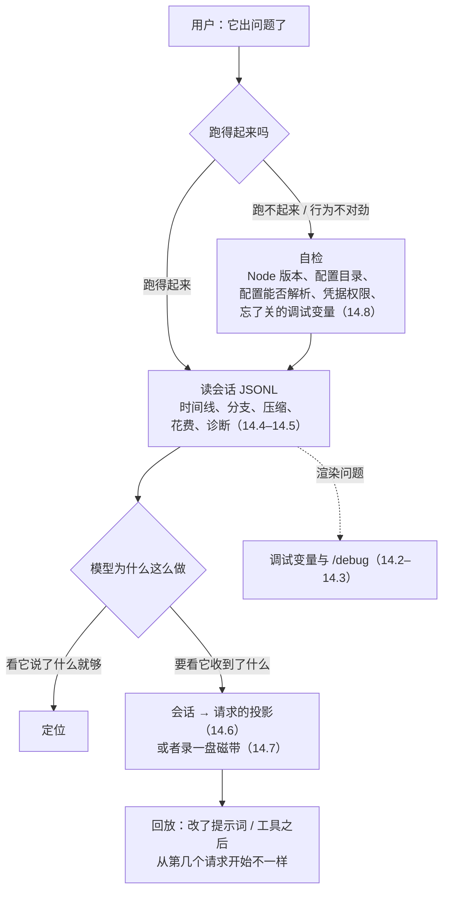
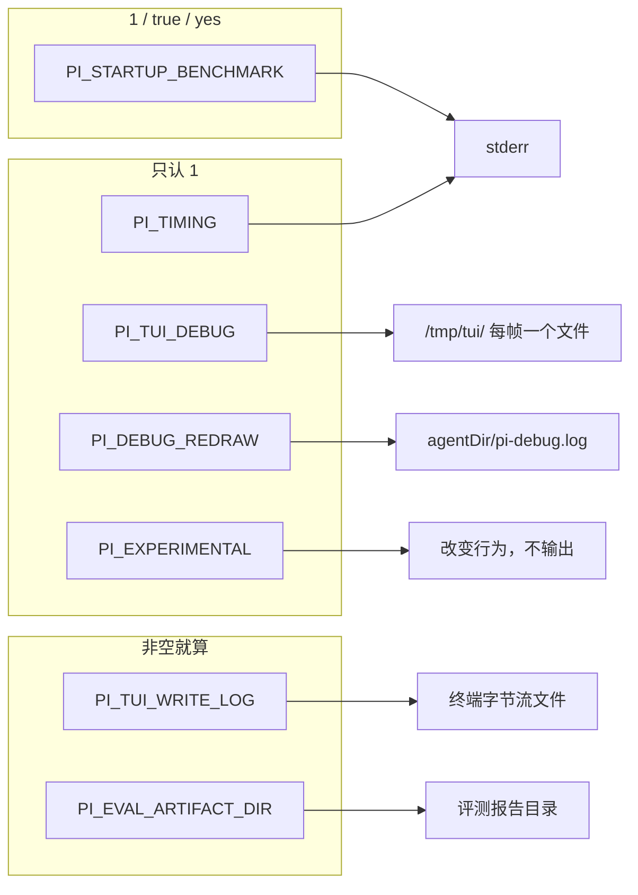
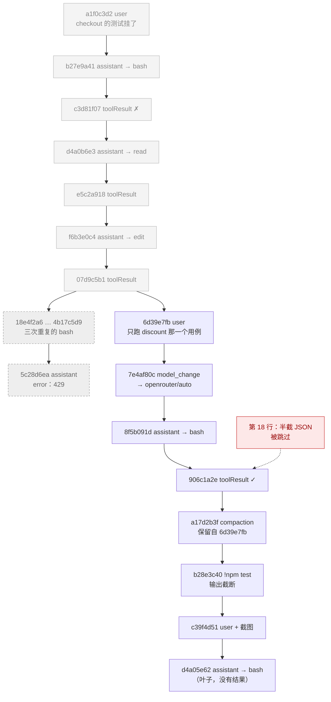
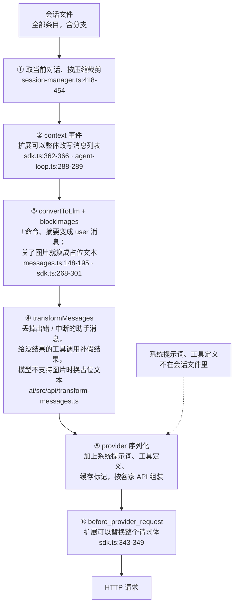
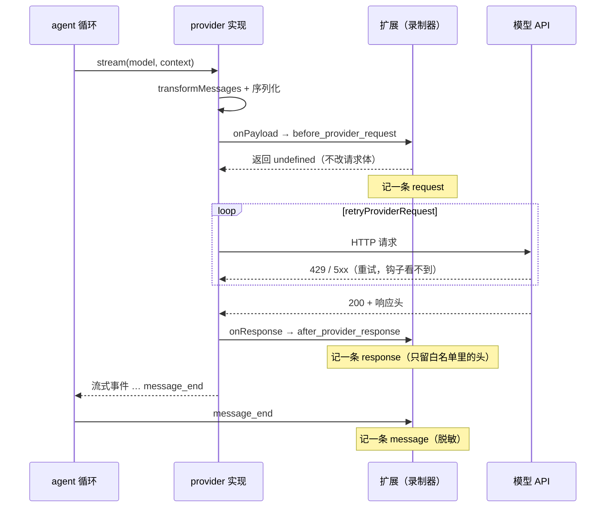

# 第 14 章 调试与排障

> 基准：pi `b79e4cc8` (v0.84.4)　·　[版本表](../../research/BASELINE.md)　·　[参与指南](../../CONTRIBUTING.md)

**状态**：✅ 已完成

## 本章回答

- 在没有结构化日志、没有 `PI_DEBUG` 的前提下怎么排障
- 七个未文档化的调试变量分别什么时候用，各自怎样才算「打开」
- 会话 JSONL 怎么读：流水、树、压缩、花费
- 会话里写的，和模型实际收到的，差在哪
- 第 4 章欠下的两样：provider 请求的录制回放，和一个自检命令（doctor）

## 素材来源

- `research/pi/08-observability.md` §8.3、§8.4、§8.5「没有自检命令」
- 对照：`Step-Code` `7dd66cb`、`minimax-code` `89c930a`
- 配套代码：[`examples/ch14-session-reader/`](../../examples/ch14-session-reader/)

---

用户报告问题的方式通常只有一句话：「它刚才做了件奇怪的事」「跑不起来了」「这次怎么花了这么多钱」。拿到这句话之后，你手里有什么？

在 pi 里，答案比大多数人预想的少。没有日志模块，没有日志级别，没有 `PI_DEBUG`；能打开的调试输出是七个散在各处、没写进任何文档的环境变量，而且大半是给终端渲染用的。真正能拿来复盘的只有一样东西：会话 JSONL。它记下了用户说了什么、模型回了什么、调了哪些工具、花了多少钱——但它记的是**会话**，不是**请求**。模型实际收到的那份请求体，中间还隔着六道改写，pi 不录。

第 4 章在能力边界表里留了两行「没做」：provider 录制回放、自检命令，都指向本章（`book/01-choosing/ch04-capability-boundary.md:68-69`、`:344`）。本章先把 pi 已有的东西用到极致，再把这两样补上。

先看几个数字：

| 数字 | 是什么 | 出处 |
| --- | --- | --- |
| **0 / 129** | 日志模块的个数 / `coding-agent` 里裸 `console.*` 的处数 | `research/pi/08-observability.md` §8.3 |
| **7 / 0** | 调试类环境变量 / 其中进了环境变量表或 `--help` 的个数 | `docs/environment-variables.md:79-95`、`cli/args.ts:430-435` |
| **3** | 「怎样算打开」的判定方式：只认 `1`、认 `1/true/yes`、非空就算 | 见 14.2 |
| **1** | `/debug` 和 `PI_DEBUG_REDRAW` 共用的文件数：`pi-debug.log` | `interactive-mode.ts:6426`、`tui-main-screen.ts:323` |
| **6** | 会话条目到 HTTP 请求之间的改写次数 | 见 14.6 |
| **2** | 能看到请求的扩展钩子：`before_provider_request`、`after_provider_response` | `core/sdk.ts:343-360` |
| **0** | 录制回放、`pi doctor` | `cli/args.ts:267-275` |

本章的顺序就是排障的顺序（图 14-1）：先说清 pi 没有什么（14.1），再看那七个变量（14.2）和两个隐藏的日志文件（14.3）；然后是本章的主体——读会话（14.4）、算钱和做诊断（14.5）；接着是会话和请求之间的落差（14.6），以及补上它的录制与回放（14.7）；14.8 补一个自检命令。14.9 简短回答「会话能不能当审计记录」，14.10 看下游怎么做，14.11 是配套代码。



*图 14-1 排障的顺序：先排除环境，再读会话，最后才看请求*

本章引用的源码路径，除非特别说明，`core/…`、`cli/…`、`modes/…`、`main.ts`、`config.ts` 相对于 `packages/coding-agent/src/`，`docs/…` 相对于 `packages/coding-agent/`；`tui/src/…`、`ai/src/…`、`agent/src/…` 相对于 `packages/`。

---

## 14.1 没有日志：console 就是输出

pi 的 `packages/*/src` 下没有 `logger.ts`，也没有 `createLogger`、`LogLevel`、`log.debug` 之类的符号。按 `console\.(log|error|warn|info|debug)\(` 数 `.ts` 文件，`coding-agent` 有 129 处，集中在 17 个文件里：`package-manager-cli.ts` 61 处、`main.ts` 27 处、`migrations.ts` 9 处、`core/model-resolver.ts` 6 处、`cli/list-models.ts` 5 处；`ai` 12 处，几乎都在它自带的命令行工具里；`agent` 1 处；`tui` 0 处。（第 4 章写的 130 处用的是更宽的匹配，差的一处不影响结论。）

这些 `console.*` 不是日志，是**输出**：给用户看的提示、警告和错误。没有级别，也就没有「调高级别多看一点」这回事。

它们去哪了，取决于运行模式。非交互模式（`-p` 打印、`--mode json`、`--mode rpc`）启动时，pi 接管 stdout（`main.ts:633-637`）：

```ts
// packages/coding-agent/src/core/output-guard.ts:54-63（节选）
process.stdout.write = ((chunk, encodingOrCallback, callback) => {
  if (typeof encodingOrCallback === "function") {
    return rawStderrWrite(String(chunk), encodingOrCallback);
  }
  return rawStderrWrite(String(chunk), callback);
}) as typeof process.stdout.write;
```

之后任何人往 stdout 写的东西，包括扩展里随手一个 `console.log`，都被改道到 stderr；真正的协议输出走 `writeRawStdout`（`modes/print-mode.ts:110`、`:125`），用接管前保存的原始写函数。这样 stdout 上只有一行一个的 JSON 事件，下游程序解析不会被污染。

对排障的含义很直接：**非交互模式下，诊断信息全在 stderr**。把 pi 接进 CI 或别的程序时，stderr 一定要单独存下来，丢了它就丢了 pi 仅有的那点诊断。

崩溃时也一样只有 stderr。交互模式注册了 `uncaughtException` 处理器（`modes/interactive/interactive-mode.ts:4062-4064`），处理体先杀掉子进程、恢复终端，再把错误打到 stderr，然后 `exit(1)`（`:4000-4017`）；不写文件，不上报。`unhandledRejection` 没有生产处理器。崩溃信息在终端上滚过去，就没了。

### 判断依据

- **没有日志模块、没有级别**：`packages/*/src` 下无 `logger.ts`、`createLogger`、`LogLevel`；`console.*` 计数见上。【代码事实】
- **非交互模式接管 stdout，杂散写入改道 stderr**：`main.ts:633-637` 在 `appMode !== "interactive"` 时调用 `takeOverStdout()`；改道见 `core/output-guard.ts:45-70`；协议输出走 `writeRawStdout`（`modes/print-mode.ts:110`、`:125`）。【代码事实】
- **崩溃只打 stderr**：`interactive-mode.ts:4000-4017`、`:4062-4064`；入口 `cli.ts:21` 直接调用 `main(...)`，没有顶层 catch。【代码事实】
- 选择是清楚的：pi 把可观测性押在会话文件上，日志这件事留给下游（第 20 章）。代价是用户报问题时，你几乎拿不到运行时的上下文，只能事后读会话。【推断】

---

## 14.2 七个调试变量，三种「打开」

没有 `PI_DEBUG`，也没有 `PI_LOG`；`DEBUG`、`NODE_DEBUG`、`VERBOSE` 在 `packages/*/src` 里零命中。能打开的调试输出是下面七个变量，**一个也不在**环境变量表（`docs/environment-variables.md:79-95`、`README.md:671-684`）和 `--help`（`cli/args.ts:430-435`）里。只有两个在别处顺带提过：`PI_TUI_WRITE_LOG` 出现在写 TUI 组件的开发文档里（`docs/tui.md:472-475`），`PI_EXPERIMENTAL` 在设置文档的一行说明里（`docs/settings.md:61`）。

| 变量 | 怎样算打开 | 作用 | 写到哪里 | 会不会落盘内容 | 出处 |
| --- | --- | --- | --- | --- | --- |
| `PI_TIMING` | 等于 `1` | 启动各阶段耗时 | stderr | 否 | `core/timings.ts:6`、`:34-50` |
| `PI_STARTUP_BENCHMARK` | `1` / `true` / `yes` | 只初始化交互界面、打印耗时后退出；非交互模式直接报错 | stderr | 否 | `main.ts:105-108`、`:911-915` |
| `PI_TUI_DEBUG` | 等于 `1` | 每一帧差分渲染的内部状态和前后两帧全文 | `/tmp/tui/render-*.log`，每帧一个文件 | **是** | `tui/src/tui-main-screen.ts:568-590` |
| `PI_DEBUG_REDRAW` | 等于 `1` | 每次全量重绘的原因 | `<agentDir>/pi-debug.log`，追加 | 否 | `tui/src/tui-main-screen.ts:320-327` |
| `PI_TUI_WRITE_LOG` | 非空 | 写往终端的原始 ANSI 字节流 | 给目录则写 `tui-<时间>-<pid>.log`，否则当文件路径；追加，写失败静默 | **是** | `tui/src/terminal.ts:138-151`、`:476-483` |
| `PI_EXPERIMENTAL` | 等于 `1` | 打开实验特性；不输出东西，改变行为 | — | 否 | `core/experimental.ts:3-9` |
| `PI_EVAL_ARTIFACT_DIR` | 非空 | 评测框架落盘每次运行的报告，只在 evals 包里有效 | 指定目录 | **是** | `evals/src/vitest-evals/reporter.ts:14-16` |



*图 14-2 七个调试变量按判定方式分组；七个里五个和终端渲染或启动有关*

这张表里有三件事值得注意。

**第一，同样写 `true`，有的生效有的不生效。** `PI_TIMING=true` 什么也不做，`PI_STARTUP_BENCHMARK=true` 生效。用户照着某个 issue 里的写法设了变量、看不到输出，第一反应是「这个版本没这功能了」，而不是「值写错了」。

**第二，两个变量会把对话内容落盘。** `PI_TUI_WRITE_LOG` 记下写往终端的每一个字节，渲染出来的提示词、模型回复、文件内容都在里面；`PI_TUI_DEBUG` 每帧写一个文件，带前后两帧全文，开一会儿就是成百上千个。两者都只写本地，不外发，但用完要删。

**第三，分布偏向渲染。** 七个里有四个是终端渲染或启动用的，没有一个能告诉你「provider 收到了什么」「模型为什么调了这个工具」。这和 tui 包的体量是一致的：终端渲染是 pi 自己最常调的东西。agent 和 provider 层面的问题，这些变量帮不上。

`PI_EXPERIMENTAL` 要单独说一句：它不是调试输出，它改变行为。复现别人的问题时，两边这个变量要设成一样，否则你们跑的不是同一个程序。

配套代码把这张表写成了数据，拿一组环境变量去对（演示第 6 段用的是一组示例值；`npm start -- --env` 对当前环境做同样的事）：

```text
== 6. 调试变量：同样写 true，有的生效有的不生效 ==
  PI_TIMING=true → 不生效
    · 设成了 "true"，但这个变量只在「等于 1」时生效
  PI_STARTUP_BENCHMARK=true → 生效
  PI_DEBUG_REDRAW=1 → 生效
    · 和 /debug 写同一个文件，按一次 /debug 就把之前的重绘记录覆盖了
  PI_TUI_WRITE_LOG=/tmp/pi-tty → 生效
    · 会把内容落盘：给目录则写 tui-<时间>-<pid>.log，否则当文件路径；追加，写失败静默；用完记得删
  日志目录：~/.pi/agent
```

它只读这七个变量，不读、不回显环境里的其他变量。

### 判断依据

- **七个变量都不在环境变量表和 `--help` 里**：`docs/environment-variables.md:79-95`、`README.md:671-684`、`cli/args.ts:430-435` 三处均无；顺带提及见 `docs/tui.md:472-475`、`docs/settings.md:61`。【代码事实】
- **三种判定方式**：`PI_TIMING`、`PI_TUI_DEBUG`、`PI_DEBUG_REDRAW`、`PI_EXPERIMENTAL` 比较 `=== "1"`；`PI_STARTUP_BENCHMARK` 认 `1/true/yes`；另两个只看非空。出处见表。【代码事实】
- **两个变量落盘内容**：`tui/src/terminal.ts:138-151`、`:476-483`；`tui/src/tui-main-screen.ts:568-590`。【代码事实】
- 判定方式不统一说明这些变量是各自需要时加的，没有人把它们当成一个面向用户的功能来设计。【推断】

---

## 14.3 `/debug` 与 `pi-crash.log`

另有两个文件会出现在配置目录里。

**`/debug` 是隐藏命令。** 交互模式下输入 `/debug`，或按 `Shift+Ctrl+D`，pi 把当前屏幕和对话写进 `<agentDir>/pi-debug.log`（`interactive-mode.ts:6402-6433`）：

```ts
// packages/coding-agent/src/modes/interactive/interactive-mode.ts:6408-6426（节选）
const debugData = [
  `Debug output at ${new Date().toISOString()}`,
  `Terminal: ${width}x${height}`,
  `Total lines: ${allLines.length}`,
  "",
  "=== All rendered lines with visible widths ===",
  ...allLines.map((line, idx) => { /* [idx] (w=宽度) 转义后的行 */ }),
  "",
  "=== Agent messages (JSONL) ===",
  ...this.session.messages.map((msg) => JSON.stringify(msg)),
  "",
].join("\n");
fs.writeFileSync(debugLogPath, debugData);
```

它不在内置命令表里（`core/slash-commands.ts:19-43`），补全看不到。内容是两样：渲染出来的每一行和它的可见宽度，以及 agent 当前持有的全部消息。后者是**压缩之后的消息列表**，不是会话文件，压缩掉的历史不在里面。

三个坑：

- **覆盖写**（`writeFileSync`），每次 `/debug` 都只留最后一次。
- **和 `PI_DEBUG_REDRAW` 是同一个文件**。重绘原因是追加写进 `pi-debug.log` 的（`tui-main-screen.ts:323-326`）；开着 `PI_DEBUG_REDRAW` 排查闪屏时按一次 `/debug`，之前积累的重绘记录就没了。
- **里面是完整对话**，一样需要用完就删。

**`pi-crash.log` 只管一件事**：渲染出的某一行比终端宽。这是差分渲染的不变量，一旦破坏，pi 把整屏渲染结果写进 `<agentDir>/pi-crash.log`，然后抛错（`tui-main-screen.ts:516-529`）。别的崩溃不会写这个文件。看到它，问题几乎一定在某个组件（很可能是扩展画的组件）没有按宽度截断。

### 判断依据

- **`/debug` 隐藏、覆盖写、带完整消息**：`interactive-mode.ts:6402-6433`；不在 `core/slash-commands.ts:19-43` 的 23 个内置命令里。【代码事实】
- **与 `PI_DEBUG_REDRAW` 同一个文件**：两处都拼 `pi-debug.log`（`config.ts:573-575`、`tui-main-screen.ts:323`），一个覆盖写，一个追加写。【代码事实】
- **`pi-crash.log` 只在行宽越界时写**：`tui-main-screen.ts:516-529`。【代码事实】
- `/debug` 一条命令同时抓渲染状态和对话，是给作者自己收 bug 报告用的；它不进补全，说明作者没打算让普通用户用。【推断】

---

## 14.4 读会话 JSONL：文件是流水，会话是树

前三节的东西都是辅助。pi 真正的可观测性是会话文件：默认开启，每一次对话都完整落盘。

### 在哪里

```
<agentDir>/sessions/<按 cwd 编码的目录>/<ISO 时间戳>_<会话 id>.jsonl
```

`<agentDir>` 缺省是 `~/.pi/agent`，可以用 `PI_CODING_AGENT_DIR` 改（`config.ts:524-530`）。目录名把 cwd 里的 `/`、`\`、`:` 换成 `-`，两头加 `--`（`core/session-manager.ts:476-481`）：`/work/shop` 变成 `--work-shop--`。这个编码有损，`/work/shop` 和 `/work-shop` 会落进同一个目录。文件名里的时间戳把 `:` 和 `.` 也换成了 `-`（`:953-954`）。

### 长什么样

第一行是会话头（`type: "session"`，带 `version`、`id`、`cwd`），当前版本是 3（`core/session-manager.ts:30`）。之后每行一个条目，每个条目都有 `type`、`id`、`parentId`、`timestamp`（`:46-51`）。最常见的是 `message`，里面装一条 user、assistant、toolResult 或 bashExecution 消息；另外有 `compaction`（压缩摘要）、`branch_summary`（分支摘要）、`model_change`、`thinking_level_change`、`label`、扩展写的 `custom` 和 `custom_message`。

助手消息带的信息很密（`ai/src/types.ts:427-440`）：请求的 `model` 和 provider 实际返回的 `responseModel` 分开存，`responseId` 可以拿去找 provider 对账，`usage` 里有四类 token 和算好的 `cost`，还有 `stopReason` 和 `errorMessage`。

### 文件是流水，会话是树

这是读会话最容易误会的地方。文件按时间顺序追加，但条目之间靠 `parentId` 连成一棵树。pi 加载时把**文件最后一条**当成叶子（`core/session-manager.ts:964-967`），从叶子沿 `parentId` 走回根，这条路径才是「当前这条对话」（`:334-360`）。不在这条路径上的条目，是用户回到更早的某一步、换个说法重新问时留下的分支，它们还在文件里，但已经不属于当前对话。

再叠一层压缩：如果路径上有 `compaction` 条目，发给模型的上下文只剩**最近一次压缩的摘要、它保留的尾巴（从 `firstKeptEntryId` 开始）和它之后的条目**（`:418-454`）。

配套代码的演示会话有 20 个条目，把这几种情况都放进去了：



*图 14-3 演示会话的树：虚线框是被放弃的分支，灰色是已被压缩、模型看不到原文的条目*

演示第 1–3 段读出来是这样：

```text
== 1. 读文件：坏行要报出来，不能静默跳过 ==
  会话 0199a1c2-7f3c-7a10-9b2e-5d4c3b2a1f00 · 版本 3 · cwd /work/shop
  应在 <agentDir>/sessions/--work-shop--/2026-09-30T02-14-05-000Z_0199a1c2-7f3c-7a10-9b2e-5d4c3b2a1f00.jsonl
  条目 20 · 跳过的行 1 · 叶子 d4a05e62
  当前对话 15 条 · 不在当前对话上 5 条 · 发给模型的上下文 8 条
  第 18 行：半截或损坏的 JSON：{"type":"message","id":"e5b16f73","paren…

== 2. 文件是流水，会话是树 ==
  叶子 = 文件最后一条 = d4a05e62
  不在当前对话上：18e4f2a6 29f5a3b7 3a06b4c8 4b17c5d9 5c28d6ea
  上下文：a17d2b3f 6d39e7fb 7e4af80c 8f5b091d 906c1a2e b28e3c40 c39f4d51 d4a05e62

== 3. 当前对话的时间线（░ = 已被压缩，模型看不到原文） ==
  ░ 02:14:05 a1f0c3d2 user       checkout 的测试挂了，帮我看看
  ░ 02:14:09 b27e9a41 assistant  [toolUse] 先跑一下失败的用例。 → bash({"command":"npm test -- checkout…)
  ░ 02:14:14 c3d81f07 toolResult ✗ bash: FAIL test/checkout.test.ts ✕ 会员价叠加满减 (12…
  ░ 02:14:17 d4a0b6e3 assistant  [toolUse] read({"path":"src/checkout.ts"})
  ░ 02:14:17 e5c2a918 toolResult ✓ read: export function total(cart: Cart, member…
  ░ 02:14:24 f6b3e0c4 assistant  [toolUse] 满减在会员折扣之前算漏了，改一下顺序。 → edit({"path":"src/checkout.ts","oldTe…)
  ░ 02:14:24 07d9c5b1 toolResult ✓ edit: Successfully replaced text in src/checko…
    02:16:05 6d39e7fb user       先别跑整个文件，只跑 discount 那一个用例；用我的 key 走 openrouter
    02:16:07 7e4af80c model      → openrouter/auto
    02:16:12 8f5b091d assistant  [toolUse] bash({"command":"OPENAI_API_KEY=sk-de…)
    02:16:18 906c1a2e toolResult ✓ bash: PASS test/checkout.test.ts ✓ 会员价叠加满减 (9 …
    02:19:05 a17d2b3f compaction 压缩前 48210 tokens，保留自 6d39e7fb：用户要修 checkout 测试；已把满减移到会员折扣之前，di…
    02:19:15 b28e3c40 !bash      npm test → exit 1（截断，全文在 /tmp/pi-bash-5f1c0a.log）
    02:19:35 c39f4d51 user       CI 上还是红的，看截图 [+1 张图]
    02:19:41 d4a05e62 assistant  [toolUse] 截图里失败的是 e2e，跑一下。 → bash({"command":"npm run e2e"})
```

「当前对话 15 条」里有 7 条前面打了 `░`：它们在当前对话的路径上，但在压缩点之前，又不在保留的尾巴里，模型已经看不到原文了。用户说「我前面明明告诉过它」时，先看那句话是不是在 `░` 里。

### 读的时候要知道的七件事

1. **坏行被静默跳过。** pi 读文件时 `JSON.parse` 失败的行直接丢掉，不报（`core/session-manager.ts:503-511`）。演示里第 18 行是半截 JSON，pi 照样能打开这个会话，只是那一条凭空消失了。读会话的工具一定要把跳过的行号报出来。
2. **第一条回复之前不落盘。** 会话里还没有助手消息时，条目只在内存里，文件不存在（`:1019-1027`）。用户说「我刚打了一句话它就卡住了」，你在磁盘上找不到这次会话是正常的。
3. **不完全是追加写。** 打开旧版本的会话文件会触发迁移，整个文件原地重写一次（`:918-919`）；从某个叶子另存一个分支会话，是写一个新文件（`:1414`、`:1486`）。其余时候是 `appendFileSync`（`:1022`、`:1041`）。
4. **回走没有防环。** 沿 `parentId` 走回根的循环不检查重复（`:352-357`）。正常写入不会成环，手工编辑或别的工具写坏的文件可能会；读会话的工具应当自己防。
5. **重复的 `id` 后写覆盖先写。** 索引是一个 `Map`，同一个 `id` 出现两次时后一条生效，不报。
6. **`!` 命令的完整输出不在会话里。** 用户在输入框里用 `!` 执行的命令，输出太长时会话只留截断版本和一个临时文件路径（`core/bash-executor.ts:113-128`）；那个文件是系统临时目录下的 `pi-bash-<id>.log`（`:64-69`），不在会话目录里，过一阵就没了。
7. **图片按 base64 内联**（`ai/src/types.ts:366-370`）。一张截图就是几百 KB，把会话文件发给别人之前要想到这一点（演示第 7 段的脱敏会移除图片）。

### 判断依据

- **位置、命名、版本**：`core/session-manager.ts:30`、`:476-481`、`:953-954`；`config.ts:524-530`。【代码事实】
- **叶子 = 文件最后一条，路径靠回走**：`core/session-manager.ts:964-967`、`:334-360`；上下文的压缩规则 `:418-454`。【代码事实】
- **坏行静默跳过**：`parseSessionEntryLine` 的 `catch` 直接返回 `null`（`:503-511`）。【代码事实】
- **首条回复前不落盘、迁移原地重写、分支另存新文件**：`:1016-1043`、`:918-919`、`:1414-1486`。【代码事实】
- **`!` 命令全文在临时文件**：`core/bash-executor.ts:64-69`、`:113-128`。【代码事实】
- 「静默跳过坏行」和「第一条回复前不落盘」都是对用户友好的选择：坏一行不至于打不开整个会话，误启动不会留下空文件。代价落在排障的人身上：文件不说它少了什么。【推断】

---

## 14.5 花费与诊断

### 钱是怎么算的

「这次怎么这么贵」是最常见的问题之一。会话里的钱有三件事要分清。

**第一，每条助手消息的 `cost` 是写死的。** 收到回复那一刻，pi 按当时的价格表算好，写进 `usage.cost`（`ai/src/models.ts:878-898`），之后不再重算。价格表更新了，历史会话里的数不变。演示里 `b27e9a41` 记录的是 $0.0365，同样的用量按新价格表算是 $0.0306——两个数都对，回答的是不同的问题。

**第二，`/session` 和底栏显示的是文件里全部条目之和。** `getSessionStats` 的注释写得很明白：「Aggregates over ALL session entries (including history that was compacted away)」（`core/agent-session.ts:3318-3322`）。被放弃的分支、被压缩掉的历史、压缩和分支摘要本身的那次请求，都算钱。这是对的——这些请求确实发生了、确实计费了——但用户看着「当前这条对话」去对账时会对不上。

**第三，按模型拆分时，记在实际回答的模型名下。** 拆分的键是 `provider/responseModel ?? model`（`core/usage-totals.ts:44`）。走 OpenRouter 的 `auto` 时，钱记在它路由到的那个模型上，而不是 `auto`；压缩摘要和带用量的工具结果另记一栏 `Tools/summaries`（`:46-51`）。

演示第 4 段把这三个数都算出来：

```text
== 4. 花费：/session 显示的是全部条目之和 ==
  文件里全部条目：$0.1237  ← /session 和底栏显示的数
  只算当前对话：  $0.1164
  被放弃的分支：  $0.0073
    anthropic/claude-sonnet-4-5          $0.0545  ↑6000 ↓365 R23032 W6440
    openrouter/anthropic/claude-sonnet-4.5 $0.0357  ↑8620 ↓99 R4105 W1890
    Tools/summaries                      $0.0335  ↑9120 ↓410 R0 W0
  b27e9a41 记录的花费 $0.0365；同样的用量按新价格表算是 $0.0306——历史不跟着变
```

`Tools/summaries` 一栏占了四分之一以上，这一栏就是那次 48210 token 的压缩。「最近怎么变贵了」的答案，常常是「压缩触发得太频繁」。

### 诊断：先看哪几条

读完树、算完钱，配套代码把排障时先看的几件事按严重程度列出来：

```text
== 5. 诊断 ==
  [高] 第 18 行被跳过（半截或损坏的 JSON：{"type":"message","id":"e5b16f73","paren…）
  [高] d4a05e62 bash(toolu_07) 没有结果：工具执行中会话就断了
  [中] b27e9a41 bash 返回错误
  [中] 5c28d6ea ［已放弃的分支］anthropic/claude-sonnet-4-5 error：429 Too Many Requests: rate limit exceeded
  [提示] 8f5b091d 请求的是 auto，实际回答的是 anthropic/claude-sonnet-4.5
  [提示] d4a05e62 请求的是 auto，实际回答的是 anthropic/claude-sonnet-4.5
  [提示] b28e3c40 !npm test 的完整输出不在会话里，只在 /tmp/pi-bash-5f1c0a.log
  [提示] 18e4f2a6 ［已放弃的分支］bash 返回错误
  [提示] 3a06b4c8 ［已放弃的分支］bash 返回错误
  [提示] 3a06b4c8 ［已放弃的分支］bash 同样的参数第 3 次调用（第一次在 b27e9a41）
  [提示] 5 个条目不在当前对话上（被放弃的分支），但算进了花费
  [提示] 当前对话里有 7 个条目已被压缩，模型看不到原文
```

分级的标准是「它会不会让你读错这份记录」：

- **高**：文件结构坏了（坏行、重复 id、父条目不存在、成环），或者会话停在一个工具调用上、没有结果。后者几乎总是意味着工具执行时进程退了——崩溃、被杀、或者用户关了终端。下一次接着这个会话问，pi 会给这个调用补一条假的错误结果（14.6）。
- **中**：没有破坏结构，但很可能就是问题所在：工具报错、助手消息带 `stopReason: "error"`。
- **提示**：读记录时需要的背景：模型被路由到了别处、`!` 命令的全文不在会话里、同样的调用在原地打转、有多少条已被压缩。

被放弃的分支上的问题会标出来，但降一级：用户已经回退了，它们不再影响当前对话，但能解释「为什么用户回退了」。演示里的 429 就是这样——用户撞上限流，回到更早的一步重新问。

### 发给别人之前先脱敏

排障常常意味着把会话文件发给别人。pi 记下的工具参数是原样的：写会话时直接 `JSON.stringify`，没有 replacer（`core/session-manager.ts:1022`、`:1034`、`:1041`）。用户在命令行里带的密钥、贴进对话的 token，都在文件里。演示第 7 段：

```text
== 7. 发给别人之前先脱敏 ==
  之前：{"type":"toolCall","id":"toolu_06","name":"bash","arguments":{"command":"OPENAI_API_KEY=sk-demo-not-a-real-key-000000 npm test -- -t discount"}}
  之后：{"type":"toolCall","id":"toolu_06","name":"bash","arguments":{"command":"OPENAI_API_KEY=[已脱敏] npm test -- -t discount"}}
  遮掉密钥 1 处 · 移除图片 1 张（96 字节 base64）
```

脱敏只改值，不改 `id` 和 `parentId`，所以脱敏后的副本还是同一棵树，拿到的人可以照样读时间线、算钱、做诊断。规则是启发式的：几种常见的密钥格式，加上「变量名里带 KEY / TOKEN / SECRET / PASSWORD 的赋值」。它能挡住常见情况，挡不住所有东西，发出去之前还是要有人看一遍。

### 判断依据

- **花费在收到回复时算好、写死**：`ai/src/models.ts:878-898` 就地写 `usage.cost`。【代码事实】
- **`/session` 汇总全部条目**：`core/agent-session.ts:3318-3353`，注释原文见上。【代码事实】
- **按 `responseModel` 归属，摘要另记一栏**：`core/usage-totals.ts:40-52`。【代码事实】
- **工具参数原样落盘**：`core/session-manager.ts:1022`、`:1034`、`:1041` 均为 `JSON.stringify(entry)`。【代码事实】
- 「汇总全部条目」是按账单的视角，「当前对话」是按用户的视角。pi 只给了前者，后者要自己算；两个数并排放，大部分「对不上」的疑问就没了。【推断】

---

## 14.6 会话里写的 ≠ 模型收到的

会话文件告诉你**发生了什么**，但「模型为什么这么做」要看**它收到了什么**。这两者之间隔着六步（图 14-4）：



*图 14-4 从会话条目到 HTTP 请求的六步；②和⑥两处可以被扩展任意改写*

逐步看哪些东西会变：

1. **只取当前对话，按压缩裁剪，再把条目投影成消息。** 被放弃的分支不发；压缩点之前、保留尾巴之外的条目不发，换成一条摘要（14.4）。投影时只有消息、扩展消息、分支摘要、压缩摘要四类条目产生内容，`model_change`、`thinking_level_change` 之类的条目只是记录，到这里就没了（`core/session-manager.ts:382-407`）。
2. **`context` 事件。** 扩展能拿到整个消息列表，返回一个新的（`core/sdk.ts:362-366`，在 agent 循环里先于转换调用，`agent/src/agent-loop.ts:288-289`）。装了改写上下文的扩展，模型收到的就可能和会话完全不同。
3. **`convertToLlm`。** 只有 user、assistant、toolResult 三种角色能发给模型。`!` 命令的输出、压缩摘要、分支摘要、扩展插入的消息，都被包成一条 user 消息（`core/messages.ts:148-195`）；用 `!!` 前缀跑的命令标了 `excludeFromContext`，在这一步被丢掉（`:153-156`）。打开了「禁止读图」的设置时，图片在这一步就换成占位文本（`core/sdk.ts:268-301`）。
4. **`transformMessages`。** 这一步在各 provider 的实现里（例如 `ai/src/api/anthropic-messages.ts:981`）。出错或中断的助手消息**整条丢掉**（`transform-messages.ts:189-197`，注释说重放半截的回合会让 API 报错）；没有结果的工具调用，补一条内容为 `No result provided`、`isError: true` 的假结果（`:158-180`、`:219-220`）；模型不支持图片时，图片换成占位文本（`:12-36`）。
5. **provider 序列化。** 系统提示词和工具定义这时才加进来，它们**根本不在会话文件里**。缓存标记、思考参数、各家 API 的字段名也在这一步。
6. **`before_provider_request`。** 请求体组装好、发出去之前的最后一个钩子，扩展返回什么，发出去的就是什么（`core/sdk.ts:343-349`）。

配套代码的 `wire.ts` 模拟了第 1、3、4 步，把演示会话投影成模型收到的消息序列：

```text
== 8. 会话里写的，和模型收到的（假设接着问下一句，当前模型不支持图片） ==
  user       ← a17d2b3f  压缩摘要变成一条 user 消息
  user       ← 6d39e7fb
  assistant  ← 8f5b091d
  toolResult ← 906c1a2e
  user       ← b28e3c40  ! 命令变成一条 user 消息
  user       ← c39f4d51  1 张图片换成了占位文本
  assistant  ← d4a05e62
  toolResult ← （凭空）  补给 bash(toolu_07) 的假结果，isError=true，会话文件里没有这一条
  不发        ✗ 7e4af80c  model_change 条目只是记录，不发给模型
```

倒数第二行最值得注意：会话停在一个没有结果的工具调用上，下一次请求里模型会看到一条「这个工具报错了」的结果，而会话文件里根本没有这一条。用户接着问「刚才那个命令跑完了吗」，模型的回答是基于这条凭空出现的错误。

`wire.ts` 不模拟第 2、5、6 步：扩展做了什么无从得知，provider 序列化因 API 而异。要看最终形态，只能录。

### 判断依据

- **六步的位置**：见图 14-4 中的出处；条目到消息的投影在 `core/session-manager.ts:382-407`；agent 循环里 `transformContext` 先于 `convertToLlm`（`agent/src/agent-loop.ts:288-293`），流函数在 `:306` 调用。【代码事实】
- **出错的助手消息整条不发**：`ai/src/api/transform-messages.ts:189-197`。【代码事实】
- **补假结果**：`ai/src/api/transform-messages.ts:158-180`、`:219-220`。【代码事实】
- **系统提示词和工具定义不在会话里**：会话条目类型中没有它们；它们由 agent 状态在每次请求时提供。【代码事实】
- 第 4 步的两个改写（丢掉出错的回合、补假结果）都是为了让请求合法、让模型能接着干活，是对的选择；代价是会话和请求之间多了一层不可见的差异，排障的人必须知道它存在。【推断】

---

## 14.7 录制与回放

pi 不录请求，但留了两个钩子，足够自己录：`before_provider_request` 在请求体组装完、发出去之前触发，`after_provider_response` 在收到响应头之后触发（`core/extensions/types.ts:693-697`、`:709-714`；接线在 `core/sdk.ts:343-360`）。

录之前，要先弄清这两个钩子**在什么时候**触发，因为这决定了磁带上有什么、没有什么（图 14-5）：



*图 14-5 一次请求的录制时序：重试在两个钩子之间，失败的尝试磁带上看不到*

几件要知道的事：

- **`onPayload` 在重试之前，`onResponse` 在重试成功之后。** Anthropic 的实现里，`onPayload` 在 `:566`，重试循环 `retryProviderRequest` 在 `:575-582`（SDK 自己的重试关掉了，`maxRetries: 0`），`onResponse` 在 `:583`，只在拿到成功响应之后调用（`ai/src/api/anthropic-messages.ts`）；OpenAI 兼容的实现同样的顺序（`ai/src/api/openai-completions.ts:352`、`:361-368`、`:369`）。所以被重试了三次的请求，磁带上只有一条；最终失败的请求，磁带上只有 request、没有 response。
- **摘要请求不经过钩子。** 压缩和分支摘要用的是 `streamFn` 或 `completeSimple`（`core/compaction/compaction.ts:587-598`），`agent-session.ts:1917`、`:3207` 传进去的是 `this.agent.streamFunction`，不走 `onPayload`。演示里那次 48210 token 的压缩，磁带上没有。
- **自定义的 `streamSimple` 也绕过钩子。** 第 11 章讲过，provider 扩展自己实现流函数时，`onPayload` 由它自己决定调不调。
- **返回值会替换请求体。** runner 按扩展加载顺序依次调用处理器，任何一个返回非 `undefined` 的值，后面的处理器和真正发出去的请求都用这个新值（`core/extensions/runner.ts:1066-1098`）。录制器必须返回 `undefined`。
- **处理器抛错不会挡住请求。** `catch` 之后只是 `emitError`，请求照常发出（`:1084-1092`）。这是 fail-open，第 8 章讨论过它对安全扩展意味着什么；对录制器而言正合适——磁盘满了不该让对话停下来。

录制器本身很短，写盘由调用方注入，模块不碰文件：

```ts
// examples/ch14-session-reader/src/recorder.ts:81-98
export function createRecorder(deps: RecorderDeps): Recorder {
  let seq = 0; // 录制器自己的计数，不是会话状态
  const write = (record: TapeRecord) => deps.append(`${JSON.stringify(record)}\n`);
  return {
    onRequest(payload, ctx) {
      seq += 1;
      const { value, stats } = redactJson(payload);
      write({ kind: "request", seq, at: deps.now(), ...ctx, fingerprint: fingerprint(value), redactedSecrets: stats.secrets, payload: value });
      return undefined;
    },
    onResponse(status, headers) {
      write({ kind: "response", seq, at: deps.now(), status, headers: keepHeaders(headers) });
    },
    onAssistantMessage(message) {
      write({ kind: "message", seq, at: deps.now(), message: redactJson(message).value });
    },
  };
}
```

三个设计点：

- **落盘前脱敏。** 请求体里是完整的系统提示词、全部历史和工具参数，比会话文件还全。用的是和 14.5 同一套规则。
- **响应头只留白名单。** `retry-after`、`request-id`、限流相关的头留下，`set-cookie` 之类一律不记（`recorder.ts:40-48`）。
- **记下发请求时的 `leafId`。** 磁带和会话文件靠它对上：第几个请求是在会话的哪一步发出的。

接进 pi 的扩展只做接线（`extension/record-provider.ts:39-48`），磁带文件用 `0600` 创建（`:35`）：

```ts
// examples/ch14-session-reader/extension/record-provider.ts:39-48
pi.on("before_provider_request", (event, ctx) => {
  if (!target()) return undefined;
  return recorder.onRequest(event.payload, { sessionId: ctx.sessionManager.getSessionId(), leafId: ctx.sessionManager.getLeafId() });
});
pi.on("after_provider_response", (event) => {
  if (target()) recorder.onResponse(event.status, event.headers);
});
pi.on("message_end", (event) => {
  if (target() && event.message.role === "assistant") recorder.onAssistantMessage(event.message);
});
```

用法是 `pi -e ./extension/record-provider.ts --tape /tmp/pi-tape.jsonl`；不给 `--tape` 就什么都不做。

### 读磁带

演示第 9 段是一盘八个请求的磁带，读完之后和会话对一遍：

```text
== 9. 录制：一次请求一条，落盘前脱敏 ==
  #1 叶子 a1f0c3d2 · claude-sonnet-4-5 · system 79 字 · 1 条消息 · 4 个工具 → HTTP 200 · c95a4feabef7aac6
  #2 叶子 c3d81f07 · claude-sonnet-4-5 · system 79 字 · 3 条消息 · 4 个工具 → HTTP 200 · 7c01c24fffc30bb7
  #3 叶子 e5c2a918 · claude-sonnet-4-5 · system 79 字 · 5 条消息 · 4 个工具 → HTTP 200 · 39be818069f1ad3a
  #4 叶子 07d9c5b1 · claude-sonnet-4-5 · system 79 字 · 7 条消息 · 4 个工具 → HTTP 200 · 92d77ef28b005b65
  #5 叶子 29f5a3b7 · claude-sonnet-4-5 · system 79 字 · 9 条消息 · 4 个工具 → HTTP 200 · 89e9cc148a193f0e
  #6 叶子 4b17c5d9 · claude-sonnet-4-5 · system 79 字 · 11 条消息 · 4 个工具 → （无响应头） · f73ccce8a2a0959e
  #7 叶子 7e4af80c · auto · system 79 字 · 8 条消息 · 4 个工具 → HTTP 200 · 76f7736ac502a2e3
  #8 叶子 c39f4d51 · auto · system 79 字 · 6 条消息 · 4 个工具 → HTTP 200 · 588cc8c191d39546
  [中] #6 只有请求、没有响应头：请求没成功。被重试或最终失败的响应多数 provider 上不触发钩子
  [提示] 会话里有 1 次摘要请求（压缩 / 分支摘要），它们不经过钩子，磁带里没有
  [提示] 落盘前遮掉了请求体里的 1 处密钥
```

`#6` 就是会话里那次 429：请求发出去了，重试用完仍然失败，`onResponse` 没有被调用。`#8` 的消息数比 `#7` 少——中间发生了压缩，上下文变短了。这两件事，单看会话文件都看不出来。

要说清楚的是：**这盘磁带不是真录的**。它由演示会话推导出来（`src/demo-tape.ts`），用来展示格式和读法；扩展本身只在一个模拟的 `pi` 对象上测过（`extension/record-provider.test.ts`），没有在真的 pi 进程里跑过。

### 回放：从第几个请求开始不一样

磁带的第二个用处是回放：改了系统提示词或工具定义之后，把同一段对话重跑一遍，看从第几个请求开始和以前不一样。每条请求先比指纹（脱敏后的请求体键排序再 SHA-256），不一样再找第一处差异：

```ts
// examples/ch14-session-reader/src/replay.ts:34-50
export function firstDiff(a: unknown, b: unknown, path = "$"): { path: string; a: unknown; b: unknown } | undefined {
  if (Array.isArray(a) && Array.isArray(b)) {
    for (let i = 0; i < Math.max(a.length, b.length); i++) {
      const d = firstDiff(a[i], b[i], `${path}[${i}]`);
      if (d) return d;
    }
    return undefined;
  }
  if (isObject(a) && isObject(b)) {
    for (const k of [...new Set([...Object.keys(a), ...Object.keys(b)])].sort()) {
      const d = firstDiff(a[k], b[k], `${path}.${k}`);
      if (d) return d;
    }
    return undefined;
  }
  return canonical(a) === canonical(b) ? undefined : { path, a, b };
}
```

新请求也要先过同一套脱敏再比（`replay.ts:57`），否则带密钥的请求永远对不上。演示第 10 段：

```text
== 10. 回放：从第几个请求开始和录的不一样 ==
  原样重跑：8/8 命中
  改了系统提示词：命中 0 个，#1 分岔于 $.system
      磁带：…g agent harness.
      现在：…g agent harness. Be terse.
  改了 6d39e7fb 那句话：命中 6 个，#7 分岔于 $.messages[7].content
      磁带：先别跑整个文件，只跑 discount 那一个用例；用我的 key 走 openrouter
      现在：只跑 discount 那一个用例
```

系统提示词在每个请求里，改了它，第一个请求就分岔；改一句用户的话，分岔点就在那句话第一次出现的请求上。分岔的位置用 JSONPath 写出来，直接告诉你「是哪个字段变了」。

回放只做了比对这一半。命中之后要把录下的回答交还给 pi，办法是喂给 pi 自带的 faux provider：它接受一组预设回答，回答也可以是按请求算出来的函数（`ai/src/providers/faux.ts:76-99`、`:107-114`）。本例没有接这一步，因为它要求依赖 pi 的包。

### 判断依据

- **两个钩子的位置和接线**：`core/extensions/types.ts:693-697`、`:709-714`；`core/sdk.ts:343-360`。【代码事实】
- **`onPayload` 在重试前、`onResponse` 只在成功后**：`ai/src/api/anthropic-messages.ts:566`、`:575-583`；`ai/src/api/openai-completions.ts:352`、`:361-369`；重试实现 `ai/src/utils/provider-retry.ts:105`。【代码事实】
- **摘要请求不经过钩子**：`core/compaction/compaction.ts:587-598`；`core/agent-session.ts:1917`、`:3207`。【代码事实】
- **处理器链、返回值替换、fail-open**：`core/extensions/runner.ts:1066-1098`。【代码事实】
- **演示磁带是推导的，扩展只在模拟对象上测过，回放未接 faux provider**：`src/demo-tape.ts`、`extension/record-provider.test.ts`、`src/replay.ts:1-4`。【代码事实】
- pi 选择只给钩子、不内置录制，代价是每个需要录的人都要自己弄清这些时序；好处是录什么、存哪、怎么脱敏完全由用户决定，核心里不多一个会落盘敏感内容的功能。【推断】

---

## 14.8 自检：pi 没有 doctor

用户说「跑不起来」或者「设置不生效」，问题往往不在模型，而在环境。pi 的命令表里没有 `doctor`（`cli/args.ts:267-275`）。最接近的是 `pi auth check`：给定一个 provider 或模型，回答它的凭据是否就绪，退出码 0、1、2 分别对应就绪、没配、状态坏了（`cli/auth-check.ts:22-53`、`main.ts:174-204`）。它只回答凭据这一个问题。`pi --version` 只打印版本号（`main.ts:614-616`），不带 Node 版本、平台、配置目录。

自检要查的东西，每一项都对应 pi 的一个具体行为：

| 查什么 | 为什么要查 | 出处 |
| --- | --- | --- |
| Node 版本 ≥ 22.19.0 | 这是 `engines.node` 的下限 | `package.json:103-105` |
| 配置目录指到哪、在不在 | `PI_CODING_AGENT_DIR` 写错了，pi 会当成全新安装，凭据、设置、会话都找不到 | `config.ts:524-530` |
| `auth.json` 的权限 | pi 创建它时用 `0600`，但**只在创建时**，以免改掉管理员设的权限；被复制、从备份还原过的文件可能是 `0644` | `core/auth-storage.ts:24-25` |
| `models.json` 能否解析 | 允许 `//` 注释和尾逗号；解析失败时自定义模型全部不生效 | `core/model-config.ts:264-269` |
| `settings.json` 能否解析 | **不允许**注释；解析失败时整份设置当成 `{}`，只打一行黄色警告就继续 | `core/settings-manager.ts:407`、`:411-421`；`core/settings-diagnostics.ts:4-8` |
| 会话目录的权限 | 创建时没指定 mode，按 umask 通常是 `0755` | `core/session-manager.ts:486`、`:881` |
| 留下的 `pi-debug.log`、`pi-crash.log` | 里面是完整对话或整屏内容 | 14.3 |
| 设了的调试变量 | 值写错了不生效，或者开着会落盘 | 14.2 |

`settings.json` 那一行最容易坑人。两个配置文件放在同一个目录、都是 JSON，一个允许注释，一个不允许。用户从 `models.json` 里照搬了一段带注释的写法到 `settings.json`，pi 启动时往 stderr 打一行黄色的 `Warning: Invalid settings file …`（`main.ts:97-102`），然后用缺省设置继续跑。这行字很容易错过，用户看到的现象是「我的设置全都不生效」。

还有一个细节：那行警告带着 `JSON.parse` 的原始报错，而 Node 的报错会引用出错处附近的几个字符。配置文件里那几个字符可能正好是一段密钥。自检的输出往往会被贴进 issue，所以本例只报行号和列号：

```ts
// examples/ch14-session-reader/src/doctor.ts:96-101
export function parseProblem(text: string): string | undefined {
  const message = parseError(text);
  if (message === undefined) return undefined;
  const before = text.slice(0, errorOffset(text, message)).split("\n");
  return `第 ${before.length} 行第 ${before.at(-1)!.length + 1} 列`;
}
```

判断「是不是因为注释」用的是和 pi 完全一样的规则：

```ts
// examples/ch14-session-reader/src/doctor.ts:130-137
function settingsCheck(p: Probe): Check {
  if (!p.settings.exists) return check("通过", "settings.json", "不存在：全部用缺省设置");
  const text = stripBom(p.settings.text ?? "");
  const problem = parseProblem(text);
  if (!problem) return check("通过", "settings.json", "能解析");
  const onlyComments = parseProblem(stripJsonComments(text)) === undefined;
  return check("失败", "settings.json", onlyComments ? `里面有注释或尾逗号（${problem}）：models.json 允许，settings.json 不允许，这一份设置整个不生效` : `解析失败（${problem}）：这一份设置整个不生效`);
}
```

`stripJsonComments` 逐字抄自 pi 的 `utils/json.ts:2-6`（`doctor.ts:55-60`）。这一点不是偷懒：自检的规则必须和运行时的规则是同一套，否则自检说「没问题」的文件 pi 读不了，或者反过来。Step-Code 在它的 MCP 环境变量处理里专门写了这条教训：自检和运行时要共享同一个凭据规则，否则自检会报一个插件坏了，而它实际上能正常启动（Step-Code `src/step/mcp-environment.ts:1-9`）。

演示第 11 段是一个问题很多的环境：

```text
== 11. 自检：先排除环境，再怀疑模型 ==
  [失败] Node 版本：22.12.0，低于 pi 要求的 22.19.0
  [通过] 配置目录：~/work/.pi-agent（来自 PI_CODING_AGENT_DIR）
  [失败] auth.json：权限 0644，别的用户能读；pi 创建它时用的是 0600，多半是被复制或还原过
  [通过] models.json：能解析
  [失败] settings.json：里面有注释或尾逗号（第 2 行第 3 列）：models.json 允许，settings.json 不允许，这一份设置整个不生效
  [注意] 会话目录：权限 0755，别的用户能读；会话里有工具参数原文和内联的图片
  [注意] pi-debug.log：18234 字节：如果按过 /debug，里面是那一刻的完整对话；用完删掉
  [注意] PI_TIMING：设成了 "true"，但这个变量只在「等于 1」时生效
```

`auth.json` 只看在不在、权限是多少，**内容一个字节都不读**（`load.ts:57-73`）。自检工具没有理由碰凭据。

### 判断依据

- **没有 doctor，`auth check` 只管凭据**：`cli/args.ts:267-275`；`cli/auth-check.ts:22-53`；`main.ts:174-204`，退出码在 `:200`、`:204`。【代码事实】
- **两个配置文件的解析规则不同**：`core/model-config.ts:264` 先 `stripJsonComments`；`core/settings-manager.ts:407` 不剥注释，失败时 `:419` 返回 `{}`；警告文本带原始报错，`core/settings-diagnostics.ts:7`。【代码事实】
- **`0600` 只在创建时生效**：`core/auth-storage.ts:24-25` 的注释原文是「The mode applies only on creation so administrator-managed modes and ACLs remain intact」。这是有意的取舍：尊重管理员的设置，代价是坏掉的权限也不会被修好。【代码事实】
- **会话目录不指定 mode**：`core/session-manager.ts:486`、`:881`。【代码事实】
- 两个 JSON 文件规则不一致，多半是 `models.json` 后来为了让用户写注释放宽了，`settings.json` 没跟上。【推断】

---

## 14.9 会话能当审计记录吗

不能，至少不能直接用。会话文件是为了**恢复对话**设计的，不是为了**证明发生过什么**：

- 它会被改写：版本迁移时整个文件原地重写（`core/session-manager.ts:918-919`）；它就是用户目录下的普通文本，谁都能改。
- 没有哈希链、没有签名，改过一行和没改过看不出区别。
- 坏行被静默跳过（14.4），删掉一行和写坏一行在 pi 看来是一样的。
- 它不记系统提示词、工具定义和扩展的改写（14.6），「模型收到了什么」这个审计最关心的问题，它回答不了。

它适合当排障记录：完整、默认开启、格式简单。把它变成审计记录要补的东西——防篡改、不可抵赖、和请求对上——放在第 25 章。

### 判断依据

- **迁移时原地重写**：`core/session-manager.ts:918-919`。【代码事实】
- **没有完整性校验**：会话写入路径（`:1016-1043`）只有 `JSON.stringify` 和追加写，没有哈希或签名。【代码事实】
- 会话文件的定位决定了它的取舍：为恢复设计，所以要容错（跳过坏行）、要能迁移（重写），这两点恰好是审计不能接受的。【推断】

---

## 14.10 下游怎么做

| | pi | Step-Code `7dd66cb` | minimax-code `89c930a` |
| --- | --- | --- | --- |
| 日志 | 无；`console.*` 即输出 | 沿用 pi | pino 结构化日志，`LOG_LEVEL` 控制级别，带调用位置（`packages/shared/src/logging/structured-logger.ts:97-120`） |
| 日志落盘 | 无 | 无 | 按大小和天数轮转：单文件 50MiB、总量 512MiB、保留 7 天（`packages/shared/src/logging/disk-transport.ts:121-123`） |
| 调试变量文档 | 无 | 写进了 TUI 渲染管线文档（`docs/tui-rendering-pipeline.md:203-214`） | — |
| `/debug` | 隐藏，写 `pi-debug.log` | 同样隐藏，改名 `step-debug.log`（`packages/coding-agent/docs/development.md:62-66`） | — |
| 请求观测 | 两个钩子 | 只记元数据的请求观察者 | 诊断包 |
| 自检 | `auth check` | 插件级的 `diagnoseStepPlugin` | — |

**Step-Code 的请求观察者**只记元数据，不记请求体（`src/core/model-request-observer.ts`）：请求开始时记 provider、模型、`baseUrl`（`:22-30`），结束时记结果分类 `ok` / `http_error` / `transport_error`、状态码、耗时，出错时只记错误的类名（`:33-45`）。注释写明 `baseUrl` 只给观察者看，不能外发；观察者是尽力而为、不被 await 的（`:62-66`），接线在 `src/core/sdk.ts:376-391`。这和本章的磁带是两个方向：它安全，可以长期开着，但回答不了「模型收到了什么」，也不能回放；磁带能回答，但必须用完就删。

**Step-Code 的插件自检** `diagnoseStepPlugin`（`src/step/plugins.ts:609`）在不启动任何进程的前提下读插件的 MCP 声明，对缺失、越出插件目录、格式不对的声明给出警告；安装时（`:548`）和列出插件时（`:716`）都会跑。它是插件级的，不是全局的，但 14.8 引用的那条「自检和运行时共享规则」就出自这里。

**minimax-code 的诊断包**（`packages/local-runtime/src/observability/diagnostic-bundle.ts`）是本章「发给别人之前先脱敏」的工程化版本。每一项数据都标了隐私级别 `safe` / `masked` / `sensitive` 和上传策略 `include` / `exclude` / `consent-required`（`packages/shared/src/local-runtime-diagnostics/types.ts:3-5`）；缺省是最严的 `sensitive` 加 `consent-required`（`diagnostic-bundle.ts:141-142`），整个包的级别取各项里最严的那个（`:273-283`）。脱敏按键名匹配，遮掩时保留首尾各 4 个字符（`packages/shared/src/local-runtime-diagnostics/redaction.ts:5-11`），便于核对是哪一把密钥。

两家都没有全局的 doctor。

### 判断依据

- **Step-Code 沿用隐藏的 `/debug`、改了文件名**：`packages/coding-agent/docs/development.md:62-66`；`src/config.ts:257-260` 拼 `${APP_NAME}-debug.log`。【代码事实】
- **Step-Code 的请求观察者只记元数据**：`src/core/model-request-observer.ts:22-45`、`:62-66`；`src/core/sdk.ts:376-391`。【代码事实】
- **Step-Code 的插件自检与共享规则**：`src/step/plugins.ts:548`、`:609`、`:716`；`src/step/mcp-environment.ts:1-9`。【代码事实】
- **minimax-code 的日志、轮转、诊断包、脱敏**：出处见表与正文。【代码事实】
- 两家下游的补法都落在「元数据 + 分级」上，没有一家录请求体。这说明在产品里，能长期开着的只有元数据；请求体级别的录制仍然是排障时临时打开的工具。【推断】

---

## 14.11 你的最小实现

配套代码 [`examples/ch14-session-reader/`](../../examples/ch14-session-reader/) 零依赖，Node ≥ 22.6 直接跑 TypeScript。它不依赖 pi 的包，只读 pi 写出的文件格式。

| 规则 | pi | 本例 |
| --- | --- | --- |
| 坏行 | 静默跳过 | 跳过，但报出行号和原因（`jsonl.ts`） |
| 回走防环 | 无 | 有，绕回时停下并报告（`tree.ts:25-36`） |
| 重复 id | 后写覆盖，不报 | 后写覆盖，报告（`tree.ts:54`） |
| 花费 | 只给全部条目之和 | 全部、当前对话、被放弃的分支三个数，加按新价格重算（`usage.ts`） |
| 会话 → 请求 | 不可见 | 模拟第 1、3、4 步（`wire.ts`） |
| 请求录制 | 只有钩子 | 扩展 + 脱敏 + 头白名单 + `0600`（`recorder.ts`、`extension/record-provider.ts`） |
| 回放 | 有 faux provider，没有磁带 | 指纹比对 + 第一处差异（`replay.ts`）；不接 faux provider |
| 自检 | 只有 `auth check` | 八类检查，不读凭据内容（`doctor.ts`、`load.ts`） |
| 脱敏 | 无 | 启发式规则，不改树结构（`redact.ts`） |

### 关键代码

按压缩裁剪上下文，和 pi 的 `:418-454` 同样的规则——最近一次压缩的摘要、它保留的尾巴、它之后的条目：

```ts
// examples/ch14-session-reader/src/tree.ts:41-48
export function contextEntries(path: readonly Entry[]): Entry[] {
  const compactionIdx = path.findLastIndex((e) => e.type === "compaction");
  if (compactionIdx < 0) return [...path];
  const compaction = path[compactionIdx]!;
  const keptFrom = path.findIndex((e, i) => i < compactionIdx && e.id === compaction.firstKeptEntryId);
  const kept = keptFrom < 0 ? [] : path.slice(keptFrom, compactionIdx);
  return [compaction, ...kept, ...path.slice(compactionIdx + 1)];
}
```

补假结果的时机：下一条 user 或 assistant 消息出现时，前一个助手留下的、还没有结果的调用先补齐；对话结束时再补一次：

```ts
// examples/ch14-session-reader/src/wire.ts:104-118
const flush = (acc: Acc): Acc => ({
  ...acc,
  messages: [...acc.messages, ...acc.pending.filter((c) => !acc.answered.has(c.id)).map(synthetic)],
  pending: [],
  answered: new Set(),
});

function apply(acc: Acc, step: Step): Acc {
  if (step.kind === "drop") return { ...acc, dropped: [...acc.dropped, step.dropped] };
  const { message, calls } = step;
  if (message.role === "toolResult") return { ...acc, messages: [...acc.messages, message] };
  // user 或 assistant 出现时，前一个助手留下的没结果的调用要先补齐
  const flushed = flush(acc);
  return { ...flushed, messages: [...flushed.messages, message], pending: message.role === "assistant" ? calls : [] };
}
```

回放的一步：先脱敏、再比指纹、不一样就找第一处差异：

```ts
// examples/ch14-session-reader/src/replay.ts:53-64
export function replayStep(tape: readonly Exchange[], index: number, payload: unknown): ReplayResult {
  const exchange = tape[index];
  if (!exchange) return { kind: "exhausted", asked: index + 1, recorded: tape.length };
  const { seq } = exchange.request;
  const redacted = redactJson(payload).value;
  if (fingerprint(redacted) !== exchange.request.fingerprint) {
    const d = firstDiff(exchange.request.payload, redacted);
    const [recorded, incoming] = showPair(d?.a, d?.b);
    return { kind: "diverged", seq, path: d?.path ?? "$", recorded, incoming };
  }
  return exchange.message ? { kind: "hit", seq, message: exchange.message.message } : { kind: "no-answer", seq };
}
```

所有模块都是纯函数，碰磁盘的只有 `load.ts`（读会话、写脱敏副本、给自检拍环境快照）和扩展里的一处追加写。

### 跑起来

```bash
cd examples/ch14-session-reader
npm start                                                       # 演示：本章第 1–11 段输出
npm start -- demo/session.jsonl --redact /tmp/shared.jsonl      # 读一个会话并写脱敏副本
npm start -- --env                                              # 七个调试变量和当前环境
npm start -- --doctor                                           # 自检
npm test
```

读真实会话时，最后两行是这样的；有「高」级别的诊断时退出码是 1，方便接进脚本：

```text
  [提示] 当前对话里有 7 个条目已被压缩，模型看不到原文

  已写脱敏副本 /tmp/shared.jsonl：密钥 1 处，图片 1 张
```

脱敏副本用 `wx` 打开，目标已存在就拒绝，绝不会覆盖原文件（`load.ts:27-35`）；再跑一次同样的命令，退出码 2：

```text
错误：目标已存在，不覆盖：/tmp/shared.jsonl
```

在一个空的配置目录上跑自检，退出码 0：

```text
  [通过] Node 版本：22.22.3（要求 ≥ 22.19.0）
  [通过] 配置目录：/tmp/empty-agent（来自 PI_CODING_AGENT_DIR）
  [注意] auth.json：不存在：凭据要靠环境变量或 models.json 提供
  [通过] models.json：不存在：只用内置模型表
  [通过] settings.json：不存在：全部用缺省设置
```

### 逐段对照本章

- 演示第 1–3 段 ↔ 14.4：`jsonl.ts`、`tree.ts`、`timeline.ts`、`locate.ts`
- 第 4、5、7 段 ↔ 14.5：`usage.ts`、`diagnose.ts`、`redact.ts`
- 第 6 段 ↔ 14.2：`debug-vars.ts`
- 第 8 段 ↔ 14.6：`wire.ts`
- 第 9、10 段 ↔ 14.7：`recorder.ts`、`tape.ts`、`tape-check.ts`、`replay.ts`、`extension/record-provider.ts`
- 第 11 段 ↔ 14.8：`doctor.ts`、`load.ts`

`npm test` 跑 17 个测试文件、96 个用例，覆盖：坏行与缺换行、重复 id、悬空父条目、成环、按压缩裁剪上下文、三种花费口径和阶梯价格、各级诊断、七个变量的三种判定、脱敏后树结构不变、会话到请求的投影（包括补假结果和丢掉出错的回合）、录制器始终返回 `undefined`、头白名单、指纹对键顺序不敏感、回放的命中 / 分岔 / 磁带用完、磁带与会话对不上的几种情况、自检的每一项、不跟随符号链接、不覆盖已有文件，以及命令行的退出码。

本例没做的：provider 序列化（14.6 第 5 步）和扩展改写（第 2、6 步）不模拟；`wire.ts` 生成的摘要消息省略了 pi 外面包的那层标签；回放不接 faux provider；扩展没有在真的 pi 进程里跑过。

### 写这个读取器的四个教训

1. **读的工具要比写的工具更挑剔。** pi 为了恢复对话选择容错，跳过坏行、不防环、重复 id 后写覆盖。排障工具正相反，每一处「容错」都要变成一条报告，否则你和 pi 一起被蒙在鼓里。
2. **花费至少要给两个口径。** 按账单的「全部条目」和按对话的「当前路径」都对，只给一个，用户就会觉得另一个是错的。
3. **录制器的返回值是一个安全问题。** `before_provider_request` 的返回值会替换请求体。录制器写成始终返回 `undefined`，并用测试钉住，比在文档里写一句「不要返回东西」可靠。
4. **自检和运行时必须用同一套规则。** `stripJsonComments` 是逐字抄的，`MIN_NODE` 抄自 `engines`。规则各写一份，迟早有一天自检说「没问题」而 pi 读不了。

---

## 本章小结

**pi 的可观测性押在会话文件上。** 没有日志模块，`console.*` 就是给用户的输出，非交互模式下全改道到 stderr；七个调试变量不在文档里，判定方式有三种，大半是给终端渲染用的。

**读会话要先认出那棵树。** 文件最后一条是叶子，回走得到当前对话，不在路径上的是被放弃的分支；路径上又有一段被压缩了，模型看不到原文。坏行被静默跳过，第一条回复之前不落盘，`!` 命令的全文在临时目录里。

**会话和请求之间隔着六步。** 只取当前对话并按压缩裁剪、`context` 事件、`convertToLlm`、`transformMessages`、provider 序列化、`before_provider_request`。出错的回合被整条丢掉，没有结果的工具调用被补上一条假的错误结果，系统提示词和工具定义根本不在会话里。

**录制靠两个钩子，但钩子有盲区。** `onPayload` 在重试之前，`onResponse` 只在成功之后；摘要请求和自定义流函数都绕过钩子。录制器必须返回 `undefined`，落盘前必须脱敏。回放用指纹比对，分岔时用 JSONPath 指出第一处差异。

**自检先排除环境。** Node 版本、配置目录、两个规则不同的 JSON 文件、只在创建时生效的 `0600`、没指定权限的会话目录、留下的调试日志。自检的规则必须和运行时同一套，输出里不能带出配置文件的内容。

会话文件能当排障记录，不能当审计记录，这一点第 25 章接着讲。日志和遥测怎么在下游补齐，见第 20 章；会话、磁带、调试日志里落盘的那些内容，在数据边界上意味着什么，见第 21 章。
