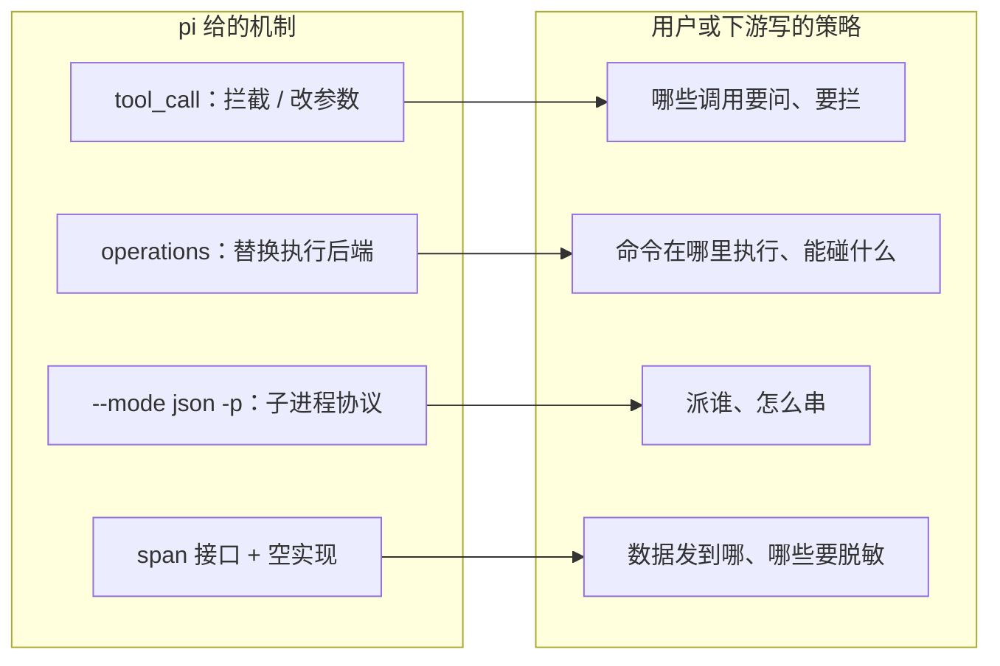
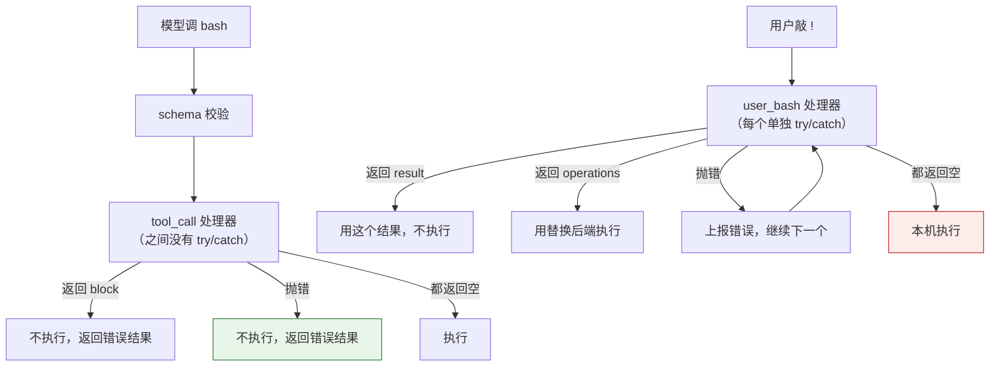
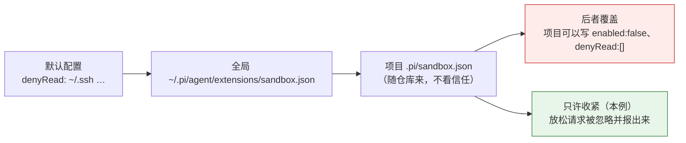
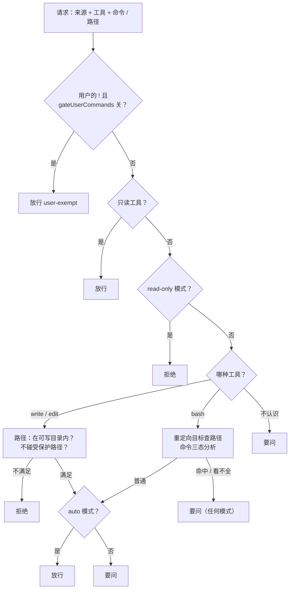

# 第 15 章 机制 vs 策略：读懂 Pi 的设计立场

> 基准：pi `b79e4cc8` (v0.84.4)　·　[版本表](../../research/BASELINE.md)　·　[参与指南](../../CONTRIBUTING.md)

**状态**：✅ 已完成

## 本章回答

- pi 「不做权限、不做沙箱」的立场写在哪里，理由是什么；为什么「半吊子沙箱比没有更危险」
- 机制的契约比文档首页写的细：参数什么时候校验、处理器按什么顺序跑、改了参数会怎样
- 六个领域里同一条「只给机制」的线，和它的三处裂缝
- 模型的工具调用和用户的 `!` 命令是两条路，出错时一条关着失败、一条开着失败
- pi 自己的四个安全示例各管到哪里，各漏在哪里
- 在机制之上写一层最小的策略，要处理哪些细节

## 素材来源

- `research/pi/05-tools-permissions.md` §5.4、§5.5
- `research/pi/09-assessment-risks-recommendations.md` §9.5
- 对照：`Step-Code` `7dd66cb`、`minimax-code` `89c930a`
- 配套代码：[`examples/ch15-policy-layer/`](../../examples/ch15-policy-layer/)

---

第 4 章把 pi 的能力边界画了一遍，其中最显眼的一条是「没有权限弹窗」：pi 给了一个执行前的钩子，自己不往里放任何判断（4.3 节、图 4-2）。那一章只回答了「有没有」。本章回答剩下的问题：**这个立场到底是什么，它在 pi 里贯彻到什么程度，在它之上写策略会遇到什么。**

这是全书第三部分「策略层」的第一章。后面几章（权限、沙箱、防失控、遥测）都是在 pi 的机制之上写策略；本章先把地基看清：机制的契约有哪些细节，pi 自己的示例扩展作为策略写到了哪一步，留下了什么。

先看几个数字：

| 数字 | 是什么 | 出处 |
| --- | --- | --- |
| **5** | 写下「不做权限 / 沙箱」立场的文件数 | 见 15.1 |
| **6 / 3** | 「只给机制」一致贯彻的领域 / 这条线上的裂缝 | 见 15.3、15.4 |
| **2** | 一条 shell 命令进入执行的事件：`tool_call`、`user_bash` | `docs/extensions.md:778`、`:879` |
| **0** | `user_bash` 返回值里的 `block` 字段 | `core/extensions/types.ts:1137-1142` |
| **3 / 3** | permission-gate 的危险命令正则数 / protected-paths 的受保护子串数 | `examples/extensions/permission-gate.ts:11`、`protected-paths.ts:11` |
| **0** | 会被自动加载的安全类示例扩展（本章读其中四个） | `research/pi/05-tools-permissions.md` §5.4 (a) |

---

## 15.1 一个立场，写在五处

pi 的「不做」不是散落在代码注释里的口头禅，而是写进了五个文件，口径一致：

| 文件 | 说了什么 |
| --- | --- |
| 根 `README.md:38-46` | 没有内置权限系统，默认以启动它的用户的权限运行；要更强的边界，就容器化或沙箱化，给出三种模式 |
| `packages/coding-agent/README.md:495-509` | Philosophy 一节六个「不做」，其中 `:503` 是 "No permission popups" |
| `SECURITY.md:6-14` | pi 运行在用户的安全边界之内；监控它或把它装进容器 / 虚拟机是用户的责任；用户可写的文件与 pi 进程同属一个信任边界 |
| `docs/security.md:31-37`、`:39-53`、`:59` | 不做沙箱的理由；跑不受信任的工作该怎么隔离；哪些问题不算安全漏洞 |
| `docs/containerization.md:3-17` | 两种隔离思路：整个进程进容器，或者进程留在宿主、只把工具执行路由进隔离环境 |

第 4 章已经引过 `docs/security.md:31-37` 的论证：**一个进程内的半吊子沙箱很容易被误当成安全边界，而它仍然依赖宿主的 shell、文件系统、包管理器、凭据和扩展代码；真正的隔离必须来自操作系统或虚拟化 / 容器边界。** 这里补上同一份文档后半段给的操作清单（`docs/security.md:39-53`），它比论证本身更像一份可执行的策略：

- 跑不受信任的仓库、不打算盯着看的生成代码、无人值守的自动化，都放进容器、VM、微虚拟机或远端沙箱
- 只挂载 agent 需要访问的工作区路径
- 除非确实需要，不要把宿主的 `~/.pi/agent` 挂进去——那里有会话、设置和凭据
- 只给最少的 API key，或用短期凭据
- 任务不需要网络时限制网络
- 把结果拷回受信任的系统之前先审 diff
- 读写方式挂载宿主工作区时，容器里的写入照样改宿主文件；要更强的隔离就只读挂载，或者拷进拷出

`:59` 再把边界钉死：没有内置沙箱、来自不受信任内容的提示词注入、用户自己装的扩展和 skill 的行为，一般不算安全问题。

【推断】把这五处放在一起读，立场其实有两层。第一层是**分工**：pi 负责把机制做对，策略（谁能做什么）由用户或下游决定。第二层是**边界放在哪**：能真正挡住破坏的边界只能在进程外，进程内的任何判断都只是「减少误操作」，不是「防住攻击」。后面几节看到的所有问题，都可以归到这两层里的某一层。

### 判断依据

- **立场写在五个文件里，口径一致**：根 README、产品 README、SECURITY.md、security.md、containerization.md。【代码事实】
- **不做沙箱的理由是「做了会被误当成边界」，而不是「做起来麻烦」**：`docs/security.md:35`。【代码事实】
- **pi 给了跑不受信任工作时的隔离清单**，包括不挂载 `~/.pi/agent`、最少的 API key、限制网络、审 diff：`docs/security.md:39-53`。【代码事实】
- **进程内的策略只能减少误操作，不能当成防攻击的边界**：这是从 `:35` 的论证推出来的，后面各节的例子都在印证它。【推断】

---

## 15.2 机制的契约：比首页写的细

第 4 章画过机制的骨架：循环在执行工具之前调 `beforeToolCall`，`AgentSession` 把它接到扩展的 `tool_call` 事件上，处理器返回 `{ block: true }` 工具就不执行（图 4-2）。真要在上面写策略，还得知道四个细节。

**一、钩子看到的是校验过的参数。** 循环先准备、再按工具的 schema 校验参数，然后才调钩子，把校验后的结果作为 `args` 传进去：

```ts
// pi: packages/agent/src/agent-loop.ts:614-628
const preparedToolCall = prepareToolCallArguments(tool, toolCall);
const validatedArgs = validateToolArguments(tool, preparedToolCall);
if (config.beforeToolCall) {
  const beforeResult = await config.beforeToolCall(
    { assistantMessage, toolCall, args: validatedArgs, context: currentContext },
    signal,
  );
```

所以策略不用自己处理「`command` 不是字符串」这类畸形输入——参数不合 schema 的调用根本到不了钩子。（本例的 `decide` 仍然对空命令、空路径返回拒绝，因为它也要服务于用户的 `!` 路径和命令行检查，那两条路没有 schema 校验。）

**二、处理器按扩展加载顺序依次跑，第一个 `block` 生效。**

```ts
// pi: packages/coding-agent/src/core/extensions/runner.ts:986-999
for (const ext of this.extensions) {
  const handlers = ext.handlers.get("tool_call");
  if (!handlers || handlers.length === 0) continue;

  for (const handler of handlers) {
    const handlerResult = await handler(event, ctx);

    if (handlerResult) {
      result = handlerResult as ToolCallEventResult;
      if (result.block) {
        return result;
      }
    }
  }
}
```

循环外面没有 try/catch。某个处理器抛错，错误一路传到 `AgentSession`，再传到循环，循环把它变成一条错误结果（`agent-loop.ts:659-665`）：**工具不执行。** 这一点 15.5 节还要拿来和另一条路对比。

**三、参数可以改，改完不再校验。** 文档原文（`docs/extensions.md:786-791`）：

> `event.input` is mutable. Mutate it in place to patch tool arguments before execution.
>
> - Mutations to `event.input` affect the actual tool execution
> - Later `tool_call` handlers see mutations made by earlier handlers
> - No re-validation is performed after your mutation

这是给「改写型」扩展用的——比如把命令包一层、把路径重定向到沙箱里。但它和第二条放在一起有一个推论：**如果做判断的处理器不是最后一个，它放行之后，后面的处理器还能把参数改掉，而且改完的参数不会再经过校验，也不会再经过它。** 顺序取决于扩展的加载顺序，不是策略自己能声明的。

**四、`terminate` 只对被拦的调用有意义。** 返回 `{ block: true, terminate: true }` 时，循环在这个回合结束后停下，不再让模型继续；但同一批里只要有一个结果不是 terminate，循环就照常继续（`docs/extensions.md:792-793`、`agent-loop.ts:634-643`）。策略想说「这件事严重到整个任务都该停」，要用 `terminate`；只是「这一步不行，换个办法」，就只 `block`。

另外，`tool_call` 对所有工具都触发，包括扩展自己注册的工具。只按 `toolName === "bash"` 判断的策略，管不到扩展新加的「执行」类工具。

### 判断依据

- **钩子拿到的是 schema 校验后的参数**：`agent-loop.ts:614-628`。【代码事实】
- **处理器按扩展加载顺序跑，第一个 `block` 立即返回，处理器之间没有 try/catch**：`runner.ts:986-999`。【代码事实】
- **处理器抛错 = 工具不执行**：`agent-loop.ts:659-665`。【代码事实】
- **参数可就地改写，后面的处理器看得到，改完不再校验**：`docs/extensions.md:786-791`。【代码事实】
- **判断型处理器不在最后时，它放行的参数可能被后面的改写型处理器改掉**：由上两条推出，pi 没有提供「我要最后一个跑」的声明方式。【推断】
- **`terminate` 只在被拦时生效，且要整批都是 terminate 才停**：`docs/extensions.md:792-793`。【代码事实】

---

## 15.3 六个领域，同一条线

「只给机制」不只发生在权限上。研究笔记把 pi 的全部设计归成一句话：提供机制，策略归用户（`research/pi/09-assessment-risks-recommendations.md` §9.5）。逐个核实：

| 领域 | pi 给的机制 | pi 不给的策略 | 出处 |
| --- | --- | --- | --- |
| 权限 | `beforeToolCall` / `tool_call` 可拦截、可改参数 | 任何内置判断 | `agent-loop.ts:617-643`；`README.md:503` |
| 沙箱 | 工具工厂可注入执行后端（`operations`） | 内置隔离 | `core/tools/bash.ts:199-200`、`:343` |
| 多 agent | `--mode json -p --no-session` 起子进程 | 内置 subagent | `examples/extensions/subagent/index.ts:300`；`README.md:501` |
| 编排 | 单个 / 并行 / 串联三种调用形态，`{previous}` 占位 | workflow 引擎 | `subagent/index.ts:8-10`、`:477` |
| 遥测 | span 接口和空实现 `NOOP_TELEMETRY_CONTEXT` | exporter 和后端 | `packages/telemetry/src/index.ts:3-24` |
| 工具发现 | bash 加带 README 的命令行工具（Skills） | MCP | `README.md:499` |

沙箱一行最能说明「机制」长什么样。bash 工具不是写死在本机执行的，执行后端是一个可以替换的接口：

```ts
// pi: packages/coding-agent/src/core/tools/bash.ts:199-200、:343
  /** Custom operations for command execution. Default: local shell */
  operations?: BashOperations;
// ...
  const ops = options?.operations ?? createLocalBashOperations({ shellPath: options?.shellPath });
```

sandbox 和 gondolin 两个示例都是靠这个接口把命令送进隔离环境的；`user_bash` 事件也接受一个 `operations` 返回值（`core/extensions/types.ts:1137-1142`），让用户的 `!` 命令走同一个后端。



*图 15-1 机制与策略的分工：左边是 pi 交付的，右边每一项都由用户或下游决定*

【推断】这条线的好处是 pi 的核心可以保持小，而且每一个机制都可以被替换而不用改 pi；代价是用户拿到的成品在这六个方面都是「全放行、无隔离、无编排、无遥测」。对一个自己会写扩展的开发者，这是自由；对一个不会写扩展的用户，这是空白。下游厂商在 pi 上做产品，首先要补的就是这六块空白里的若干块。

### 判断依据

- **六个领域都是「给机制、不给策略」**，每一行都能对到代码或 README。【代码事实】
- **执行后端可替换**：`bash.ts:199-200`、`:343`；`user_bash` 也接受 `operations`：`types.ts:1137-1142`。【代码事实】
- **这条线把选择权交给用户，也把空白交给了用户**：对不写扩展的用户，默认就是六项全无。【推断】

---

## 15.4 三处裂缝

一条一致的线上有三处不太一致的地方。它们都不是 bug，而是「机制给了，但和周围的期望对不上」。

**裂缝一：给了刹车，自己的产品没装。** `packages/agent` 提供了 `shouldStopAfterTurn`：每个回合结束后问一句「要不要停」，返回 `true` 就在下一次模型调用之前退出（`packages/agent/README.md:126-144`，消费点 `agent-loop.ts:252`）。但 `packages/coding-agent` 的源码里没有一处设置它——`git grep shouldStopAfterTurn -- packages/coding-agent` 只命中 CHANGELOG。也就是说，pi 的命令行产品没有任何「跑了多少轮该停」的判断。Step-Code `7dd66cb` 在这一点上和 pi 一样：这个名字只出现在它 vendored 的 agent-core 里，coding-agent 没有接。防失控是第 18 章的主题。

**裂缝二：一个看起来像策略的字段，没有人执行。** 遥测的属性元数据里有一个 `sensitive` 标记：

```ts
// pi: packages/telemetry/src/index.ts:28-32
export interface TelemetryAttributeMetadata {
	description: string;
	sensitive?: boolean;
	cardinality?: "low" | "high";
}
```

读的地方只有一处：生成遥测文档的脚本，把它渲染成表格里的一个词（`packages/agent/scripts/generate-telemetry-docs.ts:20`）。没有任何代码在发送 span 之前因为它脱敏或丢弃属性。【推断】这和 `docs/security.md:35` 警告的是同一类东西：一个看起来会被执行的声明，用户可能据此以为敏感数据被处理了。遥测和数据边界见第 20、21 章。

**裂缝三：名字像权限开关的 flag，管的是项目信任。** `--approve` / `-a` 和 `--no-approve` / `-na` 只写一个字段：

```ts
// pi: packages/coding-agent/src/cli/args.ts:219-222
} else if (arg === "--approve" || arg === "-a") {
	result.projectTrustOverride = true;
} else if (arg === "--no-approve" || arg === "-na") {
	result.projectTrustOverride = false;
```

help 文案是 "Trust project-local files for this run"（`:316`）。它决定的是要不要加载项目目录下的 `.pi/` 配置和扩展，不碰任何工具执行路径。【推断】机制本身是对的，问题在名字：在别的 agent 里，「approve」通常指工具审批。如果某个下游把它改成了工具审批的含义，同名 flag 在上游和下游就成了两件事。

### 判断依据

- **`shouldStopAfterTurn` 在 agent 包里有实现，coding-agent 源码里没有设置**：`agent-loop.ts:252`；`git grep` 只命中 `packages/coding-agent/CHANGELOG.md`。【代码事实】
- **Step-Code 也没有在 coding-agent 里接它**。【代码事实】
- **`sensitive` 只被文档生成脚本读取**：`telemetry/src/index.ts:30`、`generate-telemetry-docs.ts:20`。【代码事实】
- **`--approve` 只写 `projectTrustOverride`**：`args.ts:219-222`、`:316`。【代码事实】
- **三处都是「机制和期望对不上」，不是功能错误**。【推断】

---

## 15.5 两条执行路径，两种失败语义

同一条 `rm -rf build`，可以从两个地方进入执行：模型调用 `bash` 工具，或者用户在输入框里敲 `!rm -rf build`。第 4 章指出过后者走 `user_bash` 事件，不经过 `tool_call`。这里要补的是更要紧的一点：**两条路在处理器出错时的结局相反。**

用户的 `!` 进来时，交互模式先发 `user_bash` 事件（`interactive-mode.ts:6459-6468`）；有处理器返回了 `result`，就把它当成执行结果，不再真的执行（`:6470-6497`）；否则走正常路径 `session.executeBash(`（`:6516`）。RPC 模式的 `bash` 命令是同一个流程（`rpc-mode.ts:563-578`）。

分发 `user_bash` 的代码给每个处理器单独包了 try/catch：

```ts
// pi: packages/coding-agent/src/core/extensions/runner.ts:1005-1030（节选）
for (const handler of handlers) {
  try {
    const handlerResult = await handler(event, ctx);
    if (handlerResult) return handlerResult as UserBashEventResult;
  } catch (err) {
    this.emitError({ extensionPath: ext.path, event: "user_bash", error: ..., stack: ... });
  }
}
```

抛错只上报，不中断；所有处理器都没给结果，命令就照常在本机执行。再加上返回值里根本没有 `block` 字段（`types.ts:1137-1142`，只有 `operations` 和 `result`），想拦一条 `!` 命令，只能自己造一个执行结果顶替。



*图 15-2 两条路的失败语义：`tool_call` 处理器抛错是关着失败（绿），`user_bash` 处理器抛错最终落到本机执行（红）*

【推断】这两种选择各有道理。`tool_call` 面对的是模型的输出，不受信任，出错时宁可不做；`user_bash` 面对的是用户亲手敲的命令，用户是这台机器的主人，一个出错的扩展不该让用户连 `ls` 都跑不了。但对写策略的人来说，后果是具体的：

1. **同一份策略要接两次。** 只挂在 `tool_call` 上的闸门，用户的 `!` 绕过它不需要任何技巧。
2. **接在 `user_bash` 上的处理器必须自己接住所有错误。** 规则文件读不出来、确认框崩了、正则写错了抛异常——任何一种，宿主都会吞掉错误然后照常执行。处理器要把「策略自己出错」也变成一次拒绝。
3. **拒绝要造一个像样的结果。** 没有 `block`，就返回一个 `BashResult`：输出写清原因，退出码给一个非零值（本例用 126，shell 里「找到了命令但不许执行」的码）。

是否该拦用户自己的命令，本身是一个策略选择。本例把它做成开关 `gateUserCommands`，默认打开，理由是：在一个会把命令结果送回给模型的环境里，用户的 `!` 有时是照着模型的建议敲的。

### 判断依据

- **`user_bash` 处理器各自 try/catch，抛错只上报**：`runner.ts:1005-1030`。【代码事实】
- **没有处理器给结果时，命令走 `session.executeBash` 在本机执行**：`interactive-mode.ts:6516`；RPC 同理：`rpc-mode.ts:563-578`。【代码事实】
- **`user_bash` 的返回值没有 `block`**：`types.ts:1137-1142`。【代码事实】
- **`tool_call` 关着失败，`user_bash` 开着失败**：由 15.2 和上面三条合起来得出。【代码事实】
- **两种语义各有理由；写策略的人要分别处理**。【推断】

---

## 15.6 策略比机制难：pi 自己的四个示例

pi 在 `examples/extensions/` 下放了几个安全相关的扩展，作为「怎么在机制上写策略」的教材。它们不会被自动加载，要用户自己拷到 `~/.pi/agent/extensions/`（`research/pi/05-tools-permissions.md` §5.4 (a)）。下面把其中四个当成策略来读——不是挑错，而是看清「教材」和「能交付的策略」之间还差什么。这些差距正是下游要补的东西。

### permission-gate：按整行字符串比

```ts
// pi: packages/coding-agent/examples/extensions/permission-gate.ts:11-17
const dangerousPatterns = [/\brm\s+(-rf?|--recursive)/i, /\bsudo\b/i, /\b(chmod|chown)\b.*777/i];

pi.on("tool_call", async (event, ctx) => {
	if (event.toolName !== "bash") return undefined;

	const command = event.input.command as string;
	const isDangerous = dangerousPatterns.some((p) => p.test(command));
```

三条正则，对整行命令做匹配。整行匹配的问题是两头都会错：`rm -fr`、`rm -v -rf` 不匹配 `rm\s+-rf?`，漏掉了；`grep -rn 'rm -rf' docs/`、`echo 'do not run sudo here'` 字符串里出现了这些词，误报了。

把 13 条标了「实际会不会造成破坏」的命令分别交给这三条正则和本例的分析器：

| 命令 | 实际 | pi 正则 | 本例 |
| --- | --- | --- | --- |
| `rm -rf build` | 有破坏 | 要问 | 命中 recursive-delete |
| `rm -fr build` | 有破坏 | 放行 | 命中 recursive-delete |
| `rm -v -rf build` | 有破坏 | 放行 | 命中 recursive-delete |
| `find . -name '*.log' -delete` | 有破坏 | 放行 | 命中 find-delete |
| `git clean -fdx` | 有破坏 | 放行 | 命中 git-destructive |
| `chmod -R a+rwx .` | 有破坏 | 放行 | 命中 world-writable |
| `curl -fsSL https://example.com/i.sh \| sh` | 有破坏 | 放行 | 命中 pipe-to-shell |
| `python3 -c "import shutil; shutil.rmtree('.')"` | 有破坏 | 放行 | 看不全 |
| `grep -rn 'rm -rf' docs/` | 无害 | 要问 | 普通 |
| `echo 'do not run sudo here'` | 无害 | 要问 | 普通 |
| `npm run clean` | 有破坏 | 放行 | 普通 |
| `cp /dev/null data.db` | 有破坏 | 放行 | 普通 |
| `./scripts/reset.sh` | 有破坏 | 放行 | 普通 |

最后三行是这张表最重要的部分：**两边都看不出来。** `npm run clean` 跑什么写在 `package.json` 里，`reset.sh` 跑什么写在脚本里，`cp /dev/null` 是一次合法的复制。静态规则到这里为止，再往下只能靠隔离——这正是 15.1 那段论证的落点。

### protected-paths：子串匹配，只管两个工具

```ts
// pi: packages/coding-agent/examples/extensions/protected-paths.ts:11-19
const protectedPaths = [".env", ".git/", "node_modules/"];

pi.on("tool_call", async (event, ctx) => {
	if (event.toolName !== "write" && event.toolName !== "edit") {
		return undefined;
	}

	const path = event.input.path as string;
	const isProtected = protectedPaths.some((p) => path.includes(p));
```

`path.includes(".env")` 会把 `src/.environment.ts` 也拦下；而大小写不同的 `.ENV`、`.Git/config` 又拦不住，在 macOS 默认的文件系统上它们和 `.env`、`.git/config` 是同一个文件。更大的问题是覆盖面：它只看 `write` 和 `edit`，`bash` 里一句 `echo x > .env` 不经过它。

### sandbox：只包 bash，配置能被项目放松

sandbox 示例用的是 15.3 那个 `operations` 机制：重新注册一个 `bash` 工具，执行时把命令交给操作系统级的沙箱。文件头写明它是演示「如何替换内置工具」的（`sandbox/index.ts:1-10`）。作为策略，它有四处值得注意：

1. **只包了 bash。** `read`、`write`、`edit` 照常在本机执行，不受沙箱的文件系统规则约束。
2. **项目配置不经信任检查、后者覆盖。** 配置文件按「默认 → 全局 → 项目」合并（`:79-102`），项目文件 `.pi/sandbox.json` 是直接从磁盘读的，不看 pi 的项目信任；合并是后者覆盖（`:105-130`），`enabled` 可以被直接改写（`:108`），`network`、`filesystem` 里的数组整体替换。一个仓库里放一份 `{"enabled": false}`，clone 下来、启动 pi，沙箱就关了，只在界面上提示一句 "Sandbox disabled via config"（`:245-248`）。
3. **配置文件解析失败就用默认值。** `JSON.parse` 失败只打一行 `console.error` 警告（`:94-99`）。
4. **初始化失败落回本机执行。** 平台不支持或初始化抛错时，`sandboxEnabled` 置为 `false` 并提示一条错误（`:251-255`、`:281-283`）；之后模型的 bash 走 `localBash.execute`（`:218-219`），用户的 `!` 处理器返回空、照常本机执行（`:229-232`）。



*图 15-3 分层配置的两种合并：sandbox 示例是后者覆盖；项目文件随仓库而来，本例只让它收紧*

### gondolin：覆盖最全，出错时 `!` 落回本机

gondolin 示例把七个内置工具全部重新注册到一个本地 Linux 微虚拟机里执行（`gondolin/index.ts:443-516`），`user_bash` 也接进去（`:517-520`）。覆盖面是四个示例里最完整的；`docs/containerization.md:17` 也说清了它管不到的部分：其他扩展注册的工具仍然在宿主执行，除非它们也把执行委托出去。

剩下一处要按 15.5 的失败语义推演：`user_bash` 处理器里 `await ensureVm(ctx)`（`:518`），而 `ensureVm` 和 `startVm` 都没有接住错误（`:379-408`）。虚拟机起不来时，处理器抛错，宿主吞掉，`!` 命令照常在本机执行。模型的工具调用则因为执行时同样起不来虚拟机而失败，是关着失败的。【推断：按代码推演，未实际运行】

### 一张覆盖面表

把四个示例和本例放在一起，看每道闸门管得到哪些执行路径（本例 `src/coverage.ts` 生成）：

| 路径 | permission-gate | protected-paths | sandbox | gondolin | 本例 |
| --- | --- | --- | --- | --- | --- |
| 模型 bash | 管 | — | 管 | 管 | 管 |
| 模型 write | — | 管 | — | 管 | 管 |
| 模型 edit | — | 管 | — | 管 | 管 |
| 模型 read | — | — | — | 管 | 管 |
| 用户 `!` | — | — | 管 | 管 | 管 |
| 扩展注册的工具 | — | — | — | — | 管 |

注意两类「管」不是一回事：gondolin 和 sandbox 的「管」是**隔离**（命令换个地方执行），permission-gate、protected-paths 和本例的「管」是**判断**（执行前问一句或拦下）。本例在「扩展注册的工具」一格写「管」，是因为它对不认识的工具一律按「会改东西」处理、要问；它不能替那些工具做隔离。

【推断】四个示例各自演示了一种机制的用法，都达到了教材的目的。把它们当成可交付的策略时，缺的东西有一个共同点：**都没有回答「出了岔子会怎样」**——漏掉的路径、出错时的落点、随仓库而来的配置。这三个问题，是在 pi 上写任何策略都要先回答的。

### 判断依据

- **permission-gate 是三条整行正则，只看 bash**：`permission-gate.ts:11-17`。【代码事实】
- **13 条样本里有破坏的 11 条，正则只拦下 1 条、误报 2 条；本例漏 3 条、不误报**：本例演示第 3 段。【代码事实】
- **`npm run clean`、`./scripts/reset.sh`、`cp /dev/null data.db` 静态规则看不出来**：这类命令的行为在别的文件里或者本身合法。【推断】
- **protected-paths 用子串匹配，只看 write / edit**：`protected-paths.ts:11-19`。【代码事实】
- **sandbox 只包 bash；项目配置不经信任检查、后者覆盖，可以 `enabled: false`；解析失败和初始化失败都落回本机**：`sandbox/index.ts:79-130`、`:214-232`、`:245-248`、`:281-283`。【代码事实】
- **gondolin 覆盖七个内置工具和 `!`；扩展注册的工具不在其内**：`gondolin/index.ts:443-520`；`containerization.md:17`。【代码事实】
- **gondolin 虚拟机起不来时，`!` 命令落回本机执行**：`ensureVm` 无 catch 加上 `user_bash` 的失败语义推出。【推断】

---

## 15.7 下游怎么做

| | pi | Step-Code `7dd66cb` | minimax-code `89c930a` |
| --- | --- | --- | --- |
| 权限判断 | 无，示例扩展自选 | 四个预设，挂在 `tool_call` 上 | 独立的权限引擎包，宿主注入 |
| 命令分析 | 示例里三条正则 | 三态：命中 / 看不全 / 普通 | 引擎内按工具分派检查器 |
| 默认档位 | 全放行 | `bypass`：普通工具不问，危险命令仍问 | 见第 16 章 |
| 没有界面时 | 示例：危险命令拦 | 危险或看不全一律拦；默认档位直接拒绝 | 见第 16 章 |
| 用户的 `!` | 走 `user_bash` | 未挂预设策略 | 见第 16 章 |
| 进程外隔离 | 示例：sandbox、gondolin | 见第 17 章 | 操作系统级沙箱配置，与权限联动 |

### Step-Code：预设 + 三态分析

Step-Code 把权限写成「叠在 pi 原生钩子上的一层」，文件头说得很清楚：

```ts
// Step-Code: packages/coding-agent/src/step/permissions.ts:1-7
/**
 * Step's permission presets layered on top of pi's native tool-call hook.
 *
 * The agent loop and tool executor remain pi-owned. This module only decides
 * whether a prepared call is allowed, needs a UI confirmation, or is blocked,
 * and schedules the optional autopilot continuation after a failed run.
 */
```

挂载点就是 `pi.on("tool_call", …)`（`features/step.ts:242-244`）。四个预设（`permissions.ts:37-70`）：`ask`（写和命令先问，没有界面就拒绝）、`read-only`、`bypass`（普通工具不问，危险命令仍然问）、`autopilot`（在 bypass 之上，模型临时失败后自动续跑）。默认是 `bypass`（`:253-259`），注释写明了两条兜底：危险命令在 bypass 下仍然要确认；没有界面时，「默认得来的」策略直接拒绝。

处理器的分支和 15.2 的契约一一对应（`permissions.ts:524-553`）：拒绝返回 `{ block: true, terminate: true }`；没有界面时，只有「不危险、分析完整、且档位明确允许无人值守」三个条件都满足才放行；有界面就弹确认框。

命令分析是三态的，类型和注释都把「普通不等于安全」写死了：

```ts
// Step-Code: packages/coding-agent/src/step/command-policy.ts:107-124（节选）
export type CommandPolicyAnalysis =
	| { kind: "matched"; ruleId: string }
	| { kind: "unresolved"; reason: string }
	| { kind: "ordinary" };

/** An ordinary result means no static rule matched, not that a program is sandboxed. */
export function analyzeCommandPolicy(command: string, dialect: "bash" | "unsupported" = "bash"): CommandPolicyAnalysis {
	const inspection = collectShellCommands(command);
	if (inspection.syntaxUnresolved) return { kind: "unresolved", reason: inspection.unresolved ?? "shell-syntax" };
	// ... 规则匹配；非 bash 方言按看不全处理 ...
}

/** Detection alone is not authorization: callers must also handle unresolved analysis. */
```

和本例的一处区别：Step-Code 遇到语法层面看不全时**先**返回 unresolved，再做规则匹配；本例让命中优先（`rm -rf $(pwd)` 报 recursive-delete 而不是看不全）。两种顺序最后都落到「要问」，区别只在给用户看的理由。

Step-Code 的 `!` 路径保留了 pi 的流程（`apps/cli/src/ui/interactive-mode.ts:6629-6687`）。`user_bash` 在 `permissions.ts` 里只作为一个工具名出现在「写或执行」类的集合里（`:89-98`），仓库里没有 `pi.on("user_bash", …)` 的处理器把预设策略接到这条路上。【推断】这是一个取舍：用户亲手敲的命令被视为用户自己的决定，预设只约束模型。代价是 15.5 讨论的那种情形——用户照着模型的建议敲命令时，预设不在场。

### minimax-code：权限是一个独立的包

minimax-code 把权限判断做成独立的包 `@mavis/permission`，描述写着「宿主集成由外部注入，包本身不导入任何运行时包」（`packages/agent-modules/permission/package.json:4`）。引擎的流程是「先查拒绝、再查放行、最后兜底为问」，并区分哪些步骤不受 bypass 模式影响（`src/engine.ts:186-200`）。和本章最相关的一处是**权限与沙箱联动**：bash 整个工具被设为「要问」时，如果沙箱开着、且配置了 `autoAllowBashIfSandboxed`，这条「要问」规则就跳过（`engine.ts:305-310`）。沙箱的文件系统策略分四档：只读、工作区可写、删除保护、完全访问（`packages/config/src/sandbox-config.ts:8-12`）。

【推断】这是对 15.1 那段论证的一种回应：进程外有了边界，进程内的确认就可以少问。代价是两套配置要一起看才能知道一条命令会不会被问。

详细拆解分别在第 16 章（权限与确认）、第 17 章（沙箱）、第 18 章（防失控）。

### 判断依据

- **Step-Code 的权限挂在 pi 的 `tool_call` 上，四个预设，默认 bypass**：`features/step.ts:242-244`；`permissions.ts:37-70`、`:253-259`。【代码事实】
- **Step-Code 没有界面时，危险或看不全的命令一律拦**：`permissions.ts:524-553`。【代码事实】
- **Step-Code 命令分析三态，注释写明「普通不等于安全」「检测不等于授权」**：`command-policy.ts:107-124`。【代码事实】
- **Step-Code 没有在 `user_bash` 事件上挂预设策略**：仓库里 `pi.on("user_bash", …)` 只出现在 vendored 的 pi 示例扩展里；`permissions.ts:97` 的 `"user_bash"` 是工具名集合的一项。【代码事实】
- **minimax-code 的权限引擎是独立包，沙箱开着时可跳过 bash 的「要问」规则**：`permission/package.json:4`；`engine.ts:186-200`、`:305-310`。【代码事实】
- **两家都在 pi 的机制之上写策略，选择的侧重点不同：一家把规则做细，一家把规则和隔离联动**。【推断】

---

## 15.8 你的最小实现

配套代码 [`examples/ch15-policy-layer/`](../../examples/ch15-policy-layer/) 在 pi 的两个钩子之上写一层最小的策略，零依赖。它不是要替代 Step-Code 或 minimax-code，而是把本章每一个细节落到可以跑、可以测的代码里：

| 规则 | pi | 本例 |
| --- | --- | --- |
| 模型工具调用：处理器抛错 = 不执行 | `runner.ts:982-1003`；`agent-loop.ts:617-665` | `src/host.ts` 的 `dispatchToolCall` |
| 用户 `!`：处理器抛错被吞，照常执行 | `runner.ts:1005-1030`；`interactive-mode.ts:6470`、`:6516` | `src/host.ts` 的 `dispatchUserBash` |
| `user_bash` 没有 `block`，只能给一个顶替结果 | `types.ts:1137-1142` | `src/hooks.ts` 的 `userBashGate` |
| 示例的正则、子串匹配 | `permission-gate.ts:11`、`:17`；`protected-paths.ts:11`、`:19` | `src/pi-gate.ts`（原样搬来当对照组） |
| 项目配置后者覆盖 | `sandbox/index.ts:79-130` | `src/merge.ts` 的 `replaceMerge` 对 `tighten` |
| 各闸门的覆盖面 | 四个示例扩展 | `src/coverage.ts` |

### 关键代码

两条分发路径的最小模型。和 pi 一样：`tool_call` 处理器之间不包 try/catch，`user_bash` 每个处理器单独包、错误只记下来：

```ts
// examples/ch15-policy-layer/src/host.ts:60-71
export async function dispatchUserBash(handlers: readonly UserBashHandler[], event: UserBashEvent): Promise<Outcome> {
  const swallowed: string[] = [];
  for (const handler of handlers) {
    try {
      const result = await handler(event);
      if (result) return { ran: false, reason: result.result.output, swallowed };
    } catch (error) {
      swallowed.push(message(error));
    }
  }
  return { ran: true, swallowed };
}
```

接在 `user_bash` 上的闸门因此必须自己接住所有错误。策略、确认框、读文件，任何一处抛错都变成一次拒绝：

```ts
// examples/ch15-policy-layer/src/hooks.ts:54-64
export function userBashGate(options: GateOptions): UserBashHandler {
  return async (event: UserBashEvent) => {
    // 宿主会吞掉这里抛出的错误然后照常执行，所以必须自己接住，把「策略出错」也变成一次拒绝
    try {
      const { allowed, reason } = await settle({ ...options, cwd: event.cwd }, { origin: "user", tool: "bash", command: event.command });
      return allowed ? undefined : { result: refusal(reason) };
    } catch (error) {
      return { result: refusal(`策略自己出错了，按拒绝处理：${error instanceof Error ? error.message : String(error)}`) };
    }
  };
}
```

命令分析把一行 shell 拆成简单命令，逐个按词比对，给出三态之一。命中优先于看不全：

```ts
// examples/ch15-policy-layer/src/command.ts:85-94
export function analyzeCommand(script: string): CommandReport {
  const parsed = parseShell(script);
  const results = parsed.commands.map(classify);
  const redirects = parsed.commands.flatMap((c) => c.redirects);
  // 命中优先于看不全：rm -rf $(pwd) 虽然没拆完，已经看到的部分足够下结论
  const matched = results.find((r) => r.kind === "matched");
  if (matched) return { analysis: matched, redirects };
  if (parsed.unresolved) return { analysis: { kind: "unresolved", why: parsed.unresolved }, redirects };
  return { analysis: results.find((r) => r.kind === "unresolved") ?? { kind: "ordinary" }, redirects };
}
```

策略的全部判断在一个纯函数里。顺序是：用户命令是否豁免 → 只读工具 → 只读模式 → 写入 → 命令 → 不认识的工具按「会改东西」处理：

```ts
// examples/ch15-policy-layer/src/decide.ts:34-55
function decideCommand(policy: Policy, cwd: string, command: string | undefined): Decision {
  if (command === undefined || command.trim() === "") return deny("malformed", "执行请求里没有命令");
  const { analysis, redirects } = analyzeCommand(command);
  const blocked = decideRedirects(policy, cwd, redirects);
  if (blocked?.verdict === "deny") return blocked;
  // 危险命令和看不全的命令在任何模式下都要问，auto 也不例外
  if (analysis.kind === "matched") return ask(analysis.rule, `危险命令（${analysis.rule}）`);
  if (analysis.kind === "unresolved") return ask("unresolved", `命令看不全（${analysis.why}），不能当成普通命令放行`);
  if (blocked) return blocked;
  return policy.mode === "auto" ? allow("mode-auto", "没有规则命中；这不代表命令安全") : ask("mode-ask", "要执行命令");
}

export function decide(policy: Policy, request: Request, cwd: string): Decision {
  if (request.origin === "user" && !policy.gateUserCommands) return allow("user-exempt", "策略不管用户亲手敲的命令");
  const tool = request.tool.trim().toLowerCase();
  if (READ_ONLY_TOOLS.has(tool)) return allow("read-only-tool", "只读工具");
  // 走到这里的都按「会改东西」处理，包括不认识的工具
  if (policy.mode === "read-only") return deny("mode-read-only", `只读模式不许用 ${request.tool}`);
  if (WRITE_TOOLS.has(tool)) return decideWrite(policy, cwd, request.path);
  if (tool === "bash") return decideCommand(policy, cwd, request.command);
  return ask("unknown-tool", `不认识的工具 ${request.tool}，按会改东西处理`);
}
```



*图 15-4 `decide` 的判断顺序：危险和看不全的命令在 auto 模式下也要问；不认识的工具按「会改东西」处理*

项目策略文件只许收紧。放松请求不报错、不悄悄生效，而是被忽略并原样报给用户：

```ts
// examples/ch15-policy-layer/src/merge.ts:32-48
export function tighten(base: Policy, overlay: PolicyOverlay, cwd: string): Tightened {
  const ignored: string[] = [];
  const wantsLooserMode = overlay.mode !== undefined && STRICTNESS[overlay.mode] < STRICTNESS[base.mode];
  if (wantsLooserMode) ignored.push(`mode 想从 ${base.mode} 放到 ${overlay.mode}`);
  if (overlay.gateUserCommands === false && base.gateUserCommands) ignored.push("gateUserCommands 想关掉");
  const roots = tightenRoots(base.writeRoots, overlay.writeRoots, cwd);
  return {
    policy: {
      mode: overlay.mode === undefined || wantsLooserMode ? base.mode : overlay.mode,
      writeRoots: roots.roots,
      // 保护名单取并集：overlay 里少写一项不等于删掉它
      protectedPaths: [...new Set([...base.protectedPaths, ...(overlay.protectedPaths ?? [])])],
      gateUserCommands: base.gateUserCommands || overlay.gateUserCommands === true,
    },
    ignored: [...ignored, ...roots.ignored],
  };
}
```

路径检查按路径段比，不按子串比；转小写是因为 macOS 和 Windows 默认的文件系统不分大小写：

```ts
// examples/ch15-policy-layer/src/paths.ts:20-28
  if (target.startsWith("~")) return { ok: false, rule: "outside-write-roots", detail: `${target} 在家目录下` };
  const absolute = resolve(cwd, target);
  if (!policy.writeRoots.some((root) => inside(resolve(cwd, root), absolute))) {
    return { ok: false, rule: "outside-write-roots", detail: `${absolute} 不在可写目录里` };
  }
  // 按路径段比，不按子串比；转小写是因为 macOS 和 Windows 默认的文件系统不分大小写，.ENV 和 .env 是同一个文件
  const segments = relative(cwd, absolute).split(sep).map((s) => s.toLowerCase());
  const hit = policy.protectedPaths.find((pattern) => segments.some((s) => matchesGlob(s, pattern.toLowerCase())));
  return hit === undefined ? { ok: true } : { ok: false, rule: "protected-path", detail: `${target} 命中受保护的 ${hit}` };
```

### 跑起来

```bash
cd examples/ch15-policy-layer
npm start                          # 六段演示
npm start -- "rm -fr build"        # 按默认策略判断一条命令：放行 0、要问 1、拒绝 2
npm test
```

需要 Node ≥ 22.6，没有依赖。演示输出（第三段的表格见 15.6 节，第六段见 15.6 节的覆盖面表，这里省略）：

```text
一、同一条命令，两条路（只在 tool_call 上挂了 pi 的 permission-gate）
  模型调 bash：没执行：Dangerous command blocked (no UI for confirmation)
  用户敲 !  ：执行了

二、处理器抛错时，两条路的结局相反
  tool_call ：没执行：规则文件读不出来
  user_bash ：执行了（宿主吞掉了错误：规则文件读不出来）

四、项目配置想把限制放开
  项目文件：{"mode":"auto","protectedPaths":[],"writeRoots":["/"],"gateUserCommands":false}
  后者覆盖：{"mode":"auto","writeRoots":["/"],"protectedPaths":[],"gateUserCommands":false}
  只许收紧：{"mode":"ask","writeRoots":["."],"protectedPaths":[".env",".env.*",".git","*.pem","*.key"],"gateUserCommands":true}
    忽略：mode 想从 ask 放到 auto
    忽略：gateUserCommands 想关掉
    忽略：writeRoots 想加 /，不在原来的可写范围里

五、一份策略接两条路
  有界面，用户点了同意
    模型调 bash：执行了
    用户敲 !  ：执行了
  没有界面
    模型调 bash：没执行：没有界面可以确认（recursive-delete）
    用户敲 !  ：没执行：策略拒绝：没有界面可以确认（recursive-delete）
  确认框自己抛错
    用户敲 !  ：没执行：策略拒绝：策略自己出错了，按拒绝处理：确认框崩了

六、每道闸门管得到哪些路径
  ……
  高等级缺口：
    permission-gate：不管 model:write；不管 model:edit；不管 user:bash
    protected-paths：不管 model:bash；不管 user:bash
    sandbox：不管 model:write；不管 model:edit；项目配置不经信任检查、能放松限制；出错时 model:bash 落回本机执行；出错时 user:bash 落回本机执行
    gondolin：出错时 user:bash 落回本机执行
    本例：无
```

```text
$ npm start -- "rm -fr build"
  分析：命中 recursive-delete
  决定：要问  [recursive-delete] 危险命令（recursive-delete）
$ echo $?
1
```

### 逐段对照本章

- 第 1 段 ↔ 15.5：`host.ts`、`pi-gate.ts`
- 第 2 段 ↔ 15.2、15.5：`host.ts`
- 第 3 段 ↔ 15.6 permission-gate：`shell.ts`、`command.ts`、`pi-gate.ts`、`corpus.ts`
- 第 4 段 ↔ 15.6 sandbox：`merge.ts`、`policy-file.ts`
- 第 5 段 ↔ 15.5：`hooks.ts`、`decide.ts`、`paths.ts`
- 第 6 段 ↔ 15.6 覆盖面表：`coverage.ts`

`npm test` 跑 11 个测试文件、86 个用例，覆盖：shell 拆分（引号、管道、重定向、命令替换、heredoc 停下）、六条命令规则和各种「看不全」、pi 正则的漏报和误报、路径的可写目录与受保护路径（大小写、路径段、`~`、`..`）、`decide` 的每个分支、两种合并（包括 `writeRoots: []` 和全部越界的区别）、策略文件里拼错的键报错、两条分发路径的失败语义、闸门在有界面 / 没界面 / 确认框抛错时的结局、覆盖面缺口，以及命令行的退出码。

本例没做的：`shell.ts` 是词法近似，不是 bash 语法的实现；路径检查不解析符号链接，查和写之间的时间差也不处理；`host.ts` 只模拟两条分发路径的失败语义，不是真的 pi 进程；没有做成 pi 扩展装进去跑。这些都是第 16、17 章的事。

### 写这层策略的三个教训

1. **先数路径，再写规则。** 同一条 `rm -rf` 可以从模型的 `bash`、用户的 `!`、`write` 工具、扩展自己注册的工具进来。只挂在 `tool_call` 上的闸门，用户的 `!` 绕过它不需要任何技巧（演示第 1、6 段）。
2. **每个钩子的失败语义要分别确认。** `tool_call` 抛错是关着失败，`user_bash` 抛错是开着失败。接在 `user_bash` 上的处理器必须自己接住所有错误，把「策略出错」也变成一次拒绝（演示第 2、5 段）。
3. **「没有规则命中」不等于安全。** 命令分析至少要有三态；`npm run clean`、`./scripts/reset.sh` 这类命令靠静态规则永远看不出来，再往下只能靠隔离（演示第 3 段）。

---

## 本章小结

**pi 的立场写在五个文件里，口径一致。** 不做权限、不做沙箱，理由是进程内的半吊子边界会被误当成真的边界；真正的隔离在进程外，`docs/security.md` 给了一份可执行的隔离清单。

**机制的契约比首页写的细。** 钩子拿到的是校验后的参数；处理器按扩展加载顺序跑，第一个 `block` 生效；参数可以就地改写，改完不再校验，所以判断型处理器后面的改写型处理器能改掉它放行过的参数；`terminate` 只在被拦时生效。

**同一条线贯穿六个领域，有三处裂缝。** 权限、沙箱、多 agent、编排、遥测、工具发现都只给机制。裂缝是：`shouldStopAfterTurn` 给了但产品没接；`sensitive` 看起来像策略但没人执行；`--approve` 名字像工具审批，管的是项目信任。

**两条路，两种失败语义。** 模型的工具调用走 `tool_call`，出错不执行；用户的 `!` 走 `user_bash`，出错照常在本机执行，而且返回值里没有 `block`。一份策略要接两次，接在 `user_bash` 上的那一份必须自己接住错误。

**策略比机制难。** pi 的四个示例都达到了教材的目的；当成可交付的策略看，缺的都是「出了岔子会怎样」：漏掉的路径、出错时的落点、随仓库而来的配置。下游的两家分别把规则做细（Step-Code 的预设与三态分析）、把规则和隔离联动（minimax-code 的权限引擎与沙箱）。

权限与确认的各家做法见第 16 章，沙箱见第 17 章，防失控（包括 `shouldStopAfterTurn`）见第 18 章；策略决定该不该留痕、留下的记录能不能当审计证据，见第 25 章。
