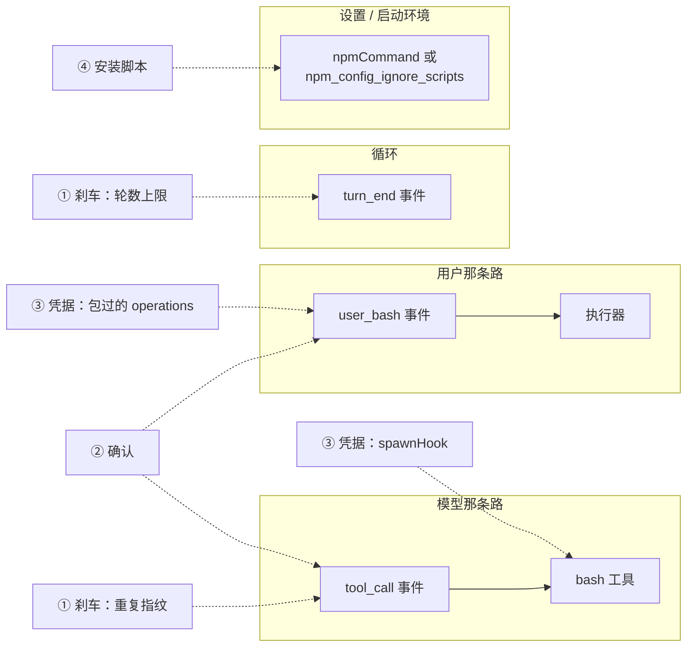
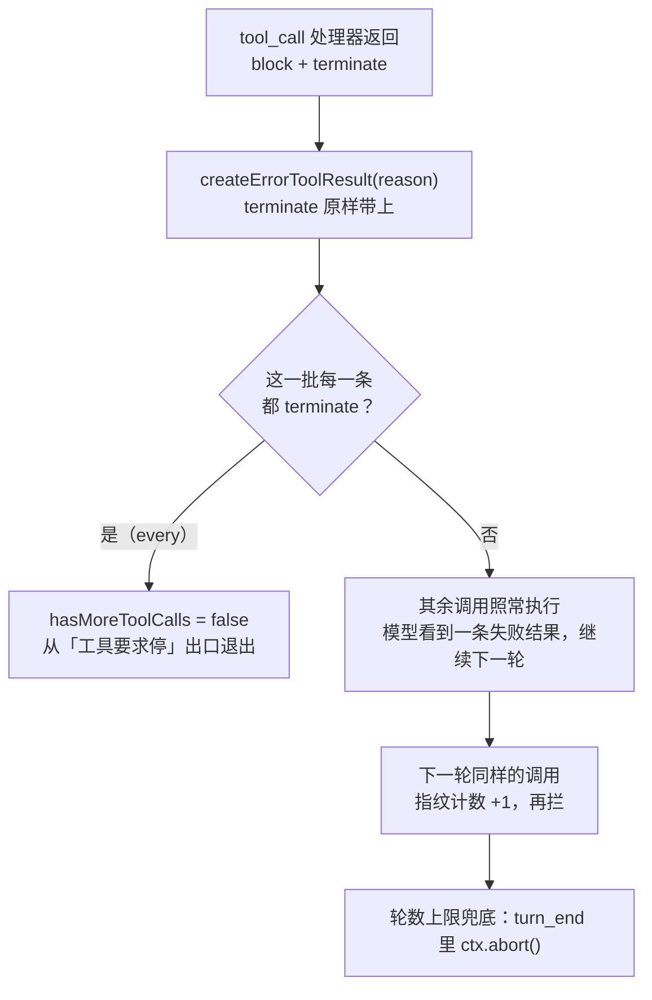
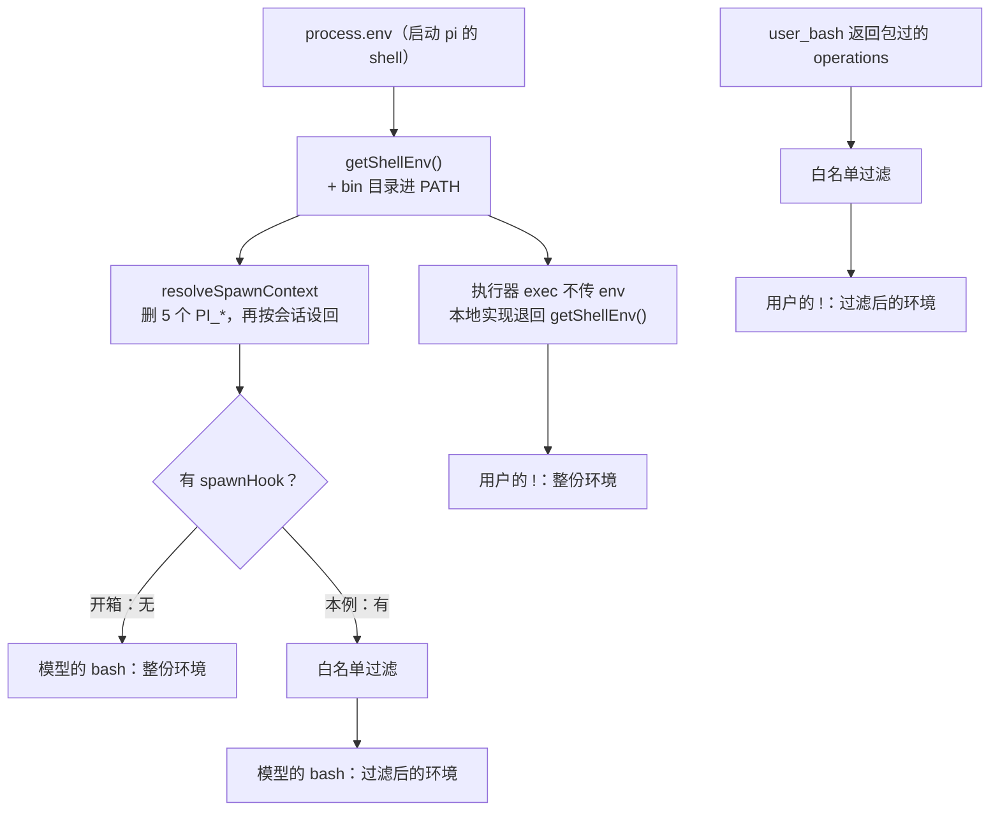
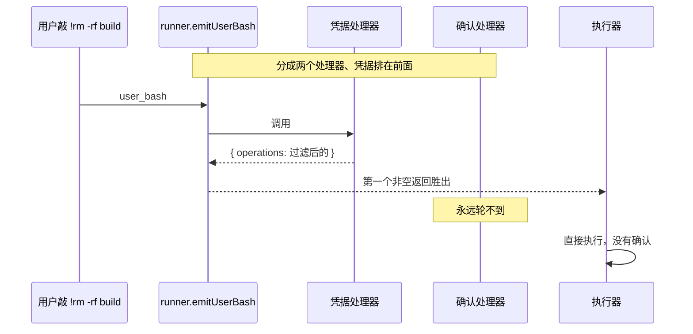

# 第 22 章 上线前必补清单

> 基准：pi `b79e4cc8` (v0.84.4)　·　[版本表](../../research/BASELINE.md)　·　[参与指南](../../CONTRIBUTING.md)

**状态**：✅ 已完成

## 本章回答

- 把 pi 交给不读源码的同事用之前，哪几件事必须自己补，哪几件可以缓一缓
- 每一件的最小补法是什么、挂在 pi 的哪个口子上、补完还剩什么代价
- 为什么「确认」和「凭据过滤」在用户的 `!` 那条路上必须写进同一个处理器
- 安装脚本为什么不用写代码，两种关法各自的副作用
- 怎么用一条命令核对：这四件现在到底补上了没有

## 素材来源

- 新写 + [`examples/ch22-preflight/`](../../examples/ch22-preflight/)
- `research/pi/09-assessment-risks-recommendations.md` §9.6（原文是厂商 fork 的视角，本章改写成「不 fork、只装扩展和改设置」的小团队视角，并重新排了优先级）
- 复用：[第 15 章](../03-policy-layer/ch15-mechanism-not-policy.md)的两个确认适配器 `toolCallGate` / `userBashGate`

（pi 的路径以 `packages/` 为根：`agent/src/` 指 `packages/agent/src/`，`coding-agent/src/` 指 `packages/coding-agent/src/`，章内简写成 `core/…`、`utils/…`、`modes/…` 的都在 `coding-agent/src/` 下。本章带 `【代码事实】` 的是在源码里逐行核对过的，带 `【实机】` 的是在 `examples/ch22-preflight/` 里跑出来的：macOS arm64，Node v22.22.3，npm 10.9.8，Bun 1.3.14。）

---

pi 的文档对自己的边界很诚实：没有内置沙箱，工具和扩展都以 pi 进程的权限运行，「真正的隔离要来自操作系统或者容器」（`coding-agent/docs/security.md:33-35`）。对写 pi 的人，这是一句清楚的分工声明。对一个要把 pi 发给二十个同事用的小团队，它的意思是：**分工的另一半归你。**

第 9 章的调研在最后列过一张「下游必须自己补的」清单，那是站在「fork 一份、改成自家产品」的厂商位置写的。大多数团队不 fork：他们装 pi、写几个扩展、改一份 `settings.json`，然后发一份内部安装说明。这一章把那张清单按这个位置重排一遍——**只用扩展和设置能做到的，排在前面；需要改 pi 源码的，指出去。**

不排名次，只回答「谁选了什么、代价是什么」。

先看几个数字：

| 数字 | 是什么 | 出处 |
| --- | --- | --- |
| **0** | coding-agent 源码里设置宿主刹车 `shouldStopAfterTurn` 的地方 | `agent/src/agent-loop.ts:252`；`coding-agent/src` 下 grep 为空 |
| **0** | `pi install` 传给 npm 的参数里 `--ignore-scripts` 出现的次数 | `core/package-manager.ts:1785-1806` |
| **5** | 模型的 bash 拿到的环境里，pi 唯一会动的变量个数（五个 `PI_*`）；其余原样继承 | `core/tools/bash.ts:177-191` |
| **13 / 22** | 一份示例环境里，白名单拿掉的变量；其中 **6** 个只用黑名单拦不住 | 【实机】`npm start -- env` |
| **4 + 1** | 本章的清单：四件必补，一件强烈建议 | 22.1 |
| **67** | `examples/ch22-preflight/` 的测试用例，零依赖、不联网 | 22.8 |

## 22.1 四件必补，从哪来

第 9 章 §9.6 原本的分级是这样的：必补四件（防死循环、执行确认、`!` 纳入同一条路径、凭据剥离），强烈建议四件（provider 录制回放、架构守卫、`--ignore-scripts`、`unhandledRejection`），可选三件（摘要用小模型、会话完整性、`pi doctor`）。

换到小团队的位置，有三处要动：

*表 22-1 §9.6 的分级与本章的分级*

| §9.6 原条目 | §9.6 分级 | 本章分级 | 为什么动 |
| --- | --- | --- | --- |
| 1 防死循环 | 必补 | **必补 · 刹车** | 不变。唯一一个缺了会直接烧钱的 |
| 2 执行确认 | 必补 | **必补 · 确认** | 和第 3 条合并：确认只接一条路等于没接 |
| 3 `!` 纳入同一路径 | 必补 | （并入确认） | 同上 |
| 4 凭据剥离 | 必补 | **必补 · 凭据** | 不变 |
| 7 `--ignore-scripts` | 强烈建议 | **必补 · 安装脚本** | 升级：对小团队它是零代码，一行设置就关上 |
| 8 `unhandledRejection` | 强烈建议 | 强烈建议 · 崩溃收尾 | 不变；补法十行 |
| 5 录制回放 | 强烈建议 | 指出去 | 第 14 章 14.7 |
| 6 架构守卫 | 强烈建议 | 指出去 | 只对 fork 有意义；第 24 章 |
| 9 摘要用小模型 | 可选 | 指出去 | 第 12 章 |
| 10 会话完整性 | 可选 | 指出去 | 第 25 章 25.3 |
| 11 `pi doctor` | 可选 | 指出去 | 第 14 章 14.8 |

「安装脚本」被提上来，理由不是它比别的更危险，而是**它的代价最低**：fork 的厂商要改 `getNpmInstallArgs` 再发版，小团队只要在设置里写一行。代价最低的必补项还不补，剩下的就都不必谈了。

四件必补落在 pi 的哪几个口子上，画成一张图：



*图 22-1 四件必补挂在哪：两条执行路径各挂两件，循环挂一件，设置挂一件*

图里最容易漏的是右下那一块：**用户的 `!` 是第二条执行路径**，它不经过 `tool_call`（第 15 章 15.5）。确认和凭据都只接模型那条路的话，用户一敲 `!env`，两件都白补。

## 22.2 刹车：pi 留了口子，产品没接

pi 的循环每一轮结束都会问宿主一句要不要停：

```
// agent-loop.ts：宿主刹车
				context: currentContext,
				newMessages,
			};

			if (await config.shouldStopAfterTurn?.(lastCompletedTurn)) {
				await emit({ type: "agent_end", messages: newMessages });
				return;
			}

```


`coding-agent/src` 下没有一处设置 `shouldStopAfterTurn`。【代码事实】这个参数在 `AgentLoopConfig` 上（`agent/src/types.ts:223`），扩展拿不到。扩展能用的是另外两样：

1. `tool_call` 返回 `{ block, reason, terminate: true }`（`core/extensions/types.ts:1125-1134`）；
2. `turn_end` 时调 `ctx.abort()`（`types.ts:337-338`）。

第一样怎么变成「停」，要看循环那一侧：

```
// agent-loop.ts：被拦的调用带着 terminate 变成失败结果；整批都要求停才停
function shouldTerminateToolBatch(finalizedCalls: FinalizedToolCallOutcome[]): boolean {
	return finalizedCalls.length > 0 && finalizedCalls.every((finalized) => finalized.result.terminate === true);
}
			// …
			if (beforeResult?.block) {
				const result = createErrorToolResult(beforeResult.reason || "Tool execution was blocked");
				if (beforeResult.terminate === true) {
					result.terminate = true;
				}
				return {
					kind: "immediate",
					result,
					isError: true,
				};
```




*图 22-2 一次拦截怎么变成停下来：只有整批都拦才停，否则靠轮数上限兜底*

这张图说明了为什么刹车要两样一起上。重复指纹拦得准，但只有「这一批全被拦」时才真的停；模型一次回答里带了一个被拦的 `npm test` 和一个正常的 `read`，循环会照常往下走（`agent-loop.ts:235`、`:580-582`）。【代码事实】轮数上限不管准不准，到点就停，是兜底。

### 指纹怎么数

例子里的刹车是一个纯函数，状态不可变：

```
// loop-guard.ts：同一工具 + 同一组参数 + 同一代工作区，算同一个调用
export function onToolCall(
	state: GuardState,
	limits: GuardLimits,
	toolName: string,
	input: unknown,
): { readonly state: GuardState; readonly verdict: Verdict } {
	const key = fingerprint(toolName, input, state.generation);
	const count = (state.counts[key] ?? 0) + 1;
	const generation = MUTATING_TOOLS.includes(toolName) ? state.generation + 1 : state.generation;
	const next: GuardState = { ...state, generation, counts: { ...state.counts, [key]: count } };
	if (count <= limits.maxRepeats) return { state: next, verdict: { kind: "allow", count } };
	return {
		state: next,
		verdict: {
			kind: "block",
			count,
			reason: `同一个 ${toolName} 调用这是第 ${count} 次（上限 ${limits.maxRepeats}），工作区在这期间没有变化。停下来，换个思路或者问用户。`,
			terminate: true,
		},
	};
}
```


难点不在计数，在「什么算同一个调用」。`npm test` 跑四次不一定是打转——改一次代码跑一次测试，是最正常的工作方式。所以指纹里带了一个「代」：

```
// loop-guard.ts：会改工作区的工具，调用一次就换一代
/**
 * 会改工作区的工具。调用一次就算工作区换了「一代」，
 * 之后同样的 `npm test` 算新调用——改完代码再跑一遍测试是正常的，不该被当成打转。
 *
 * 代价有两头：用 bash 改文件（`sed -i`、`git apply`）不会换代，这种改法下重复跑测试仍会被数进去；
 * 反过来，一次失败的 edit 也算换代（判断发生在执行之前，还不知道成没成）。
 */
export const MUTATING_TOOLS: readonly string[] = ["edit", "write"];
```


跑三个剧本看它怎么数：

```bash
cd examples/ch22-preflight && npm start -- loop
```

```
上限：同一调用 3 次，一次运行 40 轮

  一、什么都没改，反复跑测试
    放行  第 1 次  npm test
    放行  第 2 次  npm test
    放行  第 3 次  npm test
    拦下  第 4 次  npm test
  二、每次改完再跑（edit 换代）
    放行  第 1 次  npm test
    放行  第 1 次  edit src/a.ts
    放行  第 1 次  npm test
    放行  第 1 次  edit src/a.ts
    放行  第 1 次  npm test
    放行  第 1 次  edit src/a.ts
    放行  第 1 次  npm test
  三、用 bash 改文件（不换代，这是代价）
    放行  第 1 次  npm test
    放行  第 1 次  sed -i '' s/a/b/ src/a.ts
    放行  第 2 次  npm test
    放行  第 2 次  sed -i '' s/a/b/ src/a.ts
    放行  第 3 次  npm test
    放行  第 3 次  sed -i '' s/a/b/ src/a.ts
    拦下  第 4 次  npm test
```

【实机】剧本三就是这个设计的代价。

*表 22-2 刹车的四个代价*

| 代价 | 后果 | 能不能缓解 |
| --- | --- | --- |
| 用 bash 改文件不换代 | `sed -i`、`git apply` 之后的第 4 次测试被拦 | 把 bash 也算换代，但那样 `cat`、`ls` 也换代，指纹就失效了 |
| 失败的 edit 也换代 | 判断发生在执行之前，不知道成没成 | 挂 `tool_result` 再换代，多一个事件、多一份状态 |
| 被拦的调用夹在一批里，循环不停 | 模型可能在下一轮换个参数继续 | 轮数上限兜底 |
| `agent_start` 清零 | 用户说一句「继续」，计数从头来 | 这是故意的：用户介入就是新的一次运行 |

轮数上限那一半写在接线里：

```
// wiring.ts：刹车的两半
	// 一 · 刹车
	pi.on("agent_start", () => {
		state = initialState();
	});
	pi.on("tool_call", (event) => {
		const step = onToolCall(state, limits, event.toolName, event.input);
		state = step.state;
		if (step.verdict.kind === "allow") return undefined;
		return { block: true, reason: step.verdict.reason, terminate: true };
	});
	pi.on("turn_end", (_event, ctx) => {
		const step = onTurnEnd(state, limits);
		state = step.state;
		if (!step.stop) return;
		if (ctx.hasUI) ctx.ui.notify(`preflight：${step.reason}，已中止`, "warning");
		ctx.abort();
	});
```


`ctx.abort()` 在 `turn_end` 里调，中止的是「当前的 agent 操作」（`types.ts:337-338`）。下一轮的模型调用拿到一个已中止的信号，循环从中止那条出口出去。【推断】这一步没有在真 pi 里跑过；例子的测试断言的是「到上限时调了 `abort`」，不是 pi 收到之后的行为。

> **判断依据：** 刹车要两样：一样拦得准（指纹 + terminate），一样拦得住（轮数 + abort）。只有前一样，模型换个参数就绕过去；只有后一样，每次打转都要烧满四十轮。

## 22.3 确认：两条路，一份策略

确认这一件，第 15 章已经把机制、策略和两个适配器都写完了。这一章只做两件事：把它接到清单里，再说清它**是什么、不是什么**。

是什么：例子的扩展入口直接复用第 15 章的两个适配器和它的默认策略：

```
// preflight.ts：两条路接同一份策略
		toolCallGate: (event, ctx) => toolCallGate({ policy: DEFAULT_POLICY, cwd, ui: uiOf(ctx) })(event),
		userBashGate: (event, ctx) => userBashGate({ policy: DEFAULT_POLICY, cwd: event.cwd, ui: uiOf(ctx) })(event),
```


不是什么：pi 自己的文档把话说在前面了——

> A partial in-process sandbox would be easy to misunderstand as a security boundary while still depending on the host shell, filesystem, package managers, credentials, and extension code. Real isolation needs to come from the operating system or a virtualization/container boundary.
>
> ——`coding-agent/docs/security.md:35`

进程内的确认弹框挡不住 `node -e "require('fs').rmSync(...)"` 这种绕法，也挡不住一个恶意扩展。它能做的是让一个正常用户在一条危险命令执行之前**看一眼**。所以清单在打印这一项时，措辞跟着「有没有隔离」变：

```
  ✓ 必补  确认　　  模型的工具 有，用户的 ! 有；没有隔离，确认只是提醒，不是边界（docs/security.md:35）
```

【实机】这一行在发给同事的说明里应该原样保留。要边界，看第 17 章。

### 顺序：刹车在确认前面

`tool_call` 的处理器按扩展加载顺序逐个调用，第一个 `block` 就返回：

```
// runner.ts：tool_call 的第一个 block 胜出
		for (const ext of this.extensions) {
			const handlers = ext.handlers.get("tool_call");
			if (!handlers || handlers.length === 0) continue;

			for (const handler of handlers) {
				const handlerResult = await handler(event, ctx);

				if (handlerResult) {
					result = handlerResult as ToolCallEventResult;
					if (result.block) {
						return result;
					}
				}
			}
		}
```


【代码事实】所以接线里刹车先注册、确认后注册（`wiring.ts:114`、`:129`）。重复到第四次的 `npm test` 直接被拦，不再弹一个确认框问用户——问了用户多半也是点「允许」，那就又回到打转里了。例子的测试 `wiring.test.ts` 里有一条专门断言「被刹车拦下时，确认处理器没有被调用」。

> **判断依据：** 确认是提醒，不是边界；它的价值取决于两条路是否都接上。接一条路的确认，比没有确认更糟——它让人以为有。

## 22.4 凭据：环境是整份继承的

这是第 9 章里被评为「最实际的风险」的一条：用 pi 打开一个不受信任的仓库，模型被仓库里的一段注释诱导执行 `env`，启动 pi 的那个 shell 里的每一个 API key 就进了上下文，再进会话文件。不需要绕过任何拦截。

源头是一个十三行的函数：

```
// utils/shell.ts：子进程的环境 = 整份 process.env + bin 目录
export function getShellEnv(): NodeJS.ProcessEnv {
	const binDir = getBinDir();
	const pathKey = Object.keys(process.env).find((key) => key.toLowerCase() === "path") ?? "PATH";
	const currentPath = process.env[pathKey] ?? "";
	const pathEntries = currentPath.split(delimiter).filter(Boolean);
	const hasBinDir = pathEntries.includes(binDir);
	const updatedPath = hasBinDir ? currentPath : [binDir, currentPath].filter(Boolean).join(delimiter);

	return {
		...process.env,
		[pathKey]: updatedPath,
	};
}
```


两条执行路径从这里分开：

```
// core/tools/bash.ts：模型那条路，有 spawnHook
function resolveSpawnContext(
	command: string,
	cwd: string,
	spawnHook: BashSpawnHook | undefined,
	exposeSessionEnvironment: boolean,
	ctx: ExtensionContext | undefined,
): BashSpawnContext {
	const env = { ...getShellEnv() };
	delete env.PI_SESSION_ID;
	delete env.PI_SESSION_FILE;
	delete env.PI_PROVIDER;
	delete env.PI_MODEL;
	delete env.PI_REASONING_LEVEL;
	if (exposeSessionEnvironment && ctx) {
		const model = ctx.model;
		env.PI_SESSION_ID = ctx.sessionManager.getSessionId();
		const sessionFile = ctx.sessionManager.getSessionFile();
		if (sessionFile) env.PI_SESSION_FILE = sessionFile;
		if (model) {
			env.PI_PROVIDER = model.provider;
			env.PI_MODEL = model.id;
		}
		if (ctx.thinkingLevel) env.PI_REASONING_LEVEL = ctx.thinkingLevel;
	}
	const baseContext: BashSpawnContext = { command, cwd, env };
	return spawnHook ? spawnHook(baseContext) : baseContext;
}
```


```
// core/bash-executor.ts：用户那条路，exec 不传 env
	try {
		const result = await operations.exec(command, cwd, {
			onData,
			signal: options?.signal,
		});
```




*图 22-3 两条路的环境从哪来：模型那条有钩子，用户那条没有，要换掉整个 operations*

【代码事实】模型那条路有现成的钩子：`spawnHook` 收到 pi 拼好的上下文，返回什么就用什么（`bash.ts:195`）。用户那条路没有钩子，只能在 `user_bash` 里返回一个自己的 `operations`（`types.ts:1137-1142`），在它的 `exec` 里补上过滤后的 env。

### 白名单，不是黑名单

```
// env-filter.ts：默认策略
export const DEFAULT_ENV_POLICY: EnvPolicy = {
	allow: ["PATH", "HOME", "USER", "LOGNAME", "SHELL", "TERM", "COLORTERM", "LANG", "TMPDIR", "TZ", "PWD", "EDITOR", "NO_COLOR", "FORCE_COLOR", "CI"],
	// PI_ 放行，是为了留住 pi 自己设的会话变量（PI_SESSION_ID 等，bash.ts:183-191）；名字像凭据的照样被 deny 拿掉。
	allowPrefixes: ["LC_", "PI_"],
	// AUTH 会顺带拿掉 SSH_AUTH_SOCK：模型的命令用不了 ssh-agent，git push 走 ssh 会失败。
	// 这是故意的——要不要把「推代码」交给模型，是另一个决定，不该被一个环境变量顺手做掉。
	deny: /(KEY|TOKEN|SECRET|PASS(WORD|WD)?|CREDENTIAL|AUTH|COOKIE)/i,
};
```


名字里带 `KEY`、`TOKEN` 的好拦，难的是那些不带的：

```bash
npm start -- env
```

```
示例环境：22 个变量（只列名字，不列值）

  白名单留下 9：HOME LANG LC_ALL PATH PI_SESSION_ID SHELL TERM TMPDIR USER
  白名单拿掉 13：ANTHROPIC_API_KEY AWS_ACCESS_KEY_ID AWS_SECRET_ACCESS_KEY DATABASE_URL GITHUB_TOKEN HTTPS_PROXY KUBECONFIG NPM_TOKEN OPENAI_API_KEY REDIS_URL SENTRY_DSN SSH_AUTH_SOCK npm_config_ignore_scripts

  只用黑名单会多放过 6 个：DATABASE_URL HTTPS_PROXY KUBECONFIG REDIS_URL SENTRY_DSN npm_config_ignore_scripts
```

【实机】`DATABASE_URL=postgres://user:pw@host/db` 里有密码，`HTTPS_PROXY` 可能带代理账号，`SENTRY_DSN` 本身就是一把写入凭据。黑名单在例子里只做第二道：名字在白名单里、却长得像凭据的（比如某个 `PI_` 开头的 `PI_API_KEY`），照样拿掉。

`npm start -- env --real` 会对当前进程的环境跑一遍，只打印留下的名字和拿掉的个数——拿掉的那些连名字都不打印，免得把「你用了哪些服务」打到终端上。

### 接到两条路上

```
// wiring.ts：模型那条路覆盖 bash，用户那条路换 operations
	// 三 · 凭据（模型那条路）：同名注册即覆盖内置 bash（docs/extensions.md:2080）
	pi.registerTool(deps.createBashToolDefinition(deps.cwd, { ...deps.shell, spawnHook: envSpawnHook(policy) }));

	// 二 + 三（用户那条路）：必须是同一个处理器。
	// 这里抛出的错误会被宿主吞掉、照常用全量环境执行（runner.ts:1018-1027），所以自己接住，按拒绝处理
	// 命令前缀不用管：`!` 的前缀由 pi 在调 operations 之前拼好（core/agent-session.ts:2985-2987）
	const filtered = wrapOperations(deps.createLocalBashOperations({ shellPath: deps.shell?.shellPath }), deps.baseEnv, policy);
	const gate = deps.userBashGate;
	pi.on("user_bash", async (event, ctx) => {
		try {
			const verdict = gate ? await gate(event, ctx) : undefined;
			return verdict ?? { operations: filtered };
		} catch (error) {
			return { result: refusal(`preflight 自己出错了，按拒绝处理：${error instanceof Error ? error.message : String(error)}`) };
		}
	});
```


模型那条路的做法是**同名注册覆盖内置的 bash**（`docs/extensions.md:2080`）。用的是 pi 导出的工厂 `createBashToolDefinition`，所以内置 bash 的提示词片段和使用说明都跟着来（`bash.ts:524-525`）；手写一个同名工具的话，这两样不会被继承（`docs/extensions.md:2097`）。

用户那条路要多做一件事：我们返回了 `operations`，pi 就不再用自己的 `createLocalBashOperations({ shellPath })`（`core/agent-session.ts:2993`），所以 `shellPath` 得我们自己带上；命令前缀不用管，pi 在调 `operations` 之前就拼好了（`:2985-2987`）。【代码事实】

还有一处缺口：`getShellEnv` 会把 pi 的 bin 目录加到 `PATH` 前面，但它没有导出。不补这一步，`!` 里就找不到 pi 装在 `~/.pi/agent/bin` 下的工具：

```
// env-filter.ts：照 getShellEnv 补 bin 目录，再包一层 operations
/**
 * 照 pi 的 getShellEnv（utils/shell.ts:138-150）把 bin 目录加到 PATH 前面。
 * getShellEnv 没有导出，不补这一步，`!` 里就找不到 pi 装在 ~/.pi/agent/bin 下的工具。
 */
export function withBinDir(env: Env, binDir: string, delimiter = ":"): Env {
	const pathKey = Object.keys(env).find((key) => key.toLowerCase() === "path") ?? "PATH";
	const current = env[pathKey] ?? "";
	if (current.split(delimiter).includes(binDir)) return env;
	return { ...env, [pathKey]: [binDir, current].filter(Boolean).join(delimiter) };
}

/** `!` 那条路：执行器不给 env，这里补上过滤后的。baseEnv 由调用方给，见 withBinDir。 */
export function wrapOperations(inner: Operations, baseEnv: () => Env, policy: EnvPolicy = DEFAULT_ENV_POLICY): Operations {
	return {
		exec: (command, cwd, options) => inner.exec(command, cwd, { ...options, env: filterEnv(options.env ?? baseEnv(), policy).env }),
	};
}
```


### 为什么必须是同一个处理器

`user_bash` 的分发规则和 `tool_call` 不一样：

```
// runner.ts：user_bash 第一个非空返回胜出；抛错被吞掉，接着问下一个
	async emitUserBash(event: UserBashEvent): Promise<UserBashEventResult | undefined> {
		const ctx = this.createContext();

		for (const ext of this.extensions) {
			const handlers = ext.handlers.get("user_bash");
			if (!handlers || handlers.length === 0) continue;

			for (const handler of handlers) {
				try {
					const handlerResult = await handler(event, ctx);
					if (handlerResult) {
						return handlerResult as UserBashEventResult;
					}
				} catch (err) {
					const message = err instanceof Error ? err.message : String(err);
					const stack = err instanceof Error ? err.stack : undefined;
					this.emitError({
						extensionPath: ext.path,
						event: "user_bash",
						error: message,
						stack,
					});
				}
			}
		}

		return undefined;
	}
```




*图 22-4 分成两个处理器时的失败方式：先返回的那个胜出，另一个永远不被调用*

【代码事实】第一个返回非空结果的处理器胜出（`runner.ts:1015-1017`）。凭据处理器总要返回一个 `operations`，它排在前面，确认就永远轮不到；确认排在前面，放行时返回 `undefined`，才会问到凭据。靠加载顺序保证正确，等于把正确性交给了用户的 `settings.json` 怎么排。所以例子把两件写进同一个处理器：先问确认，放行了再返回包过的 `operations`。

还有一处比顺序更隐蔽：处理器抛错会被 `emitError` 吞掉，然后**照常用整份环境执行**（`runner.ts:1018-1027`，第 15 章 15.5 讲过这条失败语义）。所以处理器自己接住，按拒绝处理，退出码 126 与第 15 章同一个约定。

### 补完还剩什么

- **`SSH_AUTH_SOCK` 被拿掉了。** 模型的 `git push` 走 ssh 会失败。这是故意的：要不要把「推代码」交给模型，是另一个决定，不该被一个环境变量顺手做掉。项目要额外放行的变量用 `withExtraAllow`（`env-filter.ts:42-46`）。
- **覆盖 bash 会和其他覆盖 bash 的扩展冲突。** 同名工具第一个注册的胜出（`runner.ts:501-511`），`user_bash` 也是第一个胜出。pi 自带的 sandbox 示例同样覆盖 bash、同样挂 `user_bash`（`examples/extensions/sandbox/index.ts:214`、`:229-231`）。两个一起装，只有一个真的生效。要两样都要，就把白名单过滤写进 sandbox 那一份的 operations 里。【代码事实】
- **交互模式会提示「内置工具被覆盖」**（`docs/extensions.md:2080`）。发给同事的说明里要提前说。
- **只读全局设置。** 例子不读项目的 `.pi/settings.json`——项目设置在 pi 里能覆盖全局（`core/settings-manager.ts:333`），一个仓库不该能替你改掉 shell 或装包命令。代价是项目级的 `shellPath` 在覆盖后的 bash 上不生效（`extension/preflight.ts:25-38`）。
- **`/share` 不经过这里。** 过滤的是子进程的环境；会话里已经有的东西，`/share` 照样上传，没有脱敏步骤（第 25 章 25.5）。过滤让 `env` 的输出里不再有密钥，会话里也就少一份；但它管不到模型 `cat .env` 读出来的内容。

> **判断依据：** 凭据过滤用白名单，两条路都接，接在同一个处理器里。它防的是「一条 `env` 就够了」这种零成本泄露，不防一个铁了心的模型去读 `.env`——后者要第 17 章的隔离和第 21 章的凭据管理。

## 22.5 安装脚本：零代码，两种关法

`pi install npm:<包>` 最后跑的是：

```
// core/package-manager.ts：没有 --ignore-scripts
	private getNpmInstallArgs(specs: string[], installRoot: string): string[] {
		const packageManagerName = this.getPackageManagerName();
		// Extension packages run inside pi and resolve pi APIs through loader aliases/virtual modules.
		// Disable peer dependency resolution for managed installs (npm's --legacy-peer-deps, and
		// equivalent bun/pnpm settings) so package managers do not install or solve host-provided
		// @earendil-works/pi-* peers. Stale auto-installed pi peers can otherwise block updates.
		if (packageManagerName === "bun") {
			return ["install", ...specs, "--cwd", installRoot, "--omit=peer"];
		}
		if (packageManagerName === "pnpm") {
			return [
				"install",
				...specs,
				"--prefix",
				installRoot,
				"--config.auto-install-peers=false",
				"--config.strict-peer-dependencies=false",
				"--config.strict-dep-builds=false",
			];
		}
		return ["install", ...specs, "--prefix", installRoot, "--legacy-peer-deps"];
	}
```


【代码事实】子进程的环境是 pi 自己的 `process.env`（`:2604-2611`）。所以包和它的**每一个依赖**的 `preinstall` / `install` / `postinstall` 都会以你的身份、带着你的环境变量跑一遍。第 13 章 13.5 讲过这件事本身；这里只回答「怎么用设置关掉、怎么核对关没关掉」。

在临时目录里真跑一次 npm，装一个 `postinstall` 会写标记文件的本地包：

```bash
npm start -- install-lab
```

```
临时目录里装一个带 postinstall 的本地包，三种写法：

  pi 默认
    退出码 0，安装脚本跑了，看见 PREFLIGHT_FAKE_TOKEN：是
  A 环境变量
    退出码 0，安装脚本没跑
  B npmCommand
    退出码 0，安装脚本没跑
```

【实机】参数照抄 pi 的 `install <spec> --prefix <根> --legacy-peer-deps`，只多加了 `--offline --no-audit --no-fund`（`install-lab.ts:62`）。`PREFLIGHT_FAKE_TOKEN` 是一个占位值的假变量，只用来证明安装脚本读得到启动环境。

*表 22-3 两种关法*

| | A 环境变量 | B 设置 `npmCommand` |
| --- | --- | --- |
| 写法 | 启动前 `export npm_config_ignore_scripts=true` | `"npmCommand": ["npm", "--ignore-scripts"]` |
| 影响范围 | 所有读这个环境的 npm，**包括模型在项目里跑的 `npm install`** | 只影响 pi 自己调 npm |
| 副作用 | 跟着 `getShellEnv()` 流进模型的 bash；第三件的白名单会把它滤掉（上一节的输出里就有） | 设了 `npmCommand` 之后，git 来源的包装依赖改用不带 `--omit=dev` 的 `install`（`package-manager.ts:1772-1778`） |
| 谁能改掉它 | 启动 pi 的那个 shell | 项目的 `.pi/settings.json` 能覆盖（`settings-manager.ts:333`），首次进项目时有信任确认 |
| 适合 | 想让模型的 `npm install` 也不跑脚本 | 只想管 pi 自己装的扩展 |

两种都不是边界：关掉安装脚本之后，扩展本身仍然在 pi 进程里以全部权限运行，装一个恶意扩展依然等于把代码执行权交出去（第 9 章 S1 的注）。它补的是 pi 对自己的依赖做到了、对用户的扩展没做到的那一处**纪律不一致**（第 13 章 13.5）。

清单怎么判断关没关，照抄了 pi 认包管理器的规则：

```
// install-scripts.ts：只认明确写出来的那两种关法
const IGNORE_FLAG = /^--ignore-scripts(=true)?$/;

/** npm 的环境变量名大小写都认；这里只认 "true"，其他写法当作没设，宁可报「会跑」。 */
const envIgnores = (env: InstallFacts["env"]): boolean =>
	Object.entries(env).some(([name, value]) => name.toLowerCase() === "npm_config_ignore_scripts" && value === "true");

export function installScriptStatus(facts: InstallFacts): ScriptStatus {
	const manager = packageManagerName(facts.npmCommand);
	// pnpm、bun 默认不跑依赖的安装脚本，要显式放行（第 13 章 13.5 的【推断】）——这里不替它们下结论
	if (manager === "pnpm" || manager === "bun") return { kind: "manager-default", manager };
	if (manager !== "npm") return { kind: "unknown", manager };
	if (managerArgs(facts.npmCommand).some((arg) => IGNORE_FLAG.test(arg))) return { kind: "skipped", manager, via: "argv" };
	if (envIgnores(facts.env)) return { kind: "skipped", manager, via: "env" };
	return { kind: "runs", manager };
```


pnpm 和 bun 默认不跑依赖的安装脚本，但这一点在第 13 章 13.5 是【推断】，清单不替它们下结论，给的是「△」。

> **判断依据：** 能用一行设置关掉的风险，必补。选 A 还是 B，取决于你想不想让模型在项目里跑的 `npm install` 也不跑脚本。

## 22.6 崩溃收尾：十行，强烈建议

pi 的交互模式会在任何未捕获的异常上先恢复终端，再退出：

```
// interactive-mode.ts：只挂了 uncaughtException

		// Restore the terminal before the process dies on any uncaught throw.
		// Without this, an unhandled exception from extension code (or anywhere
		// in pi) leaves the terminal in raw mode with no cursor.
		const uncaughtExceptionHandler = (error: Error) => this.uncaughtCrash(error);
		process.prependListener("uncaughtException", uncaughtExceptionHandler);
		this.signalCleanupHandlers.push(() => process.off("uncaughtException", uncaughtExceptionHandler));
```


没挂 `unhandledRejection`。【代码事实】在 Node 的默认模式下这不是问题：没有 `unhandledRejection` 监听器时，Node 把拒绝升级成 `uncaughtException`。但有两种情况升级不会发生，用一个探针看：

```bash
npm start -- probe
bunx bun@1.3.14 scripts/probe.ts pi-only
```

探针先模拟 pi，只挂一个 `prependListener("uncaughtException")`，再 `Promise.reject(new Error("boom"))`：

*表 22-4 一次没人接的拒绝落在哪*

| 场景 | Node v22.22.3 | Bun 1.3.14 |
| --- | --- | --- |
| `pi-only`：只有 pi 的处理器 | `caught boom` | 打印 `error: boom` 和调用栈，退出码 1，**处理器没被调用** |
| `swallowed`：另有一个库挂了空的 `unhandledRejection` | `alive`（被吞了） | `alive` |
| `fallback`：加上本例的兜底 | `caught boom` | `caught boom` |
| `swallowed+fallback` | `caught boom` | `caught boom` |

【实机】Bun 那一列对应 pi 用 `bun build --compile` 出的单文件二进制（`coding-agent/package.json:39` 的 `build:binary`）。处理器没被调用，意味着终端停在 raw 模式、没有光标——用户看到的是一个「坏掉的终端」，而不是一条错误信息。

补法是把拒绝原因重新抛出，抛出来的东西两个运行时都会交给 `uncaughtException`，也就回到了 pi 的收尾路径上：

```
// crash.ts：处理器只做一件事：抛出
/** 返回撤销函数。处理器本身只做一件事：抛出。 */
export function installRejectionFallback(target: RejectionTarget): () => void {
	const listener = (reason: unknown): void => {
		throw toError(reason);
	};
	target.on("unhandledRejection", listener);
	return () => {
		target.off("unhandledRejection", listener);
	};
}
```


它被列为「强烈建议」而不是「必补」，是因为它不防任何损失，只防一个难看的退出。但它是十行，接线里一行（`wiring.ts:149`）。

> **判断依据：** 如果你发的是 Bun 二进制，或者进程里装了会挂空 `unhandledRejection` 的库，补上；成本低到不需要权衡。

## 22.7 指出去的几件

剩下的条目不是不重要，而是要么已经在别的章里有完整的实现，要么只对 fork 有意义：

*表 22-5 本章不做、指向别处的条目*

| 条目 | 去哪看 | 一句话 |
| --- | --- | --- |
| provider 录制回放 | 第 14 章 14.7 | 适配多家 provider 时最高杠杆的投入 |
| 自检 | 第 14 章 14.8 | pi 没有 doctor；本章的 `checklist` 是只查四件必补的一个小版本 |
| 会话完整性 | 第 25 章 25.3 | 受监管场景才必需 |
| `/share` 上传无脱敏 | 第 25 章 25.5 | 拿掉命令，或在策略层拦下 |
| 真正的隔离 | 第 17 章 | 确认是提醒，边界在这里 |
| 凭据管理 | 第 21 章 | 过滤之后，模型真要用的那几把怎么给 |
| 摘要用小模型 | 第 12 章 | 压缩用当前模型，示例扩展里用了小模型 |
| 架构守卫 | 第 24 章 | 只对 fork 有意义 |

## 22.8 你的最小实现

这一节把前面几节收成一个能跑的东西：`examples/ch22-preflight/`，1,722 行（含测试），零依赖，不联网，不需要 API key。

### 关键代码

| 文件 | 行数 | 它是什么 |
| --- | ---: | --- |
| `src/loop-guard.ts` | 109 | 刹车：指纹、换代、轮数，全是纯函数 |
| `src/env-filter.ts` | 114 | 凭据：白名单过滤、spawnHook、包 operations、补 bin 目录 |
| `src/install-scripts.ts` | 61 | 安装脚本：从设置和环境判断关没关 |
| `src/crash.ts` | 50 | 崩溃收尾：十行兜底 + 探针场景 |
| `src/checklist.ts` | 112 | 五项汇成一张表，必补全 ✓ 才退出 0 |
| `extension/wiring.ts` | 169 | 接到 pi 上，依赖全部注入 |
| `extension/preflight.ts` | 55 | 唯一 import pi 的文件 |

接线的入口是这样的：

```
// preflight.ts：把真的 pi 函数注入 wiring
export default function preflight(pi: ExtensionAPI) {
	const cwd = process.cwd();
	const settings = globalSettings();
	installPreflight(pi as unknown as PiLike, {
		cwd,
		shell: { shellPath: settings.shellPath, commandPrefix: settings.shellCommandPrefix },
		createBashToolDefinition: createBashToolDefinition as unknown as Parameters<typeof installPreflight>[1]["createBashToolDefinition"],
		createLocalBashOperations,
		baseEnv: () => withBinDir(process.env, join(getAgentDir(), "bin"), delimiter),
		process,
		runtime: runtimeOf(process.versions),
		installFacts: () => ({ npmCommand: globalSettings().npmCommand, env: process.env }),
		toolCallGate: (event, ctx) => toolCallGate({ policy: DEFAULT_POLICY, cwd, ui: uiOf(ctx) })(event),
		userBashGate: (event, ctx) => userBashGate({ policy: DEFAULT_POLICY, cwd: event.cwd, ui: uiOf(ctx) })(event),
	});
}
```


### 跑起来

```bash
cd examples/ch22-preflight
npm start -- checklist                                             # pi 开箱 vs 装了本例扩展
npm start -- checklist --settings fixtures/settings-ignore-scripts.json
npm start -- env                                                   # 示例环境过白名单
npm start -- env --real                                            # 当前进程的环境（只打印名字）
npm start -- loop                                                  # 刹车怎么数（22.2）
npm start -- install-lab                                           # 真跑 npm install（22.5）
npm start -- probe                                                 # 拒绝落在哪（22.6）
npm test                                                           # 67 个用例

pi -e ./extension/preflight.ts                                     # 装到真的 pi 上
```

`checklist` 是这一章的验收命令。没有设置文件时：

```
pi 开箱（运行时 node）

  ✗ 必补  刹车　　  重复调用拦截 无，轮数上限 无
              → loop-guard.ts：tool_call 返回 terminate，turn_end 到上限 ctx.abort()（第 18 章）
  ✗ 必补  确认　　  模型的工具 无，用户的 ! 无；没有隔离，确认只是提醒，不是边界（docs/security.md:35）
              → 第 15 章的 toolCallGate / userBashGate，两条路接同一份策略；要边界看第 17 章
  ✗ 必补  凭据　　  bash 工具 全量继承，用户的 ! 全量继承
              → env-filter.ts：spawnHook + user_bash 返回包过的 operations（第 21 章）
  ✗ 必补  安装脚本  pi install 会跑整棵依赖树的安装脚本
              → 启动前 export npm_config_ignore_scripts=true，或 settings.json 写 "npmCommand": ["npm", "--ignore-scripts"]（第 13 章）
  △ 建议  崩溃收尾  Node 默认会把拒绝升级成异常；进程里有库吞掉拒绝时不会
              → crash.ts：installRejectionFallback

装上本例扩展（含第 15 章的确认）

  ✓ 必补  刹车　　  重复调用拦截 有，轮数上限 有
  ✓ 必补  确认　　  模型的工具 有，用户的 ! 有；没有隔离，确认只是提醒，不是边界（docs/security.md:35）
  ✓ 必补  凭据　　  bash 工具 按白名单，用户的 ! 按白名单
  ✗ 必补  安装脚本  pi install 会跑整棵依赖树的安装脚本
              → 启动前 export npm_config_ignore_scripts=true，或 settings.json 写 "npmCommand": ["npm", "--ignore-scripts"]（第 13 章）
  ✓ 建议  崩溃收尾  未接住的拒绝会重新抛出，走 pi 的收尾

必补全部到位：否
```

【实机】退出码 1。扩展补上了三件必补，第四件**故意不由扩展来补**——它是设置，不是代码。加上 `--settings fixtures/settings-ignore-scripts.json` 再跑，四件全 ✓，打印「必补全部到位：是」，退出码 0。这个退出码可以直接放进团队的安装脚本或 CI 里。

### 逐段对照本章

| 本章 | 例子里的位置 |
| --- | --- |
| 22.1 四件 + 一件 | `checklist.ts` 的 `evaluate`，五个 `*Item` 函数 |
| 22.2 刹车 | `loop-guard.ts:79-109`，`wiring.ts:110-126` |
| 22.3 确认 | `preflight.ts:52-53`，`wiring.ts:129`（排在刹车后） |
| 22.4 凭据 | `env-filter.ts:57-66`、`:83-85`、`:102-114`，`wiring.ts:131-146` |
| 22.5 安装脚本 | `install-scripts.ts:53-60`，`install-lab.ts` |
| 22.6 崩溃收尾 | `crash.ts:31-40`，`scripts/probe.ts` |

### 测试

67 个用例，九个文件：`loop-guard` 9、`env-filter` 11、`crash` 6、`install-scripts` 6、`settings` 5、`install-lab` 3、`checklist` 7、`main` 7、`wiring` 13。全部通过：

```
# tests 67
# pass 67
# fail 0
```

`wiring.test.ts` 用一个假的 pi 记下每个处理器，断言的都是本章讲的那些顺序和失败语义：被拦时带 `terminate`、`agent_start` 清零、到轮数上限调 `abort`、刹车拦下时不问确认、`spawnHook` 过滤环境、用户的 shell 设置原样传给覆盖后的 bash、`user_bash` 只挂一个处理器、确认拒绝时不执行、处理器自己出错时返回 126 而不是放行。`crash.test.ts` 用 node 真的起子进程跑探针的四个场景。`install-lab.test.ts` 在没有 npm 的机器上跳过。

### 本例没做的

- **没在真 pi 里跑过 `ctx.abort()` 之后的行为。** 测试断言的是调用了它（22.2 的【推断】）。
- **白名单区分大小写。** Windows 上 `PATH` 叫 `Path`，`withBinDir` 认了大小写，`keeps` 没认；Windows 用户要把 `Path` 加进白名单。
- **只读全局设置。** 理由和代价见 22.4。
- **刹车的上限写死在 `DEFAULT_LIMITS`。** `validateLimits`（`loop-guard.ts:48-59`）已经写好了，接一份配置文件是下一步。
- **不判断 pnpm / bun 关没关脚本。** 清单给「△」，不替它们下结论。

### 三个教训

**一、钩子的分发规则决定了处理器怎么拆。** `tool_call` 是第一个 `block` 胜出，`user_bash` 是第一个非空返回胜出、抛错被吞掉。同样是「两件事挂在一个事件上」，前一个可以拆成两个处理器靠顺序排，后一个必须写在一起，还得自己接住错误。

**二、覆盖一个内置工具，要把它原来带着的东西一样不落地带回来。** 用 pi 的工厂造，提示词片段跟着来；用户在设置里配的 `shellPath`、`shellCommandPrefix` 不会跟着来，得显式传。`user_bash` 换掉 `operations` 时，`getShellEnv` 加的 bin 目录也不会跟着来。漏一样，用户看到的是「装了一个安全扩展之后，有的命令找不到了」。

**三、能用设置做的，不要用代码做。** 安装脚本这一件，扩展里一行都没写；清单只负责核对。一个风险如果有零代码的关法，它就应该排在所有要写代码的风险前面。

## 本章小结

- **小团队的必补清单是四件：刹车、确认、凭据、安装脚本；强烈建议一件：崩溃收尾。** 相对第 9 章的厂商视角，确认和 `!` 合并，安装脚本因为零代码被提成必补，其余条目指向第 12、14、17、21、24、25 章。
- **刹车要两样。** 重复指纹 + `terminate` 拦得准，但只有整批都拦才停（`every`）；轮数上限 + `ctx.abort()` 兜底。指纹按「代」计数，代价是用 bash 改文件不换代。
- **确认是提醒，不是边界**（`docs/security.md:35`），而且必须两条路都接。刹车排在确认前面，被拦的调用不再问用户。
- **凭据过滤用白名单。** 模型那条路覆盖 bash、传 `spawnHook`；用户那条路在 `user_bash` 里换 `operations`，并且自己补上 `shellPath` 和 bin 目录。示例环境里 6 个变量只用黑名单拦不住。
- **`user_bash` 第一个非空返回胜出、抛错被吞掉后照常执行**，所以确认和凭据写在同一个处理器里，自己接住错误按拒绝处理。
- **安装脚本用一行设置关掉**：环境变量会顺带影响模型的 `npm install`，`npmCommand` 会让 git 来源的包丢掉 `--omit=dev`。两种都只补纪律，不建边界。
- **崩溃收尾十行**：Bun 二进制下没人接的拒绝不经过 pi 的收尾，重新抛出就回到了那条路上。
- **`npm start -- checklist` 是验收命令**，必补全 ✓ 才退出 0。

下一章讲上线之后怎么知道它还好用：pi 自己的 evals 包测什么、不测什么，以及一个小团队需要的最小评测集长什么样。
