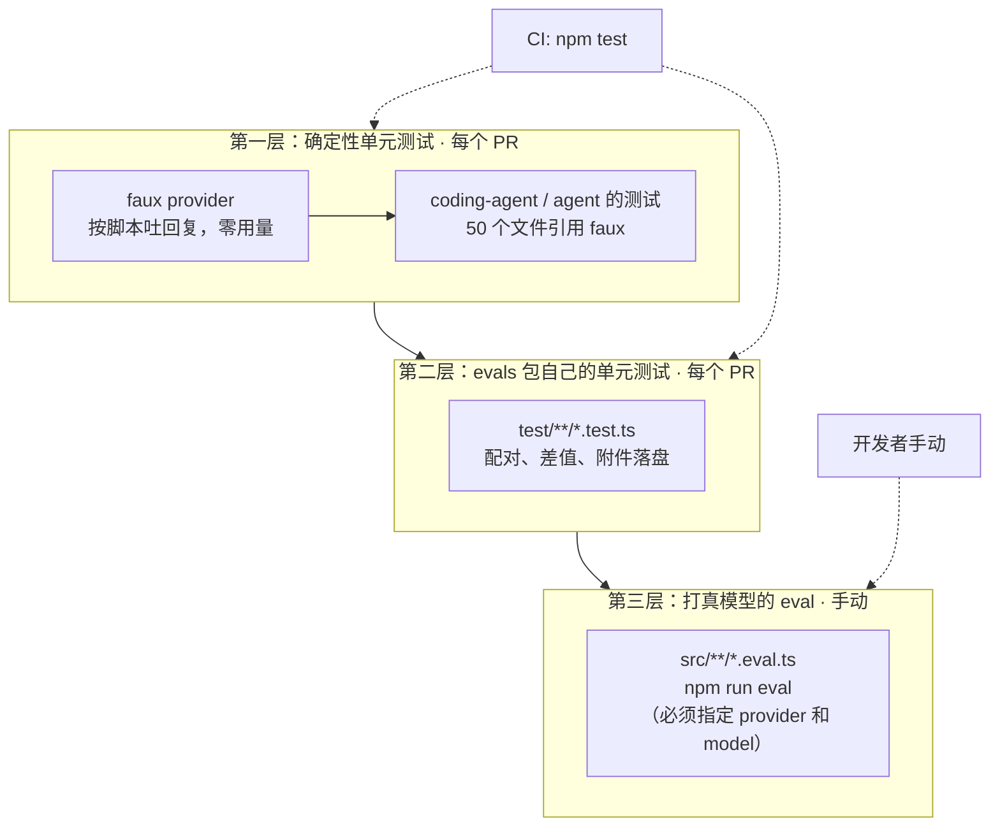
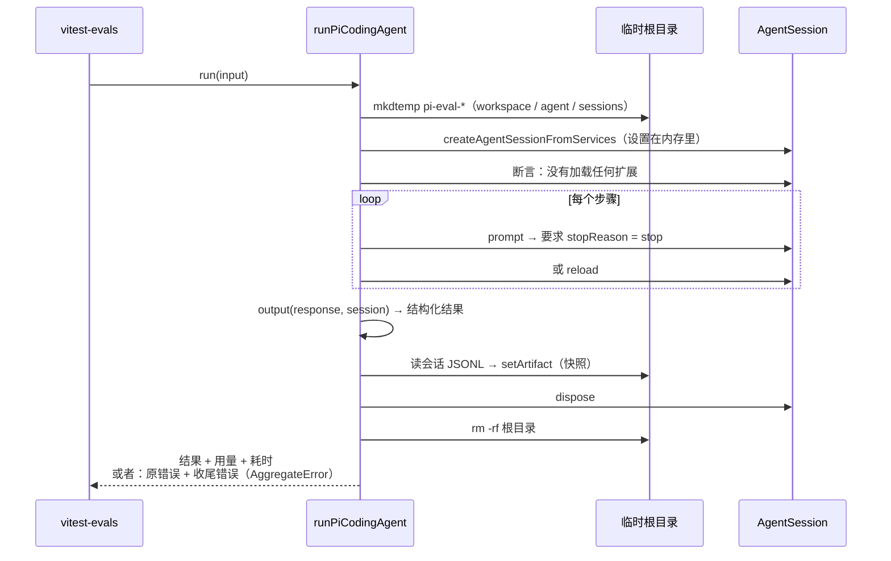
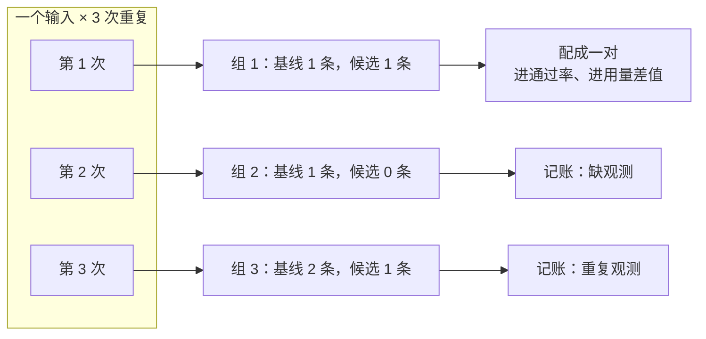
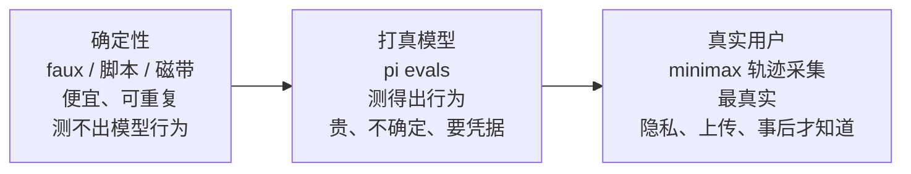

# 第 23 章 evals：怎么知道它做对了

> 基准：pi `b79e4cc8` (v0.84.4)　·　[版本表](../../research/BASELINE.md)　·　[参与指南](../../CONTRIBUTING.md)

**状态**：✅ 已完成

## 本章回答

- pi 自带的 `packages/evals` 测什么、怎么跑、为什么不在 CI 里
- 一次 eval 运行从建目录到删目录，中间哪几步决定了结果可信
- 「候选比基线好多少」是怎么算出来的：为什么要成对、为什么低分不让测试变红
- 跑崩了、没测到用量，报告里该写什么——为什么都不能写成 0
- 产物里有提示词和源码，pi 怎么落盘，下游又多做了什么
- 一个小团队每天都能跑、不花钱的最小回归长什么样

## 素材来源

- 新写 + [`examples/ch23-evals/`](../../examples/ch23-evals/)
- 对照：opencode 的录制回放测试、minimax-code 的轨迹采集、deepseek-harness 的性能门禁、codex 的 e2e bench
- 复用：[第 14 章](../02-getting-started/ch14-debugging.md) 14.7 的录制与回放

（pi 的路径以 `packages/evals/` 为根，`summary.ts`、`harness-table.ts`、`artifacts.ts`、`reporter.ts`、`setup.ts` 都在 `src/vitest-evals/` 下；仓库根的文件写成 `pi/…`。本章带 `【代码事实】` 的是在源码里逐行核对过的，带 `【推断】` 的是从代码推出来、没有实跑验证的，带 `【实机】` 的是在 `examples/ch23-evals/` 里跑出来的：macOS arm64，Node v22.22.3。）

---

前面二十二章做的事，归结起来是两种：改提示词，改工具。每改一次，都会冒出同一个问题——**改完之后，它是变好了，还是变坏了，还是没区别？**

单元测试回答不了这个问题。单元测试问的是「这个函数在这个输入下返回不返回这个值」，而 agent 的输出取决于模型，模型在同一个输入下每次的回答都可能不同。一个「改了系统提示之后，写扩展的成功率从 4/6 变成了 5/6」的结论，既不是一条断言能表达的，也不是跑一次就能信的。

pi 为此单独开了一个包：`packages/evals`。它不大，`src/` 下 8 个文件 1,277 行，但它对「怎么比较两个 agent 配置」做了一整套很具体的选择：成对比较、低分不算失败、跑崩了单列、没测到的数不填 0、产物按权限落盘。这一章把这些选择逐个拆开，再看下游各自选了什么，最后给一个不打模型、每天都能跑的最小实现。

不排名次，只回答「谁选了什么、代价是什么」。

先看几个数字：

| 数字 | 是什么 | 出处 |
| --- | --- | --- |
| **1,277 / 8** | `packages/evals/src/` 的行数 / 文件数；另有 4 个测试文件 463 行 | `wc -l` |
| **2** | eval 文件个数：一个冒烟（问巴黎），一个对比（写扩展） | `src/smoke.eval.ts`、`src/extensions.eval.ts` |
| **0** | pi 的 CI 里跑 eval 套件的步骤；CI 只跑这个包的单元测试 | `pi/.github/workflows/ci.yml:42`、`vitest.test.config.ts` |
| **5** | 一次观测可能的结局：有分、没分、跳过、挂起、出错 | `summary.ts:3` |
| **5** | 进不了对比的原因：缺观测、重复观测、出错、没分数、结局不可评分 | `summary.ts:57` |
| **+66.7** | 本章例子里候选相对基线的通过率提升（个百分点），12 次运行配成 6 对 | 【实机】`npm start` |
| **116** | `examples/ch23-evals/` 的测试用例，零依赖、不联网 | 23.8 |

## 23.1 pi 的 evals 包：测什么，不测什么

README 第一段就把定位说清了：

> Pi evals are behavioral, model-backed checks for Pi workflows. They adapt a real `AgentSession` to `vitest-evals`, run it in isolated temporary project and agent directories, and attach native Pi session artifacts. Use them to measure end-to-end behavior and compare prompts, tools, skills, models, or other harness configurations.（`README.md:3-5`）

三个关键词：**behavioral**（测行为，不测函数）、**model-backed**（打真模型）、**compare**（主要用途是比较）。【代码事实】

它建在 Sentry 的 `vitest-evals` 上（`README.md:38`，`package.json` 里锁的是 `0.15.0`），pi 自己补的是把 `AgentSession` 接成 harness、把两套配置排成对比表、把结果汇总成成对差值这三块：

*表 23-1 `packages/evals/src/` 的 8 个文件*

| 文件 | 行数 | 做什么 |
| --- | ---: | --- |
| `pi-harness.ts` | 257 | 把一个真的 `AgentSession` 包成 `vitest-evals` 的 harness：建临时目录、跑、拍快照、删 |
| `vitest-evals/harness-table.ts` | 193 | 把「基线 + 候选 × 重复次数」展开成一张表，给每次运行打上分组键 |
| `vitest-evals/summary.ts` | 438 | 成对配对、算通过率提升和用量差值、列出进不了对比的观测 |
| `vitest-evals/reporter.ts` | 111 | Vitest reporter：每条结果追加进 `runs.jsonl`，跑完打印对比 |
| `vitest-evals/artifacts.ts` | 113 | 会话快照和生成的源码作为附件落盘 |
| `vitest-evals/setup.ts` | 8 | `afterEach` 里把会话快照登记到测试任务上 |
| `smoke.eval.ts` | 17 | 冒烟：不给工具，问法国首都，要求回答恰好是 `Paris`、token 大于 0 |
| `extensions.eval.ts` | 140 | 唯一的对比集：系统提示带不带文档，写扩展的成功率差多少 |

跑法要求同时给出 provider 和 model：

```bash
npm run eval -- --provider openai --model gpt-5.6-sol
PI_PROVIDER=openai PI_MODEL=gpt-5.6-sol npm run eval
```

（`README.md:12`、`:18`）入口脚本对「只给了一半」直接退出：命令行上给了 `--provider` 就必须也给 `--model`，环境变量也一样（`scripts/run-evals.mjs:51-63`）。【代码事实】harness 自己再查一遍，两个都没有就抛（`pi-harness.ts:46-56`）。

**这些 eval 不在 CI 里。** 链条是这样的：CI 跑 `npm test`（`pi/.github/workflows/ci.yml:42`），根目录的 `test` 是 `npm run test --workspaces --if-present`（`pi/package.json:33`），evals 包的 `test` 用的是 `vitest.test.config.ts`，只收 `test/**/*.test.ts`；eval 套件由另一个配置收 `src/**/*.eval.ts`，只在 `npm run eval` 时跑（`vitest.config.ts:10`）。【代码事实】所以 CI 验证的是**汇总逻辑本身**（配对、差值、附件落盘的单元测试），而不是 agent 的行为。

这个选择不难理解：打真模型要钱、要凭据、结果不确定，放进每个 PR 的 CI 里，三样都不合适。代价是行为回归只在有人想起来手动跑的时候才会被发现。【推断】

把 pi 整个仓库的验证手段摆在一起看，evals 只是最上面那一层：



*图 23-1 pi 的三层验证：前两层每个 PR 都跑、结果确定；第三层打真模型、要人手动触发*

第一层的 faux provider 在 `pi/packages/ai/src/providers/faux.ts`（708 行），默认用量全是 0（`:32-39`）。`coding-agent/test` 下有 48 个文件、`agent/test` 下有 2 个文件引用了它。【代码事实】它和本章最小实现里的「脚本化假模型」是同一个思路，区别在于 faux 是一个真正注册进 pi 的 provider，走的是完整的流式事件链。

## 23.2 一次运行的生命周期

对比实验能不能信，首先取决于每一次运行之间**有没有串味**。上一次写的文件、用户机器上的设置、全局装的扩展，任何一样漏进来，两套配置的差值就不再只是配置的差值。`runPiCodingAgent` 前半段全在处理这件事：

```
// pi-harness.ts：每次运行一个新的临时根目录，设置只在内存里
	const root = await mkdtemp(join(tmpdir(), "pi-eval-"));
	const cwd = join(root, "workspace");
	const agentDir = join(root, "agent");
	let transformedSystemPrompt: string | undefined;
	let sessionManager: SessionManager | undefined;
	let session: AgentSession | undefined;
	let outcome: { success: true; result: SimpleHarnessResult<string | TOutput> } | { success: false; error: unknown };
	try {
		await Promise.all([mkdir(cwd), mkdir(agentDir)]);
		const services = await createAgentSessionServices({
			cwd,
			agentDir,
			modelRuntime,
			settingsManager: SettingsManager.inMemory(),
			...(options.transformSystemPrompt
				? { resourceLoaderOptions: { systemPromptOverride: () => transformedSystemPrompt } }
				: {}),
		});
		signal?.throwIfAborted();
		sessionManager = SessionManager.create(cwd, join(root, "sessions"));
		setArtifact("runId", sessionManager.getSessionId());
```


几处值得记下来：【代码事实】

- **工作目录和 agent 目录都在一个 `mkdtemp` 根下**（`:122-124`）。agent 目录是 pi 放全局设置、扩展、凭据的地方（第 7 章），这里换成了一个空目录，用户自己 `~/.pi/agent` 里的东西进不来。
- **设置只在内存里**（`:135`）。`SettingsManager.inMemory()` 不读也不写任何 `settings.json`。
- **会话 id 就是这次运行的 runId**（`:141-142`），后面落盘、配对附件都靠它。

跑之前还有一道检查：

```
// pi-harness.ts：隔离的会话不该带任何扩展；然后逐步执行 prompt / reload
		try {
			signal?.throwIfAborted();
			if (evalSession.extensionRunner.getExtensionPaths().length !== 0) {
				throw new Error("Expected an isolated eval session to start without extensions.");
			}
			const steps = typeof input === "string" ? [{ type: "prompt" as const, content: input }] : input;
			let response: string | undefined;
			for (const step of steps) {
				if (step.type === "prompt") {
					response = await promptAgent(evalSession, step.content, signal);
				} else {
					await evalSession.reload();
				}
			}
			if (response === undefined) throw new Error("Pi eval input must include at least one prompt step.");
```


`:166-168` 这一行是对前面隔离措施的**验收**：如果临时 agent 目录里居然加载出了扩展，说明隔离漏了，宁可这次运行报错也不要带着污染跑下去。输入可以是一句话，也可以是一串 prompt / reload 步骤（`:169-177`）——对比集就是先让模型写一个扩展，`reload` 把它加载进来，再让模型用它。

每次 `prompt` 结束都要检查停止原因：

```
// pi-harness.ts：没有正常停下、或者停下了却没说话，都算这次运行出错
async function promptAgent(session: AgentSession, input: string, signal: AbortSignal | undefined): Promise<string> {
	signal?.throwIfAborted();
	const previousMessageCount = session.messages.length;
	await session.prompt(input);
	const assistant = session.messages
		.slice(previousMessageCount)
		.reverse()
		.find((message) => message.role === "assistant");
	if (!assistant) throw new Error("Agent run completed without an assistant message.");
	if (assistant.stopReason !== "stop") {
		throw new Error(
			assistant.errorMessage ?? `Agent run ended with unexpected stop reason: ${assistant.stopReason}.`,
		);
	}
	const output = session.getLastAssistantText();
	if (!output) throw new Error("Agent run produced no assistant text.");
	return output;
}
```


`stopReason` 不是 `"stop"`（比如撞了长度上限、被中止、provider 报错）就抛（`:99-103`）。这个异常最后会让这次观测的结局变成「出错」，而不是「0 分」——23.5 会讲为什么这两者必须分开。

收尾的顺序是这一节最值得抄的部分：

```
// pi-harness.ts：先拍快照，再释放会话，再删目录；收尾出的错一个不丢
	const cleanupErrors: unknown[] = [];
	if (sessionManager) {
		try {
			const sessionPath = sessionManager.getSessionFile();
			if (sessionPath && existsSync(sessionPath)) {
				setArtifact(PI_SESSION_SNAPSHOT_ARTIFACT, await readFile(sessionPath, "utf8"));
			}
		} catch (error) {
			cleanupErrors.push(error);
		}
	}
	try {
		session?.dispose();
	} catch (error) {
		cleanupErrors.push(error);
	}
	try {
		await rm(root, { recursive: true, force: true });
	} catch (error) {
		cleanupErrors.push(error);
	}

	if (!outcome.success) {
		if (cleanupErrors.length === 0) throw outcome.error;
		throw new AggregateError([outcome.error, ...cleanupErrors], "Agent run failed and cleanup also failed.");
	}
	if (cleanupErrors.length === 1) throw cleanupErrors[0];
	if (cleanupErrors.length > 1) throw new AggregateError(cleanupErrors, "Agent cleanup failed.");
```




*图 23-2 一次 eval 运行：快照必须在删目录之前；跑失败和收尾失败都要报出来*

> **判断依据：** 为什么不干脆保留临时目录，出了问题再去看？因为对比实验动辄几十次运行，每次留一个目录，磁盘和隐私都扛不住（目录里有模型写的代码、读过的文件）。pi 的做法是**只留一份会话 JSONL**——它记了每一条消息和工具调用，足够复盘——其余全删。代价是工作目录里的最终状态（模型到底写了什么文件）没有被完整保留，需要的话得像对比集那样在 `output` 里显式读出来（`extensions.eval.ts:24-25`）。

收尾错误的处理也有讲究：跑失败了、收尾又失败了，抛的是 `AggregateError`，原错误排第一（`:234-236`）；跑成功了、收尾失败，也照样抛（`:238-239`）。【代码事实】一个删不掉的临时目录不会被悄悄吞掉。

## 23.3 成对对比：只改一处，然后逐对相减

pi 唯一的对比集问的是一个具体问题：**系统提示里带着 pi 的文档，模型写扩展是不是更靠谱？**

两套配置是这样搭的：

```
// extensions.eval.ts：基线截到 Guidelines 之前，候选只截掉工作目录那一行之后
function excludeGuidelinesAndDocumentation(defaultPrompt: string): string {
	const guidelinesStart = defaultPrompt.indexOf("\nGuidelines:\n");
	if (guidelinesStart === -1) throw new Error("Default Pi system prompt has no Guidelines section.");
	return defaultPrompt.slice(0, guidelinesStart);
}

function prepareDefaultPromptOverride(defaultPrompt: string): string {
	const cwdStart = defaultPrompt.lastIndexOf("\nCurrent working directory: ");
	if (cwdStart === -1) throw new Error("Default Pi system prompt has no working-directory section.");
	return defaultPrompt.slice(0, cwdStart);
}
// …
const extensionHarnessTable = evalHarnessTable("Pi extension authoring system prompt", {
	baseline: createExtensionAuthoringHarness("system-prompt-without-docs", excludeGuidelinesAndDocumentation),
	candidate: createExtensionAuthoringHarness("default-system-prompt", prepareDefaultPromptOverride),
});
```


细看会发现，**两边都走了 `transformSystemPrompt`**，候选并不是「什么都不改的默认提示」。【代码事实】基线从 `\nGuidelines:\n` 处截断，Guidelines 和后面的文档一起没了；候选从最后一个 `\nCurrent working directory: ` 处截断，只丢掉末尾的工作目录信息。这样一来，「走没走覆盖路径」「末尾有没有工作目录」这些因素在两边是一样的，**两边唯一的差别就是 Guidelines + 文档那一段**。

这是对比实验的第一条纪律：**只改一处。** 差得越多，结论越说不清是哪一处带来的。

第二条纪律是**成对**。`evalHarnessTable` 把配置和重复次数展开成一张表：

```
// harness-table.ts：外层是第几次重复，内层是每套配置
	const repetitions = options.repetitions ?? 1;
	const candidates = "candidate" in options ? [options.candidate] : options.candidates;
	validateOptions(evalSet, options.baseline, candidates, repetitions);

	const rows: EvalHarnessTableRow<TInput, TOutput>[] = [];
	const harnesses = [options.baseline, ...candidates];
	for (let repetition = 1; repetition <= repetitions; repetition += 1) {
		for (const harness of harnesses) {
			const plan: EvalHarnessIterationPlan = {
				schemaVersion: 1,
				evalSet,
				harness: harness.name,
				baseline: options.baseline.name,
				candidates: candidates.map(({ name }) => name),
				repetition,
			};
			rows.push({
				harness: withIterationArtifact(harness, plan),
				name: harness.name,
				repetition,
			});
		}
	}
```


每一行在运行时会算出一个分组键：

```
// harness-table.ts：分组键 = 输入的身份 + 第几次重复
function deriveInputKey(input: unknown): string {
	if (typeof input === "object" && input !== null && !Array.isArray(input) && "id" in input) {
		const id = input.id;
		if (typeof id === "string" && id.trim()) return id.trim();
	}
	const canonicalInput = JSON.stringify(canonicalizeJson(input, new WeakSet()));
	if (canonicalInput === undefined) throw new TypeError("Eval input must be JSON-serializable.");
	return createHash("sha256").update(canonicalInput).digest("hex");
}

export function deriveEvalGroupKey(input: unknown, repetition: number): string {
	return JSON.stringify([deriveInputKey(input), repetition]);
}
```


输入带了非空的 `id` 就用它，否则用输入的规范 JSON 的 SHA-256（规范化要求有限数字、无环、无稀疏数组、键排序，`:66-98`）。【代码事实】分组键里有重复次数，所以「同一个输入的第 3 次」在基线和候选里各有一条，它们是一对。

汇总时只认「一对」：

```
// summary.ts：每组里两边各恰好一条才配对；分数 ≥ 1 算通过，逐对记谁赢
function pairObservations(
	groups: readonly ObservationGroup[],
	baselineHarness: string,
	candidateHarness: string,
): ObservationPair[] {
	const pairs: ObservationPair[] = [];
	for (const group of groups) {
		const baseline = group.observationsByHarness.get(baselineHarness) ?? [];
		const candidate = group.observationsByHarness.get(candidateHarness) ?? [];
		if (baseline.length === 1 && candidate.length === 1) {
			pairs.push({ baseline: baseline[0], candidate: candidate[0] });
		}
	}
	return pairs;
}
// …
function summarizeCorrectness(pairs: readonly ObservationPair[], totalPairs: number): CorrectnessLiftSummary {
	let eligiblePairs = 0;
	let baselinePasses = 0;
	let candidatePasses = 0;
	let baselineWins = 0;
	let candidateWins = 0;
	let ties = 0;

	for (const { baseline, candidate } of pairs) {
		if (baseline.outcome !== "scored" || candidate.outcome !== "scored") continue;
		eligiblePairs += 1;
		const baselinePassed = baseline.score >= 1;
		const candidatePassed = candidate.score >= 1;
		if (baselinePassed) baselinePasses += 1;
		if (candidatePassed) candidatePasses += 1;
		if (baselinePassed === candidatePassed) ties += 1;
		else if (baselinePassed) baselineWins += 1;
		else candidateWins += 1;
	}
```




*图 23-3 分组与配对：每组每边恰好一条才算一对，其余进诊断列表，不进均值*

为什么要成对，而不是两边各算一个平均分再相减？因为 eval 的输入难度差别很大。假如基线恰好在两道难题上崩了（没出结果）、候选没崩，两边各自取平均，基线的平均分里就少了两道难题，看起来反而更高。成对之后，只有**两边都有结果的那几组**参与比较，比的是同一道题。

报告里除了通过率提升，还写「候选赢几次、基线赢几次、平几次」（`:262-264`）：

*表 23-2 同样是「+16.7 个百分点」*

| 配对数 | 候选赢 | 基线赢 | 平 | 读法 |
| ---: | ---: | ---: | ---: | --- |
| 6 | 1 | 0 | 5 | 一次差别，可能是运气 |
| 12 | 3 | 1 | 8 | 有差别，方向一致性一般 |
| 60 | 10 | 0 | 50 | 差别小，但方向非常一致 |

pi 不替你算显著性。README 把方法论指到了外部的 `skill-eval-harness`（`README.md:152-153`），报告只负责把配对数和输赢次数和差值一起摆出来，够不够信由读的人判断。【代码事实】

## 23.4 低分是观察，不是失败

对比集的 `describeEval` 有一个容易忽略的参数：

```
// extensions.eval.ts：judgeThreshold 设成 null；只有实验搭建本身用硬断言
describe.for(extensionHarnessTable)("$name", ({ harness }) => {
	describeEval(
		"Pi extension authoring system prompt",
		{ harness, judges: [ExtensionAuthoringJudge], judgeThreshold: null },
		(it) => {
			it("creates, reloads, and uses a hello extension", async ({ run, task }) => {
				// …
				const expectsFullPrompt = harness.name === "default-system-prompt";
				expect(result.output.systemPromptHasGuidelines).toBe(expectsFullPrompt);
				expect(result.output.systemPromptHasPiDocs).toBe(expectsFullPrompt);
```


README 解释了为什么：

> Comparative suites should record correctness with deterministic or model-backed judges and set `judgeThreshold: null`. This keeps a low score as an observation instead of making the Vitest invocation fail. Use hard assertions only for suite invariants and infrastructure contracts.（`README.md:136-138`）

这里把检查分成了两种，标准完全不同：【代码事实】

*表 23-3 两种检查*

| | 实验搭对了没有 | agent 做得好不好 |
| --- | --- | --- |
| 例子 | 基线的系统提示里确实没有 Guidelines，候选的确实有（`:134-136`） | 扩展写出来了、加载了、调用返回 `Hello, Bob!`（`:53-98`） |
| 不满足时 | `expect` 失败，测试变红 | 记一个低分，测试照常通过 |
| 为什么 | 搭错了，所有分数都没意义 | 基线本来就可能做不到，这正是要测的 |

如果把「agent 做得好不好」也写成硬断言，基线那一侧注定会红——一个本来就预期会更差的配置，每次跑都让 CI 失败，几次之后大家就会开始忽略它。

pi 的判分器是二值的：所有检查都过是 1，否则是 0，失败项全部写进 rationale（`extensions.eval.ts:89-96`）。【代码事实】README 还专门提醒 `expect.soft(...)` 也会让测试失败，不能拿来当打分（`:138`）。

## 23.5 缺席不是 0，崩溃不进均值

一次运行跑完，reporter 先判定它的结局：

```
// reporter.ts：有错就是出错；有分就是有分；没分时看测试状态
			const score = readFiniteNumber(test.meta().eval?.avgScore);
			const estimatedCostUsd = readFiniteNumber(run.usage.metadata?.estimatedCostUsd);
			const observation = {
				evalSet: iteration.evalSet,
				groupKey: iteration.groupKey,
				testName: test.name,
				file: module.relativeModuleId,
				harness: iteration.harness,
				baseline: iteration.baseline,
				candidates: iteration.candidates,
				repetition: iteration.repetition,
				...(run.usage.totalTokens === undefined ? {} : { totalTokens: run.usage.totalTokens }),
				...(run.timings?.totalMs === undefined ? {} : { totalMs: run.timings.totalMs }),
				...(estimatedCostUsd === undefined ? {} : { estimatedCostUsd }),
			};
			if (run.errors.length > 0) observations.push({ ...observation, outcome: "errored" });
			else if (score !== undefined) observations.push({ ...observation, outcome: "scored", score });
			else {
				const state = test.result().state;
				const outcome = state === "passed" ? "unscored" : state === "failed" ? "errored" : state;
				observations.push({ ...observation, outcome });
			}
```


几个细节：【代码事实】

- **用量字段缺了就不写**（`:71-73`），而不是写成 0。
- **harness 报了错，即使有分也算出错**（`:75` 排在 `:76` 前面）。
- **没有分、但测试失败了，也算出错**（`:79`）——多半是那条硬断言没过，实验没搭对。

汇总时，出错的观测**不进配对**：通过率只统计两边都是「有分」的对（`summary.ts:256`），用量差值也一样（`:220`）。用量还多一道过滤——缺了或者不是有限数字的，这一对就不参与（`:223-229`）；一对都没剩下，结果是 `null`，报告上写「不可用」。

为什么不把出错当 0 分？设想候选改了系统提示，结果在某道题上让 provider 报了一个 400。记成 0 分，报告会说「候选在这道题上不如基线」；但真实情况是**候选把测试跑崩了**——这是需要去修的 bug，不是一个可以拿来比较的行为差异。混在一起，两种问题都看不清。

用量缺失不填 0 的道理一样。`pi-harness.ts` 只有在模型配了价格时才写估算费用：

```
// pi-harness.ts：模型没有价格表，就不写 estimatedCostUsd
			const stats = evalSession.getSessionStats();
			const hasPricing = [model.cost, ...(model.cost.tiers ?? [])].some(
				({ input, output, cacheRead, cacheWrite }) => input > 0 || output > 0 || cacheRead > 0 || cacheWrite > 0,
			);
			outcome = {
				success: true,
				result: {
					output,
					events: toTranscriptEvents(evalSession.messages),
					usage: {
						provider: model.provider,
						model: model.id,
						inputTokens: stats.tokens.input,
						outputTokens: stats.tokens.output,
						totalTokens: stats.tokens.total,
						toolCalls: stats.toolCalls,
						metadata: {
							cacheReadTokens: stats.tokens.cacheRead,
							cacheWriteTokens: stats.tokens.cacheWrite,
							...(hasPricing ? { estimatedCostUsd: stats.cost } : {}),
						},
					},
```


一个自托管、价格全为 0 的模型，`hasPricing` 是 false，费用字段整个不存在。如果写成 `$0`，它会和一个真的很便宜的模型在报告里看起来一样，「候选省了多少钱」就成了一个算错的数。【代码事实】

进不了对比的观测不会消失，它们被列在诊断里：

```
// summary.ts：五种进不了对比的原因
	for (const group of groups) {
		for (const { name: harness } of harnesses) {
			const observations = group.observationsByHarness.get(harness) ?? [];
			let reason: HarnessComparisonDiagnostic["reason"] | undefined;
			if (observations.length === 0) reason = "missing-observation";
			else if (observations.length > 1) reason = "duplicate-observation";
			else if (observations[0].outcome === "errored") reason = "harness-error";
			else if (observations[0].outcome === "unscored") {
				reason = "missing-score";
			} else if (observations[0].outcome !== "scored") {
				reason = "unscorable-outcome";
			}
			if (!reason) continue;
```


*表 23-4 诊断原因*

| 原因 | 什么时候 | 多半意味着 |
| --- | --- | --- |
| `missing-observation` | 这组里这一边一条都没有 | 被跳过、被过滤，或者那一边根本没跑到 |
| `duplicate-observation` | 这一边有两条以上 | 测试写重了，或者两批结果混在一起 |
| `harness-error` | 结局是「出错」 | 跑崩了、没正常停、实验没搭对 |
| `missing-score` | 跑完了但没分数 | 判分器没挂上 |
| `unscorable-outcome` | 跳过或挂起 | `it.skip`、`it.todo` |

还有一种整体性的「不可用」：Vitest 被中断时，reporter 不出对比，只说一句 `Eval comparisons unavailable: test run interrupted.`（`reporter.ts:103-106`）。【代码事实】半截数据算出来的差值比没有差值更糟。

## 23.6 产物：留得下，也藏得住

eval 的产物要留下来复盘，但产物里的东西很敏感。README 说得很直白：

> These files may contain prompts, responses, source code, and tool output.（`README.md:33-34`）

pi 在三个地方处理这件事：【代码事实】

**一、每次运行一个新目录。** 入口脚本默认在 `.eval/` 下用「时间戳 + UUID」建目录（`scripts/run-evals.mjs:9-15`），以 0700 创建（`:69`）；`packages/evals/.gitignore` 第一行就是 `.eval/`。启动时只打印模型名和目录路径（`:70-71`），不打印环境变量。子进程的环境里没有选模型时会主动删掉 `PI_PROVIDER` / `PI_MODEL`（`:79-82`），防止外层的值悄悄成为默认。

**二、索引和附件分开。**

```
// reporter.ts：没设产物目录就什么都不写；索引里去掉 runId 和会话正文；文件 0600
async function appendHarnessRunReport(test: TestCase): Promise<void> {
	const artifactDirectory = process.env.PI_EVAL_ARTIFACT_DIR?.trim();
	if (!artifactDirectory) return;
	const harness = test.meta().harness;
	if (!harness || !isHarnessRun(harness.run)) return;

	const run = harness.run;
	const artifactRunId = run.artifacts?.runId;
	const runId = typeof artifactRunId === "string" ? artifactRunId : randomUUID();
	const metadata = Object.fromEntries(
		Object.entries(run.artifacts ?? {}).filter(([name]) => name !== "runId" && name !== PI_SESSION_SNAPSHOT_ARTIFACT),
	);
	// …
	await mkdir(artifactDirectory, { recursive: true, mode: 0o700 });
	await appendFile(join(artifactDirectory, "runs.jsonl"), `${JSON.stringify(record)}\n`, {
		encoding: "utf8",
		flag: "a",
		mode: 0o600,
	});
```


`runs.jsonl` 只是索引，会话快照本身不进索引（`:23-25`），而是作为附件单独落盘：

```
// artifacts.ts：附件名不许带路径；目录名是 runId 的哈希；目录 0700、文件 0600
		const category = artifact.type === "@earendil-works/pi-evals:session" ? "sessions" : "sources";
		for (const attachment of artifact.attachments) {
			const name = basename(attachment.name);
			if (name !== attachment.name) throw new TypeError(`Invalid eval artifact name: ${attachment.name}`);
			const directory = join(artifactDirectory, category, createHash("sha256").update(runId).digest("hex"));
			await mkdir(directory, { recursive: true, mode: 0o700 });
			const path = join(directory, name);
			await writeFile(path, attachment.body, { encoding: "utf8", mode: 0o600 });
			references.push({ name, path: relative(artifactDirectory, path) });
		}
```


`basename(name) !== name` 就抛（`:103-104`）——附件名是测试代码给的，带一个 `../` 就能写到产物目录外面去，这一行把它挡在边界上。目录名用 runId 的 SHA-256 而不是 runId 本身（`:105`）。

**三、没有遮敏。** `packages/evals` 里 grep 不到 redact 或 mask。【代码事实】pi 的选择是「产物默认就当敏感物处理」：权限收紧、不进版本库、README 写明白，但内容原样保留。对一个只在开发者自己机器上手动跑的工具，这是合理的；产物一旦要上传到共享的地方，就不够了。

这里还有一个容易踩的坑：**`mkdir` 的 mode 只对新建的目录生效。** 设了 `PI_EVAL_ARTIFACT_DIR` 指向一个已经存在的目录时，入口脚本直接用它（`run-evals.mjs:9-10`），`:69` 的 `mode: 0o700` 对已存在的目录不起作用，目录原来是 0755 就还是 0755。【代码事实】本章最小实现就踩过这个坑（23.8）。

下游 minimax-code 的产物是要上传的，所以多了一步遮敏，而且是两步：

```
// payload.ts（minimax-code）：先按字段名收集凭据的值，再全文替换
export function collectSensitiveValues(value: unknown, values: Set<string>): void {
  if (!value || typeof value !== 'object') return;
  const seen = new WeakSet<object>();
  const queue: unknown[] = [value];
  while (queue.length > 0) {
    const current = queue.pop();
    if (!current || typeof current !== 'object' || seen.has(current)) continue;
    seen.add(current);
    for (const [key, child] of Object.entries(current)) {
      if (isSensitiveFieldKey(key) && typeof child === 'string' && child.length >= 6) {
        values.add(child);
      } else if (child && typeof child === 'object') {
        queue.push(child);
      }
    }
  }
}

export function maskText(value: string, sensitiveValues: ReadonlySet<string>): string {
  let masked = value;
  for (const secret of sensitiveValues) masked = masked.split(secret).join(REDACTED);
  return masked;
}
```


先按字段名（`token`、`apikey`、`authorization`……，`:11-26`）把值收集起来，再拿这些值去替换整棵消息树里所有字符串（`:166-170`）。第二步的意义在于：凭据经常同时出现在两处——一个规规矩矩的字段上，和模型复述的一句话、一段日志里。只挡字段名，第二处就漏了。长度小于 6 的值不收集（`:158`），避免把短字符串误伤成满屏 `[REDACTED]`。【代码事实】

## 23.7 下游怎么选

「怎么知道它做对了」在下游有很不一样的答案。按「测的是什么、拿什么当模型、什么时候跑」排开：

*表 23-5 各家的验证手段*

| 项目 | 测什么 | 模型从哪来 | 什么时候跑 | 出处 |
| --- | --- | --- | --- | --- |
| pi | 行为：两套配置的成功率差 | 真模型 | 手动 | `packages/evals/`，23.1 |
| opencode | provider 适配层：请求怎么发、响应怎么解析 | 录好的 HTTP 磁带 | 每次测试（回放）；`RECORD=true` 时重录 | `packages/llm/test/recorded-runner.ts:68-75` |
| minimax-code | 线上真实轨迹 | 用户的真实会话 | 可选开启，上传到后端 | `packages/local-runtime/src/eval/` |
| deepseek-harness | 性能：耗时、内存 | 不涉及；合成的固定输入 | 仓库级门禁 | `benchmarks/AGENTS.md:3`、`:9` |
| codex | CLI 帮助命令的端到端耗时 | 不涉及 | bench | `codex-rs/cli/e2e_benches/codex_help.rs` |

**opencode** 选的是录制回放（第 14 章 14.7 讲过 pi 怎么自己录）。`RECORD=true` 时打真接口、写磁带，缺了必需的环境变量就跳过（`recorded-runner.ts:68-72`）；默认是回放，磁带不存在也跳过（`:73-75`）。磁带放在 `fixtures/recordings/`（`recorded-test.ts:20`），目前 40 个；录的时候走一个 Redactor（`:79-84`）。【代码事实】代价是：回放测的是「解析器对这份录音还认不认」，模型换了说法它测不出来；而磁带缺失是跳过不是失败，新加的用例忘了录，测试会安静地少一条。

**minimax-code** 的 eval 目录是另一回事：它采集的是**生产环境的轨迹**。宿主创建时 `evalCapture` 是可选的，没配就不建 reporter（`packages/local-runtime/src/runtime/host-factory.ts:95-97`）；一批最多 16 步、请求体上限 6 MiB（`src/eval/reporter.ts:41-42`）；上传失败一律放行，不影响用户的会话（`src/eval/transport.ts:11`）。【代码事实】它回答的问题不是「这次改动有没有改坏」，而是「真实用户遇到了什么」——这是离线 eval 的素材来源，不是离线 eval 本身。【推断】

**deepseek-harness** 的 `benchmarks/` 是性能门禁，规则写得很硬：只用从常量合成的固定输入，「Never use recorded Sessions, user material, ambient repositories, or network services」（`benchmarks/AGENTS.md:9`）；每个样本在新的子进程和私有 `mkdtemp` 根下跑，失败了也要删（`:10`）；预算写在源码常量里，环境变量不许覆盖（`:12`）。【代码事实】它的「临时目录、跑完就删、失败也删」和 pi 的 eval harness 是同一种纪律，只是测的是快不快，不是对不对。



*图 23-4 从确定到真实：越往右越接近真实用户，越往左越便宜、越可重复*

三者不互相替代。一个小团队的现实做法是：**左边每个 PR 都跑，中间改提示词或换模型时手动跑，右边有条件再上。** 下一节的最小实现落在最左边，但借用了中间那一层的全部统计口径。

## 23.8 你的最小实现

这一节把前面几节收成一个能跑的东西：`examples/ch23-evals/`，2,974 行（含测试），零依赖，不联网，不需要 API key。

它要回答的问题和 pi 的对比集同构：**换一个更小心的写文件工具，agent 的成功率会不会变好？** 区别是模型换成了脚本——脚本一条条吐工具调用，工具在临时目录里真的建目录、写文件。模型那半确定，工具那半真实；测试结果变了，只可能是接线变了。

### 关键代码

| 文件 | 行数 | 它是什么 |
| --- | ---: | --- |
| `src/harness.ts` | 183 | 脚本化的假模型 + 真工具；每次运行一个临时目录 |
| `src/tools.ts` | 147 | 两套写文件工具，其余共用 |
| `src/cases.ts` | 274 | 三个用例、多项判分 |
| `src/assertions.ts` | 154 | 断言只返回失败列表，不抛 |
| `src/score.ts` | 236 | 成对对比与报告 |
| `src/recorder.ts` | 166 | 产物：遮敏、权限 |
| `src/run.ts` | 301 | 命令行：`run` / `compare` / `show` |

每次运行一个临时目录，和 `pi-harness.ts` 一样「跑完就删、抛异常也删」，现场在删之前拍下来：

```
// harness.ts：cwd 是 root 下的 work/，越界的写入仍落在临时目录里
export function runInWorkspace(harness: Harness, input: RunInput): RunResult {
	const root = mkdtempSync(join(tmpdir(), "ch23-eval-"));
	const context: ToolContext = { cwd: join(root, "work"), root };
	try {
		mkdirSync(context.cwd, { recursive: true });
		input.setUp?.(context);
		harness.prepare?.(context);
		const { events, output, toolCalls } = runScript(harness, input.script, context);
		return {
			output,
			events,
			usage: { provider: "scripted", model: harness.name, toolCalls, ...(input.usage ?? {}) },
			artifacts: input.inspect ? input.inspect(context) : {},
		};
	} finally {
		rmSync(root, { recursive: true, force: true });
	}
}
```


基线和候选只差写文件这一个工具。候选多做两件事——先看路径出没出工作目录，再建父目录：

```
// tools.ts：越界检查放在写之前，不是写之后
const carefulWriteFile: Tool = {
	name: "write_file",
	run(args, context) {
		const path = readArg(args, "path");
		const content = readArg(args, "content");
		if (path === undefined) return { ok: false, error: "缺少 path 参数" };
		if (content === undefined) return { ok: false, error: "缺少 content 参数" };
		const { absolute, escaped } = resolveInside(context, path);
		if (escaped) {
			// 报错里给出的是「离工作目录有多远」，不是绝对路径：绝对路径进产物就是噪声
			const shown = isAbsolute(path) ? relative(context.cwd, absolute) : path;
			return { ok: false, error: `拒绝写入工作目录之外的 ${shown}` };
		}
		try {
			mkdirSync(dirname(absolute), { recursive: true });
			writeFileSync(absolute, content, "utf8");
			return { ok: true };
		} catch (error) {
			return { ok: false, error: `${path} 写不了：${describeFsError(error)}` };
		}
	},
};
```


三个用例各有分工：`hello-extension` 是**该赢的地方**（`src/` 不存在，基线写不进去）；`patch-existing` 是**对照组**（两边都该过）；`escape-workspace` 是**该守住的地方**（基线把文件写到了工作目录外面）。没有对照组，「候选 +66.7 个百分点」就说不清是来自那一处改动，还是来自别的什么。

判分拆成几项，每项独立记：

```
// cases.ts：四项检查，过几项算几分；四项全过才是 1
	judge: (result) =>
		judgeFromChecks([
			{ check: "工具顺序", failures: expectToolOrder(result.events, ["read_file", "write_file"]) },
			{ check: "没有报错", failures: expectNoErrors(result.events) },
			{ check: "文件落盘", failures: expectFileExists(result, "src/hello.ts") },
			{ check: "回复不撒谎", failures: expectHonestReport(result, "已创建 src/hello.ts") },
		]),
```


和 pi 的二值判分不同，这里给部分分。但「通过」的口径不变：分数 ≥ 1 才算（`summary.ts:258`）。部分分的价值在汇总表里：0.5 分说明「工具顺序对、回复诚实，但工具失败了、文件没落盘」——**模型那一半没错，坏的是工具那一半。**

配对和计数照抄 `summary.ts`：

```
// score.ts：两边各一条、都没出错才配对；逐对记通过和输赢
		for (const [, group] of sortedGroups) {
			const baselineList = group.get(options.baseline) ?? [];
			const candidateList = group.get(candidate) ?? [];
			// …
			if (baselineList.length === 1 && candidateList.length === 1 && !baselineList[0].errored && !candidateList[0].errored) {
				pairs.push({ baseline: baselineList[0], candidate: candidateList[0] });
			}
		// …
		let baselinePasses = 0;
		let candidatePasses = 0;
		let baselineWins = 0;
		let candidateWins = 0;
		let ties = 0;
		let scored = 0;
		for (const pair of pairs) {
			const baselineScore = pair.baseline?.score;
			const candidateScore = pair.candidate?.score;
			if (baselineScore === undefined || candidateScore === undefined) continue;
			scored += 1;
			const baselinePassed = baselineScore >= 1;
			const candidatePassed = candidateScore >= 1;
			if (baselinePassed) baselinePasses += 1;
			if (candidatePassed) candidatePasses += 1;
			if (baselinePassed === candidatePassed) ties += 1;
			else if (baselinePassed) baselineWins += 1;
			else candidateWins += 1;
		}
```


### 跑起来

```bash
cd examples/ch23-evals
npm start                                          # 3 用例 × 2 重复 × 2 方案 = 12 次运行
npm start -- --usage                               # 写入按脚本推算的用量（不是测出来的）
npm run compare                                    # 读回最后一批，成对对比；候选变差时退出码 1
node --experimental-strip-types --no-warnings src/run.ts show <runId 前缀>
npm test                                           # 116 个用例
```

`npm start` 的输出（候选的六行全是「通过」，略去）：

```
eval 集：工具边界（12 次运行）
  baseline-write   通过 2/6
    hello-extension    第 1 次  未通过 0.50
      4 项过 2 项——没有报错（出现 error 事件：write_file 失败：src/hello.ts 写不了：ENOENT；工具失败：src/hello.ts 写不了：ENOENT）；文件落盘（期望产物里有 src/hello.ts，实际有 [README.md, package.json]）
    hello-extension    第 2 次  未通过 0.50
      …（同上）
    patch-existing     第 1 次  通过
    patch-existing     第 2 次  通过
    escape-workspace   第 1 次  未通过 0.00
      2 项过 0 项——没有越界写入（工作目录之外出现了 ../build/output.txt）；越界时给了原因（越界的写入既没被拒绝，也没有任何失败原因）
    escape-workspace   第 2 次  未通过 0.00
      …（同上）
  careful-write    通过 6/6
```

接着是对比：

```
eval 对比
  工具边界
        基线  baseline-write
        候选  careful-write
      通过率  +66.7 个百分点（候选 100.0%，基线 33.3%；候选赢 4，基线赢 0，平 2）
       token  不可用（配对 0）
        耗时  不可用（配对 0）
        费用  不可用（配对 0）
```

【实机】退出码 0。`run` 永远不因为分数低而失败——这是 `judgeThreshold: null` 的对应物。用量三行写「不可用」：脚本没有真的调模型，这三个数就是没测到，不是 0。加 `--usage` 才会填进按脚本长度推算的值，并打印一行提示说明它们不是测出来的。

「平」的两次是对照组 `patch-existing`。4 次候选赢，正好是两个「该赢」和两个「该守住」——差值全部能归到那一处改动上。

想知道那 0.5 分到底发生了什么，用 `show` 看轨迹：

```
runId：2026-10-03T18-09-19-768Z-50e6b8（12 条记录）

hello-extension / baseline-write / 第 1 次  分数 0.5
  输入：在 src/ 下新建 src/hello.ts，导出一个返回问候语的 hello 函数。
  输出：没能完成：write_file 失败：src/hello.ts 写不了：ENOENT
  调用：list_files {"path":"."}
  结果：list_files 成功
  调用：read_file {"path":"package.json"}
  结果：read_file 成功
  调用：write_file {"path":"src/hello.ts","content":"export const hello = () => 'hi';\n"}
  结果：write_file 失败（src/hello.ts 写不了：ENOENT）
  报错：write_file 失败：src/hello.ts 写不了：ENOENT
  判分：4 项过 2 项——没有报错（…）；文件落盘（…）
```

错误里只有错误码 `ENOENT`，没有临时目录的绝对路径——那个路径每次都变，进了轨迹是噪声，进了产物还会带出本机的目录结构（`tools.ts:38-41`）。

`compare` 是门禁。它默认只比 `runs.jsonl` 里**最后一批**：

```
// run.ts：追加写的产物要按批比；一对都配不上时 --gate 也要红
/**
 * runs.jsonl 是追加写的：同一个目录跑两次，里面就有两批。两批混在一起比，
 * 每一组都会有两条基线、两条候选，全被记成「重复观测」——一对也配不上。
 * 所以默认只比最后一批；要比更早的那批，用 show 先找到 runId 再说。
 */
export function latestRun(records: readonly RunRecord[]): { readonly runId: string | undefined; readonly records: readonly RunRecord[]; readonly skipped: number } {
	const runId = records.at(-1)?.runId;
	const latest = records.filter((record) => record.runId === runId);
	return { runId, records: latest, skipped: new Set(records.map((record) => record.runId)).size - (runId === undefined ? 0 : 1) };
}

function compareCommand(options: Options): number {
	const { runId, records, skipped } = latestRun(readRecords(options));
	console.log(`对比的是 runId ${runId ?? "（无）"}，共 ${records.length} 条${skipped > 0 ? `；更早的 ${skipped} 批没有参与` : ""}`);
	const observations = records.map((record) => record.observation);
	// 只比没崩的那些：崩溃单列，不然「候选把测试跑挂了」看起来像「候选变差了」
	const report = compare(observations, { baseline: BASELINE, candidates: [CANDIDATE] });
	console.log(renderReport(report));

	// 一对都没配上，不等于「没有变差」。--gate 下这种情况要红：沉默不是通过
	const incomparable = report.comparisons.filter((comparison) => comparison.lift === null);
	if (incomparable.length > 0) {
		const message = `有 ${incomparable.length} 个候选没法和基线比（一对都没配上），先看上面「没进对比的观测」`;
		if (!options.gate) {
			console.log(`\n${message}（没加 --gate，退出码仍是 0）`);
			return 0;
		}
		console.error(`\n${message}`);
		return 1;
	}
```


同一个目录跑两次，再 `compare`，第一行是「对比的是 runId …，共 12 条；更早的 1 批没有参与」。【实机】如果不这么做，两批混在一起，每组都有两条基线、两条候选，全部记成「重复观测」，一对也配不上，通过率变成「不可用」——而「不可用」不等于「没有变差」，所以 `--gate` 下这种情况也返回 1。

把基线和候选的标签对调，模拟一次回归：

```
      通过率  -66.7 个百分点（候选 33.3%，基线 100.0%；候选赢 0，基线赢 4，平 2）
…
有 1 个候选低于基线：careful-write -0.6667
```

【实机】退出码 1。

产物的权限：

```
// recorder.ts：目录已经存在时 mode 不起作用，只报不改；文件 0600
/**
 * 目录已经存在时，`mkdirSync` 的 mode 不起作用——它只管新建的那一层。
 * 产物目录要是事先被别的东西以 0755 建好了，0700 就是一句空话。
 * 这里不替调用方 chmod（`--out .` 会把整个项目目录改掉），只把实情说出来。
 */
export function permissionWarning(outputDir: string): string | undefined {
	const mode = statSync(outputDir).mode & 0o777;
	if ((mode & 0o077) === 0) return undefined;
	return `产物目录 ${outputDir} 的权限是 ${mode.toString(8)}，同机器的其他用户能读；建议换一个新目录，或者 chmod 700`;
}

/** Node 的 fs 没有「原子追加且自动建目录」，所以在这里做一次，之后走 appendFileSync */
export function createRecorder(options: RecorderOptions): Recorder {
	mkdirSync(options.outputDir, { recursive: true, mode: 0o700 });
			// …
			const line = JSON.stringify(redact(record as unknown as JsonValue, secrets));
			appendFileSync(runsPath, `${line}\n`, { encoding: "utf8", mode: 0o600 });
```


【实机】新目录跑出来是 `drwx------`，`runs.jsonl` 是 `-rw-------`。事先用 0755 建好目录再跑，会多一行提示「产物目录 … 的权限是 755，同机器的其他用户能读；建议换一个新目录，或者 chmod 700」。不替调用方 `chmod`，是因为 `--out .` 会把整个项目目录的权限改掉。

### 逐段对照本章

| 本章 | 例子里的位置 |
| --- | --- |
| 23.2 每次运行一个临时目录，删之前拍现场 | `harness.ts:166-183` |
| 23.3 只改一处 | `tools.ts:133-147`（两套 harness 只差 `write_file`） |
| 23.3 对照用例 | `cases.ts:167-184`（`patch-existing`） |
| 23.3 分组键 = 用例 + 第几种脚本，成对比较 | `run.ts:115-125`，`score.ts:95-181` |
| 23.4 低分不让测试失败 | `run.ts:159-193`（只有脚本自己抛了才返回 1） |
| 23.5 跑崩了单列、缺席不是 0 | `cases.ts:244-274`（`scriptError`），`score.ts:71-89` |
| 23.6 产物：权限与遮敏 | `recorder.ts:50-81`、`:113-142` |

### 测试

116 个用例，九个文件：`assertions` 16、`cases` 12、`harness` 13、`recorder` 13、`root` 6、`run` 19、`score` 16、`trace` 12、`workspace` 9。全部通过：

```
# tests 116
# pass 116
# fail 0
```

几个值得一提的：`harness.test.ts` 断言每次运行都在自己的临时目录里、跑完就删；`cases.test.ts` 断言整体对比是 +66.7 个百分点、对照组是那两个平局，以及不加 `--usage` 时用量缺席；`score.test.ts` 断言跑崩了的观测进诊断不进均值、重复观测一对也不配、中英文标签在报告里按终端列宽对齐；`recorder.test.ts` 断言凭据在字段上和正文里都被换掉，以及事先存在的 0755 目录会被报出来；`run.test.ts` 断言两批混在一起时只比最后一批、一对都配不上时 `--gate` 返回 1。

### 本例没做的

- **没有真模型。** 脚本读不懂系统提示，所以 pi 对比集测的那种「提示词带不带文档」的差异，在这里表达不出来，只能比工具和准备步骤。要测提示词，把 `runScript` 换成一次真的 `AgentSession`，其余的配对、诊断、产物可以原样复用。
- **没有统计显著性。** 重复两次只能看出脚本稳不稳定。报告把配对数和输赢次数摆出来，判断留给人。
- **`--usage` 的数是推算的。** 只为看报告格式。
- **没有进 CI。** 它零依赖、一秒内跑完，完全可以放进每个 PR；本书的 CI 只跑构建和死链检查，这一步留给读者自己的仓库。

### 三个教训

**一、只改一处，再加一个两边都该过的用例。** pi 的对比集让两边都走覆盖路径，只在截断点上不同；本例让两套 harness 只差一个工具，再用 `patch-existing` 做对照。少了任何一样，差值都说不清来自哪里。

**二、跑崩了不是 0 分，没测到不是 0。** 前者是需要修的 bug，单列、不进均值；后者是缺失的数据，写「不可用」。把它们记成 0，「候选把测试跑挂了」会看起来像「候选变差了」，「没有价格表」会看起来像「免费」。

**三、默认值会悄悄失效，要么验收，要么报出来。** pi 在隔离之后断言「没有加载扩展」；本例发现 `mkdir` 的 mode 对已存在的目录不起作用，于是去掉了入口处那次抢先的 `mkdir`，并在目录权限过宽时报一行提示。默认值写在代码里，不等于它在运行时真的生效了。

## 本章小结

- **pi 的 `packages/evals` 是打真模型的对比评测**，`src/` 8 个文件 1,277 行，建在 `vitest-evals` 上。CI 只跑它的单元测试，eval 套件要手动 `npm run eval --provider … --model …`。
- **每次运行一个新的临时根目录**，设置只在内存里，隔离之后还要断言没有加载扩展；删目录之前先把会话 JSONL 拍下来，收尾出的错一个不丢。
- **对比实验只改一处。** 唯一的对比集让两边都走 `transformSystemPrompt`，差别只在截断点。
- **成对比较。** 分组键 = 输入的身份 + 第几次重复，每组两边各恰好一条才配对；分数 ≥ 1 算通过，lift = 候选通过率 − 基线通过率，同时报告输赢次数。
- **`judgeThreshold: null`：低分是观察，不是失败。** 只有「实验搭对了没有」才用硬断言。
- **出错不进均值，缺席不是 0。** 五种进不了对比的原因单独列出；没有价格表的模型不写费用；被中断的运行不出对比。
- **产物默认当敏感物**：每次一个新目录，0700 / 0600，附件名挡住路径，不进版本库；pi 不遮敏，要上传的下游（minimax-code）按字段名 + 同值替换两步遮。
- **下游各选了一段**：opencode 录制回放 provider 层，minimax-code 采集线上轨迹，deepseek-harness 做性能门禁。确定性的每个 PR 跑，打真模型的改提示词时跑。
- **`examples/ch23-evals/` 是不花钱的最小回归**：假模型、真工具、只差一处、对照用例、多项判分、只比最后一批、`--gate`。

下一章讲版本与升级：pi 每月几百个 commit，补丁版和次版本各承诺了什么；下游是依赖 npm 包、vendor 进来打补丁还是自己 fork，升级那天先看哪几十个文件。
