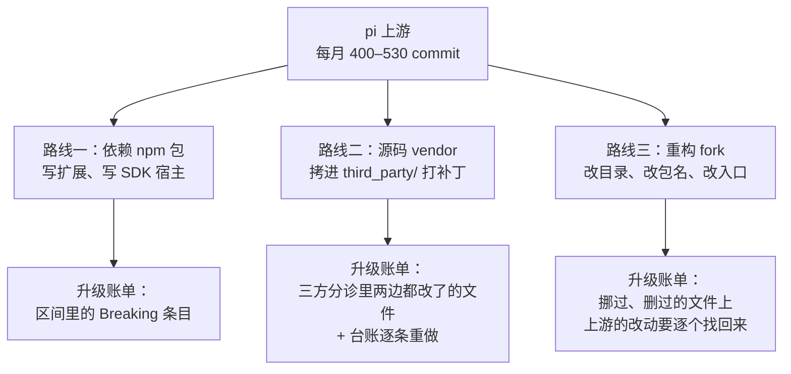
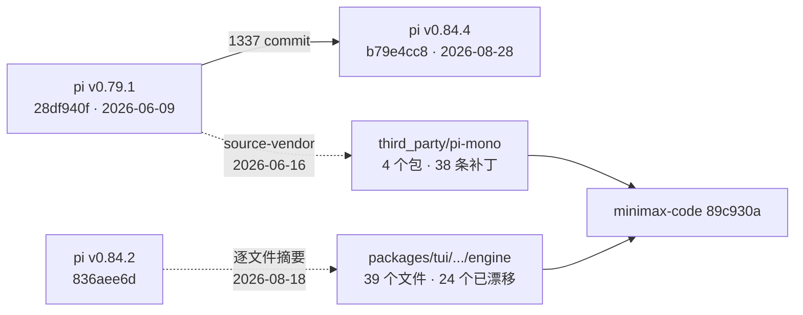
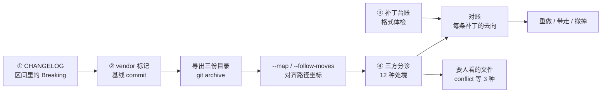
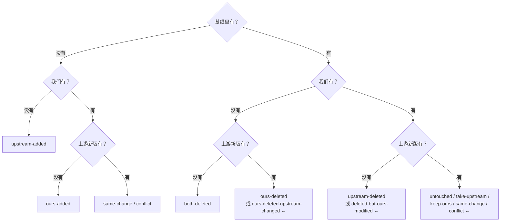

# 第 24 章 版本与升级策略

> 基准：pi `b79e4cc8` (v0.84.4)　·　[版本表](../../research/BASELINE.md)　·　[参与指南](../../CONTRIBUTING.md)

**状态**：✅ 已完成

## 本章回答

- pi 每月 400–530 个 commit，新贡献者的 PR 默认自动关闭——你改的东西大多回不了上游
- pi 的版本号承诺了什么：补丁版只修复和新增、次版本才破坏；实际的 CHANGELOG 和这条承诺差多少
- pi 给老用户留了哪些兼容，没给下游源码留什么
- 下游有三条路：依赖 npm 包、把源码 vendor 进来打补丁、重构成自己的 fork；每条路的升级账单长什么样
- 升级那天要回答的四个问题，以及怎么用一个小工具把「要人看的文件」从几百个缩到几十个

## 素材来源

- `research/pi/01-product-teardown.md` §1.6
- `research/pi/02-architecture-and-guardrails.md` §2.4–2.6
- 对照：`Step-Code` `7dd66cb`、`minimax-code` `89c930a`
- 配套代码：[`examples/ch24-upgrade-triage/`](../../examples/ch24-upgrade-triage/)

---

第 2 章结尾提过一个非技术因素：pi 的两份 README 第一句话都是「新贡献者的 issue 和 PR 默认自动关闭」（2.6 节）。第 4 章又提醒：pi 没做的能力，你先补了，就要准备好将来和上游的实现合并或二选一（4.1 节）。这两句话合起来就是本章的问题：**基于一个跑得很快、入口很窄的上游做产品，你自己的那份 diff 怎么长期活下去。**

这是全书第四部分「交付」的一章。前面几部分讲怎么在 pi 上加东西；本章讲加完之后，上游每发一个版本，你要付多少代价、怎么把代价算清楚。本章不比较哪条路更好，只回答「谁选了什么、代价是什么」。

先看几个数字：

| 数字 | 是什么 | 出处 |
| --- | --- | --- |
| **400–530** | pi 自 2026-02 起每月的 commit 数 | `research/pi/01-product-teardown.md` §1.6 |
| **272 / 46 / 108** | `coding-agent` CHANGELOG 里的版本数 / 带破坏性变更的版本 / 破坏性变更条目 | 本例 `changelog` 命令，见 24.2 |
| **8** | 只动了补丁号、却带着破坏性变更小节的版本 | 同上 |
| **1337** | minimax-code 的基线 v0.79.1 到本书基准 `b79e4cc8` 之间的 commit | `git log --oneline v0.79.1..b79e4cc8` |
| **38 / 35** | minimax-code 补丁台账的条目 / 其中写明「未开上游 PR」的 | `third_party/pi-mono/MINIMAX_CHANGES.md`，见 24.5 |
| **40 / 505** | minimax-code 升到本书基准时要人看的文件 / 涉及的路径 | 本例 `triage` 命令，见 24.5 |
| **81 / 724** | Step-Code 升到 v0.85.1 时要人看的文件 / 涉及的路径 | 同上，见 24.6 |
| **0.84.4 / 0.1.0** | Step-Code 各包的 `version` / 产品对用户显示的版本 | `packages/*/package.json:3`；`src/step/version.ts:11` |

---

## 24.1 上游有多快，门有多窄

### 速度

pi 仓库到本书基准有 5,825 个 commit、297 个贡献者。2025-12 到 2026-01 是爆发期（2026-01 一个月 1,224 次），此后稳定在每月 400–530 次，约每天 15 次（`research/pi/01-product-teardown.md` §1.6）。

落到下游身上，速度体现为「你停一下，就落下多少」。本书测了两段：

| 区间 | 时间 | commit 数 |
| --- | --- | --- |
| v0.79.1 (`28df940f`) → `b79e4cc8` (v0.84.4) | 2026-06-09 → 2026-08-28 | 1,337 |
| `b79e4cc8` → v0.85.1 | 2026-08-28 → 2026-09-05 | 460 |

第一段正好是 minimax-code 的基线到本书基准的距离（24.5 节）；第二段是 Step-Code 的大致分叉点到下一个上游版本的距离（24.6 节）。后一段只隔了一周，因为 v0.85 合进了一批在分支上攒了半个月的 commit。

### 入口

pi 的贡献规则写在 `CONTRIBUTING.md`，由三个 GitHub 工作流执行（`research/pi/02-architecture-and-guardrails.md` §2.5）：

| 规则 | 出处 |
| --- | --- |
| 新贡献者的 issue 和 PR 默认自动关闭 | `CONTRIBUTING.md:23`；根 `README.md:11`、`packages/coding-agent/README.md:11` |
| 维护者每天看一遍被关掉的 issue，够格的重新打开；不够格的不回复 | `CONTRIBUTING.md:27` |
| 维护者回 `lgtmi`：以后的 issue 不再自动关；回 `lgtm`：issue 和 PR 都不再自动关 | `CONTRIBUTING.md:31-34`；`.github/workflows/approve-contributor.yml` 把用户写进 `.github/APPROVED_CONTRIBUTORS` |
| 没拿到 `lgtm` 之前不要开 PR | `CONTRIBUTING.md:58`；`.github/workflows/pr-gate.yml:119` 是关 PR 时贴的话 |

理由也写了（`CONTRIBUTING.md:81`）：issue 多到维护者没法实时负责地看，很多不合格，有些是「通过 agent 不经思考地甩进仓库」的；自动关闭给维护者一个缓冲，按自己的节奏看。

再加上集中度：Mario Zechner 一人占 65%，前两人 79%，前五人 89%（§1.6）。

【推断】对下游来说，这几条加在一起意味着三件事。第一，「先在本地改，再提回上游」不是默认路径：要先开 issue、等维护者认可，才有资格开 PR，而维护者的判断标准是 pi 自己要不要这个功能，不是你的产品需不需要。第二，你等不起：上游每天十几个 commit，你的补丁在本地放一个月，基线就漂走五百个 commit。第三，上游的方向由很少几个人决定，你没法通过参与讨论来影响它的节奏。所以下游要按「我的改动会一直留在本地」来规划，能回到上游是意外之喜。

### 判断依据

- **pi 每月 400–530 个 commit，前五人占 89%**：`research/pi/01-product-teardown.md` §1.6。【代码事实】
- **v0.79.1 到本书基准 1,337 个 commit，基准到 v0.85.1 又 460 个**：`git log --oneline` 计数。【代码事实】
- **新贡献者的 issue / PR 自动关闭，拿到 `lgtm` 才能开 PR，由工作流执行**：`CONTRIBUTING.md:23`、`:31-34`、`:58`；`pr-gate.yml:119`。【代码事实】
- **下游应当按「改动长期留在本地」来规划**：由速度、入口和集中度推出。【推断】

---

## 24.2 版本号告诉你什么，没告诉你什么

### pi 的约定

pi 的版本约定写在给 agent 看的 `AGENTS.md` 里：

```text
// pi: AGENTS.md:129
**Lockstep versioning**: all packages share one version; every release updates all together.
`patch` = fixes + additions, `minor` = breaking changes. No major releases.
```

三层意思：

- **锁步**：所有包共用一个版本号，一起发。发布脚本会检查，版本不一致就拒绝发布（`scripts/publish.mjs:72`）。
- **补丁号 = 修复 + 新增，次版本号 = 破坏性变更**。发破坏性版本走 `npm run release:minor`（`AGENTS.md:157`；根 `package.json:45-46`）。
- **没有主版本**。pi 停在 0.x，这在 semver 里本来就意味着「随时可能破坏」；pi 自己补了一条规则，把破坏性变更收到次版本号上。

CHANGELOG 的写法也有规定：未发布的改动放在 `## [Unreleased]` 下，分 `### Breaking Changes`（需要迁移的 API 改动）、`### Added`、`### Changed`、`### Fixed`、`### Removed` 五节（`AGENTS.md:114`）；发出去的版本段不许再改（`:119`）。

【推断】这套约定对下游是一份很有用的承诺：只要它成立，你可以放心跟补丁版，只在次版本号变时停下来读 `Breaking Changes`。

### 实际的 CHANGELOG

本例的 `changelog` 命令把 `packages/coding-agent/CHANGELOG.md` 整个读一遍：

```text
$ npm start -- changelog .../pi/packages/coding-agent/CHANGELOG.md
  272 个版本，其中 46 个带破坏性变更，共 108 条
  只动了补丁号、却带破坏性变更的：0.23.2→0.23.3，0.51.2→0.51.3，0.52.5→0.52.6，0.52.6→0.52.7，
    0.52.9→0.52.10，0.80.6→0.80.7，0.80.7→0.80.8，0.84.2→0.84.3
  破坏性变更小节的标题有 2 种写法：「Breaking Changes」45 次，「Breaking」1 次
```

46 个带破坏性变更的版本里，有 8 个只动了补丁号。再缩到 minimax-code 要跨的那一段：

```text
$ npm start -- changelog .../CHANGELOG.md --from 0.79.1 --to 0.84.4
  区间 (0.79.1, 0.84.4]
  30 个版本，其中 5 个带破坏性变更，共 20 条
  0.80.7   2026-07-14  1 条（第 663 行）
  0.80.8   2026-07-16  5 条（第 623 行）
  0.83.0   2026-07-29  1 条（第 413 行）
  0.84.0   2026-08-06  12 条（第 217 行）
  0.84.3   2026-08-24  1 条（第 43 行）
  只动了补丁号、却带破坏性变更的：0.80.6→0.80.7，0.80.7→0.80.8，0.84.2→0.84.3
```

五个带破坏性变更的版本里三个是补丁版。看看内容：

- **0.80.7**（`CHANGELOG.md:667`）：删掉了 `models.json` 里 `openai-responses` 的 `compat.sendSessionIdHeader`，改用 `compat.sessionAffinityFormat`。这是**用户的配置文件**格式变了。
- **0.80.8**（`:633-637`）：SDK 的 `CreateAgentSessionOptions.authStorage` 和 `modelRegistry` 换成异步的 `modelRuntime`；`AuthStorage` 不再导出；扩展能调的 `ModelRegistry.refresh()` 从同步改成返回 `Promise<void>`，「扩展必须先 await 它」。
- **0.84.3**（`:53`）：`GoogleThinkingLevel` 改名为 `GoogleApiThinkingLevel`。

这 20 条里有 6 条提到扩展（extension），9 条提到 SDK、导出或 API。

【推断】这不是说 pi 不守规矩。8 / 272 是一个小比例，而且每一条都老老实实写进了 `Breaking Changes`——约定的第二半（写清楚）执行得比第一半（放对版本号）更稳。对下游的含义只有一条：**版本号是提示，CHANGELOG 才是事实**。npm 的 `^0.84.0` 在 0.x 上只放行 0.84.x 的补丁版，这恰好是上面那三个版本所在的位置；要想升级不出意外，就钉死精确版本，每次升级前把区间里的 `Breaking` 小节读一遍——这件事可以交给工具。

基准之后还有一个例子：v0.85.0（2026-09-04）是次版本，却没有 `Breaking Changes` 小节；第二天的 v0.85.1 修了「0.85.0 无意中把内部的实验代码和依赖发布出去、导致 SDK 导入失败」的问题（v0.85.1 的 `CHANGELOG.md:17`）。【推断】发布本身也会出错，钉版本加上升级前跑一遍自己的测试，比相信任何一个版本号都可靠。

### 判断依据

- **pi 锁步发版：补丁 = 修复 + 新增，次版本 = 破坏，没有主版本；发布脚本检查锁步**：`AGENTS.md:129`、`:157`；`scripts/publish.mjs:72`。【代码事实】
- **CHANGELOG 有固定的五节，发出去的版本段不许改**：`AGENTS.md:114`、`:119`。【代码事实】
- **272 个版本里 46 个带破坏性变更、共 108 条，其中 8 个是补丁版**：本例 `changelog` 命令对 `packages/coding-agent/CHANGELOG.md` 的统计。【代码事实】
- **v0.79.1 到 v0.84.4 之间 5 个带破坏性变更的版本里 3 个是补丁版，内容涉及配置文件、SDK 和扩展 API**：`CHANGELOG.md:53`、`:633-637`、`:667`。【代码事实】
- **版本号是提示，CHANGELOG 才是事实；下游应钉精确版本、升级前读区间里的破坏性变更**。【推断】

---

## 24.3 pi 给老用户留的兼容

破坏性变更多，不等于 pi 不管兼容。它的兼容是**给用户的**：用户的扩展、用户的会话文件。

**扩展的导入名。** pi 的包换过两次 scope：最早是个人的 `@mariozechner/*`，后来是组织的 `@earendil-works/*`。扩展加载器给扩展准备了一张虚拟模块表，两套名字都指向同一份打包好的模块（`core/extensions/loader.ts:57-73`）。`pi-ai` 的根入口还特意指向 compat 入口：

```ts
// pi: packages/coding-agent/src/core/extensions/loader.ts:59-62
	// Extensions resolve the pi-ai root to the compat entrypoint (a strict
	// superset of the core entrypoint): existing extensions using the old
	// global API keep working at runtime until compat is removed.
	"@earendil-works/pi-ai": _bundledPiAiCompat,
```

**会话文件。** 会话格式到了第 3 版（`core/session-manager.ts:30`），读旧文件时依次跑 `migrateV1ToV2`（`:231`）和 `migrateV2ToV3`（`:260`）。

**会话里存着的旧工具参数。** 工具的参数格式会变，但用户恢复一个旧会话时，历史里存的是旧格式。`prepareArguments` 在参数校验之前运行，让工具把旧形状改成新形状（`docs/extensions.md:2031`）；文档举的例子是 `edit` 工具从顶层的 `oldText` / `newText` 变成 `edits: [{ oldText, newText }]`。

【推断】把这三处和 24.2 的破坏性变更放在一起看，pi 的兼容边界很清楚：**用户已经写好的扩展、已经存下的会话尽量不坏；SDK 的类型、导出、内部模块随时可以改**。依赖 npm 包写扩展的下游站在边界里面；把源码拷进来改的下游站在边界外面——你改过的那个内部函数，上游下个版本可能就改名、挪文件或删掉，CHANGELOG 不一定会提，因为它本来就不是公开 API。

### 判断依据

- **扩展加载器同时认 `@earendil-works/*` 和 `@mariozechner/*`，`pi-ai` 根入口指向 compat 入口**：`loader.ts:57-73`。【代码事实】
- **会话格式第 3 版，带 v1→v2、v2→v3 两步迁移**：`session-manager.ts:30`、`:231`、`:260`。【代码事实】
- **`prepareArguments` 让工具接受旧会话里的旧参数形状**：`docs/extensions.md:2031`。【代码事实】
- **pi 的兼容面向扩展和会话，不面向 SDK 内部和源码**：由上面三处和 24.2 的破坏性变更内容推出。【推断】

---

## 24.4 三条路

基于 pi 做产品，大致有三种和上游相处的方式：



*图 24-1 三条路和各自的升级账单：越往右，能改的越多，升级时要人看的东西也越多*

| | 路线一：依赖 npm 包 | 路线二：源码 vendor | 路线三：重构 fork |
| --- | --- | --- | --- |
| 能改什么 | 扩展和 SDK 暴露的面 | 任何文件，但尽量少改 | 任何东西，包括目录结构和包名 |
| 基线 | `package.json` 里的版本号 | 一个钉死的上游 commit | 分叉点，往往没记下来 |
| 升级时比什么 | CHANGELOG | 基线 / 我们 / 上游新版三份 | 同左，但路径坐标先要对齐 |
| 落在 pi 兼容边界的 | 里面（24.3） | 外面 | 外面 |
| 本书的例子 | 第 8、11、12 章的扩展 | minimax-code | Step-Code |

路线一的账单最好算：用 24.2 的工具把区间里的 `Breaking` 条目列出来，逐条看自己有没有用到。路线二和三的账单要按文件算，后面两节用真实数据算一遍。

### 判断依据

- **三条路的区别在于改动落在 pi 兼容边界的哪一侧、基线怎么记**：由 24.3 推出。【推断】
- **minimax-code 走路线二、Step-Code 走路线三**：见 24.5、24.6 的出处。【代码事实】

---

## 24.5 minimax-code：vendor + 台账

minimax-code 把 pi 的源码拷进 `third_party/pi-mono/`，在里面直接改。台账开头写了理由：这样 MiniMax 能「打补丁、验证、发布 agent 循环的修复，而不必等上游的发版节奏」（`third_party/pi-mono/MINIMAX_CHANGES.md:3`）。

### 基线钉在 commit 上

基线写了两遍，一遍给机器读，一遍给人读：

```json
// minimax-code: third_party/pi-mono/.minimax-vendor.json:1-15
{
  "name": "pi-mono",
  "type": "third-party-source-vendor",
  "owner": "MiniMax",
  "upstream": {
    "type": "git",
    "url": "https://github.com/earendil-works/pi-mono.git",
    "ref": "refs/tags/v0.79.1",
    "commit": "28df940f0d07b65284849a483be7b06e2ca046ee"
  },
  "importedAt": "2026-06-16",
  "strategy": "source-vendor",
  "localChangeLog": "MINIMAX_CHANGES.md",
  "policy": "../AGENTS.md"
}
```

`MINIMAX_CHANGES.md:5-10` 用文字重复了上游地址、ref、commit 和导入日期。基线同时记 tag 和 40 位 commit，这是对的：tag 可以被移动，commit 不会。各个 vendor 进来的包的 `version` 都还是 `0.79.1`。

本例的 `vendor` 命令检查这个标记：

```text
$ npm start -- vendor .../minimax-code/third_party/pi-mono/.minimax-vendor.json
  pi-mono @ 28df940f（refs/tags/v0.79.1），2026-06-16 导入
  错误 [dangling-reference] policy 指向 ../AGENTS.md，这个文件不存在
```

`policy` 指向的 `third_party/AGENTS.md` 不存在。台账里 `:155-159` 有一段夹在两条补丁之间的话也提到了这个路径。【推断】策略文件可能被挪走或从没提交；不管哪种，「改上游源码要遵守什么规矩」这件事现在没有机器能找到的出处。

### 台账

台账结尾给了模板（`MINIMAX_CHANGES.md:322-326`）：每条补丁写明原因和涉及的包、是通用的上游材料还是 MiniMax 专用的胶水、验证命令和结果。实际的条目普遍比模板多一个字段 `Upstream PR`（38 条里 36 条有），也就是这条改动有没有提回上游。本例的 `ledger` 命令把这五个字段都当作必填——比模板多要求了一个 `Upstream PR`，这是本书的选择，不是 minimax-code 的规定。

```text
$ npm start -- ledger .../MINIMAX_CHANGES.md
  38 条，2026-06-16 到 2026-09-19
  上游 PR：not-opened 35，merged 1，unknown 2
  改动性质：unknown 6，upstreamable 31，downstream-only 1
  错误 [heading-level] 第 328 行用了 ##，其余条目都是 ###——按章节结构读的工具会把它当成另一节
  错误 [missing-field] 第 16 行「2026-09-19 preserve the system role for Mistral Cha」 缺「change type」
  ……
  提醒 [field-alias] 第 115 行「2026-08-18 route initial Codex OAuth exchange throu」 用了「affected packages」，模板里叫「affected package」
  ……
  合计：错误 9，提醒 14，说明 0
```

几个值得看的点：

- **31 条自评为「通用、可以提回上游」，35 条写明没开 PR。** 唯一「merged」的一条是把上游已合并的 #6457 反向移植回 v0.79.1（`:189-190`）。还有一条写着「没开；通用的那部分上游已经有了」（`:256`）。另一条引用的上游提案 #8113「没合并就关了」（`:29`）。这和 24.1 的入口规则对得上。
- **格式在走样。** 第 16、24、33、42 行用 `Change:` 代替 `Change type:`；第 50 行写成 `Validation in the source monorepo:`；第 115、201、249 行用复数 `Affected packages`；最后一条（`:328`）的标题用了 `##`，被排在模板后面；有 10 条的日期不是倒序。每一处单独看都无伤大雅，加在一起，任何按格式读台账的脚本都会漏读。
- **台账记到包，不记到文件。** 38 条里只有 19 条提到了像文件路径的东西；模板里本来就没有「改了哪些文件」这一项。

【推断】按本书的粗分类，38 条补丁里 15 条是给宿主开的接缝（注入 fetch、暴露流事件、可中止的工具执行边界……），9 条是 provider 兼容，4 条是 Windows / 进程管理，4 条是 TUI / 图片，2 条是 edit 工具的保真，4 条是构建、依赖和测试。前两类占了大半——它们正是 pi「只给机制」的立场（第 15 章）在某些地方给得不够时，下游自己补的机制。

### 升级的账单

把基线（pi v0.79.1）、minimax-code 现在的四个包、本书基准（`b79e4cc8`）三份源码放在一起，按路径做三方分诊（24.7 节解释每个状态）：

```text
$ npm start -- triage --base base --ours ours --next next --ext .ts --ledger .../MINIMAX_CHANGES.md
  76   untouched                      谁都没动
  122  take-upstream                  只有上游改了，拿新版
  5    keep-ours                      只有我们改了，保留
  28   conflict                       两边都改了，要人合  ←
  242  upstream-added                 上游新加
  2    ours-added                     我们新加
  18   upstream-deleted               上游删了，跟着删
  12   deleted-but-ours-modified      上游删了，我们却改过  ←
  合计 505 个路径，要人看的 40 个
```

505 个路径里，要人看的 40 个；其余 465 个可以机械处理。28 个冲突里包括 `agent-loop.ts`、`agent.ts`、`providers/anthropic.ts`，还有 `models.generated.ts`——这是生成文件，该重新生成而不是合并。

12 个「上游删了，我们却改过」的文件全在 `packages/ai` 下（`providers/openai-completions.ts`、`utils/oauth/anthropic.ts` 等）。它们不是真被删了，而是**上游自己挪了目录**：`git diff -M v0.79.1 b79e4cc8 -- packages/ai/src` 显示 14 个改名，比如 `providers/openai-completions.ts → api/openai-completions.ts`（相似度 57%）、`utils/oauth/anthropic.ts → auth/oauth/anthropic.ts`（69%）；这一段里 `packages/ai/src` 改了 174 个文件、加 16,439 行、删 24,281 行。【推断】这正是 24.3 说的「站在兼容边界外面」：这些文件不是公开 API，上游挪它们不需要写进 `Breaking Changes`，但 minimax-code 打在上面的补丁得跟着挪、跟着重写。

再和台账对账，给每条补丁一个去向：

```text
  要重做      2026-08-10  use BEL-terminated OSC 8 hyperlinks for mac…（1 个文件）
  要重做      2026-07-31  preserve signature-only Anthropic thinking …（1 个文件）
  要重做      2026-07-07  bash: graceful SIGTERM→grace→SIGKILL on sto…（2 个文件）
  ……
  对不上文件  2026-09-08  Explicit steering batches
  合计：错误 0，提醒 40，说明 31
```

7 条补丁「要重做」（它们点名的 5 个文件落在冲突里），31 条「对不上文件」（条目里没写到文件）。40 条提醒都是 `package-level-only`：本地改过的 45 个文件里，有 40 个所在的包台账提到了，但没有哪一条点名这个文件。【推断】这不是说这些改动没记账，而是台账的粒度到包为止；升级那天，「这个冲突文件是哪条补丁造成的」只能靠人去翻 git 历史。这是工具的局限，也是模板少了一个字段的代价。

### 第二份基线

minimax-code 的 TUI 还有一份独立的基线。`packages/tui/src/tui/engine/BASELINE.json` 记录了从 pi 拷来的 39 个 TUI 源文件：

```json
// minimax-code: packages/tui/src/tui/engine/BASELINE.json（节选）
{
  "schemaVersion": 1,
  "baselineStatus": "exact_node_next_adaptation",
  "upstream": {
    "repository": "https://github.com/earendil-works/pi.git",
    "sourceRoot": "packages/tui/src",
    "head": "836aee6d38f60428ab6bd2679f93dce43a55dab3",
    "package": "@earendil-works/pi-tui",
    "version": "0.84.2",
    "license": "MIT"
  },
  "importedAt": "2026-08-18",
  "forkEstablishedAt": "2026-08-19",
  "adaptation": {
    "id": "relative-typescript-imports-to-nodenext-javascript-specifiers",
    "behaviorChange": false,
    ...
  },
  "sourceFileCount": 39,
  ...
}
```

这份基线比 `.minimax-vendor.json` 细：每个文件都记了上游的摘要和改写后的摘要，还声明唯一的改写是把相对导入的 `.ts` 换成 `.js`、不改行为。本书拿 pi `836aee6d` 核对，39 个上游摘要全部对得上；到 `minimax-code` `89c930a`，还和「改写后摘要」一致的有 15 个，24 个已经继续改过；同期上游在本书基准上，39 个里 28 个没动。



*图 24-2 一个产品，两份基线：agent 核心停在 v0.79.1，TUI 引擎停在 v0.84.2 那一段；另外 `third_party/sandbox-runtime/upstream.json` 还钉着一个第三方沙箱库*

【推断】两份基线各自都记得很清楚，问题在它们之间：`packages/tui/package.json:24` 依赖 `workspace:*` 的 `pi-coding-agent`，也就是 v0.79.1 那份；而 TUI 引擎来自 v0.84.2 那一段。将来把 `third_party/pi-mono` 升到 0.84 以后，两份 TUI 代码的来源才会重新对齐；在那之前，「我们用的是 pi 的哪个版本」这个问题没有单一答案。

### 判断依据

- **minimax-code 把 pi 源码 vendor 进 `third_party/pi-mono/`，基线钉在 v0.79.1 的 40 位 commit 上**：`.minimax-vendor.json:1-15`；`MINIMAX_CHANGES.md:5-10`。【代码事实】
- **vendor 标记的 `policy` 指向一个不存在的文件**：`.minimax-vendor.json:14`；`third_party/AGENTS.md` 不存在。【代码事实】
- **台账 38 条，35 条写明没开上游 PR，31 条自评为可以提回上游**：本例 `ledger` 命令。【代码事实】
- **台账模板只要求三项，实际条目普遍多一个 `Upstream PR`；格式有 9 处错误、14 处提醒**：`MINIMAX_CHANGES.md:322-326`；本例 `ledger` 命令（必填字段是本书定的）。【代码事实】
- **升到本书基准，505 个路径里 40 个要人看；12 个「上游删了我们却改过」的文件是上游挪了目录**：本例 `triage` 命令；`git diff -M v0.79.1 b79e4cc8 -- packages/ai/src`。【代码事实】
- **台账记到包，40 个本地改过的文件没有被任何条目点名**：本例 `triage --ledger`。【代码事实】
- **TUI 引擎有第二份逐文件基线，来自 pi v0.84.2 那一段，39 个文件里 24 个已继续改过**：`packages/tui/src/tui/engine/BASELINE.json`；本书核对摘要。【代码事实】
- **一个产品里两份基线，「用的是哪个版本的 pi」没有单一答案**。【推断】

---

## 24.6 Step-Code：重构的 fork

Step-Code 走得更远：它不是把 pi 拷进一个子目录，而是整个仓库从 pi 改出来，重排了目录、换了包名、换了产品入口。

### 身份

产品和底层包是两套版本号：

```ts
// Step-Code: packages/coding-agent/src/config.ts:191-195
// `step` is a product facade over the upstream Pi package. Keep the native Pi
// version for ordinary `pi` invocations, but expose the Step release identity
// everywhere the Step entrypoint consumes this constant (CLI flags, TUI and
// SDK metadata).
export const VERSION: string = STEP_ENTRYPOINT ? STEPCODE_VERSION.value : pkg.version || "0.0.0";
```

`src/step/version.ts:4-7` 解释：仓库里的上游 pi 包是实现细节，它们的版本号不是用户从 `step` 看到的版本；发布时注入 tag，源码运行时退回 `STEPCODE_FALLBACK_VERSION = "0.1.0"`（`:11`）。各个包的 `package.json` 都还写着 `0.84.4`，根 `package.json:70` 是 `0.1.0`。

来源写在许可证文件里：「Step Code 派生自 MIT 许可的 Pi 项目」（`LICENSE-STATUS.md:3-7`）；`docs/THIRD_PARTY_PROVENANCE.md` 记录的是第三方素材的审查边界，不是上游版本。仓库里没有 vendor 标记，没有记录产品变更的 CHANGELOG（`packages/telemetry/CHANGELOG.md` 里只有从 pi 带来的空版本标题），git 历史从 `4fdb781`（2026-09-22，一次提交 1,407 个文件）开始，到 `7dd66cb` 共 18 个 commit。

**分叉点没有记下来。** 本书用「和 pi 某个版本字节完全相同的文件数」反推：v0.84.2 是 132 个，v0.84.3 148 个，本书基准 `b79e4cc8` 150 个，v0.85.0 / v0.85.1 降到 103 个。【推断】分叉点在本书基准附近。这和包版本 `0.84.4`、会话格式同为第 3 版（`session-manager.ts:30`）对得上。

### 兼容做在了用户那一侧

和 pi 一样，Step-Code 的兼容是给用户扩展的。它换了自己的包 scope，但扩展加载器里的旧名字一个不删：

```ts
// Step-Code: packages/coding-agent/src/core/extensions/loader.ts:56-58
	// A1: current internal scope (primary resolution target). The legacy
	// @earendil-works/* and @mariozechner/* keys below are kept as backward-compat
	// for existing user extensions (only-add, never remove — see §7.8.5).
```

两个检查脚本把这件事做成了门禁，挂在根 `package.json:19` 的 `check` 链上：

- `scripts/check-legacy-scope-prefix.mjs:3-8`：产品源码里只许用 Step-Code 自己的包 scope；两个旧 scope 只许出现在扩展加载器的别名表和主题的 `Symbol.for` 键里，作为「对外承诺的兼容面，只增不删」。
- `scripts/check-coding-agent-entry-freeze.mjs:3-10`：`coding-agent` 包的 `bin` 和 `exports` 必须是 `scripts/__baseline__/coding-agent-bin.json` 的子集——重构期间可以删入口，不能加入口。

【推断】这两道门禁回答的是「我们的用户升级时会不会坏」，不是「上游升级时我们会不会坏」。对一个重构中的 fork，这是合理的优先级：用户看得见前者，看不见后者。

### 升级的账单

Step-Code 把 pi 的 `packages/ai` 改名为 `packages/providers`、`packages/agent` 改名为 `packages/agent-core`。按路径比之前，先把这两个前缀换回上游的坐标（`--map`），再拿本书基准（当作分叉点）、Step-Code、pi v0.85.1 三份做分诊：

```text
$ npm start -- triage --base b79e4cc8 --ours step --next v0.85.1 --ext .ts \
    --map packages/ai=packages/providers --map packages/agent=packages/agent-core
  103  untouched                      谁都没动
  39   take-upstream                  只有上游改了，拿新版
  70   keep-ours                      只有我们改了，保留
  56   conflict                       两边都改了，要人合  ←
  108  upstream-added                 上游新加
  143  ours-added                     我们新加
  8    upstream-deleted               上游删了，跟着删
  2    deleted-but-ours-modified      上游删了，我们却改过  ←
  168  ours-deleted                   我们删了或挪了，上游没动
  23   ours-deleted-upstream-changed  我们删了或挪了，上游却改了  ←
  4    both-deleted                   两边都删了
  合计 724 个路径，要人看的 81 个
```

和 minimax-code 比，多出来的是下面三行：168 个「我们删了或挪了」、23 个「我们删了或挪了，上游却改了」、143 个「我们新加」。其中很多不是删了，而是挪了——比如 pi 的 `packages/coding-agent/src/modes/interactive/interactive-mode.ts` 在 Step-Code 里搬到了 `apps/cli/src/ui/interactive-mode.ts`，两份已经差了两千多行；同期上游在原路径上又改了 106 行加、89 行删。这类文件在按路径比的工具眼里就是「我们删了，上游改了」。

加上 `--follow-moves`，工具会把「基线里有、我们这里同路径没有、别处有一份内容完全相同的」文件挪回去再比。结果只找回 4 个：

```text
  原样挪走、已挪回去比对的文件：4 个
  107  untouched
  139  ours-added
  164  ours-deleted
  合计 720 个路径，要人看的 81 个
```

【推断】原因很直接：挪走的同时几乎都改过，摘要对不上。191 个「我们删了或挪了」的文件里，有多少是真删、多少是挪了又改，要人一个个判断；其中上游改过的 23 个，如果没人去看，上游的修复就悄悄丢了，不会出现在任何冲突列表里。这是重构 fork 在升级时独有的代价——不是合并难，是**找不到要合并什么**。

### 判断依据

- **Step-Code 产品版本 `0.1.0`，底层包版本 `0.84.4`，`step` 入口用产品版本**：`config.ts:191-195`；`step/version.ts:4-11`；根 `package.json:70`。【代码事实】
- **没有记录上游 commit 的标记、没有产品 CHANGELOG，git 历史从 2026-09-22 的一次导入开始**：仓库内容与 `git log`。【代码事实】
- **分叉点在本书基准附近**：与各版本字节相同的文件数在 `b79e4cc8` 处最多（150 个）。【推断】
- **扩展加载器保留两套旧 scope，只增不删；产品源码只许用新 scope；入口只许减不许增**：`loader.ts:56-58`；`check-legacy-scope-prefix.mjs:3-8`；`check-coding-agent-entry-freeze.mjs:3-10`。【代码事实】
- **升到 v0.85.1，724 个路径里 81 个要人看，191 个删了或挪了，按内容只能找回 4 个**：本例 `triage --map … --follow-moves`。【代码事实】
- **重构 fork 升级的主要代价是找不到上游在挪走的文件上改了什么**。【推断】

---

## 24.7 升级那天的四个问题

把上面两家的账单拆开，下游每次升级都在回答四个问题：

1. **上游在这段版本里声明了哪些破坏？** 读 CHANGELOG，按区间列出 `Breaking` 条目。路线一到这里就够了。
2. **我们的基线钉在哪？** 没有基线，就只能拿「我们」和「上游新版」两份做 diff，分不出哪些差异是自己改的、哪些是上游后来改的。
3. **我们改了什么？** 台账。它要能回答「这个文件为什么和上游不一样」。
4. **哪些文件要人看？** 基线、我们、上游新版三份按路径比，每个路径落进一种处境。



*图 24-3 升级那天的流水线：前三步是读文件，第四步只比摘要，不看内容*

第四步的十二种处境，取决于一个路径在三份里各是什么样：

| 基线 | 我们 | 上游新版 | 处境 | 怎么办 |
| --- | --- | --- | --- | --- |
| A | A | A | `untouched` | 不用管 |
| A | A | B | `take-upstream` | 拿新版 |
| A | B | A | `keep-ours` | 保留我们的 |
| A | B | B | `same-change` | 两边改成一样，补丁可撤 |
| A | B | C | `conflict` | **要人合** |
| — | — | A | `upstream-added` | 拿新版 |
| — | A | — | `ours-added` | 保留 |
| — | A | A / B | `same-change` / `conflict` | 同上 |
| A | A | — | `upstream-deleted` | 跟着删 |
| A | B | — | `deleted-but-ours-modified` | **要人看**：上游删了还是挪了？ |
| A | — | A | `ours-deleted` | 保持删除 |
| A | — | B | `ours-deleted-upstream-changed` | **要人看**：我们是删了还是挪了？ |
| A | — | — | `both-deleted` | 不用管 |

只有三种要人看。另外九种都可以机械处理——这是三方分诊的价值：把「几百个文件不一样」变成「几十个文件要人看」。

**路径坐标要先对齐。** 三份清单必须用同一套路径。整个目录改过名的（Step-Code 的 `providers`），用前缀映射换回去；单个文件原样挪走的，用内容摘要找回来；挪了又改的，工具认不出，只能留给人。

### 判断依据

- **四个问题对应四种输入：CHANGELOG、vendor 标记、台账、三份源码**：由 24.2、24.5、24.6 归纳。【推断】
- **三方分诊的十二种处境里只有三种要人看**：本例 `src/types.ts` 的 `NEEDS_HUMAN`。【代码事实】
- **在 minimax-code 上，三方分诊把 505 个路径缩到 40 个；在 Step-Code 上把 724 个缩到 81 个**：24.5、24.6 的输出。【代码事实】

---

## 24.8 下游怎么做

| | pi | minimax-code `89c930a` | Step-Code `7dd66cb` |
| --- | --- | --- | --- |
| 版本号 | 锁步，0.x，补丁 = 修复 + 新增 | vendor 包仍是 `0.79.1` | 包 `0.84.4`，产品 `0.1.0` |
| 基线记录 | — | `.minimax-vendor.json`：40 位 commit；TUI 另有逐文件摘要 | 无，本书反推在 `b79e4cc8` 附近 |
| 改动记录 | CHANGELOG 五节，发出不改 | `MINIMAX_CHANGES.md`：38 条，记到包 | git 历史（18 个 commit） |
| 提回上游 | — | 35 条写明没开 PR | 未见记录 |
| 对用户的兼容 | 扩展别名、会话迁移、`prepareArguments` | 沿用 pi | 旧 scope 只增不删；入口只减不增 |
| 离上游多远 | — | 1,337 commit（到本书基准） | 一个次版本（到 v0.85.1） |
| 下一次升级要人看的 | — | 40 / 505 | 81 / 724 |

【推断】两家的选择各有道理。minimax-code 改得少、记得细：基线机器可读，每条补丁有原因和验证命令，代价是基线越来越旧、台账格式在走样、一个产品里有两份基线。Step-Code 改得多、记得少：目录和包名按自己的架构重排，代价是分叉点和补丁清单都要从代码里反推，挪过的文件上游再改，没有工具能自动告诉你。

不管走哪条路，有三件便宜的事值得做：

- **把基线写成机器能读的文件，钉到 commit。** minimax-code 已经这样做了；Step-Code 补一个也只要几行 JSON。
- **台账记到文件。** 模板里加一个 `Files:` 字段，比升级那天去翻 git 历史便宜得多。
- **给台账和 vendor 标记加检查，挂到 CI 上。** 格式走样、引用失效，都是一行脚本就能抓住的事。

---

## 24.9 你的最小实现

配套代码 [`examples/ch24-upgrade-triage/`](../../examples/ch24-upgrade-triage/) 给 24.7 的四个问题各一个小工具，零依赖。判断全在纯函数里；只有 `src/manifest.ts` 读磁盘，不跟随符号链接，限制文件数和大小。不执行命令、不联网、不调 git——三份目录由你用 `git archive` 导出。

| 规则 | 出处 | 本例 |
| --- | --- | --- |
| 补丁 = 修复 + 新增，次版本 = 破坏 | pi `AGENTS.md:129` | `src/changelog.ts` 的 `breaksInPatchReleases` |
| 破坏性变更写在 `### Breaking Changes` | pi `AGENTS.md:114` | `src/changelog.ts` 的 `parseChangelog` |
| vendor 标记：地址、ref、commit、日期、台账、策略 | minimax-code `.minimax-vendor.json:1-15` | `src/vendor.ts` |
| 补丁台账的字段 | minimax-code `MINIMAX_CHANGES.md:322-326` | `src/ledger.ts` |
| 逐文件摘要做基线 | minimax-code `packages/tui/src/tui/engine/BASELINE.json` | `src/manifest.ts` + `src/triage.ts` |
| 目录改过名的 fork 先对齐坐标 | Step-Code `packages/providers/`、`packages/agent-core/` | `src/triage.ts` 的 `relocatePrefix`、`detectMoves` |

### 关键代码

三方分诊的核心是一个十几行的函数。输入是同一个路径在三份清单里的摘要（没有就是 `undefined`），输出是 24.7 表里的一种处境：

```ts
// examples/ch24-upgrade-triage/src/triage.ts:6-20
function classify(base: string | undefined, ours: string | undefined, next: string | undefined): FileState | undefined {
  if (base === undefined) {
    if (ours === undefined) return next === undefined ? undefined : "upstream-added";
    if (next === undefined) return "ours-added";
    return ours === next ? "same-change" : "conflict";
  }
  if (ours === undefined) {
    if (next === undefined) return "both-deleted";
    return next === base ? "ours-deleted" : "ours-deleted-upstream-changed";
  }
  if (next === undefined) return ours === base ? "upstream-deleted" : "deleted-but-ours-modified";
  if (ours === base) return next === base ? "untouched" : "take-upstream";
  if (next === base) return "keep-ours";
  return ours === next ? "same-change" : "conflict";
}
```



*图 24-4 `classify` 的判断顺序：先看三份里有没有，再比摘要；带 ← 的分支里各有一种要人看*

原样挪走的文件靠摘要找回来。摘要在两边都必须唯一——内容相同的文件有好几份（比如空的 `index.ts`）时，猜不出谁挪到了哪：

```ts
// examples/ch24-upgrade-triage/src/triage.ts:41-52
export function detectMoves(base: Manifest, ours: Manifest): Move[] {
  const unique = (entries: Array<[string, string]>): Map<string, string> => {
    const count = new Map<string, number>();
    for (const [, digest] of entries) count.set(digest, (count.get(digest) ?? 0) + 1);
    return new Map(entries.filter(([, digest]) => count.get(digest) === 1).map(([path, digest]) => [digest, path]));
  };
  const gone = unique([...base].filter(([path]) => !ours.has(path)));
  const arrived = unique([...ours].filter(([path]) => !base.has(path)));
  return [...gone]
    .flatMap(([digest, from]) => (arrived.has(digest) ? [{ from, to: arrived.get(digest) as string }] : []))
    .sort((a, b) => a.from.localeCompare(b.from));
}
```

找到的挪动交给 `relocate`（`:55-58`），把「我们」那份清单里的路径改回上游的路径，返回一份新清单，不改原来的。

台账对账给每条补丁一个去向。点名的文件里有冲突或「上游删了我们却改过」的，要重做；有「保留我们的」或「我们新加」的，原样带走；全是 `same-change` 的，说明上游已经做了同样的改动，补丁可以撤：

```ts
// examples/ch24-upgrade-triage/src/reconcile.ts:55-60
function fateOf(files: readonly TriagedFile[]): Fate {
  if (files.length === 0) return "unlinked";
  if (files.some((f) => REWORK.has(f.state))) return "rework";
  if (files.some((f) => f.state === "keep-ours" || f.state === "ours-added")) return "carry";
  return files.every((f) => f.state === "same-change") ? "drop" : "stale";
}
```

反过来，本地改过、却没有任何条目提到的文件，按严重程度分两档：连所在的包都没提到的是错误（`unledgered-change`），包提到了、文件没点名的是提醒（`package-level-only`）。分两档是因为 24.5 那 40 个文件：台账记到包是一种合法的写法，不能和「完全没记」混为一谈（`reconcile.ts:62-82`）。

CHANGELOG 那一侧，找「只动了补丁号、却带着破坏性变更」的版本：

```ts
// examples/ch24-upgrade-triage/src/changelog.ts:84-91
export function breaksInPatchReleases(releases: readonly Release[]): PatchBreak[] {
  const sorted = ascending(releases);
  return sorted.flatMap((release, i) => {
    if (i === 0 || release.breaking.length === 0) return [];
    const previous = sorted[i - 1].version;
    return changedPart(previous, release.version) === "patch" ? [{ release, previous }] : [];
  });
}
```

vendor 标记的检查不碰磁盘，「引用的文件在不在」由调用方注入，所以测试不需要真的建目录：

```ts
// examples/ch24-upgrade-triage/src/vendor.ts:44-50
  const findings: Finding[] = [
    ...(FULL_SHA.test(commit) ? [] : [err("commit-not-pinned", `upstream.commit 应该是 40 位 commit，现在是「${commit || "空"}」——tag 和分支会动，commit 不会`)]),
    ...(url.startsWith("https://") ? [] : [err("bad-url", `upstream.url 应该是 https 地址，现在是「${url || "空"}」`)]),
    ...(/^\d{4}-\d{2}-\d{2}$/.test(importedAt) ? [] : [err("bad-date", `importedAt 应该是 YYYY-MM-DD，现在是「${importedAt || "空"}」`)]),
    ...(references.has("localChangeLog") ? [] : [err("no-ledger", "没写 localChangeLog：改了上游哪些地方无处可查")]),
    ...[...references].filter(([, path]) => !exists(path)).map(([key, path]) => err("dangling-reference", `${key} 指向 ${path}，这个文件不存在`)),
  ];
```

### 跑起来

```bash
cd examples/ch24-upgrade-triage
npm start                                          # 六段演示，用的是虚构的 acme-agent
npm start -- changelog CHANGELOG.md --from 0.79.1 --to 0.84.4
npm start -- ledger LOCAL_CHANGES.md
npm start -- vendor third_party/x/.vendor.json
npm start -- triage --base ./base --ours ./ours --next ./next --ext .ts \
    --map packages/ai=packages/providers --follow-moves --ledger LOCAL_CHANGES.md
npm test
```

退出码：0 没有要处理的，1 有（区间里有破坏性变更 / 格式有错 / 有文件要人看），2 用法或输入错误。三份目录用 `git archive <commit> <路径…> | tar -x -C <目录>` 导出；24.5、24.6 的真实数据就是这样跑出来的。

需要 Node ≥ 22.6，没有依赖。演示输出（节选）：

```text
一、从 0.8.0 升到 0.9.1，CHANGELOG 里有什么
  5 个版本，其中 2 个带破坏性变更，共 3 条
  0.8.3    2026-08-12  1 条（第 18 行）
    · Renamed `ThinkLevel` to `ThinkingLevel`. The old name is not re-exported.
  0.9.0    2026-08-30  2 条（第 11 行）
    · `onChunk` now receives deltas only; accumulate them yourself.
    · `Registry.refresh()` is now async.
  只动了补丁号、却带破坏性变更的：0.8.2→0.8.3

二、vendor 标记：基线钉在哪
  acme-agent @ 01234567（refs/tags/v0.8.0），2026-07-03 导入，距今 64 天
  错误 [dangling-reference] policy 指向 ../AGENTS.md，这个文件不存在

三、补丁台账体检
  4 条，2026-07-10 到 2026-08-25
  上游 PR：not-opened 4
  错误 [heading-level] 第 23 行用了 ##，其余条目都是 ###——按章节结构读的工具会把它当成另一节
  提醒 [field-alias] 第 14 行「2026-07-25 回放带签名的空 thinking」 用了「type」，模板里叫「change type」
  ……
  合计：错误 3，提醒 2，说明 0

四、三方分诊：按路径直接比
  ……
  1    ours-added                     我们新加
  1    upstream-deleted               上游删了，跟着删
  1    ours-deleted-upstream-changed  我们删了或挪了，上游却改了  ←
  合计 12 个路径，要人看的 2 个

五、先把挪过的文件挪回去，再比
  原样挪走：packages/ui/src/diff.ts → packages/ui/src/render/diff.ts
  2    take-upstream                  只有上游改了，拿新版
  ……
  合计 11 个路径，要人看的 1 个
    conflict                       packages/agent/src/loop.ts

六、台账和实际改动对账
  要重做      2026-08-20  工具钩子能中止整轮（2 个文件）
  可以撤掉    2026-07-25  回放带签名的空 thinking（1 个文件）
  原样带走    2026-08-25  导出内部的重试函数（1 个文件）
  原样带走    2026-07-10  自家网关的请求头（1 个文件）
  错误 [unledgered-change] packages/ui/src/keys.ts 和基线不一样（keep-ours），台账里没有哪一条提到它
```

第四、五段是同一份数据：挪走的 `diff.ts` 在第四段被当成「我们删了、上游改了」，挪回去之后变成「只有上游改了，拿新版」——上游的修复不会丢，也不用人看。

### 逐段对照本章

- 第 1 段 ↔ 24.2：`changelog.ts`、`semver.ts`
- 第 2 段 ↔ 24.5 基线：`vendor.ts`
- 第 3 段 ↔ 24.5 台账：`ledger.ts`
- 第 4 段 ↔ 24.7：`triage.ts` 的 `classify`、`triage`
- 第 5 段 ↔ 24.6：`triage.ts` 的 `detectMoves`、`relocate`
- 第 6 段 ↔ 24.5 对账：`reconcile.ts`

`npm test` 跑 8 个测试文件、45 个用例，覆盖：版本号解析（认 `v` 前缀，预发布和两段版本报错）、CHANGELOG 的区间和标题的两种写法、补丁号里的破坏性变更、台账的六种格式问题和上游 PR 状态的识别、vendor 标记的六条规则、十二种处境各至少一例、挪动识别在摘要重复时不猜、目录前缀按目录边界匹配（`providers` 不会误匹配 `providers-extra`）、对账的五种去向和两档未点名、清单跳过符号链接和 `node_modules`、以及命令行的退出码。

本例没做的：只比摘要，不做内容合并，「要人合」的文件还是得用 `git merge-file` 或手工处理；挪走之后又改过的文件认不出来（要做就得按内容相似度配对，像 `git diff -M` 那样）；台账到文件的关联靠条目里出现的路径，只写函数名或类型名的条目关联不上；CHANGELOG 只认 `## [x.y.z]` 标题和 `### Breaking…` 小节。

### 维护一份长期 diff 的三个教训

1. **基线要钉到 commit，并且让机器读得到。** tag 会被移动，「大概是 0.84 那会儿」半年后没人说得清。没有基线，三方分诊退化成两方 diff（演示第 2 段；24.6 只能靠数相同文件反推分叉点）。
2. **台账要写到文件。** 只写「改了哪个包」的台账，升级那天回答不了「这个冲突文件是哪条补丁造成的」。格式也要有机器检查，不然三个月就走样（演示第 3、6 段；24.5 的 9 个错误、14 个提醒）。
3. **挪目录是有价的。** 重排目录之后，按路径比的工具会把挪走的文件全算成「删了」，上游在这些文件上的改动不会出现在冲突列表里，而是悄悄丢掉（演示第 4、5 段；24.6 的 23 个文件）。

---

## 本章小结

**上游快，门窄。** pi 每月 400–530 个 commit，前五人占 89%；新贡献者的 issue 和 PR 默认自动关闭，拿到 `lgtm` 才能开 PR。下游要按「改动长期留在本地」来规划。

**版本号是提示，CHANGELOG 才是事实。** pi 约定补丁版只修复和新增、次版本才破坏，并且把每条破坏都写进了 `Breaking Changes`；但 272 个版本里有 8 个补丁版带着破坏性变更。钉精确版本，升级前把区间里的 `Breaking` 条目列出来。

**pi 的兼容是给用户的。** 扩展的旧导入名、旧会话的迁移、旧工具参数的 `prepareArguments` 都留着；SDK 内部和源码不在这条线里。依赖 npm 包写扩展的下游站在线里，改源码的下游站在线外。

**三条路，三种账单。** 依赖 npm 包，账单是 CHANGELOG；minimax-code 把源码 vendor 进来打补丁，基线钉得清楚、台账记到包，升到本书基准 505 个路径里 40 个要人看，另有一份独立的 TUI 基线；Step-Code 重构成自己的 fork，兼容做在用户扩展那一侧，分叉点没记，升到 v0.85.1 有 191 个文件被挪走或删掉，按内容只能找回 4 个。

**升级那天四个问题：破坏、基线、补丁、要人看的文件。** 三方分诊把每个路径放进十二种处境之一，只有三种要人看；先对齐路径坐标，再和台账对账，给每条补丁一个去向。

升级前跑的那套「它还做得对吗」的检查怎么建，见第 23 章；补丁台账、vendor 标记这类记录能不能当合规材料、要怎么保存，见第 25 章。
