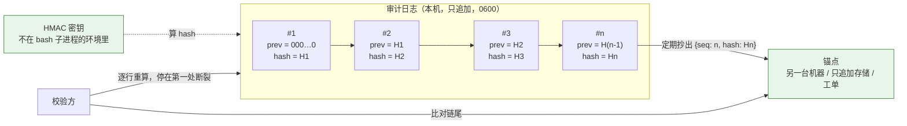
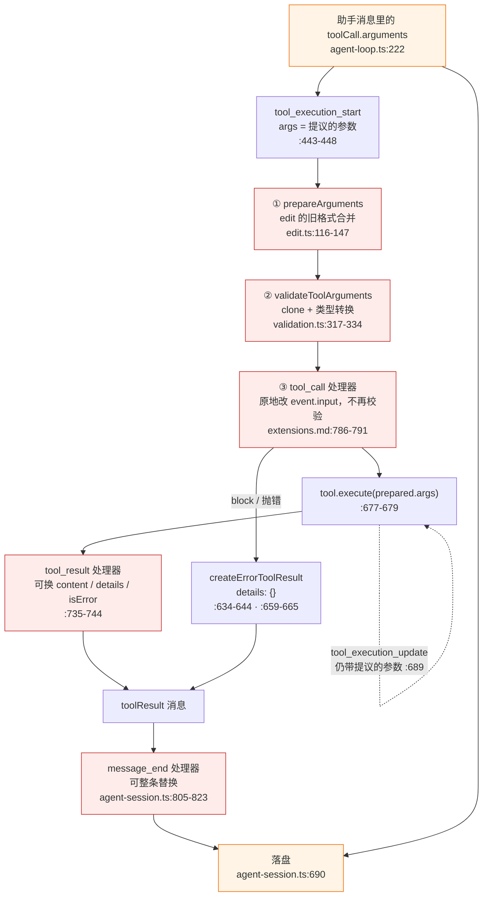
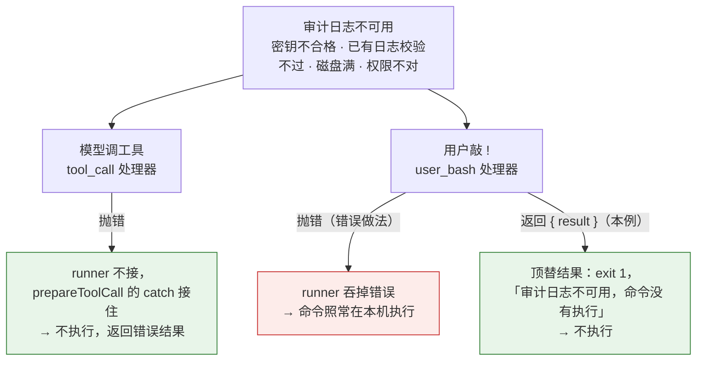

# 第 25 章 合规与审计边界

> 基准：pi `b79e4cc8` (v0.84.4)　·　[版本表](../../research/BASELINE.md)　·　[参与指南](../../CONTRIBUTING.md)

**状态**：✅ 已完成

## 本章回答

- pi 的会话文件能回答「当时发生了什么」，为什么回答不了「这份记录没被动过」
- 会话不是只追加的：哪几处会整文件重写，读一次文件为什么就变了
- 会话里记的参数和真正执行的参数，中间隔着哪几步；被拦下和工具失败为什么分不清
- 哪些东西根本不在会话里：截断前的完整输出、发给模型的请求、留在环境变量里的密钥
- Step-Code 和 minimax-code 各自补了什么、没补什么
- 受监管场景必须补的几样东西，以及一条能自证的审计日志最少要几行代码
- 分发时的许可证义务：从 MIT 的 pi 衍生、从 Apache-2.0 的 ZCode 借代码，各要带上什么

## 素材来源

- `research/pi/08-observability.md` §8.4
- `research/pi/07-extensibility.md` §7.2（扩展点清单）、`research/pi/05-tools-permissions.md` §5.5（`beforeToolCall` 的实际用途）
- `research/BASELINE.md`（各仓库的许可证）、`research/zcode/README.md`
- 对照：`Step-Code` `7dd66cb`、`minimax-code` `89c930a`
- 配套代码：[`examples/ch25-audit-log/`](../../examples/ch25-audit-log/)

（pi 的路径以 `packages/coding-agent/src/` 为根；`agent/src/` 指 `packages/agent/src/`，`ai/src/` 指 `packages/ai/src/`，`docs/` 指 `packages/coding-agent/docs/`。Step-Code 的路径同样以 `packages/coding-agent/src/` 为根，另注明的除外；minimax-code 的路径以 `packages/local-runtime/src/` 为根。各仓库根目录下的 `LICENSE`、`NOTICE`、`scripts/`、`third_party/` 按仓库根写。）

---

第 14 章结尾回答过一个问题：会话能当审计记录吗？答案是不能直接用（14.9 节）。那一节列了四条理由——迁移时重写、没有哈希、坏行被跳过、不记系统提示词——然后把「要补的东西：防篡改、不可抵赖、和请求对上」留给了本章。第 15 章又留了一句：策略决定该不该留痕，留下的记录能不能当审计证据，见第 25 章。

本章把这两句话兑现。先把边界说清楚：**会话文件是为恢复对话设计的，审计记录是为证明发生过什么设计的**，两者的取舍正好相反。恢复要容错——坏了一行也要尽量打开；证明要严格——坏了一行，从那里往后都不能再信。pi 选了前者，这是一个本地开发工具合理的选择；下游要把它放进受监管的环境，就要知道差的是哪几块、每块的代价是什么。本章不评判「pi 该不该做审计」，只回答「谁选了什么、代价是什么」。

先看几个数字：

| 数字 | 是什么 | 出处 |
| --- | --- | --- |
| **0** | pi 会话写入路径里的哈希、签名、校验和调用 | `core/session-manager.ts`，全文无 `createHash`/`createHmac` |
| **3** | 会话文件被整个重写的调用点：空文件初始化、版本迁移、分支导出 | `core/session-manager.ts:910`、`:919`、`:1486` |
| **3 / 2** | 执行参数可能和会话参数不同的步骤 / 能在落盘前替换工具结果的钩子 | `agent/src/agent-loop.ts:615-626`；`:735-744`、`core/agent-session.ts:805-823` |
| **2000 行 / 50 KB** | 工具输出超过就截断，完整输出写到 `tmpdir()` | `core/tools/truncate.ts:11-12`；`core/bash-executor.ts:64-74` |
| **10 / 0** | minimax-code 会话账本的事件种类 / 其中带哈希字段的 | minimax-code `sessions/ledger/ledger-event.ts:8-28` |
| **32** | 本例要求的 HMAC 密钥最少字节数；不够就拦下所有工具调用 | 本例 `src/key.ts` |
| **84** | 本例的测试用例数 | 本例 `npm test` |

---

## 25.1 会话里有什么，证明不了什么

审计员拿到一份记录，会问五个问题：谁、什么时候、做了什么、结果是什么、**这份记录有没有被动过**。前四个是「复盘」，第五个是「证据」。pi 的会话文件对前四个答得相当好，对第五个答不了。

### 前四个问题

| 问题 | 会话里有什么 | 缺什么 |
| --- | --- | --- |
| 谁 | 会话头的 `cwd`、会话 id；用户消息 | 没有操作系统用户、机器标识（单用户工具，本来就不需要） |
| 什么时候 | 每个条目的 `timestamp` | 时间由本机时钟给，没有外部时间源 |
| 做了什么 | 助手消息里的 `toolCall.arguments`；用户 `!` 命令的 `bashExecution` 条目 | 记的是模型**提议**的参数，不是**执行**的参数（25.4） |
| 结果是什么 | `toolResult` 条目：内容、`details`、`isError` | 截断后的版本；完整输出在会话外（25.5）；被拦和失败分不清（25.4） |

这张表里「缺什么」那一列，大多是会话的设计目标决定的。会话要回放给模型，所以存的是模型看到的那一份：模型提议的参数、模型收到的截断结果。从「让对话接着进行」的角度看，这正是该存的东西。

### 第五个问题

「这份记录有没有被动过」，会话文件给不出任何信号：

- **没有哈希。** 会话头 `SessionHeader` 只有 `type`、`version`、`id`、`timestamp`、`cwd`、`parentSession`（`core/session-manager.ts:32-39`）；写条目的 `_persist` 只做 `JSON.stringify` 加追加（`:1016-1043`）。改一行，读的人看不出来。
- **坏行被悄悄跳过。** `parseSessionEntryLine` 解析失败返回 `null`，注释写着 `// Skip malformed lines`（`:503-511`）。删掉一行和写坏一行，在 pi 看来是一样的。
- **会被重写。** 25.2 详细讲。

配套例子的 `session` 命令把这些问题一条条列出来。演示第一段拿一份构造的 pi 会话跑一遍：

```text
一、拿一份 pi 会话：它能证明什么
  6 条可读条目；工具调用 2，结果 2（其中报错 1）；用户 ! 命令 1
  完整输出在会话外的 1 处；内联图片 1 张约 3300 字节
  提醒 [malformed-line] 第 6 行 不是 JSON 对象：pi 加载时悄悄跳过这一行
  提醒 [no-trailing-newline] 末行没有换行：pi 加载时会往文件末尾补一个——读一次，文件就变了
  提醒 [orphan-parent] 第 7 行 parentId e5 找不到：前面有条目被删过，或者文件是拼出来的
  提醒 [external-output] 完整输出在会话之外：/tmp/pi-bash-4f2a.log——会话里只有截断后的部分，那个文件不随会话保存、也没有校验
  说明 [bare-error] 第 5 行 工具报错且 details 为空：是策略拦下的，还是工具自己失败的，会话里分不出来
  说明 [inline-image] 1 张图片按 base64 内联，约 3300 字节
  说明 [proposed-args] 2 次工具调用记的是模型给的参数，不是执行时的那份
  说明 [no-integrity] 条目没有哈希、没有签名：改一行、删末尾几行，加载时都看不出来
```

`orphan-parent` 是会话文件里唯一接近「完整性」的线索：每个条目有 `parentId`，指向前一个条目的 `id`。删掉中间一条，后一条的 `parentId` 就悬空了。但这只是巧合的副产品——删掉末尾几条，或者删掉一条再把下一条的 `parentId` 改掉，都不会留下痕迹。

### 判断依据

- **会话头没有哈希字段**：`core/session-manager.ts:32-39`。【代码事实】
- **写入路径没有哈希或签名**：`core/session-manager.ts:1016-1043`；整个文件不出现 `createHash`、`createHmac`。【代码事实】
- **坏行被跳过**：`core/session-manager.ts:503-511`。【代码事实】
- **会话存的是「模型看到的那一份」，所以适合复盘、不适合证明**：由上面三条和 25.4、25.5 归纳。【推断】

---

## 25.2 不是只追加

审计记录的第一条要求是**只追加**：写下去的东西不再改。pi 的会话大部分时候是追加的，但有三处会把整个文件重写，还有一处会在**读**的时候改文件。

### 三处重写

所有重写都走 `_rewriteFile`：以 `"w"` 模式打开文件，把内存里的条目逐行写回去（`core/session-manager.ts:980-990`）。它有三个调用点：

1. **空文件初始化**（`:903-912`）。用 `--session` 指向一个空文件时，pi 生成会话头写进去。非空但解析不出会话的文件，pi 抛错、不动它（`:905-906`）——这一点是保守的。
2. **版本迁移**（`:918-919`）。旧版本的会话打开时迁移到当前版本，然后整个文件重写。从 v1 迁到 v2 时还会**重新生成所有条目的 `id` 和 `parentId`**（`migrateV1ToV2`，`:241-243`）。迁移之后，原来引用这些 id 的任何外部记录都对不上了。
3. **分支导出**（`:1484-1486`）。从当前会话的某个节点分出一个新会话时，新文件一次写成。这一处写的是**新文件**，原文件不动。

> `research/pi/08-observability.md` §8.4 的可审计性表格把这一条写成「编辑与分支删除触发整文件重写」，不准确。重新核对调用点后，只有上面三处；其中分支导出写的是新文件。日常的编辑、标签、压缩都是追加新条目（`:1041`）。

正常写入路径还有一个细节：新会话在第一条助手消息到来之前不落盘，到来时用 `"wx"`（文件已存在就失败）一次写出所有缓冲的条目（`:1019-1039`），之后才是逐条追加（`:1041`）。这避免了一堆只有用户消息、没有回复的空会话，也意味着**用户发出第一条消息、模型还没回复时进程崩了，这条消息不会出现在任何文件里**。

### 读一次，文件就变了

`loadEntriesFromFile` 读完文件后，如果最后一行没有换行，会往文件末尾补一个：

```ts
// pi: packages/coding-agent/src/core/session-manager.ts:548-556
// Validate session header before repairing the file.
if (entries.length === 0) return entries;
const header = entries[0];
if (header.type !== "session" || typeof (header as { id?: unknown }).id !== "string") {
  return [];
}

if (pending) appendFileSync(resolvedFilePath, "\n");
```

这是为了下一次追加不会和半行粘在一起——上次写到一半崩了，末行没有换行，直接追加会把新条目接在半行后面，两行都坏掉。从恢复的角度看，这是一个周到的修复；从证据的角度看，**打开会话这个读操作改变了文件的字节**，文件的修改时间和大小都变了。有人拿着会话文件的哈希来对质，「我只是打开看了一眼」就足以让哈希对不上。

会话头不合法时直接返回空数组（`:549-553`），pi 把它当成空会话；配合上面「空文件才初始化」的保护，不会误写。

### 删除

在会话选择器里删除一个会话，pi 先试 `trash` 命令（移到系统回收站，`modes/interactive/components/session-selector.ts:650`），失败了就 `unlink`（`:672`）。会话目录用 `mkdirSync(sessionDir, { recursive: true })` 创建，没有指定权限（`core/session-manager.ts:486`），由 umask 决定。

这些都是一个单用户工具的合理选择：用户的文件，用户想删就删。但它意味着审计记录**不能和会话放在一起**——会话的生命周期归用户，审计记录的生命周期归合规策略，两者需要分开。

### 判断依据

- **`_rewriteFile` 以 `"w"` 打开、整体写回**：`core/session-manager.ts:980-990`。【代码事实】
- **三个调用点**：`:910`（空文件）、`:919`（迁移）、`:1486`（分支，写新文件）。【代码事实】
- **v1→v2 迁移重新生成 id**：`:241-243`。【代码事实】
- **加载时给缺换行的末行补一个**：`:555`。【代码事实】
- **首条助手消息前不落盘，之后 `"wx"` 一次写出**：`:1019-1039`。【代码事实】
- **删除先 `trash` 后 `unlink`**：`session-selector.ts:650`、`:672`。【代码事实】
- **审计记录要和会话分开存放，生命周期分开管理**。【推断】

---

## 25.3 没有完整性校验：哈希链、密钥和锚点

要让一份记录「能发现自己被动过」，标准做法是哈希链：每条记录带上前一条的哈希，自己的哈希覆盖自己的全部内容（包括前一条的哈希）。改了任何一条，它自己的哈希就对不上；把它的哈希也改了，下一条的 `prev` 又对不上。

### 链能挡什么，挡不住什么

只有链还不够。链证明的是**内部一致**，不是**没被换掉**。三种篡改，各需要不同的东西才能发现：

| 篡改 | 只有 sha256 链 | 加 HMAC 密钥 | 加外部锚点 |
| --- | --- | --- | --- |
| 改中间一行，不管后面 | ✅ 发现（那一行哈希不对） | ✅ | ✅ |
| 删掉末尾几行 | ❌ 剩下的仍是完好的链 | ❌ | ✅ 锚点记的条数比日志多 |
| 改完把后面的哈希全部重算 | ❌ sha256 谁都能算 | ✅ 篡改者没有密钥 | ✅ 链尾哈希和锚点不同 |

演示第二到四段把这张表跑了一遍（节选，略去了 `unkeyed` 说明和原样的记录列表）：

```text
二、改一行：把 rm -rf build 改成 ls build
  7 行，4 条可信，结论：第 5 行断开
  错误 [hash-mismatch] 第 5 行 内容和 hash 对不上：这一条被改过
  错误 [untrusted-from] 第 5 行 从第 5 行起不可信，后面 2 行没有再查

三、删末尾两行：没有锚点查不出来
  不带锚点：
  5 行，5 条可信，结论：通过
  带锚点（第 7 条，存在日志之外）：
  5 行，5 条可信，结论：链完好，但和锚点对不上
  错误 [anchor-beyond-tail] 锚点记到第 7 条，日志只有 5 条：末尾被截掉了

四、改完把后面全部重算：sha256 挡不住，HMAC 和锚点挡得住
  sha256 链，重算后不带锚点：
  7 行，7 条可信，结论：通过
  同一份，带锚点：
  错误 [anchor-mismatch] 第 7 条的 hash 和锚点不一样：这一条或它之前的记录被重写过
  HMAC 链，篡改者用自己的密钥重算，校验方用真密钥查：
  7 行，4 条可信，结论：第 5 行断开
  同一份，校验方手里没有密钥：
  7 行，7 条可信，结论：通过
  提醒 [missing-key] 7 条 HMAC 记录没有密钥验不了哈希，只查了序号和前后链接
```



*图 25-1 哈希链挡「改中间」，密钥挡「改完重算」，存在别处的锚点挡「删末尾」和「整条重算」；绿色两样都不能和日志放在同一个可写的地方*

### 一条记录怎么封

配套例子的记录是一行规范 JSON。`seal` 把它接到链尾：

```ts
// examples/ch25-audit-log/src/chain.ts:22-34
export function seal(head: Head | undefined, entry: Entry, at: string, signer: Signer): AuditRecord {
  if (!KIND_PATTERN.test(entry.kind)) throw new Error(`记录种类不合规：${JSON.stringify(entry.kind)}`);
  const unsigned = {
    v: RECORD_VERSION,
    seq: head ? head.seq + 1 : 1,
    at,
    prev: head ? head.hash : GENESIS,
    kind: entry.kind,
    body: toJson(entry.body),
    alg: signer.alg,
  } as const;
  return { ...unsigned, hash: digest(signer, hashInput(unsigned)) };
}
```

三处细节值得说：

- **哈希覆盖 `alg`。** 如果 `alg` 不在哈希输入里，篡改者可以把一条 HMAC 记录的 `alg` 改成 `sha256`，再用 sha256 重算——校验方会按 `sha256` 去验，验得过。覆盖之后，改 `alg` 本身就会改掉哈希的输入（`src/chain.ts:19-20`）。校验时还要求「有密钥时每条都必须是 HMAC」（`src/verify.ts:60`），防止 sha256 记录混进来。
- **规范 JSON。** 哈希算的是字节，同一份内容必须只有一种写法：键按字典序、没有空白、拒绝 `NaN` 和 `undefined` 这类 JSON 表示不了的值（`src/canonical.ts:20-37`）。校验时把解析出来的记录重新规范化，和原行逐字节比（`src/verify.ts:55`）——格式被动过也算断裂。
- **`seq` 连续。** 序号从 1 开始逐条加一。删掉中间一条，即使篡改者把下一条的 `prev` 也改了，`seq` 也会跳号（`src/verify.ts:57`）。

### 校验停在第一处断裂

```ts
// examples/ch25-audit-log/src/verify.ts:46-65（节选）
function checkLine(text: string, line: number, previous: AuditRecord | undefined, key: Buffer | undefined): AuditRecord | Finding {
  // …解析、检查字段形状…
  if (canonicalJson(record) !== text) return error("non-canonical", line, "和写入器写出的样子不一样（键序、空白或重复键被动过）");
  const expectedSeq = previous ? previous.seq + 1 : 1;
  if (record.seq !== expectedSeq) return error("seq-gap", line, `seq 应为 ${expectedSeq}，实际是 ${record.seq}`);
  const expectedPrev = previous ? previous.hash : GENESIS;
  if (record.prev !== expectedPrev) return error("prev-mismatch", line, "prev 和上一条的 hash 对不上：中间被删、插或换过");
  if (key && record.alg !== "hmac-sha256") return error("alg-mismatch", line, `有密钥时每条都应是 HMAC，这条是 ${record.alg}：谁都能重算的记录混进来了`);
  if (!key && record.alg === "hmac-sha256") return record; // 没有密钥，哈希验不了，只查到这里
  const { hash, ...unsigned } = record;
  if (digest({ alg: record.alg, key }, hashInput(unsigned)) !== hash) return error("hash-mismatch", line, "内容和 hash 对不上：这一条被改过");
  return record;
}
```

`verifyLog` 逐行调用它，遇到第一个错误就停（`src/verify.ts:98-109`），报告「从第 N 行起不可信」。断点之后的记录即使彼此链得上，也不再检查——它们可能是被整段重写的，把它们算成「大部分完好」，就是在替篡改者说话。这和 pi 会话「跳过坏行接着读」正好相反，也正好体现了 25 章开头说的那条分界：恢复要容错，证明要严格。

### HMAC 的边界

HMAC 用的是对称密钥：**写日志的机器上有密钥，就能重算整条链。** 它能防的是「拿到日志文件、但没拿到密钥的人」——比如日志被拷走、备份被改、同组的人有读写权限。它防不了这台机器本身被控制。要防后者，有两条路：

- **锚点定期送出去。** 每隔一段时间（或者每次会话结束）把链尾的 `{seq, hash}` 写到这台机器改不了的地方。之后再重写，锚点之前的部分就对不上了。锚点之后的记录仍然没有保护，所以要定期更新（`src/verify.ts:79` 会提醒「锚点之后还有 N 条」）。
- **非对称签名或外部只追加存储。** 签名私钥放在硬件里，或者日志直接写进对方的只追加服务。这是本例没做的部分。

密钥本身也有讲究：本例要求至少 32 字节，**不够就报错，不悄悄退回 sha256**（`src/key.ts:11-17`）。一个以为自己开了 HMAC、其实在用 sha256 的部署，比明确没开的更危险。

### 判断依据

- **链挡改中间、密钥挡重算、锚点挡删末尾**：本例演示第 2–4 段；`src/verify.ts` 的 15 个测试。【代码事实】
- **哈希覆盖 `alg`，有密钥时拒绝 sha256 记录**：`src/chain.ts:19-20`；`src/verify.ts:60`。【代码事实】
- **校验停在第一处断裂**：`src/verify.ts:98-109`、`:113`。【代码事实】
- **对称密钥防不了写日志的机器本身**：HMAC 的性质。【推断】

---

## 25.4 记下的参数和执行的参数

审计最关心的一个问题是「到底跑了什么」。pi 的会话能回答「模型**想**跑什么」，回答不了「**实际**跑了什么」。

### 从提议到执行，中间隔着三步

模型的工具调用存在助手消息的 `content` 里（`agent/src/agent-loop.ts:222`），会话落盘的就是这一份。执行之前，参数还要经过三步，每一步都可能改它：

```ts
// pi: packages/agent/src/agent-loop.ts:614-626（节选）
const preparedToolCall = prepareToolCallArguments(tool, toolCall);   // ① 工具自己的兼容转换
const validatedArgs = validateToolArguments(tool, preparedToolCall);  // ② 校验，顺带转换类型
if (config.beforeToolCall) {
  const beforeResult = await config.beforeToolCall(
    { assistantMessage, toolCall, args: validatedArgs, context: currentContext },  // ③ tool_call 处理器可以原地改
    signal,
  );
```

1. **`prepareArguments`。** 工具可以定义一个兼容函数，把旧格式的参数转成新格式。`edit` 工具就有：有些模型把 `edits` 发成 JSON 字符串，或者发单个对象而不是数组，或者用旧的 `oldText`/`newText` 两个顶层字段——`prepareEditArguments` 把它们统一成 `edits` 数组（`core/tools/edit.ts:116-147`）。
2. **校验。** `validateToolArguments` 先 `structuredClone`，再把可选字段的 `null` 规范化、按 schema 转换类型（`Value.Convert`），非 TypeBox 的 schema 还要 `coerceWithJsonSchema`（`ai/src/utils/validation.ts:317-334`）。模型给的 `"10"` 可能变成 `10`。
3. **`tool_call` 处理器。** 文档写得很明白：`event.input` 可变，原地改会影响实际执行，后面的处理器看到的是改过的，**改完不再校验**（`docs/extensions.md:786-791`）。

工具拿到的是第三步之后的那一份（`agent/src/agent-loop.ts:677-679`）。会话里存的是第一步之前的那一份。两者之间的差异，会话里没有任何记录。

更容易误导人的是 `tool_execution_update`：工具执行中途推送部分结果时，事件里带的 `args` 是 `prepared.toolCall.arguments`（`:689`）——也就是模型提议的那份，而不是正在执行的 `prepared.args`。一个监听这个事件来记录「正在执行什么」的扩展，记下的其实是提议。

### 结果在落盘前还能被换

参数的问题在执行之前，结果的问题在执行之后。两个钩子可以替换工具结果：

- **`tool_result`**（`afterToolCall`）：处理器返回的 `content`、`details`、`isError` 会覆盖工具的原始结果（`agent/src/agent-loop.ts:735-744`）。
- **`message_end`**：扩展可以返回一条同角色的消息，替换掉原来的（`core/agent-session.ts:805-823`）。扩展事件先于持久化（`:667-668`），落盘的是替换后的版本（`:684-690`）。

这两个钩子是 pi 机制层的一部分（第 15 章），用来做脱敏、压缩输出、注入提示。但从审计的角度看，**会话里的工具结果是「最后一个处理器愿意让它是什么」**，不一定是工具真正返回的。



*图 25-2 一次工具调用：会话记下的是橙色两头——模型提议的参数，和经过两道钩子之后的结果；红色五处都可能让「记下的」和「发生的」不一样*

### 被拦下和失败，看起来一样

`tool_call` 处理器拦下一次调用，pi 生成一个错误结果：

```ts
// pi: packages/agent/src/agent-loop.ts:758-763
function createErrorToolResult(message: string): AgentToolResult<any> {
  return {
    content: [{ type: "text", text: message }],
    details: {},
  };
}
```

拦下（`:634-644`）、处理器抛错（`:659-665`）、工具不存在（`:605-611`）、参数校验失败（同在 `:659-665` 的 catch 里），都走这个函数；工具执行时抛错也是（`:702-705`）。它们落到会话里，都是一条 `isError: true`、`details: {}` 的 `toolResult`，区别只在 `content` 的那段文字里。审计员要区分「策略拦下了」和「工具自己失败了」，只能去读错误信息的措辞——而 `block` 的 `reason` 是扩展作者随手写的。

不过有一个可靠的信号：**只有真正执行过的调用才会触发 `tool_result` 事件。** 拦下、参数不对、工具不存在，`prepareToolCall` 都返回 `immediate`，跳过 `executePreparedToolCall` 和 `finalizeExecutedToolCall`（`:452-457`、`:506-517`），`afterToolCall` 不会被调用。工具执行时抛错则不同：它走完 `finalizeExecutedToolCall`，`tool_result` 照常触发。所以一个扩展只要同时监听 `tool_execution_start`、`tool_result`、`tool_execution_end`，就能分出「执行了但失败」和「根本没执行」。本例就是这样做的（25.9）。

Step-Code 多了一种「没执行」：响应因为输出 token 上限被截断时，里面的工具调用一律不执行，直接给错误结果（Step-Code `packages/agent-core/src/agent-loop.ts:423-441`）——pi 有同样的逻辑（`agent/src/agent-loop.ts:227-232`）。它的错误结果同样是 `details: {}`（Step-Code `packages/agent-core/src/agent-loop.ts:797-802`）。

### 用户 `!` 命令：顶替结果也记成输出

第 15 章讲过，拦用户的 `!` 命令只能返回一个顶替的执行结果（15.5 节）。这个结果怎么落盘？

```ts
// pi: packages/coding-agent/src/modes/interactive/interactive-mode.ts:6470-6495（节选）
if (eventResult?.result) {
  const result = eventResult.result;
  // …显示到界面…
  // Record the result in session
  this.session.recordBashResult(command, result, { excludeFromContext });
```

`recordBashResult` 把它包成一条 `bashExecution` 消息：`command`、`output`、`exitCode`、`fullOutputPath`（`core/agent-session.ts:3014-3038`）。**会话里没有字段说明这个输出是扩展给的，命令根本没跑。** 一条被策略拦下的 `!rm -rf build` 和一条真跑了、恰好退出码为 1 的命令，在会话里长得一样。

### 演示：两份参数

本例的扩展在 `tool_execution_start` 记 `tool.proposed`，在 `tool_result` 记 `tool.executed`（含 `event.input`，即真正执行的那份），再算出两者不同的路径：

```text
五、会话记的参数 vs 真正执行的参数
  #1  session.started 0a0c6039ec  {"alg":"hmac-sha256","reason":"startup","sessionFile":"/home/u/.pi/agent/sessions/-…
  #2  tool.proposed   8e7d17e4c7  {"args":{"newText":"bar","oldText":"foo","path":"src/a.ts"},"toolCallId":"c1","tool…
  #3  tool.executed   741d35740f  {"drift":["edits","newText","oldText"],"input":{"edits":[{"newText":"bar","oldText"…
  #4  tool.settled    0b0e7981a7  {"executed":true,"isError":false,"toolCallId":"c1","toolName":"edit"}
  #5  tool.proposed   d99d9ec3ca  {"args":{"command":"npm test"},"toolCallId":"c2","toolName":"bash"}
  #6  tool.executed   8ed3c9749a  {"drift":["command"],"fullOutput":{"error":"文件已经不在了","path":"/tmp/pi-bash-4f2a.log"…
  #7  tool.settled    c41afcc8f7  {"executed":true,"isError":false,"toolCallId":"c2","toolName":"bash"}
  "edit" 漂移：["edits","newText","oldText"]
  "bash" 漂移：["command"]
  pi 会话的 assistant 消息里只有 tool.proposed 那份；交给工具的是 tool.executed 那份
```

`edit` 那一条是 `prepareArguments` 把旧格式合并成 `edits` 数组；`bash` 那一条是另一个扩展在 `tool_call` 里给命令加了 `timeout 600` 前缀。两种都是正常、有用的改写，但都不在会话里。

### 判断依据

- **会话记的是助手消息里的 `toolCall.arguments`**：`agent/src/agent-loop.ts:222`；落盘 `core/agent-session.ts:684-690`。【代码事实】
- **执行前三步可以改参数，改完不再校验**：`agent/src/agent-loop.ts:614-626`；`core/tools/edit.ts:116-147`；`ai/src/utils/validation.ts:317-334`；`docs/extensions.md:786-791`。【代码事实】
- **`tool_execution_update` 带的是提议的参数**：`agent/src/agent-loop.ts:689`。【代码事实】
- **结果在落盘前可被 `tool_result`、`message_end` 替换**：`agent/src/agent-loop.ts:735-744`；`core/agent-session.ts:805-823`、`:667-668`。【代码事实】
- **拦下与失败都是 `details: {}` 的错误结果**：`agent/src/agent-loop.ts:758-763`；Step-Code 同：`packages/agent-core/src/agent-loop.ts:797-802`。【代码事实】
- **只有执行过的调用触发 `tool_result`**：`agent/src/agent-loop.ts:452-468`、`:506-517`。【代码事实】
- **`user_bash` 的顶替结果被记成 `bashExecution` 输出**：`interactive-mode.ts:6495`；`core/agent-session.ts:3014-3038`。【代码事实】
- **这些改写都是机制层有意提供的能力，代价是会话不再等于发生过的事**。【推断】

---

## 25.5 不在会话里的东西

前两节讲会话里的东西可信不可信。这一节讲会话里**没有**的东西——它们要么在会话之外的文件里，要么根本没落盘，要么会从这台机器流出去。

### 完整输出在 `tmpdir()`

工具输出超过 2000 行或 50 KB 就截断（`core/tools/truncate.ts:11-12`）。截断时，完整输出写到系统临时目录：用户 `!` 命令写 `pi-bash-<16 位十六进制>.log`（`core/bash-executor.ts:64-74`），模型的 `bash` 工具走 `OutputAccumulator`，路径是 `join(tmpdir(), `${prefix}-${id}.log`)`（`core/tools/output-accumulator.ts:19-22`），前缀同样是 `pi-bash`（`core/tools/bash.ts:526`）。会话里只留截断后的内容和 `fullOutputPath`（`core/bash-executor.ts:113-128`）。

这个文件：

- 不在会话目录里，不随会话复制、备份、导出；
- 在系统临时目录里，系统重启或定期清理时会消失；
- 没有哈希，会话里也没有记它的大小或摘要。

审计的后果是：会话说「输出太长，完整内容见 `/tmp/pi-bash-4f2a.log`」，几天后去找，文件已经不在了；就算还在，也没法证明它就是当时那一份。本例在 `tool.executed` 里记下完整输出文件的路径、字节数和 sha256（`src/records.ts:66-78`）；读不到就记原因。演示第五段里那条 `"fullOutput":{"error":"文件已经不在了",…}` 就是这种情况。

### 发给模型的请求

第 14 章讲过，会话条目和模型实际收到的请求之间隔着六步（14.6 节，图 14-4）：系统提示词、工具定义不在会话里，`context` 和 `before_provider_request` 两处可以被扩展任意改写。要回答「模型收到了什么」，得在 `before_provider_request`（`core/extensions/types.ts:693-697`）里把请求体或它的摘要记下来；要把一条请求和它的响应对上，`after_provider_response` 能拿到状态码和响应头（`:709-714`），助手消息上有 `responseId`（`ai/src/types.ts:434`）。第 14 章的录制扩展（14.7 节）就是这样做的。

本例只记工具调用，不记请求——请求体包含完整的对话历史，体积大、敏感，是否要记、记全文还是摘要，是一个要单独决策的策略问题。

### 分享

`/share` 把当前会话导出成 JSONL，**额外附上系统提示词和全部工具定义**（`modes/interactive/session-share.ts:25-43`），写到 `tmpdir()/session.jsonl`（`:47`），先试着上传到 Radius（`:57`、`:91-103`），不行就导出 HTML 发成 GitHub gist（`:70-77`），最后删掉临时文件（`:78-87`）。这条路径上没有脱敏步骤——`coding-agent/src` 下没有任何文件出现 `redact`。会话里的工具输出如果带着 `.env` 的内容，就会原样上传。

这是一个用户主动触发的功能，界面上也写着要上传。但对受监管环境，它意味着**数据出境的开关在每个用户手里**。要关掉它，得在下游拿掉这个命令，或者在策略层拦下。

### 环境变量里的密钥

pi 的 `bash` 工具和用户 `!` 命令启动子进程时，都继承整个 `process.env`：`getShellEnv` 是 `{ ...process.env, [pathKey]: updatedPath }`（`utils/shell.ts:138-150`），`resolveSpawnContext` 在此基础上只删掉五个 `PI_*` 变量（`core/tools/bash.ts:177-182`）。

这对审计扩展是个陷阱：HMAC 密钥最自然的传法是环境变量，可只要密钥留在 `process.env` 里，模型一条 `env` 或 `printenv AUDIT_LOG_HMAC_KEY` 就能读到——然后用它重算整条链。本例的扩展在 pi 加载它时就把密钥从 `process.env` 里取走（`extension/audit-log.ts:75-81`、`:169`）。这只是少一处暴露：进程启动时的环境块（Linux 的 `/proc/<pid>/environ`）里仍然有，同一用户跑的命令照样读得到。**要防模型本身，密钥就不能进这个进程**——比如把签名交给另一个进程或服务。凭据怎么在 pi 里放、放在哪里，第 21 章专门讨论。

### 判断依据

- **截断阈值 2000 行 / 50 KB**：`core/tools/truncate.ts:11-12`。【代码事实】
- **完整输出写到 `tmpdir()`，会话只留路径**：`core/bash-executor.ts:64-74`、`:113-128`；`core/tools/output-accumulator.ts:19-22`；`core/tools/bash.ts:526`。【代码事实】
- **请求可在 `before_provider_request` 替换，响应头在 `after_provider_response`**：`core/extensions/types.ts:693-697`、`:709-714`。【代码事实】
- **`/share` 附上系统提示词和工具定义，上传 Radius 或 gist，没有脱敏步骤**：`session-share.ts:25-43`、`:45-87`；`coding-agent/src` 下无 `redact`。【代码事实】
- **子进程继承整个 `process.env`，只删 `PI_*`**：`utils/shell.ts:138-150`；`core/tools/bash.ts:177-182`。【代码事实】
- **密钥留在环境里，模型能读到并重算链**：由上一条推出。【推断】

---

## 25.6 Step-Code：日志有保存策略，会话照旧

Step-Code 的会话管理器和 pi 一字不差：同样在加载时补换行（`core/session-manager.ts:555`），同样在 `:910`、`:919`、`:1486` 三处重写，全文同样没有 `createHash`。截断的完整输出写到 `tmpdir()/step-bash-<id>.log`（`core/bash-executor.ts:69`），子进程同样继承 `process.env`（`utils/shell.ts:146-150`）。25.1–25.5 的结论对 Step-Code 全部成立。

它在会话**之外**加了三样东西，每一样都和「留痕」有关，但目标都不是审计。

### workflow journal：哈希是续跑的钥匙

Step-Code 的 workflow 功能把每次运行记在 `.stepcode/workflows/<runId>/` 下（`features/workflow/journal.ts:21-23`），四个文件：`journal.jsonl`、`progress.json`、`telemetry.jsonl`、`evidence.jsonl`（`:6-9`）。类注释写的是「Append-only run journal with conservative prefix-only resume semantics」（`:103`）。

它用了哈希，也用了「停在第一处」：

```ts
// Step-Code: packages/coding-agent/src/features/workflow/journal.ts:79-87
for (const line of lines) {
  if (!line.trim()) continue;
  try {
    values.push(JSON.parse(line) as T);
  } catch {
    // A partial final line can be left by a killed process. Stop here so a
    // later run can only resume the verified contiguous prefix.
    break;
  }
}
```

和 pi 会话的「跳过坏行接着读」相反，这里遇到坏行就停。`getCached` 也是保守的：只要有一条的 `callHash` 和这次不一样，续跑就整体关掉（`:141-150`）。

但这里的哈希是什么的哈希？`callHash = workflowHash({ prompt, options })`（`features/workflow/runtime.ts:254`）——它是**这次要发起的调用**的哈希，用来判断「上次跑到第 N 步时，第 N 步的输入是不是和这次一样，一样就直接用缓存结果」。它不覆盖记录本身，也不链接前一条。改掉 journal 里某一条的结果字段，`callHash` 不变，续跑时会直接用改过的结果。

所以这是一套**为续跑设计的一致性检查**，不是为证明设计的完整性检查。它的「停在第一处坏行」防的是进程被杀留下的半行，不是篡改。文件以 `0600` 追加（`:157`），`progress.json` 用临时文件加 `rename` 原子替换（`:92-101`）。追加队列在前一个操作失败后仍会执行后续操作，但每个调用方拿到的 promise 会如实失败（`:182-186`）。

### 开发日志：脱敏、权限、七天后删除

Step-Code 把 stderr 写到 `logs/dev-<日期>.log`（`step/stderr-dev-log.ts:8-9`）。写之前先脱敏（`:54`、`:572-577`），目录 `0700`、文件 `0600`，写前检查目标是普通文件而不是符号链接（`:466-474`）。保留七天（`:10`）。

这是一份**有保存策略**的日志：脱敏、限权限、到期删除。三样都对——对运维日志而言。对审计而言，七天后自动删除恰好和「按法规保留 N 年」冲突；脱敏也意味着日志里看不到某些原文。两种日志要分开，各有各的保存策略。

### 反馈包：同意之前先告诉用户里面有什么

`/feedback` 可以附上会话打包发送。打包时对会话和开发日志都做脱敏（`step/feedback/bundle.ts:158`、`:247`），用 `lstat` 确认是普通文件（`:159-160`），会话最多 24 MB、开发日志最多 512 KB（`:19`、`:24`）。发送前给用户看一份清单，最后一句是「It contains the conversation itself: your prompts, the model's replies, tool calls and their output.」（`:110-117`），用户确认才附上（`step/feedback/command.ts:464-472`）。

和 pi 的 `/share` 比，这是数据出境的另一种做法：仍然由用户决定，但决定之前把内容说清楚、把密钥先抹掉。

### 遥测：不带参数

Step-Code 的遥测事件 `tool_call_completed` 只有工具名、结果、错误码、耗时，没有参数（`step/telemetry-events.ts:32-37`）。这是遥测的正确做法——第 20 章会讲——但也说明遥测不能拿来当审计记录：它故意不记「跑了什么」。

### 判断依据

- **会话管理器与 pi 相同**：Step-Code `core/session-manager.ts:555`、`:910`、`:919`、`:1486`；全文无 `createHash`。【代码事实】
- **journal 遇坏行即停，续跑在第一处不一致处关闭**：`features/workflow/journal.ts:79-87`、`:141-150`。【代码事实】
- **哈希是调用输入（prompt + options）的哈希，不覆盖记录、不成链**：`features/workflow/runtime.ts:254`；`journal.ts:51-67`。【代码事实】
- **开发日志：先脱敏、`0700`/`0600`、不跟随符号链接、保留七天**：`step/stderr-dev-log.ts:10`、`:54`、`:466-474`。【代码事实】
- **反馈包：脱敏、同意前列清单**：`step/feedback/bundle.ts:110-117`、`:158-160`、`:247`；`command.ts:464-472`。【代码事实】
- **遥测不带参数**：`step/telemetry-events.ts:32-37`。【代码事实】
- **三者的目标分别是续跑、运维、反馈，都不是审计；保存策略和审计的要求冲突**。【推断】

---

## 25.7 minimax-code：事件账本，有序号、没有哈希

minimax-code 没有直接用 pi 的会话文件做持久化，而是在 `local-runtime` 里另写了一套**会话账本**：每个会话一个 JSONL，每行一个事件。它比 pi 的会话更接近审计记录，差的那一块也更清楚。

### 事件和序号

事件有十种：会话创建、元数据更新、会话删除、显示消息写入、pi 历史追加、pi 历史替换、消息状态删除、轮次撤回、媒体上传、快照创建（`sessions/ledger/ledger-event.ts:8-18`）。每个事件有 `schemaVersion`、`eventId`、`sessionId`、`seq`、`createdAtMs`、可选的 `turnId` 和 `kind`（`:20-28`）——**没有哈希字段**。

`seq` 的分配是认真的：在 SQLite 事务里，取「数据库记的最后序号」和「账本文件里实际的最后序号」两者的较大值再加一（`sessions/ledger/file-session-ledger-store.ts:224-229`）。数据库和文件任何一边落后，都不会发出重复序号。

### 写失败的处理

追加在事务里进行：先记下写之前的文件大小（`:108`），文件末尾缺换行就先补一个（`:106`），然后 `appendFileSync`（`:122`）。写失败时调用恢复函数：

```ts
// minimax-code: packages/local-runtime/src/sessions/ledger/ledger-append-recovery.ts:48-63（节选）
const writtenLength = postAppendSize - preAppendSize;
if (writtenLength === 0) return false;
// …
const written = readLedgerRangeSync(ledgerPath, preAppendSize, writtenLength);
if (!written.equals(payload.subarray(0, writtenLength))) {
  throw new Error('ledger append bytes do not match the expected payload');
}
if (writtenLength === payload.length) return true;
truncateSync(ledgerPath, preAppendSize);
return false;
// catch → throw new LocalSessionLedgerCommitUncertainError(…)
```

它分清了三种结局：全写进去了（算成功）、写了一半（截回去，算失败）、写进去的字节和预期不一样或者查不清楚（抛出「提交状态不确定」）。这是一个处理部分写入很周到的实现。

注意这里也有一处「补换行」（`:106`），但发生在**写**的时候，而且是在事务里、在记录 `preAppendSize` 之后——和 pi 在**读**的时候补换行性质不同。

### 读的时候：跳过、排序、不查缺口

读账本时，解析不了的行返回 `undefined`、被跳过（`sessions/ledger/ledger-read.ts:351-358`）；超过长度上限的行也被跳过，扫描继续（`:15-28`）。读出来的事件按 `seq`、再按 `eventId` 排序（`:32-37`、`:365`）。**没有检查序号是否连续。** 删掉中间一行，读出来的序列从 5 直接跳到 7，账本不会报错。

序号在这里是**排序键**，不是**完整性检查**。加上「序号必须连续」这一条只要几行代码，就能发现中间被删——但发现不了改内容，也发现不了删末尾。

### 删除：记一笔，然后删掉

账本有 `session.deleted` 和 `message.state_deleted` 两种事件。看名字，像是「删除也是一条记录，原来的事件还在」。实际的删除路径是：

```ts
// minimax-code: packages/local-runtime/src/sessions/writer/live-session-writer.ts:357-371（节选）
const result = await this.options.ledgerStore?.append(sessionId, [
  { kind: 'message.state_deleted', sessionId },
]);
// …删消息存储、标记水位…
await this.options.ledgerStore?.deleteSession(sessionId);
await this.options.projectionStore?.deleteSession(sessionId);
await this.options.snapshotStore?.deleteSession(sessionId);
```

先追加一条 `message.state_deleted`，然后 `ledgerStore.deleteSession`——它调用 `deleteV2SessionArtifactsSync`，`rmSync` 掉整个会话目录或者账本文件（`sessions/ledger/file-session-ledger-store.ts:211-216`、`:297-302`；`persistence/layout/v2-session-artifacts.ts:265-280`）。刚写下的那条「已删除」事件，也随文件一起没了。

`message.pi_history_replaced` 也值得一提：pi 的历史被整体替换（比如压缩之后）时，账本追加一条带着新的完整历史的事件（`sessions/writer/live-session-writer.ts:312-330`），而不是重写文件。这一点比 pi 的 `_rewriteFile` 更接近只追加。

删除路径在不同入口的接线不完全一样：会话工具的删除先删会话、再删消息状态（`runtime/mavis-tool-adapters.ts:104-105`），定时任务同样（`cron/api.ts:684-685`）；而 `api/host.ts:1420` 的一处接线把 `deleteMessageState` 接成了空函数。这条路径上删会话之后账本文件是否还在，取决于下层存储的实现，本书没有追到底。

### 判断依据

- **事件十种，基础字段无哈希**：`sessions/ledger/ledger-event.ts:8-28`。【代码事实】
- **序号在事务里取数据库与文件的较大值加一**：`file-session-ledger-store.ts:224-229`。【代码事实】
- **部分写入：全写成功、写一半截断、不确定则抛错**：`ledger-append-recovery.ts:33-65`。【代码事实】
- **追加没有指定文件权限**：`file-session-ledger-store.ts:122`。【代码事实】
- **读时跳过坏行和超长行，按序号排序，不查缺口**：`ledger-read.ts:15-28`、`:32-37`、`:351-358`、`:365`。【代码事实】
- **删除先记事件再 `rmSync`**：`live-session-writer.ts:357-371`；`file-session-ledger-store.ts:211-216`、`:297-302`；`v2-session-artifacts.ts:265-280`。【代码事实】
- **账本为同步和恢复设计（序号、水位、部分写入），离审计差的是哈希、缺口检查和独立于会话的保存期**。【推断】

---

## 25.8 下游怎么做

### 受监管场景要补的东西

把前面七节合起来，一份能当证据的审计记录至少要做到下面几条。每一条对应 pi 的一处现状：

| 要补的 | pi 现状 | 补法 |
| --- | --- | --- |
| 只追加，不重写 | 三处 `_rewriteFile`；读时补换行（25.2） | 审计日志单独一个文件，只用追加打开；启动时先校验已有内容 |
| 能发现被改 | 无哈希（25.1） | 哈希链 + 规范序列化 + 连续序号（25.3） |
| 能发现被整条重算、被删末尾 | — | HMAC 密钥不进 agent 进程的环境；链尾锚点定期送出去（25.3） |
| 记执行的参数，不只记提议的 | 会话只有 `toolCall.arguments`（25.4） | `tool_result` 的 `event.input` 才是执行的那份；两份都记，标出差异 |
| 分清「没执行」和「执行了但失败」 | 都是 `details: {}`（25.4） | 看有没有 `tool_result` 事件 |
| 用户 `!` 命令也要留痕 | 顶替结果被记成命令输出（25.4） | 在 `user_bash` 里记；pi 没有结束事件，只能记「要跑什么」 |
| 会话外的输出能对上 | `tmpdir()` 里的完整输出无摘要（25.5） | 记路径、大小、sha256；需要原文就复制到受控存储 |
| 「模型收到了什么」 | 系统提示词、工具定义不在会话里（25.5） | `before_provider_request` 记请求摘要（14.7） |
| 写不进去就不执行 | — | 两条执行路径分别处理（图 25-3） |
| 保存期和会话分开 | 会话可被用户 `unlink`（25.2） | 审计日志放在用户删不掉、或删了会被发现的地方 |
| 出境可控 | `/share` 上传，无脱敏（25.5） | 下游拿掉命令或在策略层拦下 |

最后一列里，前七条本例都做了（25.9），后四条要看部署环境。

### 写不进去的时候

审计最容易被忽略的是失败语义：磁盘满了、文件权限被改了、已有日志校验不过——这时候还执行吗？「审计写不进去，但工作照常」是开着失败，审计在最需要的时候失明；「审计写不进去，就不执行」是关着失败，代价是可用性。

第 15 章讲过，pi 的两条执行路径在处理器出错时结局相反（15.5 节）。关着失败的审计扩展必须分别处理：



*图 25-3 关着失败要分两条路做：`tool_call` 里抛错就是拦下；`user_bash` 里抛错会被吞掉，要返回一个顶替结果*

演示第六段：

```text
六、日志写不进去的时候
  第一次调用：执行了（写了 2 条，磁盘随后满了）
  第二次调用（模型）：审计日志不可用，拒绝执行 bash：写入失败：ENOSPC: no space left on device
  用户 !rm -rf build：顶替结果 exit 1，审计日志不可用，命令没有执行：写入失败：ENOSPC: no space left on device
  tool_call 里抛错 = 不执行；user_bash 里抛错会被吞掉、命令照常跑，所以这里返回顶替结果
```

第一次调用写了 `tool.proposed` 和 `tool.executed` 之后磁盘满了，`tool.settled` 没写进去。写入器在第一次失败后进入降级状态，之后不再尝试写（`src/writer.ts:60-62`）——已经写下的仍是一条完好的链，不会因为半条记录而断掉。

### 对照

| | pi | minimax-code `89c930a` | Step-Code `7dd66cb` |
| --- | --- | --- | --- |
| 主记录 | 会话 JSONL（树） | 会话账本 JSONL（事件） | 会话 JSONL，同 pi |
| 只追加 | 三处整文件重写；读时补换行 | 追加；历史替换记成事件 | 同 pi |
| 序号 | 无（`parentId` 成树） | `seq`，事务里分配；读时不查缺口 | 同 pi；journal 有 `seq` |
| 哈希 | 无 | 无 | 会话无；journal 有调用输入的哈希，不成链 |
| 坏行 | 跳过 | 跳过 | 会话跳过；journal 遇坏行即停 |
| 部分写入 | 读时补换行 | 截回写前大小，不确定就报错 | 同 pi；journal 原子替换 progress |
| 文件权限 | 未指定 | 未指定 | 会话未指定；journal、开发日志 `0600` |
| 删除 | `trash`，失败则 `unlink` | 记事件后 `rmSync` | 同 pi |
| 出境 | `/share` 上传，无脱敏 | — | `/feedback` 先脱敏、列清单、要同意 |
| 其他日志 | 无运行日志（第 14 章） | — | 开发日志：脱敏，保留 7 天 |

【推断】三家都没有把会话当审计记录来做，各自的投入方向不同。minimax-code 把功夫花在**写的可靠性**上：序号不重、部分写入能恢复、历史替换不重写文件——这些是做同步和崩溃恢复必需的，离审计还差哈希、缺口检查和独立的保存期。Step-Code 把功夫花在**数据外流**上：日志脱敏、反馈同意、遥测不带参数——这些是对用户隐私负责，和审计的「原样、长期保存」方向相反。pi 什么都没加，留给扩展；它给的事件（`tool_execution_start`、`tool_call`、`tool_result`、`user_bash`、`before_provider_request`）足够做一个像样的审计扩展，但要先弄清 25.4 那几处参数和结果的变化。

### 补丁台账能当合规材料吗

第 24 章留了一个问题：minimax-code 的补丁台账、vendor 标记这类记录，能不能当合规材料？

它们是**变更记录**，不是**运行记录**。审计日志回答「这台机器上的 agent 那天做了什么」；补丁台账回答「我们的 agent 和上游差在哪、为什么」。前者要防篡改，靠本章的办法；后者已经在 git 里，完整性靠 commit 哈希本身——要证明「发布的就是这个版本」，再加一个签名的 tag，或者推到一个不允许改写历史的远端。两者在合规上都有用：变更记录说明「你部署的是什么」，运行记录说明「它做了什么」。

### 许可证：分发时要带上的东西

合规还有一层和运行时无关：**你分发出去的东西，带没带上该带的声明。** 本书涉及的仓库里，pi、Step-Code、minimax-code、kimi-code、deepseek-harness 是 MIT，ZCode 是 Apache-2.0（[版本表](../../research/BASELINE.md)）。

MIT 的义务只有一条：副本里保留版权声明和许可文本。pi 的 `LICENSE` 是「Copyright (c) 2025 Mario Zechner」（pi `LICENSE:3`）。两家衍生的做法不同：

- **Step-Code** 在根 `LICENSE` 里并列两行版权，Mario Zechner 在前、Step Code 在后（Step-Code `LICENSE:3-4`），`LICENSE-STATUS.md` 写明 pi 的原始版权和条款对衍生代码继续适用，不被 Step Code 的署名替代（`LICENSE-STATUS.md:3-7`）。
- **minimax-code** 的根 `LICENSE` 只有 MiniMax Code 的署名；pi 的源码放在 `third_party/pi-mono/`，带着自己的 `LICENSE`（`third_party/pi-mono/LICENSE:3`），本地改动记在同目录的 `MINIMAX_CHANGES.md`（`THIRD_PARTY_NOTICES.md:3`）。它另有一个 Apache-2.0 的组件 `third_party/sandbox-runtime`，分发时要附上它的 `LICENSE`（`LICENSE-STATUS.md:7`）。`LICENSE-STATUS.md` 还记了一段历史：根 `LICENSE` 一度是从 sandbox-runtime 拷过来的、带着别家的署名，审查时才发现并改正（`:19`）；之后源码闸门钉住了根 `LICENSE` 的 sha256，同步上游时换了许可文本会被拦下（`:21`；`scripts/source-inventory.mjs:36-45`）。

Apache-2.0 比 MIT 多两样东西。一是**明示的专利许可**，并附带终止条款：对这份作品提起专利诉讼的一方，专利许可随之终止（ZCode `LICENSE:74-86`）；MIT 文本里没有「patent」这个词。二是**分发义务更多**：修改过的文件要有显著的修改说明；源码里的版权、专利、商标、署名声明要保留；作品带了 `NOTICE` 文件的，衍生作品要附上其中署名声明的可读副本（`LICENSE:98-110`）。ZCode 根目录有 `NOTICE.md`，内容是一份中文的功能、权限与风险说明（`NOTICE.md:1-30`），另有一份由 `scripts/licenses.mjs` 生成的第三方声明（`THIRD-PARTY-NOTICES.md:3-5`）。

【推断】对下游，这意味着两件事。从 MIT 的 pi 衍生，最低成本是在根 `LICENSE` 或第三方声明里保住原作者那一行，两家都做到了，方式不同；minimax-code 那段「拷错了许可文件」的历史说明，这一行很容易在同步和重组目录时丢掉，用哈希钉住是便宜的防线。从 Apache-2.0 的项目借代码，要多做修改标注和 `NOTICE` 的随附，还要知道专利许可带着终止条款——这些是法务要看的，本书只指出差在哪里。

和审计日志一样，许可证合规也有「记录」：minimax-code 的 `release/dependency-licenses.json`、ZCode 的 `third-party/inventory.json`，都是把依赖和它们声明的许可证列成清单（minimax-code `LICENSE-STATUS.md:9`；ZCode `THIRD-PARTY-NOTICES.md:3`）。它们和补丁台账一样是变更记录，完整性靠 git。

### 三件便宜的事

不管走哪条路，有三件便宜的事值得做：

- **把审计日志和会话分开。** 会话归用户，可以重写、迁移、删除；审计日志只追加，放在另一个目录，生命周期由策略决定。这一步不需要任何密码学。
- **记执行的参数，不只记提议的。** 在 `tool_result` 里拿 `event.input`，和 `tool_execution_start` 的 `args` 比一下，差异记下来。几十行代码，回答的是审计最核心的问题。
- **定期把链尾抄出去。** 哪怕只是 sha256 链，加上每天一次把 `{seq, hash}` 发到工单系统或另一台机器，就能发现删末尾和整条重算。比部署签名服务便宜得多。

---

## 25.9 你的最小实现

配套代码 [`examples/ch25-audit-log/`](../../examples/ch25-audit-log/) 做两件事：检查一份 pi 会话能证明什么、不能证明什么；写一条能自证的审计日志，并把它做成一个关着失败的 pi 扩展。零依赖，判断都在纯函数里；读写文件只在 `src/load.ts`，不跟随符号链接，限制大小，组或其他用户可写的日志不接着写。

| 规则 | 出处 | 本例 |
| --- | --- | --- |
| 坏行悄悄跳过 | `core/session-manager.ts:503-511` | `src/session-check.ts` 报 `malformed-line` |
| 读文件时给缺换行的末行补一个 | `core/session-manager.ts:555` | `src/session-check.ts` 报 `no-trailing-newline` |
| 空文件初始化、版本迁移、分支导出时整文件重写 | `core/session-manager.ts:910`、`:919`、`:1486` | `src/session-check.ts` 报 `old-version`；审计日志只追加 |
| 会话没有哈希 | `core/session-manager.ts:1016-1043` | `src/chain.ts` 封记录，`src/verify.ts` 逐行校验 |
| 会话里记的是 `toolCall.arguments` | `agent/src/agent-loop.ts:222`、`:443-448` | `tool.proposed` |
| 执行前还会 `prepareArguments`、校验转换、钩子原地改且不再校验 | `agent/src/agent-loop.ts:584-626`；`ai/src/utils/validation.ts:317-334`；`docs/extensions.md:786-791` | `tool.executed` 的 `input` 和 `drift`（`src/drift.ts`） |
| 被拦和工具失败都是 `details: {}` 的报错结果 | `agent/src/agent-loop.ts:634-644`、`:758-763` | `tool.settled` 的 `executed` |
| 截断时完整输出写到 `tmpdir()/pi-bash-<id>.log` | `core/bash-executor.ts:64-74` | `tool.executed` 的 `fullOutput` 记路径、大小、sha256 |
| `tool_call` 抛错 = 不执行；`user_bash` 抛错被吞掉 | `core/extensions/runner.ts:982-1003`、`:1005-1030` | `extension/audit-log.ts` |
| bash 子进程继承整个 `process.env` | `utils/shell.ts:138-150`；`core/tools/bash.ts:177` | `extension/audit-log.ts` 的 `takeKey` |

### 关键代码

**写入器**：打开时先校验已有日志，校验不过就拒绝往后接；第一次写失败就降级，之后不再写：

```ts
// examples/ch25-audit-log/src/writer.ts:47-68
export function openAuditWriter(options: WriterOptions): AuditWriter {
  const signer = signerFor(options.key);
  const opened = inspectExisting(options.io, signer);
  let head = opened.head;
  let degraded = opened.refused;
  return {
    append(entry) {
      if (degraded) return undefined;
      try {
        const record = seal(head, entry, options.now(), signer);
        options.io.append(serialize(record));
        head = { seq: record.seq, hash: record.hash };
        return record;
      } catch (e) {
        degraded = `写入失败：${message(e)}`;
        return undefined;
      }
    },
    degraded: () => degraded,
    head: () => head,
  };
}
```

`inspectExisting` 拒绝两种情况：已有日志校验不过（不往坏链后面接，`src/writer.ts:42`），以及已有日志是 HMAC、现在却没有密钥（不能往后接 sha256 记录，`:43`）。

**两份参数的差异**：递归比较，列出不同的路径。缺键和 `undefined` 视为相同，因为落进 JSON 后本来就一样：

```ts
// examples/ch25-audit-log/src/drift.ts:11-22
export function diffPaths(a: unknown, b: unknown, path = ""): string[] {
  if (isRecord(a) && isRecord(b)) {
    const keys = [...new Set([...Object.keys(a), ...Object.keys(b)])].sort();
    return keys.flatMap((k) => diffPaths(a[k], b[k], join(path, k)));
  }
  if (Array.isArray(a) && Array.isArray(b) && a.length === b.length) {
    return a.flatMap((v, i) => diffPaths(v, b[i], join(path, i)));
  }
  if (a === undefined && b === undefined) return [];
  if (a === undefined || b === undefined) return [path || "$"];
  return canonicalJson(a) === canonicalJson(b) ? [] : [path || "$"];
}
```

**扩展的两个闸门**：`tool_call` 里抛错，`user_bash` 里返回顶替结果，并且用 try/catch 把「审计扩展自己出错」也变成一次拒绝：

```ts
// examples/ch25-audit-log/extension/audit-log.ts:129-136
pi.on("tool_call", (event) => {
  const file = target();
  if (!file) return undefined;
  open(file);
  const reason = blocked();
  if (reason) throw new Error(`审计日志不可用，拒绝执行 ${event.toolName}：${reason}`);
  return undefined;
});
```

```ts
// examples/ch25-audit-log/extension/audit-log.ts:153-164
pi.on("user_bash", (event) => {
  const file = target();
  if (!file) return undefined;
  try {
    open(file);
    const info = { command: event.command, cwd: event.cwd, excludeFromContext: event.excludeFromContext === true };
    if (write(() => userBash(info))) return undefined;
    return { result: refusal(blocked() ?? "写入失败") };
  } catch (e) {
    return { result: refusal(message(e)) }; // 不能抛：user_bash 的错误被吞掉，命令照常执行
  }
});
```

**每次工具调用记三条**：`tool_execution_start` 记 `tool.proposed`（`:123-127`），`tool_result` 记 `tool.executed`（`:138-144`），`tool_execution_end` 记 `tool.settled`，其中 `executed` 字段就是「这次调用见没见到 `tool_result`」（`:146-151`）。被拦下的调用只有 `proposed` 和 `settled` 两条。

**取走密钥**：在 pi 调用默认导出时才执行，而不是模块加载时——演示和测试也会 import 这个文件（`:168-169`）：

```ts
// examples/ch25-audit-log/extension/audit-log.ts:77-81
export function takeKey(env: Record<string, string | undefined>): Record<string, string> {
  const raw = env[KEY_ENV];
  delete env[KEY_ENV];
  return raw === undefined ? {} : { [KEY_ENV]: raw };
}
```

这是全例唯一一处有意修改传入对象的函数：它的目的就是让 `process.env` 里不再有这个键。

### 跑起来

```bash
cd examples/ch25-audit-log
npm start                                         # 六段演示
npm start -- verify audit.jsonl                   # 完好退 0，有断裂退 1；HMAC 密钥从 AUDIT_LOG_HMAC_KEY 读
npm start -- anchor audit.jsonl > anchor.json     # 校验通过才打印链尾锚点；把它存到日志之外
npm start -- verify audit.jsonl --anchor anchor.json
npm start -- session ~/.pi/agent/sessions/<目录>/<文件>.jsonl
npm test                                          # 84 个用例

# 挂到 pi 上
AUDIT_LOG_HMAC_KEY="$(openssl rand -hex 32)" pi -e ./extension/audit-log.ts --audit-log ~/audit/pi.jsonl
```

退出码：0 通过，1 有错误，2 用法或输入错误（文件不存在、锚点格式不对、密钥不到 32 字节）。需要 Node ≥ 22.6，因为要用 `--experimental-strip-types` 直接运行 TypeScript；没有依赖，不用 `npm i`。扩展只在 `src/fake-pi.ts` 模拟的事件顺序上测过，没有对真实的 pi 进程跑过。

一条记录长这样（规范 JSON，键按字典序，一行一条）：

```json
{"alg":"hmac-sha256","at":"2026-10-03T09:00:01.000Z","body":{"args":{"command":"ls"},"toolCallId":"c1","toolName":"bash"},"hash":"…64 位…","kind":"tool.proposed","prev":"…上一条的 hash…","seq":2,"v":1}
```

### 逐段对照本章

- 第 1 段 ↔ 25.1、25.2：`session-check.ts`
- 第 2 段 ↔ 25.3 链：`chain.ts`、`verify.ts`
- 第 3 段 ↔ 25.3 锚点：`anchor.ts`、`verify.ts` 的 `anchorFindings`
- 第 4 段 ↔ 25.3 密钥：`key.ts`、`chain.ts` 的 `signerFor`
- 第 5 段 ↔ 25.4、25.5：`records.ts`、`drift.ts`
- 第 6 段 ↔ 25.8 失败语义：`writer.ts`、`extension/audit-log.ts`

`npm test` 跑 12 个测试文件、84 个用例，覆盖：规范 JSON 的键序、`undefined` 键、非有限数和非普通对象；封记录时 `seq`/`prev` 的接续和 `alg` 进入哈希；校验的每一种断裂（坏 JSON、字段不全、格式被改、中间删一行、两行互换、规范化重写后序号前链都对但哈希不对、末尾半行、HMAC 换密钥、sha256 混进 HMAC 链）以及停在第一处之后不再检查；锚点的三种结论和锚点落在中间；两份参数的差异（嵌套、数组、缺键）；输出摘要和完整输出文件的摘要；写入器的新建、接续、拒绝坏链、拒绝无密钥接 HMAC、写失败与读失败降级；会话检查的各条规则（坏行、末行无换行、孤儿条目、旧版本、缺会话头、外部输出、分不清的报错）；密钥太短报错且报错里不出现密钥；文件以 `0600` 创建、不跟随符号链接、拒绝组可写；扩展在没给 `--audit-log` 时什么都不做、正常调用记三条、别的扩展原地改参数时记下漂移、被拦的调用 `executed=false`、写到一半磁盘满之后的拦截、`user_bash` 的顶替结果、重开后接着写；命令行的退出码。

本例没做的：HMAC 是对称密钥，写日志的机器能重算整条链，要防这台机器本身得用非对称签名或外部只追加存储；锚点要你自己定期抄出去，本例只给了生成和比对；工具输出只记摘要，原文仍在会话里，会话本身的保存和脱敏不归本例管；用户 `!` 命令 pi 没有结束事件，只记了「要跑什么」；不记发给模型的请求（14.7 节的录制扩展可以补上）；并发写同一个日志文件没有加锁。

### 写一条审计日志的三个教训

1. **校验停在第一处断裂。** 断点之后的记录即使彼此链得上，也可能是整段重写的；把它们算成「大部分完好」，就是在替篡改者说话。会话文件为了恢复选择跳过坏行，审计日志为了证明必须反过来（演示第 2 段；25.2、25.3）。
2. **链只证明内部一致，锚点才证明没被换掉。** 删掉末尾、或者改完把后面的 sha256 全部重算，剩下的仍是一条完好的链；要么有对方拿不到的密钥，要么有存在别处的锚点。密钥留在 agent 能读到的环境变量里，就等于没有（演示第 3、4 段；25.3、25.5）。
3. **审计写不进去的时候，要决定的是「还执行吗」。** 开着失败的审计在磁盘满、权限被改的那一刻正好失明；关着失败要分别确认每条执行路径的失败语义，并把「审计扩展自己出错」也当成拒绝（演示第 6 段；25.8；第 15 章）。

---

## 本章小结

**会话能复盘，不能当证据。** pi 的会话存的是模型看到的那一份：提议的参数、截断的结果、处理器改过的内容。它对「谁、何时、做了什么、结果如何」答得不错，对「记录有没有被动过」给不出任何信号——没有哈希，坏行被跳过。

**会话不是只追加的。** 空文件初始化、版本迁移、分支导出三处整文件重写，v1→v2 迁移还会重新生成所有 id；加载时给缺换行的末行补一个，读一次文件就变了；删除走 `trash` 或 `unlink`。审计日志要和会话分开，生命周期分开管。

**完整性要三样东西。** 哈希链挡改中间，对方拿不到的密钥挡改完重算，存在别处的锚点挡删末尾。校验停在第一处断裂；哈希覆盖算法字段；密钥不够长就报错，不悄悄退回。

**记下的不等于执行的。** 参数在执行前经过 `prepareArguments`、校验转换、`tool_call` 原地修改三步，改完不再校验；结果在落盘前可被 `tool_result`、`message_end` 替换；拦下和失败都是 `details: {}`；用户 `!` 命令的顶替结果被记成命令输出。要知道「实际跑了什么」，得在 `tool_result` 里拿 `event.input`；要分清「没执行」，看有没有 `tool_result` 事件。

**会话之外还有东西。** 完整输出在 `tmpdir()`、没有摘要；发给模型的请求不在会话里；`/share` 会把会话连同系统提示词上传；子进程继承整个环境，密钥放在环境变量里模型就能读到。

**两家下游各补了一块。** minimax-code 的会话账本有事务里分配的序号和部分写入恢复，但没有哈希、不查缺口，删除是记一笔再删文件。Step-Code 的会话和 pi 相同，另有为续跑设计的 journal、脱敏且保留七天的开发日志、先列清单再要同意的反馈包——都在会话之外，目标都不是审计。

**许可证是分发时的合规。** 从 MIT 的 pi 衍生要保住原作者的版权行，Step-Code 并列在根 `LICENSE`，minimax-code 放在 `third_party/pi-mono/LICENSE` 并用哈希钉住根许可文本；Apache-2.0 多了专利许可的终止条款、修改标注和 `NOTICE` 随附。

日志和遥测怎么在下游补齐，见第 20 章；密钥放在哪里、会话和日志里落盘的内容在数据边界上意味着什么，见第 21 章；审计扩展本身怎么在发布前验证，见第 22、23 章。
