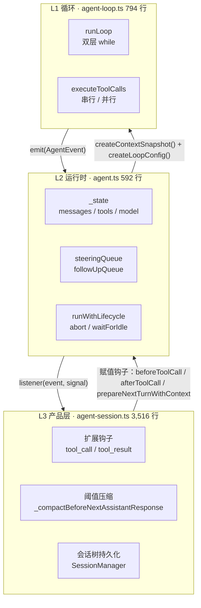
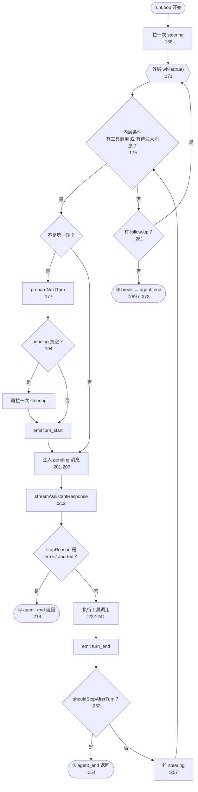
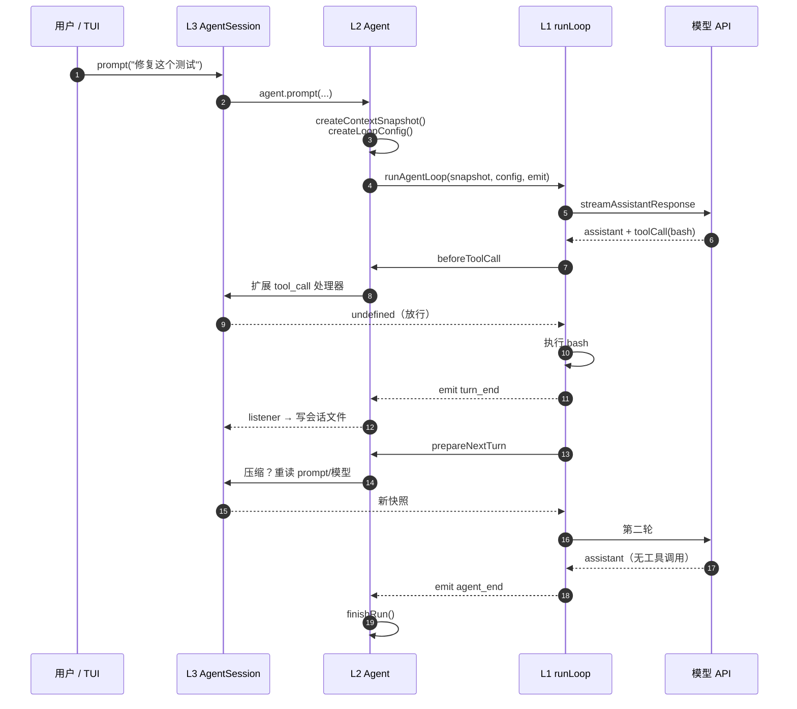

# 第 26 章 Agent Loop 三层切分

> 基准：pi `b79e4cc8` (v0.84.4)　·　[版本表](../../research/BASELINE.md)　·　[参与指南](../../CONTRIBUTING.md)

**状态**：✅ 已完成

## 本章回答

- 794 行纯函数里为什么没有一处产品逻辑
- L1 / L2 / L3 各自承担什么

## 素材来源

- `research/pi/03-agent-loop.md` §3.1–3.2

---

## 26.1 先看一个数字

pi 全仓 123,629 行源码里，真正决定「模型说一句、工具跑一轮、再让模型说一句」的那段循环，只有 `packages/agent/src/agent-loop.ts` 一个文件，**794 行，占 0.64%**。

这个比例本身就是一个设计声明：**循环是最不该长胖的部分**。它被所有入口共享——交互式 TUI、`-p` 打印模式、RPC、SDK 嵌入——任何一行产品逻辑写进这里，都会变成所有形态的负担。

pi 把一次 Agent 运行切成三层，每一层只做一件事：

| 层 | 文件 | 行数 | 职责 | 有没有状态 |
| --- | --- | ---: | --- | --- |
| **L1 循环** | `packages/agent/src/agent-loop.ts` | 794 | 调模型、跑工具、在固定检查点问「还有消息吗」 | 无。只持有本次运行的局部变量 |
| **L2 运行时** | `packages/agent/src/agent.ts` | 592 | 持有状态、两条消息队列、生命周期、事件归约 | 有：`_state`、队列、`activeRun` |
| **L3 产品** | `packages/coding-agent/src/core/agent-session.ts` | 3,516 | 扩展钩子、压缩、会话持久化、模型切换 | 有：会话树、设置、扩展 runner |

【代码事实】三个文件的行数在基准 commit 上分别为 794 / 592 / 3,516。



图 26-1 三层之间只有两种连接：**向下传配置与回调**，**向上发事件**。L1 从不调用 L2 或 L3 的任何方法。

---

## 26.2 L1：一个不知道自己在哪里运行的循环

### 依赖面

先看 `agent-loop.ts` 引入了什么。整个文件只有三条 import（`agent-loop.ts:6-24`）：

```ts
import {
	type AssistantMessage,
	type Context,
	EventStream,
	type ToolResultMessage,
	validateToolArguments,
} from "@earendil-works/pi-ai";
import { getDefaultStreamFn } from "./stream-fn.ts";
import type { AgentContext, AgentEvent, AgentLoopConfig, /* … */ } from "./types.ts";
```

没有 `node:fs`，没有 `process`，没有终端，没有会话文件。它不知道自己跑在 TUI 里还是 HTTP 服务里，也不知道「当前工作目录」是什么。【代码事实】

这就是「纯函数」在这里的准确含义：**无 I/O 依赖**。它并不是数学意义上的无副作用——下面会看到它会往传入的 `context.messages` 里 `push`。保护它不污染外部状态的，是 L2 传进来的快照（26.3 节）。

`stream-fn.ts` 只有 20 行，是一个可注入的默认流函数槽位（`stream-fn.ts:11-20`），注释写明目的：让宿主安装自己的模型运行时，「without making pi-agent-core depend on a provider catalog」。连「默认用哪个模型 API」这件事，L1 也不自己决定。

### 入口

L1 对外暴露四个函数，两两成对：

| 函数 | 位置 | 用途 |
| --- | --- | --- |
| `agentLoop` | `:32` | 新 prompt 开始，返回 `EventStream` |
| `agentLoopContinue` | `:65` | 从现有上下文继续（重试） |
| `runAgentLoop` | `:96` | 同上，但用回调 `emit` 而不是流 |
| `runAgentLoopContinue` | `:121` | 同上 |

四个最终都落到同一个私有函数 `runLoop`（`:156`）。`continue` 系列多一道前置校验：上下文最后一条不能是 assistant 消息（`:75-77`、`:130-132`）——否则模型 API 会拒绝请求，而 L1 只在每轮调用时才转换消息，没法提前检查（注释 `:61-63`）。

### runLoop 的双层循环

`runLoop`（`agent-loop.ts:156-273`）是全书最值得逐行读的 118 行。去掉细节后的骨架：

```ts
async function runLoop(initialContext, newMessages, initialConfig, signal, emit, streamFunction) {
	let currentContext = initialContext;
	let config = initialConfig;
	let lastCompletedTurn;
	let pendingMessages = (await config.getSteeringMessages?.()) || [];       // :168

	while (true) {                                                             // :171 外层：follow-up
		let hasMoreToolCalls = true;

		while (hasMoreToolCalls || pendingMessages.length > 0) {              // :175 内层：工具 + steering
			if (lastCompletedTurn) {
				const snap = await config.prepareNextTurn?.(lastCompletedTurn);  // :177 产品层换上下文/模型
				/* …合并 snap 到 currentContext 与 config… */
				if (pendingMessages.length === 0) {                              // :194
					pendingMessages = (await config.getSteeringMessages?.()) || [];
				}
				await emit({ type: "turn_start" });
			}

			/* 把 pendingMessages 注入上下文 */                                  // :201-209

			const message = await streamAssistantResponse(/* … */);            // :212 调模型
			if (message.stopReason === "error" || message.stopReason === "aborted") {
				/* turn_end + agent_end */ return;                                // :215-218 出口①
			}

			/* 执行工具，hasMoreToolCalls = !batch.terminate */                  // :222-241
			await emit({ type: "turn_end", message, toolResults });

			lastCompletedTurn = { message, toolResults, context: currentContext, newMessages };
			if (await config.shouldStopAfterTurn?.(lastCompletedTurn)) {
				/* agent_end */ return;                                           // :252-254 出口②
			}
			pendingMessages = (await config.getSteeringMessages?.()) || [];     // :257
		}

		const followUpMessages = (await config.getFollowUpMessages?.()) || [];  // :261
		if (followUpMessages.length > 0) { pendingMessages = followUpMessages; continue; }
		break;                                                                   // :269 出口③
	}
	await emit({ type: "agent_end", messages: newMessages });                  // :272
}
```

画成流程图：



图 26-2 `runLoop` 的控制流。三个出口，一个都不多。

几个值得停下来看的点：

**1. 外层与内层回答的是两个不同的问题。** 内层问「这一轮模型还要不要继续干活」——有工具调用就继续，有用户插话（steering）就继续。外层问「模型已经干完了，用户有没有排队等着的下一件事」（follow-up）。把两者分开，用户「打断」与「排队」两种意图就在循环结构上被区分了。第 27 章专门讲这两条队列。

**2. 第一轮不调 `prepareNextTurn`。** `lastCompletedTurn` 初值为 `undefined`（`:166`），只有完成过一轮才会进入 `:176` 的分支。第一轮的上下文由调用者在进入前准备好；`prepareNextTurn` 是给**轮与轮之间**换东西用的——压缩、换模型、换 system prompt。

**3. `:194` 那个「只在为空时再拉」的条件，是一个真实的 bug 修复。** 注释原文（`:191-193`）：

> Preparation can be long-running (for example, compaction). Pick up steering queued while it ran. Only poll again if the earlier poll returned nothing; otherwise one-at-a-time mode would deliver two messages in this turn.

压缩可能要跑几十秒，用户在这期间敲的话应该进入下一轮；但如果上一轮末尾（`:257`）已经拉到一条，再拉一次就会在 one-at-a-time 模式下一次塞进两条。一个 `if` 同时满足了两个约束。

**4. 错误不抛异常，而是变成一条消息。** `:215` 检查的是 `message.stopReason`，不是 `try/catch`。模型调用失败时 `streamAssistantResponse` 返回一条 `stopReason: "error"` 的 assistant 消息，它照常进入 `newMessages`（`:213`）。错误因此成为 transcript 的一部分，可以被持久化、被展示、被下一次 `continue` 看到。L2 用同样的方式兜住 L1 自己抛出的异常（26.3 节）。

### L1 里**没有**的东西

把 `runLoop` 的三个出口列出来，就能看到 pi 刻意不做什么：

| 出口 | 条件 | 由谁决定 |
| --- | --- | --- |
| ① `:218` | 模型返回 error / aborted | 模型 API 或用户的 abort |
| ② `:254` | `shouldStopAfterTurn` 返回 true | **调用者注入的回调** |
| ③ `:269` | 没有工具调用、没有任何排队消息 | 模型自己停下 |

**没有最大轮数，没有重复调用检测，没有 token 预算上限。**【代码事实】唯一一个「由外部策略叫停」的口子是 `shouldStopAfterTurn`——而它在 `packages/coding-agent/src` 下的调用点数为零（见 `research/pi/03-agent-loop.md` §3.8）。也就是说，pi 自己的产品层也没有用这个口子装防死循环。

【推断】这不是遗漏。循环只提供「在哪里可以停」的机制，至于「什么时候该停」——10 轮？100 轮？同一个命令重复三次？——是产品策略，不同场景答案不同。第 18 章会展示各家在这个口子上装了什么。

---

## 26.3 L2：给无状态的循环一个家

L1 每次运行都从零开始，L2 的 `Agent` 类负责让它看起来像一个「持续存在的 Agent」。

### 每次运行前：快照

```ts
// agent.ts:437-443
private createContextSnapshot(): AgentContext {
	return {
		systemPrompt: this._state.systemPrompt,
		messages: this._state.messages.slice(),
		tools: this._state.tools.slice(),
	};
}
```

`messages` 和 `tools` 都 `.slice()` 了一份。L1 在运行中对 `currentContext.messages` 的 `push`（`agent-loop.ts:205, 238`）落在这份拷贝上，**不会直接改到 `_state`**。`_state.messages` 的唯一写入口是事件归约（下文）。

这就是为什么 L1 可以放心地「有副作用」：它只能动自己手里那份快照。

### 每次运行前：把状态翻译成回调

`createLoopConfig`（`agent.ts:445-484`）把 `Agent` 的字段和两条队列装成一个 `AgentLoopConfig`。最值得看的是队列的接法：

```ts
// agent.ts:476-483
getSteeringMessages: async () => {
	if (skipInitialSteeringPoll) {
		skipInitialSteeringPoll = false;
		return [];
	}
	return this.steeringQueue.drain();
},
getFollowUpMessages: async () => this.followUpQueue.drain(),
```

L1 只知道「有个函数能问出还有没有消息」，队列的存在、出队模式（全部还是一次一条）、`skipInitialSteeringPoll` 这种只在 `continue()` 场景用的小开关，全部封在 L2 的闭包里。

### 运行中：事件归约

L1 每 `emit` 一个事件，L2 的 `processEvents`（`agent.ts:544-591`）做两件事：先更新自己的状态，再依次 `await` 每个监听者。

```ts
// agent.ts:555-558
case "message_end":
	this._state.streamingMessage = undefined;
	this._state.messages.push(event.message);
	break;
```

`_state.messages` 只在 `message_end` 时追加。流式过程中的半成品放在 `streamingMessage`，供 UI 渲染；落盘、进上下文的永远是完整消息。

`tool_execution_start/end` 对 `pendingToolCalls` 的处理是不可变写法——每次构造新 `Set` 再赋值（`agent.ts:559-571`），UI 订阅者拿到的旧引用不会在脚下被改。

### 运行的边界：生命周期

```ts
// agent.ts:486-509（节选）
private async runWithLifecycle(executor) {
	if (this.activeRun) {
		throw new Error("Agent is already processing.");
	}
	/* …建 AbortController、置 isStreaming… */
	try {
		await executor(abortController.signal);
	} catch (error) {
		await this.handleRunFailure(error, abortController.signal.aborted);
	} finally {
		this.finishRun();
	}
}
```

三件事：

- **同一时间只允许一次运行。** 第二次 `prompt()` 会直接抛错，不排队。想排队，用 `followUp()`。
- **L1 抛出的异常被翻译成消息。** `handleRunFailure`（`agent.ts:511-527`）构造一条 `stopReason` 为 `error` 或 `aborted` 的 assistant 消息，然后**补发** `message_start → message_end → turn_end → agent_end` 四个事件。监听者看到的事件序列与正常结束完全同构，不需要为异常单独写一条路径。
- **`agent_end` 不等于空闲。** `processEvents` 的注释（`agent.ts:537-543`）说得很直白：`agent_end` 只表示 L1 不会再发事件；真正空闲要等所有监听者处理完 `agent_end`、`finishRun()` 清掉运行态之后。需要「等它彻底停下」的代码应该用 `waitForIdle()`（`agent.ts:328`），而不是监听 `agent_end`。

---

## 26.4 L3：所有「产品」都在这里

`AgentSession` 构造时调用两个安装函数（`agent-session.ts:404-405`），把产品逻辑**以回调的形式**挂到 L2 上：

### 工具钩子：扩展系统的入口

```ts
// agent-session.ts:487-506（节选）
private _installAgentToolHooks(): void {
	this.agent.beforeToolCall = async ({ toolCall, args }) => {
		const runner = this._extensionRunner;
		if (!runner.hasHandlers("tool_call")) {
			return undefined;
		}
		return await runner.emitToolCall({ type: "tool_call", toolName: toolCall.name, /* … */ });
	};
	/* afterToolCall 同理，另外做图片尺寸归一化 */
}
```

注意 `const runner = this._extensionRunner` 是在**回调执行时**读取的。方法注释（`:479-486`）解释了原因：扩展热重载时只需要换掉 `_extensionRunner`，不必重装钩子。

还要注意：没有扩展注册 `tool_call` 处理器时，`beforeToolCall` 直接返回 `undefined`——**放行**。pi 的默认值是「所有工具调用都执行」，权限确认需要你自己写一个扩展。这是第 16 章的起点。

### 轮间刷新：压缩、换模型、换 prompt

```ts
// agent-session.ts:562-583（节选）
private _installAgentNextTurnRefresh(): void {
	const previous = this.agent.prepareNextTurnWithContext ?? /* 兼容旧回调 */;
	this.agent.prepareNextTurnWithContext = async (turn, signal) => {
		const context = await this._compactBeforeNextAssistantResponse(turn.context);
		const previousSnapshot = await previous?.({ ...turn, context }, signal);
		const nextContext = previousSnapshot?.context ?? context;
		return {
			...previousSnapshot,
			context: {
				...nextContext,
				systemPrompt: this._systemPromptOverride ?? this._baseSystemPrompt,
				tools: this.agent.state.tools.slice(),
			},
			model: this.agent.state.model,
			thinkingLevel: this.agent.state.thinkingLevel,
		};
	};
}
```

每一轮开始前（`agent-loop.ts:177`）这个回调会：

1. 检查是否超过压缩阈值，超过就先压缩（`:543-560`）；
2. 把调用链上已经存在的 `prepareNextTurn` 也跑一遍——**链式组合，不覆盖**；
3. **重新读取** system prompt、工具列表、模型、思考级别。

第 3 点意味着：用户在 Agent 跑工具的过程中切换了模型，切换会在**下一轮**生效，而不用等这次运行结束。L1 对此一无所知——它只是在 `:178-190` 把快照里给的东西合并进 `config`。



图 26-3 一次两轮运行里三层之间的调用时序。

---

## 26.5 为什么这样切：三条判断依据

**判断一：循环是唯一被所有形态共享的东西，所以它必须对形态一无所知。** pi 有四种运行形态（第 3 章）。如果权限确认写进 L1，RPC 模式就得伪造一个「用户点了同意」；如果会话持久化写进 L1，SDK 用户就没法只要内存里的 Agent。把这些都推到 L3，L1 的 794 行可以被四种形态原样复用。

**判断二：可替换的东西做成回调，而不是做成子类或配置项。** `AgentLoopConfig`（`types.ts:149-294`）里除了 `model`、`convertToLlm` 等少数必需字段，扩展点全是可选回调：`transformContext`、`getApiKey`、`shouldStopAfterTurn`、`prepareNextTurn`、`getSteeringMessages`、`getFollowUpMessages`、`beforeToolCall`、`afterToolCall`。回调比配置项更有表达力（可以读运行时状态），比子类更容易组合（L3 的 `prepareNextTurn` 可以链式包住已有的那个）。

**判断三：状态只有一个写入口。** `_state.messages` 只在 `processEvents` 的 `message_end` 分支里被追加。L1 改的是快照，L3 通过监听事件同步自己的会话树。出了问题，查一个 `switch` 就够了。

### 代价

这种切法不是没有成本：

- **L3 很胖。** `agent-session.ts` 3,516 行，是 L1 的 4.4 倍。产品逻辑没有消失，只是被集中到了一处。（这正是第 31–33 章里各家衍生方动刀最多的地方。）
- **扩展点只开在 pi 预留的位置。** 想在「工具执行完、但结果还没进上下文」之间做点事，有 `afterToolCall`；想在「模型流到一半」时插手，就没有对应的回调——只能监听 `message_update` 事件旁观，不能改。
- **没有内建的停止策略。** 26.2 节已经说过，这需要你自己补。

---

## 26.6 各家衍生方动了 L1 吗

用 `diff` 直接比对三家衍生仓库里的 `agent-loop.ts`，结论很清楚：

| 仓库 | L1 文件 | 与 pi 基准的差异 |
| --- | --- | --- |
| `step-harness` | `packages/agent/src/agent-loop.ts` | **逐字节相同**（794 行）【代码事实】 |
| `Step-Code` | `packages/agent-core/src/agent-loop.ts` | 833 行。除包名替换外，**只加了一处**：工具调用泄漏重采样 |
| `minimax-code` | `third_party/pi-mono/packages/agent/src/agent-loop.ts` | 877 行。vendor 的是更早的 **v0.79.1**（`MINIMAX_CHANGES.md:7-9`），尚无 `prepareNextTurn` |

Step-Code 加的那一处值得看，因为它展示了「在 L1 里加东西」的正确粒度：

```ts
// Step-Code packages/agent-core/src/agent-loop.ts:212-225
let message = await streamAssistantResponse(currentContext, config, signal, emit, streamFunction);

// Serving-side tool parsers can fail and leak the model's tool-call
// markup into plain text: the turn then carries no executable call
// and the loop would end even though the model meant to act.
// Resample the identical context a bounded number of times; the
// leaked attempt is dropped from the request context while its
// message events above remain for observability.
const leakRetryLimit = config.toolCallLeakRetries ?? DEFAULT_TOOL_CALL_LEAK_RETRIES;
for (let attempt = 0; attempt < leakRetryLimit && isToolCallMarkupLeak(message); attempt++) {
	if (currentContext.messages[currentContext.messages.length - 1] !== message) break;
	currentContext.messages.pop();
	message = await streamAssistantResponse(currentContext, config, signal, emit, streamFunction);
}
```

问题是真实的：自家推理服务端的工具解析器偶尔失败，把 `<tool_call>` 标记当成普通文本吐出来。此时消息里没有可执行的工具调用，按 pi 的逻辑会走到出口③——**模型想干活，循环却以为它说完了**。

【推断】它放在 L1 而不是 L3，是因为 L3 没有合适的钩子：`prepareNextTurn` 只在两轮之间触发，而这里需要在**同一轮内**丢弃一次回复并重采样。默认上限 2 次（`:293`），判定条件限定为「没有任何结构化工具调用、但文本里有标记」（`:302-317`）——既有界，又不误伤正常回复。

这是第六部分反复出现的一个模式：**各家对 L1 的修改极少，且每一处都对应一个 pi 的钩子覆盖不到的具体问题。**

---

## 26.7 你的最小实现

如果你要从零写一个 Agent 循环，本章能直接带走的是这份清单：

1. **循环只依赖「调模型」和「跑工具」两个抽象**，其他一切通过回调注入。
2. **用两层循环区分「这一轮还没干完」和「有新的一件事」。**
3. **错误是消息，不是异常。** 让 transcript 成为唯一事实来源。
4. **循环操作快照，状态只在事件归约处写入。**
5. **至少留一个「每轮结束后问一下要不要停」的口子**——哪怕你暂时不用。

[`examples/ch26-minimal-loop/`](../../examples/ch26-minimal-loop/) 下有一份按这五条写的 123 行 TypeScript 实现（零依赖，`npm start` 直接跑，`npm test` 跑 6 个用例），可以对照 `runLoop` 阅读。

---

## 本章小结

- L1 `agent-loop.ts` 794 行，无 I/O 依赖，只回答「调模型、跑工具、在哪里停」。
- L2 `agent.ts` 用快照隔离 L1 的副作用，用闭包封装队列，用 `handleRunFailure` 让异常与正常结束同构。
- L3 `agent-session.ts` 通过赋值钩子把扩展、压缩、模型刷新挂进来，`prepareNextTurn` 链式组合。
- `runLoop` 只有三个出口，没有任何内建停止策略——这是第 18 章的前提。
- 三家衍生方里，step-harness 原样保留 L1，Step-Code 只加了一处有界重采样，MiniMax 停在更早的版本上。
