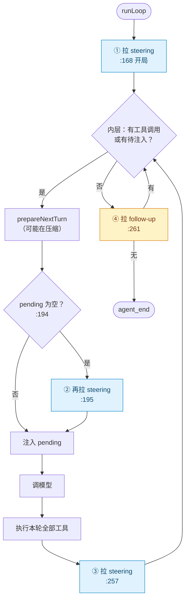
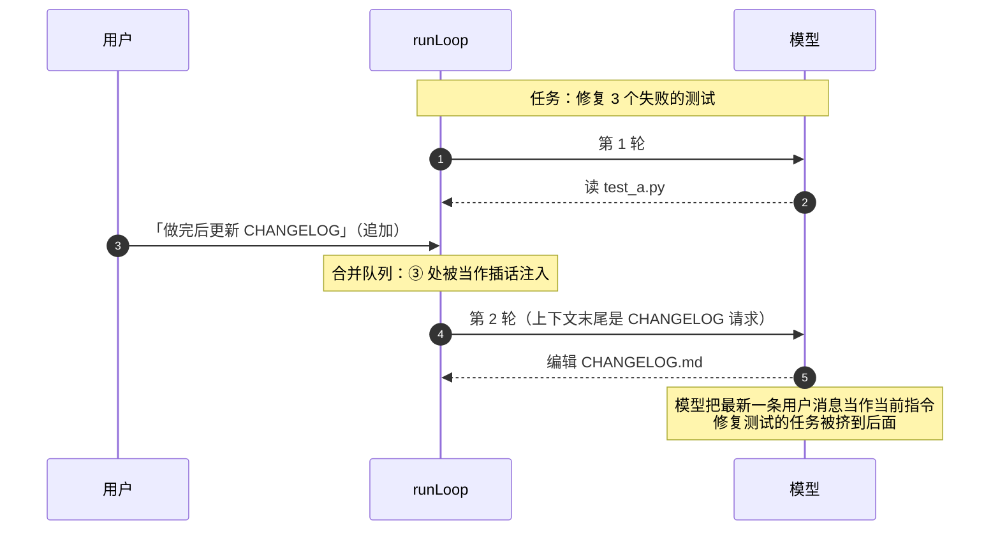
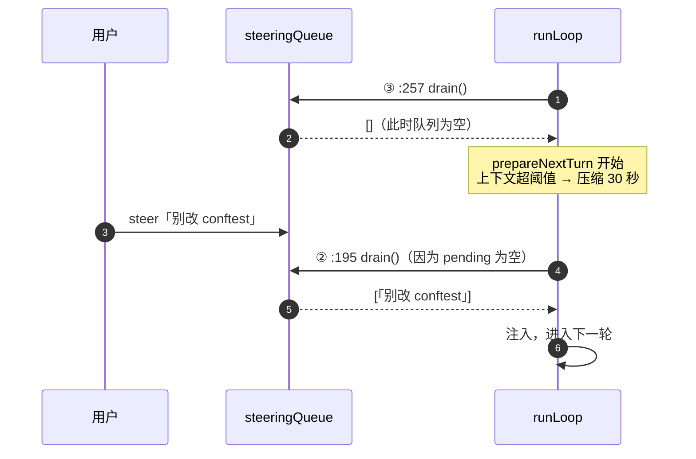
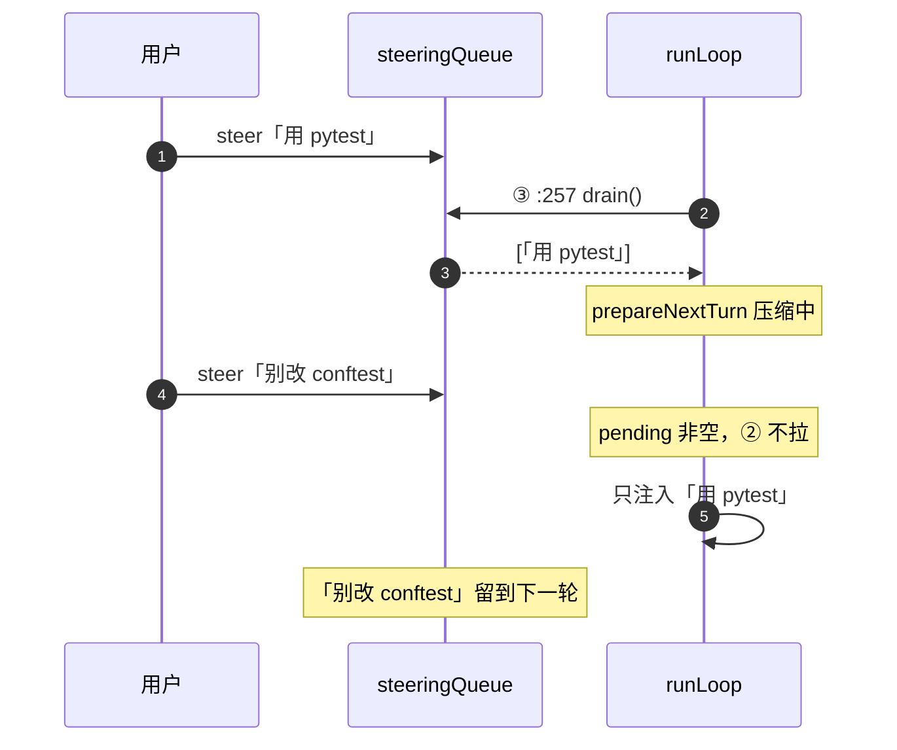

# 第 27 章 双队列：steering 与 follow-up

> 基准：pi `b79e4cc8` (v0.84.4)　·　[版本表](../../research/BASELINE.md)　·　[参与指南](../../CONTRIBUTING.md)

**状态**：✅ 已完成

## 本章回答

- 两个队列为什么不能合并
- 压缩之后重拉 steering 的那道条件在防什么

## 素材来源

- `research/pi/03-agent-loop.md` §3.3
- 对照：`deepseek-harness` `packages/core/agent-loop/src/inbox.ts`、`ZCode` `apps/zcode-cli/packages/bootstrap/src/app/types.ts`

---

## 27.1 一个交互问题

Agent 正在跑一个要 10 轮工具调用的任务。第 3 轮时，用户想插一句话。这句话可能有两种完全不同的意图：

- 「等等，测试目录是 `tests/` 不是 `test/`。」——**纠偏**。这句话应该尽快送进去，让模型在下一次决策前看到，否则后面 7 轮都在错的目录里打转。
- 「做完之后顺便更新一下 CHANGELOG。」——**追加**。这句话不该打断当前任务，应该等模型认为手头的事做完了再说。

如果只有一个队列，你只能二选一：要么所有插话都立刻注入（追加的请求会打断模型的思路，模型可能撇下修了一半的 bug 去改 CHANGELOG），要么所有插话都等到最后（纠偏来得太晚，白跑 7 轮）。

pi 的回答是：**两条队列，两个注入时机。**

| | steering | follow-up |
| --- | --- | --- |
| 语义 | 纠偏：「改一下你正在做的事」 | 追加：「做完之后再做这个」 |
| 注入时机 | 当前轮的工具全部执行完、下一次调用模型**之前** | 模型**本来要停下**的时候 |
| 在 `runLoop` 中的拉取点 | `agent-loop.ts:168`、`:195`、`:257` | `agent-loop.ts:261` |
| 所属循环 | 内层 `while` | 外层 `while(true)` |
| L2 入口 | `Agent.steer()` `agent.ts:283` | `Agent.followUp()` `agent.ts:288` |
| L3 入口 | `AgentSession.steer()` `agent-session.ts:1388` | `AgentSession.followUp()` `agent-session.ts:1408` |
| TUI 按键 | 运行中按 Enter | Alt+Enter（Windows 为 Ctrl+Q，`keybindings.ts:129-132`） |
| 默认出队模式 | `one-at-a-time`（`agent.ts:231`） | `one-at-a-time`（`agent.ts:232`） |

---

## 27.2 时机：两条队列分别在哪里被读

回到第 26 章的双层循环，把四个拉取点标出来：



图 27-1 蓝色是 steering 的三个拉取点，黄色是 follow-up 的唯一拉取点。

两个细节决定了用户的真实体验：

**steering 不会打断正在执行的工具。** 拉取点 ③ 在 `executeToolCalls` 全部返回之后。L3 的方法注释写得很明确（`agent-session.ts:1381-1383`）：

> Delivered after the current assistant turn finishes executing its tool calls, before the next LLM call.

如果模型一次发出 5 个工具调用，用户在第 1 个执行时敲了纠偏，这条消息要等 5 个都跑完才能被模型看到。【代码事实】`agent-loop.ts` 中 `getSteeringMessages` 只有 `:168`、`:195`、`:257` 三处调用，没有一处在工具执行路径内。想立刻停下，用的是另一条路——`abort()`（`agent.ts:319`），它会让本次运行以 `stopReason: "aborted"` 结束。

**follow-up 只在模型自己停下时才会被读。** 拉取点 ④ 在内层循环退出之后——也就是模型这一轮没有工具调用、并且 steering 队列也空了。只要还有 steering 在排队，follow-up 就一直等着。

---

## 27.3 为什么不能合并

现在可以正面回答本章第一个问题了。假设把两个队列合成一个，只在 ③ 处拉取：



图 27-2 合并成单队列后，「追加」被当成了「纠偏」。

对模型来说，上下文末尾的那条 user 消息就是它眼里的「当前指令」。在任务中途注入一条「之后再做」的请求，模型并不知道「之后」是什么意思——它只看到一条新指令。

反过来，如果只在 ④ 处拉取，纠偏就失去了意义。

【推断】所以两条队列真正区分的不是「消息的内容」，而是**「这条消息应该在模型的哪个决策点被看到」**。这是一个只有用户知道的信息，所以 pi 把选择权交给了按键：Enter 还是 Alt+Enter。

### 一个约束：运行中必须说清楚是哪一种

L3 的 `prompt()` 在 Agent 正在运行时，**拒绝**没有声明投递方式的输入：

```ts
// agent-session.ts:1211-1222
if (this.isStreaming) {
	if (!options?.streamingBehavior) {
		throw new Error(
			"Agent is already processing. Specify streamingBehavior ('steer' or 'followUp') to queue the message.",
		);
	}
	if (options.streamingBehavior === "followUp") {
		await this._queueFollowUp(expandedText, currentImages);
	} else {
		await this._queueSteer(expandedText, currentImages);
	}
	/* … */
}
```

没有默认值。SDK 调用者必须显式选择。这比「默认当作 steering」或「默认当作 follow-up」都更诚实——任何默认值都会在一半场景里出错。

---

## 27.4 出队模式：一次一条还是全部

两条队列都是 `PendingMessageQueue`（`agent.ts:125-159`），出队逻辑只有 14 行：

```ts
// agent.ts:141-154
drain(): AgentMessage[] {
	if (this.mode === "all") {
		const drained = this.messages.slice();
		this.messages = [];
		return drained;
	}

	const first = this.messages[0];
	if (!first) {
		return [];
	}
	this.messages = this.messages.slice(1);
	return [first];
}
```

两种模式的区别在用户连发多条时才显现：

| 用户在一轮内连发 | `one-at-a-time`（默认） | `all` |
| --- | --- | --- |
| 「用 pytest」「别改 conftest」「跑完告诉我覆盖率」 | 三条分三轮注入，每条都有一次模型响应 | 三条在同一轮一起注入，模型一次看到全部 |
| 优点 | 每条指令都会被单独「回应」，用户能看到模型对每一条的反应 | 少两次模型调用；指令之间有关联时模型能综合理解 |
| 代价 | 多两次模型调用；后面的指令要等前面的处理完 | 某一条可能被模型忽略，用户无从察觉 |

设置项是 `steeringMode` / `followUpMode`（`settings-manager.ts:101-102`），旧版本的 `queueMode` 会被自动迁移为 `steeringMode`（`:425-427`）。

---

## 27.5 那道「只在为空时再拉」的条件

本章第二个问题。回看第 26 章引过的 `:191-196`：

```ts
// agent-loop.ts:191-196
// Preparation can be long-running (for example, compaction). Pick up steering
// queued while it ran. Only poll again if the earlier poll returned nothing;
// otherwise one-at-a-time mode would deliver two messages in this turn.
if (pendingMessages.length === 0) {
	pendingMessages = (await config.getSteeringMessages?.()) || [];
}
```

把这段代码放进时间线里看：



图 27-3 情况 A：③ 拉到空，② 补拉。压缩期间的输入不会被耽误一整轮。



图 27-4 情况 B：③ 已经拉到一条，② 不再拉。one-at-a-time 的承诺得以保持。

如果没有 `if`，情况 B 下 ② 会再出队一条，同一轮注入两条——`one-at-a-time` 模式就被悄悄破坏了。如果干脆删掉 ②，情况 A 下用户在压缩期间敲的话就要多等一整轮。一个 `if` 同时守住了「及时」和「一次一条」两个承诺。

### 同一个问题的另一处：`continue()`

`Agent.continue()`（`agent.ts:361-388`）在最后一条消息是 assistant 时，会先把排队的 steering 拿出来**当作 prompt** 开一次新运行：

```ts
// agent.ts:371-376
if (lastMessage.role === "assistant") {
	const queuedSteering = this.steeringQueue.drain();
	if (queuedSteering.length > 0) {
		await this.runPromptMessages(queuedSteering, { skipInitialSteeringPoll: true });
		return;
	}
	/* … follow-up 同理 … */
}
```

这里已经出队了一条。新运行进入 `runLoop` 后，开局的拉取点 ①（`:168`）会**再**出队一条——又是同一轮两条。`skipInitialSteeringPoll` 就是为此存在的：`createLoopConfig` 里的闭包让第一次 `getSteeringMessages` 调用直接返回空数组（`agent.ts:475-481`），之后恢复正常。

【推断】两处修复针对的是同一类缺陷：**任何「出队」都是消费，两个相邻的出队点之间必须有互斥条件。** 如果你给 pi 加新的 steering 拉取点，这是第一件要检查的事。

---

## 27.6 L3 的影子队列

用户在 TUI 里能看到「还有几条排队消息」，按 Alt+↑ 能把它们取回编辑器（`app.message.dequeue`，`keybindings.ts:133-136`）。这些功能要求 L3 知道队列内容，但 L2 的 `PendingMessageQueue` 是私有类，没有读取接口。

L3 的解法是维护一份**字符串影子**：

```ts
// agent-session.ts:1424-1436（_queueSteer，节选）
this._steeringMessages.push(text);          // 影子：只存文本
this._emitQueueUpdate();
/* … */
this.agent.steer({ role: "user", content, timestamp: Date.now() });  // 真队列
```

消息被真正注入时，L1 发出 `message_start`，L3 的事件处理器**按文本匹配**把它从影子里删掉（`agent-session.ts:647-664`）：

```ts
const steeringIndex = this._steeringMessages.indexOf(messageText);
if (steeringIndex !== -1) {
	this._steeringMessages.splice(steeringIndex, 1);
	/* … */
} else {
	const followUpIndex = this._followUpMessages.indexOf(messageText);
	/* … */
}
```

这是一个务实的折中，代价也很明确：

- **两份状态靠文本对齐。** 【推断】如果用户在两条队列里各放了一条完全相同的文本，steering 一侧会先被匹配删除，即使真正注入的是 follow-up 那条。显示会短暂错位，但不影响实际投递——真队列在 L2，影子只用于展示。
- **只能整体取回，不能单条撤销。** `clearQueue()`（`agent-session.ts:1588-1596`）一次清空两条队列并返回全部文本。没有「撤回第 2 条」的接口。
- **一旦出队就收不回来。** 消息进入上下文后，它就是 transcript 的一部分。pi 没有「撤回已投递的 steering」的机制（`research/pi/03-agent-loop.md` §3.8）。

---

## 27.7 各家的选择

双队列是一个**衍生方原样继承、对照组独立得出相同结论**的设计。

| 仓库 | 是否区分两类插话 | 实现 | 与 pi 的差异 |
| --- | --- | --- | --- |
| `step-harness` | 是 | L2 `agent.ts` 与 pi 逐字节相同 | 无 |
| `Step-Code` | 是 | L2 `agent-core/src/agent.ts` 592 行，除包名外与 pi 相同 | 无 |
| `minimax-code` | 是 | 内嵌 pi v0.79.1：`third_party/pi-mono/packages/agent/src/agent.ts`（579 行），`steeringQueue` / `followUpQueue` 原样保留 | 无 |
| `kimi-code`（仅 TUI 衍生） | 是 | `editor-keyboard.ts:51` `steerMessage` | bash `!` 命令与技能激活不可 steer，留在队列里（`:327-334`） |
| `deepseek-harness`（对照） | **是** | `inbox.ts` 的 `next-step` / `next-turn` 两个列表 | 持久化、带 ID、可编辑、可提升 |
| `ZCode`（对照） | **是** | `delivery: "guide" \| "queue"`（`types.ts:227`） | 默认 `queue` |

两个对照组的做法值得细看。

**deepseek-harness：把队列做成持久化的事件投影。** 它的 `ReactLoopInbox` 有两个列表——`nextStep`「Input awaiting the next step boundary」（`inbox.ts:87`）对应 steering，`nextTurn`「Prompts awaiting individual turns」（`:82`）对应 follow-up。区别在于：

- 每次入队、出队都写成一条 `agent/inbox/spliced` 会话事件，队列状态由事件回放重建（`inbox.ts:27-32`）。进程崩溃后重启，排队的消息还在。
- 每条排队消息有 ID，客户端可以对**单条**做 `edit` / `remove` / `steer`（`packages/api/session-controller/src/types.ts:166-174`）。其中 `steer` 是把一条 follow-up **提升**为 steering——但只在 Agent 仍在运行时允许，否则报 `session/steer-unavailable`（`commands.ts:477-478`）。
- 出队时 `claim()` 一次取走**全部** next-step，外加**一条** next-turn（`inbox.ts:109-114`）。相当于 pi 的 steering 用 `all`、follow-up 用 `one-at-a-time`。

**ZCode：两个词，guide 与 queue。** 类型注释原文（`types.ts:226`）：

> 投递语义：queue=消费时切新轮；guide=内联当前轮。缺省 queue。

`guide` 就是 steering，`queue` 就是 follow-up。默认值选的是**不打断**的那一种——与 pi、deepseek-harness「必须显式声明」的做法不同。另一处注释（`types.ts:659-661`）还处理了 pi 没有区分的情况：Agent 忙于压缩或目标校验、但当前没有可以接受 guide 的轮次时，输入必须先落进延迟队列，「不能……从 composer 消失」。

### 判断依据

套用本书的对照规则：四家衍生方都保留了双队列，**两个对照组也独立得出了同样的二分**。因此双队列不是 pi 的路径依赖，而是这个交互问题的**标准解**。

各家分歧在**队列之上的能力**：

| 能力 | pi | deepseek-harness | ZCode |
| --- | :---: | :---: | :---: |
| 两类插话分开 | ✅ | ✅ | ✅ |
| 运行中未声明类型时 | 抛错 | 不可能：`mode: "queue" \| "steer"` 必填（`types.ts:337`） | 默认 `queue` |
| 崩溃后排队消息仍在 | ❌ | ✅ 事件持久化 | 未核实 |
| 单条编辑 / 删除 | ❌ 只能整体取回 | ✅ | ✅ 单条删除（`removeQueueItem`，`types.ts:666`） |
| follow-up 提升为 steering | ❌ | ✅ | 未核实 |

【推断】这三项「pi 没有的能力」都是 L3 / 产品层的事情——L1 的拉取点设计不需要改动就能支持它们，只是 pi 自己的产品层没有做。如果你的产品是长时间运行的远程 Agent（用户可能断线重连），持久化队列几乎是必需的；如果只是本地 TUI，pi 的内存队列已经足够。

---

## 27.8 你的最小实现

1. **两条队列，一个在内层循环每轮结束时读，一个在外层循环模型停下时读。**
2. **每个出队点都要和相邻的出队点互斥。** 检查清单：开局、轮间准备之后、轮末、`continue()` 入口。
3. **运行中收到输入，要么让调用者显式选择，要么选择「不打断」作为默认。** 不要默认打断。
4. **steering 不等于中止。** 需要立刻停下，提供单独的 abort。
5. 如果 Agent 会在远程长时间运行，**让队列可持久化、可单条操作**。

---

## 本章小结

- steering 在内层循环的三个点被读取（`:168` / `:195` / `:257`），全部在工具执行之外；follow-up 只在模型停下时被读取（`:261`）。
- 合并成一个队列，就必须在「纠偏太晚」和「追加打断」之间二选一。
- `:194` 的 `if` 与 `continue()` 的 `skipInitialSteeringPoll` 修复的是同一类缺陷：相邻出队点之间缺少互斥。
- L3 用一份按文本对齐的影子队列支持显示与取回，代价是只能整体取回、不能撤销已投递的消息。
- 两个对照组独立得出了同样的二分——这是标准解；分歧在持久化、单条编辑等队列之上的能力。
