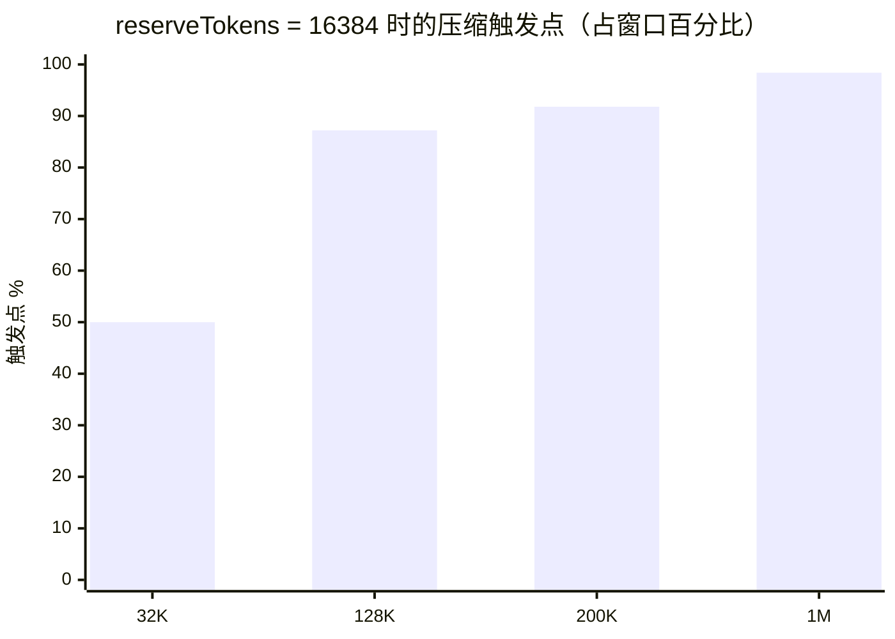
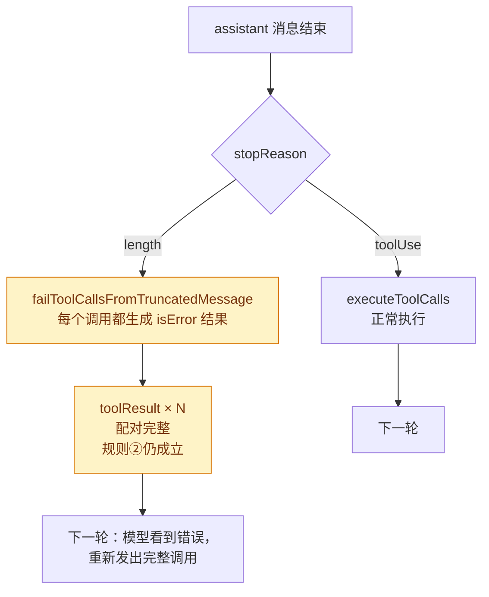
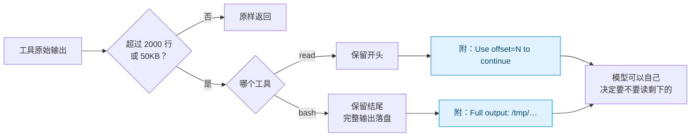

# 第 28 章 上下文工程四条硬规则

> 基准：pi `b79e4cc8` (v0.84.4)　·　[版本表](../../research/BASELINE.md)　·　[参与指南](../../CONTRIBUTING.md)

**状态**：✅ 已完成

## 本章回答

- 为什么是绝对预留 16K 而不是比例
- 为什么绝不在 toolResult 处切
- 为什么截断的消息必须整批失效
- 为什么截断要给续读路径

## 素材来源

- `research/pi/04-context-engineering.md` 全章
- `research/pi/03-agent-loop.md` §3.4

---

上下文工程常被讲成一门「写 prompt 的艺术」。本章不讲艺术，只讲 pi 代码里四条**一旦违反就会直接出错**的规则。它们的共同点是：每一条背后都有一个具体的失败——provider 拒绝请求、文件被静默写坏、模型拿不到剩下的内容。

| 规则 | 防的是什么 | pi 的位置 |
| --- | --- | --- |
| ① 压缩触发用绝对预留 | 摘要和下一轮输出没地方放 | `compaction.ts:235-237` |
| ② 绝不在 toolResult 处切 | 孤立的 tool result 被 provider 拒绝 | `compaction.ts:308-320`、`:345-364` |
| ③ 截断的消息整批失效 | 残缺参数通过校验后被执行 | `agent-loop.ts:227-233`、`compaction.ts:540-553` |
| ④ 截断时给续读路径 | 模型看不到剩下的内容，也不知道怎么拿 | `truncate.ts:1-13`、`read.ts:300-317`、`bash.ts:431-440` |

下文的 `compaction.ts` 均指 `packages/coding-agent/src/core/compaction/compaction.ts`——这是实际生效的 v1 版本（与 v2 副本的关系见 `research/pi/04-context-engineering.md` §4.3）。

---

## 28.1 规则①：绝对预留，不是比例

### pi 的基线

压缩是否触发，整个判断只有一行：

```ts
// compaction.ts:235-237
export function shouldCompact(contextTokens: number, contextWindow: number, settings: CompactionSettings): boolean {
	if (!settings.enabled) return false;
	return contextTokens > contextWindow - settings.reserveTokens;
}
```

默认值写在 `:132-136`：

```ts
export const DEFAULT_COMPACTION_SETTINGS: CompactionSettings = {
	enabled: true,
	reserveTokens: 16384,
	keepRecentTokens: 20000,
};
```

`reserveTokens` 是一个**绝对数**。把它换算成「用到百分之多少时触发」，结果随窗口大小剧烈变化：



图 28-1 同一个 16K 预留，在小窗口上是「一半就压」，在 1M 窗口上是「几乎用满才压」。

### 这 16K 是留给谁的

要理解为什么用绝对数，得先问：预留出来的空间是给谁用的？

答案在摘要请求的 `maxTokens` 里。历史摘要用 `Math.floor(0.8 * reserveTokens)`（`compaction.ts:673`），split-turn 的前缀摘要用 `Math.floor(0.5 * reserveTokens)`（`:984`）。也就是说，**预留区要装下的是模型的输出**——摘要的输出，以及压缩完成后下一轮的输出。

模型一次能输出多少 token，取决于模型的 `maxTokens`，与上下文窗口大不大无关。一个 32K 窗口的模型和一个 1M 窗口的模型，写一份摘要需要的输出空间是一样的。所以用来衡量预留的单位，应当是「一次输出有多大」，而不是「窗口的百分之几」。

如果改用比例，比如「用到 80% 就压」：

- 在 32K 窗口上，预留只剩 6.5K。摘要的 `maxTokens` 被压到 5.2K，内容稍多的会话就会撞上 `stopReason: "length"`——规则③会让这份摘要直接作废（见 28.3），压缩失败。
- 在 1M 窗口上，预留 200K。几十万 token 的上下文本可以继续用，却被提前压掉了。

### 一个真实的调参记录

`Step-Code` 和 `step-harness` 都把这个默认值改成了 24576，并留下了理由：

```ts
// Step-Code packages/coding-agent/src/core/compaction/compaction.ts:147-155
export const DEFAULT_COMPACTION_SETTINGS: CompactionSettings = {
	enabled: true,
	// Bumped from 16384: content-rich sessions were flirting with the
	// 0.8 * 16384 = 13107 maxTokens cap and getting rejected on length-stop.
	// 24576 gives ~19660-token headroom for the summary (or up to the ceiling
	// on models that expose a larger native output cap), while still leaving
	// ~keepRecentTokens for the retained tail.
	reserveTokens: 24576,
	keepRecentTokens: 20000,
};
```

【代码事实】这段注释同时印证了两件事：预留确实是按「摘要输出有多大」来定的；摘要撞上 `length` 也确实会被拒绝。Step-Code 改的是数值，没有改成比例。

### 各家的选择

| 仓库 | 触发公式 | 性质 | 位置 |
| --- | --- | --- | --- |
| pi | `window − 16384` | 绝对 | `compaction.ts:235-237` |
| Step-Code / step-harness | `window − 24576` | 绝对（调大） | `compaction.ts:154` / `:148` |
| minimax-code | `window − max(16384, 单轮输出上限 + 2048)`；MiniMax-M3 的 512K / 1M 模式改为 `window × 0.9` | 绝对为主，超大窗口用比例 | `context-manager/src/settings.ts:18-37` |
| deepseek-harness（对照） | `min(window × 0.8, window − 补全预留 − headroom)` | 比例，**但有绝对上限** | `compaction-basic/src/config.ts:20`、`:172`、`:191-194` |
| ZCode（对照） | `window − min(输出上限, 21000) − 13000` | 绝对 | `core/src/compact/policy.ts:67-88` |

### 判断依据

两个对照组的公式里都有「窗口减去输出预留」这一项：ZCode 只有这一项，deepseek-harness 把它作为比例阈值的上限。**「输出空间必须按绝对值预留」是各家共同的结论**，属于标准解。

分歧在超大窗口上。pi 的纯绝对公式在 1M 窗口上要到 98.4% 才触发，这意味着一次摘要请求要吃进近百万 token 的输入。MiniMax 对自家 M3 的大窗口模式改用 90%，deepseek-harness 默认就是 80%。【推断】这是用「提前压缩、多压几次」换「单次摘要的输入规模可控」。pi 选择不做这层区分，代价是在超大窗口上单次压缩又慢又贵。

---

## 28.2 规则②：绝不在 toolResult 处切

### 为什么会有「切点」

压缩不是把整段历史都总结掉，而是保留最近的一段原文（`keepRecentTokens: 20000`），只总结更早的部分。从哪条消息开始保留，就是**切点**。

`findCutPoint`（`compaction.ts:403`）从最新的消息往前累加 token 估算值，累计到 `keepRecentTokens` 时停下，然后在附近找一个**合法的**切点。哪些消息可以当切点，由 `isCutPointMessage` 决定：

```ts
// compaction.ts:308-320
function isCutPointMessage(message: AgentMessage): boolean {
	switch (message.role) {
		case "user":
		case "assistant":
		case "bashExecution":
		case "custom":
		case "branchSummary":
		case "compactionSummary":
			return true;
		case "toolResult":
			return false;
	}
	return false;
}
```

注释写在 `findValidCutPoints` 上方（`:345-350`）：

> Never cut at tool results (they must follow their tool call). When we cut at an assistant message with tool calls, its tool results follow it and will be kept.

### 切错会发生什么


图 28-2 绿色是合法切点，红色永远不能当切点。

假设切点落在 `toolResult #2`，保留下来的上下文就以一条 tool result 开头。它引用的 `toolCallId` 所在的 assistant 消息已经被压进摘要了。provider 收到一条「回答了一个不存在的问题」的 tool result，会直接拒绝整个请求。这不是降低质量，而是**这一轮发不出去**。

切在 `assistant` 上则是安全的：它的 tool result 全都在它后面，会被一起保留。

### 切在一轮中间怎么办

用户的一句话可能引出几十轮工具调用，keepRecentTokens 的边界经常落在某一轮的中间。这时 `findCutPoint` 会标记 `isSplitTurn`，并为这一轮的前半段**单独生成一份摘要**（`TURN_PREFIX_SUMMARIZATION_PROMPT`，maxTokens 为 `0.5 × reserveTokens`，`:984`），与历史摘要拼成一条。这样，模型既看得到这一轮最近的原文，也知道这一轮最初要做什么。

### 各家的选择

| 仓库 | 做法 | 位置 |
| --- | --- | --- |
| pi 及三家衍生 | 切点白名单，`toolResult` 不在其中 | `compaction.ts:308-320` |
| minimax-code | 另写了 `findAssistantForToolResult`：从 tool result 向前找它的 assistant，遇到 user / 摘要等硬边界停止 | `context-manager/src/manager.ts:470-482` |
| deepseek-harness（对照） | 选取压缩区间时「never splitting an assistant tool-call/result pair」 | `compaction-basic/src/region.ts:108-110` |
| ZCode（对照） | 按「assistant 开头的轮次」分组后再处理 | `core/src/compact/rounds.ts` `groupByAssistantStartedRounds` |

### 判断依据

所有仓库都把「tool call 与 tool result 不可拆」作为不变量，只是表达方式不同：pi 用切点白名单，deepseek-harness 用区间约束，ZCode 用轮次分组。【推断】这条规则的源头在 provider 的协议，而不在任何一家的设计偏好上，所以它是标准解里最没有讨论余地的一条。

---

## 28.3 规则③：截断的消息必须整批失效

### 问题出在流式解析

为了在模型还在输出时就把工具调用显示给用户，pi 用一个「尽力而为」的 JSON 解析器，逐块补全不完整的参数。副作用是：一条因为 `max_tokens` 被截断的消息，它的工具参数**可能解析成功，也通过了 schema 校验，但内容是残缺的**。

典型场景：模型调用 `write` 写一个 300 行的文件，写到第 180 行时撞上输出上限。抢救解析器补上缺失的引号和括号，得到一个合法的 `{ path, content }`，`content` 只有前 180 行。如果直接执行，用户的文件就被静默截断了。

### pi 的处理：一刀切

```ts
// agent-loop.ts:227-233
// A "length" stop means the output was cut off by the token limit, so
// every tool call in the message may carry truncated arguments. Fail
// them all instead of executing potentially borked calls.
const executedToolBatch =
	message.stopReason === "length"
		? await failToolCallsFromTruncatedMessage(toolCalls, emit)
		: await executeToolCalls(currentContext, message, config, signal, emit);
```

`failToolCallsFromTruncatedMessage`（`:379`）为每一个工具调用生成一条错误结果，错误文本告诉模型发生了什么、该怎么做：

> Tool call "…" was not executed: the response hit the output token limit, so its arguments may be truncated. Re-issue the tool call with complete arguments.



图 28-3 截断的消息不执行任何工具，但每个 tool call 仍然得到一条配对的结果。

两个细节：

- **整批，而不是逐个判断。** 截断只会伤到最后一个工具调用吗？不一定。并行调用的参数是交错流出的，pi 不去猜哪个完整、哪个残缺。注释 `:373-378` 的结论是「None of them are safe to execute」。
- **失败也要产出 tool result。** 如果直接跳过执行，assistant 消息里的 tool call 就没有对应的结果，下一次请求同样会被 provider 拒绝——这和规则②是同一个协议约束。CHANGELOG 记录的原始症状正是「等一个永远不会到的 tool result」（`packages/agent/CHANGELOG.md:136`，issue #6285）。

### 同一条规则在压缩里的另一处

摘要也是一次模型输出，也可能撞上 `length`：

```ts
// compaction.ts:540-553
/**
 * Returns an error message when a summarization response cannot safely be persisted.
 * A length stop contains partial text and must not become a session checkpoint.
 */
export function getSummarizationFailure(response: AssistantMessage, label: string): string | undefined {
	if (response.stopReason === "error") {
		return `${label} failed: ${response.errorMessage || "Unknown error"}`;
	}
	if (response.stopReason === "length") {
		return `${label} failed: generation hit the token cap and the summary is incomplete`;
	}
	return undefined;
}
```

一份写到一半的摘要如果被当作检查点存下来，之后所有轮次都建立在这份残缺的记忆上，而且再也没有机会回头修正。【推断】工具调用和摘要是同一类问题的两个实例：**模型输出被截断时，它产出的任何「要被执行或被持久化」的东西都不可信。**

### 各家的选择

| 仓库 | 截断消息中的工具调用 | 位置 |
| --- | --- | --- |
| pi / step-harness / Step-Code | 整批失败 | L1 与 pi 相同 |
| minimax-code | **没有这道保护** | 内嵌的 pi v0.79.1 `agent-loop.ts` 中 `failToolCallsFromTruncatedMessage` 出现 0 次 |
| ZCode（对照） | 对文本输出采取「续写」：保存部分结果、追加 Continue，最多 3 次 | `runtime/methods/turn-output-token-continuation.ts:40-57` |
| deepseek-harness（对照） | 未核实 | — |

### 判断依据

MiniMax 这一行不是一个「选择」：它内嵌的 pi 版本早于 issue #6285 的修复。【推断】这正是 `research/pi/03-agent-loop.md` §3.4 提到的探针——检查一个衍生仓库有没有这段代码，就能大致判断它的 pi 基线有多新。

ZCode 走的是另一条路：截断不当作失败，而是让模型接着写。这条路对长文本输出更友好，代价是续写的边界需要额外处理（它的注释用了十几行解释续写与压缩的交互）。截断消息里的工具调用在 ZCode 中如何处理，本书没有核实，不下结论。

---

## 28.4 规则④：截断时给续读路径

### 双限，先到者胜

工具输出进入上下文前，都要过一道截断。规则写在 `truncate.ts` 文件头：

```ts
// packages/coding-agent/src/core/tools/truncate.ts:1-13
/**
 * Truncation is based on two independent limits - whichever is hit first wins:
 * - Line limit (default: 2000 lines)
 * - Byte limit (default: 50KB)
 *
 * Never returns partial lines (except bash tail truncation edge case).
 */
export const DEFAULT_MAX_LINES = 2000;
export const DEFAULT_MAX_BYTES = 50 * 1024; // 50KB
export const GREP_MAX_LINE_LENGTH = 500; // Max chars per grep match line
```

截哪一头，取决于信息在哪里：

| 工具 | 截断函数 | 保留哪一部分 | 理由 |
| --- | --- | --- | --- |
| `read` | `truncateHead`（`truncate.ts:78`） | 开头 | 文件开头有 import、类型定义、文档 |
| `bash` | `truncateTail`（`truncate.ts:168`） | 结尾 | 报错、测试汇总、退出信息都在最后 |
| `grep` | 每行 500 字符上限 | 每条匹配的前部 | 防止一行压缩过的 JS 吃掉整个预算 |

### 截断之后，告诉模型怎么拿到剩下的

这一条是本章最值得直接照抄的。pi 不会把截断后的内容默默交给模型，而是在末尾附上一句**可以直接执行的续读指令**：

```ts
// read.ts:308（节选）
outputText += `\n\n[Showing lines ${startLineDisplay}-${endLineDisplay} of ${totalFileLines}. Use offset=${nextOffset} to continue.]`;

// read.ts:300：单行就超过 50KB 时，连 read 都没法分页，于是直接给出 shell 命令
outputText = `[Line ${startLineDisplay} is ${firstLineSize}, exceeds ${formatSize(DEFAULT_MAX_BYTES)} limit. Use bash: sed -n '${startLineDisplay}p' ${path} | head -c ${DEFAULT_MAX_BYTES}]`;
```

bash 的完整输出被写进临时文件，结果里附上路径（`bash.ts:436-440`）：

```ts
text += `\n\n[Showing lines ${startLine}-${endLine} of ${truncation.totalLines}. Full output: ${snapshot.fullOutputPath}]`;
```



图 28-4 截断把一个硬限制变成了一次分页：模型拿到第一页，同时拿到翻页的方法。

没有这句提示会怎样？模型看到的是一个「看起来完整」的文件，或一段「看起来完整」的日志。它不知道内容被截断了，可能基于残缺的信息做出错误判断；即使猜到了，也要自己试探用什么参数续读。一句话的提示，让「模型知道有更多内容」和「模型知道怎么拿」这两件事都有了着落。

### 一个细节：不要切出非法字符

bash 末行本身就超过 50KB 时，只能按字节从行尾回切。【代码事实】`coding-agent/src/core/tools/truncate.ts:247-262` 的 `truncateStringToBytesFromEnd` 先把字符串编码成 UTF-8 `Buffer`，再从切点向后跳过所有续字节（`(b & 0xc0) === 0x80`），保证切下来的第一个字节是一个字符的开头。按字节硬切一个汉字或 emoji 会产生非法序列，下游的 JSON 序列化或 provider 会报错——这又是一个「不处理就直接出错」的地方。落单的 UTF-16 代理项是同一问题的另一半，pi 在三个层次上各处理了一次，详见第 29 章 29.4 节。

### 各家的选择

衍生仓库的 `truncate.ts` 与 pi 基本一致（例如 Step-Code 的 `DEFAULT_MAX_BYTES` 同为 50KB，`truncate.ts:12`）。

ZCode 在另一个时间点上处理了同类问题：除了单次输出的截断，它还有一个 **microcompact**，把较早的工具结果整体替换成占位符 `[Old tool result content cleared]`，默认保留最近 5 个（`core/src/compact/microcompact.ts:12-14`）。【推断】占位符本身没有附带续读路径，但被清理的主要是 `Read`、`Grep`、`Bash` 这类可以重新执行的工具（`:19-29`），模型想要时可以再调一次。这是用「可重放」代替「可续读」。

---

## 28.5 你的最小实现

1. **压缩阈值 = 窗口 − 输出预留。** 预留按「摘要输出 + 下一轮输出」估算，不要用窗口百分比。窗口非常大时，可以再加一个比例上限。
2. **切点只能选在 user 或 assistant 上。** 写一个白名单函数，单元测试覆盖「切点不得是 tool result」。
3. **`stopReason === "length"` 时，不执行任何工具，也不持久化任何摘要。** 但每个 tool call 都要回填一条错误结果，保持配对完整。
4. **每一次截断都附一句续读指令。** 文件给 offset，命令给完整输出的路径。

---

## 本章小结

- 预留空间是给**输出**用的，输出大小与窗口无关，所以预留用绝对值。对照组都有「窗口减输出预留」这一项；分歧在超大窗口要不要再加比例。
- tool call 与 tool result 不可拆，这是 provider 协议决定的。所有仓库都守住了这条，只是写法不同。
- 被截断的输出里，要执行的工具调用和要持久化的摘要都不可信。pi 一律作废；MiniMax 的内嵌版本早于这次修复；ZCode 对文本选择续写。
- 截断时附上续读路径，模型才能自己「翻页」。这是四条规则里成本最低、收益最直接的一条。
