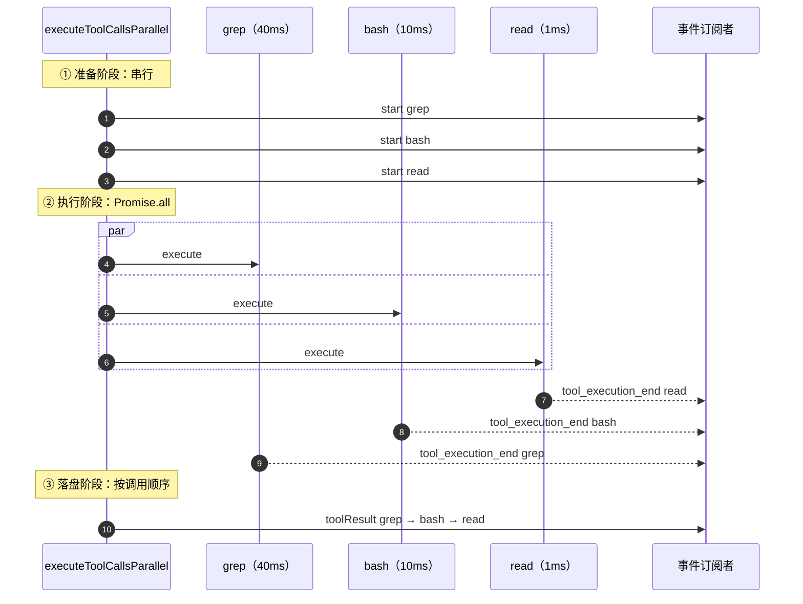
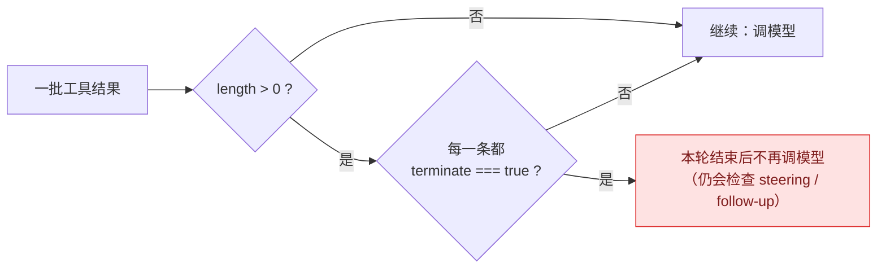
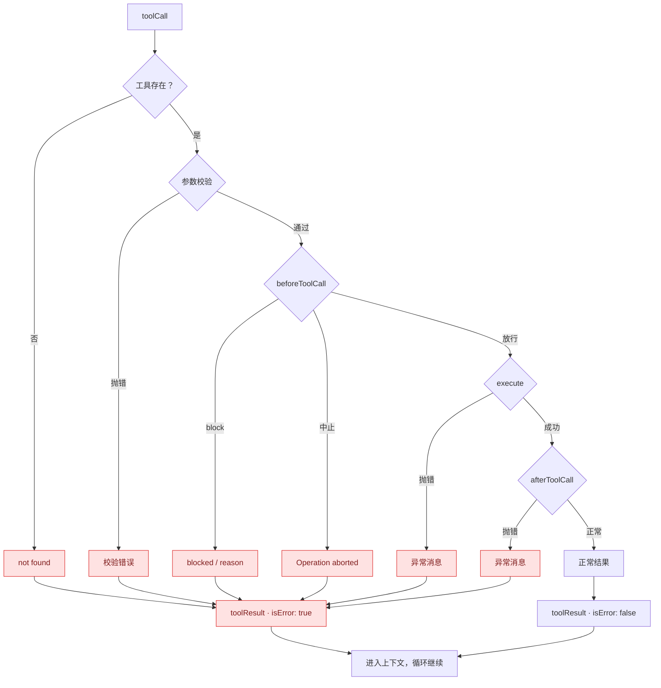
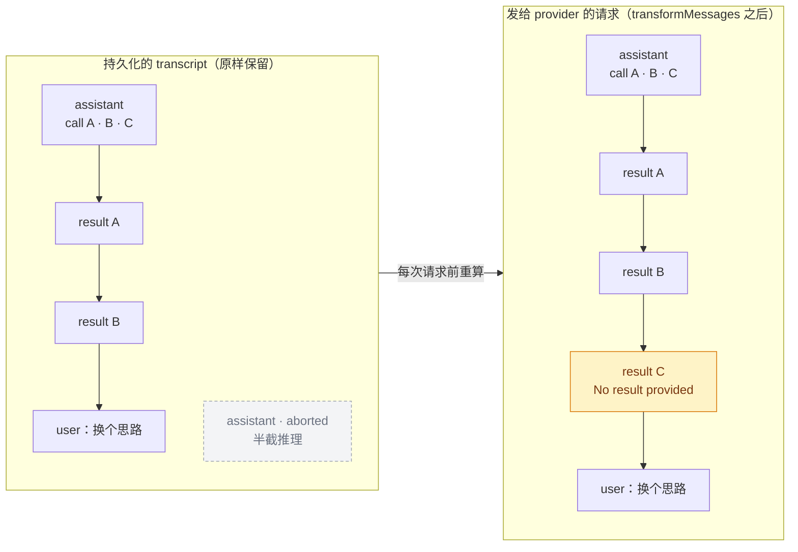
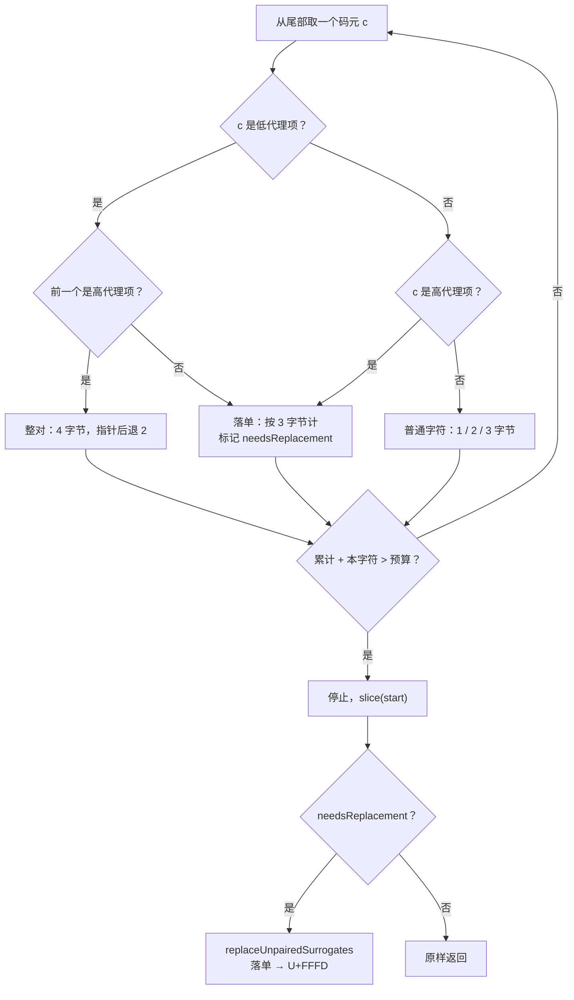
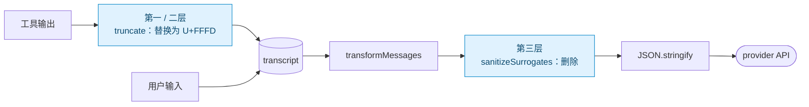

# 第 29 章 工具执行的四个坑

> 基准：pi `b79e4cc8` (v0.84.4)　·　[版本表](../../research/BASELINE.md)　·　[参与指南](../../CONTRIBUTING.md)

**状态**：✅ 已完成

## 本章回答

- 并行执行但按调用顺序 emit——为什么
- UTF-8 边界回切与落单代理对
- 错误即 transcript 条目

## 素材来源

- `research/pi/03-agent-loop.md` §3.4、§3.6
- `research/pi/09-assessment-risks-recommendations.md` §9.2
- 对照：`deepseek-harness` `packages/core/agent-loop/src/tool-calls.ts`、`ZCode` `apps/zcode-cli/packages/core/src/runtime/methods/streaming-tool-coordinator.ts`
- 配套代码：[`examples/ch29-tool-batch/`](../../examples/ch29-tool-batch/)

---

第 26 章把「跑工具」当成了一个黑盒：模型给出一组工具调用，循环拿回一组结果，继续下一轮。本章打开这个黑盒。黑盒里的代码不多——pi 的 `executeToolCalls` 及其辅助函数加起来不到 400 行（`agent-loop.ts:409-794`）——但它要同时满足四个互相牵扯的约束：

| 坑 | 不处理会怎样 | pi 的处理位置 |
| --- | --- | --- |
| 并行执行的结果顺序 | transcript 的内容取决于哪个工具先跑完，同样的输入产出不同的历史 | `agent-loop.ts:487-552` |
| 批次提前终止 | 一个工具说「停」，同批其他工具的结果模型永远看不到 | `agent-loop.ts:580-582` |
| 失败的表示 | 一个异常打断整个运行；或者某个调用没有结果，下一次请求被 provider 拒绝 | `agent-loop.ts:598-666`、`transform-messages.ts:158-222` |
| 按字节截断 | 切出半个字符，JSON 序列化或 provider 报错 | 三层：`truncate.ts`（v1/v2）、`sanitize-unicode.ts` |

---

## 29.1 坑一：并行执行，但结果按调用顺序落盘

### 分发：一个串行工具让整批串行

```ts
// agent-loop.ts:409-424
async function executeToolCalls(currentContext, assistantMessage, config, signal, emit) {
	const toolCalls = assistantMessage.content.filter((c) => c.type === "toolCall");
	const hasSequentialToolCall = toolCalls.some(
		(tc) => currentContext.tools?.find((t) => t.name === tc.name)?.executionMode === "sequential",
	);
	if (config.toolExecution === "sequential" || hasSequentialToolCall) {
		return executeToolCallsSequential(/* … */);
	}
	return executeToolCallsParallel(/* … */);
}
```

默认是并行（`agent.ts:237` `this.toolExecution = runtimeOptions.toolExecution ?? "parallel"`）。【代码事实】串行的粒度是**整批**：只要批里有一个工具声明了 `executionMode: "sequential"`（`types.ts:402-409`），这一批所有调用都退回串行，哪怕其余 4 个都是只读的 `read`。这是最简单的正确做法，代价是吞吐——本章 29.5 节会看到对照组把粒度做得更细。

### 并行路径的三个阶段

`executeToolCallsParallel`（`agent-loop.ts:487-552`）的结构可以拆成三段：

```ts
// agent-loop.ts:496-546（节选）
const finalizedCalls: FinalizedToolCallEntry[] = [];

for (const toolCall of toolCalls) {                       // ① 按调用顺序串行准备
	await emit({ type: "tool_execution_start", /* … */ });
	const preparation = await prepareToolCall(/* … */);    //    查找、校验、beforeToolCall
	if (preparation.kind === "immediate") {               //    准备阶段就有结论（报错/被拦截）
		await emitToolExecutionEnd(finalized, emit);
		finalizedCalls.push(finalized);
		/* … */
		continue;
	}
	finalizedCalls.push(async () => {                     //    只登记一个闭包，还不执行
		const executed = await executePreparedToolCall(preparation, signal, emit);
		const finalized = await finalizeExecutedToolCall(/* … afterToolCall … */);
		await emitToolExecutionEnd(finalized, emit);      // ② 完成一个发一个 end
		return finalized;
	});
	if (signal?.aborted) break;
}

const orderedFinalizedCalls = await Promise.all(          // ② 所有闭包同时开跑
	finalizedCalls.map((entry) => (typeof entry === "function" ? entry() : Promise.resolve(entry))),
);
for (const finalized of orderedFinalizedCalls) {          // ③ 按调用顺序发 toolResult 消息
	const toolResultMessage = createToolResultMessage(finalized);
	await emitToolResultMessage(toolResultMessage, emit);
	messages.push(toolResultMessage);
}
```

`types.ts:260-267` 的配置注释把这三段写成了一句话：

> "parallel": preflight tool calls sequentially, then execute allowed tools concurrently; emit `tool_execution_end` in tool completion order after each tool is finalized, then emit tool-result message artifacts later in assistant source order

用时间线看三个调用——`grep`（慢）、`bash`（中）、`read`（快）：



图 29-1 同一批调用发出两套顺序：`tool_execution_end` 按完成顺序（③ ② ①），`toolResult` 消息按调用顺序（① ② ③）。

### 为什么要两套顺序

**事件是给人看的，消息是给模型看的。**

- `tool_execution_end` 驱动 UI：TUI 上 `read` 的结果应该在它跑完的那一刻就显示出来，而不是等 40ms 的 `grep`。所以按完成顺序。
- `toolResult` 消息进入 `currentContext.messages`（`agent-loop.ts:237-240`），会被持久化、会被发给 provider、会在会话恢复时回放。它必须是**输入的函数**，而不是**时序的函数**。

【推断】如果 transcript 按完成顺序写，同一个会话在不同机器上、不同负载下会产出不同的消息序列：prompt cache 的前缀对不上，测试无法用固定期望断言，回放调试时看到的顺序和模型当时看到的顺序也不一定一致。按调用顺序落盘把这些不确定性全部关在了 UI 层。

`Promise.all` 是实现这一点的关键：它返回的数组按**输入下标**排列，与 promise 的完成先后无关。pi 没有为「排序」写任何代码——它只是选对了原语。

### 一个容易忽略的细节：执行在全部准备完之后才开始

【代码事实】阶段 ① 里 `finalizedCalls.push(async () => {…})` 只登记闭包，闭包在阶段 ② 的 `entry()` 处才被调用（`:538-540`）。也就是说，**第 1 个调用要等第 3 个调用的 `beforeToolCall` 返回后才开始执行**。

如果 `beforeToolCall` 是一个需要用户确认的权限弹窗，这意味着：用户逐个批准三个调用，三个都批准完，才一起开跑。【推断】这个选择让「批准」与「执行」在时间上完全分开：用户在逐个确认时，没有任何工具已经在跑。代价是第一个调用的延迟被拉长到「所有准备之和」。

但要注意中止的边界。【代码事实】用户在确认第 3 个时中止，`prepareToolCall` 返回 `Operation aborted`，循环在 `:516-518` 处 `break`；然而前两个已登记的闭包**仍会被** `Promise.all` 启动（`:538-540`），只是拿到的 `signal` 已经是中止状态。它们会不会产生副作用，取决于工具自己是否在开头检查 `signal`。29.5 节会看到 `minimax-code` 正是在这里改了 pi 的行为。

### 串行路径

`executeToolCallsSequential`（`agent-loop.ts:431-485`）简单得多：准备一个、执行一个、发 end、发 toolResult，再处理下一个。两套顺序在这里重合。

---

## 29.2 坑二：批次提前终止要全票

工具结果可以带一个 `terminate` 提示，告诉循环「这批跑完就停，不用再调模型了」。典型用途是一个 `finish` / `submit` 类工具：模型调用它表示任务完成。

规则只有一行：

```ts
// agent-loop.ts:580-582
function shouldTerminateToolBatch(finalizedCalls: FinalizedToolCallOutcome[]): boolean {
	return finalizedCalls.length > 0 && finalizedCalls.every((finalized) => finalized.result.terminate === true);
}
```

它在 `runLoop` 里变成 `hasMoreToolCalls = !executedToolBatch.terminate`（`agent-loop.ts:235`）。类型注释（`types.ts:371-375`）明说：

> Hint that the agent should stop after the current tool batch. Early termination only happens when every finalized tool result in the batch sets this to true.



图 29-2 全票规则。只要有一条结果没有投「停」，循环就把整批结果交还给模型。

**为什么不是「任一」？** 设想模型在同一批里发出 `run_tests` 和 `finish`。如果「任一 terminate 即停」，`run_tests` 的结果——也许是 3 个失败——就写进了 transcript，但模型再也没有机会看到它。【推断】全票规则保证了一条不变式：**只要有一条结果「需要模型回应」，模型就会被再调用一次。** 宁可多调一次模型，也不让一条结果悬空。

`terminate` 的来源有三处，都汇到同一个字段：

| 来源 | 位置 |
| --- | --- |
| 工具 `execute` 的返回值 | `AgentToolResult.terminate`，`types.ts:375` |
| `beforeToolCall` 拦截时附带 | `agent-loop.ts:635-638`（`block` + `terminate`） |
| `afterToolCall` 覆盖 | `agent-loop.ts:741` `terminate: afterResult.terminate ?? result.terminate` |

注意 `length > 0` 这个前提：空批次的 `every` 恒为 `true`，不加这个条件，一条没有工具调用的消息就会被判为「终止」。

---

## 29.3 坑三：错误即 transcript 条目

第 26 章的约定 3 是「错误是消息，不是异常」。在工具层，这条约定被贯彻到了每一个可能失败的点。

### 每一种失败都变成一条 `isError` 结果

| 失败点 | 结果文本 | 位置 |
| --- | --- | --- |
| 工具不存在 | `Tool ${name} not found` | `agent-loop.ts:606-612` |
| `prepareArguments` / 参数校验抛错 | 异常消息 | `:615-616`、`:659-665` |
| `beforeToolCall` 期间被中止 | `Operation aborted` | `:627-632` |
| `beforeToolCall` 拦截 | `reason` 或 `Tool execution was blocked` | `:634-643` |
| 准备完成后发现已中止 | `Operation aborted` | `:646-651` |
| 工具 `execute` 抛错 | 异常消息 | `agent-loop.ts:699-705` |
| `afterToolCall` 抛错 | 异常消息 | `:745-748` |
| 模型输出被 `length` 截断 | 整批失败（第 28 章 28.3 节） | `:379-404` |

它们都经过同一个 `createErrorToolResult`（`agent-loop.ts:758-763`），最终都是一条 `role: "toolResult"`、`isError: true` 的消息，和正常结果走完全相同的路径进入上下文。



图 29-3 工具层的每一个失败出口都汇入同一种消息。

这样做有两个直接收益：

1. **模型能自我纠正。** 「Tool `serach` not found」比任何重试逻辑都有效——模型下一轮通常就会改成 `search`。参数校验失败的消息里带着 schema 错误，模型据此修参数。
2. **一个工具的失败不影响同批其他工具。** 并行批次里第 2 个工具抛错，第 1、3 个的结果照常落盘。

### 运行级失败：合成一条 assistant 消息

工具之外的异常（比如 provider 适配器自身抛错）在 L2 被兜住。`Agent` 的 `runWithLifecycle`（`agent.ts:485`）用 `try/catch/finally` 包住整个运行（`agent.ts:502-508`），失败时：

```ts
// agent.ts:511-527（节选）
private async handleRunFailure(error: unknown, aborted: boolean): Promise<void> {
	const failureMessage = {
		role: "assistant",
		content: [{ type: "text", text: "" }],
		/* api / provider / model / usage … */
		stopReason: aborted ? "aborted" : "error",
		errorMessage: error instanceof Error ? error.message : String(error),
		timestamp: Date.now(),
	} satisfies AgentMessage;
	await this.processEvents({ type: "message_start", message: failureMessage });
	await this.processEvents({ type: "message_end", message: failureMessage });
	await this.processEvents({ type: "turn_end", message: failureMessage, toolResults: [] });
	await this.processEvents({ type: "agent_end", messages: [failureMessage] });
}
```

订阅者看到的事件序列与一次正常结束的运行**完全同构**：`message_start → message_end → turn_end → agent_end`。UI 不需要为「崩溃」写一套单独的渲染逻辑，失败就是一条 `stopReason: "error"` 的消息。

【代码事实】这里还有一个生命周期细节，`agent.ts:539-543` 的注释：

> `agent_end` only means no further loop events will be emitted. The run is considered idle later, after all awaited listeners for `agent_end` finish and `finishRun()` clears runtime-owned state.

收到 `agent_end` 不等于 Agent 空闲。如果在 `agent_end` 的监听器里立刻调用 `prompt()`，此时 `isStreaming` 仍为 `true`（`finishRun()` 在 `agent.ts:529-535`，位于 `finally` 中），会走到第 27 章讲过的「必须声明 `streamingBehavior`」那条分支。

### 中止留下的孤儿调用：在回放时补齐

还有一种情况不是「失败」而是「缺席」。回看 29.1 节的并行路径：用户在准备第 2 个调用时按下中止，循环在 `:516-518` 处 `break`——**第 3 个调用既没有 `tool_execution_start`，也没有 `toolResult`。** 此时 transcript 里留下了一条带 3 个 `toolCall` 的 assistant 消息，后面只跟着 2 条结果。

大多数 provider 要求每个工具调用都有对应的结果，否则下一次请求直接报 400。pi 没有在写入时补，而是在**每次把历史发给 provider 之前**补：

```ts
// packages/ai/src/api/transform-messages.ts:158-180（节选）
// Second pass: insert synthetic empty tool results for orphaned tool calls
// This preserves thinking signatures and satisfies API requirements
const insertSyntheticToolResults = () => {
	for (const tc of pendingToolCalls) {
		if (!existingToolResultIds.has(tc.id)) {
			result.push({
				role: "toolResult",
				toolCallId: tc.id,
				toolName: tc.name,
				content: [{ type: "text", text: "No result provided" }],
				isError: true,
				timestamp: Date.now(),
			} as ToolResultMessage);
		}
	}
	/* … */
};
```

`transformMessages`（`transform-messages.ts:64`）在三个时刻调用它：遇到下一条 assistant 消息时、遇到一条 user 消息时（`:210-213`，「User message interrupts tool flow」）、以及历史末尾（`:219-220`）。同一个函数还做了另一件事——**跳过所有 `stopReason` 为 `error` 或 `aborted` 的 assistant 消息**（`:189-197`）：

> These are incomplete turns that shouldn't be replayed: May have partial content (reasoning without message, incomplete tool calls) … The model should retry from the last valid state



图 29-4 transcript 记录真实发生的事；发送前的投影负责满足 provider 的协议要求。黄色是合成的结果，灰色虚线是被跳过的中止消息。

【推断】在回放时补，意味着 transcript 是「真实发生了什么」的忠实记录——第 3 个调用确实没有执行，所以它确实没有结果。代价是：每一个读 transcript 的消费者（导出工具、统计脚本、另一个 provider 适配器）都必须知道「可能存在孤儿调用」，否则会把不成对的历史当成损坏。29.5 节会看到，`minimax-code` 和 `deepseek-harness` 都选择了在写入时补齐。

---

## 29.4 坑四：按字节截断与落单代理项

第 28 章 28.4 节讲了截断要留续读路径。这里看截断本身的一个底层问题：**按字节预算切字符串，可能切出非法字符。**

JavaScript 字符串是 UTF-16 码元序列，而预算是 UTF-8 字节。两种编码在三个地方对不齐：

| 字符 | UTF-16 码元 | UTF-8 字节 | 能被切坏的方式 |
| --- | --- | --- | --- |
| `a` | `0061` | `61` | 不会 |
| `中` | `4E2D` | `E4 B8 AD` | 按字节切在 `B8` 前，得到半个字符 |
| `😀` | `D83D DE00`（代理对） | `F0 9F 98 80` | 按码元切在两个代理项之间，得到**落单代理项** |

落单代理项（lone surrogate）在 JavaScript 里是合法的字符串值，但它不是合法的 Unicode。`JSON.stringify` 会把它转义成 `\ud83d`，很多 provider 的服务端解析时会拒绝。

pi 在三个层次上各处理了一次。

### 第一层：v1 工具输出截断，按 UTF-8 字节边界回切

```ts
// packages/coding-agent/src/core/tools/truncate.ts:247-262
function truncateStringToBytesFromEnd(str: string, maxBytes: number): string {
	const buf = Buffer.from(str, "utf-8");
	if (buf.length <= maxBytes) {
		return str;
	}

	// Start from the end, skip maxBytes back
	let start = buf.length - maxBytes;

	// Find a valid UTF-8 boundary (start of a character)
	while (start < buf.length && (buf[start] & 0xc0) === 0x80) {
		start++;
	}

	return buf.slice(start).toString("utf-8");
}
```

UTF-8 的续字节都是 `10xxxxxx`，即 `(b & 0xc0) === 0x80`。从切点向后跳过所有续字节，落脚点一定是某个字符的首字节。这个函数只在 `truncateTail` 的一个边界情况下被调用：最后一行本身就超过了字节预算（`truncate.ts:203-212`），比如一条没有换行的超长 bash 输出。

落单代理项在这一层是被**隐式**处理的。【代码事实】Node 的 `Buffer.from(str, "utf-8")` 把落单代理项编码为 `EF BF BD`，也就是 U+FFFD：

```
> Buffer.from("a\ud83d", "utf-8")
<Buffer 61 ef bf bd>
```

所以这一层的输出总是合法的 Unicode，但这依赖于运行时有 `Buffer`。

### 第二层：v2 harness，不依赖 `Buffer`，显式替换

v2 的 `agent/src/harness/utils/truncate.ts` 要能在没有 `Buffer` 的运行时里工作（`:51` `const runtimeBuffer = (globalThis as { Buffer?: RuntimeBuffer }).Buffer`），所以字节计数和回切都自己写：

```ts
// packages/agent/src/harness/utils/truncate.ts:301-336（节选）
function truncateStringToBytesFromEnd(str: string, maxBytes: number): string {
	if (maxBytes <= 0) return "";
	let outputBytes = 0;
	let start = str.length;
	let needsReplacement = false;
	for (let i = str.length; i > 0; ) {
		let characterStart = i - 1;
		const code = str.charCodeAt(characterStart);
		let characterBytes: number;
		let unpairedSurrogate = false;
		if (code >= 0xdc00 && code <= 0xdfff && characterStart > 0) {
			const previous = str.charCodeAt(characterStart - 1);
			if (previous >= 0xd800 && previous <= 0xdbff) {
				characterStart--;          // 低代理项前面是高代理项：整对一起走
				characterBytes = 4;
			} else {
				characterBytes = 3;        // 落单：按 U+FFFD 的 3 字节计
				unpairedSurrogate = true;
			}
		} else if (code >= 0xd800 && code <= 0xdfff) {
			characterBytes = 3;
			unpairedSurrogate = true;
		} else {
			characterBytes = code <= 0x7f ? 1 : code <= 0x7ff ? 2 : 3;
		}
		if (outputBytes + characterBytes > maxBytes) break;
		/* … 累加，前移 … */
	}
	const output = str.slice(start);
	return needsReplacement ? replaceUnpairedSurrogates(output) : output;
}
```

三个设计点：

- **从尾部按「字符」而不是按码元往回走。** 一个代理对要么整体保留，要么整体丢弃，永远不会被拆开。
- **落单代理项按 3 字节计。** 因为它最终会被替换成 U+FFFD，而 U+FFFD 的 UTF-8 编码正好是 3 字节——预算在替换前后保持一致。
- **只有真的遇到落单代理项才做替换**（`needsReplacement`），常见路径上没有额外开销。替换函数 `replaceUnpairedSurrogates` 在 `:89-110`。



图 29-5 v2 的回切算法。预算不够容纳一个完整的代理对时，宁可整个丢掉。

用 `"a😀"`、预算 3 字节走一遍：尾部是 `DE00`，前一个是 `D83D`，整对 4 字节 > 3，立即停止，返回空串。v1 的结果也一样：`start = 5 - 3 = 2`，字节 `9F`、`98`、`80` 都是续字节，跳到末尾，返回空串。两种实现对同一输入给出相同答案——配套代码的测试里有这个用例（`examples/ch29-tool-batch/src/truncate.test.ts`）。

### 第三层：provider 边界，统一清除

前两层只管截断产生的问题。但落单代理项还有很多别的来源：用户粘贴的文本、读到的二进制文件片段、上游 provider 在流式输出中途断开时留下的半个 emoji。所以 pi 在出口处又设了一道：

```ts
// packages/ai/src/utils/sanitize-unicode.ts:21-25
export function sanitizeSurrogates(text: string): string {
	// Replace unpaired high surrogates (0xD800-0xDBFF not followed by low surrogate)
	// Replace unpaired low surrogates (0xDC00-0xDFFF not preceded by high surrogate)
	return text.replace(/[\uD800-\uDBFF](?![\uDC00-\uDFFF])|(?<![\uD800-\uDBFF])[\uDC00-\uDFFF]/g, "");
}
```

文件头注释（`:4-5`）给出了理由：「Unpaired surrogates … cause JSON serialization errors in many API providers.」【代码事实】`packages/ai/src/api/` 下有 9 个 provider 适配器文件引用了它，共 54 处（含 import），在构造请求体时对每一段文本调用。

注意第三层与前两层的区别：**它删除，而不是替换。**



图 29-6 三层防线的位置。前两层作用于写入 transcript 之前，第三层作用于离开进程之前。

【推断】替换与删除的分工有它的道理：截断层的输出会被用户在 TUI 里看到、会被持久化，U+FFFD「�」是一个可见的「这里有东西坏了」的标记；provider 层只关心请求能否被接受，且它处理的是已经持久化的历史的一份临时投影，删掉不影响 transcript 本身。

---

## 29.5 各家的选择

| 维度 | pi | `Step-Code` | `minimax-code` | `deepseek-harness`（对照） | `ZCode`（对照） |
| --- | --- | --- | --- | --- | --- |
| 结果落盘顺序 | 调用顺序（`Promise.all`，`agent-loop.ts:538-546`） | 同 pi | 同 pi | 调用顺序：`commitReady` 只沿连续的已完成槽位前进（`tool-calls.ts:146-161`） | 调用顺序：`drain` 按 `toolCalls` 顺序逐个 `await`（`streaming-tool-coordinator.ts:128-137`） |
| 并发上限 | 无（整批 `Promise.all`） | 同 pi | 同 pi | 默认 10（`constants.ts:6` `DEFAULT_MAX_PARALLEL_TOOL_CALLS`） | 未核实 |
| 串行粒度 | 整批 | 同 pi | 同 pi | 单个独占调用形成屏障，前后的并行调用仍成池（`tool-calls.ts:2-3`、`:199-203`） | 按工具元数据（`readOnly` / `concurrentSafe` / `destructive` / `sideEffectScope`）生成 `parallelGroups`（`runtime/methods/tools.ts:38-61`） |
| 执行开始时机 | 全部准备完之后 | 同 pi | 同 pi | 准备完一个就派发一个（`tool-calls.ts:216-217`「Ordered pre-execute may await; only dispatch/body overlaps」） | 只读且并发安全的工具在**模型流式输出期间**就开始执行（`streaming-tool-coordinator.ts:339-362`） |
| 批次提前终止 | 全票（`:580-582`） | 同 pi | 全票，**外加** hook 的 `terminateAgent` 一票否决（`third_party/pi-mono/packages/agent/src/agent-loop.ts:663-668`） | 任一结果带 `concludesTurn` 即结束本轮（`tool-calls.ts:158`），但不会截断已提交的下一步工作——同一步的 `additionalContexts` 或竞争中的 steering 仍会执行（`agent/src/runtime-types.ts:370-374`） | 未核实 |
| 中止后未执行的调用 | 不写；回放时补 `No result provided` | 同 pi | **写入时补**：`Tool execution skipped because the operation was aborted`（`agent-loop.ts:623-661`） | **写入时补**：`tool call aborted before dispatch`（`tool-calls.ts:249-261`） | 未核实 |

几处值得展开。

**`minimax-code` 的两处修改。** 它内嵌的是 pi v0.79.1，但 `skipPreparedParallelToolCalls`、`appendSkippedParallelToolCalls` 和 `terminateAgent` 在 pi 的 git 历史里都不存在（`git log -S` 无结果；pi `v0.79.1` 标签下的同一文件中出现 0 次），是 MiniMax 自己加的。【代码事实】

- 中止时，已准备但尚未执行的调用也不再执行，直接写一条 skipped 结果（`:623-638`）；之后的调用补发 `tool_execution_start` / `tool_execution_end` 并写 skipped 结果（`:640-661`）。pi 在这种情况下会让已准备的调用带着已中止的 `signal` 继续执行，由工具自己决定是否响应中止。
- `BeforeToolCallResult.terminateAgent`「Stops the whole agent run after publishing this blocked tool result」（`types.ts:56-59`）。【推断】全票规则对**工具**表达「我完成了」是合适的，但对**策略 hook** 表达「必须停下」不够——hook 拦下一个危险调用时，不应该因为同批还有别的调用而继续跑。MiniMax 在保留全票规则的同时，为 hook 开了一个一票否决的口子。

**`deepseek-harness` 的滚动池。** 文件头注释（`tool-calls.ts:1-11`）几乎是本章前三节的摘要：

> Exclusive calls form barriers; parallel calls use a bounded rolling pool and are reclassified before start. Dispatch may overlap, while policy, results, and result context remain model-ordered. … Abort records synthetic error results for skipped calls so replay stays valid.

它与 pi 的区别不在「是否按调用顺序落盘」，而在**落盘的节奏**：pi 等整批完成后一次性按序发出所有 `toolResult`；deepseek-harness 每当最前面的未提交槽位完成，就立刻提交它以及其后连续已完成的槽位（`:146-161`）。第 1 个调用完成时它的结果就已持久化，不必等第 5 个。

**`ZCode` 把执行提前到了流式输出期间。** `shouldExecuteToolDuringStream`（`:339-362`）的条件是一串「且」：非 provider 执行、模型流式开启、`readOnly`、`concurrentSafe`、非 `destructive`、不需要审批、不需要用户交互、`sideEffectScope === "none"`。满足条件的工具在模型还在输出后续内容时就开跑；默认模式是 `"readOnly"`（`:39`）。

### 判断依据

- **按调用顺序落盘：标准解。** 三个衍生方原样继承，两个对照组用完全不同的调度器（滚动池、流式预执行）独立得出了同样的落盘顺序。
- **串行粒度、执行时机、并发上限：分歧。** pi 选了最简单的「整批 + 无上限 + 全部准备完再执行」，代价是吞吐和首个结果的延迟；两个对照组都选了更细的调度，代价是调度器本身的复杂度（deepseek-harness 的 `tool-calls.ts` 有 290 行，pi 的并行路径约 65 行）。
- **提前终止：分歧。** pi 选「全票」，deepseek-harness 选「任一」，minimax-code 在全票之上加了 hook 否决。三者的共同点是：都保证同批已执行工具的结果会落盘。
- **孤儿调用：分歧。** pi 选在回放时补，其余两家选在写入时补。前者让 transcript 忠实于事实，后者让 transcript 自身就满足协议。

---

## 29.6 你的最小实现

[`examples/ch29-tool-batch/`](../../examples/ch29-tool-batch/) 是一份按下面五条写的实现（`batch.ts` 130 行、`truncate.ts` 51 行，零依赖，`npm test` 跑 10 个用例）：

1. **准备串行，执行并发，结果按调用顺序落盘。** 用 `Promise.all` 收集结果，不要用「谁先完成谁先 push」。
2. **进度事件和 transcript 分开。** 前者按完成顺序给 UI，后者按调用顺序给模型。
3. **每个调用恰好一条结果。** 不存在、校验失败、被拦截、抛错、被中止——全部变成 `isError: true` 的结果。中止后没执行的调用，要么写入时补，要么在发给 provider 前补，二选一，但必须选一个。
4. **提前终止要全票，空批次不算。** 如果有策略层需要强制停止，单独开一个字段，不要改全票规则。
5. **按字节截断时按字符走，不按码元也不按字节硬切。** 在发给 provider 之前，再统一清一次落单代理项。

运行 `npm start` 能看到图 29-1 描述的两套顺序：

```
事件（完成顺序）：
  事件 start t1
  事件 start t2
  事件 start t3
  事件 end   t3（错误）
  事件 end   t2
  事件 end   t1
落盘的结果（调用顺序）：
  t1 ✓ src/a.ts:12 TODO
  t2 ✓ [仅保留末尾 14 字节] 通过 ✅😀
  t3 ✗ 未知工具：lint
```

---

## 本章小结

- 并行路径分三段：串行准备、`Promise.all` 并发执行、按调用顺序发 `toolResult`。`tool_execution_end` 按完成顺序发给 UI，transcript 按调用顺序写给模型——前者追求及时，后者追求确定。
- 一个 `sequential` 工具让整批串行；执行要等全部准备（含权限确认）完成后才开始。
- 批次提前终止要全票：只要有一条结果需要模型回应，模型就会再被调用一次。
- 工具层的每一种失败都变成一条 `isError` 结果；运行级失败合成一条 `stopReason: "error"` 的 assistant 消息，事件序列与正常结束同构。
- 中止留下的孤儿调用，pi 在发给 provider 前补 `No result provided`，并跳过 `error` / `aborted` 的 assistant 消息；`minimax-code` 和 `deepseek-harness` 选择在写入时补。
- UTF-8 截断有三层：v1 按字节边界回切（落单代理项由 `Buffer` 隐式转成 U+FFFD），v2 按字符回切并显式替换，provider 边界统一删除。
