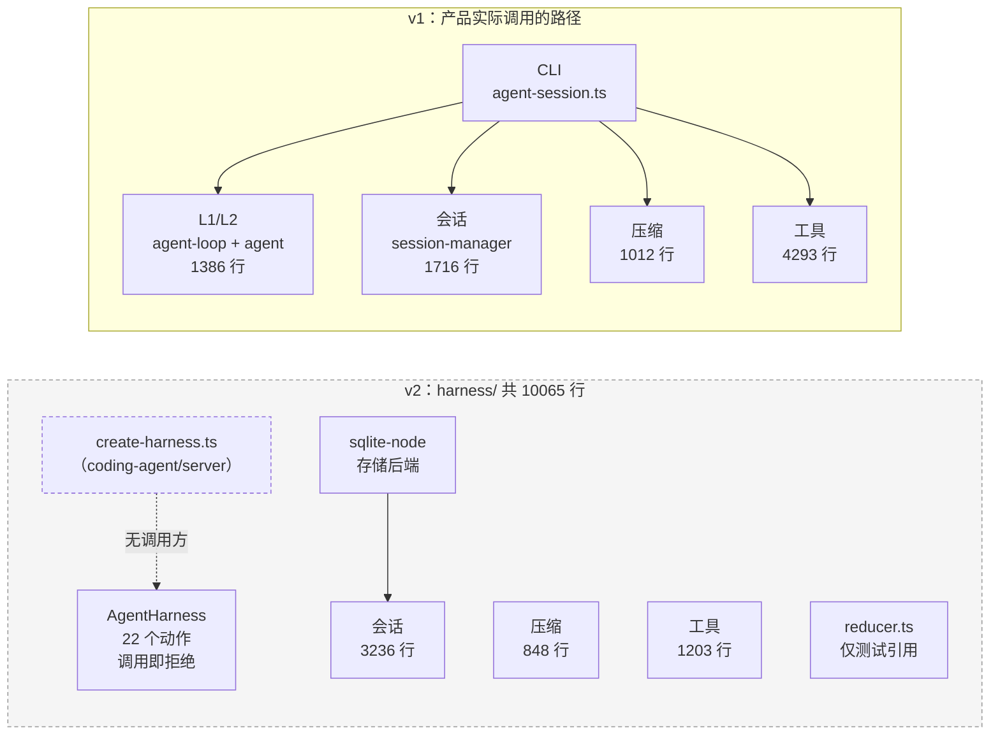
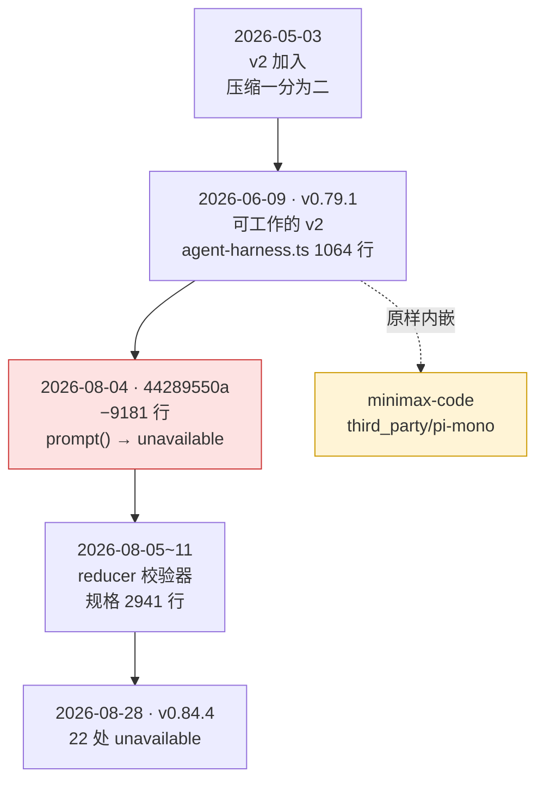
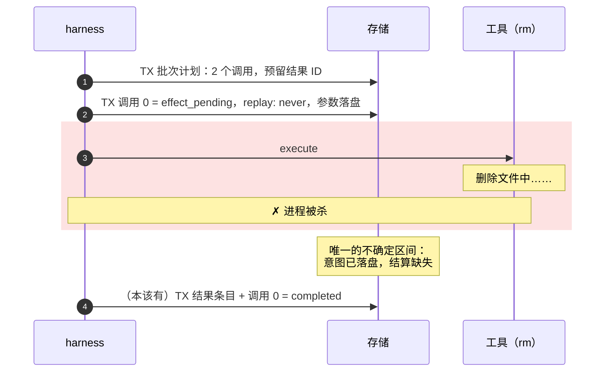
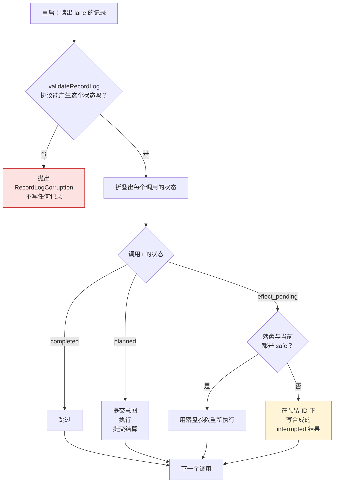
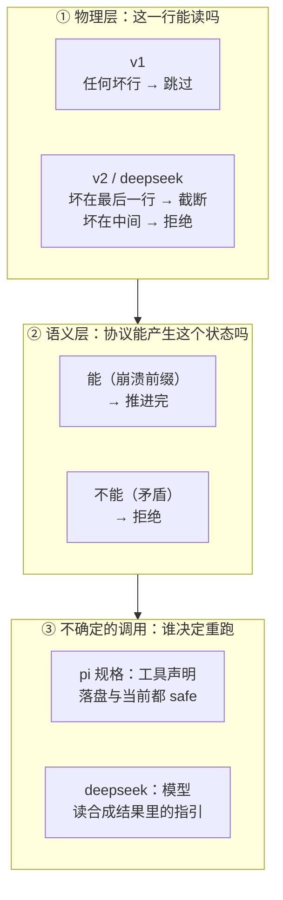

# 第 30 章 v1/v2：Pi 的第二代运行时

> 基准：pi `b79e4cc8` (v0.84.4)　·　[版本表](../../research/BASELINE.md)　·　[参与指南](../../CONTRIBUTING.md)

**状态**：✅ 已完成

## 本章回答

- 四处 v1/v2 并行实现说明了什么
- "恢复时遇到协议不可能产生的状态，拒绝，不修复" 这条原则推出了什么
- 对 fork 方意味着什么

## 素材来源

- `research/pi/03-agent-loop.md` §3.9
- `research/pi/09-assessment-risks-recommendations.md` §9.4
- pi `packages/agent/docs/harness.md`（v2 的实现规格，2941 行）、`packages/agent/src/harness/`
- 对照：`deepseek-harness` `packages/core/session/src/repair.ts`；衍生方：`Step-Code` `7dd66cb9`、`minimax-code` `third_party/pi-mono`
- 配套代码：[`examples/ch30-durable-tools/`](../../examples/ch30-durable-tools/)

---

前四章读的都是同一套运行时：`packages/agent` 里的 `agent-loop.ts` + `agent.ts`（第 26、27 章所说的 L1/L2，合计 1386 行），加上 `packages/coding-agent/src/core/` 里的会话、压缩和工具。这一套是 **v1**——pi 的 CLI 今天跑的就是它。

同一个仓库里还有第二套：`packages/agent/src/harness/`，10065 行，从 `index.ts:46` 作为包的默认导出对外公开。这是 **v2**。两套在四个地方各有一份自己的实现：

| 领域 | v1（服役中） | v2（`packages/agent/src/harness/`） | 行数 | 共享提交 |
| --- | --- | --- | --- | --- |
| 压缩 | `coding-agent/src/core/compaction/compaction.ts` | `harness/compaction/compaction.ts` | 1012 / 848 | 2026-05-03 以来 v1 28 次、v2 23 次，其中 9 次共享 |
| 截断 | `coding-agent/src/core/tools/truncate.ts` | `harness/utils/truncate.ts` | 276 / 350 | 各 4 次，0 次共享 |
| 工具 | `coding-agent/src/core/tools/` | `harness/tools/`（`AgentHarnessTool` + `ExecutionEnv`） | 4293 / 1203 | — |
| 会话 | `coding-agent/src/core/session-manager.ts`（JSONL 树，v3 格式） | `harness/session/` + `packages/session-backends/sqlite-node` | 1716 / 3236 | — |

本章分三步：先确认 v2 现在是什么状态（30.1–30.2），再看两份实现怎样各自演化（30.3），最后看 v2 规格里最值得带走的一条原则——恢复时拒绝，不修复——以及其他几家怎样选了别的路（30.4–30.6）。

> 本章引用的路径中，`packages/agent/src/` 下的文件省略包前缀（如 `harness/reducer.ts`）；其他包写全名。

---

## 30.1 v1 在服役，v2 是一副脚手架

### `AgentHarness` 的 22 个「未实现」

v2 的入口是 `AgentHarness` 类（`harness/agent-harness.ts:305` 起，全文件 508 行）。它的公共方法分成两类，界线很清楚：

```ts
// harness/agent-harness.ts:347-357（节选）
static async create(
	options: AgentHarnessOptions,
): Promise<{ harness: AgentHarness; suspended: SuspendedOperation[] }> {
	const [record] = await options.session.findRecords({ limit: 1 });
	if (record !== undefined) throw new HarnessNotImplemented("create.restore");
	return { harness: new AgentHarness(options), suspended: [] };
}

private unavailable<T>(operation: string): Promise<T> {
	return Promise.reject(this.closed ? new HarnessClosed() : new HarnessNotImplemented(operation));
}
```

```ts
// harness/agent-harness.ts:362-384（节选）
async prompt(_input: string | AgentMessage | AgentMessage[], _images?: ImageContent[]): Promise<RunResult> {
	return this.unavailable("prompt");
}
async compact(_options?: { customInstructions?: string }): Promise<CompactionResult> {
	return this.unavailable("compact");
}
async resume(): Promise<ResumeResult> {
	return this.unavailable("resume");
}
async abort(): Promise<AbortResult> {
	return this.unavailable("abort");
}
```

【代码事实】文件里共有 22 处 `unavailable(` 调用，覆盖了一个运行时**全部**的动作：`prompt`、`skill`、`promptFromTemplate`、`compact`、`navigateTree`、`resume`、`abort`、`steer`、`followUp`、`nextRun`、`cancelQueued`、`recordUsage`、`waitForIdle`、`runWhenIdle`、`peekAction`、`executeAction`、`runToCompletion`、`watch`、`lane`、`createLane`、`lanes`、`watchSession`。真正有实现的只有字段的读写：模型、思考级别、激活工具、资源、流选项、重试与压缩设置、队列模式和 `close()`。

`create()` 更直接：只要会话里已经有**任何一条记录**，就抛 `HarnessNotImplemented("create.restore")`（`:351`）。也就是说，v2 目前连「打开一个旧会话」都做不到。

`CHANGELOG.md` 在 0.84.0（2026-08-06）里写得很坦白：

> Added a compile-complete `AgentHarness` v2 scaffold; unfinished operation paths reject with `HarnessNotImplemented` while durable execution is implemented.（`packages/agent/CHANGELOG.md:49`）

同一个版本还把它「promoted … to the default package export」（`:41`），并移除了旧的 JSONL 和内存仓库（`:42`）。【代码事实】所以 0.84.x 的 `@…/pi-agent-core` 默认导出一个**编译完整、类型完整、调用即拒绝**的 harness。

### 谁在用 v2

v2 的会话层（`harness/session/`）和 JSONL/SQLite 存储是能用的，有独立的测试门禁：`vitest.harness.config.ts` 只收 `test/harness/**`，覆盖率统计 `src/harness/**` 加 `agent.ts`、`agent-loop.ts`，对应 `test:harness` 和 `coverage:harness` 两个脚本。

但产品代码没有用上它。`coding-agent` 里唯一引用 `AgentHarness` 的文件是 `packages/coding-agent/src/server/create-harness.ts`（161 行，提交 `6fb2d766a`「add configurable Harness factory (#7686)」）：它导出 `createCodingAgentHarness`，把 v2 的 read/bash/edit/write 工具包上提示词片段。【代码事实】除了它自己的测试 `test/server/create-harness.test.ts`，没有任何代码调用它。

> 这一点修正了研究笔记 §3.9「coding-agent 中零引用」的说法：引用存在，但只是一个未接线的工厂。



图 30-1 两套运行时。产品的调用路径全部落在 v1；v2（灰框）除了测试，只有一个放在 `coding-agent` 里、没有调用方的工厂指向它。

---

## 30.2 它不是「还没写完」，而是「写完后拆掉重来」

只看今天的代码，容易以为 v2 是一个尚未完成的新项目。git 历史说明的是另一回事：

| 时间 | 事件 | 证据 |
| --- | --- | --- |
| 2026-05-03 | v2 harness 首次加入；同日压缩拆成 v1/v2 两份 | `a5b27367d`、`83599e789` |
| 2026-06-09 | v0.79.1：`agent-harness.ts` 1064 行，`prompt()` 有完整的 phase/turn 实现 | 标签 `28df940f0` |
| 2026-08-04 | 「promote durable harness API」：59 个文件，+1333/−9181 | `44289550a` |
| 2026-08-05 | 恢复记录日志的校验器 | `a5953d2e1` |
| 2026-08-06 | 0.84.0 发布，脚手架成为默认导出 | `CHANGELOG.md:40-49` |
| 2026-08-11 | 规格合并为一份 `docs/harness.md` | `85a206081` |
| 2026-08-28 | v0.84.4（本书基准） | `b79e4cc8` |

`44289550a` 是转折点。【代码事实】这一次提交把 `agent-harness.ts` 从 1185 行、0 处 `unavailable` 改成 13 处 `unavailable`（之后又增至 22 处、508 行）；删掉了 1280 行的 `test/harness/agent-harness.test.ts`、2320 行的旧 `docs/harness.md`、`jsonl-repo.ts`、`memory-repo.ts` 和 `repo.test.ts`；换上一个 34 行的 `agent-harness-scaffold.test.ts`。



图 30-2 v2 的时间线。红色是拆除点；黄色是一个衍生方在拆除之前取走的版本。

为什么要拆一个能工作的实现？`44289550a` 之后合并的规格给出了目标：一个**可持久化执行**（durable execution）的运行时。规格自称「implementation specification」（`docs/harness.md:1`），核心要求是：进程可以在任何一次提交之间被杀掉，重启后从存储中恢复出确切的执行位置，并且不重复执行任何不该重复的副作用。

【推断】v0.79.1 的 `prompt()` 是一个在内存里推进的状态机，持久化只是「把结果写下来」。要支持「在任意两次提交之间崩溃都能续跑」，执行位置本身必须变成持久化状态——这不是在原实现上加功能能做到的，所以 pi 选择推倒，先把接口和存储定下来（编译完整的脚手架 + 能用的会话层），执行路径后补。代价是：在执行路径补上之前，`pi-agent-core` 的默认导出对使用者没有可运行的 harness。

---

## 30.3 并行两份，各自漂移

v2 冻结期间 v1 并没有停。以压缩为例：

【代码事实】2026-08-04（v2 压缩最后一次变更 `44289550a`）之后，v1 的 `compaction.ts` 又有 10 次提交（`6b36eb592`、`97fa14e39`、`ed867e909`、`8dab70281`（回退）、`4809c2abc`、`cff1cf52c`、`ef8dc7385`、`90305d90a`、`eb1f87fa9`、`58302d34e`），v2 是 0 次。

其中两次给 v1 加了护栏：

```ts
// coding-agent/src/core/compaction/compaction.ts:540-552（提交 97fa14e39，2026-08-24，#7048）
/**
 * Returns an error message when a summarization response cannot safely be persisted.
 * A length stop contains partial text and must not become a session checkpoint.
 */
export function getSummarizationFailure(response: AssistantMessage, label: string): string | undefined {
	if (response.stopReason === "error") {
		return `${label} failed: ${response.errorMessage || "Unknown error"}`;
	}
	if (response.stopReason === "length") {
		return `${label} failed: generation hit the token cap and the summary is incomplete`;
	}
	return undefined;
}
```

另一处（`:719-721`、`:1004-1006`，提交 `90305d90a`，2026-08-17）在摘要回复里出现工具调用时抛出 `Summarization attempted to call a tool`。v2 对摘要回复只检查 aborted/error（`harness/compaction/compaction.ts:578-588`）。

> 这修正了研究笔记 §9.4「v2 丢掉了 v1 的护栏」的说法：两处护栏都是在 v2 冻结**之后**才加到 v1 上的。v2 没有丢，是 v1 后来长出来的。区别在于方向——「丢了」意味着 v2 有缺陷，「没跟上」意味着同一修复需要做两次。

两份压缩的接口也已经分叉：

| | v1 | v2 |
| --- | --- | --- |
| 保留的尾部 | `firstKeptEntryId`（`:90`） | `retainedTail`（`:97`、`:602`） |
| 模型与凭据 | 直接传 `apiKey`（`:558`） | 通过 `Models` 注册表 |
| 失败 | 抛异常 | 返回 `Result<_, CompactionError>`（`generateSummary` `:501-512`、`compact` `:707-716`） |

截断的两份（第 29 章 29.4 节）各有 4 次提交、0 次共享，v2 比 v1 多 74 行；其中一处差别是 v2 显式替换落单代理项（第 29 章图 29-5）。

【推断】四处并行实现说明的不是「pi 在做迁移」——迁移的典型形态是新实现逐步接管调用方，而这里新实现没有调用方。它说明 pi 把 v2 当成一个**独立设计**来推进：接口按新的持久化模型重写（`Result` 代替异常、注册表代替 `apiKey`、`retainedTail` 代替条目 ID），而不是把 v1 搬过去。代价是双份维护：v1 上的每个修复，在 v2 接线之前都只修了一半。

---

## 30.4 恢复时拒绝，不修复

v2 的执行路径没写完，但它的**恢复语义**已经在规格和代码里定下来了。这是本章最值得带走的部分。

### 一个崩溃的场景

规格用一个例子开篇（`docs/harness.md:180-205`，§0.5）：用户让 agent「删掉过期的 migration，然后跑测试」。模型返回两个工具调用。harness 先提交批次计划，再提交「调用 0 即将以这些参数执行，它声明自己**不可安全重放**」。工具开始删文件。进程被杀。

重启后会发生什么？

> On restart the harness reads one register and finds `calls[0].status = "effect_pending", replay = "never"`. It does not re-run the deletion. It appends a synthetic error result under the result id that was reserved before the effect started, marks the call complete, and continues to call 1. … The conversation stays coherent — every tool call has a result — and nothing ran twice.

这个结论建立在一个写入顺序上，规格称之为「effect sandwich」：先提交意图，再执行副作用，最后提交结算。



图 30-3 意图—结算的三明治。红框是副作用执行期间；崩溃只可能让存储停在某两次提交之间。

规格把这个区间单独点出来：

> **The one uncertain interval in the entire system is: intent durable, settlement absent.**（`docs/harness.md:1910`）

对工具调用，它的处理规则是：

> re-execute the persisted `op.tool_args` arguments only if the stored declaration **and** the current tool declaration both say `safe`. Otherwise append a synthetic `interrupted` error under the reserved result id.（`docs/harness.md:1915`，§4.5）

代码一侧对应的声明是 `HarnessTool = AgentTool & { replay?: "never" | "safe" }`（`harness/agent-harness.ts:237`），省略即 `"never"`（规格 §5.7，`:2611`）。持久化的 `ToolStartedRecord`（`harness/session/types.ts:150-161`）记下了 `toolIndex`、`toolCallId`、`toolName`、`effectiveArgs`、预留的 `resultEntryId` 和 `replay`。

「**两边**都要 safe」这一点容易被忽略：工具在崩溃时声明 safe，升级后改成 never，也按 never 处理。【推断】落盘的声明代表「执行时承诺过什么」，当前的声明代表「现在的实现允许什么」，只有两者都同意才重放——这样一次工具升级不会让旧会话里的不确定调用被错误地重跑。

### 合法前缀 vs. 不可能的状态

崩溃会留下「意图在、结算缺」的日志。这是**合法前缀**：单写者协议在任意一次提交之后停下，就会产生这种形状。恢复的工作就是把它推进完。

另一种日志协议本身产生不出来：同一个调用被启动两次、结果指向一个不存在的 assistant 条目、调用序号和 assistant 消息里的工具调用对不上。这是**损坏**。v2 对损坏只有一个回应：

```ts
// harness/reducer.ts:16-33（节选）
/**
 * Machine-readable category for a contradiction in a lane's durable recovery
 * slice. These indicate states the single-writer record protocol cannot
 * produce, not ordinary operation failures or incomplete-but-recoverable
 * intent/result prefixes. Restore must reject such states rather than repair or
 * continue it; the accompanying error message supplies human-readable detail.
 */
export type RecordLogCorruptionReason =
	| "multiple_open_operations"
	| "unknown_operation"
	| "record_after_finish"
	| "non_consecutive_attempt"
	| "invalid_compaction_reason"
	| "queue_after_abort"
	| "invalid_queue_cancellation"
	| "inconsistent_step"
	| "tool_call_mismatch"
	| "duplicate_tool_invocation"
	| "provisioned_entry_mismatch"
	| "invalid_deferred_handle";
```

注释把三种东西分开了：**普通的操作失败**（工具报错、模型报错——它们是正常的 transcript 内容，第 29 章）、**不完整但可恢复的前缀**（崩溃）、**协议不可能产生的矛盾**（损坏）。只有第三种被拒绝。

工具启动的校验是一个具体例子：

```ts
// harness/reducer.ts:236-269（节选）
function validateToolStart(
	record: Extract<LaneRecord, { type: "tool_started" }>,
	entriesById: ReadonlyMap<string, Entry>,
	invocations: Set<string>,
): void {
	const invocation = `${record.assistantEntryId}\u0000${record.toolIndex}`;
	if (invocations.has(invocation)) {
		corrupt(
			"duplicate_tool_invocation",
			`Tool invocation ${record.assistantEntryId}:${record.toolIndex} is duplicated`,
		);
	}
	invocations.add(invocation);

	const assistantEntry = entriesById.get(record.assistantEntryId);
	if (!assistantEntry || assistantEntry.type !== "message" || assistantEntry.message.role !== "assistant") {
		corrupt("tool_call_mismatch", `Tool start ${record.id} does not reference an assistant entry`);
	}
	const toolCalls = assistantEntry.message.content.filter((content) => content.type === "toolCall");
	const toolCall = toolCalls[record.toolIndex];
	if (!toolCall || toolCall.id !== record.toolCallId || toolCall.name !== record.toolName) {
		corrupt("tool_call_mismatch", `Tool start ${record.id} does not match its assistant tool-call ordinal`);
	}
	…
}
```

调用的身份是「哪条 assistant 消息的第几个调用」（`assistantEntryId` + `toolIndex`），不是 `toolCallId`——后者由 provider 生成，不保证唯一。【代码事实】`corrupt()`（`:131-133`）直接抛 `RecordLogCorruption`；`reduceLaneState`（`:506`）在折叠之前先调 `validateRecordLog`（`:312-390`），校验不过就不折叠。



图 30-4 恢复的判定。红色出口只给损坏；崩溃留下的不确定调用走黄色出口，会话继续。

### 为什么拒绝，而不是修好再走

「修复」听上去更友好：重复的启动记录删掉一条，对不上的调用补一个结果，然后继续跑。规格的立场是不：

> **No repair-by-rewrite.** Recovery appends entries and overwrites only the registers it owns, with the same transitions normal execution would commit; interrupt it and rerun it and you get the same result.（`docs/harness.md:613`，§1.8）

从这条原则可以推出几件事：

1. **恢复和正常执行是同一套转移。** 恢复不会写出正常执行写不出来的东西，所以恢复本身被打断再重跑，结果也相同（幂等）。配套代码的 `recover.test.ts` 有一个用例专门验证这一点。
2. **损坏是 bug 的信号，不是需要掩盖的噪声。** 单写者协议产生不出重复启动；出现了，说明有第二个写者、存储层出错或者代码有 bug。修复会把证据抹掉，让后续的状态建立在一个猜测上。【推断】对一个会执行 `rm` 的 agent，「在猜测上继续执行」比「停下来让人看」危险得多。
3. **损坏类别必须可枚举。** 拒绝要给出机器可读的 `reason`，才能让上层（CLI、服务端）决定怎么呈现、是否提供人工修复工具。规格把这类修复留给显式的管理操作（`:790`「only an explicit repair operation rebuilds the cache」）。
4. **不追求恰好一次。** 规格 §0.6 把「exactly-once external effects」和「multiple writers」都列为非目标（`:209`、`:211`）。`replay: "never"` 的工具在崩溃后可能已经执行了一半；harness 能保证的只是**不执行第二次**，并如实告诉模型「结果未知」。

### 规格与代码在这里不一致

【代码事实】规格的恢复模型是**寄存器**：每个操作有一个持久化的程序计数器 `op.state/{operationId}`，恢复就是几次点查——

> Recovery is point lookups against registers. No history, no folding, no journal replay, no tree walk.（`docs/harness.md:1807`）
>
> No reducer exists to have a bug.（`:610`）

而代码里实际存在的是一个**记录日志 + reducer 折叠**：`reducer.ts` 667 行，按记录顺序校验并折叠出状态（`deriveToolBatch` `:445-503` 从 `tool_started` 记录和结果条目推出每个调用是否已结算）。这个 reducer 目前只被 `test/harness/reducer.test.ts` 引用。

两者的不变量是一致的——都区分合法前缀和损坏，都按 replay 声明处理不确定区间——但数据模型不同。【推断】规格描述的是目标，`reducer.ts` 是目标落地之前、先在现有记录格式上把恢复语义验证出来的那一版。读 v2 的人需要知道：规格和代码哪一边会先变，目前没有定论。

---

## 30.5 各家的选择：修复、跳过、截断、拒绝

「恢复时遇到坏数据怎么办」不只 v2 在回答。把视野放大，至少有四种立场，pi 自己就占了三种：

| 立场 | 谁 | 遇到什么 | 怎么做 | 证据 |
| --- | --- | --- | --- | --- |
| 静默跳过 | pi v1 | 任意一行 JSON 解析失败 | 丢掉这一行，继续读 | `coding-agent/src/core/session-manager.ts:299-314`、`:503-510`「// Skip malformed lines」 |
| 只修尾部 | pi v2 JSONL | **最后一行**语法错误（写到一半） | 原子地重写为有效前缀 | `harness/session/jsonl/storage.ts:84-91` |
| | | 中间某行损坏 | 抛 `invalidFile` | `:93` |
| 拒绝 | pi v2 reducer | 协议不可能产生的状态 | 抛 `RecordLogCorruption`，不写 | `harness/reducer.ts:16-43` |
| 语义修复 | `deepseek-harness`（对照） | 物理层：尾部撕裂截断，其他损坏抛错 | 同 pi v2 JSONL | `session-persistence-jsonl/src/index.ts:785`、`:800` |
| | | 语义层：最后一轮被中断 | 补上缺失的工具结果和轮次边界，作为普通批次追加 | `core/session/src/repair.ts`、`core/agent-loop/src/index.ts:848-856` |

几处值得展开。

**v1 的静默跳过。** `loadEntriesFromFile` 逐行调用 `parseSessionEntryLine`，解析失败返回 `null`，调用方 `if (entry) entries.push(entry)` 直接略过（`session-manager.ts:533-534`）。中间丢掉一行意味着会话树可能断开——某个条目的 parent 不见了。【推断】这对一个只在本地跑、坏了大不了重开的 CLI 是可接受的取舍；对一个要在崩溃后续跑工具调用的运行时，就不够了。这也是 v2 要重写会话层的原因之一。

**v2 的尾部截断是「修复」吗？** 是，但它是唯一被允许的一种：

```ts
// harness/session/jsonl/storage.ts:84-93（节选）
const isTornTail = index === physicalLines.length - 1 && mutationResult.error.kind === "syntax";
if (isTornTail) {
	// Drop the unacknowledged partial append by atomically publishing the valid prefix.
	const validPrefix = `${physicalLines.slice(0, index).join("\n")}\n`;
	await publishFileAtomically(fs, path, async (tempPath) => { … });
	return storage;
}
throw invalidFile(path, index + 1, mutationResult.error);
```

注释里的关键词是 **unacknowledged**：写到一半的最后一行从来没有被确认提交过，丢掉它等于「那次提交没发生」，仍然是一个合法前缀。规格把这条写进了存储契约（`docs/harness.md:498`「A torn final line is discarded whole」）。中间行损坏则不可能是崩溃造成的，所以拒绝。【推断】这和 reducer 的规则是同一条原则在两层上的应用：物理层区分「未确认的写」和「已确认的数据坏了」，语义层区分「停在两次提交之间」和「协议产生不出来」。

**deepseek-harness 选了语义修复。** 它在物理层和 pi v2 一样严格（`SessionPersistenceCorruptionError`，`packages/session/session-persistence/src/errors.ts:93`），但在语义层主动「补」：

```ts
// deepseek-harness packages/core/agent-loop/src/index.ts:848-856（节选）
// Semantic crash repair is the agent layer's job: persistence hands
// back the physically valid log; an interrupted final turn receives
// synthetic closers (missing tool errors, step/end, turn/end) that
// are appended through the same handle as an ordinary batch.
const closers = interruptedTurnClosers(persisted)
if (closers.length > 0) await handle.append(closers)
```

补上的工具结果分两种（`repair.ts:15-18`）：`TOOL_NOT_STARTED`（模型请求了，但没有记录启动）和 `TOOL_OUTCOME_UNKNOWN`（记录了启动，没有记录结果）。后者对应的正是 pi 规格里的「唯一不确定区间」。差别在于谁来决定要不要重跑：

```ts
// deepseek-harness packages/core/session/src/repair.ts:31-35（节选）
const CLOSER_TEXT = {
  interrupted: {
    started: 'The tool call was interrupted after it was recorded, but no result was durably recorded. Its outcome is unknown. Decide whether to retry from the tool semantics: retry only if the operation is read-only or idempotent; if it may have side effects, first verify external state or ask the user. Do not retry blindly.',
    …
```

【代码事实】deepseek-harness 从不自动重放：它把「结果未知」写进一条对模型可见的错误结果，让**模型**根据工具语义决定是否重试。pi 规格则让**工具声明**（`replay: "safe"`）决定，并且对 `never` 的工具同样写一条合成的 `interrupted` 结果。

注意这两种「修复」都不违反 30.4 节的原则：它们修的是**合法前缀**（崩溃留下的半截轮次），用的是正常执行也会写出的记录类型（工具错误结果、轮次结束），追加而不改写。两家真正拒绝的，都只是协议产生不出来的东西。



图 30-5 恢复的三个层次。v1 只有第一层且最宽松；v2 和 deepseek-harness 在前两层的立场相同，在第三层分歧。

### 判断依据

- **区分合法前缀与损坏：标准解。** pi v2 和 deepseek-harness 独立地走到了同一个划分：未确认的尾部写入可以丢，已确认的数据坏了必须拒绝；崩溃留下的半截轮次要推进完，协议产生不出的状态要拒绝。
- **重放决策：分歧。** pi 选工具声明，代价是每个工具作者都要正确地标 `replay`，标错（把有副作用的工具标成 safe）会导致重复执行；默认值 `never` 把这个风险压到最小。deepseek-harness 选模型判断，代价是多一轮模型调用，且判断质量依赖模型对工具语义的理解；好处是工具作者什么都不用标。
- **v1 的静默跳过：被淘汰的选项。** pi 自己的 v2 没有沿用它。

---

## 30.6 对 fork 方意味着什么

【代码事实】三个基于 pi 的衍生方（`Step-Code`、`minimax-code`、`kimi-code`），产品代码都跑在 v1 上。minimax-code 在 `third_party/` 之外引用 `AgentHarness` 的文件数为 0；kimi-code 只拿了 TUI；Step-Code 产品代码里唯一的引用是随上游带过来的 `coding-agent/src/server/create-harness.ts`，它唯一的调用方是测试 `test/server/create-harness.test.ts`，和上游一样没有产品调用方。

但 v2 仍然以三种方式影响它们。

**一、`minimax-code` 内嵌了一个上游已经删掉的 harness。** 它在 `third_party/pi-mono` 里内嵌 pi v0.79.1，其中的 `agent-harness.ts` 与上游 v0.79.1 的 1064 行**逐字节相同**——正是 `44289550a` 拆掉之前那版能工作的实现。【推断】这意味着如果 MiniMax 将来想用 v2，它手里的版本既不是上游当前的接口（脚手架），也不会再收到上游修复；跟进上游需要的不是合并，而是换一套 API。

**二、`Step-Code` 一组改动做两份。** 它对压缩的改动——`reserveTokens` 从 16384 调到 24576、新增按模型输出上限取值的 `pickSummaryMaxTokens`、30 行的八段式摘要格式 `SUMMARY_FORMAT`——在 v2 的 `packages/agent-core/src/harness/compaction/compaction.ts`（`:168`、`:178`、`:449`）和 v1 的 `packages/coding-agent/src/core/compaction/compaction.ts`（`:154`、`:164`、`:504`）里各有一份，`pickSummaryMaxTokens` 和 `SUMMARY_FORMAT` 两份逐字相同。【代码事实】它自己也意识到了这件事：`coding-agent/src/core/compaction/projection.ts:1-11` 的注释把 v1 这边的 `utils.ts` / `compaction.ts` 称为「package-local mirror copies」，而新写的上下文投影（v2 一侧 6 个 `projection*.ts`，共 1117 行）选择从自家 scope 下的 `agent-core` 包直接重新导出，不再维护第二份；投影默认关闭，要用 `--context-projection lightweight-v1` 打开（`cli/args.ts:459`、`settings-manager.ts:867`）。【推断】30.3 节说的「同一修复需要做两次」，在上游只是潜在成本，在衍生方这里已经是实际成本——而 Step-Code 对新代码的处理（只留一份、另一侧重新导出）正是减少这笔成本的办法。

**三、默认导出会变。** 0.84.0 把脚手架提升为默认导出并删掉了旧的会话仓库（`CHANGELOG.md:41-42`）。依赖 pi-agent-core 而不是内嵌源码的衍生方，升级时会直接碰到这个破坏性变更。

### 判断依据

- 如果你 fork pi 做产品，**v1 是你实际要维护的运行时**。L1/L2 和 `coding-agent/src/core/` 是稳定的地基；把 v2 当作一份设计文档来读，而不是一个可以依赖的模块。
- 如果你需要跨崩溃续跑，**先抄 30.4 节的不变量，而不是抄 v2 的代码**。意图—结算三明治、合法前缀与损坏的划分、`replay` 默认 `never` 且两边都 safe 才重放——这几条与具体的存储模型（寄存器还是记录日志）无关，下面的最小实现就是在一个约 210 行的记录日志上做的。
- 如果你修改了压缩或截断，**检查另一份**。在上游统一之前，v1 和 v2 的同名文件之间没有任何机制保证一致。

---

## 30.7 你的最小实现

[`examples/ch30-durable-tools/`](../../examples/ch30-durable-tools/) 只实现工具批次这一段的持久化与恢复（`journal.ts` 127 行、`recover.ts` 85 行，零依赖，`npm test` 跑 16 个用例）。它按下面五条写：

1. **三种记录，一个顺序。** `batch_planned`（计划，含全部调用）→ `tool_started`（意图，含 `replay`）→ `tool_settled`（结算）。每条记录由存储分配单调递增的 `seq`。
2. **先落意图，再执行。** `advance()` 对 `planned` 的调用先提交 `tool_started`，再调 `execute`；结算无论成功或抛错都写成一条 `tool_settled`。未注册的工具也照此处理，结算为「未知工具」错误。
3. **恢复先校验，再折叠。** `restore()` 先跑 `validate()`：7 类损坏（`non_monotonic_seq`、`unknown_batch`、`multiple_open_batches`、`tool_call_mismatch`、`duplicate_tool_invocation`、`settled_without_start`、`duplicate_settlement`）任何一类成立就抛 `JournalCorruption`，一条记录都不写。
4. **不确定的调用按两边的声明决定。** `effect_pending` 的调用只在落盘的 `replay` 与当前工具的 `replay` 都是 `"safe"` 时重跑，否则写一条「已中断」的错误结果；`replay` 省略即 `"never"`。
5. **正常执行和恢复是同一个函数。** `drive(store, tools)` 读日志、恢复状态、推进剩下的调用——对一个新批次和一个崩溃后的批次，调用的都是它，所以恢复天然幂等。

校验的核心是一个循环，逐条检查不变量：

```ts
// examples/ch30-durable-tools/src/journal.ts:84-105（节选）
export function validate(records: readonly JournalRecord[]): void {
  const batches = new Map<string, Tracked>();
  let lastSeq = 0;
  for (const r of records) {
    if (r.seq <= lastSeq) corrupt("non_monotonic_seq", `#${r.seq} 出现在 #${lastSeq} 之后`);
    lastSeq = r.seq;
    if (r.type === "batch_planned") {
      if ([...batches.values()].some(isOpen)) corrupt("multiple_open_batches", `#${r.seq} 时上一批尚未结算完`);
      batches.set(r.batchId, { calls: r.calls, started: new Set(), settled: new Set() });
      continue;
    }
    const batch = checkCall(batches, r);
    if (r.type === "tool_started") {
      if (batch.started.has(r.toolIndex)) corrupt("duplicate_tool_invocation", `#${r.seq} 重复启动 ${r.toolCallId}`);
      batch.started.add(r.toolIndex);
    } else {
      if (!batch.started.has(r.toolIndex)) corrupt("settled_without_start", `#${r.seq} 结算了未启动的 ${r.toolCallId}`);
      if (batch.settled.has(r.toolIndex)) corrupt("duplicate_settlement", `#${r.seq} 重复结算 ${r.toolCallId}`);
      batch.settled.add(r.toolIndex);
    }
  }
}
```

注意它**不**检查「每个启动都有结算」——那正是崩溃留下的合法前缀。测试里有一条专门断言 `[plan, start(2, 0)]` 能通过校验。

推进一个调用时，三种状态各走一条路：

```ts
// examples/ch30-durable-tools/src/recover.ts:61-73
async function advance(store: Store, batchId: string, s: CallState, tools: ReadonlyMap<string, Tool>): Promise<void> {
  const tool = tools.get(s.call.name);
  const run = tool ? () => tool.execute(s.call.args) : unknownTool(s.call.name);
  if (s.status === "completed") return;
  if (s.status === "effect_pending") {
    const replayable = s.replay === "safe" && tool?.replay === "safe";
    await settle(store, batchId, s, replayable ? run : async () => Promise.reject(new Error(INTERRUPTED)));
    return;
  }
  // 意图先落盘：之后无论在哪一刻崩溃，重启都能看出「这个调用可能已经产生了副作用」
  store.commit({ type: "tool_started", batchId, toolIndex: s.toolIndex, toolCallId: s.call.id, replay: tool?.replay ?? "never" });
  await settle(store, batchId, s, run);
}
```

`settle()` 把 `run` 的返回值或抛出的错误统一写成一条 `tool_settled`——「已中断」也只是一次以错误结束的结算，走的是和普通工具报错完全相同的提交路径。

运行 `npm start`，复现 30.4 节规格里的那个场景：一批两个调用，`rm`（不可重放）执行到一半进程被杀，`read`（可重放）还没开始；重启后恢复，最后再喂一份「同一调用启动两次」的日志：

```
崩溃那一刻落盘的日志：
  #1 batch_planned c0=rm c1=read
  #2 tool_started  c0 replay=never
重启并恢复之后：
  #1 batch_planned c0=rm c1=read
  #2 tool_started  c0 replay=never
  #3 tool_settled  c0 ✗ 已中断：进程在工具执行期间退出，结果未知，未重试
  #4 tool_started  c1 replay=safe
  #5 tool_settled  c1 ✓ 12 行
损坏的日志被拒绝：duplicate_tool_invocation（#3 重复启动 c0）
```

`rm` 没有执行第二次，模型会在下一轮看到 c0 的「结果未知」，c1 照常完成；损坏的日志没有被「修好」，而是带着机器可读的原因被拒绝。

与 pi 的差别，配套代码的 README 列了三条：只做工具批次所以损坏类别是 7 种而非 12 种；调用串行推进；数据模型是记录日志加折叠，对应 `reducer.ts`，而不是规格里的寄存器。

---

## 本章小结

- pi 的 CLI 跑在 v1（L1/L2 + `coding-agent/src/core/`）上。v2（`packages/agent/src/harness/`，10065 行）是默认导出，但 `AgentHarness` 的 22 个动作方法全部抛 `HarnessNotImplemented`，打开已有会话也会被拒绝；产品代码中唯一的引用是一个未被调用的工厂。
- v2 不是没写完，而是在 2026-08-04（`44289550a`，−9181 行）把一个能工作的实现拆掉，按「可持久化执行」的新规格重来。`minimax-code` 内嵌的正是拆除前的 v0.79.1 版本。
- 压缩、截断、工具、会话四处 v1/v2 并行。v2 冻结之后 v1 的压缩又有 10 次提交、新增了两处护栏——不是 v2 丢了，是 v1 后来长出来的。并行的代价是同一修复要做两次，`Step-Code` 的压缩改动已经在 v1 和 v2 各放了一份。
- v2 恢复语义的核心是三类状态的区分：普通失败（写进 transcript）、合法前缀（崩溃，推进完）、协议不可能产生的状态（损坏，拒绝）。恢复只追加、只用正常执行的转移，因此幂等；损坏有 12 种机器可读的原因。
- 唯一的不确定区间是「意图已落盘、结算缺失」。pi 规格让工具声明决定（落盘与当前都是 `safe` 才重放，默认 `never`）；`deepseek-harness` 不自动重放，把「结果未知」和重试指引写给模型。
- pi 自己在坏数据上有三种立场：v1 静默跳过任意坏行，v2 JSONL 只截掉未确认的尾行，v2 reducer 拒绝一切矛盾。规格（寄存器、无 reducer）与代码（记录日志 + reducer）目前不一致，不变量相同。
- 对 fork 方：维护 v1，把 v2 当设计文档读；需要跨崩溃续跑时抄不变量而不是抄代码；改压缩或截断时检查另一份。
