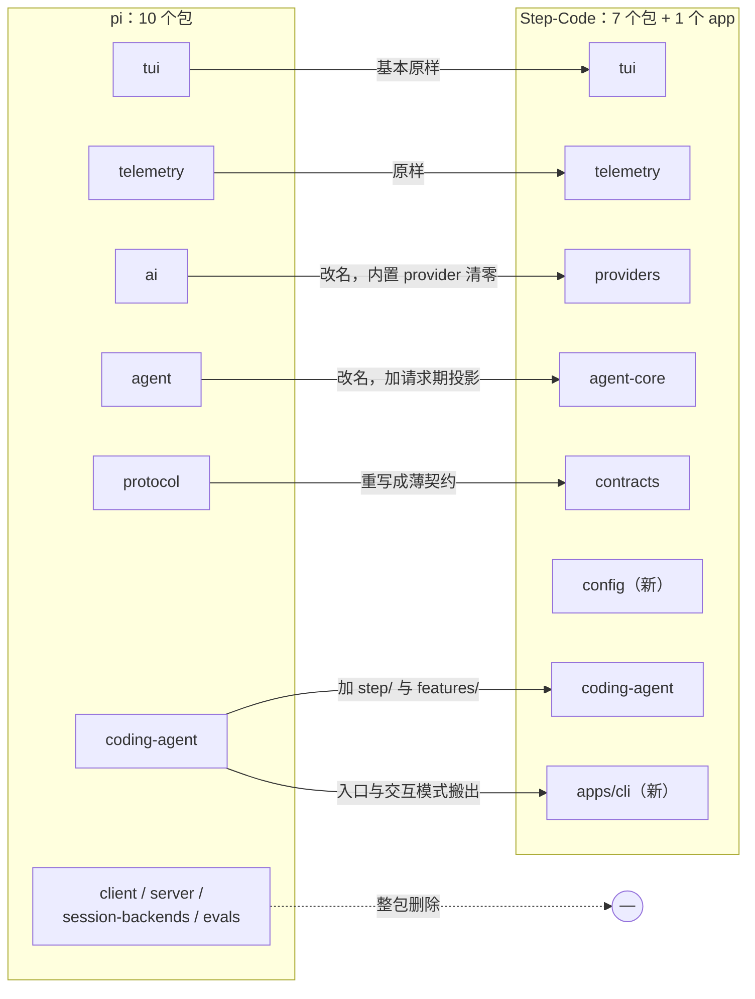
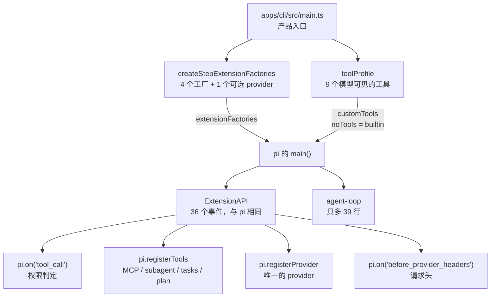
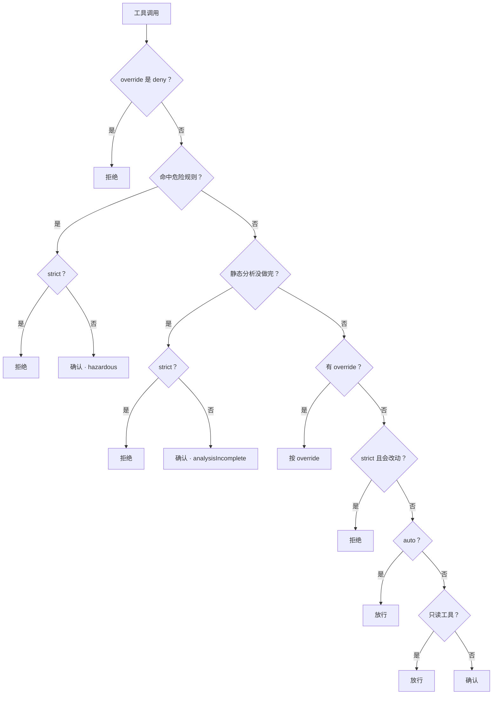
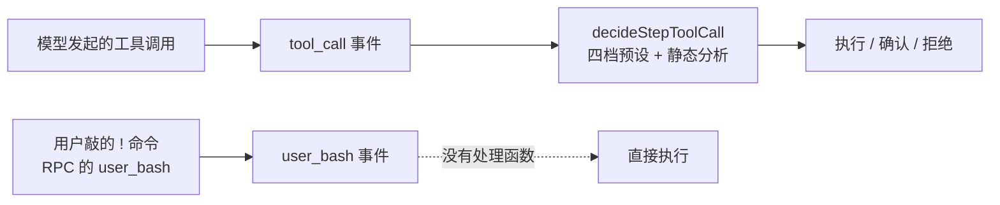
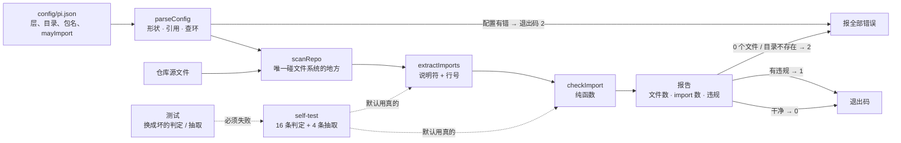

# 第 31 章 阶跃星辰：Step-Code

> 基准：pi `b79e4cc8` (v0.84.4)　·　Step-Code `7dd66cb9` (0.1.0)　·　[版本表](../../research/BASELINE.md)　·　[参与指南](../../CONTRIBUTING.md)

**状态**：✅ 已完成

## 本章回答

- Step-Code 相对 pi 改了多少、改在哪：哪些包改名、哪些删掉、哪些代码一个字节都没动
- 一个完整的产品策略层，是怎么挂到 pi 上而不改内核的
- pi 明确不做的六件事，Step-Code 各用什么补上
- 补策略时它反复做的同一个选择：拿不准就拒绝
- 它没补上的地方在哪，为什么大多正好是 pi 扩展 API 够不着的地方
- 它最值得搬走的一项工程实践——带自测的架构闸门——怎么用不到 600 行自己写一道

## 素材来源

- [`research/step-code/`](../../research/step-code/README.md) 全部 9 章（本章每个结论都能回溯到其中的 `file:line`）
- 对照底稿：[`research/pi/`](../../research/pi/README.md)
- 源码：开源仓库 `Step-Code`，commit `7dd66cb9`（2026-09-24，MIT）
- 配套代码：[`examples/ch31-layer-gate/`](../../examples/ch31-layer-gate/)

本章沿用全书的四种证据标注：【代码事实】是在基准 commit 上能按行号复查的；【文档】是 README 或仓库内文档的原话；【实机】是我在本机真跑出来的结果；【推断】是从前三者推出来、源码没有直接写明的判断。只引用开源仓库里的内容；内部构建里有什么，本章不知道，也不猜。

---

第 4 章给 pi 画过一张能力边界表，其中六项的状态是「决定不做」：MCP、子 agent、权限确认、plan 模式、内置 to-do、后台 bash。第 15 章把这件事概括成一句话：pi 给机制，不给策略。

那么，如果有人把这六项全补上，会是什么样子？Step-Code 就是这个问题的一份公开答案。它是阶跃星辰基于 pi 做的终端产品，MIT 许可，面向的是「用 Step 模型的人」而不是「会写扩展的人」。【文档】它的 README 把定位写成「Swift execution, long-horizon reliability, and high token efficiency」，并明说默认入口只带一个内置 provider。

这是第六部分「厂商全景」的第一章。这一部分每章回答同样四个问题：和 pi 差在哪、补了哪些策略、有哪些自己的判断、付了什么代价。本章不评价 Step-Code 好不好，只记录**它选了什么、代价是什么**。

先看几个数字：

| 数字 | 是什么 | 出处 |
| --- | --- | --- |
| 151,503 | Step-Code 的源码行数（pi 是 127,546，净增 18.8%） | [`research/step-code/README.md`](../../research/step-code/README.md) 的统一口径 |
| 280 | 与 pi 某个文件字节完全相同的文件数 | 同上，按 blob hash 比对 |
| 36 | 扩展事件数——两边一样多，集合也相同 | `core/extensions/types.ts` |
| 39 | Agent 循环相对 pi 新增的行数 | `packages/agent-core/src/agent-loop.ts` |
| 4 + 1 | 承载整个产品层的内联扩展工厂数（4 个固定，1 个可选的 provider） | `apps/cli/src/bootstrap/extensions.ts:35-55` |
| 6 / 6 | pi 的「No X」清单被补上的项数 | 31.2 节 |
| 18 / 14 / 15 | 架构闸门总数 / 新增数 / 带 `--self-test` 的数 | `scripts/check-*.mjs` |
| 40 → 1 | 内置 provider 数 | `packages/providers/src/providers/all.ts:43-47` |
| 50 → 0 | 遥测契约定义的事件数 → 公开构建实际发出的事件数 | `step/telemetry-events.ts`、`step/telemetry-contract.ts:110-124` |
| 0 | 沙箱数。并且请求沙箱会得到一个错误 | `step/stdio-host.ts:439-443` |

除特别说明，本章的路径都相对 Step-Code 仓库根；`step/` 和 `features/` 是 `packages/coding-agent/src/` 下的两个目录。

## 31.1 与 pi 的 diff 概览

### 历史没带过来

【代码事实】Step-Code 的公开仓库只有 18 个提交，第一个提交（`4fdb781`）一次加入 1,407 个文件。它和 pi 之间没有共同的 git 历史，「改了什么」只能靠逐文件比对内容还原。

这一条先说，是因为它决定了后面所有 diff 数字的读法：下面的「相同」「改过」是按文件内容的 hash 算出来的，不是 `git log` 告诉我们的。它也是 31.4 节第一笔代价。

### 包：改名、搬家、加一层壳、删四个



*图 31-1 包的去向：四种变化同时发生——改名、搬家、新增一层 app 壳、删掉四个包*

| 包 | pi 文件 / 行 | Step-Code 文件 / 行 | 去向 |
| --- | ---: | ---: | --- |
| `agent` → `agent-core` | 53 / 12,814 | 59 / 14,109 | 改名，加了请求期投影 |
| `ai` → `providers` | 184 / 27,301 | 73 / 15,536 | 改名，内置 provider 清零 |
| `coding-agent` | 206 / 60,964 | 256 / 79,640 | 主战场：`step/` 与 `features/` |
| `tui` | 40 / 17,000 | 40 / 17,359 | 基本原样 |
| `telemetry` | 6 / 935 | 6 / 935 | 原样 |
| `protocol` → `contracts` | 9 / 1,245 | 9 / 479 | 重写成薄契约 |
| `config` | — | 2 / 360 | 新增 |
| `apps/cli` | — | 89 / 23,085 | 新增：入口与交互模式从 `coding-agent` 搬出 |
| `client` / `server` / `session-backends` / `evals` | 58 / 7,287 | — | 整包删除 |
| **合计** | **556 / 127,546** | **534 / 151,503** | +18.8% 行 |

*表 31-1 两边的源码规模（同一条命令量出，不含测试与示例；口径见研究底稿 README）*

净增 18.8% 是两个方向相抵的结果。**减**的一侧：`ai` 包少了 11,765 行，四个包 7,287 行整包删除，`protocol` 从 1,245 行缩到 479 行。**增**的一侧：`coding-agent` 多了 18,676 行，`apps/cli` 是新的 23,085 行。

`coding-agent` 里新增的代码集中在两个目录：

| 目录 | 文件数 | 管什么 |
| --- | ---: | --- |
| `packages/coding-agent/src/step/` | 61 | 产品策略：权限、命令静态分析、工具面、MCP、插件市场、登录、遥测契约、反馈、更新 |
| `packages/coding-agent/src/features/` | 43 | 产品功能：goal / cron / plan / tasks / subagent / workflow |

*表 31-2 Step-Code 自己的判断几乎都在这两个目录里*

### 没动的部分

比「改了什么」更说明问题的是「没改什么」。【代码事实】

- **循环**：`agent-loop.ts` 只多了 39 行（31.3 节会看到它是什么）。`drain()`、中断语义、工具批次执行都没动。
- **扩展 API**：两边的扩展事件都是 36 个，集合完全相同。类型上唯一的新增是对话框的 `overlay?: boolean`（`core/extensions/types.ts:103-112`）。
- **会话存储**：`core/session-manager.ts` 只改了 4 行 import。
- **工具实现**：`core/tools/` 仍是 pi 的。
- **四种运行模式**全部保留，另加一种 `sdk-stdio`。

所以按文件算，`coding-agent` 里同路径的 244 个文件有 157 个字节相同，`agent-core` 的 55 个里有 32 个相同。

### Provider：收的是默认值，不是能力

【代码事实】`packages/providers/src/providers/all.ts:43-47` 的 `builtinProviders()` 直接返回空数组；`models.generated.ts` 只剩 7 行。但 `packages/providers/src/api/` 下的 9 个协议适配器都留着，扩展 API 里的 `registerProvider` 也留着——Step-Code 唯一的 provider 自己就是这样注册的（`features/step-provider/index.ts:60-64`）。

pi 铺开 40 家，Step-Code 收成 1 家。协议层的通用性没动，产品层的默认选择收回来了。

## 31.2 它补了哪些策略层

### 先看怎么挂上去的

第 8 章讲过 pi 的扩展模型：一个扩展是一个工厂函数，拿到 `ExtensionAPI` 之后注册工具、命令、事件处理函数。pi 自己也有「内联扩展」——随二进制一起发、不从磁盘加载的扩展——但只挂了一个隐藏的 `llama.cpp`（pi 的 `packages/coding-agent/src/main.ts:563`）。

Step-Code 把这个机制当成了**整个产品层的装配方式**：

```
// apps/cli/src/bootstrap/extensions.ts
/**
 * Build the ordered list of inline extension factories for pi's main().
 *
 * Keep this list in sync with ch5: it is the whole-repo registration point, so
 * adding an extension means adding one entry here — nowhere else.
 */
export function createStepExtensionFactories(deps: StepExtensionFactoryDeps): InlineExtension[] {
	return [
		createStepExtensionInline({
			telemetry: deps.telemetry,
			stepSettings: deps.stepSettings,
			feedbackIdentity: deps.feedbackIdentity,
			permission: deps.permission,
			traceHeaderPolicy: deps.traceHeaderPolicy,
		}),
		createStepCapabilitiesExtensionInline({ telemetry: deps.telemetry }),
		createStepCronExtension({ telemetry: deps.telemetry }),
		createStepGoalExtension({ telemetry: deps.telemetry }),
		...(deps.stepCodeProviderExtension ? [deps.stepCodeProviderExtension] : []),
	];
}
```


【代码事实】这个列表在 `apps/cli/src/main.ts:183-194` 作为 `extensionFactories` 交给 pi 的 `main()`。权限、goal、cron、plan、tasks、subagent、workflow、MCP、插件——全都是从这四个工厂里注册出去的，走的是和第三方扩展同一套 API。

内联扩展之外，还有**一处**是在 pi 的 `main()` 上新开的口子：

```
// packages/coding-agent/src/main.ts：新增的选项
	/**
	 * Optional product tool profile. Definitions are registered as custom tools,
	 * so Pi's native execution, approval, and renderer plumbing remains intact.
	 */
	toolProfile?: (context: {
		cwd: string;
		agentDir: string;
		settingsManager: SettingsManager;
	}) => Array<ToolDefinition<any, any, any>>;
```


```
// packages/coding-agent/src/main.ts：选项怎么生效
		const profileTools = options?.toolProfile?.({ cwd, agentDir, settingsManager });
		if (profileTools && profileTools.length > 0) {
			sessionOptions.customTools = [...(sessionOptions.customTools ?? []), ...profileTools];
			// The profile replaces Pi's default built-ins with its model-facing
			// aliases. Explicit --tools/--no-tools flags retain their normal meaning.
			if (!sessionOptions.tools && !sessionOptions.noTools) {
				sessionOptions.noTools = "builtin";
			}
		}
```


工具面经这个选项整套换掉：产品给的工具注册成 `customTools`，同时把 pi 的内置工具关掉（`noTools = "builtin"`）。注释说得很直白——这样做是为了让「Pi's native execution, approval, and renderer plumbing remains intact」。



*图 31-2 产品层的两条挂载路径：内联扩展工厂，加上 `main()` 的一个新选项。内核没有为策略新增任何事件*

【推断】这解释了为什么 280 个文件能保持字节相同：策略没有写进内核，而是写在内核已有的缝上。它同时也预告了 31.4 节的代价——策略的力度不会超过它所挂的那个事件的力度。

### 六个「No X」逐条对上

pi 的 README 用一节列了它不做的事（pi 的 `packages/coding-agent/README.md:499-509`）。Step-Code 的回答：

| pi 说 No | Step-Code 的实现 | 位置 | 挂在哪 |
| --- | --- | --- | --- |
| No MCP | stdio 与 Streamable HTTP 两种传输；可从 Claude Code / Codex 的配置一次性导入 | `step/mcp.ts`、`step/mcp-import.ts` | `pi.registerTools`（`step/mcp.ts:154`） |
| No sub-agents | 内置 `subagent` / `agent_send` 工具 | `features/step-subagent.ts:541-542,613-614` | 工具注册 |
| No permission popups | 四档预设 + shell 命令静态分析 | `step/permissions.ts:37-70` | `tool_call` 事件（`features/step.ts:242-244`） |
| No plan mode | `/plan`，加 `enter_plan_mode` / `exit_plan_mode` | `features/step-plan.ts:155`、`features/plan-mode-tools.ts:117,136` | 命令与工具注册 |
| No built-in to-dos | `task_create` / `task_update` / `/todos` | `features/step-tasks.ts:285,297,329` | 工具与命令注册 |
| No background bash | `run_command` 的 `run_in_background` | `step/tool-profile.ts:140` | `toolProfile` |

*表 31-3 六项全部补上。前五项走扩展 API；后台命令走 `toolProfile`，因为它需要换掉整个工具面*

最后一列是这张表的重点。六项里有五项，任何一个第三方扩展作者用同样的 API 都能做出来。pi 说「这些你自己用扩展做」，Step-Code 证明了这句话是真的。

### 权限：四档预设

权限是 Step-Code 加代码最多的一块。入口是四档预设（`step/permissions.ts:37-70`），每档是 `mode`、`autoResume`、`nonInteractiveApproval` 三个字段的一组取值：

| 预设 | `mode` | 读 | 写 / 执行 | 危险命令 | 模型报错后 |
| --- | --- | --- | --- | --- | --- |
| Ask | `confirm` | 放行 | 逐次确认 | 确认，标「Dangerous」 | 停 |
| Read Only | `strict` | 放行 | 拒绝 | 拒绝 | 停 |
| Bypass | `auto` | 放行 | 放行 | **仍然确认** | 停 |
| Autopilot | `auto` | 放行 | 放行 | **仍然确认** | 自动续跑 |

*表 31-4 四档预设。没有哪一档能让危险命令不经确认就执行*

Bypass 档的描述原文是「Run ordinary tools without approval; dangerous commands still ask」（`:59`）。

### 判定函数：顺序就是策略

每次工具调用都过同一个纯函数 `decideStepToolCall`（`step/permissions.ts:331-417`）。它的判定顺序：



*图 31-3 `decideStepToolCall` 的判定顺序。危险规则排在 override 的 allow 之前，也排在 auto 之前*

函数的后半段是这样写的：

```
// packages/coding-agent/src/step/permissions.ts：decideStepToolCall 的后半段
	if (override) {
		return {
			action: override,
			hazardous: false,
			reason: `Policy override for ${toolName}: ${override}`,
		};
	}

	const mutating = WRITE_OR_EXECUTE_TOOLS.has(normalizedName) || !READ_ONLY_TOOLS.has(normalizedName);
	if (state.mode === "strict" && mutating) {
		return {
			action: "deny",
			hazardous: false,
			reason: `Read-only mode blocks ${toolName}`,
		};
	}
	if (state.mode === "auto") {
		return {
			action: "allow",
			hazardous: false,
			reason: "Bypass approval mode is enabled",
		};
	}
	if (!mutating) {
		return {
			action: "allow",
			hazardous: false,
			reason: "Read-only tool",
		};
	}
	return {
		action: "confirm",
		hazardous: false,
		reason: `${toolName} can modify the workspace or execute a command`,
	};
```


三个细节，每一个都是一次判断：

1. **危险规则排在 allow 之前。** 用户给 `run_command` 配了 allow，`rm -rf` 仍然会问。只有 deny 能越过它。
2. **不认识的工具当作会改动**（`:391`）。`mutating` 的定义是「在可写集合里，**或者不在只读集合里**」。新接进来的 MCP 工具默认要确认，而不是默认放行。
3. **分析失败不等于安全。** shell 配置读不出来时走 `catch`，结果是 `unresolved`，要求显式批准（`:351-353`）。

命令的静态分析（`step/command-policy.ts`，508 行；`step/shell-analysis.ts`，502 行）给出的不是「危险 / 安全」两态，而是三态：

| 结果 | 含义 | 后续 |
| --- | --- | --- |
| `matched` | 命中某条规则（递归强制删除、`mkfs`、`dd if=`、破坏性 git、破坏性 SQL 等） | 确认或拒绝 |
| `unresolved` | 分析没做完：非 bash 方言、嵌套超过 12 层、超过 256,000 字符 | **也要确认** |
| `ordinary` | 没有规则命中 | 按预设走 |

*表 31-5 命令分析的三态。第 15 章的「命中 / 看不全 / 普通」用的是同一个划分*

两句注释把边界说清楚了：「An ordinary result means no static rule matched, not that a program is sandboxed」（`step/command-policy.ts:112`），「Detection alone is not authorization」（`:125`）。作者没有把静态分析包装成安全保证。

### 没人可问的时候

判定结果是「确认」，但当前没有界面可以弹确认框——`--print` 模式、CI、被别的程序当子进程调用——这时怎么办？

```
// packages/coding-agent/src/step/permissions.ts：handleToolCall
	async handleToolCall(event: ToolCallEvent, context: ExtensionContext): Promise<ToolCallEventResult | undefined> {
		const input = event.input;
		const cause = this.unattendedCause(context.hasUI);
		const state = this.effectiveState(cause);
		const decision = decideStepToolCall(event.toolName, input, state, this.toolOverrides, this.shellContext());
		if (decision.action === "allow") return undefined;

		if (decision.action === "deny") {
			return { block: true, terminate: true, reason: decision.reason };
		}

		if (!context.hasUI) {
			// Match the old Step policy: an explicit non-interactive `allow` can
			// approve an ordinary confirmation once, while hazardous commands always
			// fail closed. The default remains deny.
			if (!decision.hazardous && !decision.analysisIncomplete && state.nonInteractiveApproval === "allow")
				return undefined;
			return {
				block: true,
				terminate: true,
				reason: formatUnattendedBlockReason(decision, cause),
			};
		}
```


三个条件同时成立才放行：不是危险命令、静态分析做完了、并且显式配了 `nonInteractiveApproval: "allow"`。否则 `block` 加 `terminate`——不只是拒掉这一次调用，而是把这一轮停下来。

SDK 宿主（`sdk-stdio` 模式）那一侧也是同样的方向：

```
// packages/coding-agent/src/step/stdio-host.ts
		// The SDK always serializes a concrete mode. Keep the same default at the
		// runtime boundary for older/hand-written clients: without a callback,
		// approval-requiring tools must fail closed instead of running unguarded.
		options.hasPermissionCallback = options.hasPermissionCallback === true;
		options.permissionMode ??= options.hasPermissionCallback ? "default" : "dontAsk";
		if (options.permissionMode !== undefined && !PERMISSION_MODES.has(options.permissionMode)) {
			this.#respondError(frame, "CONFIG_INVALID", new Error(`unknown permission mode: ${options.permissionMode}`));
			return;
		}
		if (options.sandbox?.enabled === true) {
			this.#respondError(
				frame,
				"SANDBOX_UNAVAILABLE",
				new Error("sandbox.enabled was requested but the Step runtime has no sandbox adapter"),
			);
			return;
```


这里有两个决定。宿主没给权限回调时，模式默认取 `dontAsk`——没人能批准，就不执行。宿主请求沙箱时，返回 `SANDBOX_UNAVAILABLE`——**请求了一个我没有的安全能力，报错，而不是静默接受然后不生效**。

### 其余几项，各一句话

- **子 agent**（`features/step-subagent.ts`）：每个子 agent 是一个长驻的 `--mode rpc` 子进程，可选放进独立的 git worktree，嵌套深度限制为 1。四个内置角色靠工具白名单区分。RPC 模式不但没被砍，还成了子 agent 的承载面。
- **Workflow**（`features/workflow/`）：模型写的编排脚本跑在 QuickJS/WASM 沙箱里，带 journal 和预算；数据跨 VM 边界只走 JSON。这个沙箱只管 workflow 脚本，不管工具。
- **MCP**：长在 `pi.registerTools` 上，没有另开工具通路，所以上面的权限判定对 MCP 工具同样生效——它们不在只读白名单里，按「会改动」处理。
- **声明式插件**（`step/plugins.ts`，1,484 行）：市场里分发的是清单，不是代码；代码只在独立的 MCP 子进程里跑。pi 的「扩展 = 进程内任意代码」那条路原样保留，这是在旁边新开的一条更窄的路。
- **压缩**：预留从 16,384 改成 24,576；摘要从 6 段变 8 段，多出的段落里有「Verification」和「Failed Approaches」。

每一项的细节在研究底稿的[第 4 章](../../research/step-code/04-context-engineering.md)、[第 6 章](../../research/step-code/06-multi-agent.md)、[第 7 章](../../research/step-code/07-extensibility.md)。

## 31.3 它自己的判断

上一节是「补了什么」。这一节看的是补的时候反复出现的几个选择——它们比具体功能更能搬走。

### 判断一：拿不准就拒绝

把 31.2 节散落的几处放在一起，再加上几处别的：

| 场景 | 选择 | 位置 |
| --- | --- | --- |
| 无人值守时遇到要确认的工具 | 拒绝，并停下这一轮 | `step/permissions.ts:535-546` |
| 不认识的工具 | 按会改动处理 | `step/permissions.ts:391` |
| shell 静态分析没做完 | 要显式批准；无人值守时拒绝 | `step/permissions.ts:374-381` |
| SDK 宿主没给权限回调 | 默认 `dontAsk` | `step/stdio-host.ts:430-434` |
| SDK 宿主请求沙箱 | 报 `SANDBOX_UNAVAILABLE` | `step/stdio-host.ts:439-443` |
| 追踪头的敏感字段列表缺省 | 一个不发 | `step/trace-headers.ts:74-76` |
| 快捷键切换权限档 | 不写进配置文件 | `features/step.ts:313-318` |
| Bypass 档下无人值守被拒或没配置 | 降回 `confirm` | `step/permissions.ts:518-521` |

*表 31-6 八处「拿不准」，方向全部一致*

其中快捷键那一条带着一段从事故里长出来的注释：

```
// packages/coding-agent/src/features/step.ts
				// Deliberately not persisted. The shortcut means "stop asking me right
				// now, I am watching", but persisting it wrote the whole policy triple
				// — including `nonInteractiveApproval: "allow"` under Bypass — to
				// config.toml, so one keypress silently granted every later unattended
				// `--print` run in that project permission to write and execute. Use
				// `/permissions <preset>` for a durable choice.
```


一次按键的意思是「我正盯着，现在别问我」。把它持久化，就变成了「这个项目里以后所有无人值守的运行都可以写和执行」。两句话的范围差了很多，代码把它们分开了：临时的走快捷键，持久的必须显式敲 `/permissions <preset>`。

### 判断二：循环只改一处

【代码事实】`agent-loop.ts` 相对 pi 的全部改动是下面这一段，加上它用到的一个判定函数（`:293-317`）：

```
// packages/agent-core/src/agent-loop.ts
			// Stream assistant response
			let message = await streamAssistantResponse(currentContext, config, signal, emit, streamFunction);

			// Serving-side tool parsers can fail and leak the model's tool-call
			// markup into plain text: the turn then carries no executable call
			// and the loop would end even though the model meant to act.
			// Resample the identical context a bounded number of times; the
			// leaked attempt is dropped from the request context while its
			// message events above remain for observability.
			const leakRetryLimit = config.toolCallLeakRetries ?? DEFAULT_TOOL_CALL_LEAK_RETRIES;
			for (let attempt = 0; attempt < leakRetryLimit && isToolCallMarkupLeak(message); attempt++) {
				if (currentContext.messages[currentContext.messages.length - 1] !== message) break;
				currentContext.messages.pop();
				message = await streamAssistantResponse(currentContext, config, signal, emit, streamFunction);
			}
			newMessages.push(message);
```


它处理的是一种具体的故障：模型想调工具，但服务端的工具解析器没认出来，工具调用的标记原样漏进了正文。这一轮既没有可执行的调用，也不是错误，循环会当它是「模型说完了」而正常结束——可模型其实是想继续干活的。

做法是把这条消息从**请求上下文**里弹掉，用同一份上下文重新采样，默认最多 2 次。注意注释的最后一句：漏出来的那次尝试，它的消息事件已经发出去了，留着供观察。

【推断】这是一处很「单 provider」的改动。pi 面对 40 家 provider，不可能为某一家的服务端行为在循环里加分支；Step-Code 只有一家，而且是自家的，于是可以。改动只有 39 行，但它是全仓唯一动了内核循环的地方。

没补的也要记一笔：循环里**没有**防死循环的计数器。遥测契约里定义了 `tool_call_repeat` 事件（`step/telemetry-events.ts:65,510`），属性是 `tool_name` / `attempt_count` / `limit`——正是做这件事需要的数据——但全仓没有任何地方发出它。

### 判断三：改请求，不改记录

上面的重采样已经是这条规则的一个例子：弹掉的是请求上下文里的那一条，事件流里的记录还在。

同样的规则出现在另外两处。请求期投影（默认关闭）的文件头：

```
// packages/agent-core/src/harness/compaction/projection.ts
/**
 * Lightweight request-time context projection.
 *
 * `projectContextForRequest` deterministically rewrites the LLM-facing message
 * array right before a model request to reclaim context window from redundant
 * content. It is a pure function: no I/O, no model calls, and no session
 * mutation. The session transcript and compaction entries are never touched --
 * only the projected copy handed to the provider changes.
 *
 * Structural guarantee: projection only rewrites message *content* in place.
 * It never removes, inserts, or reorders messages, never changes roles, and
 * never touches tool-call blocks, so assistant `toolCall` / `toolResult`
 * pairing is preserved by construction and re-verified afterwards.
 *
 * Invariants (any violation returns the original messages unchanged):
 *   1. The current user turn (last user message) is never modified.
 *   2. The active tool-call group (last assistant message and everything
 *      after it) is never modified.
 *   3. The most recent `keepRecentTokens` worth of tail messages are never
 *      modified.
```


纯函数、不做 I/O、不调模型、不动会话；只改内容不增删消息，所以工具调用与结果的配对不会被破坏；三条不变量任何一条被违反，就原样返回输入。流中断后的恢复投影遵循同一条规则。

【推断】这条规则的价值在于**可回退**：两项都是实验性能力，只要记录没动，关掉开关就回到原样。代价见 31.4 节的 F7。

### 判断四：守卫要有自测，自测要进 CI

pi 的研究底稿里有一节标题是「没有机器强制的架构规则」。Step-Code 在这里改得最多。

【代码事实】pi 有 4 个 `check-*.mjs`；Step-Code 有 18 个、共 2,181 行，14 个是新的。`pnpm run check`（`package.json:19`）串起其中 15 个。几个例子：

| 闸门 | 守什么 |
| --- | --- |
| `layer-direction` | 依赖只许自上而下 |
| `tui-no-ai` | TUI 包不许有 AI 依赖 |
| `contracts-deps-empty` | contracts 包必须零依赖 |
| `coding-agent-entry-freeze` | bin / exports 只能是基线的子集 |
| `no-provider-dispatch` | 适配器里不许按 provider 名字分支 |
| `no-secret-leak` | 可用性探针的错误信息里不许拼入凭据变量 |
| `public-boundary` | 内部路径不许进公开仓库 |

*表 31-7 新增闸门举例（完整列表见研究底稿第 2 章）*

分层闸门的规则写在脚本头部：

```
// scripts/check-layer-direction.mjs
// S0-3 layer-direction check.
//
// Enforces the "依赖只许自上而下" rule between the three layers, keyed off the app-internal
// absolute import prefix "#" (apps/cli/package.json maps "#*" -> "./src/*.ts", so "#ui/index"
// means apps/<app>/src/ui/index.ts). Rules:
//   1  app shell/shared may reach the UI only through the single door "#ui/index" (or "#ui");
//      importing any deeper "#ui/..." internal is forbidden.
//   2  the UI (apps/<app>/src/ui/**) must not reverse-import the shell (main/args/bootstrap/modes/bun).
// …
// apps/cli currently has no ui/ or shell subdirs, so the real scan finds nothing to flag yet —
// the rules are in place for steps 3/4. The --self-test exercises every rule with synthetic
// (importer, specifier) pairs (no fixture files: an app-internal fixture would have to live under
// apps/<app>/src and would then be compiled/linted by the real gate).
```


（规则 3、4 的两行略去，内容是：能力包和扩展都不许导入 app 包。）

15 个闸门带 `--self-test`：用合成的（导入方，说明符）对把每条规则各打一遍。不用夹具文件的理由写在上面最后两行——一个故意违规的夹具一旦放进被扫描的目录，真正的闸门就会扫到它。【实机】我在 `git archive` 出来的副本里逐个跑过，15 个全部退出码 0。

然后是 pi 没走的那一步：

```
// scripts/guard-self-tests.test.mjs
// Every guard that ships a `--self-test` convention. The self-tests assert the
// guard's own detection logic against known clean/violation fixtures, but they
// were only ever run by hand — so a guard whose logic silently broke would keep
// reporting "passed" in CI. This suite runs each guard's --self-test under
// `node --test scripts/*.test.mjs` (wired into `pnpm run test:scripts`) so a
// broken guard fails the build.
```


`package.json:44` 的 `test` 先跑 `test:scripts`，再跑各包的测试。所以一道检测逻辑坏掉的闸门会让 CI 变红，而不是永远报「passed」。

**一道永远通过的闸门比没有闸门更糟**，因为它让人以为那条规则有人守着。Step-Code 把「闸门自己会坏」当成一个独立的风险来处理，这是全仓最能直接搬走的一项实践，也是本章「你的最小实现」要做的事。

### 判断五：遥测的契约公开，实现不在

【代码事实】`step/telemetry-events.ts`（867 行）定义了 50 个事件，每个都有属性名白名单。全仓有 14 个源文件在调用上报接口。然后是这一段：

```
// packages/coding-agent/src/step/telemetry-contract.ts
/** Composition seam for environment-specific observability implementations. */
export interface StepObservabilityProvider {
	createReporter(config?: StepObservabilityConfig): StepTelemetryReporter;
	createModelRequestObserver(reporter: StepTelemetryReporter): ModelRequestObserver | undefined;
	createSystemMetrics?(reporter: StepTelemetryReporter): ObservabilitySystemMetrics | undefined;
	installCrashHandlers?(reporter: StepTelemetryReporter): ObservabilityCrashHandlers | undefined;
	traceHeaderPolicy(): TraceHeaderPolicy;
}

/** Public builds intentionally do not send telemetry or trace identity. */
export const NOOP_OBSERVABILITY_PROVIDER: StepObservabilityProvider = {
	createReporter: () => ({ enabled: false, track: () => undefined, setContext: () => undefined }),
	createModelRequestObserver: () => undefined,
	traceHeaderPolicy: () => ({ allowedBaseUrls: [], highSensitivityFields: [] }),
};
```


`apps/cli/src/observability.ts` 的有效内容是一行：把这个 NOOP provider 导出去。再加一道闸门（`scripts/check-no-observability.mjs`）在 CI 里守着，不许真实的遥测实现出现在公开仓库里。

所以公开构建里：50 个事件一个不发；请求头只有一个 `x-step-client`，会话 id 和工作目录这类字段要同时满足「请求地址在允许列表里」和「字段在允许列表里」才发，而公开构建的两张列表都是空的。pi 默认开启的安装计数 ping 也被整项删除。唯一主动的出站请求是更新检查。

【推断】这是「一套代码、两种发行」的做法。好处是公开版的隐私承诺可以靠读代码验证，不是靠一句声明；代价是公开版的使用者没有任何内建的运行数据。

### 判断六：换沙箱引擎，因为发布的二进制加载不了旧的

```
// packages/coding-agent/src/features/workflow/vm.ts
/**
 * The workflow sandbox: QuickJS compiled to WebAssembly.
 *
 * A workflow script is authored by the model, so it runs isolated — no host
 * object references, no `process`/`require`/`fetch`, no wall clock and no
 * randomness (the last two keep journal replay deterministic), under a memory
 * cap and a timeout.
 *
 * QuickJS-on-WebAssembly is engine-agnostic, which is the point. The previous
 * sandbox, `isolated-vm`, is a native addon that links V8's C++ API directly, so
 * it could only load on a V8 host: the released executable is built with
 * `bun build --compile` and runs on JavaScriptCore, where that addon can never
 * load however it is installed. Workflows — and with them the ultraloop opt-in,
 * which shares the workflow registration gate — were therefore silently absent
 * from every released build while working fine in a source run on Node. One
 * engine for both runtimes removes that class of divergence, and costs nothing
 * that matters here: workflow scripts are orchestration code that spends its
 * time awaiting agents, not computing.
```


这段注释记下了一个值得记的故障形态：`isolated-vm` 是链接 V8 的原生模块；发布的可执行文件是 `bun build --compile` 出来的，跑在 JavaScriptCore 上，永远加载不了它。结果是 workflow 在**每一个发布版**里都悄悄不存在，而用 Node 从源码跑时一切正常。

「源码跑得通、发布版里没有」是测试最难覆盖的一类分歧。Step-Code 的处理是换成与引擎无关的 QuickJS/WASM，从根上消掉这类分歧，而不是加一条「发布前记得检查」。

## 31.4 代价与取舍

### 策略覆盖不全：补了一扇门，旁边的门还开着

pi 的问题多是「机制层没给策略」。Step-Code 给了策略，问题变成了**策略覆盖不全**。先说性质：下面没有一条是「数据已经泄露」或「凭据已经提交」。

| # | 问题 | 位置 | 来自 pi？ |
| --- | --- | --- | --- |
| F1 | `!` 用户命令不过权限判定，Read Only 档下也照常执行；RPC 的 `user_bash` 同理 | `apps/cli/src/ui/interactive-mode.ts:6630-6640`、`modes/rpc/rpc-mode.ts:564` | 继承，**但落差变大** |
| F2 | 用户安装的扩展包会跑 npm 生命周期脚本 | `core/package-manager.ts:1770-1791` | 继承 |
| F3 | 模型执行的命令能读到全部环境变量 | `utils/shell.ts:139-152` | 继承 |
| F4 | 无沙箱、无路径边界：能写仓库之外、能写 `.git` | `core/tools/path-utils.ts:48-50` | 继承（但 Step-Code 把它说出来了） |
| F5 | 零防死循环；`tool_call_repeat` 定义了没人发 | `step/telemetry-events.ts:65,510` | 继承 |
| F6 | 命令无默认超时 | `step/tool-profile.ts:1014-1018` | 继承 |
| F7 | 请求期投影可能让前缀缓存失效，代码里没有任何缓存相关处理 | `agent-core/src/harness/` 下 6 个 `projection*.ts` | 新增（默认关闭） |

*表 31-8 七项缺口。六项是 pi 原有的，一项是新的*

F1 值得单独展开，因为它最清楚地画出了「在扩展点上做策略」的边界。



*图 31-4 两条执行路径，只有一条过权限判定。Read Only 档下第二条照样能写*

【代码事实】权限控制器只挂了 `tool_call`（`features/step.ts:242-244`）。`!` 命令走的是另一个扩展事件 `user_bash`，全仓除了示例扩展没有任何代码注册它的处理函数。有意思的是 `user_bash` 这个名字明明出现在「可写或可执行」集合里（`step/permissions.ts:89-98`）——作者想到了它，但那个集合只在 `tool_call` 的判定里被查，而 `!` 永远不会走到那里。

这一条在 pi 里也存在，为什么在 Step-Code 里更要紧？因为 pi 里被绕过的是一个**示例**扩展，装它的人是少数；Step-Code 里被绕过的是**产品默认的权限系统**，而用户看到的档位名叫「Read Only」。从「用户自己敲的命令当然可信」的角度说得通，但这个名字给人的预期是整个会话只读。

修法有两种：给 `user_bash` 事件也挂上同一个判定，或者在 Read Only 的说明里写明不含 `!` 命令。第 22 章的上线清单把「模型与 `!` 两条路都要过确认」列为必补项，原因就在这里。

F2 则是一处纪律不一致：Step-Code 自己的 CI 装依赖时用了 `--ignore-scripts`（`.github/workflows/ci.yml:35`），给用户装扩展时没加。

### 扩展 API 的边界，就是这套策略的边界

把上面的缺口和「怎么挂上去的」放在一起看：

- F1 之所以存在，是因为权限挂在 `tool_call` 上，而 `!` 走另一个事件。
- F5 之所以存在，是因为循环里没有计数器，而扩展事件拿不到「这是第几次重复调用」。
- F3、F4、F6 都落在 pi 的工具实现里（`core/tools/`、`utils/shell.ts`），Step-Code 没改这些文件。

【推断】Step-Code 证明了 pi 的扩展 API 足以承载一个商业产品的策略层。反过来，它没补上的地方，几乎都是这套 API 够不着、必须改内核文件才能补的地方。选择「尽量不改内核」换来了 280 个字节相同的文件，付出的就是这几项。

### 跟随上游的成本只增不减

第 24 章讲过基于 pi 做产品的三条路。Step-Code 走的是第三条——重构成自己的 fork——而且走得比较彻底：

| 债 | 位置 |
| --- | --- |
| 历史压成一个初始提交，与上游的关系只能靠内容比对还原，无法 cherry-pick | `4fdb781` |
| 包改名、交互模式换目录：上游对这些文件的每个改动，都要先做路径映射 | `apps/cli/src/ui/` |
| 两个巨型文件继续长：`agent-session.ts` 3,516 → 3,653 行；`interactive-mode.ts` 6,575 → 6,753 行 | `core/agent-session.ts`、`apps/cli/src/ui/interactive-mode.ts` |
| 继承来的 issue 自动关闭闸门被移除，没有回流上游的通道 | 提交 `58df39d` |

*表 31-9 与上游的距离*

280 个字节相同的文件是好消息——这部分可以直接覆盖。坏消息是另外那些「同路径但改过」的文件（`coding-agent` 87 个、`agent-core` 23 个、`tui` 20 个）：每次上游发版，这些都要人看。

### 规则在跑，文档没跟上

闸门也会腐化。几处能复查的：

- 分层闸门的头注释还写着「apps/cli currently has no ui/ or shell subdirs, so the real scan finds nothing to flag yet」（`scripts/check-layer-direction.mjs:14`），而 `apps/cli/src/ui/` 现在有 6,753 行的交互模式。
- 子 agent 的头注释说「JSON mode」，实际是 rpc（`features/step-subagent.ts:1-8` 对 `:393-398`）。
- 工作区清单里列着一个不存在的目录 `packages/extensions/*`（`pnpm-workspace.yaml`）。
- 压缩的默认值在两个包里各有一份。

第一条对本章的例子有直接启发：闸门只打印「passed」时，读的人分不清是「扫过了，干净」还是「什么都没扫到」。那行注释写下的那一天，答案是后者；今天是前者；输出一模一样。

## 31.5 你的最小实现

这一节把 31.3 节的判断四落成一个能跑的东西：`examples/ch31-layer-gate/`，978 行（含 383 行测试），零依赖，不联网，只读被扫描的仓库。

它是一道分层闸门：给定「有哪些层、每层允许依赖谁」，扫一个仓库的全部 import，报出越界的。思路照 Step-Code 的 `check-layer-direction.mjs`——判定是纯函数、自测用合成用例不用夹具——但在四处做了不同的选择：

| | Step-Code 的分层闸门 | 本例 |
| --- | --- | --- |
| 规则怎么写 | 四条规则写死在脚本里 | 配置文件：每层列出 `mayImport`，没列的边就是违规 |
| 认不出归属的内部目标 | 规则没覆盖到就返回 `null`（放行） | 违规 |
| 「0 违规」 | 只打印 passed | 同时报文件数和 import 数；一个文件都没扫到算配置错误 |
| 自测 | 有，进 CI | 有；测试里再把判定函数换成坏的，确认自测真的会失败 |
| 抽取 import | TypeScript AST | 涂掉注释和模板字符串后用正则 |

*表 31-10 本例与 Step-Code 分层闸门的差别。最后一行是零依赖的代价，不是改进*



*图 31-5 例子的结构：判定和抽取是纯函数，扫描是唯一的 I/O；自测调它们，测试再去调自测*

### 关键代码

| 文件 | 行 | 看什么 |
| --- | --- | --- |
| `src/classify.ts` | 38-60 | 判定：三种违规，其余放行 |
| `src/config.ts` | 44-63 | 依赖图查环 |
| `src/scan.ts` | 56-69 | 扫描并计数 |
| `src/main.ts` | 64-69 | 「没扫到」不算通过 |
| `src/self-test.ts` | 97-112 | 自测：判定和抽取可以从外面换 |
| `test/self-test.test.ts` | 23-42 | 自测的自测 |

**判定。** 整道闸门只有这一个判定函数：

```
// src/classify.ts：一条 import 允许还是违规
export function checkImport(config: GateConfig, importer: string, specifier: string): Violation | undefined {
	const from = layerOfPath(config, importer);
	if (!from) {
		return { kind: "unassigned-importer", importer, specifier, message: `${importer} 不在任何一层里——先给它归层，闸门才知道该用哪条规则` };
	}
	const target = resolveTarget(config, importer, specifier);
	if (target.kind === "external") return undefined;
	if (target.kind === "unassigned") {
		return {
			kind: "unassigned-target",
			importer,
			specifier,
			message: `${from.name} 导入了「${specifier}」${target.resolved === specifier ? "" : `（→ ${target.resolved}）`}，它是内部代码却不属于任何一层`,
		};
	}
	if (target.layer.name === from.name || from.mayImport.includes(target.layer.name)) return undefined;
	return {
		kind: "forbidden-edge",
		importer,
		specifier,
		message: `${from.name} → ${target.layer.name} 不在 ${from.name}.mayImport 里（「${specifier}」）`,
	};
}
```


只有两种情况放行：目标是外部包；目标所在的层就是自己，或者写在自己的 `mayImport` 里。其余都是违规，包括两种「认不出」——导入方不在任何一层（`unassigned-importer`），或者目标是内部代码却不属于任何一层（`unassigned-target`）。这是把表 31-6 的方向用到闸门自己身上：新建了一个目录忘了归层，闸门应该叫，而不是默默放过。

**配置也要校验。** 配置是外部输入。除了形状，还要查一件只有放在一起才看得出的事：

```
// src/config.ts：返回一个环，没有就返回 undefined
export function findCycle(layers: readonly Layer[]): string[] | undefined {
	const edges = new Map(layers.map((l) => [l.name, l.mayImport]));
	const done = new Set<string>();
	const visit = (name: string, stack: readonly string[]): string[] | undefined => {
		const at = stack.indexOf(name);
		if (at >= 0) return [...stack.slice(at), name];
		if (done.has(name)) return undefined;
		for (const next of edges.get(name) ?? []) {
			const cycle = visit(next, [...stack, name]);
			if (cycle) return cycle;
		}
		done.add(name);
		return undefined;
	};
	for (const layer of layers) {
		const cycle = visit(layer.name, []);
		if (cycle) return cycle;
	}
	return undefined;
}
```


有环的「分层」不是分层。闸门照样能跑，但它守的规则自相矛盾：`a` 可以依赖 `b`、`b` 可以依赖 `a`，等于没有方向。这里每次递归都传一个新的 `stack`，不改调用方的那一份。

**扫描要报数。**

```
// src/scan.ts：扫描并计数
export function scanRepo(root: string, config: GateConfig): ScanReport {
	const { files, missingPaths } = listSourceFiles(root, config);
	const findings: Finding[] = [];
	let imports = 0;
	for (const file of files) {
		const importer = toRepoPath(root, file);
		for (const ref of extractImports(readFileSync(file, "utf8"))) {
			imports++;
			const violation = checkImport(config, importer, ref.specifier);
			if (violation) findings.push({ ...violation, line: ref.line });
		}
	}
	return { files: files.length, imports, findings, missingPaths };
}
```


```
// src/main.ts：扫描范围本身有问题时
/** 扫描范围本身有问题时返回错误说明：这时「0 违规」不代表干净 */
export function scopeProblem(report: ScanReport): string | undefined {
	if (report.missingPaths.length > 0) return `配置里的这些目录不存在：${report.missingPaths.join("、")}——配置和仓库已经对不上了`;
	if (report.files === 0) return "一个源文件都没扫到：这是配置的问题，不是「没有违规」";
	return undefined;
}
```


报告里除了违规，还有 `files`、`imports` 和 `missingPaths`。后三个字段回答的是 31.4 节末尾那个问题：这次「0 违规」是扫过了，还是没扫到。配置里列了却不存在的目录、或者一个源文件都没扫到，退出码是 2——和「有违规」的 1 分开，因为这两种情况要找的人不一样。

**自测，和自测的自测。**

```
// src/self-test.ts：判定函数和抽取函数都是参数
type Check = (config: GateConfig, importer: string, specifier: string) => Violation | undefined;
type Extract = (source: string) => ImportRef[];

/** 返回失败描述的列表；空列表表示自测通过 */
export function runSelfTest(check: Check = checkImport, extract: Extract = extractImports): string[] {
	const failures: string[] = [];
	for (const c of EDGE_CASES) {
		const got = check(SELF_TEST_CONFIG, c.importer, c.specifier)?.kind;
		if (got !== c.expect) failures.push(`${c.importer} → ${c.specifier}：期望 ${c.expect ?? "放行"}，得到 ${got ?? "放行"}`);
	}
	for (const c of SCAN_CASES) {
		const got = JSON.stringify(extract(c.source));
		if (got !== JSON.stringify(c.expect)) failures.push(`抽取「${c.name}」：期望 ${JSON.stringify(c.expect)}，得到 ${got}`);
	}
	return failures;
}
```


`runSelfTest` 的两个参数默认是真的判定和真的抽取。命令行的 `--self-test` 用默认值；测试里换成坏的：

```
// test/self-test.test.ts：换成坏掉的闸门，自测必须失败
// 下面几条是「自测的自测」：换成坏掉的闸门，自测必须失败

test("什么都放行的闸门过不了自测", () => {
	assert.ok(runSelfTest(() => undefined).length >= 9);
});

test("什么都拦的闸门过不了自测", () => {
	const blockAll = (_c: unknown, importer: string, specifier: string): Violation => ({ kind: "forbidden-edge", importer, specifier, message: "" });
	assert.ok(runSelfTest(blockAll).length >= 7);
});

test("对认不出的目标失败开放的闸门过不了自测", () => {
	const failOpen: typeof checkImport = (config, importer, specifier) => {
		const v = checkImport(config, importer, specifier);
		return v?.kind === "forbidden-edge" ? v : undefined;
	};
	const failures = runSelfTest(failOpen);
	assert.equal(failures.length, 4);
	assert.ok(failures.every((f) => f.includes("得到 放行")));
});
```


Step-Code 的 `guard-self-tests.test.mjs` 保证的是「自测在 CI 里跑」。这几条用例多问一步：如果闸门真的坏了，自测**看得出来吗**？一份只包含放行用例的自测，对一道什么都放行的闸门永远是绿的。

### 跑起来

```bash
cd examples/ch31-layer-gate
npm run self-test
npm start -- --config config/pi.json ../../../code-agents/pi
npm test
```

【实机】自测，以及用 `config/pi.json`（10 层）扫 pi 基准 commit：

```
$ npm run self-test
layer-gate 自测通过。

$ npm start -- --config config/pi.json ../../../code-agents/pi
layer-gate：扫了 541 个文件、2615 条 import
没有违规。
```

这是最终的结果，不是第一次的结果。【实机】第一次用的配置里 `evals` 层的 `mayImport` 是空的，输出是 2 处 `forbidden-edge`，都在 `packages/evals/src/pi-harness.ts`（第 6、7 行）：它导入了 `ai` 和 `coding-agent`。查下来是我的配置错了——`evals` 是个不发布的包，这两个内部依赖写在 `devDependencies` 里，我只看 `dependencies` 画依赖图，漏了两条边。

**闸门的第一个发现是配置的错，不是代码的错。** 这对白名单闸门是常态：规则是人写的，第一版多半比实际的代码窄。

【实机】把配置改坏，看四种失败各长什么样。从配置里删掉 `telemetry` 这一层：

```
$ npm start -- --config /tmp/lg-no-telemetry.json ../../../code-agents/pi
layer-gate：扫了 535 个文件、2601 条 import
  unassigned-target    packages/agent/src/harness/telemetry.ts:1  agent 导入了「@earendil-works/pi-telemetry」，它是内部代码却不属于任何一层
  unassigned-target    packages/agent/src/harness/telemetry.ts:15  agent 导入了「@earendil-works/pi-telemetry」，它是内部代码却不属于任何一层
  unassigned-target    packages/agent/src/index.ts:4  agent 导入了「@earendil-works/pi-telemetry」，它是内部代码却不属于任何一层
  unassigned-target    packages/agent/src/index.ts:37  agent 导入了「@earendil-works/pi-telemetry」，它是内部代码却不属于任何一层
  unassigned-target    packages/ai/src/types.ts:1  ai 导入了「@earendil-works/pi-telemetry」，它是内部代码却不属于任何一层
共 5 处违规。
```

退出码 1。少了一层，文件数从 541 掉到 535——数字自己就在提示范围变了。那个包名以内部 scope 开头却认不出是哪一层，所以是违规而不是放行；如果这里失败开放，输出会是「535 个文件，没有违规」。

把 `agent` 的 `mayImport` 从 `["ai", "telemetry"]` 收窄成 `["ai"]`：

```
$ npm start -- --config /tmp/lg-agent-narrow.json ../../../code-agents/pi
layer-gate：扫了 541 个文件、2615 条 import
  forbidden-edge       packages/agent/src/harness/telemetry.ts:1  agent → telemetry 不在 agent.mayImport 里（「@earendil-works/pi-telemetry」）
  forbidden-edge       packages/agent/src/harness/telemetry.ts:15  agent → telemetry 不在 agent.mayImport 里（「@earendil-works/pi-telemetry」）
  forbidden-edge       packages/agent/src/index.ts:4  agent → telemetry 不在 agent.mayImport 里（「@earendil-works/pi-telemetry」）
  forbidden-edge       packages/agent/src/index.ts:37  agent → telemetry 不在 agent.mayImport 里（「@earendil-works/pi-telemetry」）
共 4 处违规。
```

让 `ai` 反过来依赖 `agent`（成环），以及把一个层的目录名写错：

```
$ npm start -- --config /tmp/lg-cycle.json ../../../code-agents/pi
layer-gate：配置 /tmp/lg-cycle.json 有 1 处错误：
  mayImport 成环：ai → agent → ai

$ npm start -- --config /tmp/lg-missing.json ../../../code-agents/pi
layer-gate：配置里的这些目录不存在：packages/telemetry/source/——配置和仓库已经对不上了
```

这两次的退出码都是 2，而且都没有开始报违规。

【实机】最后是自测的自测。把三种坏掉的判定函数传给 `runSelfTest`，16 条判定用例里分别失败：

| 坏掉的方式 | 自测失败几条 | 失败的是哪些 |
| --- | ---: | --- |
| 什么都放行 | 9 | 全部 9 条应当违规的用例 |
| 什么都拦 | 11 | 7 条应当放行的，加 4 条违规种类不对的 |
| 认不出就放行（失败开放） | 4 | 3 条 `unassigned-target`、1 条 `unassigned-importer` |

*表 31-11 三种坏掉的闸门，自测都看得出来*

第三行是最有用的一行。「认不出就放行」的闸门，在所有**认得出**的用例上表现完全正确；只有专门为「认不出」写了用例，自测才会失败。

### 逐段对照本章

| 本章 | 例子里对应的 |
| --- | --- |
| 31.3 判断一：拿不准就拒绝 | `checkImport` 对两种「认不出」都返回违规；`scopeProblem` 把「没扫到」当错误 |
| 31.3 判断四：守卫要有自测 | `src/self-test.ts`，`npm run self-test` |
| 31.3 判断四：自测要进 CI | `test/self-test.test.ts` 里从命令行跑一次 `--self-test`（`npm test` 会带上它） |
| 31.3 判断四：不用夹具文件 | `EDGE_CASES` 是合成的（导入方，说明符）对；`SCAN_CASES` 是字符串 |
| 31.2 `SANDBOX_UNAVAILABLE`：没有的能力要报错 | 配置里引用了不存在的层、目录不存在，都是退出码 2，不是静默跳过 |
| 31.4 规则在跑、文档没跟上 | 报告带 `files` / `imports`，「通过」不再是一个没有上下文的词 |
| 31.1 包的去向（图 31-1） | `config/pi.json` 的 10 层就是 pi 那一侧的包图 |

### 测试

`npm test` 跑 43 个用例，全部通过：

| 文件 | 用例数 | 测什么 |
| --- | ---: | --- |
| `test/imports.test.ts` | 8 | 四种 import 写法、跨行、注释与模板字符串里的不算、行号 |
| `test/config.test.ts` | 9 | 形状错误一次报全、引用不存在的层、查环（菱形依赖不算环）、`pi.json` 本身合法、不改输入 |
| `test/classify.test.ts` | 7 | 最长前缀归层、包名前缀不误配、三种违规 |
| `test/scan.test.ts` | 3 | 在临时目录里建一个小仓库真扫一遍，核对文件数、import 数和行号 |
| `test/self-test.test.ts` | 8 | 自测通过；五种坏掉的判定或抽取都让自测失败；命令行入口 |
| `test/main.test.ts` | 8 | 参数解析、三种退出码、`--json`、空仓库是 2 不是 0 |

### 本例没做的

- **没用 AST。** 抽取是「涂掉注释和模板字符串，再用正则」。正则字面量里出现引号、模板字符串的 `${}` 里再写 `import()`，这类写法会漏或误报。Step-Code 用 TypeScript 编译器建 AST，没有这个问题；生产里应该照它的做。
- **不解析路径别名。** `tsconfig` 的 `paths`、`package.json` 的 `#` 别名都不认。Step-Code 的分层闸门恰恰是靠 `#` 前缀判定的，所以本例的配置直接扫不了 Step-Code 自己的 `apps/cli`。
- **不看 `package.json`。** 层只按目录前缀和包名归属，不核对实际声明了哪些依赖——所以才会出现上面 `evals` 那次误配。
- **不认 `import x = require()`** 这种 TypeScript 专有写法。

### 三个教训

1. **闸门的第一个发现，多半是你自己的配置。** 白名单闸门报错时，先问规则对不对，再问代码对不对。把「配置错了」和「代码违规了」分成两个退出码，就是为了让这两个问题不混在一起。
2. **自测也要被测。** `--self-test` 通过只说明用例和判定函数一致。把判定换成几种典型的坏法，自测必须分别失败；换不出失败，说明那条规则没有用例守着。
3. **没扫到不等于没违规。** 目录改了名、忽略规则写宽了，闸门会一直绿下去。让报告带上扫了多少，让「一个都没扫到」变成错误。

## 本章小结

- Step-Code 是 pi 的重组式衍生：包改名、加一层 app 壳、删四个包，源码净增 18.8%；但循环只多 39 行，扩展事件一个没加，280 个文件字节相同。
- 整个产品层是四个内联扩展工厂加一个 `toolProfile` 选项。pi 明确不做的六件事全部补上，其中五件走的是任何扩展作者都能用的 API。
- 补策略时它反复做同一个选择：拿不准就拒绝。无人值守时拒绝、不认识的工具按会改动处理、分析没做完要确认、请求了没有的沙箱就报错、快捷键不持久化权限。
- 另外几条可以搬走的规则：改请求不改记录；守卫要有自测、自测要进 CI；遥测的契约公开、实现由宿主注入。
- 代价有三类。策略覆盖不全——`!` 命令绕过权限判定是最清楚的一例；跟随上游的成本因为历史压平和目录重组只增不减；规则在跑而注释没跟上。
- 没补上的地方几乎都落在扩展 API 够不着的位置。选择尽量不改内核，换来的和付出的是同一件事的两面。
- 一道分层闸门不到 600 行就能写出来。难的不是判定，是让它在自己坏掉、或者什么都没扫到的时候，不要继续报「通过」。

下一章看另一家的选择。
