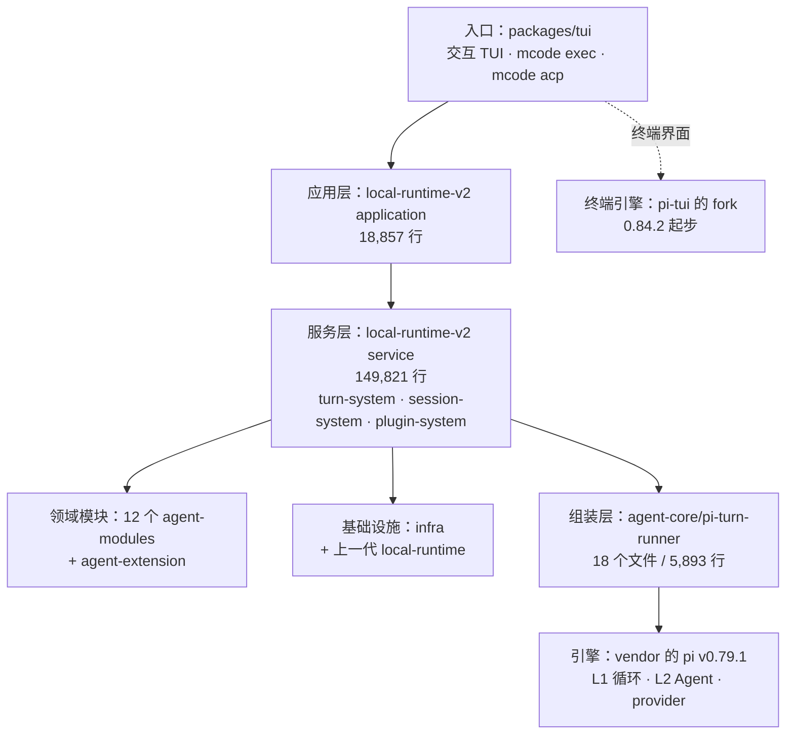
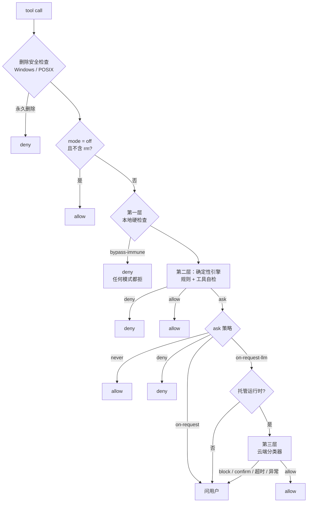
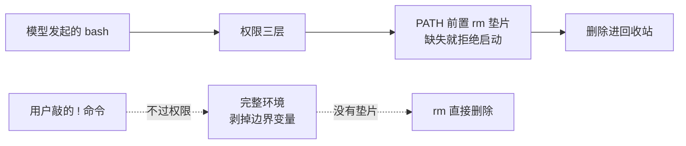
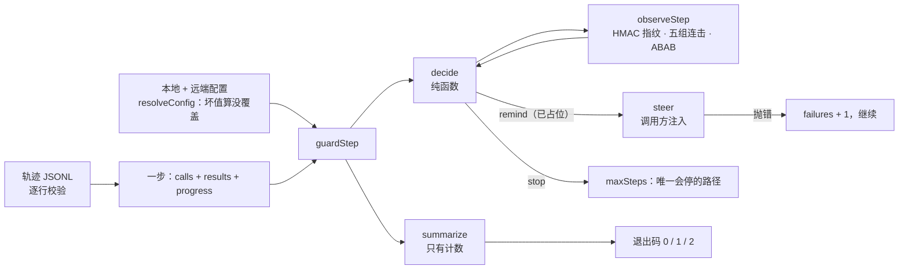

# 第 32 章 MiniMax：minimax-code

> 基准：pi `b79e4cc8` (v0.84.4)　·　minimax-code `89c930a2` (0.5.0)　·　[版本表](../../research/BASELINE.md)　·　[参与指南](../../CONTRIBUTING.md)

**状态**：✅ 已完成

## 本章回答

- minimax-code 用了 pi 的哪几层、改了多少，为什么说它把 pi 当成一个库而不是一个框架
- 它往 pi 的循环里开了哪四个接缝，每个接缝是为了解决什么问题
- pi 明确不做的六件事，它各用什么补上；权限为什么是三层，云端那一层为什么永远不拒绝
- 它反复做的同一个选择：能写成机制的，不写成提示
- 它的代价为什么集中在一类地方——策略写好了，默认没开，或者只在一条路径上开
- 它的防跑飞守卫只提醒、不拦，怎么用 700 多行自己写一个，并让测试抓得住坏版本

## 素材来源

- [`research/minimax-code/`](../../research/minimax-code/README.md) 全部 9 章（本章每个结论都能回溯到其中的 `file:line`）
- 对照底稿：[`research/pi/`](../../research/pi/README.md)
- 源码：开源仓库 `minimax-code`，commit `89c930a2`（2026-09；自有代码 MIT，vendor 进来的部分各带各的许可，见 `LICENSE-STATUS.md`）
- 配套代码：[`examples/ch32-runaway-guard/`](../../examples/ch32-runaway-guard/)

本章沿用全书的四种证据标注：【代码事实】是在基准 commit 上能按行号复查的；【文档】是 README 或仓库内文档的原话；【实机】是我在本机真跑出来的结果；【推断】是从前三者推出来、源码没有直接写明的判断。只引用开源仓库里的内容；内部构建里有什么，本章不知道，也不猜。

---

上一章的 Step-Code 回答了一个问题：只用 pi 的扩展 API，能不能撑起一个产品的策略层？答案是能，而且能做得很完整；它没补上的地方，几乎都是扩展 API 够不着的地方。

minimax-code 是另一个方向的答案。它是 MiniMax 的终端编码 agent，命令叫 `mcode`。它也基于 pi，但它没有走扩展 API 那条路：pi 的会话层和扩展系统，产品路径上一个都没用；vendor 进来的终端界面也没接上，终端用的是另一份 fork。它把 pi 的循环和 provider 适配器 vendor 进仓库，压在调用链的最底下，上面自己写了五十多万行运行时——会话、队列、压缩、权限、多 agent、遥测，全是自己的。

这是第六部分的第二章。和上一章一样，本章只记录**它选了什么、代价是什么**，不打分。

先看几个数字：

| 数字 | 是什么 | 出处 |
| --- | --- | --- |
| 556,959 | 自有代码行数（`.ts/.tsx`，不含测试与 `.d.ts`）；vendor 的 pi 四个包是 102,623 行，前者是后者的 5.4 倍 | [`research/minimax-code/README.md`](../../research/minimax-code/README.md) 的统一口径 |
| 216 / 61,348 | vendor 的 pi 里，与 pi v0.79.1 字节相同的文件数 / 行数 | [§2.2](../../research/minimax-code/02-architecture-and-guardrails.md#22-vendor-的-pi改了多少) |
| +194 / −24 | pi 的 `agent` 包被改动的行数，全部是给宿主开的接缝 | `third_party/pi-mono/packages/agent/src/` |
| 38 → 1 | 补丁台账的条目数 → 到过上游的条目数 | `third_party/pi-mono/MINIMAX_CHANGES.md` |
| 0 | 产品路径上对 pi 的会话层 `AgentSession` 和扩展系统的引用 | [§2.1](../../research/minimax-code/02-architecture-and-guardrails.md#21-包结构pi-沉到最底下) |
| 6 / 6 | pi 的「No X」清单被补上的项数 | 32.2 节 |
| 14 / 156 / 425 | `pnpm verify` 的闸门数 / 进了闸门的测试文件数 / 测试文件总数 | [§2.3](../../research/minimax-code/02-architecture-and-guardrails.md#23-守卫一条-pnpm-verify14-道门) |
| 3 → 0 | 遥测上传通道数 → 默认打开的通道数 | `config/src/config.ts:1773` |
| 0 | 交互模式的步数上限 | 32.4 节 |
| 2 / 2 | 仓库里的 pi 副本数（引擎 v0.79.1、终端引擎 0.84.2+）/ 并存的运行时代数 | 32.1 节 |

除特别说明，本章的路径都相对 minimax-code 的 `packages/`；`third_party/`、`docs/`、`README.md` 相对仓库根。

## 32.1 与 pi 的 diff 概览

### 历史没带过来

【代码事实】公开仓库有 69 个提交。CLI 的源码在提交 `c59cf53`（2026-09-18）一次导入，4,168 个文件；在那之前的演化不可见。仓库里另有两份清单说明了它的来历：`release/public-source.json` 列出每一个发布出来的文件，`release/extraction.json` 钉住了内部共享源码的基线和 31 个包根。

【推断】这是一个内部 monorepo 的**公开投影**，不是在公开仓库里长出来的项目。这一点决定了本章所有 diff 的读法：「哪些改过」只能按内容比对，不能靠 `git log`；也决定了它的守卫为什么集中在「投影会出什么错」上（32.3 节判断四）。

### pi 沉到了最底下

【文档】`docs/architecture.md:3` 给的调用链是：

```text
TUI / exec / ACP → CliService → local Applications → Session / Turn / Agent services → Pi / model providers / local tools
```

pi 在最后一格。按包展开：



*图 32-1 minimax-code 的分层。pi 只在两处出现：最底下的引擎，和旁边的终端引擎 fork*

【代码事实】pi 进入调用链只有一个口子，组装层的头注释把它的职责写得很清楚：

```
// agent-core/src/pi-turn-runner/index.ts：注入 + 组装，循环本身在 pi 里
/**
 * `@mavis/agent-core/pi-turn-runner` — assemble pi-coding-agent for a
 * Mavis session and bridge its event stream into canonical
 * `RuntimeEvent`s.
 *
 * This module is the "injection + assembly" layer. It does not implement
 * `runAgentLoop()` itself (that ships in `@earendil-works/pi-agent-core`);
 * it wires the pi runtime to explicit per-turn model / event writer /
 * tool contracts supplied by runtime adapters.
 *
 * Runtime adapters such as local-runtime and cloud-runtime construct a
 * {@link PiTurnRunner} with process-level wiring and call
 * {@link PiTurnRunner.runTurn} for each LLM turn, supplying the resolved
 * model, event writer and runtime tools as part of {@link RunTurnInput}.
```


循环（`runAgentLoop`）是 pi 的，模型、事件写入器、工具都由上层按轮注入。按引用数数，产品代码从 vendor 的 pi 里拿了这些：

| pi 的包 | 引用它的文件数 | 拿了什么 |
| --- | ---: | --- |
| `agent` | 86 | L1 循环、L2 `Agent`、消息类型 |
| `ai` | 56 | provider 适配器、模型类型 |
| `coding-agent` | 19 | 零件：`convertToLlm`、`AuthStorage`、`DEFAULT_COMPACTION_SETTINGS`、`createLocalBashOperations`、`createBashTool`、`calculateContextTokens`、`resizeImage`、`getShellConfig` 等 |
| `tui`（vendor 的那份） | 0 | — |

*表 32-1 产品代码从 vendor 的 pi 里拿了什么。`coding-agent` 只拿零件，`AgentSession`、`SessionManager` 和扩展系统一次都没 import*

这和 Step-Code 正好相反。Step-Code 把整个 `AgentSession` 和扩展系统都留着，产品层是四个内联扩展工厂；minimax-code 把这些都留在了 `third_party/` 里，没有接上。

### vendor 了什么、改了多少

【代码事实】`third_party/pi-mono/.minimax-vendor.json` 记着来源：tag `v0.79.1`、commit `28df940f`、2026-06-16 导入、策略 `source-vendor`。和 v0.79.1 按文件比对：

| 包 | 同路径 | 字节相同 | 改过 | 只在 minimax |
| --- | ---: | ---: | ---: | ---: |
| `agent` | 25 | 22 | 3 | 0 |
| `ai` | 54 | 31 | 23 | 1 |
| `coding-agent` | 155 | 138 | 17 | 1 |
| `tui` | 27 | 25 | 2 | 0 |

*表 32-2 vendor 的四个包与 pi v0.79.1 的差异。字节相同的合计 216 个文件、61,348 行*

`ai` 的 23 个改动大多是 provider 兼容。真正值得看的是 `agent` 那 3 个文件：`agent-loop.ts` 从 742 行到 877 行（+153 / −18），`agent.ts` +26 / −4，`types.ts` 418 → 431 行。合计 +194 / −24，全部是给宿主开的**接缝**：

| 接缝 | 位置 | 宿主拿它做什么 |
| --- | --- | --- |
| `shouldStopAfterSteering` | `agent-loop.ts:254-257` | 插件的 `UserPromptSubmit` hook 拦下一条插话时，让这一轮停下 |
| `terminateAgent` | `types.ts:59,84`；`agent-loop.ts:452-474`（串行）、`:513-530`（并行） | hook 要求终止时，给没执行的 tool call 补错误结果，再停 |
| `onToolExecutionStart` | `agent-loop.ts:762-767` | 审批之后、执行之前的一个时点，用于计时和遥测 |
| `steerBatch` | `agent.ts:283-286` | 插话队列从 `AgentMessage[]` 变成 `AgentMessage[][]`，一批插话一起进 |

*表 32-3 往 pi 的 L1 循环里开的四个接缝。另加一个 `"max"` 思考级别（`types.ts:297`）*

第二个接缝最能说明它在意什么。pi 自己的扩展 API 没有「从循环外面让它停下，并且停得干净」这个能力；minimax 改了循环：

```
// third_party/pi-mono/packages/agent/src/agent-loop.ts：被叫停时，剩下的 tool call 每个都补一条错误结果
		if (finalized.terminateAgent === true || signal?.aborted) {
			for (const skippedToolCall of toolCalls.slice(toolIndex + 1)) {
				await emit({
					type: "tool_execution_start",
					toolCallId: skippedToolCall.id,
					toolName: skippedToolCall.name,
					args: skippedToolCall.arguments,
				});
				const skipped = {
					toolCall: skippedToolCall,
					result: createErrorToolResult(
						finalized.terminateAgent === true
							? "Tool execution skipped because the agent was stopped by a hook"
							: "Tool execution skipped because the operation was aborted",
					),
					isError: true,
				} satisfies FinalizedToolCallOutcome;
				await emitToolExecutionEnd(skipped, emit);
				const skippedMessage = createToolResultMessage(skipped);
				await emitToolResultMessage(skippedMessage, emit);
				finalizedCalls.push(skipped);
				messages.push(skippedMessage);
			}
			break;
		}
```


被跳过的调用照样发 `tool_execution_start` / `end` 事件，照样生成一条 `toolResult` 消息推进 `messages`。于是**持久历史本身是成对的**：每个 tool call 都有一个结果，哪怕结果是「被 hook 叫停了」。32.3 节判断四再讲它为什么重要。

### 第二份 pi，和第二代运行时

仓库里不止一份 pi。【代码事实】终端界面用的是另一份：`tui/src/tui/engine/` 是 pi-tui 的 fork，起点是 0.84.2（`836aee6d`，2026-08-18 导入），后来又按 0.84.4 拉了 L017–L021 几条。`BASELINE.json` 记着 39 个文件的基线，`LOCAL_CHANGES.md` 有 28 行改动记录（L001–L030）。【文档】`AGENTS.md:3` 规定上游的改动用三方合并拉进来，并要求「Prefer changing content over changing layout」——改内容，别改布局，为的是下次还能合得进去。

于是同一个产品里有两份版本相距 5 个小版本的 pi：引擎停在 v0.79.1，终端引擎在 0.84.2 之后。【推断】两边的跟随节奏不一样：终端引擎是「独立 fork + 逐条记账 + 三方合并」，引擎是「整包 vendor + 补丁台账」。32.4 节会看到，引擎这一份的落后已经有了具体的后果。

【代码事实】运行时也有两代。当前的 `local-runtime-v2` 有 871 个文件、195,133 行；上一代 `local-runtime` 598 个文件、138,172 行，仍被 13 个 v2 文件 import。权限 facade（1,410 行）、rm 垫片、SQLite 存储、错误上报，都还在 v1 里。

## 32.2 它补了哪些策略层

### 六个「No X」逐条对上

| pi 的「No X」 | minimax-code | 位置 |
| --- | --- | --- |
| No MCP | `agent-modules/mcp`，stdio 与 http 两种传输 | `agent-modules/mcp/src/runtime/` |
| No sub-agents | `task` 工具 + explore / worker / verifier 三个角色 + 通用代理 `mavis` | `shared/src/subagent-roles.ts:1-40` |
| No permission popups | Ask / Auto / Full access 三档，Alt+M 切换，默认 Auto | `config/src/config.ts:1709` |
| No plan mode | Shift+Tab 进入 | `README.md:146`；`local-runtime-v2/src/service/plan/` |
| No built-in to-dos | `todowrite` | `agent-tools/src/desktop/builtin-defs.ts:240` |
| No background bash | 后台 bash + `task_query` / `task_output` / `task_stop` | `local-runtime-v2/src/service/background-bash/` |

*表 32-4 pi 明确不做的六件事，minimax-code 全部补上*

清单之外还有：长任务目标 `/goal`（6 种状态，带会真停的断路器）、定时任务 cron、三层记忆、插件、可选沙箱、删除走回收站的 rm 垫片、凭据租约（工具子进程只拿短期 token）。另外 pi 的 rpc 模式被 ACP 取代。

和 Step-Code 的区别不在「补没补」，在「补在哪」：Step-Code 的六项都挂在 pi 的扩展事件上；minimax-code 的六项都在自己的服务层里，pi 的循环只负责「调模型、跑工具、回结果」。

### 权限：四种模式映射到三种策略

【代码事实】UI 上的模式在 `agent-modules/permission/src/ask-policy.ts:17-54` 被翻译成内部策略，翻译只做一次，之后的流程不再看 UI 模式：

| UI 模式 | 内部策略 | 含义 |
| --- | --- | --- |
| `default` / `acceptEdits` | `on-request` | Ask：规则没判定的都问用户 |
| `auto`（默认） | `on-request-llm` | Smart approval：先问云端分类器 |
| `bypassPermissions` / `off` | `never` | Always allow |
| `dontAsk` | `deny` | 没有预先授权就拒绝 |

*表 32-5 权限模式的映射。`ask-policy.ts` 的注释管 `auto` 叫「cloud LLM in the loop」*

一次工具调用要过的完整路径在 `local-runtime/src/permissions/facade.ts:536-900`：



*图 32-2 一次工具调用的权限判定。注意最下面一行：云端分类器没有通向 deny 的边*

**云端只能放行或退回。** 【代码事实】分类器只在托管运行时（登录了 MiniMax 账号）下调用（`agent-modules/permission/src/classifier/cloud-classify-client.ts:61-63`），超时 60 秒（`:419`）。它的结论被映射回本地判定时：

```
// local-runtime/src/permissions/facade.ts：分类器的三种结论，只有 allow 映射成 allow
    switch (gatewayVerdict.kind) {
      case 'allow':
        return mapClassifierRecommendation(
          decision,
          'allow',
          formatAutoClassifierReason('allow', gatewayVerdict.reasonLocalized, localeHint),
          policyOwner,
        );
      case 'block':
        return mapClassifierRecommendation(
          decision,
          'ask',
          formatAutoClassifierReason('block', gatewayVerdict.reasonLocalized, localeHint),
          policyOwner,
        );
      case 'confirm':
        return mapClassifierRecommendation(
          decision,
          'ask',
          formatAutoClassifierReason('confirm', gatewayVerdict.reasonLocalized, localeHint),
          policyOwner,
        );
```


`block` 和 `confirm` 都映射成 `ask`；紧接着的 `:882-899` 把超时和其他情况也映射成 `ask`。【推断】云端能做的只有一件事：让用户少被问一次。它不能替用户拒绝，也不能越过本地的硬检查和确定性引擎放行——那两层在它之前就已经判完了。

分类器收到什么？【代码事实】工具名；`bash` 的完整命令（文件工具只发路径，`cloud-classify-client.ts:1367-1380`）；平台、家目录、工作区、agent 名、会话 ID；以及最近 3 条用户消息加最近 5 条消息，用户消息首尾各留 250 字符、其他消息截到 200 字符。32.4 节会回到这里。

### 删除：一个执行层的承诺

minimax-code 对用户做了一个很强的承诺：agent 删掉的东西都能从回收站找回来。它没有用改写命令文本的方式兑现，而是用 PATH。【代码事实】垫片文件的头注释讲了为什么：

```
// local-runtime/src/infra/ensure-rm-shim.ts：为什么用垫片，而不是更多的命令改写
/**
 * Seed the recoverable-delete `rm` shim into `<dataDir>/shims/`.
 *
 * WHY A SHIM INSTEAD OF MORE COMMAND REWRITING
 * --------------------------------------------
 * "Every delete is recoverable" is an EXECUTION-layer promise. Rewriting
 * command text can only honour it for shapes a parser recognises, and that set
 * is never complete: `xargs rm`, `find … -exec rm {} \;`, or an `rm` inside a
 * shell script the agent just wrote all slip through, because the literal token
 * `rm` never appears where a rewriter can reach it.
 *
 * PATH resolution has no such blind spot. Whatever invokes `rm` — the agent
 * directly, `xargs`, `find`, or a nested script — the shell resolves the name
 * through PATH, so a shim at the front of PATH is reached in every case. The
 * permission layer therefore stays a pure judgement (allow / deny / ask) and the
 * sandbox stays a pure kernel-level interceptor; neither needs to know that
 * deletes are recoverable at all.
```


改写命令只能覆盖解析器认得出的写法：`xargs rm`、`find … -exec rm {} \;`、agent 刚写的脚本里的 `rm`，`rm` 这个词都不出现在改写器够得着的地方。而 shell 找 `rm` 总要查 PATH，把垫片放在 PATH 最前面，哪种写法都绕不开。

承诺要兑现，还得处理「垫片不在」的情况：

```
// local-runtime/src/infra/ensure-rm-shim.ts：垫片缺失就修，修不好就拒绝启动 bash
export function resolveAgentBashEnvPolicy(
  dataDir?: string,
  platform: NodeJS.Platform = process.platform,
): BashEnvPolicy {
  if (!dataDir || platform === 'win32') return resolveBashEnvPolicy({});
  const shimDir = resolveRmShimDir(dataDir);
  const shimPath = path.join(shimDir, 'rm');
  return resolveBashEnvPolicy({
    prependPath: [shimDir],
    spawnPreflight: () => {
      try {
        accessSync(shimPath, constants.X_OK);
        return;
      } catch {
        // Missing or not executable — attempt the in-place repair below.
      }
      try {
        ensureRmShim(dataDir, platform);
        accessSync(shimPath, constants.X_OK);
      } catch (cause) {
        throw new Error(
          `The recoverable-delete rm shim at ${shimPath} is missing or not executable and could not be re-seeded. ` +
            'Refusing to start bash, because deletes would bypass the trash and become unrecoverable. ' +
            'Check that the MiniMax Code data directory is writable, then restart the app to re-seed the shim.',
          { cause },
        );
      }
    },
  });
}
```


每次起 bash 之前检查垫片可执行；不行就原地重建；还不行就抛错，错误信息是「Refusing to start bash, because deletes would bypass the trash and become unrecoverable」。**失败关闭**：宁可这次 bash 起不来，也不让删除悄悄变成不可恢复。

垫片管不到的写法——`/bin/rm`、`\rm`、`busybox rm`、`command rm`、`env rm`、`rmdir`、`unlink`、`find -delete`——在权限层单独拦（`agent-modules/permission/src/classifier/dangerous-patterns.ts:1128-1145`）。Windows 没有 PATH 垫片，删除类命令走另一条硬规则。

最能说明这条承诺分量的，是 bypass 模式下它怎么处理：

```
// agent-modules/permission/src/tools/bash-permission.ts：bypass 下的 rm 照样放行，但走的是会被垫片接住的那条路
  // by step 3 hard-final-deny above, so by here only non-catastrophic rm
  // reaches us and is safe to rewrite.
  if (mode === 'bypass') {
    if (recoverableWindowsDelete) {
      return logLayer('recoverable-delete-rewrite', {
        verdict: 'allow',
        reason: { type: 'recoverableDeleteRewrite', targets: recoverableWindowsDelete.targets },
      });
    }
    if (isRmCommand(command)) {
      return logLayer('rm-rewrite', {
        verdict: 'allow',
        reason: { type: 'rmRewrite', rewrittenCommand: command },
      });
```


注释说灾难性的写法在前面第 3 步就被最终拒绝了，到这里的 `rm` 只剩普通的，可以放行——放行之后执行的那个 `rm` 是垫片。【推断】bypass 放松的是**确认**，不是**可恢复**。用户说「别问我」，没有说「删了就找不回来也行」。

### 没人可问的时候

【代码事实】headless（`mcode exec`）的 `--permission` 只接受 `smart`、`full`、`off`，`ask` 被直接拒绝（`tui/src/headless/invocation.ts:113-123`）；运行中真走到要问用户的那一步，返回 `INTERACTION_NOT_AVAILABLE`。【推断】BYOK 用户没有托管运行时，`smart` 走不到分类器，「要问用户」的调用一律失败——效果上接近 `dontAsk`。这和 Step-Code 的「无人值守时拒绝」是同一个方向。

### 其余几项，各一句话

- **沙箱**：写好了，默认关（`config/src/sandbox-settings.ts:13-16` 返回 `{ enabled: false, filesystemMode: 'full_access' }`），后端只有 macOS 一种；底层是 Anthropic sandbox-runtime v0.0.74 的 fork。
- **子进程环境**：分两层净化。Layer A 总开，剥掉运行时自己的边界变量；Layer B 剥凭据，只在 `CI` 或 `GITHUB_ACTIONS` 为真时打开（`agent-core/src/bash-subprocess-env.ts:166-188`）。
- **Plan 模式**：唯一可写的是计划文件，但不管 `bash`（`local-runtime-v2/src/service/plan/tool-guard.ts:33-60`）。
- **子任务**：深度 1，子 agent 拿不到 `task`；委派不提权；前台 `task` 是串行的，并行只能走后台。
- **插件 hook**：11 个事件，兼容自己、Claude Code、Codex 三种插件格式；环境是 17 个变量的白名单。
- **遥测**：三个通道全部默认关，各自 opt-in，发之前能 `preview`。
- **用户的 `!` 命令**：不过权限、不过 rm 垫片（32.4 节）。

## 32.3 它自己的判断

六个判断。前四个是结构上的，后两个是它对「往外发什么」「什么时候停」的立场。

### 判断一：pi 是一个库，不是一个框架

【代码事实】组装层每一轮新建一个 pi `Agent`，只执行这一轮（`agent-core/src/pi-turn-runner/agent.ts:33-91`），工具并行执行（`toolExecution: 'parallel'`），pi 的 `convertToLlm` 被换成自己的 `projectAgentMessagesForModel`。会话、历史、插话队列、压缩，全在 pi 外面。

这让它拿到了 pi 的扩展 API 够不着的控制点：表 32-3 那四个接缝、下面判断二的「每次请求前的准入」、判断四的「请求视图与持久历史分离」。代价也直接：pi 在会话层做的事——重试、压缩、溢出恢复——它全部要自己重写一遍。重写的结果有好有坏。【代码事实】重试比 pi 更克制：最多 5 次、基础退避 1 秒、单次上限 30 秒，外加一个 pi 没有的**总耗时上限** 120 秒（`agent-core/src/pi-turn-runner/llm-retry.ts:43-48`）；pi v0.79.1 的会话层是 3 次、基础 2 秒，没有总耗时上限。但 pi 会话层那道「provider 报超长后压缩一次再重试」（`_overflowRecoveryAttempted`），它没有重写（见判断二）。

【推断】这是和 Step-Code 相反的一极。Step-Code 证明了 pi 的扩展 API 撑得起产品策略层；minimax-code 选择不用它，自己写了五十多万行。两者都对：要什么样的控制点，决定了要付多少行。

### 判断二：放得下才算完成

pi 的压缩触发是一个减法：`上下文 > 窗口 − 16,384`。【代码事实】minimax-code 换成了两条线（`agent-modules/context-manager/src/provider-budget.ts:17-42`）：

```text
请求上限 = min(0.95 × 窗口,  窗口 − 16,384,  窗口 − 输出预算 − 2,048)
触发线   = min(请求上限,  窗口 − min(32,768, 窗口 / 4))
```

请求上限是**发出去的请求不能超过**的线；触发线是**开始压缩**的线，比前者再提前最多 32K。输出预算进了公式，于是输出预算越大，触发越早。【实机】把这个文件复制到 `/tmp` 直接调用（窗口与输出预算是我选的样例值）：

| 窗口 | 输出预算 | 请求上限 | 触发线 | 触发线占比 | pi 的触发线占比 |
| ---: | ---: | ---: | ---: | ---: | ---: |
| 128,000 | 16,384 | 109,568 | 96,000 | 75.0% | 87.2% |
| 200,000 | 8,192 | 183,616 | 167,232 | 83.6% | 91.8% |
| 204,800 | 131,072 | 71,680 | 71,680 | 35.0% | 92.0% |
| 1,000,000 | 131,072 | 866,880 | 866,880 | 86.7% | 98.4% |

*表 32-6 两种触发线的对比。第三行：128K 的输出预算把触发点压到了窗口的 35%*

真正贯穿全仓的，是请求上限的用法：**任何往请求里加东西的路径，都要证明加完还放得下**。

| 路径 | 判据 | 位置 |
| --- | --- | --- |
| 压缩生成的 checkpoint | `fitsFinalRequest()`，不过就抛 `POST_ADMISSION_FAILED` | `local-runtime-v2/src/service/turn-system/compaction/algorithm/compact-context.ts:118-153,615-621` |
| system-reminder 注入前 | `fitsReminderInFinalRequest()`，不过就这次不提醒 | `local-runtime-v2/src/service/turn-system/execution/reminder/reminder-admission.ts:8-26` |
| 工具输出外置 | 本轮有 `read` 工具才替换成引用，否则保留原文 | `tool-output-budget.ts:60-62` |
| 工具结果归档 | 没有 `read` 就只能删，回执写明原文不可用 | `automatic-context-compactor.ts:329-331` |

*表 32-7 四条往请求里加东西的路径，都有准入*

第一行最值得注意：压缩本身也要过准入。一次压缩生成的摘要如果放不下，不算压缩成功。后两行是同一种诚实：把原文换成引用之前，先确认模型有办法把引用读回来。

【代码事实】它不用 pi 的「字符数除以 4」估 token，改用 `o200k_base` BPE（`agent-modules/context-manager/src/token-estimator.ts:1-45`），头注释的理由是 chars/4「severely under-counts CJK text」——中文少算 4 到 8 倍，会把触发线推到 provider 已经拒绝的位置之后。

代价在事后那一侧：全押在事前准入，没有 pi 会话层那种「provider 报超长后压缩一次再重试」。估得准的时候不需要它；估错的时候，这一轮就失败了。

### 判断三：机制优先于提示

32.2 节的删除是最完整的一例，但它不是孤例：

| 场景 | 可以只写在提示里的 | 实际写成的机制 |
| --- | --- | --- |
| 删除可恢复 | bash 描述里写「请用 `rm`」 | PATH 垫片；垫片缺失就拒绝启动 bash（`ensure-rm-shim.ts:82-110`） |
| bypass 下的删除 | — | 放松确认，不放松可恢复（`bash-permission.ts:1218-1289`） |
| 子任务不递归 | 合同里写「Do not delegate」 | 工具层直接去掉 `task` / `task_append`（`local-turn-tool-catalog.ts:308`） |
| 插件 hook 的放行 | — | allow 只能免掉「规则没命中」的兜底询问，免不掉安全询问和 deny（`facade.ts:1289-1302`） |
| 遥测授权 | — | 配置读不出来按「没授权」（`config/src/telemetry-policy.ts`） |

*表 32-8 同一个选择出现了五次：不靠模型听话*

第四行值得多说一句。插件是用户自己装的，hook 返回 allow 很容易被当成「用户授权了」。【代码事实】minimax-code 把 hook 的 allow 限定在三种「普通 ask」上：工作区边界、规则没命中、所有子命令都是普通 ask 且没有 deny（`facade.ts:1289-1302`）。一个插件说 `rm -rf /` 可以，没有用。

反例也在这张表的同一个维度上：explore 角色的「只读」、Plan 模式的「只写计划文件」，默认配置下都只是提示（32.4 节）。

### 判断四：持久历史本身是成对的

pi v0.79.1 在 abort 时直接 `break`（`agent-loop.ts:440-442`），剩下的 tool call 在历史里没有结果；下次发请求时，`ai/src/providers/transform-messages.ts:155-168` 临时补一条「No result provided」——补在**请求视图**里，不进历史，也没有事件。

minimax-code 改成了 32.1 节看到的那样：停下时就给每个没执行的调用补一条错误结果，发事件、进历史。【代码事实】并行模式下还要处理「已经准备好、还没开跑」的调用，为此 v0.79.1 里「一个返回 Promise 的闭包」被换成了可判别的 `{ kind: "prepared-entry", preparation }`（`agent-loop.ts:613-621`），收尾时才分得清哪些没执行（`:623-660`）。

和它配套的是组装层的两份消息：【代码事实】`pi-turn-runner/hooks.ts:29-32` 里 `messages` 是本次请求视图，`canonicalMessages` 是持久历史。hook 可以只为这一次请求裁剪、注入，不碰写进会话的那一份。

【推断】两件事合起来是一条规则：**持久历史要自己成立，不依赖请求时的修补**。Step-Code 的「改请求，不改记录」（第 31 章判断三）是它的另一半：请求可以随便投影，记录必须完整。会话要被恢复、被导出、被另一个模型接着跑的时候，就看出差别了。

### 判断五：默认什么都不发

【代码事实】三个上传通道——usage、metrics、diagnostics——默认值全是 `false`（`config/src/config.ts:1773`）。判定只有一个函数 `isTelemetryChannelEnabled()`（`config/src/telemetry-policy.ts`），注释是：

> True only when the channel is explicitly opted in and no global opt-out is set. An unreadable config never authorizes an upload.

全局关闭的环境变量（`MCODE_DISABLE_TELEMETRY`、`DO_NOT_TRACK`）优先于任何配置；配置读不出来按「没授权」处理。`mcode telemetry preview` 构造一个样例请求打印出来，永不发送。

三个通道各有各的克制：

| 通道 | 打开之后 | 位置 |
| --- | --- | --- |
| usage | 每个事件生成一个新的随机 ID，事件之间在协议层面连不起来；属性按白名单挑，字段全是枚举 | `tui/src/analytics/business-telemetry.ts:221-224` |
| metrics | 还要求是托管运行时；BYOK 用户 opt-in 了也不发，noop 的原因写进本地日志 | `local-runtime/src/runtime/host-metrics.ts:107-137` |
| diagnostics | 唯一绑账号的通道；发送前再查一次开关；登录不全整批丢；超大事件丢弃而不是截断 | `local-runtime/src/error-reporting/reporter.ts` |

*表 32-9 三个通道，默认全关，各自 opt-in*

usage 那一行是「满足格式、不满足追踪」：接收方的信封要求一个用户标识字段，它填了，但每个事件换一个。diagnostics 那一行的「丢弃不截断」也有讲究：截断的错误日志可能恰好在一个 token 中间断开，留下半个凭据。

【代码事实】用户反馈也是同一个思路：附带的诊断是 `diagnostic-counts-v1`，`tui/src/runtime/feedback/diagnostic-summary.ts:1-3` 的头注释写着「Diagnostics are summaries, never reversible copies of user content」。崩溃记录升级到 schema 2 时，旧格式不转换、直接删，注释是「Version 1 records contain arbitrary private text and must never be replayed」。

这一节说的是三个开关**管得住的**流量。管不住的那一条在 32.4 节。

### 判断六：只提醒，不拦

pi 没有任何防死循环（pi 研究第 9 章 S5）。minimax-code 写了一个 runaway-guard，但它的目标不是拦住，而是**提醒一次**。

【代码事实】它分三层：领域模块 `agent-modules/runaway-guard/src/`（9 个文件、1,438 行）只做检测和文案，`guard.ts:19-22` 写明「No Agent, lifecycle registration, host IO, Memory writes, or persistence belongs to this module.」；适配器 `agent-extension/src/runaway-guard.ts` 挂到每一步结束；宿主 `local-runtime-v2/src/service/turn-system/runaway-guard/` 读配置、给工具策略。

检测的是六种「连击」（`signals.ts:19-70`）：

| 信号 | 含义 | 能触发提醒？ |
| --- | --- | --- |
| `exact_action_repeat` | 参数完全相同的工具调用连续出现 | ✅ |
| `polling_repeat` | 读同一个后台任务，状态和游标都没变 | ✅ |
| `exact_result_repeat` | 结果完全相同 | 只观测 |
| `same_error_family` | 同一类错误连续出现（超时、限流、网络、鉴权……） | ✅ |
| `unchanged_progress_repeat` | 宿主报告的「已验证进度」对同一目标没有变化 | ✅ |
| ABAB | 两个动作交替出现 | 只观测 |

*表 32-10 runaway-guard 的信号。两种只记不提醒*

指纹不存原文：用每一轮新生成的 32 字节密钥算 HMAC-SHA256（`state.ts:101`）。阈值默认 3，也只能配到 3 以上（`guard.ts:28-31`）；从第 2 次开始记观测。宿主把 `bash` / `grep` 一类归为「搜索没找到算预期结果，不算错误」（`local-runtime-v2/src/service/turn-system/runaway-guard/tool-policy.ts:7-32`）。

几个信号同时越线时，挑哪一个、挑几次：

```
// agent-modules/runaway-guard/src/reminder.ts：优先级，和先占位
const REMINDER_CANDIDATE_PRIORITY: readonly RunawayGuardReminderSignalKind[] = [
  'unchanged_progress_repeat',
  'same_error_family',
  'exact_action_repeat',
  'polling_repeat',
];

export function takePreferredReminder(
  candidates: ReminderCandidates,
  ctx: RunawayGuardRunIdentity,
  state: ShadowState,
  afterOccurrences: number,
): RunawayGuardReminder | undefined {
  for (const signalKind of REMINDER_CANDIDATE_PRIORITY) {
    if (!candidates.has(signalKind)) continue;
    const content = reminderContent(signalKind, afterOccurrences);
    if (!content || state.reminderAttempted) return undefined;
    // Reserve before the adapter calls steer: a failed attempt must not retry.
    state.reminderAttempted = true;
```


无进展 > 同类错误 > 重复动作 > 轮询。最要紧的是最后两行：**在调用 steer 之前就占位**。反过来写——先 steer、成功了再记——steer 抛一次错，下一步又越线，就会再试一次，「一轮一次」的承诺在失败路径上破掉。

提醒文案都以同一类话收尾（`reminder.ts:59,68`）：这是只对本轮有效的运行时提醒，不是用户偏好或持久规则，不要把它存进 Memory、Skills 或其他持久指令文件。【推断】这句话针对的是一个只有「有记忆的 agent」才有的问题：模型把一次纠偏当成用户偏好记下来，以后每次都照做。

开关可以远端下发：

```
// config/src/runaway-guard-config.ts：远端的值坏了，算没覆盖
/** Missing/invalid remote values mean no override, not enabled=true. */
export function parseRunawayGuardOverride(raw: unknown): RunawayGuardOverride {
  if (typeof raw !== 'object' || raw === null || Array.isArray(raw)) return {};
  const enabled = (raw as Record<string, unknown>).enabled;
  return typeof enabled === 'boolean' ? { enabled } : {};
}

export function resolveRunawayGuardConfig(local: unknown, remote?: unknown): RunawayGuardSettings {
  return {
    enabled:
      parseRunawayGuardOverride(remote).enabled ?? parseRunawayGuardOverride(local).enabled ?? true,
  };
}
```


远端优先于本地，两边都没说就默认开。关键在第一行注释：远端给了一个坏值（字符串 `"yes"`、数字 `1`），**不算开，算没覆盖**。【推断】远端配置是运维在别处改的，改错的概率不低；把「看不懂」解释成「没说」，比解释成任何一个具体的值都安全。

适配器那一侧：

```
// agent-extension/src/runaway-guard.ts：每一步结束时，检测、steer、通知都包在一个 try 里
  const onStepEnd: StepEndHandler = (event, ctx) => {
    if (event.signal.aborted) {
      guard.clearDetectionStreaks(ctx);
      clearTrustedToolProvenance(trustedToolProvenanceByTurn, ctx);
      return;
    }
    if (!isEnabledBestEffort(options.isEnabled)) {
      guard.clearDetectionStreaks(ctx);
      clearTrustedToolProvenance(trustedToolProvenanceByTurn, ctx);
      return;
    }
    try {
      const reminder = guard.observe(
        ctx,
        {
          message: event.message,
          toolResults: event.toolResults,
          blockedToolCalls: event.blockedToolCalls,
          trustedToolProvenance: takeTrustedToolProvenance(trustedToolProvenanceByTurn, ctx),
          verifiedProgress: readVerifiedProgressBestEffort(
            options.readVerifiedProgress,
            ctx,
            event.message,
          ),
        },
        afterOccurrences !== undefined && shouldApplyReminder(options.shouldRemind, ctx),
      );
      if (!reminder) return;
      event.agent.steer({ role: 'user', content: reminder.content, timestamp: Date.now() });
      guard.markReminderInjected(ctx);
      notifyBestEffort(options.onReminder, reminder.observation);
    } catch {
      // Detection, host facts, steering and observers must all fail open.
    }
  };
```


中止了或者关掉了，清空连击，什么都不做。否则检测，有提醒就 `steer` 一条 user 消息进本轮。整个过程包在一个 `catch` 里，注释是「Detection, host facts, steering and observers must all fail open.」。函数注释（`:67`）把立场说全了：每轮最多 steer 一次，**从不拒绝工具，也从不中止一轮**。另外，goal 的验收轮不提醒（`local-runtime-v2/src/service/turn-system/runaway-guard/extension.ts:21`）——验收子 agent 本来就在重复检查。

【推断】这是一个刻意的分工：守卫是第二道防线，不能因为它自己出错让用户的一轮失败。代价是 32.4 节的 F7：它只提醒，交互模式下又没有别的东西会停。32.5 节的例子保留了这套设计，但改了三处。

## 32.4 代价与取舍

### 写好了，默认没开

pi 的问题多是「机制层没给策略」；Step-Code 是「给了策略，覆盖不全」。minimax-code 是第三种：**策略写好了，默认没开，或者只在一条路径上开**。先说性质：下面没有一条是「数据已经泄露」或「凭据已经提交」。

| # | 问题 | 位置 | 来自 pi？ |
| --- | --- | --- | --- |
| F1 | auto 模式（默认）把命令和近几轮对话发给云端分类器；这条流量不归三个遥测开关管 | `local-runtime/src/permissions/facade.ts:813-856,1248-1276`；`config/src/config.ts:1709` | 新增 |
| F2 | 沙箱默认关、只有 macOS 后端；explore 角色的「只读」因此在默认配置下不生效 | `config/src/sandbox-settings.ts:13-16`；`local-sandbox-service.ts:343-377` | 新增 |
| F3 | 凭据对模型执行的命令可见：环境净化的 Layer B 只在 CI 下开 | `agent-core/src/bash-subprocess-env.ts:166-188` | 继承，CI 下修了 |
| F4 | MCP stdio 子进程继承完整父环境 | `agent-modules/mcp/src/runtime/transport/stdio.ts:17-20,60-67` | 新增 |
| F5 | 用户的 `!` 命令不过权限、不过 rm 垫片 | `tui/src/host/bash-command.ts:17-20` | 继承 |
| F6 | 插件 hook 失败即放行：崩溃、超时、输出没法解析都当「没意见」 | `agent-modules/plugin-hooks/src/runner.ts:124,1442-1448` | 新增 |
| F7 | 交互模式没有步数上限；runaway-guard 只提醒一次 | `agent-extension/src/runaway-guard.ts:67,102-136` | 继承，部分修复 |
| F8 | 被截断的 tool call 不拦 | `third_party/pi-mono/packages/agent/src/agent-loop.ts` | 继承（vendor 版本早于修复） |
| F9 | TUI 面的内置工具不经过 local-turn 权限门 | `local-runtime-v2/…/policy/local-turn-permission-gate.ts:577-587` | 新增 |
| F10 | 诊断通道绑账号 | `docs/telemetry.md:90` | 新增 |
| F11 | 反馈的描述是原文，打码只按形状识别 | `tui/…/user-facing-failure.ts:48-67` | 新增 |
| F12 | 工作区边界是 ask 不是 deny；bypass 下可写工作区外 | `local-runtime/src/permissions/checkers.ts:832-847` | 新增 |
| F13 | 反弹 shell、编码绕过两类不在最终拒绝集合里 | `agent-modules/permission/src/classifier/dangerous-patterns.ts:190-202` | 新增 |
| F14 | 自更新允许生命周期脚本（限定产品包和 `better-sqlite3`） | `tui/src/update/install-source.ts:201-205` | 新增 |
| F15 | Plan 模式不管 `bash` | `local-runtime-v2/src/service/plan/tool-guard.ts:33-60` | 新增 |

*表 32-11 十五项发现。F1–F6 级别高，F7–F13 中，F14–F15 低。逐条论证见[研究底稿第 9 章](../../research/minimax-code/09-assessment-risks-recommendations.md)*

**为什么 F1 排在第一。** 它是唯一一条**默认开、离开本机、且不在遥测开关里**的数据流。默认权限模式是 `auto`；登录用户每一条「规则没判定」的命令，连同最近 3 条用户消息和最近 5 条消息（截断后），发给云端分类器。【文档】`docs/telemetry.md:3` 明说三个开关不覆盖「模型请求」——分类器请求在性质上更接近模型请求，但用户读遥测文档时未必这么理解。

它的另一面是 32.2 节那段代码：分类器永远不 deny。云端只能让用户少被问一次，不能替用户拒绝，也不能越过本地两层放行。【推断】这是一个清楚的交换：用一部分对话上下文离开本机，换少一些确认弹窗。交换本身可以接受，前提是用户知道——修法是在遥测文档里写明分类器发什么。

### 承诺的边界

minimax-code 做了两个强承诺：「agent 删掉的东西都能恢复」，和「explore 子 agent 不能改文件」（`shared/src/subagent-roles.ts:8-12`）。两个承诺，兑现都只在一条路径上。



*图 32-3 两条执行路径，只有一条兑现「删除可恢复」*

【代码事实】`tui/src/host/bash-command.ts:17-20`：`!` 用完整环境、剥掉运行时边界变量，没有 `prependPath`，不过权限；输出进 `<user-provided-context>`，上限 64K。【推断】从「用户自己敲的命令当然可信」的角度说得通——但用户在 agent 里习惯了删除可恢复，敲 `!rm` 时会有同样的预期。修法是一行：给 `!` 的执行也加上同一个 `prependPath`。

explore 那一个更隐蔽。【代码事实】explore 的描述说它只读；它的工具集里去掉了编辑类工具，但保留了 `bash`，`bash` 能不能写文件取决于沙箱——而沙箱默认关（`sandbox-settings.ts:13-16`）。于是默认配置下，「只读」只是写在描述里的一句话。修法有两种：沙箱关闭时把 `bash` 也从 explore 的工具里去掉；或者在描述里写明「沙箱关闭时不保证只读」。

### 三条子进程，三种口径

F3、F4 放到一起看：

| 子进程 | 环境怎么处理 | 能看到 API key？ |
| --- | --- | --- |
| 插件 hook | 17 个变量的白名单（`runner.ts:1771-1797`） | 否 |
| 模型的 `bash` | Layer A 总开；Layer B 只在 CI | 交互和本地 headless 能 |
| MCP stdio | `{ ...process.env, ...config.env, ...injected.env }` | 能 |

*表 32-12 同一个仓库里三条子进程路径，对凭据的暴露程度三个样*

同一个仓库里已经有最严格的写法（hook 的白名单），推广到另外两条是现成的。`bash` 的 Layer B 关闭是有意的，【代码事实】注释写着「CC parity」——和 Claude Code 的行为保持一致；但同一个文件头注释（`bash-subprocess-env.ts:17`）说的是「non-interactive 自动 scrub」，而本地 headless 也是 non-interactive，并不 scrub。MCP 那条没有类似说明；`stdio.ts` 的注释说宿主注入的值能覆盖「leaking from the parent process env」的旧值——作者知道父进程环境会漏，处理方式是覆盖，不是收窄。

### 跑飞了，谁来停

| 停止条件 | 位置 |
| --- | --- |
| 模型不再调工具 | pi L1 主循环 |
| 用户中止 | `agent-core/src/pi-turn-runner/agent.ts:111-113` |
| hook 要求终止（`terminateAgent`） | `agent-loop.ts:452,513` |
| 插件 `UserPromptSubmit` 判停 | `user-input-control.ts:73-80` |
| 插件 `Stop` hook 要求继续，最多 8 次 | `user-input-control.ts:25,297-300` |
| goal 的断路器：重复回复 3 次 / 判未达成 5 次 | `goal-config.ts:62-79` |
| headless `--max-steps`，退出码 7 | `tui/src/application/run-coordinator.ts:231-237`；`tui/src/headless/exit-policy.ts` |
| headless 超时，退出码 6 | 同上 |
| 交互模式的步数上限 | **没有** |

*表 32-13 什么时候停。最后一行是空的*

【代码事实】`--max-steps` 的判定在「下一条完成的助手消息到达时」做，先比较再加一（`run-coordinator.ts:231-237`）；测试 `tui/test/unit/run-coordinator.test.ts:225-237` 用 `maxSteps: 1`、两条助手消息，期望 `limit_exceeded` 且答案是第一条。【推断】第 N+1 次模型调用会发生，只是结果被丢弃——上限按「完成的步数」算，不按「发起的调用」算，多花一次调用的钱。

交互模式下，runaway-guard 提醒一次之后，没有任何东西会让它停下，除了用户按 Esc。【推断】交互模式有人看着，这个选择说得通；但「有人看着」在长任务里常常不成立——那正是 `/goal` 断路器存在的理由。修法是给交互模式也加一个会真停的上限，提醒留着做第一道。

F8 是另一种「停不下来」。【代码事实】pi 后来在 L1 里加了一道：`stopReason === "length"` 时，把这条消息里的所有 tool call 判失败（`pi/packages/agent/src/agent-loop.ts:226-232`、`:379`），不去执行被截断的参数。vendor 的 v0.79.1 没有这道判断，`agent-core` 和 `local-runtime-v2` 里也没补。这一条直接来自下一节。

### 跟随上游的成本

| 债 | 位置 |
| --- | --- |
| 补丁台账 38 条，34 条「not opened」，1 条已在上游，1 条是合入的回移 | `third_party/pi-mono/MINIMAX_CHANGES.md` |
| 引擎停在 v0.79.1；pi 之后的修复（F8 那道截断检查）没跟进来 | `.minimax-vendor.json` |
| 两份 pi：引擎 v0.79.1、终端引擎 0.84.2+，跟随方式不同 | 32.1 节 |
| 两代运行时并存，13 个 v2 文件仍 import v1 | 32.1 节 |
| 内部 monorepo 的历史没带过来，公开仓库没法按提交追溯 | `c59cf53` |

*表 32-14 与上游、与自己上一代的距离*

【推断】台账记得很认真——每条写了改动、原因、能不能上游——但 34 条「没开 PR」说明它是一份**记录**，不是一条**通道**。第 24 章讲过：fork 的成本不在 fork 那一天，在每一次上游发版。216 个字节相同的文件可以直接覆盖；另外那 45 个改过的文件、加上 F8 这种「上游修了、你不知道你需要」的改动，每次都要人看。

### 规则在跑，文档没跟上

和上一章一样，几处能复查的：

- 适配器的注释说「seven」个内置适配器没被启用，实际按引用数是 6 个（`native-production-dependencies.ts:102-105`）。
- goal 模块头注释说「4-state」，实际是 6 种状态（`agent-modules/goal/src/index.ts:1-6`）。
- bash 环境的头注释说 non-interactive 自动净化，实际只认 CI（`bash-subprocess-env.ts:17` 对 `:166-188`）。
- 组装层的 `@see packages/agent-core/ARCHITECTURE.md` 指向一个不存在的文件（`pi-turn-runner/index.ts:16`）。
- 版本表写 0.4.12，两个 `package.json` 是 0.5.0；改版本号的提交 `13fd900` 只动了这两行（`docs/open-source-status.md:9-10`）。

【文档】最后一条有意思的地方在于：同一张表下面写着整个仓库最克制的一句话，「Matching version strings do not prove that this source tree reproduces the published npm tarball.」——对「验证过什么」非常诚实，对「当前是什么版本」这种机械事实，却没有一道闸门守着。【代码事实】`pnpm verify` 的 14 道闸门集中在「公开投影会出什么错」：内部地址、退役模块、根许可的 sha256、全历史密钥扫描（`scripts/verify.mjs`）。没有包分层闸门；425 个测试文件里有 156 个进了闸门。Windows CI 暂停（`ci.yml:58`）。

### pi 的缺口，补了哪些

| pi 的发现 | minimax-code |
| --- | --- |
| S1 扩展安装不禁脚本 | ✅ 不适用：插件包是摘要校验的目录，不跑 npm（自更新另见 F14） |
| S2 `!` 绕过权限门 | ❌ 未改，而且不过 rm 垫片（F5） |
| S3 凭据对命令可见 | ⚪ CI 下修了，交互和本地 headless 未改（F3） |
| S4 `/share` 上传 system prompt | ✅ 没有 `/share`；反馈只发计数，但描述是原文（F11） |
| S5 零防死循环 | ⚪ runaway-guard 只提醒；headless 有 `--max-steps`；交互没有上限（F7） |
| S6 `/privacy` 不存在 | ✅ `mcode telemetry status` / `preview`，三通道默认关 |
| S7 缺 `unhandledRejection` | ✅ `tui/src/tui/platform/process-guards.ts:151-152` |
| S8 遥测的 `sensitive` 字段是装饰 | ✅ 不适用：usage 按白名单挑属性，字段全是枚举 |
| 「No X」清单 6 项 | ✅ 全部补上 |

*表 32-15 pi 研究第 9 章的发现逐条对照。✅ 补了或不适用，⚪ 部分，❌ 没补*

## 32.5 你的最小实现

这一节把 32.3 节的判断六落成一个能跑的东西：`examples/ch32-runaway-guard/`，1,235 行（含 496 行测试），零依赖，不联网，不写文件。

它是一个防跑飞守卫：一轮里每走一步，给工具调用算 HMAC 指纹、更新连击，越过阈值就 steer 一条提醒，一轮最多一条，出错就放行。配一个 JSONL 轨迹回放命令行，用来调阈值、当回归闸门。思路照 minimax-code，但在五处做了不同的选择：

| | minimax-code 的 runaway-guard | 本例 |
| --- | --- | --- |
| 状态 | 宿主里的可变 Map | 不可变：`observeStep(旧状态, 这一步)` 返回新状态 |
| 失败放行 | 吞掉异常 | 照样放行，但记进 `failures`，一轮结束时交出去 |
| 会不会停 | 不会；交互模式没有步数上限 | 可选的硬上限 `maxSteps`，唯一会停的路径 |
| ABAB 交替 | 只观测；窗口从 ABAB 滑成 BABA 时会再记一次 | 只观测；交替对按无序对归一，一段交替只记一次 |
| 怎么调阈值 | 离线 replay 用生产的投影器 | JSONL 轨迹回放 CLI，退出码可以当回归闸门 |

*表 32-16 本例与 minimax-code 的差别。第三行补的是 F7；最后一行是例子的需要，不是改进*



*图 32-4 例子的结构：判定和检测是纯函数，状态每步换新；steer 是唯一的副作用，它的失败被记账*

### 关键代码

| 文件 | 行 | 看什么 |
| --- | --- | --- |
| `src/guard.ts` | 40-61 | 判定：关闭、硬上限、挑信号、先占位 |
| `src/guard.ts` | 67-82 | 一步的完整处理：放行并记账 |
| `src/detector.ts` | 103-117 | 连击怎么数，观测和候选怎么出 |
| `src/detector.ts` | 154-165 | ABAB 只记一次 |
| `src/config.ts` | 32-53 | 坏值算没覆盖 |
| `src/errors.ts` | 33-40 | 「没找到」什么时候不算错误 |
| `test/guard.test.ts` | 54-63 | steer 一直抛错时，只试一次 |

**判定。** 整个守卫的规则都在这一个纯函数里：

```
// src/guard.ts：这一步之后提醒、停，还是继续
/** 纯判定：这一步之后要不要提醒、要不要停 */
export function decide(config: GuardConfig, turn: TurnState, step: Step): StepResult {
	if (!config.enabled) {
		// 关掉时清空连击：重新打开后从零数，不会因为关着期间的历史立刻提醒
		const cleared = { ...newDetectorState(turn.detector.secret), step: turn.detector.step + 1 };
		return { turn: { ...turn, detector: cleared }, decision: { kind: "continue" }, observations: [] };
	}
	const threshold = config.shadow ? undefined : config.threshold;
	const outcome = observeStep(turn.detector, step, kindOf(config), threshold);
	const next = { ...turn, detector: outcome.state };
	if (config.maxSteps !== undefined && outcome.state.step >= config.maxSteps) {
		return { turn: next, decision: { kind: "stop", reason: `已经跑了 ${outcome.state.step} 步，达到上限 ${config.maxSteps}` }, observations: outcome.observations };
	}
	const signal = pickSignal(outcome.candidates);
	if (!signal || turn.reminderAttempted) return { turn: next, decision: { kind: "continue" }, observations: outcome.observations };
	// 规则 2：在交给调用方 steer 之前就占位
	return {
		turn: { ...next, reminderAttempted: true },
		decision: { kind: "remind", signal, content: reminderText(signal, config.threshold) },
		observations: outcome.observations,
	};
}
```


顺序就是规则：关闭时清空连击（重新打开从零数）；硬上限排在挑信号之前；已经提醒过就不再提醒，换了信号也不行；要提醒时，返回的新状态里 `reminderAttempted` 已经是 `true`——调用方还没 steer，名额已经用掉了。

**放行，但记账。** `decide` 和 `steer` 各包一层：

```
// src/guard.ts：任何一处抛错都继续，但 failures 加一
/** 一步的完整处理：判定 + steer，任何异常都放行并记账 */
export function guardStep(config: GuardConfig, turn: TurnState, step: Step, steer: (content: string) => void): StepResult {
	let result: StepResult;
	try {
		result = decide(config, turn, step);
	} catch {
		return { turn: { ...turn, failures: turn.failures + 1 }, decision: { kind: "continue" }, observations: [] };
	}
	if (result.decision.kind !== "remind") return result;
	try {
		steer(result.decision.content);
		return { ...result, turn: { ...result.turn, reminderInjected: true } };
	} catch {
		return { ...result, turn: { ...result.turn, failures: result.turn.failures + 1 } };
	}
}
```


和 minimax-code 的 `catch {}` 的区别只在一个计数。但没有这个计数，「守卫一直没提醒」和「守卫一直在崩」从外面看一模一样。

**连击。** 每类信号一张「键 → 连续次数」的表，这一步没出现的键直接消失：

```
// src/detector.ts：note 判两条线，streak 只保留这一步出现的键
	const note = (signal: SignalKind, before: number, now: number, remindable?: RemindableKind): void => {
		maxOccurrences[signal] = Math.max(maxOccurrences[signal], now);
		if (before < OBSERVE_FROM && now >= OBSERVE_FROM) observations.push({ step: index, signal, occurrences: OBSERVE_FROM });
		if (remindable && threshold !== undefined && before < threshold && now >= threshold) candidates.add(remindable);
	};
	const streak = (previous: Counts, current: readonly string[], signal: SignalKind, remindable?: RemindableKind): Counts => {
		const next = new Map<string, number>();
		for (const key of current) next.set(key, (next.get(key) ?? 0) + 1);
		for (const [key, count] of next) {
			const before = previous.get(key) ?? 0;
			next.set(key, before + count);
			note(signal, before, before + count, remindable);
		}
		return next;
	};
```


`note` 判两条线：从第 2 次起记一条观测，越过阈值时出一个候选。两条都只在**越线的那一步**触发，之后再连也不重复。`streak` 每步新建一张表，只放这一步出现的键——中间夹一步别的，连击就清零。

**ABAB。** 交替的窗口每步滑一格，ABAB 下一步就是 BABA：

```
// src/detector.ts：交替对按无序对归一
/** A B A B：两批不同的动作交替。只观测，一段交替只记一次 */
function observeAbab(prev: DetectorState, actionKeys: readonly string[], index: number): { recentBatches: readonly string[]; activeAbab?: string; observed: boolean } {
	if (actionKeys.length === 0) return { recentBatches: [], observed: false };
	const batch = fingerprint(prev.secret, ["batch", ...[...actionKeys].sort()]) ?? `skipped:${index}`;
	const recentBatches = [...prev.recentBatches, batch].slice(-4);
	const [a, b, c, d] = recentBatches;
	if (recentBatches.length < 4 || a === b || a !== c || b !== d) return { recentBatches, observed: false };
	// 与顺序无关：窗口滑一格从 ABAB 变成 BABA，仍是同一段交替
	const episode = [a, b].sort().join("\u0000");
	if (prev.activeAbab === episode) return { recentBatches, activeAbab: episode, observed: false };
	return { recentBatches, activeAbab: episode, observed: true };
}
```


把 (A, B) 排序后作为这段交替的身份，滑成 BABA 仍是同一段，不再记。minimax-code 在这里会多记一次——只观测的信号多记一次不伤人，但拿观测数调阈值时会被误导。

**配置。** 远端优先，坏值算没覆盖：

```
// src/config.ts：parseOverride 只留下「明确说了的」
/** 形状不对的字段直接忽略：返回的是「这份配置明确说了什么」 */
export function parseOverride(raw: unknown): Override {
	if (typeof raw !== "object" || raw === null || Array.isArray(raw)) return {};
	const r = raw as Record<string, unknown>;
	return {
		...(typeof r.enabled === "boolean" ? { enabled: r.enabled } : {}),
		...(isInt(r.threshold) && r.threshold >= MIN_THRESHOLD ? { threshold: r.threshold } : {}),
		...(isInt(r.maxSteps) && r.maxSteps > 0 ? { maxSteps: r.maxSteps } : {}),
	};
}

export function resolveConfig(local: unknown, remote?: unknown, base: GuardConfig = DEFAULT_CONFIG): GuardConfig {
	const l = parseOverride(local);
	const r = parseOverride(remote);
	const maxSteps = r.maxSteps ?? l.maxSteps ?? base.maxSteps;
	return {
		...base,
		enabled: r.enabled ?? l.enabled ?? base.enabled,
		threshold: r.threshold ?? l.threshold ?? base.threshold,
		...(maxSteps === undefined ? {} : { maxSteps }),
	};
}
```


比 minimax-code 多两个字段：`threshold`（不能低于 3）和 `maxSteps`（正整数）。每个字段单独判形状，坏一个不影响旁边好的。

**「没找到」是答案。** `grep` 没匹配时退出码是 1，看起来像错误：

```
// src/errors.ts：只认单条搜索命令
/** 单条搜索命令「没找到」：复合命令一律不算，宁可多报 */
export function isExpectedNoMatch(call: ToolCall, result: ToolResult): boolean {
	if (!result.isError || !SHELL_TOOLS.has(call.tool)) return false;
	const command = commandOf(call.args);
	if (!command || !/^(?:rg|grep|git\s+grep)(?:\s|$)/u.test(command.trim())) return false;
	if (/[;&|`$<>\\\r\n]/u.test(command)) return false;
	return result.text.trim().toLowerCase() === "command exited with code 1";
}
```


只有单条 `rg` / `grep` / `git grep` 才豁免；带管道、分号、重定向的复合命令一律不算——`grep x | wc -l` 的退出码 1 可能来自任何一段。宁可多报一次错误族，不放过真错误。

**先占位再 steer，用测试钉住。** 让 steer 每次都抛错：

```
// test/guard.test.ts：steer 一直失败，也只试一次
test("先占位再 steer：steer 抛错，这一轮继续，failures 记 1，之后不重试", () => {
	let calls = 0;
	const { decisions, turn } = drive(DEFAULT_CONFIG, [read(), read(), read(), read()], () => {
		calls++;
		throw new Error("queue closed");
	});
	assert.equal(calls, 1);
	assert.deepEqual(decisions.map((d) => d.kind), ["continue", "continue", "remind", "continue"]);
	assert.deepEqual({ attempted: turn.reminderAttempted, injected: turn.reminderInjected, failures: turn.failures }, { attempted: true, injected: false, failures: 1 });
});
```


第 3 步越线、steer 抛错、`failures` 记 1；第 4 步还在越线，但名额已经用掉，不再试。把 `decide` 里的占位挪到 steer 成功之后，这个用例就会看到 `calls` 变成 2。

### 跑起来

```bash
cd examples/ch32-runaway-guard
npm start -- fixtures/loop-read.jsonl
npm start -- fixtures/loop-read.jsonl --remote fixtures/remote-bad.json
npm test
```

【实机】同一个文件读 6 次，第 2 步出观测，第 3 步提醒：

```
$ npm start -- fixtures/loop-read.jsonl
runaway-guard：6 步，阈值 3
  观测  第 2 步  action_repeat
  观测  第 2 步  result_repeat
  提醒  第 3 步  action_repeat
  峰值  action_repeat=6 result_repeat=6
共 1 次干预。
```

退出码 1。提醒之后又跑了 3 步——这就是「只提醒，不拦」。

【实机】网络抖动：同一个请求反复失败，措辞每次略有不同。重复调用和错误族在同一步越线，错误族优先：

```
$ npm start -- fixtures/flaky-network.jsonl
runaway-guard：4 步，阈值 3
  观测  第 2 步  action_repeat
  观测  第 2 步  error_family
  提醒  第 3 步  error_family
  峰值  action_repeat=4 result_repeat=1 error_family=4
共 1 次干预。
```

`result_repeat=1`：结果文本每次都不一样，所以「结果重复」一次都没连上；错误族按错误码和类别归一，连上了。

【实机】参数每次都变（`--attempt N`），但宿主报告的进度没变：

```
$ npm start -- fixtures/no-progress.jsonl
runaway-guard：4 步，阈值 3
  观测  第 2 步  no_progress
  提醒  第 3 步  no_progress
  峰值  action_repeat=1 result_repeat=1 error_family=1 no_progress=4
共 1 次干预。
```

重复调用、结果重复、错误族都只有 1——换着参数跑同一个失败的测试，前三个信号一个都抓不到，只有进度看得出来。这是 `no_progress` 优先级最高的原因。

【实机】`grep-no-match.jsonl` 反复搜一个不存在的符号：第 3 步提醒的是 `action_repeat`，峰值里**没有** `error_family`——退出码 1 被当成了答案。

【实机】两个动作交替：

```
$ npm start -- fixtures/abab.jsonl
runaway-guard：6 步，阈值 3
  观测  第 2 步  result_repeat
  观测  第 4 步  abab
  峰值  action_repeat=1 result_repeat=6 abab=2
没有提醒。
```

退出码 0。6 步里窗口滑过 ABAB、BABA、ABAB，只记了一次。

【实机】远端配置里 `enabled` 写成了字符串 `"yes"`，`maxSteps` 是 5：

```
$ npm start -- fixtures/loop-read.jsonl --remote fixtures/remote-bad.json
runaway-guard：5 步，阈值 3，硬上限 5
  观测  第 2 步  action_repeat
  观测  第 2 步  result_repeat
  提醒  第 3 步  action_repeat
  停止  第 5 步  已经跑了 5 步，达到上限 5
  峰值  action_repeat=5 result_repeat=5
共 2 次干预。
```

坏字段被忽略（守卫仍按默认开），旁边好的 `maxSteps` 生效，第 5 步停下。远端写 `{"enabled": false}` 时：

```
$ npm start -- fixtures/loop-read.jsonl --remote fixtures/remote-off.json
runaway-guard：6 步，关闭
  峰值  无
没有提醒。
```

【实机】本地配置读不了是用法错误，退出码 2：

```
$ npm start -- fixtures/loop-read.jsonl --local fixtures/nope.json
runaway-guard：读不了配置 fixtures/nope.json：ENOENT: no such file or directory, open 'fixtures/nope.json'
```

远端读不了则只是「没覆盖」，照常跑——和 `resolveConfig` 的立场一致。轨迹坏一行也是 2，并报行号：`runaway-guard：第 2 行：calls 要是 { id, tool, args } 的数组`。

另外几条：`--shadow` 只观测，同一条 `loop-read` 输出「6 步，只观测」、两条观测、没有提醒，退出码 0；`--local fixtures/local.json`（阈值 4）把提醒推到第 4 步；`poll.jsonl --json` 输出一条 `polling_repeat` 提醒，文案以「[runaway guard] 3 polls of the same task returned the same answer.」开头，摘要里 `reminderAttempted` 和 `reminderInjected` 都是 `true`、`failures` 是 0，不含任何参数原文。

【实机】最后，把六条规则各改坏一次，看测试抓不抓得到：

| 改坏的方式 | 失败的用例数 |
| --- | ---: |
| 不占位：steer 成功后才设 `reminderAttempted` | 4 |
| 优先级打乱 | 3 |
| ABAB 不归一（按有序对记） | 1 |
| 放行不记账：`catch` 里不加 `failures` | 1 |
| 坏值当覆盖：`enabled` 非布尔也算 `true` | 3 |
| 复合命令也豁免「没找到」 | 1 |

*表 32-17 六处变异，每一处都至少让一个用例失败*

失败数为 1 的那三行是最该警惕的：每条规则只有一个用例守着。删掉那个用例，规则坏了也是全绿。

### 逐段对照本章

| 本章 | 例子里对应的 |
| --- | --- |
| 32.3 判断六：先占位再 steer | `decide` 返回的状态里 `reminderAttempted` 已为真；`test/guard.test.ts` 的「先占位再 steer」 |
| 32.3 判断六：一轮一次、有优先级 | `REMINDABLE` 的顺序（`src/types.ts`）；`pickSignal` |
| 32.3 判断六：HMAC 指纹不存原文 | `src/fingerprint.ts`：每轮新密钥，键排序的稳定序列化 |
| 32.3 判断六：「不要写进记忆」 | `src/reminder.ts` 的 `NOT_A_RULE` |
| 32.3 判断六：远端坏值算没覆盖 | `src/config.ts` 的 `parseOverride` |
| 32.3 判断六：搜索没找到不算错误 | `src/errors.ts` 的 `isExpectedNoMatch` |
| 32.3 判断五：只发计数 | `summarize` 只有计数；`--json` 不含参数原文 |
| 32.4 F7：交互模式没有上限 | `maxSteps`，唯一会停的路径 |
| 32.4 「规则在跑，文档没跟上」 | 表 32-17 的变异：规则有没有被测到，改坏一次就知道 |

### 测试

`npm test` 跑 64 个用例，全部通过：

| 文件 | 用例数 | 测什么 |
| --- | ---: | --- |
| `test/fingerprint.test.ts` | 6 | 键顺序无关、不可序列化与超预算返回 undefined、同一对象出现两次不算环、指纹不含原文、换密钥对不上 |
| `test/errors.test.ts` | 6 | 错误码优先、措辞不同类别相同归一族、不同工具不是一族、认不出类别用截断原文、单条 `rg` / `grep` 没找到是答案、复合命令不算 |
| `test/detector.test.ts` | 12 | 第 2 步观测第 3 步候选、中间夹一步清零、不修改旧状态、shadow、轮询要同问同答、错误族、无进展、ABAB 只记一次、指纹算不出计入 skipped |
| `test/guard.test.ts` | 12 | 一轮一次、换信号也不再提醒、优先级、先占位再 steer、检测抛错放行记账、shadow、关闭清空连击、`maxSteps` 唯一会停、摘要只有计数 |
| `test/config.test.ts` | 6 | 形状不对忽略、默认没有硬上限、远端优先、远端坏值算没覆盖、坏字段旁的好字段生效、不修改 base |
| `test/replay.test.ts` | 13 | 每份夹具在预期的那一步提醒、提醒处不停、硬上限处停、同一密钥回放两次结果一样 |
| `test/main.test.ts` | 9 | 参数解析、本地读不了是用法错误而远端读不了只是没覆盖、退出码 0 / 1 / 2、`--json` 可解析且不含参数原文 |

### 本例没做的

- **不排除被权限拦下的调用。** minimax-code 的适配器把 `blockedToolCalls` 传给检测；被拒绝的调用不算模型在空转。本例的轨迹里没有这一层。
- **进度不分来源。** minimax-code 只认「可信来源」的已验证进度；本例的 `progress` 由轨迹直接给出，谁写的都算。
- **轮询的细分。** 轮询中间穿插了别的调用，本例直接清零；minimax-code 对「连续轮询」有更细的判定。
- **没有宿主层规则。** 比如「goal 验收轮不提醒」。

### 三个教训

1. **提醒先占位，再 steer。** 决定提醒的那一刻就把名额用掉，再交给调用方注入。反过来写，失败路径上会重试，「一轮一次」在最需要它的时候破掉。
2. **放行不等于没发生。** 守卫是第二道防线，不能因为自己坏了让一轮失败，所以要放行；但吞掉的异常要计数、要交出去，否则没有人知道它一直在崩。
3. **测试要能抓住坏版本。** 写完测试，把每条规则改坏一次。哪一处改完还是全绿，那条规则就没有被测到——表 32-17 里失败数为 1 的三行，就是下一批该补用例的地方。

## 本章小结

- minimax-code 把 pi 降成一个库：只用 L1 循环、L2 `Agent`、provider 和若干零件，会话层和扩展系统一次都没 import。自有代码 55.7 万行，是 vendor 的 pi 的 5.4 倍；216 个文件字节相同。
- 对 pi 的改动集中在循环里的四个接缝：插话后停、hook 叫停、执行前的时点、批量插话。叫停时给每个没执行的调用补一条错误结果，让持久历史本身成对。
- pi 明确不做的六件事全部补上。权限三层：本地硬检查、确定性引擎、云端分类器；云端只能放行或退回，永远不拒绝。
- 它反复做同一个选择：能写成机制的不写成提示。删除走 PATH 垫片、垫片缺失就拒绝启动 bash；bypass 放松确认、不放松可恢复；任何往请求里加东西的路径都要过准入；遥测配置读不出来按没授权。
- 代价集中在一类地方：策略写好了，默认没开，或者只在一条路径上开。沙箱默认关，explore 的只读因此只是描述；`!` 命令不走垫片；三条子进程对凭据三种口径；分类器流量不在遥测开关里；交互模式没有会停的东西。
- 跟随上游：补丁台账 38 条只有 1 条到过上游；引擎停在 v0.79.1，pi 之后修掉的截断问题它还有。
- 一个只提醒不拦的守卫，700 多行源码就能写出来。难的不是检测，是失败路径：名额先占、异常要记、规则改坏了测试要能红。

下一章看另一家的选择。
