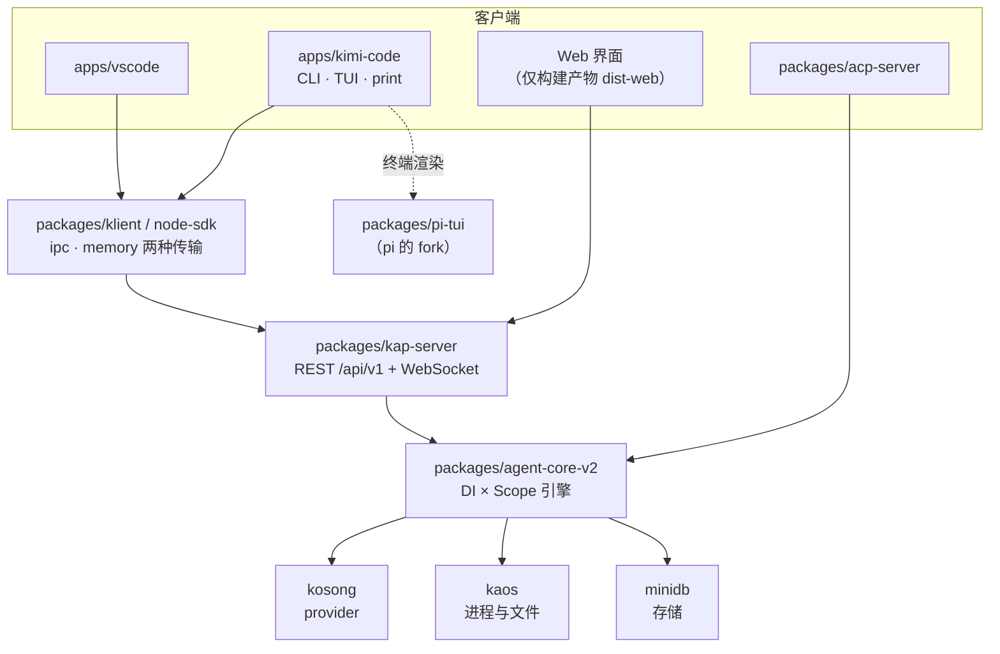

# 2. 架构分层与守卫体系

> 对照基准：[pi 第 2 章](../pi/02-architecture-and-guardrails.md)。pi 的分层是 L1 循环 / L2 `Agent` / L3 `AgentSession`，守卫主要是 `npm run check` 加一份 `AGENTS.md`。kimi-code 的引擎不是从 pi 长出来的，它用的是 VS Code 风格的依赖注入加生命周期作用域；守卫分成「每次都跑的」和「写了但没接上的」两类，后一类本章用实机跑了一遍。

| | pi | kimi-code |
| --- | --- | --- |
| 引擎分层 | L1 / L2 / L3 三层对象 | DI 容器 × 生命周期作用域（App / Session / Agent）+ Service / Fiber 单元 + Feature 接缝 |
| 进程形态 | 单进程库 | 本地服务端 `kap-server` + 客户端 SDK `klient`；CLI 只准走 SDK |
| lint | biome | `check-no-comments`（三个无注释区）+ oxlint `--type-aware`（含 `import/no-cycle`） |
| 架构测试 | — | 导入边界、厂商名闸门、事件类型唯一性，写成 vitest 用例 |
| CI | 单平台 | build + 5 分片测试 + TUI + VS Code 旧引擎 + lint + typecheck；**Windows 作业存在但被 `if: false` 关掉** |
| 与 pi 共享的 | — | 只有 `packages/pi-tui`，用 18 张「意图卡」管理与上游的差异 |

一句话：kimi-code 把架构约束大量写成了可执行的检查；但有一条完整的导入边界检查**没接进 CI**，实机在基准 commit 上跑出 4 处违规。

## 2.1 包结构：服务端在中间，客户端在四周

【文档】`AGENTS.md:17-31` 的项目地图：



*kimi-code 的包关系。pi 只出现在右下角的终端渲染*

【代码事实】`AGENTS.md:17`：`apps/kimi-code` 「must not depend directly on engine packages」——CLI 只准通过 SDK 用引擎。【推断】这条规则让终端、VS Code、Web 三个入口拿到的是同一套协议；代价是 CLI 每一次调用都要过一层传输，哪怕是 `memory` 传输。

## 2.2 引擎：DI 容器 × 生命周期作用域

【代码事实】`packages/agent-core-v2/src/_base/di/` 是一个 16 个文件、5,229 行的 DI 实现：`instantiationService.ts`、`serviceCollection.ts`、`scope.ts`、`fiber.ts`、`cascadeEngine.ts` 等。作用域在 `app/scopes.ts:3-13`：

```ts
export enum LifecycleScope {
  App = 'app',
  Session = 'session',
  Agent = 'agent',
}
```

服务按作用域注册，作用域一层套一层：App 活整个进程，Session 活一个会话，Agent 活一个 agent（主 agent 或子 agent）。引擎的顶层目录按领域分：`agent/`、`session/`、`workspace/`、`tool/`、`features/`、`mcpCore/`、`os/`、`persistence/`、`wire/`，外加两个特殊的：`human/`（纯粹的 LLM / agent 内核）和 `llm-adapter/`（内核与 v2 领域之间的适配层）。

### 文档说四级，代码是三级

【文档】`AGENTS.md:21` 写的是「Four `LifecycleScope` tiers — `App` / `Workspace` / `Session` / `Agent` (`app/scopes.ts`)」。

【代码事实】它指向的那个文件只有三级。`Workspace` 级在 `84da6629`（#2961，2026-08-16，「decouple workspace from session DI via runtime binding」）被拿掉，之后 `AGENTS.md` 的这一句没有跟着改。

【推断】这是一处小的文档漂移，但它在 `AGENTS.md` 里——那是给 coding agent 读的文件。一个按 `AGENTS.md` 去找 `LifecycleScope.Workspace` 的 agent 会找不到。

## 2.3 守卫：每次都跑的

### lint

【代码事实】根 `package.json:20`：

```json
"lint": "node scripts/check-no-comments.mjs && oxlint --type-aware"
```

两段：

1. **无注释区**。`scripts/check-no-comments.mjs:6` 把 `packages/agent-core-v2`、`packages/kap-server`、`packages/transcript` 三个包的 `src`、`test`、`scripts` 设为无注释区，用 TypeScript 的语法树找注释（`:9-30`），JSDoc 也算。`AGENTS.md:51` 写了这条规则。提交 `1ab19190`（#3010）一次性剥掉了这三个包里的注释。
2. **oxlint**。`.oxlintrc.json:19` 打开 `import/no-cycle`，测试文件里关掉（`:157`）；另有 `typescript/return-await`、`only-throw-error` 等类型感知规则。

【推断】「无注释」是一个少见的选择。它的理由在 `AGENTS.md` 里没有展开；从效果看，它把「解释」从代码里挪到了名字、类型和测试里，也让 diff 只有行为变化。代价是像本书这样的读者，拿不到作者的意图——第 3 章的重复断路器，三段提醒语是唯一的「注释」。

### 架构测试

`packages/agent-core-v2/test/lint/` 有三个文件，跟普通测试一起跑：

| 测试 | 扫全量 `src/`？ | 守什么 |
| --- | --- | --- |
| `vendor-name-gates.test.ts`（91 行） | 是（`:82-84`） | `kosong` 之外不准按厂商名写分支（`if (provider === 'xxx')`、`case 'xxx':`） |
| `event-uniqueness.test.ts` | 是（`:117-118`） | 持久化事件的 type 字符串全局唯一 |
| `import-boundaries.test.ts`（192 行） | **否**，只测 fixture | `human/` 不准 import v2 领域与 `llm-adapter`；v2 领域只准 import `human/` 的「词汇」模块；trait 与 format 互不 import |

*表 2-1 三个架构测试。前两个在每次 `pnpm test` 时扫全量源码，第三个只验证检查器本身*

厂商名闸门值得多说一句。【推断】它守的是「多 provider」这件事的形状：provider 差异只能活在 `kosong` 和 `llm/requester/bases/` 里，引擎其余部分只认能力（capability）和 trait，不认名字。这和 minimax-code 的做法不同，minimax 把 provider 兼容改进了 vendor 的 pi `ai` 包里。

### CI

【代码事实】`.github/workflows/ci.yml`：

| 作业 | 行 | 做什么 |
| --- | --- | --- |
| build | `:13-29` | 构建 + 冒烟 |
| test | `:31-49` | 5 个分片跑全量 vitest |
| test-pi-tui | `:53-67` | 单独跑 TUI fork 的测试 |
| test-vscode-legacy | `:72-86` | VS Code 扩展用旧引擎再跑一遍 |
| test-windows | `:90-109` | `windows-latest`；**`if: false`**，注释「Temporarily disabled while Windows tests are being stabilized」 |
| lint | `:111-126` | `pnpm run lint` + `sherif`（monorepo 依赖一致性） |
| typecheck | `:128-154` | 逐个 `tsconfig` 用 `tsgo` |

*表 2-2 CI 作业。Windows 作业在 `278984de`（#1144，2026-06-26）被关掉，到基准时近三个月没有打开*

全仓 995 个测试文件，`agent-core-v2` 占 371 个。

## 2.4 守卫：写了但没接上的

### 导入边界检查

【代码事实】`packages/agent-core-v2/scripts/check-import-boundaries.mjs`（228 行）有一个 `main()`（`:211-223`），遍历 `src/` 和 `test/` 下的全部 `.ts`，有违规就退出 1。它在 `packages/agent-core-v2/package.json:55` 注册为 `lint:imports`。但根 `lint` 不调它，CI 不调它，`import-boundaries.test.ts` 只 import 了它的 `checkSource` 去测 fixture。

【实机】在 `/tmp` 的副本里跑一次：

```text
$ node scripts/check-import-boundaries.mjs
src/agent/loop/loop.ts:9: only llm-adapter, agent/loop/machine and session/agentLifecycle may import the human …
src/agent/loop/loopService.ts:86: only llm-adapter, agent/loop/machine and session/agentLifecycle may import t…
src/agent/media/videoUpload.ts:2: only llm-adapter, agent/loop/machine and session/agentLifecycle may import t…
src/human/agent/origin.ts:1: human must not import outside its kernel ('../../agent/prompt/promptMetadataText'…

check-import-boundaries: 4 violation(s)
```

【推断】检查器本身是对的，测试也证明它抓得住每一类违规；缺的是「对当前代码跑一遍」这一步。没接上的规则会慢慢被违反，而且违反的地方恰好是循环（`loopService.ts`）和内核（`human/agent/origin.ts`）——边界最该守的两处。

### 服务命名检查

【代码事实】`scripts/check-service-naming.mjs`（70 行）检查两个目录里的文件名不准用 kebab-case。第一个目录 `packages/services/src`（`:19`）已经不存在；第二个 `packages/kap-server/src/services`（`:20`）还在。脚本对不存在的目录静默返回（`:40`）。全仓没有任何 `package.json`、CI 或别的脚本引用它。头注释说它是「2026.06.07 services-alignment plan」的第 5 阶段。

【实机】在副本里跑，输出 `Service naming check passed.`，退出码 0。

【推断】一半的检查目标已经消失，另一半没人调。它不会报错，所以不会被注意到。

## 2.5 pi-tui：按意图跟随上游

【代码事实】`packages/pi-tui/UPSTREAM.md`（188 行）开头一句定了规矩：

> The fork is the diff against the pinned upstream tree. This file records **why** those diffs exist, not where they live. Paths and function names move when upstream refactors; intents do not.

它有五节：

| 节 | 行 | 内容 |
| --- | --- | --- |
| Last Sync Point | `:5-12` | 上游 pi 的 `packages/tui`，commit `53816d7d`（2026-09-14，v0.85.1 之后）；明说这个 commit「may not exist in this repo's object database」 |
| Reconstruct the fork | `:14-52` | 一段 shell：稀疏克隆上游，`diff -rq` 排除脚手架文件，再逐个文件 `diff -u` |
| Add a local patch | `:54-63` | 四个完成条件：行为放不进 `apps/kimi-code/src/tui`；写一张意图卡；有一个「没这个改动就失败」的测试；重建 fork 时能看到这张卡解释的 diff |
| Sync from upstream | `:65-76` | 先写下目标 ref 再拷；按文件移植，不整包覆盖；每张 `keep` 卡要么还有对应 diff，要么标 `absorbed` |
| Intents | `:78-188` | 18 张卡，每张两行：**Decision** 和 **Why not in the app** |

18 张卡当前全部是 `keep`。举三张：

- `wide-grapheme-does-not-recurse`：一个比终端还宽的字素不再无限递归到栈溢出；
- `autolink-stops-at-cjk-punctuation`：自动链接在中文标点处停止；
- `editor-history-host-hooks`：编辑器的历史记录给宿主开钩子。

【代码事实】按文件比对（README 的 diff 表）：40 个同路径文件，12 个字节相同，28 个改过，3 个只在 kimi；逐行 +1,962 / −452。

【推断】和 minimax-code 的「L001–L030 逐条记账」相比，kimi 记的不是「改了哪一行」，而是「哪个行为不能丢」。`Add a local patch` 的第一条最关键：**能放进应用层的就不进 fork**，并且默认值要和上游一致（「Prefer an optional argument, callback, or default-off switch. Defaults match upstream.」）。这让 fork 的体积只随「必须改渲染引擎才能实现的行为」增长。代价是 diff 和卡片之间的对应要靠人在每次同步时判断，没有工具校验。

## 2.6 缺口

| 缺口 | 证据 | 后果 |
| --- | --- | --- |
| 导入边界的全量检查没接进 CI | `package.json:20`；`agent-core-v2/package.json:55`；【实机】4 处违规 | 循环与内核的边界已经被跨过，CI 是绿的 |
| Windows CI 关闭近三个月 | `ci.yml:90-109`；`278984de` | Windows 上的路径、进程、权限行为没有回归保护 |
| 死守卫 | `scripts/check-service-naming.mjs:19-20,40` | 一半目标不存在，另一半没人调；永远「passed」 |
| `AGENTS.md` 的作用域描述过期 | `AGENTS.md:21` vs `app/scopes.ts:3-13`；`84da6629` | 给 coding agent 读的地图与代码不符 |
| 意图卡与 diff 的对应没有工具校验 | `UPSTREAM.md:65-76` | 每次同步靠人判断 |

## 2.7 本章结论

- 形态是「本地服务端 + 客户端」，CLI 被规定只能走 SDK；Web 界面只有构建产物。
- 引擎是 DI 容器 × 三级生命周期作用域（`AGENTS.md` 还写着四级）。
- 每次都跑的守卫：三个无注释区、oxlint 含 `no-cycle`、厂商名闸门、事件唯一性、5 分片测试、typecheck。
- 写了没接上的：导入边界的全量检查（实机 4 处违规）、服务命名检查（死的）、Windows CI（关着）。
- 与 pi 的唯一交集 `pi-tui` 用 18 张意图卡管理，规则是「能放进应用层的不进 fork，默认值与上游一致」。
