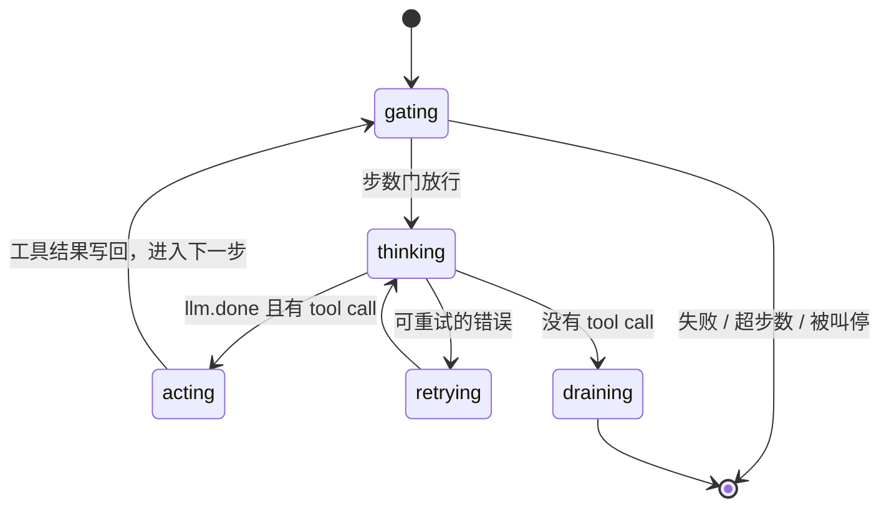
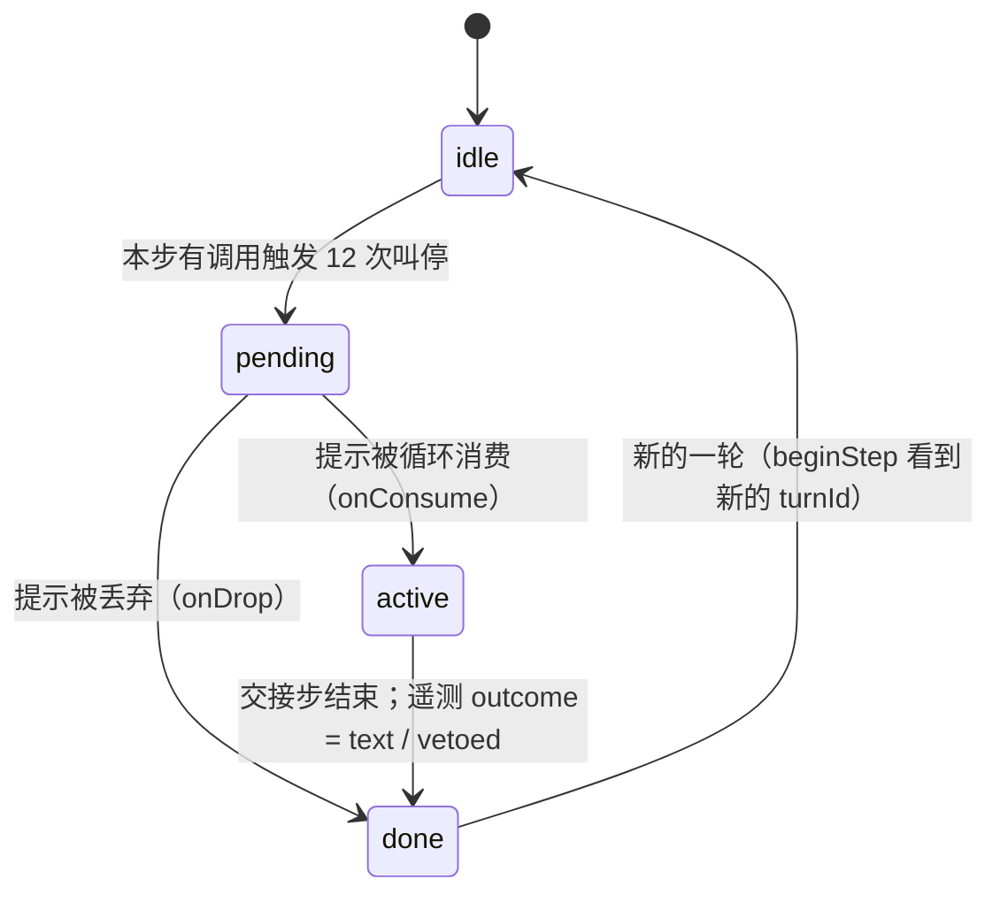

# 3. Agent Loop

> 对照基准：[pi 第 3 章](../pi/03-agent-loop.md)。pi 的 L1 循环是一个 `while` 加一个内层的工具循环，没有步数上限，失败交给调用者。kimi-code 的循环是两台 xstate 状态机加一个 2,279 行的服务；它同样默认不限步数，但加了一个会真停的**重复调用断路器**，停下之后还给模型一步「只许写字」的交接。

| | pi | kimi-code |
| --- | --- | --- |
| 实现形态 | 函数里的 `while` | `human/agent/machine.ts`（949 行）+ `human/agent/turn.ts`（886 行）两台状态机；`agent/loop/loopService.ts`（2,279 行）驱动 |
| 每轮步数上限 | 无 | 默认无；`max_steps_per_turn` 可设 |
| 单步重试 | 交给 provider 层 | 每步最多 10 次，500 ms 起、×2、上限 32 s、±25% 抖动 |
| 工具并发 | 串行或全并行 | 按**声明的资源访问**调度：不冲突就并行；没声明的（如 `Bash`）与一切冲突 |
| 重复调用 | 不管 | 3 / 5 / 8 次连续相同调用逐级提醒；12 次强制结束本轮，再给一步只许文字的交接 |
| 中断后的成对性 | 由调用者补 | `backfillAbortedToolResults` 给没结果的 tool call 补错误结果 |
| 截断的 tool call | 不管 | 不显式拦；参数解析失败降级成 `{}`，交给 schema 校验 |

一句话：kimi 不限步数，但对「原地打转」做了一个分级的、最后会真停的机制。

## 3.1 循环的形状

【代码事实】一轮（turn）由 `turn.ts` 的状态机驱动，状态节点在 `:458-825`：



*图 3-1 一轮的状态。外层 `machine.ts` 管 agent 的生命周期（linking → restoring → idle ⇄ running → closing → disposed）*

步数门在 `loopService.ts:970-991`：被中止、被叫停、上一步失败都直接 `fail`；然后算 `stepOrdinal`，与 `maxStepsPerTurn` 比较。

```
// agent/loop/loopService.ts：步数门。注意 `!consumed.bypass`
    const stepOrdinal = Math.max(this.engine?.currentStep() ?? 0, turn.steps + 1);
    const maxSteps = this.config.get<LoopControl>(LOOP_CONTROL_SECTION)?.maxStepsPerTurn;
    if (
      maxSteps !== undefined &&
      maxSteps > 0 &&
      stepOrdinal > maxSteps &&
      !consumed.bypass
    ) {
      turn.maxStepsError = createMaxStepsExceededError(maxSteps);
      return { type: 'fail' };
    }
    turn.steps = stepOrdinal;
```


【代码事实】`maxStepsPerTurn` 在配置里是 `optional()`（`agent/loop/configSection.ts:14`），没有默认值；【文档】`docs/en/configuration/config-files.md:326`：「unset or `0` means unlimited」。

`consumed.bypass` 是一个口子：通过 `loop.notify({ bypassMaxSteps: true })` 塞进来的提示被消费时，这一步不受步数上限约束（`loopService.ts:434-460`）。目前用它的是 3.4 节的交接步——即使用户设了步数上限，被断路器叫停之后，模型也一定能拿到一步来交代情况。

## 3.2 单步重试

【代码事实】`human/llm/requester/retry.ts:3-10`：

| 常量 | 值 |
| --- | ---: |
| `DEFAULT_MAX_RETRY_ATTEMPTS` | 10（含首次） |
| `BASE_DELAY_MS` | 500 |
| `RETRY_FACTOR` | 2 |
| `MAX_DELAY_MS` | 32,000 |
| `JITTER_FACTOR` | 0.25 |
| 可重试的状态码 | 408、409、429、500、502、503、504、529 |

【文档】`config-files.md:333`：额度耗尽或余额不足导致的 429 不重试，直接失败。`KIMI_CODE_INFINITE_RETRY` 打开无限重试。

【代码事实】`_base/utils/retry.ts:3-8` 有同样的五个常量、同样的值。两份重试工具并存。

## 3.3 工具调度：按资源访问

【代码事实】`agent/toolExecutor/toolScheduler.ts`（99 行）是一个很小的调度器：每个任务带一份 `accesses`，新任务和「正在跑的」以及「排在它前面的」任何一个冲突就排队，否则立刻开始（`:21-50`）。冲突的判定在 `tool/toolContract.ts:184-196`：任何一方是 `all` 就冲突；否则先看操作（读 / 写）是否冲突，再看路径是否重叠。

各工具声明的访问：

| 工具 | 声明 | 位置 |
| --- | --- | --- |
| `Read`、`ReadMediaFile` | `readFile(path)` | `agent/tools/os/read/readTool.ts:225` |
| `Grep`、`Glob` | `searchTree(root)` | `os/grep/grepTool.ts:104`；`os/glob/globTool.ts:113` |
| `Write` | `writeFile(path)` | `os/write/writeTool.ts:57` |
| `Edit` | `readWriteFile(path)` | `edit/editTool.ts:58` |
| `WebSearch`、`FetchURL`、`Agent`、`NotifyUser` | `none()` | 各自的工具文件 |
| `Bash` 与其他没声明的 | 回落到 `ToolAccesses.all()` | `toolExecutorService.ts:437` |

*表 3-1 工具声明的资源访问。没声明就等于「与一切冲突」*

【推断】这是「默认串行、证明了才并行」：读同一个文件的两个 `Read` 可以并行，读写同一个文件的 `Read` 和 `Edit` 不行，`Bash` 和谁都不行。和 pi 的「全并行或全串行」二选一相比，它把并发安全的判断交给了每个工具自己的声明。3.4 和第 6 章会看到，这份声明还被别的机制复用——而 `Bash` 不声明，这一点在 Tower 模式里成了缺口。

另外，执行器在一批调用里遇到「执行完就该停」的调用（`stopBatchAfterThis`），后面的调用不再执行，而是生成一个「跳过」的结果（`toolExecutorService.ts:205-222`），保持成对。

## 3.4 重复调用断路器

这是本章最值得看的机制。【代码事实】`agent/toolDedupe/toolDedupeService.ts`，579 行；测试 `test/agent/toolDedupe/toolDedupe.test.ts`，1,249 行、53 个用例。

### 什么叫「相同」

`makeKey(toolName, args)` = 工具名 + 参数的规范化序列化（`:92-94`）。参数解析失败时，用原始字符串当 key（`:459-474`），免得所有坏参数都变成同一个 `{}`。

### 两种重复

| 类型 | 判定 | 处理 |
| --- | --- | --- |
| 同一步内 | 这一步里已经有同 key 的调用（`:443-447`） | 不执行；结果与第一次调用**共享同一个 Promise**；遥测 `dup_type: same_step` |
| 跨步连续 | 与上一个调用的 key 相同，连续计数 | 照常执行，在结果后面追加提醒；够 12 次就叫停 |
| 同一轮内非连续 | 中间夹了别的调用 | **只记遥测**（`tool_call_turn_repeat`，`:402-424`），不提醒、不叫停 |

*表 3-2 三种重复。只有「连续」的会被干预*

### 分级

```
// agent/toolDedupe/toolDedupeService.ts：三段提醒和四个阈值
const REMINDER_TEXT_1 =
  '\n\n' +
  wrapSystemReminder(
    'The same tool call has been repeated several times in a row. ' +
      'Before making your next call, write one sentence stating what new information you expect it to produce. ' +
      'Then act on that sentence: if it names something this result does not already give you, choose the action that best provides it; otherwise, continue with the evidence you already have.',
  );

function makeReminderText2(repeatCount: number): string {
  return (
    '\n\n' +
    wrapSystemReminder(
      `The same tool call has now been issued ${String(repeatCount)} times in a row. ` +
        'Choose exactly one of the following and state your choice before acting:\n' +
        '(1) Falsification check: run the cheapest test that could conclusively disprove your current approach, if such a test exists.\n' +
        '(2) Missing input: tell the user precisely what information or decision you need to proceed, and ask for it.\n' +
        '(3) Conclude: deliver your best result based on the evidence already gathered, listing anything that remains uncertain.',
    )
  );
}

const REMINDER_TEXT_3 =
  '\n\n' +
  wrapSystemReminder(
    'Write your final response now, without any further tool calls. ' +
      'Cover: the current blocker, each approach you have tried and what it established, and the specific information or decision you need from the user to unblock progress. ' +
      'Text only.',
  );

const REPEAT_REMINDER_1_START = 3;
const REPEAT_REMINDER_2_START = 5;
const REPEAT_REMINDER_3_START = 8;
const REPEAT_FORCE_STOP_STREAK = 12;

const HANDOFF_VETO_TEXT =
  'This turn was ended by the repeat breaker after the same tool call was issued ' +
  `${String(REPEAT_FORCE_STOP_STREAK)} times in a row. This step accepts a text response only, ` +
```


三段提醒的措辞是递进的：

1. 第 3 次：先写一句话说明「下一次调用期望得到什么新信息」，再按这句话行动；
2. 第 5 次：三选一并先说出选择——找一个最便宜的证伪检查、向用户要缺的输入、或者就现有证据下结论；
3. 第 8 次：现在就写最终答复，**不要再调工具**，交代卡点、试过什么、需要用户给什么。

计数在 `finalizeResult` 里算（`:516-543`）：从跨步的连续计数出发，沿着这一步的调用顺序数到当前调用。同一步里的重复也会推高计数。

### 第 12 次：真停

`forceStopResult`（`:137-140`）在结果上追加第三段提醒，并标上 `stopTurn: true`、`stopTurnReason: 'repeat_breaker'`。第 12 次调用**照常执行**，它的结果照常写回——只是这一轮到此为止。

然后是交接：

```
// agent/toolDedupe/toolDedupeService.ts：叫停之后，排一步不受步数上限约束的交接

  private settleHandoff(turnId: number): void {
    const phase = this.handoffPhase;
    if (phase === 'active') {
      this.handoffPhase = 'done';
      const properties: ToolCallRepeatHandoffEvent = {
        turn_id: turnId,
        outcome: this.handoffVetoedCallIds.size > 0 ? 'vetoed' : 'text',
      };
      this.telemetry.track2('tool_call_repeat_handoff', properties);
      return;
    }
    if (phase !== 'idle' || !this.forceStoppedInStep) return;
    this.handoffPhase = 'pending';
    this.loop.notify({
      bypassMaxSteps: true,
      onConsume: () => {
        this.handoffPhase = 'active';
      },
      onDrop: () => {
        this.handoffPhase = 'done';
      },
    });
```




*图 3-2 交接的四个阶段*

交接步里，模型如果还要调工具，在执行前就被否决（`:218-223`）：结果是一段错误文本「This step accepts a text response only, so the tool call was not executed」，并且再次 `stopTurn`。执行后的钩子里还有一道同样的否决（`:234-241`），兜住执行前没拦到的路径。

【推断】这套设计的要点有三个：

- **提醒在结果里，不在系统提示里**。模型最关注的是刚刚返回的那个工具结果，提醒就贴在它后面；
- **停下来不等于什么都不说**。直接结束一轮，用户看到的是一个没有交代的中断；kimi 给一步、只许写字，让模型说清楚卡在哪里；
- **交接步本身也不能失控**。它绕过步数上限（不然用户设了上限就交接不了），但它只能写字，再调工具就直接结束。

### 它管不到的

【代码事实】只有**连续**相同才计数。A、B、A、B 交替调用，每一次都会把 `consecutiveKey` 换掉，计数回到 1（`endStep`，`:367-376`）；非连续的重复只进遥测。参数里有一个变化的字段（例如每次换一个 `offset`）也会生成不同的 key。

【推断】它抓的是「完全原地打转」，不是「绕圈」。后者要靠第 4 章的上下文压缩和用户自己按停。

## 3.5 中断与成对性

【代码事实】用户中止或步骤被打断时，`backfillAbortedToolResults`（`loopService.ts:1975-1989`）遍历这一步的 `pendingToolIds`，给每个还没有结果的 tool call 补一条 `isError: true` 的结果事件。

【推断】和 minimax-code 在 pi 循环里开的 `terminateAgent` 接缝是同一个目标：持久历史里每个 tool call 都有一个结果。kimi 在写时补，第 4 章还会看到它在读时（投影给模型之前）再修一次。

## 3.6 截断的 tool call

【代码事实】`human/agent/turn.ts:572-576`：`llm.done` 时只要累积的消息里有 tool call，就进入 `acting`，**不看 finish reason**。如果模型的输出因为 `max_tokens` 被截断，最后一个 tool call 的参数可能是半截 JSON。

参数解析在 `tool/tool-args-parse.ts:1-21`：解析失败返回 `{ data: {}, parseFailed: true }`。执行器的预检（`agent/toolExecutor/toolExecutorService.ts:741-748`）看到 `parseFailed` 只记一条 debug 日志，然后拿 `{}` 去做 schema 校验（`:780-788`）。

【推断】结果取决于这个工具有没有必填参数：

- 有必填参数（`Read`、`Write`、`Bash` 等）：校验失败，模型收到「Invalid args for tool "X": …」——它会以为自己少传了字段，而不是输出被截断了；
- 没有必填参数：`{}` 会被当成合法调用执行。

【代码事实】截断信息本身被保留了：`normalizeFinishReason`（`:2121-2126`）把 `truncated` 映射成 `max_tokens`，`machineCompletedResult`（`:2015-2022`）把它放进轮结果。子 agent 那一侧，`session/subagent/runAgentTurn.ts:113-118` 会把「截断的完成」变成 `AGENT_MAX_TOKENS_EXCEEDED` 错误；主 agent 没有对应处理。

## 3.7 无头模式的默认值

【代码事实】`agent/task/printDefaults.ts`：`PRINT_MAX_TURNS_DEFAULT = 100_000`；后台 bash 任务的超时 0、每轮步数 0、子 agent 与 swarm 的超时 0——都是「不限」。

【推断】交互模式下，用户就是最后的上限。无头模式下没有用户，这些「0」意味着唯一会让它自己停下的，是 3.4 的断路器和第 9 章探针里列的预算机制（`/goal` 的 token 与墙钟预算）。

## 3.8 配置项里的空字段

【代码事实】`LoopControlSchema`（`configSection.ts:13-20`）有六个字段。其中 `maxRalphIterations` 是 v1 遗留的字段：引擎的 `src/` 里只有这一处定义、没有读取方，`packages/migration-legacy/test/steps/config.test.ts:506-532` 断言迁移会把它从配置里删掉；`compactionTriggerRatio` 有读取方（第 4 章），但 `config-files.md:320-331` 的 `loop_control` 表里没有它。

## 3.9 缺口

| 缺口 | 证据 | 后果 |
| --- | --- | --- |
| 默认不限步数 | `configSection.ts:14`；`config-files.md:326` | 不连续的打转只能靠用户按停 |
| 断路器只认连续相同 | `toolDedupeService.ts:367-376,402-424` | A/B 交替、参数微变都逃得过 |
| 截断的 tool call 不显式拦 | `turn.ts:572-576`；`tool-args-parse.ts:14-19`；`toolExecutorService.ts:741-748` | 模型收到误导性的「参数不合法」；无必填参数的工具会以 `{}` 执行 |
| 无头默认全部不限 | `agent/task/printDefaults.ts` | 见第 5 章 5.5 |
| 重试工具两份 | `human/llm/requester/retry.ts:3-10`；`_base/utils/retry.ts:3-8` | 改一处忘一处 |
| 配置里的遗留字段与漏文档字段 | `configSection.ts:16,18` | `maxRalphIterations` 被接受但没人读；`compaction_trigger_ratio` 没写进文档 |

## 3.10 本章结论

- 循环是两台状态机加一个驱动服务，默认不限步数。
- 工具按声明的资源访问调度，没声明的与一切冲突——`Bash` 永远串行。
- 重复调用断路器：3 / 5 / 8 次逐级提醒，提醒贴在工具结果后面；12 次真停，再给一步绕过步数上限、只许写字的交接；交接步再调工具就直接结束。它只抓连续相同的调用。
- 中断时补齐 tool result，历史保持成对。
- 截断的 tool call 不显式拦，降级成 `{}` 交给 schema 校验。
