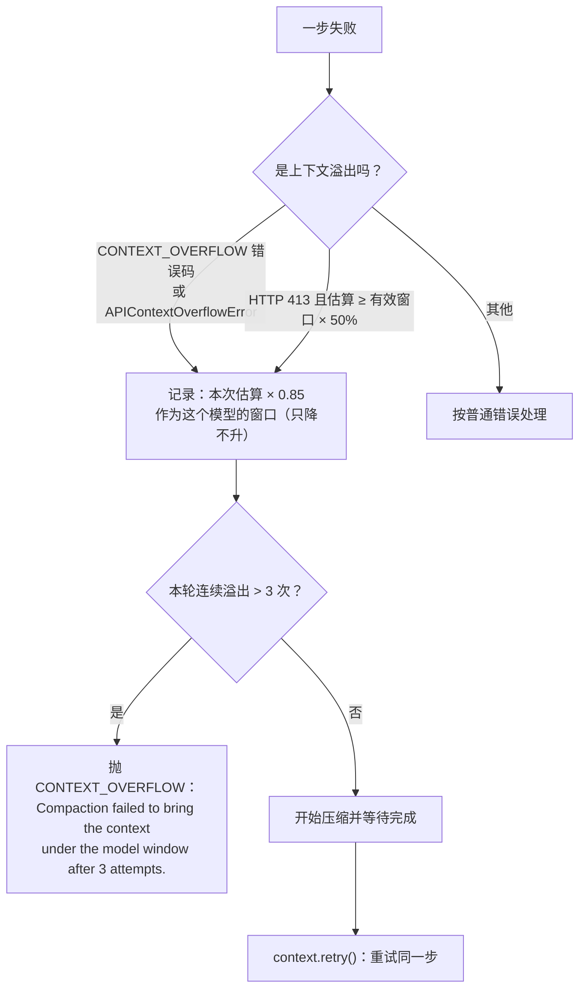

# 4. 上下文工程

> 对照基准：[pi 第 4 章](../pi/04-context-engineering.md)。pi 在接近窗口时做一次摘要压缩，失败交给调用者。kimi-code 把上下文当成一个会出错的资源来管：85% 触发压缩、预留 5 万 token、provider 报溢出就压缩重试并**记住这个模型真实的窗口**；历史的成对性在写入时补一次、发给模型前再修一次。

| | pi | kimi-code |
| --- | --- | --- |
| 触发 | 接近窗口 | 已用 ≥ 85%，或「已用 + 预留 5 万」≥ 窗口（`strategy.ts:18-28,116-135`） |
| 阻塞 | — | 同样 85%：超过就等压缩完再发请求（`fullCompactionService.ts:497-503`） |
| provider 报溢出 | 交给调用者 | 压缩后重试同一步；连续 3 次仍溢出才报错（`:468-489`） |
| 真实窗口 | 用配置值 | 每次溢出把「这次请求的估算 × 0.85」记成这个模型的窗口，只降不升（`:320-331`） |
| 压缩请求本身溢出 | — | 按 70% / 50% / 35% 逐级丢掉最旧的历史再压（`:80-81,690-711,918-931`） |
| 摘要的身份 | 当作上下文 | 前缀明说「当作笔记，不是证据」（`agent/contextMemory/compaction-summary-prefix.md`） |
| 成对性 | 由调用者保证 | 写时补（第 3 章 3.5）+ 读时修：投影层 9 类修复（`agent/contextProjector/projection.ts:8-17`） |
| 大工具结果 | 截断 | 头 4,096 + 尾 1,024 字符，单行最长 2,000（`toolResultTruncationService.ts:20-23`） |
| 工具定义 | 全部常驻 | 实验开关：MCP 工具按需加载（`select_tools`），默认关 |

一句话：kimi 假设「配置里写的窗口不一定是真的」，于是让溢出本身成为一次校准。

## 4.1 压缩的触发与阻塞

【代码事实】默认参数在 `agent/fullCompaction/strategy.ts:18-28`：

| 参数 | 默认值 | 作用 |
| --- | ---: | --- |
| `triggerRatio` | 0.85 | 已用 / 窗口达到它就开始后台压缩 |
| `blockRatio` | 0.85 | 达到它就让下一步等压缩完成 |
| `reservedContextSize` | 50,000 | 「已用 + 预留」≥ 窗口也触发 |
| `maxCompactionPerTurn` | ∞ | 一轮里压缩次数不限 |
| `maxOverflowCompactionAttempts` | 3 | provider 连续报溢出的容忍次数 |
| `maxRecentMessages` | 4 | 压缩时保留的最近消息上限之一 |
| `maxRecentSizeRatio` | 0.2 | 保留的最近消息不超过窗口的 20% |
| `minOverflowReductionRatio` | 0.05 | 一次压缩至少要省下 5% |

*表 4-1 压缩策略的默认值*

预留的判定（`strategy.ts:132-135`）：

```ts
  private shouldUseReservedContext(usedSize: number): boolean {
    const reservedSize = this.config.reservedContextSize;
    return reservedSize > 0 && reservedSize < this.maxSize && usedSize + reservedSize >= this.maxSize;
  }
```

【推断】两个条件取「先到者」：对 25 万窗口，85% 是 212,500，「窗口 − 5 万」是 200,000，预留先到；对 12.8 万窗口，85% 是 108,800，「窗口 − 5 万」是 78,000，同样预留先到。也就是说在常见窗口下，真正起作用的是「给输出留 5 万」，85% 只在超大窗口上才先到。【代码事实】`loop_control.reserved_context_size` 与 `compaction_trigger_ratio` 都能在配置里改（`agent/loop/configSection.ts:13-20`），后者没写进文档（第 3 章 3.8）。

每一步开始前（`fullCompactionService.ts:497-503`）先检查是否该触发，再检查是否该阻塞：

```ts
  private async beforeStep(signal: AbortSignal, turnId?: number): Promise<void> {
    this.activeTurnId = turnId;
    this.checkAutoCompaction();
    if (this.strategy.shouldBlock(this.tokenCountWithPending())) {
      await this.block(signal, turnId);
    }
  }
```

## 4.2 溢出：压缩、重试、校准

provider 说「太长了」的时候，kimi 不把错误抛给用户，而是走一条恢复路径：



*图 4-1 溢出恢复。代码在 `fullCompactionService.ts:305-331,468-495`*

### 什么算溢出

【代码事实】`shouldRecoverFromContextOverflow`（`:305-318`）认三种：引擎自己的 `CONTEXT_OVERFLOW` 错误码、provider 层识别出的 `APIContextOverflowError`、以及 HTTP 413——但 413 要加一个条件：本次请求的估算 ≥ 有效窗口的 50%。

【推断】413 是「请求体太大」，不一定是上下文太长（一张大图片也会触发）。加上 50% 的门槛，是为了不把一个小上下文里的大附件当成溢出去压缩历史——压了也没用。

### 记住真实的窗口

```ts
  private observeContextOverflow(estimatedRequestTokens: number): void {
    if (!Number.isFinite(estimatedRequestTokens) || estimatedRequestTokens <= 0) return;
    const modelAlias = this.profile.data().modelAlias;
    if (modelAlias === undefined) return;
    const observed = Math.max(
      1,
      Math.floor(estimatedRequestTokens * OVERFLOW_CONTEXT_SAFETY_RATIO),
    );
    const current = this.getEffectiveMaxContextTokens();
    if (current > 0 && observed >= current) return;
    this.observedMaxContextTokensByModel.set(modelAlias, observed);
  }
```

【代码事实】`OVERFLOW_CONTEXT_SAFETY_RATIO` = 0.85（`:78`）。有效窗口取「配置值」与「观测值」的较小者（`getEffectiveMaxContextTokens`，`:258-267`），按模型别名分开记。这份观测值是一个不可回放的 agent 状态（`:116-119` 只 `defineState`，没有 `.replayable`），进程重启就回到配置值。

【推断】这解决的是一个真实问题：网关、代理、或者同名模型的不同部署，实际窗口可能比配置里写的小。pi 的做法是相信配置；kimi 的做法是让第一次溢出成为校准，此后 85% 的触发线就落在校准后的窗口上，不会在同一个坑里再摔。代价是估算本身有误差——token 是本地估算的，不是 provider 数的——乘 0.85 是给这个误差留的余量。

### 估算算了什么

【代码事实】`requestTokens`（`:283-291`）= 系统提示 + **非延迟**的工具定义 + 消息。工具定义算进去了，这一点 pi 没有做。延迟加载的工具（4.6）不算，因为它们不进 `tools[]`。

### 一轮里的计数

`resetForTurn`（`:462-466`）在每轮开始时把本轮压缩次数、上次压缩后的 token 数、连续溢出次数清零。所以「3 次」是**每轮**连续 3 次：一轮里压了 3 次还溢出，说明不是压缩能解决的问题（例如单条消息本身就超过窗口），就报错停下。

## 4.3 压缩请求本身溢出

压缩是一次 LLM 调用，它的输入是要被压掉的那段历史——这段历史本身就可能超过窗口。

【代码事实】`fullCompactionService.ts:690-711`：压缩请求报溢出时，先同样校准窗口，然后按 `COMPACTION_OVERFLOW_SHRINK_RATIOS = [0.7, 0.5, 0.35]`（`:81`）逐级缩小：从最新的一端往回取，取到总 token 的 70%、50%、35% 为止（`shrinkCompactionHistoryAfterOverflow`，`:918-931`），被丢掉的最旧消息计入 `droppedCount`。超过 3 次（`MAX_COMPACTION_OVERFLOW_SHRINK_ATTEMPTS`，`:80`）或只剩一条消息就放弃。

另外，压缩输出被截断（`CompactionTruncatedError`）或返回空响应时，丢掉最旧的一条消息再试（`dropOldestMessageAndLeadingToolResults`，`:715-725`）。压缩的输出上限是 128K token（`:77`）。

【推断】这是「压缩失败」的降级路径：宁可丢掉最旧的一段，也要得到一份摘要。丢掉的部分不进摘要，模型不会知道它们存在过——除了用户消息（见下）。

## 4.4 摘要的身份：笔记，不是证据

【代码事实】压缩后，摘要前面贴一段固定前缀（`agent/contextMemory/compaction-summary-prefix.md`，由 `compactionHandoff.ts:4,7` 引入）：

> The conversation so far has been compacted to free up context. What follows is your own working summary of this task — use it to continue your train of thought rather than starting over. **Treat it as notes, not proof**: where it says a step was done, tests passed, or a fix worked, verify that yourself before relying on it. Any user messages earlier in this context are preserved verbatim from the compacted conversation; …

两件事：

1. **摘要不是证据**。摘要说「测试过了」，模型要自己再验一遍。【推断】这针对的是压缩最隐蔽的失败：摘要模型把「打算做」写成了「做完了」，压缩之后的 agent 就在一个错误的前提上继续。
2. **用户消息原样保留**——但有总预算。被压掉的那段里的用户消息合计不超过 2 万 token 时全部原样保留；超过时保留最早的 2,000 token 和最近的 18,000 token，中间用一条系统提醒标出省略（`compactionHandoff.ts:8-9,234-275`）。

【代码事实】同一份前缀在 `human/compaction/compaction-summary-prefix.md` 还有一份，内容逐字相同。

## 4.5 成对性：读时再修一次

第 3 章 3.5 看过写时的补齐：中断时给没结果的 tool call 补一条错误结果。kimi 在把历史投影成请求时还要再修一次。

【代码事实】`agent/contextProjector/projection.ts:8-17` 定义了 9 类修复：

| 修复 | 什么情况 |
| --- | --- |
| `tool_result_reordered` | 结果不在 tool call 紧后面，挪过去 |
| `tool_result_synthesized` | tool call 没有结果，合成一条 |
| `orphan_tool_result_dropped` | 结果找不到对应的 tool call，丢掉 |
| `duplicate_tool_call_dropped` / `duplicate_tool_result_dropped` | 同一个 id 出现两次，丢掉后一个 |
| `leading_non_user_dropped` | 历史开头不是用户消息，丢掉 |
| `consecutive_assistants_merged` | 连续两条助手消息，合并 |
| `whitespace_text_dropped` / `vacuous_message_dropped` | 只有空白或空内容的消息，丢掉 |

*表 4-2 投影层的 9 类修复*

合成的那条结果（`projection.ts:386-387`）措辞很小心：

```ts
const TOOL_INTERRUPTED_TEXT =
  'Tool result is not available in the current context. Do not assume the tool completed successfully.';
```

【代码事实】修复不是静默的：`contextProjectorService.ts:82-130` 把修复汇总成一条 warn 日志「repaired the request to keep it wire-valid」和一个遥测事件 `context_projection_repaired`；同样的修复组合只报一次（`lastRepairSignature`），历史末尾正在等待的 tool call 合成不算异常（`:83-85`）。

【推断】写时补是为了让持久历史正确；读时修是为了让**任何**历史——包括旧版本写的、迁移来的、被压缩切过的——发出去都是合法的。前者是正确性，后者是韧性；后者的遥测让前者的漏洞能被发现。

## 4.6 工具结果与工具定义

### 大结果

【代码事实】`agent/toolResultTruncation/toolResultTruncationService.ts:20-23`：

```ts
const TOOL_RESULT_PREVIEW_HEAD_CHARS = 4_096;
const TOOL_RESULT_PREVIEW_TAIL_CHARS = 1_024;
const TOOL_RESULT_MAX_LINE_CHARS = 2_000;
const TRUNCATION_MARKER = '[...truncated]';
```

超长结果保留头 4,096 字符和尾 1,024 字符（`:309-310`），中间用 `[...truncated]` 标出；单行超过 2,000 字符也截。【推断】保留尾部是给命令输出的——错误信息和退出状态通常在最后。

### 工具定义：按需加载

【代码事实】MCP 服务器可以标 `deferred: true`（`docs/en/customization/mcp.md:65`），它的工具就不进顶层 `tools[]`：模型先看到一份可加载工具的清单，用内置的 `select_tools` 把需要的定义拉进来，同一轮里就能调用（`mcp.md:83-85`）。但要同时满足两个条件（`agent/toolSelect/toolSelectService.ts:84-91`）：

```ts
  enabled(): boolean {
    const capabilities = this.profile.getModelCapabilities();
    return (
      capabilities.dynamically_loaded_tools === true &&
      capabilities.tool_use &&
      this.flags.enabled(TOOL_SELECT_FLAG_ID)
    );
  }
```

- 实验开关 `tool-select`，环境变量 `KIMI_CODE_EXPERIMENTAL_TOOL_SELECT`，**默认关**（`agent/toolSelect/flag.ts`）；
- 模型能力表声明了 `dynamically_loaded_tools`。

条件不满足时 `deferred` 被忽略，工具照常常驻（`mcp.md:103`）。已加载的工具在发请求时标成 `deferred`，从顶层 `tools[]` 里滤掉（`llmRequesterService.ts:888-889`），由模型侧的动态加载机制承载。

【推断】开关的描述（`flag.ts`）说得很直接：「Keep MCP tool schemas out of the immutable top-level tools[]」。目的有两个：省上下文，以及让顶层 `tools[]` 不变——工具列表一变，provider 侧的前缀缓存就失效。这依赖 provider 支持「动态加载的工具」，所以只能对声明了这项能力的模型打开。

## 4.7 项目指令：AGENTS.md

【代码事实】`agent/profile/context.ts:159-182` 的加载顺序：

1. `~/.kimi-code/AGENTS.md`（品牌目录）；
2. `~/.agents/` 下的 `AGENTS.md` 或 `agents.md`，取第一个；
3. 从 git 工作树根到当前目录的每一级：先 `.kimi-code/AGENTS.md`，再 `AGENTS.md` / `agents.md` 取第一个（`:79-82`）。

全部拼起来后，总量超过 32 KiB（`:8`）**只警告**，不截断（`:186-192`）：「Large instruction files increase cost and may impact performance; consider trimming.」

【代码事实】不读 `CLAUDE.md`。仓库里唯一提到它的是一个内置技能 `features/skill/catalog/builtin/import-from-cc-codex.md`，用来把别家的指令文件**迁移**过来。子目录里的 `AGENTS.md` 由 `agentsMdReminder` 在模型进入那个目录时以提醒注入，不进系统提示。

## 4.8 缺口

| 缺口 | 证据 | 后果 |
| --- | --- | --- |
| 观测到的窗口不持久 | `fullCompactionService.ts:116-119` | 每次重启都要再溢出一次才校准 |
| token 是本地估算 | `requestTokens`，`:283-291` | 估算偏低时 85% 线失效，靠溢出恢复兜底 |
| 压缩溢出时丢掉的最旧历史不进摘要 | `:690-711,918-931` | 模型不知道那段历史存在过（用户消息在 2 万 token 预算内除外） |
| 摘要前缀两份 | `agent/contextMemory/` 与 `human/compaction/` | 改一处忘一处 |
| AGENTS.md 超限只警告 | `context.ts:186-192` | 大指令文件每轮都全额进上下文 |
| 按需加载默认关 | `toolSelect/flag.ts` | 默认配置下 MCP 工具定义常驻 |

## 4.9 本章结论

- 压缩在 85% 或「留不出 5 万」时触发，常见窗口下后者先到；同样的线上会阻塞下一步。
- provider 报溢出不是终点：压缩、重试同一步，并把「这次请求 × 0.85」记成该模型的窗口，只降不升；每轮连续 3 次才报错。
- 压缩请求本身溢出时按 70 / 50 / 35% 丢掉最旧的历史再压。
- 摘要前缀明说「当作笔记，不是证据」；用户消息在 2 万 token 预算内原样保留。
- 成对性写时补、读时修，读时的 9 类修复有日志和遥测。
- MCP 工具的按需加载是实验功能，默认关，并且要求模型声明能力。
