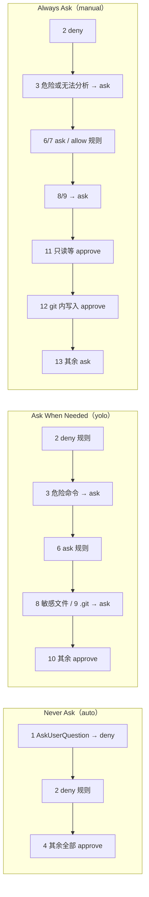

# 5. 工具与权限

> 对照基准：[pi 第 5 章](../pi/05-tools-permissions.md)。pi 没有权限弹窗，工具直接执行，安全边界交给使用者（容器、虚拟机）。kimi-code 有一条 13 段的权限策略链、三档模式、一个用 bash 语法树判定的危险命令守卫；但它在 auto 模式和无头模式下几乎全部放行，子进程继承完整环境，也没有沙箱。

| | pi | kimi-code |
| --- | --- | --- |
| 权限模型 | 无 | 13 条策略，按顺序取第一个有结论的（`agent/permissionPolicy/permissionPolicyService.ts:39-55`） |
| 模式 | — | Always Ask（`manual`，默认）/ Ask When Needed（`yolo`）/ Never Ask（`auto`） |
| 危险命令 | — | tree-sitter 解析 bash，识别关机、格式化、`rm -rf` 等；auto 模式与无头模式下不生效 |
| 敏感文件 | — | `.env`、私钥、云凭据；只对声明了文件访问的工具生效 |
| 手动模式下的写入 | — | 在 git 工作树内、工作区内的 `Write` / `Edit` **自动批准** |
| 无头 | 由调用者决定 | `kimi -p` 强制 `auto`，并去掉危险命令策略 |
| 子进程环境 | 继承 | 继承完整 `process.env` |
| 沙箱 | 无 | 无 |

一句话：kimi 的权限是「给交互用户的确认流程」，不是隔离边界；离开交互，它就几乎全部放行。

## 5.1 策略链

【代码事实】`permissionPolicyService.ts:39-55` 按顺序实例化 13 条策略，每条返回 `approve` / `deny` / `ask` 或「不表态」，第一个表态的生效：

| # | 策略 | 结论 | 何时表态 |
| ---: | --- | --- | --- |
| 1 | `auto-mode-ask-user-question-deny` | deny | auto 模式下的 `AskUserQuestion` |
| 2 | `user-configured-deny` | deny | 用户 / 项目配置的 deny 规则 |
| 3 | `dangerous-command-ask` | ask | 危险或无法分析的 bash（**无头模式下整条不存在**，`:42-44`） |
| 4 | `auto-mode-approve` | approve | auto 模式下的**一切** |
| 5 | `session-approval-history` | approve | 本会话里批准过的同一个调用 |
| 6 | `user-configured-ask` | ask | 配置的 ask 规则 |
| 7 | `user-configured-allow` | approve | 配置的 allow 规则 |
| 8 | `sensitive-file-access-ask` | ask | 文件访问命中敏感文件 |
| 9 | `git-control-path-access-ask` | ask | 文件访问落在 `.git` 内 |
| 10 | `yolo-mode-approve` | approve | yolo 模式下的一切 |
| 11 | `default-tool-approve` | approve | 只读与协作类工具（下文） |
| 12 | `git-cwd-write-approve` | approve | git 工作树内、工作区内的 `Write` / `Edit` |
| 13 | `fallback-ask` | ask | 兜底 |

*表 5-1 13 条策略。顺序就是优先级*

把三档模式套上去：



*图 5-1 三档模式各自真正经过的策略*

【推断】几个由顺序决定、文档里没写明的后果：

- **auto 模式跳过 ask 规则和敏感文件**。策略 4 在 6、8、9 之前。【文档】`docs/en/guides/interaction.md:71` 明说 auto 会自动处理敏感文件；但没说用户自己写的 `ask` 规则在 auto 下也不生效——只有 `deny` 还在。
- **规则不是「按顺序第一个匹配」**。【文档】`docs/en/configuration/config-files.md:520`：「matched in order; the first matching rule takes effect」。【代码事实】deny、ask、allow 是三条独立的策略（2、6、7），每条只在同类规则里找第一个匹配（`policies/user-configured-rule.ts:20-35`）。所以 `allow Bash(git *)` 写在 `ask Bash` 前面，`git status` 仍然会被问——ask 策略先跑。
- **会话内批准是字面的**。「本会话批准」记录的是工具名加完整参数（`readTool.ts:228`、`bashTool.ts:150` 的 `literalRulePattern`），只覆盖一模一样的调用。

## 5.2 默认批准与「手动模式下的写入」

【代码事实】`policies/default-tool-approve.ts` 的名单有 24 项：`Read`、`Grep`、`Glob`、`ReadMediaFile`、`TodoList`、`TaskList`、`TaskOutput`、`WaitFor`、`CronList`、`WebSearch`、`FetchURL`、`Agent`、`AgentSwarm`、`AskUserQuestion`、`NotifyUser`、`Skill`、`EnterPlanMode`、`ExitPlanMode`、目标相关的四个、`select_tools`，以及旧名 `SetTodoList`。

【推断】`FetchURL` 和 `WebSearch` 在名单里，意味着手动模式下模型可以不经确认把任意 URL 发出去——如果它在上下文里读到了一个秘密，这就是一条外发通道。`Agent` 在名单里，意味着派生子 agent 不需要确认；子 agent 的工具调用仍然走同一条链（第 6 章）。

### 写入：文档说问，代码说不问

【文档】`interaction.md:67`：

> **Always Ask mode** (formerly Manual) is the default: read-only operations run automatically, while every other action — editing files, running commands — asks for your confirmation one by one.

【代码事实】`policies/git-cwd-write-approve.ts:23-52`：

```ts
  async evaluate(
    context: ResolvedToolExecutionHookContext,
  ): Promise<PermissionPolicyResult | undefined> {
    const toolName = context.toolCall.name;
    if (toolName !== 'Write' && toolName !== 'Edit') return undefined;
    const lease = this.runtime.acquire();
    const pathClass = lease.runtime.environment.pathClass;
    lease.dispose();
    if (pathClass !== 'posix') return undefined;

    const cwd = this.workspace.workDir;
    if (cwd.length === 0) return undefined;

    const writeAccesses = writeFileAccesses(context);
    if (writeAccesses.length === 0) return undefined;
    if (
      !writeAccesses.every((access) =>
        isWithinWorkspace(
          access.path,
          { workspaceDir: cwd, additionalDirs: this.workspace.additionalDirs },
          'posix',
        ),
      )
    ) {
      return undefined;
    }

    return (await this.git.findWorkTree(cwd)) === null
      ? undefined
      : { kind: 'approve' };
  }
```

只要满足三个条件——POSIX 系统、当前目录在一个 git 工作树里、所有写入路径都在工作区内——默认的 Always Ask 模式下，`Write` 和 `Edit` **不问**。敏感文件（策略 8）和 `.git` 内的路径（策略 9）排在它前面，仍然会问。

【代码事实】这条策略是 v2 引擎第一天就有的：`git log -S GitCwdWriteApprove` 最早落在 `ceb158dc`（#1441，v2 进仓）。

【推断】理由大概是「git 能撤销」：工作树内的改动 `git diff` 看得见、`git checkout` 退得回。这是一个说得通的选择，但它和文档的描述相反；用户读了文档、以为每次编辑都会被问，实际上在大多数项目里（项目几乎都是 git 仓库）编辑是不问的。Windows 上不生效（`pathClass !== 'posix'`），同一个用户换台机器行为就不同。

## 5.3 危险命令守卫

【代码事实】`policies/dangerous-command-ask.ts`，377 行。它用 `packages/tree-sitter-bash` 把命令解析成语法树（解析超时 500 ms、最多 1 万个节点，`:15`），然后逐条命令判定：

| 类别 | 内容 | 位置 |
| --- | --- | --- |
| 直接危险 | `shutdown`、`halt`、`poweroff`、`reboot`、`mkfs`、`wipefs`、`format`、`diskpart`、`bcdedit`、`restart-computer`、`stop-computer` | `:27-39` |
| 子命令危险 | `systemctl poweroff/reboot/halt/kexec` | `:87-92` |
| 参数危险 | `dd` 写到非安全设备；`rm` 同时带递归与强制（`/tmp` 下除外） | `:96-114,283-314` |
| 会被剥开看里面的 | `sudo` / `doas`；`env`、`command`、`exec`、`nohup`、`builtin`、`nice`；`sh -c` 等嵌套 shell（最多 4 层） | `:17,41-85` |
| 无法分析 | 解析失败、含 `$` 反引号通配符等的操作数、嵌套过深 | `:19,161,241,247` |

*表 5-2 危险命令的判定*

判定结果的用法（`:129-146`）：

```ts
  evaluate(context: ResolvedToolExecutionHookContext): PermissionPolicyResult | undefined {
    if (!isDangerousCommandGuardEnabled(this.config)) return undefined;
    if (this.modeService.mode === 'auto') return undefined;
    if (context.toolCall.name !== 'Bash') return undefined;
    const command = bashCommandText(context.args);
    const verdict =
      command === undefined
        ? ({ kind: 'unanalyzable' } as const)
        : analyzeSource(command, 0, (source) =>
            this.bashParser.parse(source, PARSE_OPTIONS),
          );
    if (verdict === undefined) return undefined;
    if (verdict.kind === 'dangerous') {
      return { kind: 'ask', reason: { dangerous_command: verdict.command } };
    }
    if (this.modeService.mode === 'yolo') return undefined;
    return { kind: 'ask', reason: { unanalyzable_command: true } };
  }
```

【推断】三点：

- 用语法树而不是正则，`echo "rm -rf /"` 不会误报，`sudo -u x env nohup rm -rf ~` 也剥得开。
- 名单很窄：`rm -r`（不带 `-f`）、`git reset --hard`、`git clean -fdx`、`find -delete`、`curl | sh` 都不在里面。它守的是「不可恢复的系统级破坏」，不是「会丢工作的操作」。
- 在 yolo 模式下，「无法分析」放行，只有明确危险的才问；在 auto 模式和无头模式下，整条策略不生效。【文档】`interaction.md:71` 和 `config-files.md:522` 都写明了。

## 5.4 敏感文件只管声明了路径的工具

【代码事实】`tool/path-access.ts:51-83` 的 `isSensitiveFile`：`.env` 与 `.env.*`（`.env.example` / `.sample` / `.template` 除外）、`id_rsa` / `id_ed25519` / `id_ecdsa` 及其变体（公钥除外）、`credentials`、`.aws/credentials`、`.gcp/credentials`。

策略 8（`policies/sensitive-file-access-ask.ts`）只看 `fileAccesses(context)`——也就是工具**声明**的文件访问。

【推断】第 3 章表 3-1 说过，`Bash` 不声明访问。所以 `Read .env` 会被问，`Bash cat .env` 不会因为这条策略被问——在手动模式下它会被兜底策略 13 问，但问的理由是「这是一条 bash」，而不是「这碰了敏感文件」；在 yolo 模式下它直接放行。文档说 yolo「仍然会在访问敏感文件前询问」（`interaction.md:69`），对 `Bash` 不成立。

## 5.5 无头模式

【代码事实】`apps/kimi-code/src/cli/v2/run-v2-print.ts`：

- 启动参数 `nonInteractive: true`（`:171`），于是策略 3（危险命令）在策略链里**不存在**（`permissionPolicyService.ts:42-44`）；
- `forceAuto`（`:407-418`）把每个 agent 的权限模式改成 `auto`，跑完再恢复；新建会话时直接 `setMode('auto')`（`:481`）。

【文档】`docs/en/reference/kimi-command.md:43`：「`--prompt` cannot be used with `--yolo`, `--auto`, or `--plan` — non-interactive mode uses `auto` permission by default」。也就是说，无头模式**没有**更严的选项。

加上第 3 章 3.7 的默认值（每轮不限步数、后台任务不限时、子 agent 与 swarm 不限时），`kimi -p` 的实际边界是：

| 还在的 | 位置 |
| --- | --- |
| 配置里的 `deny` 规则 | 策略 2 |
| 重复调用断路器 | 第 3 章 3.4 |
| `/goal` 的 token 与墙钟预算（如果用户建了 goal） | 第 6 章 |
| 外部 hook 的 `PreToolUse` 阻断（如果配置了） | 第 7 章 |

*表 5-3 无头模式下仍然生效的约束*

【推断】这是一个明确的选择：无头就是「交给它跑完」。和 pi 一样，安全边界要由调用者在外面提供；不同的是 pi 从来不假装有边界，kimi 在交互模式下有一整套确认流程，用户很容易以为 `-p` 也继承了它。

## 5.6 执行环境：继承一切，没有沙箱

【代码事实】

- 引擎的本地进程：`os/backends/node-local/hostProcessService.ts:36-41`，没有覆盖时 `env` 为 `undefined`，Node 默认继承父进程的完整环境；有覆盖时是 `{ ...process.env, ...overrides }`。
- `kaos` 的本地执行：`packages/kaos/src/local.ts:759-769`，同样从 `process.env` 展开。
- MCP stdio 服务器：`mcpCore/client-stdio.ts:292-304` 的 `mergeStdioEnv` 先复制父进程环境，再叠配置里的 `env`。

仓库里没有 seatbelt、bubblewrap、容器或任何进程隔离。

【推断】用户 shell 里的 `AWS_*`、`GITHUB_TOKEN`、各家 API key，模型跑的每一条 `Bash` 和每一个 MCP 服务器都看得见。结合 5.2 的 `FetchURL` 默认批准，手动模式下也存在一条「读环境变量 → 发到 URL」的路径：`Bash env` 会被问，但用户看到的只是一条 `env`。

## 5.7 用户的 `!` 命令

【代码事实】TUI 里以 `!` 开头的输入走 `agent/shellCommand/shellCommandService.ts:91-125`：直接拿 `Bash` 工具的执行器跑，不经过策略链；命令和输出写进对话（`appendShellInput` / `appendShellOutput`）。

【推断】这是用户自己敲的命令，不经确认是合理的；值得知道的是它的输出会进入模型的上下文。

## 5.8 工作区信任只管 MCP

【代码事实】`workspace/workspaceTrust/` 的读取方只有两处：`workspace/workspaceMcpConfig/workspaceMcpConfigService.ts:108,167`（是否加载项目级 `.kimi-code/mcp.json`）和 `app/mcpRegistry/mcpRegistryService.ts:48`。项目级 `AGENTS.md`（第 4 章 4.7）不受信任状态影响。【文档】`docs/en/customization/mcp.md:78`：「stdio entries in a project-level `.kimi-code/mcp.json` execute local commands when a session starts. Only enable these in repositories you trust.」

第 7 章会回到这个问题：项目级的 hook 和插件是否也受信任管控。

## 5.9 缺口

| 缺口 | 证据 | 后果 |
| --- | --- | --- |
| 手动模式下 git 工作树内的写入自动批准，与文档相反 | `git-cwd-write-approve.ts:23-52` vs `interaction.md:67` | 用户以为每次编辑都会被问 |
| 规则优先级与文档不符 | `permissionPolicyService.ts:46-47`；`user-configured-rule.ts:20-35` vs `config-files.md:520` | 写在前面的 allow 被后面的 ask 盖住 |
| auto 模式下 ask 规则失效 | 策略 4 在 6 之前 | 用户写的「这个要问我」在 auto 下不问 |
| 敏感文件只认声明了访问的工具 | `sensitive-file-access-ask.ts`；`toolExecutorService.ts:437` | `Bash cat .env` 在 yolo 下直接放行，与 `interaction.md:69` 不符 |
| 无头模式强制 auto 且去掉危险命令策略 | `run-v2-print.ts:171,407-418,481`；`permissionPolicyService.ts:42-44` | 没有更严的无头选项 |
| `FetchURL` 默认批准 | `default-tool-approve.ts` | 手动模式下存在不经确认的外发通道 |
| 子进程继承完整环境，没有沙箱 | `hostProcessService.ts:36-41`；`local.ts:759-769`；`client-stdio.ts:292-304` | 凭据对模型和 MCP 全部可见 |

## 5.10 本章结论

- 13 条策略按顺序取第一个表态的；deny 规则在最前，兜底是 ask。
- 三档模式里，auto 在第 4 条就全部批准，yolo 在第 10 条，manual 走到底。
- 危险命令用 bash 语法树判定，名单只覆盖不可恢复的系统级破坏；auto 与无头下不生效。
- 手动模式下，git 工作树内的 `Write` / `Edit` 自动批准——文档说会问。
- 敏感文件保护只对声明了路径的工具生效，`Bash` 绕得过。
- 无头模式强制 auto；子进程继承完整环境；没有沙箱。
