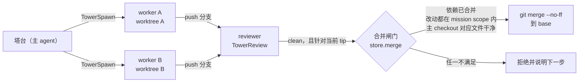

# 6. 多 Agent 与任务

> 对照基准：[pi 第 6 章](../pi/06-multi-agent.md)。pi 的立场是「No sub-agents」，需要就自己用扩展或 tmux 起一个。kimi-code 有四层：`Agent` 工具派一个子 agent，`AgentSwarm` 按模板一次派最多 128 个，实验性的 Tower 模式让多个 worker 在各自的 git worktree 里干活、经过审查闸门再合并，`/goal` 让主 agent 跨轮次朝一个目标连续工作。

| | pi | kimi-code |
| --- | --- | --- |
| 子 agent | 无 | `Agent` 工具；内置 `coder`（默认）/ `explore` / `plan` 三个角色（`session/agentLifecycle/profile/profiles.ts:46-125`；`features/plan/profile/plan.ts`） |
| 嵌套深度 | — | 1：内置子角色都没有 `Agent` 工具 |
| 只读角色 | — | `explore` 有 `Bash`，只读靠提示；`plan` 没有 `Bash` |
| 权限模式 | — | 子 agent 复制调用者的模式（`session/subagent/subagentService.ts:184-186`） |
| 批量派发 | — | `AgentSwarm`：最多 128 个；默认先起 5 个、之后每 700 ms 加 1 个，**不设并发上限** |
| 多 worker 协作 | — | Tower 模式（实验，默认关）：每个 worker 一个 worktree；合并前有审查与范围闸门 |
| 长任务 | — | `/goal`：跨轮自动续跑；token / 轮数 / 墙钟预算**默认都没有** |

一句话：kimi 的多 agent 是「先放开、再在出口设闸门」——派发几乎不设限，约束落在 Tower 的合并闸门和 goal 的预算上；而这两处都是可选的。

## 6.1 子 agent：三个角色，深度 1

【代码事实】`profiles.ts` 注册了主 agent 与两个子角色，`plan.ts` 注册第三个：

| 角色 | 工具 | 写文件 | `Bash` | 位置 |
| --- | --- | :---: | :---: | --- |
| `agent`（主） | 32 项，含 `Agent`、`AgentSwarm` | ✅ | ✅ | `profiles.ts:11-44,90-97` |
| `coder`（默认） | 文件读写、`Bash`、任务、网络、`mcp__*`；**没有 `Agent`** | ✅ | ✅ | `:46-69,99-108` |
| `explore` | `NotifyUser`、`Bash`、`Read`、`ReadMediaFile`、`Glob`、`Grep`、`WebSearch`、`FetchURL` | ❌ | ✅ | `:71-80,110-125` |
| `plan` | `NotifyUser`、`Read`、`ReadMediaFile`、`Glob`、`Grep`、`WebSearch`、`FetchURL` | ❌ | ❌ | `features/plan/profile/plan.ts:8-16,32-40` |

*表 6-1 内置角色的工具面*

【代码事实】主 agent 的子角色列表只有 `[coder, explore, plan]`，这三个都不带 `Agent` 和 `AgentSwarm`，所以嵌套深度是 1。【文档】`apps/kimi-code/CHANGELOG.md:905`（#2837）：「Remove the Agent and AgentSwarm tools from the built-in coder subagent profile, so coder subagents no longer delegate further by default. Custom profiles that list these tools explicitly can still opt in.」

【推断】深度限制不是一个计数器，而是「子角色手里没有派发工具」。这个做法简单、不会漏，但它只对内置角色成立：用户自定义的角色把 `Agent` 列进去，深度就不再受限——仓库里没有第二道检查。

### explore 的只读是提示

【代码事实】`explore` 的描述原文是「Fast codebase exploration with **prompt-enforced** read-only behavior」（`profiles.ts:112`）。它的角色提示 `session/agentLifecycle/profile/explore-overlay.md:15-16`：

> - Use Bash ONLY for read-only operations (ls, git status, git log, git diff, find)
> - NEVER use Bash for any file creation or modification commands

没有 `Write` / `Edit`，但有 `Bash`。【推断】`Bash` 能做的写操作（`sed -i`、重定向、`git checkout`）只被这两行提示挡着；代码自己也这么承认——描述里写的就是「prompt-enforced」。`plan` 角色则是真的只读（除了网络）：它连 `Bash` 都没有。

### 权限模式原样继承

【代码事实】`subagentService.ts:184-186`：

```ts
      created.accessor
        .get(IAgentPermissionModeService)
        .setMode(caller.accessor.get(IAgentPermissionModeService).mode);
```

子 agent 的工具调用走同一条 13 段策略链（第 5 章）。【推断】这意味着：

- 手动模式下派一个 `coder`，它的 `Bash` 仍然逐条问用户；`Agent` 本身在默认批准名单里（第 5 章 5.2），派发不问。
- auto 模式与 `kimi -p` 下，子 agent 也是 auto——没有「子 agent 更严」的选项。

### 超时

【文档】`docs/en/reference/tools.md:99`：`Agent` 任务默认 2 小时超时，`[subagent] timeout_ms` 可改，`0` 为不限；`kimi -p` 下默认不限（第 3 章 3.7）。

## 6.2 AgentSwarm：批量派发

【代码事实】`features/swarm/tools/agent-swarm/agent-swarm.ts:6-7`：模板占位符是 `{{item}}`，`MAX_AGENT_SWARM_SUBAGENTS = 128`。每个 item 替换一次占位符、派一个子 agent，全部完成后返回汇总报告。

【文档】`tools.md:101` 写了几条规则：

- 不传 `resume_agent_ids` 时至少 2 个 item；
- 默认每个子 agent 2 小时超时（`[swarm] timeout_ms`），`kimi -p` 下不限；
- 并发「ramps up concurrency without an upper limit (5 subagents start immediately, then 1 more every 700 ms)」，`KIMI_CODE_AGENT_SWARM_MAX_CONCURRENCY` 才能设上限；
- 一次响应里如果调了 `AgentSwarm`，它必须是唯一的工具调用。

最后一条由代码强制：`features/swarm/agent/swarmService.ts:48-65` 在执行前检查，同一批里有多个 `AgentSwarm`、或者 `AgentSwarm` 与别的调用混在一起，整批否决。另外 `AgentSwarm` 声明的资源访问是 `ToolAccesses.all()`（`agentSwarmTool.ts:111`），与一切冲突。

### 文档说要批准，代码默认批准

【文档】`tools.md:94` 的表格：`AgentSwarm` —— 「Auto-allow in swarm mode; otherwise requires approval」；同一页 `:101` 又说「In `manual` permission mode, `AgentSwarm` calls outside active swarm mode request approval unless a permission rule allows them」。

【代码事实】`agent/permissionPolicy/policies/default-tool-approve.ts:21` 把 `AgentSwarm` 放在默认批准名单里，没有任何「是否处于 swarm 模式」的条件；测试 `test/agent/permissionPolicy/policies/default-tool-approve.test.ts:57` 也把它列为默认批准。`git log -S` 显示它在 `64f053cf`（#2021）进入名单。

【推断】在手动模式下，一次 `AgentSwarm` 调用可以不经确认起 128 个子 agent，每个都带 `Bash` 和写权限（默认角色是 `coder`）——它们的每一次 `Bash` 仍然会问，但用户面对的是 128 路并发的确认请求。文档描述的「swarm 之外要批准」是更稳妥的设计，代码没有实现它。

## 6.3 Tower 模式：worktree、审查与合并闸门

【代码事实】`features/tower/`，含协议与工具共 4,634 行。实验开关 `KIMI_CODE_EXPERIMENTAL_TOWER`，`default: false`（`features/tower/flag.ts`）。开关关着时，Tower 工具在执行前一律被否决（`towerService.ts:155-166`）。

形态：主 agent 是「塔台」，用 `TowerPlan` / `TowerMission` 定任务、用 `TowerSpawn` 派 worker；每个 worker 在 `.tower/worktrees/` 下拿一个独立的 git worktree（`protocol/paths.ts:8`；`protocol/git.ts:126-139` 的 `git worktree add`）；worker 之间、worker 与塔台之间只经 `Tower*` 工具和 `.tower/` 下的协议文件通信。



*图 6-1 Tower 的流程。闸门在 `protocol/store.ts:1011-1130`*

### 闸门：代码强制的

【代码事实】`protocol/store.ts` 的 `merge`（`:1011` 起）依次拒绝：

| 拒绝原因 | 位置 |
| --- | --- |
| 没有审查 | `:1072-1077` |
| 最新一轮审查不是 `clean` | `:1078-1083` |
| 分支在审查之后又动过（审查的 commit ≠ 当前 tip） | `:1084-1090` |
| 改动的文件不在 mission 声明的 `scope` 内 | `:1098-1107` |
| 主 checkout 不在记录的 base 分支上 | `:1109-1124` |
| 主 checkout 里要被覆盖的文件有未提交改动 | `:1126` 起 |

*表 6-2 合并闸门*

另外：mission 的 `scope` 不能是整个仓库，不同 mission 的 `scope` 不能重叠（`:584-606`）；只有塔台能改 `scope` 或放弃 mission（`:659-676`）。

【推断】这是本书看到的几家里最完整的「多 agent 合并协议」：审查必须针对当前 tip，改动必须落在声明的范围内，冲突的分支必须 rebase 后重审。它用 git 本身当状态机，用 store 当唯一的写入者。

### worktree 边界：只拦 Write / Edit

【代码事实】`towerService.ts:216-250`：

```ts
      toolExecutor.onBeforeExecuteTool(async (event) => {
        if (this.profile.data().profileName !== TOWER_WORKER_PROFILE) return;
        const toolName = event.toolCall.name;
        if (toolName !== 'Write' && toolName !== 'Edit') return;
        // …… 找到这个 worker 的 worktree ……
        const escapes = (event.execution.accesses ?? [])
          .filter(
            (access): access is ToolFileAccess =>
              access.kind === 'file' &&
              (access.operation === 'write' || access.operation === 'readwrite'),
          )
          .filter((access) => !isWithinDirectory(access.path, worktree));
        if (escapes.length === 0) return;
        event.veto( /* tower workers may only write inside their own worktree … */ );
```

三个条件叠在一起：只对 `tower-worker` 这个角色、只对 `Write` 和 `Edit`、只看工具**声明**的文件访问。

【代码事实】worker 的工具面（`features/tower/workerProfile.ts:14-39`）包含 `Bash` 和 `Agent`。

【推断】于是有两条绕开的路：

1. `Bash`：第 3 章表 3-1 说过它不声明文件访问，`echo x > ../../src/a.ts` 不会被这道检查看到。
2. `Agent`：worker 派出的 `coder` 子 agent 角色名是 `coder`，不是 `tower-worker`，它的 `Write` / `Edit` 不受这道检查约束。

合并闸门能兜住一部分：worker 在自己分支里越界改的文件，合并时会被 `out-of-scope` 拒绝。但写到 worktree **之外**——主 checkout、别的 worker 的 worktree、`$HOME`——不会出现在这个 worker 的分支 diff 里，闸门看不见。worker 的角色提示（`tower-worker-overlay.md`）要求「never create, edit, or delete any file under `.tower/` by hand」，这同样只是提示。

### 并发预算：被 429 教会

【代码事实】`towerRateLimitService.ts`：

| 常量 | 值 | 位置 |
| --- | ---: | --- |
| `TOWER_MAX_BUDGET` | 16 | `:10` |
| 容量初值 | ∞ | `:13` |
| 遇到 429 | 容量降到「当前活跃数 − 1」（至少 1） | `:32-36` |
| 两次收缩的最小间隔 | 2 s | `:7` |
| 恢复间隔 | 180 s | `:8` |
| 派发暂停 | 60 s | `:9` |

有效预算 = `max(1, min(16, 容量))`（`:99`）。

【推断】和第 4 章「溢出时记住真实窗口」是同一种思路：不预设 provider 能承受多少并发，而是让第一次 429 告诉它。和 `AgentSwarm` 的「不设上限」相比，Tower 至少有 16 这个硬顶。

### 其他守卫

- Tower 激活时 `TodoList` 被否决（`towerService.ts:168-180`）：任务状态只在 Tower 协议里；
- 不能在前台恢复一个 Tower worker（`:182-214`）：它的输出要经协议文件回流。

## 6.4 Plan 模式：Bash 不在门内

【代码事实】`features/plan/planService.ts:93-140` 的 `guardToolExecution`：

- `ExitPlanMode` 除 auto 模式外都要用户批准；
- `Write` / `Edit` 只允许写当前的计划文件，其他路径否决；
- `TaskStop`、`CronCreate`、`CronDelete` 否决；
- **`Bash` 不经过这道检查**。

【代码事实】这是明说的：plan 模式的提醒（`features/plan/injection/plan-mode-full-reminder.md:1`）写着「Prefer read-only tools. Use Bash only when needed; **Bash follows the normal permission mode and rules**.」

【推断】所以 plan 模式在 yolo 或 auto 下并不是只读的：`Bash` 照常放行。它的保证是「模型的 `Write` / `Edit` 只能落在计划文件上」，不是「plan 期间不会改动系统」。注意区分 plan **模式**（主 agent 的一个状态，`Bash` 照常）和 `plan` **角色**（子 agent，没有 `Bash`）。

## 6.5 `/goal`：跨轮续跑与预算

【代码事实】`features/goal/`，`goalService.ts` 1,454 行。状态四种：`active` / `paused` / `blocked` / `complete`（`types.ts:1`）。一轮结束而目标未完成时，运行时自动排下一轮续跑（`launchContinuationTurn`，`goalService.ts:715`）。

### 预算是可选的

【代码事实】预算有三项：token、轮数、墙钟（`types.ts:5-9`），都是可选字段。`createGoal`（`goalService.ts:273-295`）创建目标时**不设任何预算**；预算只能事后由 `/goal` 命令或模型调用 `SetGoalBudget` 设置。

【文档】`docs/en/guides/interaction.md:119`：墙钟只在目标活跃且会话打开时计时，暂停或关会话就停表。

### 到了预算：再给一步只许写字

【代码事实】`stopAfterBudgetReached`（`goalService.ts:562-596`）：预算用完时，如果这一步是以工具调用结束的、且本轮还没用过宽限，就记一次宽限、注入提醒（`:119-124`）：

> The goal's hard budget was reached and the goal is now blocked; the user can resume it with /goal resume. Stop immediately. Do not call any more tools: they will be rejected. Write a brief final status message summarizing the progress so far.

宽限步里的任何工具调用在执行前被否决，结果是「Goal budget exhausted; tool calls are rejected. Write your final message.」（`:126-127,1160-1162`）；否则直接 `stopTurn`。

【推断】这和第 3 章的重复调用断路器是同一个模式：**真停，但留一步交代**。两处独立实现，说明这是团队的一条设计习惯，而不是某个模块的偶然。

### 模型能改自己的预算

【代码事实】`SetGoalBudget` 工具以 `actor: 'model'` 调用 `setBudgetLimits`（`tools/set-goal-budget/setGoalBudgetTool.ts:64`）；`setBudgetLimits`（`goalService.ts:376-395`）把新值直接合并进去，**不比较新旧大小**。这个工具在默认批准名单里（`default-tool-approve.ts:29`）。它的描述（`set-goal-budget.md`）写着「Use this only when the user clearly gives a runtime limit」「Do not invent limits」「There is no upper duration limit」。

【推断】也就是说，预算对模型而言不是硬约束：模型调一次 `SetGoalBudget` 就能把轮数或 token 上限调高，手动模式下不问用户。约束它的只有工具描述里的那几句话。【代码事实】创建目标（`CreateGoal`）在非 auto 模式下会要求用户确认（`goalService.ts:1134-1153`），调整预算没有对应的确认。

### 无头

【代码事实】`kimi -p "/goal …"` 结束时按目标状态设置退出码（`apps/kimi-code/src/cli/v2/run-v2-print.ts:676`）。【文档】`interaction.md:125`：complete 为 `0`，blocked 为 `3`，paused 为 `6`。

【推断】第 5 章表 5-3 把 goal 预算列为无头模式下仍然生效的约束之一。这里要补一句：它只在用户建目标时**同时**给了预算才生效，并且模型可以自己放宽。

## 6.6 缺口

| 缺口 | 证据 | 后果 |
| --- | --- | --- |
| `AgentSwarm` 默认批准，与文档相反 | `default-tool-approve.ts:21` vs `tools.md:94,101` | 手动模式下一次调用可不经确认起 128 个 `coder` |
| swarm 默认不设并发上限 | `tools.md:101` | 并发由 provider 的 429 决定 |
| `explore` 的只读只靠提示 | `profiles.ts:71-80,112`；`explore-overlay.md:15-16` | 有 `Bash` 就能写 |
| 深度 1 只对内置角色成立 | `profiles.ts:46-69`；`CHANGELOG.md:905` | 自定义角色加上 `Agent` 即可多层嵌套 |
| Tower 的 worktree 边界只拦 `Write` / `Edit` 且只拦 worker 角色 | `towerService.ts:216-250`；`workerProfile.ts:14-39` | `Bash` 和 worker 派出的子 agent 能写到 worktree 之外，合并闸门看不见 |
| plan 模式不拦 `Bash` | `planService.ts:93-140`；`plan-mode-full-reminder.md:1` | yolo / auto 下 plan 模式并非只读 |
| goal 默认无预算 | `goalService.ts:273-295`；`types.ts:5-9` | 无头 `/goal` 没有预算时只靠目标自己 complete / blocked |
| 模型可放宽自己的预算，且不问 | `setGoalBudgetTool.ts:64`；`goalService.ts:376-395`；`default-tool-approve.ts:29` | 预算对模型不是硬约束 |

## 6.7 本章结论

- 子 agent 三个内置角色，深度 1 靠「子角色没有派发工具」实现；`explore` 的只读是提示，`plan` 角色是真只读。
- 子 agent 原样继承调用者的权限模式。
- `AgentSwarm` 最多 128 个、默认不设并发上限；文档说手动模式下要批准，代码默认批准。
- Tower 有本书见过最完整的合并闸门（clean 审查、针对当前 tip、改动在 scope 内）；但 worktree 边界只拦 worker 的 `Write` / `Edit`。
- plan 模式不拦 `Bash`，这一点写在提示里。
- `/goal` 到预算后「真停、留一步交代」，和断路器同一个模式；但预算默认没有，模型还能自己放宽。
