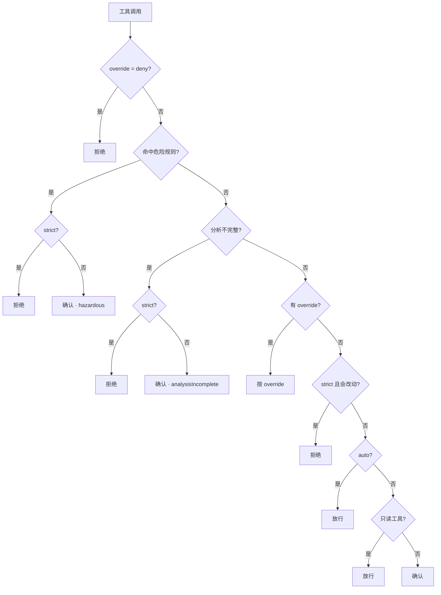

# 5. 工具面与权限

> 对照基准：[pi 第 5 章](../pi/05-tools-permissions.md)。pi 的 README 写着「No permission popups」，那一章的结论是「README 说的是真的」。Step-Code 在这里加的代码最多，也留下了最清楚的边界声明。

## 5.1 工具清单：换了一套名字

【代码事实】`packages/coding-agent/src/step/tool-profile.ts:61-71` 定义了模型看到的 9 个工具：

| Step-Code | 对应的 pi 原生工具 | 备注 |
| --- | --- | --- |
| `list_directory` | `ls` | |
| `find_files` | `find` | 5 秒超时（`:178-189`） |
| `search_files` | `grep` | 10 秒超时 |
| `read_file` | `read` | 默认 24,000 字符，上限 120,000 |
| `write_file` | `write` | |
| `edit_file` | `edit` | |
| `run_command` | `bash` | `timeout_ms` 1,000–600,000；`run_in_background` |
| `search_web` | — | 远端 MCP 的 `web_search`（`step/search-web-tool.ts`，269 行） |
| `find_tools` | — | 延迟加载的工具发现 |

再加产品功能带来的：`task_create` / `task_update`、`enter_plan_mode` / `exit_plan_mode`、`subagent` / `agent_send`、MCP 工具、workflow 相关工具。

工具的**实现**仍是 pi 的（`core/tools/`），`tool-profile.ts` 是一层重命名加参数整形加截断横幅（`:191-205`）。唯一的例外是 `run_command` 的 `run_in_background`：这条分支不走 pi 的 bash，而是 Step 自己的 `startBackgroundCommand`（`:1160`，分派在 `:1405-1409`），命令脱离会话启动、输出写日志文件、会话退出时终止——pi README 的「No background bash」在这里被补上了。整套工具面经 `main.ts` 新增的 `toolProfile` 选项注入（`main.ts:793-801`），作为 `customTools` 注册并默认关掉 pi 的内置工具（`:1228-1235`）。换名字的理由源码没写；【推断】是为了和 Step 模型训练时见过的工具名对齐——这也是「与模型一起调优」唯一能在客户端落地的地方。

## 5.2 权限：四档预设

```
// packages/coding-agent/src/step/permissions.ts
export const STEP_PERMISSION_PRESETS: readonly StepPermissionPreset[] = [
	{
		id: "ask",
		label: "Ask",
		description: "Safe tools run; writes and commands ask first",
		mode: "confirm",
		nonInteractiveApproval: "deny",
		autoResume: false,
	},
	{
		id: "read-only",
		label: "Read Only",
		description: "Read and discovery tools only",
		mode: "strict",
		nonInteractiveApproval: "deny",
		autoResume: false,
	},
	{
		id: "bypass",
		label: "Bypass",
		description: "Run ordinary tools without approval; dangerous commands still ask",
		mode: "auto",
		nonInteractiveApproval: "allow",
		autoResume: false,
	},
	{
		id: "autopilot",
		label: "Autopilot",
		description: "Bypass ordinary approvals and resume transient model failures",
		mode: "auto",
		nonInteractiveApproval: "allow",
		autoResume: true,
	},
];
```


每档是三元组（`mode`、`autoResume`、`nonInteractiveApproval`）的一个取值：

| 预设 | mode | 读 | 写 / 执行 | 危险命令 | 模型报错后 |
| --- | --- | --- | --- | --- | --- |
| Ask | `confirm` | 放行 | 逐次确认 | 确认（标「Dangerous」） | 停 |
| Read Only | `strict` | 放行 | 拒绝 | 拒绝 | 停 |
| Bypass | `auto` | 放行 | 放行 | **仍然确认** | 停 |
| Autopilot | `auto` | 放行 | 放行 | **仍然确认** | 自动续跑 |

「Bypass 下危险命令仍然确认」是写在预设描述里的（「dangerous commands still ask」）。没有哪一档能让危险命令静默通过。

## 5.3 判定函数：顺序即策略

`decideStepToolCall`（`permissions.ts:331-417`）的判定顺序：



四个细节，每个都是一个判断：

1. **危险规则排在 override 的 allow 之前**。用户给 `run_command` 配了 allow，`rm -rf` 仍然会问。只有 deny 能越过它。
2. **未知工具当作会改动**（`:391`）：`WRITE_OR_EXECUTE_TOOLS.has(name) || !READ_ONLY_TOOLS.has(name)`。新装的 MCP 工具默认要确认，而不是默认放行。
3. **分析失败不等于安全**：shell 配置读不出来时走 `catch`，结果是 `unresolved`，要求显式批准。
4. **无界面时 fail-closed**（`:535-546`）：没有 UI 可以弹确认时，只有「不危险、分析完整、且显式配了 `nonInteractiveApproval: "allow"`」三个条件同时成立才放行，否则 `block` 并 `terminate`。Bypass 档在「无人值守被拒或未配置」时还会被降回 confirm（`:518-521`）。

还有一处从事故里长出来的注释（`features/step.ts:313-318`）：切换快捷键**故意不持久化**——

> persisting it wrote the whole policy triple — including `nonInteractiveApproval: "allow"` under Bypass — to config.toml, so one keypress silently granted every later unattended `--print` run in that project permission to write and execute.

一次按键不该变成这个项目里所有后续无人值守运行的写权限。要持久化得用 `/permissions <preset>`。

## 5.4 危险命令：静态分析，三态结果

`step/command-policy.ts`（508 行）+ `step/shell-analysis.ts`（502 行，用 `unbash` 把命令解析成 AST）。

```
// packages/coding-agent/src/step/command-policy.ts
export type CommandPolicyAnalysis =
	| { kind: "matched"; ruleId: string }
	| { kind: "unresolved"; reason: string }
	| { kind: "ordinary" };

/** An ordinary result means no static rule matched, not that a program is sandboxed. */
export function analyzeCommandPolicy(command: string, dialect: "bash" | "unsupported" = "bash"): CommandPolicyAnalysis {
	const inspection = collectShellCommands(command);
	if (inspection.syntaxUnresolved) return { kind: "unresolved", reason: inspection.unresolved ?? "shell-syntax" };
	const rule = COMMAND_APPROVAL_RULES.find((candidate) =>
		candidate.kind === "shell" ? inspection.commands.some(candidate.matches) : candidate.pattern.test(command),
	);
	if (rule) return { kind: "matched", ruleId: rule.id };
	if (dialect !== "bash") return { kind: "unresolved", reason: "unsupported-shell" };
	if (inspection.unresolved) return { kind: "unresolved", reason: inspection.unresolved };
	return { kind: "ordinary" };
}

/** Detection alone is not authorization: callers must also handle unresolved analysis. */
```


规则表（`:88-105`）：递归强制删除、关机重启类、`mkfs`、`dd if=`、截断设备文件、破坏性 git（`reset --hard` / `clean -f` / `push --force`）、破坏性 SQL（`drop database` / `truncate table`）。

三态是这套设计的核心：

| 结果 | 含义 | 后续 |
| --- | --- | --- |
| `matched` | 命中某条规则 | 确认或拒绝 |
| `unresolved` | 分析没做完：非 bash 方言、脚本嵌套超过 12 层、超过 256,000 字符 | **也要确认**，标 `analysisIncomplete` |
| `ordinary` | 没有规则命中 | 按预设走 |

两句注释把边界说得很清楚：`:112`「An ordinary result means no static rule matched, **not that a program is sandboxed**」，`:125`「Detection alone is not authorization」。作者知道静态分析只能挡住认得出的写法，没有把它包装成安全保证。

## 5.5 沙箱：没有，并且明说

pi 的立场是「半吊子沙箱比没有更危险」，把隔离留给示例扩展。Step-Code 的状态：

- **没有 OS 级沙箱**，没有 seatbelt / landlock / 容器。
- **SDK 层显式拒绝**（`step/stdio-host.ts:439-443`）：宿主请求 `sandbox.enabled` 时返回 `SANDBOX_UNAVAILABLE`，原文是「sandbox.enabled was requested but the Step runtime has no sandbox adapter」；其它沙箱键被告知是 inert（`:1454-1456`）。
- `:430-434`：宿主没有提供权限回调时，`permissionMode` 默认取 `"dontAsk"`——注释写明「without a callback, approval-requiring tools must fail closed instead of running unguarded」。没人能批准，就不执行。

「请求了一个我没有的安全能力就报错」比「静默接受然后不生效」强得多。这是全仓最值得学的一处错误处理。

## 5.6 原样继承的缺口

以下全部是 pi 第 5 章已经指出、Step-Code 没有改的：

| 缺口 | 证据 | 后果 |
| --- | --- | --- |
| `!` 命令不过权限 | `apps/cli/src/ui/interactive-mode.ts:6630-6640` 发 `user_bash` 事件；除示例扩展外**没有任何代码注册这个事件的处理函数** | `user_bash` 明明在 `WRITE_OR_EXECUTE_TOOLS` 里（`permissions.ts:89-98`），但权限控制器只挂了 `tool_call`（`features/step.ts:242-244`）。Read Only 档下 `!rm -rf x` 照样执行 |
| 环境变量全量透传 | `utils/shell.ts:139-152`：`{...process.env, PATH}` | 模型跑的每条命令都能读到宿主的全部凭据 |
| 写操作无路径边界 | `core/tools/path-utils.ts:48-50`；工具描述直接写「absolute paths and ~/ home paths are accepted」（`tool-profile.ts:79-81`） | 能写仓库之外、能写 `.git`、能写 `.env` |
| 命令无默认超时 | `tool-profile.ts:1014-1018`：不传 `timeout_ms` 且上下文没配时为 `undefined` | 挂住的命令一直挂着 |

第一条的性质和别的不同。别的是「没做」；这一条是**做了权限系统之后留下的一个不对称**：模型的命令要过四档预设和静态分析，用户敲的 `!` 命令不过。从「用户自己敲的命令当然可信」的角度说得通——但 Read Only 这个名字给人的预期是整个会话只读。

## 5.7 Code Mode

没有。workflow 脚本（[第 6 章](./06-multi-agent.md)）跑在 QuickJS 里，但它编排的是 agent，不是工具调用；模型不能写一段代码批量调工具。

## 5.8 本章结论

1. 权限系统是 Step-Code 相对 pi 最大的一块策略：四档预设、三态静态分析、无界面时 fail-closed、未知工具默认要确认。
2. 它挂在 pi 的 `tool_call` 扩展事件上——所以**只管得住经过这个事件的东西**。`!` 命令不经过，于是不受管。
3. 没有沙箱，并且在 SDK 层用错误码明说。静态分析的注释也明说它不是沙箱。**诚实的边界声明比虚假的安全感值钱。**
4. 凭据透传、路径边界、默认超时三个缺口原样继承。
