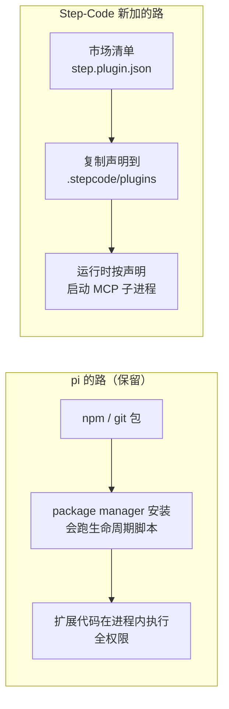

# 7. 扩展性与生态

> 对照基准：[pi 第 7 章](../pi/07-extensibility.md)。pi 的扩展面是四层（extensions / skills / prompt templates / themes）加 pi packages，扩展进程内全权限运行。Step-Code 把这四层原样保留，在旁边新开了两条更窄的路：MCP 和声明式插件。

## 7.1 扩展 API：一个字没改

【代码事实】

- 扩展事件：两边 `core/extensions/types.ts` 定义的事件**都是 36 个，集合完全相同**。
- API 类型唯一的新增是对话框的 `overlay?: boolean`（`core/extensions/types.ts:103-112`），注释解释的是一个终端渲染问题：内联对话框撑高文档后，关掉时滚不回来，编辑器会被「stranded above the bottom row」。
- `core/extensions/loader.ts` 与 pi 的差别只在 import 路径，外加一张虚拟模块映射表——**新旧两套包名都能解析**。这是有意的兼容：给 pi 写的扩展在 Step-Code 里 `import` pi 的包名也能拿到宿主模块（映射表的注释称这张表「只增不删」）。
- `core/skills.ts`：510 行 vs pi 507 行，只把项目资源目录名参数化了（`configDirName`），技能格式与发现逻辑原样。
- `core/prompt-templates.ts`、主题系统：原样。

也就是说，**pi 的扩展生态在 Step-Code 里是直接可用的**。Step-Code 自己就是这套 API 最大的用户——它的整个产品层是四个内联扩展（[第 2 章](./02-architecture-and-guardrails.md#22-产品层是怎么挂上去的)）。

继承下来的问题也一样：

| | pi | Step-Code |
| --- | --- | --- |
| 扩展隔离 | 无，进程内全权限 | 无 |
| 安装时跑 npm 生命周期脚本 | 是（`getNpmInstallArgs` 无 `--ignore-scripts`） | 是（`core/package-manager.ts:1770-1791`，三个包管理器分支都没加） |
| 项目级扩展的信任 | `--approve` / 信任提示 | 相同 |

【推断】Step-Code 自己的 CI 装依赖时用了 `--ignore-scripts`（`.github/workflows/ci.yml:35`），说明团队知道这条风险；但用户装扩展走的仍是 pi 的路径。

## 7.2 MCP：pi 明确不做，Step-Code 补上

pi 的 README 把「No MCP」列在第一条（`pi/packages/coding-agent/README.md:499-509`），理由是 MCP 的工具描述会吃掉大量上下文，建议用 CLI + skill 代替。Step-Code 加回来了：

| 文件 | 行数 | 职责 |
| --- | ---: | --- |
| `step/mcp.ts` | 525 | 启动服务器、把远端工具注册成本地工具 |
| `step/mcp-client.ts` | 124 | 客户端封装 |
| `step/mcp-oauth.ts` | 287 | 远程服务器的 OAuth |
| `step/mcp-import.ts` | 786 | 从 Claude Code / Codex 配置一次性导入 |

【代码事实】

- 两种传输：stdio 与 Streamable HTTP（`step/mcp.ts:4-5`）。
- 启动超时 30 秒、调用超时 300 秒（`:27-28`）。
- 远端工具通过 pi 的 `pi.registerTools` 注册（`:154`）——**MCP 也是长在扩展 API 上的**，没有另开一条工具通路，所以[第 5 章](./05-tools-permissions.md)的权限判定对 MCP 工具同样生效：它们不在只读白名单里，按「未知即可写」处理。
- 握手时上报的 `clientInfo.name` 仍是内部旧名（`:29`），属于残留。

【推断】pi 担心的上下文成本，Step-Code 的回答是 `find_tools`（`step/tool-profile.ts:1119`）：工具多了以后按需检索，而不是全部铺进 system prompt。是否在 MCP 工具上默认启用，要看运行时配置，本章不下结论。

### 配置导入的三条规则

`step/mcp-import.ts` 的文件头把规则写成了三句话：

```
// packages/coding-agent/src/step/mcp-import.ts
 * Three rules govern everything in this file.
 *
 * **Never throw.** These files belong to another tool. One `sse` server in
 * `~/.claude.json`, a truncated JSON read, or a `[mcp_servers]` table with a
 * stray value must not be able to stop Step from starting. Every server is
 * translated in isolation, and a failure becomes a reason string attached to
 * that one row.
 *
 * **Report what was dropped.** Both source schemas are larger than Step's, so
 * translation is lossy by construction. A silently ignored field is worse than
 * an absent one: the user configured it on purpose and would assume it still
 * applies. Each translator enumerates the keys it *consumed* and reports the
 * remainder, which also means a field added upstream later surfaces as a
 * warning instead of vanishing.
 *
 * **Never inline a secret.** Codex's `bearer_token_env_var` and
 * `env_http_headers` hold variable *names*. Step's schema has the same fields,
 * so the names are copied verbatim. Dereferencing them here would bake a live
 * token into a file on disk that the user never asked to hold one.
```


1. **Never throw**：别人的配置文件坏了，不能让自己起不来。
2. **Report what was dropped**：翻译必然有损，丢掉的字段要列出来——上游以后加了字段，也会以警告的形式冒出来，而不是悄悄消失。
3. **Never inline a secret**：Codex 配置里存的是**环境变量名**，照抄名字，不解引用。否则会把一个活的 token 写进一个用户从没打算存 token 的文件。

另外两个细节：只读打开外部文件，从不改写（`:7-8`）；一次性导入、用户逐条确认，而不是每次启动都去读别人的文件。两边配置了同一个服务器时，按字节比对去重，避免模型看到两份一模一样的工具集（`:244-252`）。

## 7.3 声明式插件市场

这是 Step-Code 在扩展性上**唯一做出的收窄**。`step/plugins.ts`（1,484 行）的文件头：

```
// packages/coding-agent/src/step/plugins.ts
/**
 * StepCode plugin marketplace facade.
 *
 * Pi's package manager can install executable extensions, but Step's built-in
 * marketplace has a deliberately smaller contract: marketplace packages are
 * declarative manifests copied into `.stepcode/plugins`. MCP processes are
 * started by the Step runtime after installation; this module owns discovery
 * and provisioning only.
 */
```


两条安装路径并存：



市场插件**不是代码**，是清单：声明要启动哪些 MCP 服务器、带哪些 skills / commands / agents 目录。代码只在独立的 MCP 子进程里运行，经由 MCP 协议进来，然后受同一套权限判定。

【代码事实】

- 清单文件 `step.plugin.json`；同时读 Claude Code 的 `.claude-plugin/plugin.json`；市场清单两个候选 `.step-plugin/marketplace.json` / `.claude-plugin/marketplace.json`（`:25-31`）。
- Claude Code 插件的兼容是在**边界上归一化**：`name` 映射成 `id`；没写 `mcpServers` 但旁边有 `.mcp.json` 就用它；没写目录字段但存在 `skills/` `commands/` `agents/` 就自动补上（`:360-377`）。`hooks` 不在支持范围里（全文件无此字段）——README 说的「most Claude Code plugins are directly compatible」，兼容的是这四类资源。
- 防御：插件名必须匹配 `SAFE_NAME`、清单不超过 512 KiB（`:42-43`）。
- `provision.requiresEnv`：插件声明需要哪些环境变量（只是名字）。最后三个提交（`4625966`、`e4434e2`，合并为 PR #189）都在修这一项：按**运行时环境**、按**每个被供给的服务器**判断是否满足。
- 内置市场只有一个插件 `steppage`（自家的静态站点托管），首次启动自动装；装过就记一个标记文件，「so a plugin the user later uninstalls is not silently resurrected on the next launch」（`:36-41`）。

【推断】这是在 pi「扩展 = 任意代码」的模型旁边，开了一条「插件 = 声明 + 子进程」的路。它没有解决 pi 扩展的隔离问题（那条路还在），但给市场分发的东西加了一层能力声明，并把代码挪到了进程外。

## 7.4 Provider 扩展：自己就是第一个用户

pi 的 `registerProvider` 保留，Step-Code 唯一的 provider 也是这样注册的（`features/step-provider/index.ts:60-64`）。`providers` 包里 40 个内置 provider 删光，但适配层（`dialect/`）保留（[第 1 章](./01-product-teardown.md)）——第三方要接别的模型，路还是通的，只是不再开箱即用。

## 7.5 本章结论

1. 扩展 API、skills、prompt 模板一字未改，pi 的扩展可以直接装。继承的风险（无隔离、安装跑脚本）也一并继承。
2. MCP 补上了，而且长在 `registerTools` 上，自然落入权限判定。
3. 配置导入的三条规则（不抛错、报告丢弃、不内联密钥）是一份可直接照抄的「读别人配置」规范。
4. 声明式插件是唯一的收窄：市场里分发的是清单，代码跑在 MCP 子进程里。
