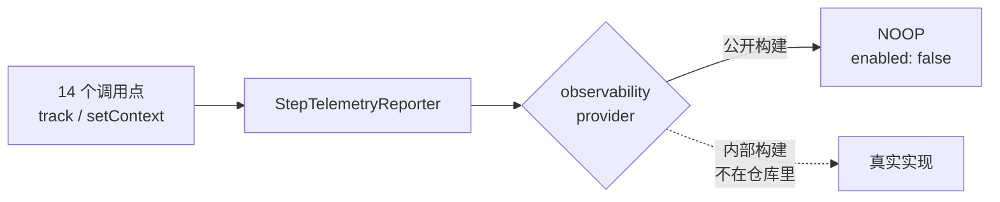

# 8. 可观测性

> 对照基准：[pi 第 8 章](../pi/08-observability.md)。pi 的可观测性是「事件流 + JSONL 会话文件」，外加一个默认开启的安装计数 ping（`enableInstallTelemetry`）。Step-Code 做了一件看起来矛盾的事：**定义了一套完整的遥测契约，然后在公开构建里把它接成 no-op。**

## 8.1 契约有，实现没有

【代码事实】`step/telemetry-events.ts`（867 行）定义了 **50 个事件**，每个事件都有属性名白名单（`:301` 一带的 `propertyNames(...)`）和类型。覆盖面很全：

| 类别 | 例子 |
| --- | --- |
| 生命周期 | `cli_started`、`crash`、`system_metrics` |
| 循环 | `turn_completed`、`tool_call_completed`、`tool_call_repeat` |
| 模型 | `model_request_completed` |
| 策略 | `permission_decision`、`autopilot_resume` |
| 上下文 | `compaction_finished` |
| 生态 | `mcp_server_connected`、`subagent_task_created` |
| 后台与交付 | `background_command_finished`、`mr_created` |

然后是组合缝。`step/telemetry-contract.ts`：

```
// packages/coding-agent/src/step/telemetry-contract.ts
/** Composition seam for environment-specific observability implementations. */
export interface StepObservabilityProvider {
	createReporter(config?: StepObservabilityConfig): StepTelemetryReporter;
	createModelRequestObserver(reporter: StepTelemetryReporter): ModelRequestObserver | undefined;
	createSystemMetrics?(reporter: StepTelemetryReporter): ObservabilitySystemMetrics | undefined;
	installCrashHandlers?(reporter: StepTelemetryReporter): ObservabilityCrashHandlers | undefined;
	traceHeaderPolicy(): TraceHeaderPolicy;
}

/** Public builds intentionally do not send telemetry or trace identity. */
export const NOOP_OBSERVABILITY_PROVIDER: StepObservabilityProvider = {
	createReporter: () => ({ enabled: false, track: () => undefined, setContext: () => undefined }),
	createModelRequestObserver: () => undefined,
	traceHeaderPolicy: () => ({ allowedBaseUrls: [], highSensitivityFields: [] }),
};
```


`apps/cli/src/observability.ts` 的全部有效内容是一行：`export const observability = NOOP_OBSERVABILITY_PROVIDER;`。

`createReporter` 返回 `enabled: false`、`track` 是空函数；`createSystemMetrics` 和 `installCrashHandlers` 两个可选方法干脆没实现。全仓有 14 个源文件调用上报接口（例如 `/init` 命令会 `recordStepSlashCommand`，`features/step.ts:296`），在公开构建里这些调用全部落空。



再加一道闸门：`scripts/check-no-observability.mjs`（81 行）在 CI 里扫描公开仓库，禁止出现内部遥测实现的特征串（[第 2 章](./02-architecture-and-guardrails.md)）。也就是说，**no-op 不是「还没写」，是被守着不许写进来。**

【推断】这是「一套代码、两种发行」的典型做法：事件契约、调用点、属性白名单都在公开仓库里，可审计；真正的上报实现由宿主环境在组合时注入。好处是公开版的隐私承诺可以靠读代码验证；代价是公开版的使用者**没有任何内建的运行数据**——50 个事件只能看定义，看不到值。

### 一个定义了但没人发的事件

`tool_call_repeat`（`telemetry-events.ts:65,510`）的属性是 `tool_name` / `attempt_count` / `limit`——这正是防死循环需要的数据。但全仓没有任何地方发出这个事件，循环里也没有对应的计数器（[第 3 章](./03-agent-loop.md#33-没补的防死循环)）。契约走在了实现前面。

## 8.2 请求头：默认只说「我是谁」

模型请求的附加头由 `features/step.ts:264-291` 挂在 pi 的 `before_provider_headers` 扩展事件上，调用 `applyStepTraceHeaders`：

```
// packages/coding-agent/src/step/trace-headers.ts
 * Add Step attribution headers in place.
 *
 * `x-step-client` is sent on every request. The high-sensitivity fields
 * (session/workspace/goal/...) are sent only when the request URL matches
 * `options.allowedBaseUrls` AND the field appears in
 * `options.highSensitivityFields`; an omitted or empty field list sends none of
 * them (fail closed), so the local cwd and session id never egress to a
 * third-party model endpoint. Values are size-bounded and header-safe via
 * {@link encodeStepTraceHeaderValue}.
 */
export function applyStepTraceHeaders(
	headers: Record<string, string | null>,
	trace: StepTraceContext,
	options: StepTraceHeaderOptions = {},
): void {
	setHeader(headers, "x-step-client", options.clientType ?? "cli");

	const traceAllowed =
		options.requestUrl === undefined ||
		options.allowedBaseUrls === undefined ||
		matchesStepTraceBaseUrl(options.requestUrl, options.allowedBaseUrls);
	if (!traceAllowed) return;

	const fields = options.highSensitivityFields;
	// Fail closed: a policy that omits the field list (undefined) must not leak
	// every high-sensitivity header — treat it the same as an empty allowance.
	if (!fields || fields.length === 0) return;
	const allowed = new Set(fields);
	const setIfAllowed = (field: string, value: string | undefined): void => {
		if (allowed.has(field)) setHeader(headers, `x-step-${field}`, value);
	};
	setIfAllowed("session-id", trace.sessionId);
	setIfAllowed("goal-id", trace.goalId);
	setIfAllowed("attempt-id", trace.attemptId);
	setIfAllowed("harness-id", trace.harnessId);
	setIfAllowed("span-id", trace.spanId);
	setIfAllowed("workspace-id", trace.workspaceId);
	setIfAllowed("provider-id", trace.provider);
	setIfAllowed("model", trace.model);
}
```


规则：

- `x-step-client` **每个请求都发**，值默认是 `cli`。
- 会话 id、工作区（缺省是 **cwd**）、goal / attempt / span id 等 8 个高敏感字段，必须同时满足「请求地址在允许列表里」**且**「字段在允许字段列表里」才发。
- 字段列表缺省（`undefined`）与空列表等价——**fail closed**（`:74-76`）。

公开构建的策略来自 NOOP provider：`allowedBaseUrls: []`、`highSensitivityFields: []`。所以**公开版发出去的只有 `x-step-client`**，本地路径和会话 id 不出本机。

调用点的注释（`features/step.ts:267-271`）还写了一个自认的漏洞：如果有人覆盖了 `STEP_BASE_URL` 但仍用 `step` 这个 provider id，归因头会跟着发到别的主机。在公开构建里这个漏洞不生效（字段列表为空），在注入了真实策略的构建里才有意义。

## 8.3 从 pi 删掉的、加上的

| | pi | Step-Code |
| --- | --- | --- |
| 安装计数 ping | `enableInstallTelemetry`，默认开（`pi/packages/coding-agent/src/core/settings-manager.ts:116,1010`） | **整项删除**，设置里没有这个键 |
| 更新检查 | 有 | 重写：`step/local-update.ts`（653 行） |
| 会话存储 | JSONL 会话树 | 原样（`core/session-manager.ts` 只改了 4 行 import） |
| 开发日志 | — | `step/stderr-dev-log.ts`（582 行），保留 7 天，写入前过脱敏 |
| 用户反馈 | — | `step/feedback/`（15 个文件 3,101 行），用户确认后打包上传 |
| 密钥脱敏 | — | `step/secret-redaction.ts`（1,245 行） |

### 更新检查

【代码事实】`step/local-update.ts`：

- 只在交互式 TTY 下检查，超时 1.5 秒（`UPDATE_CHECK_TIMEOUT_MS = 1_500`）。
- 两个环境变量可以关：`STEPCODE_DISABLE_UPDATE_CHECK`、`STEPCODE_DISABLE_TUI_UPDATE_CHECK`。
- `step update` 下载后做 sha256 校验，不符就报「archive checksum verification failed」（`:115-118`），校验文件本身的格式也先检查（`:500`）。

这是公开构建里**唯一一个主动的出站请求**（模型调用与用户触发的功能之外），而且只拉清单，不带本地信息。

### 反馈：出口在用户手里

`step/feedback/endpoints.ts` 第 1 行：「Feedback routes are supplied by the host environment; source builds have no default route.」——端点由构建时的环境变量注入，**从源码构建的版本没有默认上报地址**。有地址时，打包前要过用户确认界面（`consent.ts`），会话文件单项上限 8 MiB、总包 48 MiB（`pending-store.ts:35-43`），诊断信息过一遍脱敏（`redact-diagnostics.ts`）。

### 脱敏放在出口，不在存储

【代码事实】`secret-redaction.ts` 被开发日志和反馈两条出口调用；会话 JSONL 本身不脱敏（会话管理器与 pi 相同）。

【推断】这与 pi 的立场一致——本地文件是用户自己的；Step-Code 只在**数据要离开**（写进共享日志目录、上传反馈）时脱敏。代价是会话文件里出现过的密钥会原样留在磁盘上。

## 8.4 仍然没有的

和 pi 一样，下面这些都没有：`doctor` 诊断命令、`unhandledRejection` 兜底、SQLite 会话后端、provider 请求的录制与回放。可观测性的主体仍是 pi 的事件流和 JSONL。

## 8.5 本章结论

1. 遥测是**构造上的 no-op**：契约、调用点、属性白名单都公开，实现由宿主注入，并有闸门防止实现混进公开仓库。
2. 追踪头 fail closed：公开版只发一个客户端标识。
3. pi 默认开启的安装 ping 被删掉，没有新的上报端点；唯一的主动出站是更新检查。
4. 脱敏在出口而不在存储；会话文件与 pi 一样原样落盘。
5. `tool_call_repeat` 是「契约走在实现前面」的例子：数据结构已经替防死循环想好了，循环里还没有。
